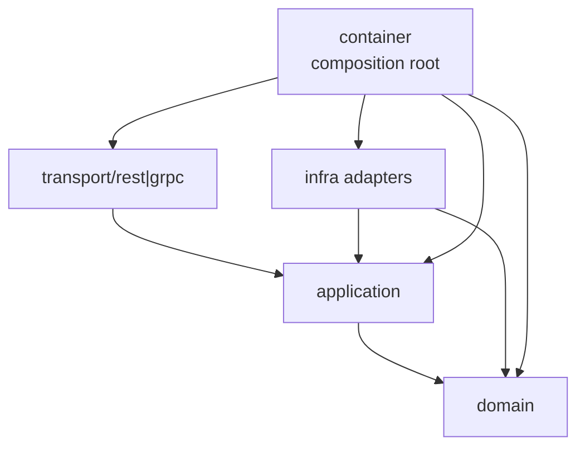

# 六边形架构实践

本文回答：IAM 当前如何落地端口、适配器和依赖方向；为什么 transport 不直接写业务规则，infra 不成为业务事实源，container 可以看见多层类型。

## 30 秒结论

- REST/gRPC 是 driving adapters，位于 [../../internal/apiserver/transport](../../internal/apiserver/transport)，只负责协议映射和调用 application。
- 应用层位于 [../../internal/apiserver/application](../../internal/apiserver/application)，负责用例编排、事务、DTO/command/query 和端口调用。
- 领域层位于 [../../internal/apiserver/domain](../../internal/apiserver/domain)，负责领域对象、领域服务、规则和部分端口接口。
- 基础设施位于 [../../internal/apiserver/infra](../../internal/apiserver/infra)，负责 MySQL、Redis、Casbin、JWT、Outbox、微信/IDP 等 driven adapters。
- [../../internal/apiserver/container](../../internal/apiserver/container) 是组合根；它的职责就是把模块、端口、实现和 transport dependency 组装起来。

## 分层速查

| 层 | 目录 | 主要职责 | 不应该做什么 |
| ---- | ---- | ---- | ---- |
| Driving adapters | [../../internal/apiserver/transport](../../internal/apiserver/transport) | REST/gRPC 请求响应映射、认证上下文读取、错误映射 | 不直接写业务规则和事务 |
| Application | [../../internal/apiserver/application](../../internal/apiserver/application) | 用例、命令、查询、事务编排、端口调用 | 不依赖 Gin、gRPC server、具体 Redis client |
| Domain | [../../internal/apiserver/domain](../../internal/apiserver/domain) | 领域模型、领域服务、不变量、策略对象 | 不依赖 MySQL/GORM/JWT/微信 SDK |
| Driven adapters | [../../internal/apiserver/infra](../../internal/apiserver/infra) | 仓储、Redis、Casbin、JWT、Outbox、外部 API | 不定义业务语义事实 |
| Composition root | [../../internal/apiserver/container](../../internal/apiserver/container) | 装配模块依赖、能力注册、transport deps | 不承载业务规则 |

## 依赖方向



这张图有两个重点：

1. 运行时调用方向可能从 transport 到 application 到 infra，但代码依赖要尽量保持业务层不认识协议和基础设施细节。
2. container 是例外点。组合根如果不能看到多层类型，就无法完成依赖注入和模块装配；因此它的边界是“装配可以复杂，规则不能在这里生长”。

## 当前落地示例

| 能力 | 领域/应用 | 基础设施适配器 | transport |
| ---- | ---- | ---- | ---- |
| AuthN Token/JWKS | [../../internal/apiserver/application/authn/token](../../internal/apiserver/application/authn/token)、[../../internal/apiserver/application/authn/jwks](../../internal/apiserver/application/authn/jwks) | [../../internal/apiserver/infra/token](../../internal/apiserver/infra/token)、[../../internal/apiserver/infra/cache/redis](../../internal/apiserver/infra/cache/redis) | REST/gRPC AuthN handler |
| AuthZ | [../../internal/apiserver/application/authz](../../internal/apiserver/application/authz)、[../../internal/apiserver/domain/authz](../../internal/apiserver/domain/authz) | [../../internal/apiserver/infra/casbin](../../internal/apiserver/infra/casbin)、MySQL repos | REST/gRPC AuthZ handler |
| ProfileLink | [../../internal/apiserver/application/uc/profilelink](../../internal/apiserver/application/uc/profilelink)、[../../internal/apiserver/domain/uc/profilelink](../../internal/apiserver/domain/uc/profilelink) | MySQL repos/UoW | REST Identity、gRPC Identity |
| IDP 微信应用 | [../../internal/apiserver/application/idp/wechatapp](../../internal/apiserver/application/idp/wechatapp)、[../../internal/apiserver/domain/idp/wechatapp](../../internal/apiserver/domain/idp/wechatapp) | SecretVault、Redis cache、微信 provider | REST IDP、gRPC IDP |
| CacheGovernance | [../../internal/apiserver/application/cachegovernance](../../internal/apiserver/application/cachegovernance) | Redis inspectors、JWKS snapshot inspector | REST debug route |

## 设计取舍

- DTO/mapper 放在 transport 层，避免 wire 字段进入 domain。
- UoW 放在 application 和 infra 之间，application 负责事务意图，infra 负责具体 GORM 事务。
- CacheGovernance 是只读治理面，可以读取 infra inspector，但不能反向改写缓存。
- SDK 在 `pkg/sdk`，属于对外接入产品层，不属于 apiserver 内部业务分层。

## 维护规则

- 新 REST/gRPC handler 只调用 application service，不直接调用 GORM/Redis。
- 新领域规则优先落在 domain service 或 policy object，不塞进 transport。
- 新基础设施实现要通过端口接入，避免 application 硬编码具体库。
- 新模块依赖在 container 中装配，并补足架构/transport 测试。

## 验证

```bash
go test ./internal/pkg/architecture ./internal/apiserver/container ./internal/apiserver/transport/...
```
