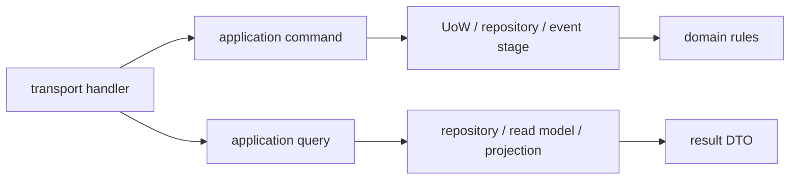

# CQRS 模式实践

本文回答：IAM 当前哪里使用命令/查询分离，分离粒度是什么，以及什么时候应该拆 command/query、什么时候保持一个应用服务即可。

## 30 秒结论

- CQRS 在 IAM 中是应用层实践，不是全局强制框架，也不是必须拆独立读库。
- AuthZ、User/ProfileLink、Suggest 等模块有明显 command/query 或读写边界。
- REST/gRPC handler 只做协议适配；命令、查询、事务和投影语义在 application 层表达。
- 如果一次用例需要读写协作，由 application service 编排，不把事务逻辑塞进 transport。

## 当前 CQRS 位置

| 模块 | 命令 | 查询 | 说明 |
| ---- | ---- | ---- | ---- |
| AuthZ Role | [../../internal/apiserver/application/authz/role/command_service.go](../../internal/apiserver/application/authz/role/command_service.go) | [../../internal/apiserver/application/authz/role/query_service.go](../../internal/apiserver/application/authz/role/query_service.go) | 角色写入和读取分离。 |
| AuthZ Resource | [../../internal/apiserver/application/authz/resource/command_service.go](../../internal/apiserver/application/authz/resource/command_service.go) | [../../internal/apiserver/application/authz/resource/query_service.go](../../internal/apiserver/application/authz/resource/query_service.go) | 资源注册、更新、读取分离。 |
| AuthZ Policy | [../../internal/apiserver/application/authz/policy/command_service.go](../../internal/apiserver/application/authz/policy/command_service.go) | [../../internal/apiserver/application/authz/policy/query_service.go](../../internal/apiserver/application/authz/policy/query_service.go) | 策略写入涉及版本和事件。 |
| ProfileLink | [../../internal/apiserver/application/uc/profilelink/service_command.go](../../internal/apiserver/application/uc/profilelink/service_command.go) | [../../internal/apiserver/application/uc/profilelink/service_query.go](../../internal/apiserver/application/uc/profilelink/service_query.go) | 建立/撤销关系与查询关系分开。 |
| Suggest | [../../internal/apiserver/application/suggest/refresher.go](../../internal/apiserver/application/suggest/refresher.go) | [../../internal/apiserver/application/suggest/service.go](../../internal/apiserver/application/suggest/service.go) | 刷新读模型和查询联想分开。 |

## 基本形态



CQRS 在这里解决的不是“技术炫技”，而是两个实际问题：

- 写侧通常需要校验、事务、事件、幂等和审计。
- 读侧通常需要筛选、分页、投影和空结果处理。

把二者拆开后，handler 可以更清晰地选择 command 或 query，测试也能更聚焦。

## 何时拆分

| 信号 | 建议 |
| ---- | ---- |
| 写入需要事务、事件 stage 或版本递增 | 拆 command service。 |
| 查询需要复杂过滤、分页或投影 | 拆 query service。 |
| 同一对象既有管理写入又有高频读取 | 拆 command/query。 |
| 用例很小，只是简单读取或简单写入 | 可以先保持一个服务，避免过度拆分。 |
| 查询形状已经不同于写模型 | 使用 read model 或 projector。 |

## 与接口层的关系

- REST `GET` 通常映射 query，但不等于所有 query 都只能 REST 暴露。
- REST `POST/PATCH/DELETE` 通常映射 command，但 handler 不负责事务细节。
- gRPC service 可以同时暴露 command 和 query 方法；真正分离在 application 层。
- SDK 只消费稳定接口，不继承服务端内部 CQRS 包结构。

## 风险边界

- 不要把 CQRS 理解为“必须拆数据库”。
- 不要让 query service 修改状态，即使只是“顺手更新最后访问时间”。
- 不要让 command handler 直接拼 SQL 或 Redis 操作。
- 不要为了形式把简单用例拆成过多空壳文件。

## 验证

```bash
go test ./internal/apiserver/application/authz/... ./internal/apiserver/application/uc/... ./internal/apiserver/application/suggest
```
