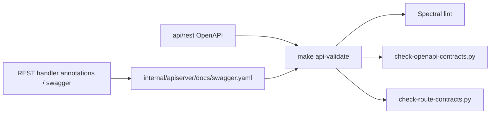

# 命令、契约校验与开发流程

本文回答：IAM 当前开发、文档维护、REST/proto 合同维护和数据库基础设施变更应该跑哪些命令；哪些命令需要 Docker 或外部服务前置条件。

## 30 秒结论

- 普通文档改动至少跑 `make docs-hygiene`。
- 普通 Go 改动至少跑对应 package tests；提交前建议跑 `go test ./...` 或 `make test`。
- REST/OpenAPI/swagger 相关改动要跑 `make docs-swagger` 和 `make api-validate`。
- proto/gRPC/SDK 相关改动要跑 `make proto-gen` 和 transport/SDK tests。
- `make api-validate` 依赖 Docker daemon；Docker 不可用时至少运行两个 Python 合同检查脚本。

## 常用命令

| 命令 | 说明 | 前置条件 |
| ---- | ---- | ---- |
| `make build` | 构建 apiserver | Go toolchain |
| `make test` | 运行 Makefile 定义的 Go 测试 | Go toolchain |
| `go test ./...` | 直接运行全仓 Go 测试 | Go toolchain |
| `make docs-hygiene` | 检查活跃 Markdown 链接和退役事实引用 | Python |
| `make docs-swagger` | 从代码重新生成 swagger | swag 工具链 |
| `make api-validate` | OpenAPI lint、swagger/OpenAPI/路由比对 | Docker daemon + Python |
| `make proto-gen` | 生成 protobuf Go 代码 | protoc / buf 相关工具 |
| `make cert-gen` | 生成开发环境自签名 Web 证书 | openssl / shell |
| `make grpc-cert-verify` | 验证 gRPC mTLS 证书 | infra 证书文件存在 |
| `make db-bootstrap` | 重放系统 bootstrap 基线数据 | MySQL 可连接 |

## 契约校验链路



`make api-validate` 调用 [../../scripts/validate-openapi.sh](../../scripts/validate-openapi.sh)，包含：

1. Spectral lint：检查 [../../api/rest](../../api/rest)。
2. [../../scripts/check-openapi-contracts.py](../../scripts/check-openapi-contracts.py)：比较 swagger definitions 和 OpenAPI components。
3. [../../scripts/check-route-contracts.py](../../scripts/check-route-contracts.py)：比较 swagger paths 和 OpenAPI paths。

Docker daemon 不可用时，Spectral 不能跑；仍应至少运行：

```bash
python scripts/check-openapi-contracts.py
python scripts/check-route-contracts.py
```

## 文档校验

`make docs-hygiene` 调用 [../../scripts/check-docs-links.py](../../scripts/check-docs-links.py)，检查活跃 Markdown 的相对链接、代码路径引用和退役事实关键词。归档区默认不参与校验。

文档改动的推荐流程：

```bash
make docs-hygiene
git diff --check -- docs
```

如果文档新增了接口、路由或 proto 表述，应补跑对应 transport/SDK tests，避免文档把未实现能力写成当前事实。

## 常见改动的验证矩阵

| 改动类型 | 建议命令 |
| ---- | ---- |
| 只改 Markdown | `make docs-hygiene`、`git diff --check -- docs` |
| 改 REST handler 或 OpenAPI | `make docs-swagger`、`make api-validate`、`go test ./internal/apiserver/transport/rest` |
| 改 proto 或 gRPC service | `make proto-gen`、`go test ./internal/apiserver/transport/grpc/... ./pkg/sdk/...` |
| 改 AuthZ policy/outbox | `go test ./internal/apiserver/application/authz/... ./internal/apiserver/infra/mysql/eventoutbox ./internal/apiserver/infra/messaging` |
| 改 migration | `go test ./internal/pkg/migration/...`，并人工检查 up/down SQL |
| 改 SDK public API | `go test ./pkg/sdk/...` |

## 推荐提交前流程

```bash
make docs-hygiene
go test ./...
```

涉及 REST/gRPC 契约时再运行：

```bash
make api-validate
make proto-gen
```
