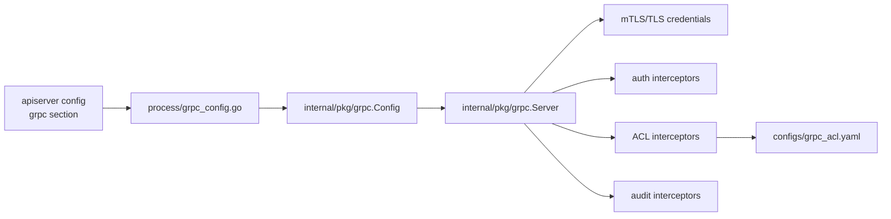

# 端口、证书与数据库迁移

本文回答：IAM 运行时端口、TLS/mTLS、gRPC ACL 和数据库迁移从哪里配置；开发、生产、证书验证和迁移排障应看哪些文件。

## 30 秒结论

- REST 和 gRPC 由同一 `iam-apiserver` 进程承载；入口配置来自 [../../configs/apiserver.dev.yaml](../../configs/apiserver.dev.yaml) 和 [../../configs/apiserver.prod.yaml](../../configs/apiserver.prod.yaml)。
- gRPC TLS/mTLS、认证、ACL、audit 由 [../../internal/apiserver/process/grpc_config.go](../../internal/apiserver/process/grpc_config.go) 映射到 [../../internal/pkg/grpc](../../internal/pkg/grpc)。
- ACL 配置在 [../../configs/grpc_acl.yaml](../../configs/grpc_acl.yaml)，用于限制 service/method 调用。
- 数据库迁移文件位于 [../../internal/pkg/migration/migrations](../../internal/pkg/migration/migrations)，运行时迁移逻辑在 [../../internal/apiserver/process/database.go](../../internal/apiserver/process/database.go)。
- 证书辅助命令集中在 Makefile 的 `cert-*` 和 `grpc-cert-*` targets。

## 端口和进程入口

| 能力 | 配置 / 代码入口 | 说明 |
| ---- | ---- | ---- |
| Web serving | [../../configs/apiserver.dev.yaml](../../configs/apiserver.dev.yaml)、[../../configs/apiserver.prod.yaml](../../configs/apiserver.prod.yaml) | HTTP/REST 监听和 TLS 配置。 |
| gRPC serving | `grpc:` 配置段 | gRPC 监听、healthz、mTLS、ACL、auth。 |
| HTTP server lifecycle | [../../internal/apiserver/process/server_lifecycle.go](../../internal/apiserver/process/server_lifecycle.go) | HTTP server 启停。 |
| gRPC server lifecycle | [../../internal/apiserver/process/bootstrap.go](../../internal/apiserver/process/bootstrap.go)、[../../internal/apiserver/process/shutdown_lifecycle.go](../../internal/apiserver/process/shutdown_lifecycle.go) | gRPC build/register/close。 |
| run group | [../../internal/apiserver/process/run_group.go](../../internal/apiserver/process/run_group.go) | HTTP/gRPC 等运行单元并行运行。 |

## gRPC 安全配置链路



安全边界建议：

- 生产环境优先启用 mTLS，并要求客户端证书。
- service token 仍应通过 metadata 传递，mTLS 不替代业务身份。
- ACL 默认策略要谨慎，新增 RPC 时要同步评估 ACL。
- healthz 端口用于探针，不应暴露业务能力。

## 证书命令

| 命令 | 用途 |
| ---- | ---- |
| `make cert-gen` | 生成开发环境自签名 Web 证书。 |
| `make cert-test` | 测试 Web 证书配置。 |
| `make cert-verify` | 查看 Web 证书 subject/issuer/有效期/SAN。 |
| `make grpc-cert-verify` | 验证 gRPC mTLS 证书链。 |
| `make grpc-cert-info` | 查看 gRPC server cert 详情。 |

gRPC 证书路径在 dev/prod 配置中不同：开发配置使用 `/data/infra/ssl/grpc/...`，生产配置使用 `/etc/iam/grpc/...`。文档不要把某个环境路径写成通用事实。

## 数据库迁移

迁移文件位于 [../../internal/pkg/migration/migrations](../../internal/pkg/migration/migrations)。

| 文件 | 说明 |
| ---- | ---- |
| `000001_init_schema` | 初始 schema，整合基础表结构。 |
| `000005_bootstrap_system_data` | 系统 bootstrap 基线数据。 |
| `000006_add_domain_event_outbox` | transactional outbox 表。 |
| `000007_add_active_self_profile_link_guard` | ProfileLink active self guard。 |
| `000008_add_authz_scope` | AuthZ scope。 |

迁移流程要点：

- 运行时是否执行 migration 由配置控制。
- 迁移逻辑会先建立数据库连接并 ping，再创建 migrator。
- `schema_migrations` 记录当前版本。
- 新 migration 必须提供 up/down，并考虑幂等性和回滚边界。

## 验证

```bash
go test ./internal/apiserver/process ./internal/pkg/grpc ./internal/pkg/migration/...
make grpc-cert-verify
```

`make grpc-cert-verify` 依赖本机存在 infra 生成的 gRPC 证书文件；没有证书时应记录前置条件，而不是把失败当成代码错误。
