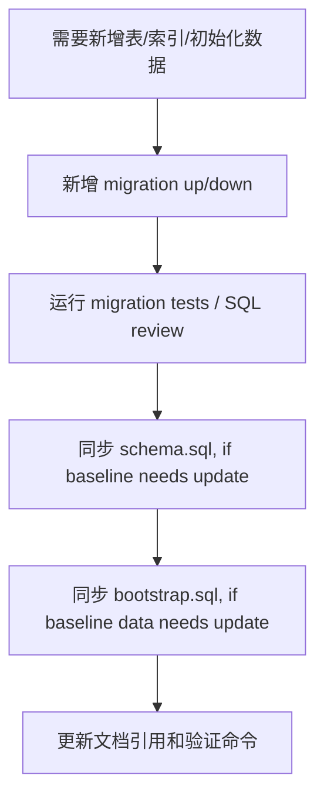

# SQL Bootstrap 与初始化数据

本文回答：`schema.sql`、`bootstrap.sql` 和 migration 的职责边界；新增表结构、索引、系统角色、默认权限或初始化数据时，应该先改哪里、如何验证。

## 30 秒结论

- 运行时数据库演进以 migration 为准。
- [../../configs/mysql/schema.sql](../../configs/mysql/schema.sql) 是完整表结构基线，适合离线阅读、开发环境初始化和人工比对。
- [../../configs/mysql/bootstrap.sql](../../configs/mysql/bootstrap.sql) 是可手动重放的初始化数据基线。
- [../../internal/pkg/migration/migrations/000005_bootstrap_system_data.up.sql](../../internal/pkg/migration/migrations/000005_bootstrap_system_data.up.sql) 是自动迁移里的系统数据基线。
- 初始化数据必须幂等，避免重复执行造成重复角色、重复权限或约束冲突。

## 职责边界

| 文件 | 用途 | 维护规则 |
| ---- | ---- | ---- |
| `configs/mysql/schema.sql` | 给人和离线环境看的结构基线 | 新表/索引最终应同步到这里，但不能替代 migration。 |
| `configs/mysql/bootstrap.sql` | 手动初始化或重放基础数据 | 必须幂等，适合开发和恢复场景。 |
| `internal/pkg/migration/migrations/*.sql` | 应用启动或迁移流程使用的演进事实 | 新结构和系统数据先进入 migration。 |
| `schema_migrations` | 迁移版本记录表 | 由 migrator 维护，不手工改。 |

## 推荐变更顺序



不要先改 `schema.sql` 后忘记 migration。运行时真正执行的是 migration；基线 SQL 只能帮助初始化、阅读和人工排查。

## 初始化数据类型

| 数据类型 | 建议位置 | 注意点 |
| ---- | ---- | ---- |
| 系统角色、权限、资源 | migration + bootstrap 基线 | 必须幂等，避免重复插入。 |
| 开发环境演示账号 | bootstrap 或 seed mock | 不应混入生产 migration。 |
| 表结构和索引 | migration | schema 基线后续同步。 |
| 事件/outbox 表 | migration | 需要和应用代码状态机匹配。 |
| ProfileLink 约束 | migration | 需要和领域不变量一致。 |

## Bootstrap 与业务事实

Bootstrap 数据应只表达系统启动必须存在的基础事实，例如平台角色、基础权限、内置资源等。它不应该承载：

- 某个业务客户的具体数据。
- 一次性修复脚本。
- 依赖环境的密钥或 token。
- 会随业务操作变化的普通运行数据。

这些内容应该走单独运维流程、管理 API 或数据修复脚本。

## 验证

```bash
make db-bootstrap DB_USER=root DB_PASSWORD=yourpassword
go test ./internal/pkg/migration/...
```

`make db-bootstrap` 需要可连接的 MySQL。仅改文档或离线检查时，可以先跑 migration package tests，并人工检查 SQL 是否幂等。
