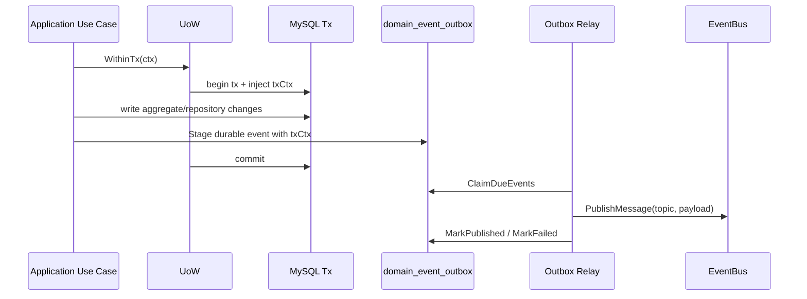

# UoW 与 Transactional Outbox

本文回答：IAM 当前如何把一次应用用例内的数据库一致性、事务后本地副作用、以及可靠事件发布放在同一套边界里管理。

## 30 秒结论

- 应用层继续使用 `uow.WithinTx(ctx, func(txCtx, tx) error)` 表达用例事务边界。
- 事务回调内部访问 tx-scoped repository 或领域协作者时必须传 `txCtx`，不能继续传外层 `ctx`。
- MySQL UoW 现在通过 `context.Context` 注入事务；已有事务时采用 `Required` 传播语义，复用外层事务，不默认创建嵌套事务。
- durable 事件必须在事务内通过 outbox stager 写入 `domain_event_outbox`，事务回滚时事件同步回滚。
- best-effort 事件可以通过 catalog-backed publisher 直发，当前只有 `iam.login_otp_sms`；`sms.provider=mq` 要求 EventBus 可用，不会静默退化为 logging 成功。
- 本地非可靠副作用使用事务成功后的 best-effort 路径，例如 Casbin runtime policy reload；它不进入 outbox。

## 当前实现

| 关注点 | 位置 | 说明 |
| ---- | ---- | ---- |
| UoW 核心 | [../../pkg/uow/gorm/uow.go](../../pkg/uow/gorm/uow.go) | `WithinTransaction`、tx context、`AfterCommit`、nil DB fail-closed |
| Repository tx 感知 | [../../internal/pkg/database/mysql/base.go](../../internal/pkg/database/mysql/base.go) | `WithContext(ctx)` 优先读取 ctx 中的事务 |
| 应用 UoW 端口 | [../../internal/apiserver/application/authz/uow/uow.go](../../internal/apiserver/application/authz/uow/uow.go) | application 只看 `TxRepositories` 与 `UnitOfWork` |
| Outbox store | [../../internal/apiserver/infra/mysql/eventoutbox/store.go](../../internal/apiserver/infra/mysql/eventoutbox/store.go) | 事务内 stage、claim、mark published/failed、状态快照 |
| Relay | [../../internal/apiserver/infra/messaging/outbox_relay.go](../../internal/apiserver/infra/messaging/outbox_relay.go) | 同进程轮询 due events 并发布到 MQ |
| Event catalog | [../../pkg/eventcatalog](../../pkg/eventcatalog)、[../../configs/events.yaml](../../configs/events.yaml) | 通用 catalog parser + IAM 事件配置真值 |
| Event codec/runtime | [../../pkg/eventcodec](../../pkg/eventcodec)、[../../pkg/eventmessaging](../../pkg/eventmessaging)、[../../pkg/eventruntime](../../pkg/eventruntime) | legacy payload 编码、component-base message adapter 和 catalog-backed publisher |
| Outbox core/port | [../../pkg/outboxcore](../../pkg/outboxcore)、[../../pkg/outbox](../../pkg/outbox) | outbox record 构造、状态快照和 relay store port |
| 迁移 | [../../internal/pkg/migration/migrations/000006_add_domain_event_outbox.up.sql](../../internal/pkg/migration/migrations/000006_add_domain_event_outbox.up.sql) | 创建 `domain_event_outbox` 表 |

`internal/pkg/event*`、`internal/pkg/database/mysql/uow.go`、`internal/apiserver/outboxcore` 和 `internal/apiserver/port/outbox` 现在是兼容层；新跨仓库复用应直接依赖 `pkg/*`。这批 shared packages 仍是 experimental API，qs-server 接入时需要按实际使用反馈继续收口。IAM 业务事件常量仍留在 internal wrapper 与 `configs/events.yaml`，避免把 IAM 业务语义泄漏给其他项目。

## 运行边界

## 事件清单

| Event Type | Delivery | Topic | 当前用途 |
| ---- | ---- | ---- | ---- |
| `iam.authz.version_changed` | `durable_outbox` | `iam.authz.version` | Authz policy/assignment 变更后通知策略版本 |
| `iam.login_otp_sms` | `best_effort` | `iam.notify.sms` | 登录 OTP 短信发送意图 |

## 配置边界

| 配置 | 默认值 | 说明 |
| ---- | ---- | ---- |
| `events.catalog_path` | `configs/events.yaml` | event type、topic、delivery class 的真值来源 |
| `events.outbox_relay_interval` | `2s` | 同进程 relay 轮询间隔 |
| `events.outbox_relay_batch_size` | `50` | 每轮最多 claim 的 outbox rows |
| `events.outbox_relay_retry_delay` | `10s` | MQ publish 失败后的下一次重试延迟 |
| `sms.mq.topic` | `iam.notify.sms` | deprecated；仅 legacy fallback 使用，主路径以 event catalog 为准 |

## 约束

1. application 层不得直接依赖 GORM、infra outbox、component-base messaging。
2. durable 事件不得从业务命令路径直接 MQ publish；只能 stage 到 outbox，由 relay 发布。
3. outbox `Stage` 必须发生在 active tx context 内，缺少事务时 fail-closed。
4. EventBus 不可用时 container 只初始化 outbox store，不启动 active relay；durable row 保持 pending，待 EventBus 恢复后发布。
5. 新增事件必须先进入 `configs/events.yaml`，并补 codec / outbox / 架构测试。
6. `AfterCommit` 只用于本地非可靠副作用；跨进程、MQ 或需要可靠投递的副作用必须走 outbox 或显式 best-effort publisher。
