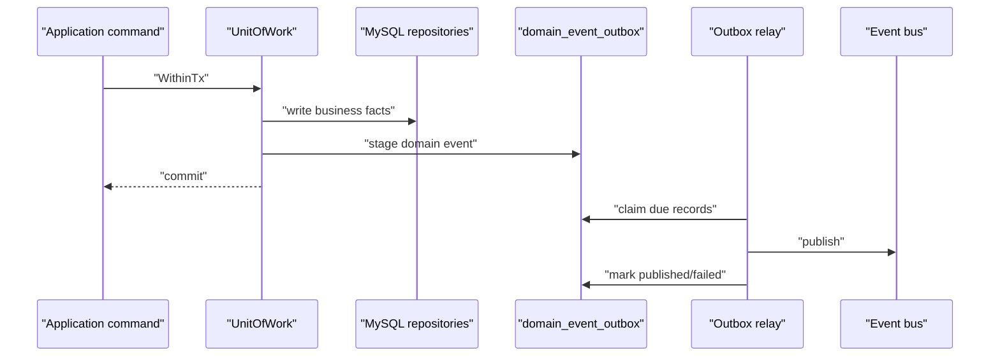

# UoW 与 Transactional Outbox

本文回答：IAM 如何把业务写入和领域事件 stage 放进同一个事务；Outbox relay 如何异步投递；运维排查时应该看表状态、relay 配置还是 event bus。

## 30 秒结论

- UoW 提供事务边界和仓储集合，application command 在 `WithinTx` 中写业务事实。
- durable domain events 在同一个事务内写入 `domain_event_outbox`，避免“数据库提交成功但事件丢失”。
- Outbox relay 异步 claim、publish、mark published/failed；event bus 不可用时 relay 降级，不 claim 新事件。
- AuthZ policy version changed 是当前重要 outbox 链路之一，详细深潜见 [../05-专题分析/10-授权版本事件链路--UoW到OutboxRelay.md](../05-专题分析/10-授权版本事件链路--UoW到OutboxRelay.md)。

## 代码入口

| 入口 | 说明 |
| ---- | ---- |
| [../../pkg/uow](../../pkg/uow) | UoW 基础抽象。 |
| [../../pkg/uow/gorm](../../pkg/uow/gorm) | GORM UoW 支持。 |
| [../../internal/apiserver/infra/mysql/uow](../../internal/apiserver/infra/mysql/uow) | IAM MySQL UoW 实现。 |
| [../../internal/apiserver/infra/mysql/eventoutbox](../../internal/apiserver/infra/mysql/eventoutbox) | outbox store 和 event stager。 |
| [../../internal/apiserver/infra/messaging/outbox_relay.go](../../internal/apiserver/infra/messaging/outbox_relay.go) | relay。 |
| [../../pkg/outbox](../../pkg/outbox) | outbox 运行时抽象。 |
| [../../pkg/outboxcore](../../pkg/outboxcore) | outbox 状态、record 构建和快照。 |
| [../../pkg/eventruntime](../../pkg/eventruntime) | 事件运行时。 |

## 数据流



## Outbox 状态速查

| 状态 | 含义 | 运维关注点 |
| ---- | ---- | ---- |
| `pending` | 已入库，等待投递 | 如果长期积压，检查 relay 是否启动、event bus 是否可用。 |
| `publishing` | 已被 relay claim | 如果长期停留，检查 relay 是否异常退出；stale 后会被重新 claim。 |
| `published` | 已投递成功 | 正常完成态。 |
| `failed` | 发布失败，等待重试 | 查看 `last_error` 和 `next_attempt_at`。 |

## 配置入口

| 配置 | 说明 |
| ---- | ---- |
| `outbox_relay_interval` | relay 轮询间隔。 |
| `outbox_relay_batch_size` | 每次 claim 的最大事件数。 |
| `outbox_relay_retry_delay` | 发布失败后的重试延迟。 |
| `configs/events.yaml` | 事件类型、topic、delivery class。 |

dev/prod 配置中这些值位于 [../../configs/apiserver.dev.yaml](../../configs/apiserver.dev.yaml) 和 [../../configs/apiserver.prod.yaml](../../configs/apiserver.prod.yaml)。

## 排查顺序

1. 检查应用日志是否出现 `outbox relay degraded: event bus unavailable`。
2. 查询 `domain_event_outbox` 中 unfinished 状态的数量和最老创建时间。
3. 检查 event bus 配置和连接。
4. 检查 relay interval/batch/retry 配置是否过小或过大。
5. 检查 event catalog 是否包含该事件类型且 delivery 是 durable outbox。
6. 如果事件已经 `published` 但消费者未更新，转到消费者侧排查幂等和 offset。

## 事实入口

- 事件配置：[../../configs/events.yaml](../../configs/events.yaml)
- outbox 迁移：[../../internal/pkg/migration/migrations/000006_add_domain_event_outbox.up.sql](../../internal/pkg/migration/migrations/000006_add_domain_event_outbox.up.sql)
- AuthZ 版本事件：[../../internal/apiserver/application/authz/shared/version_event.go](../../internal/apiserver/application/authz/shared/version_event.go)
- relay 生命周期：[../../internal/apiserver/process/shutdown_lifecycle.go](../../internal/apiserver/process/shutdown_lifecycle.go)

## 验证

```bash
go test ./pkg/outbox/... ./pkg/outboxcore/... ./pkg/eventruntime/... ./internal/apiserver/infra/mysql/eventoutbox ./internal/apiserver/infra/messaging
```
