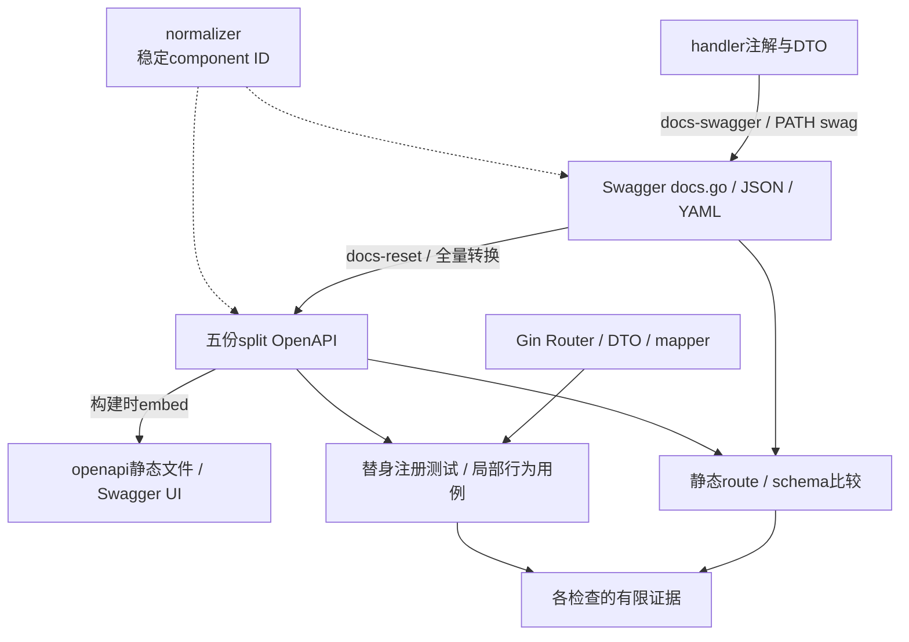

# 接口契约、生成链与兼容边界

> 状态：已实现 · 以`95141ea2`及当前机器描述核对生成、注册、映射和检查范围。本文的治理候选尚未实施；静态库存与离线用例不代表生产接口已验收。

## 1. 一份可调用的合同需要闭合哪些责任

IAM同时有发布描述、注册代码、应用行为和SDK表面，当前没有一份文件能独立代表全部合同。OpenAPI用于公开描述与评审，proto用于生成类型和服务描述符；实际接受什么输入、需要什么身份、何时提交和怎样返回错误，仍由运行代码决定。偏移应登记并选择修复方向，不能用“以契约为准”抹掉现行行为。

| 合同面 | 事实拥有者 | 变更时要回答的具体问题 |
| --- | --- | --- |
| 地址和形状 | OpenAPI/proto、Router/Registration、DTO/mapper | 哪个method/path或完整RPC名？省略、空值和默认值是什么？ |
| 准入和用户上下文 | transport middleware、方法caller规则、应用用例 | 是匿名、在线用户还是证书服务？Actor是否只是受信服务声明？ |
| 结果和副作用 | 应用提交者、错误出口、批次映射 | 200/OK证明哪一步？分项失败在哪里？响应丢失后能否安全重发？ |
| 消费和演进 | SDK与业务调用方 | 哪个版本/范围必须拒绝？错误分支依赖什么？旧消费者是否仍正确？ |
| 发布与验证 | 生成/检查脚本、CI、构建及环境证据 | 比较到了多少对象？产物对应什么源和工具？哪个实例真正接入？ |

本文拥有机器描述、生成方向、比较范围与兼容决策。领域规则回链各模块；连接身份与控制流归[传输安全](../03-基础设施/05-传输层与服务间安全.md)，SDK连接/重试与宿主责任归[接入正文](02-Go-SDK与业务系统接入.md)，部署接受归[发布证据](../05-工程质量与运维/03-迁移发布与数据库运维.md)。

## 2. 当前库存与版本必须分别读

| 模块 | REST规范 / URL版本 | OAS paths / operations / schemas | gRPC package / service / RPC |
| --- | --- | --- | --- |
| AuthN | 3.1.0 / v3，公开JWKS另有根路径及v2别名 | 22 / 23 / 32 | iam.authn.v3 / 6 / 15 |
| AuthZ | 3.0.3 / v4 | 16 / 23 / 19 | iam.authz.v4 / 1 / 7 |
| Identity | 3.1.0 / v2 | 4 / 6 / 11 | iam.identity.v2 / 5 / 17 |
| IDP | 3.1.0 / v2 | 8 / 10 / 10 | iam.idp.v2 / 1 / 3 |
| Suggest | 3.1.0 / v2 | 1 / 1 / 3 | 无业务proto |

五份OAS合计51个path item、63个HTTP operation；schemas是各文件声明次数，合计75次、去重73个ID。聚合Swagger 2.0也有51个path、63个operation、73个definition；数量相等不是逐项行为一致。四份proto声明13个service、42个Unary RPC，不含gRPC Health/reflection，也不代表每种模块装配都注册全部出口。

OpenAPI `openapi`、`info.version`、URL/proto版本、Go module `/v5`和软件release分别演进。[OAS规范](https://spec.openapis.org/oas/v3.1.0#openapi-object)也将规范版本与API版本分开。normalizer把编码后的Go module v3/v4/v5 schema前缀稳定成v2，只稳定component ID，不把AuthN/AuthZ URL改回v2。公共info仍使用聚合常量2.0.0，不能据此判断所有接口版本。

双协议也不对称：Suggest仅REST；Identity Profile/ProfileLink写命令走gRPC，REST有查询、当前用户更新和Profile PATCH；AuthZ REST维护权限事实，判定/快照及受限Assignment写入走gRPC；AuthN网站authorize/complete有REST而无对应网站Link RPC。选择入口先看用例，不能为了对称复制一套命令或认为SDK封装方法必有同名RPC。

## 3. REST的实际生成方向与公开出口

图表示当前数据流，不表示每条边由CI自动执行。`make docs-swagger`调用PATH中的swag，入口是cmd/apiserver注解，输出三份内部Swagger文件，再扫描这三份及五份OAS规范component ID。go.mod中的swag库v1.16.6不固定PATH CLI；这个target也不会把新操作同步进OAS。

`make docs-reset`读取已有Swagger，按v2/v3/v4及模块前缀分拆，替换五份OAS的**全部paths与可达schemas**，保留非schema components、已有tags和其他顶层字段；AuthN/AuthZ调整server路径，JWKS另设v2 path server。两个target没有依赖关系，reset可从旧Swagger重建一套同样陈旧的描述。

转换不是无损合并：operation白名单没有security、operation servers和consumes；body MIME取produces首项，多项formData会覆写同一requestBody。未知path、缺definition只输出提示，最终仍可返回0。未来手工为公开login添加`security: []`，下一次reset仍会丢失它而继续继承全局bearer；这条是源码条件推演，未做覆盖实验。

实际UI读的是split OAS：api/embed.go在构建时嵌入五份YAML，Router提供`/openapi`和`/swagger`，UI默认AuthN并列五个模块。它不直接读取内部Swagger生成物。修改工作目录文件不自动改变已运行二进制里的描述；当前实例、镜像和源码的绑定还要另取证。

## 4. REST门禁为什么会绿色而仍有偏移

### 4.1 一个命令包含五个不同检查

`api-validate`依次做Spectral lint、warning基线、Swagger/schema比较、静态route比较和一个Gin注册测试。默认Spectral Docker tag为6.15.0，可被变量覆盖且没有digest固定；Docker不可用时走npx固定CLI版本6.15.0。执行该命令仍依赖工具/缓存或下载能力，不等于本篇已运行完整lint。

当前warning基线110条：20条unused-component、33条description、57条operationId。基线按source/code/path/message做多重集比较，新warning失败，已解决但未删基线也失败；不是关闭全部warning。三条退役继承操作的success-response规则单独关闭，因为当前仅返回410。

| 检查 | 实际算法/覆盖 | 仍未证明 |
| --- | --- | --- |
| 通用schema | Swagger全名取最后一段，命中OAS短名后只比properties名称与required集合 | 当前五模块全部未命中；类型/format/enum/空值/默认值/边界也不属于通用比较 |
| Suggest专项 | 比较200响应引用和顶层envelope的type/ref/items/properties/required | 不递归展开item `$ref`，不比较format/enum等，也不核验500/503 |
| Python route | 比较两份已提交描述的method+规范化path集合，当前双方各63条且差集为空 | 没有读Gin注册、安全链、参数绑定、响应或handler |
| Gin覆盖 | 替身Router的选中已注册路径必须出现在OAS，单向包含 | 自动范围只接受v2和JWKS，跳过AuthN v3/AuthZ v4；不证明OAS全部可调用 |
| 关键路由矩阵 | 人工列29条存在、6条不存在，包含v3/v4 | 是挑选断言，不能替代全量集合或业务响应测试 |

通用比较的实际命中为：AuthN **0/31**、AuthZ **0/17**、Identity **0/10**、IDP **0/10**、Suggest **0/2**，共70个分组定义全部跳过。OAS保留完整ID而checker查短名；另外ErrResponse和两个authzcompat定义不进入业务分组。“OpenAPI specs match”目前不能解释成这些70个定义已比对。恢复命名映射后仍须补类型和约束，不能只将命中数变正就宣告完整校验。

### 4.2 路径归一化丢掉了哪些信息

Python checker读取第一server并支持path/operation override，剥`/api`、折叠well-known基路径、去尾斜杠并将参数名都变成`{}`。因此`{id}`与`{app_id}`在相同位置可被视为同一路由，两个JWKS地址也折叠；它不检查参数required/type或多server是否都正确。保留的旧v2 health忽略项也不能自动覆盖当前v4局部health。

Gin测试的另一套规则仅剥`/api/v2`，精确豁免八类操作入口，最终选择仍只按v2前缀及两个JWKS特例。若以后新增一个AuthZ v4路由但忘记注解/OAS，静态两份旧描述仍可一致，该自动注册比对又不会选择它；现有29条矩阵只保护已列路径。这是当前规则下的反例推演，未新增路由或执行变异测试。

### 4.3 安全声明必须从实际主体与链路反推

63个OAS operation都没有自己的security。AuthN/Identity/Suggest继承全局bearer，AuthZ/IDP无全局security；聚合Swagger却有22个operation security。匿名login、登录OTP、signup、Token body凭证入口和公开JWKS的实际AuthN路由，与bearer继承不同；受保护AuthZ/IDP管理又不能从缺security推成公开。

[OAS operation规则](https://spec.openapis.org/oas/v3.1.0#operation-object)允许`security: []`去掉全局要求，`[{}]`表达可匿名满足的替代项，两者不能混写。修复还需映射Swagger的BearerAuth与OAS的bearerAuth名称，并保留middleware的Resource/Action、最近认证、服务caller/Actor及对象范围责任；一个bearer方案不能编码全部授权。

## 5. gRPC生成、注册与可用性分别验证

proto-first成立在类型生成方向，不表示已拥有完整演进门禁。generate.sh先查工具存在，插件缺失才安装protoc-gen-go v1.36.11 / protoc-gen-go-grpc v1.6.1；已有插件不校版本，protoc未固定。它虽查找所有proto，实际生成硬编码四份；八个生成文件头记录protoc5.29.3及两插件版本，是历史产物标记。

Make的proto-gen包装在bash脚本后继续成功echo，缺少fail-fast或`&&`；脚本非零可能被后续输出掩盖，脚本缺失也仅警告。不能将“make返回0+没有diff”当成生成成功：可能根本没有完成生成。这是源码推论，本篇未运行生成器或失败实验。CI也没有重新生成Swagger/proto、生成后dirty检查或相对main的breaking-contract比较。

| 当前护栏 | 确切证明 | 不能扩大到 |
| --- | --- | --- |
| proto_contract_test | 四proto提取service短名，在非测试服务源码搜索Register字符串 | 包版本、执行注册、42方法实现、字段/reserved/ACL或wire响应 |
| 架构源字符串检查 | 已编码package/go_package、生成alias、注册/SDK import及退役引用 | 生成物与proto可复现相等、真实调用或跨版本兼容 |
| Registry/组合根测试 | 回调顺序、nil分支及已装配registration选择 | 真实bootstrap、服务内依赖和每个RPC业务结果 |
| Identity集合测试 | nil业务依赖下GetServiceInfo包含五服务及17方法精确集合 | 数据库行为、mTLS、ACL或命令成功 |
| AuthN局部集合测试 | 四个服务存在、若干退役服务/方法缺席 | 六服务及15方法全体、JWKS/通知标准组合根注册 |
| SDK公有编译 | 测试体列出的类型、函数与方法可引用 | 全部公有方法、文档片段、旧消费者或网络行为 |

模块Available和非nil依赖决定收集/注册，Registry注册后设SERVING不逐RPC执行业务检查。AuthN自定义部分装配可因某一能力非nil而注册整个AuthService，其他方法仍缺能力；标准启动另有门禁，不据此认定生产已degraded。新增RPC若只嵌入Unimplemented生成基类，也可能编译并注册，却在实际调用时返回Unimplemented。

## 6. 可解析、可编译与可正确消费不是一种兼容

| 兼容层 | 需要守住的合同 | IAM中的具体例子 |
| --- | --- | --- |
| 编码 | field number/type、enum数值、JSON名字及未知字段政策 | 删除domain=2后reserved数字/名字；旧源码使用新生成类型重新编译时，Domain字段不再存在，不能推成旧binary无法解码 |
| 输入/展示 | required、省略/null、默认、排序/分页、脱敏 | Role省略limit实际0；masked_number名字不强制gRPC脱敏 |
| 授权语义 | 主体、准入、权限与范围配对、生产者版本 | scope_contract_version=0不能被范围消费者当全公司 |
| 行为 | 错误、提交、幂等、部分成功及重放 | batch OK不等于所有ProfileLink成功，Aborted不能说明首次未提交 |

[Proto3演进规则](https://protobuf.dev/programming-guides/proto3/#updating)区分binary安全与条件兼容；追加字段可被旧二进制解析，但新代码仍要处理旧消息的默认值，应用源代码也可能被enum追加等改变影响。删除字段应保留数字与名字，不能重用；改字段号、RPC完整名或enum数值含义不能靠重新生成掩盖。[ProtoJSON](https://protobuf.dev/programming-guides/json/#protojson-wire-safety)对未知字段和名字的约束不同，不能把binary规则套给grpcurl/JSON调用。

当前AuthN为ServiceToken枚举、tenant字段保留数字/名字，AuthZ五种旧请求保留domain；Identity/IDP没有reserved声明，四份协议没有显式optional标量。proto3普通标量的默认值没有独立“是否填写”信息；新业务若需要区分未填和false/0，须选择presence模型并审阅消费者，不能只说“追加一个字段”。

三个当前实例说明为什么需要语义fixture：

1. `roles=1`字段仍在，当前mapper与direct_roles一样输出直接角色。即便旧消费者能解码，若仍按继承有效角色理解，结果就不同；结构比较检测不到该假设，角色语义由[AuthZ模型](../02-业务模块/03-AuthZ/01-领域模型设计.md)维护。
2. scopes与scope_contract_version是新增字段，但普通GetAuthorizationSnapshot只是返回RPC结果；GetScopedAuthorizationSnapshot才主动要求版本1、正PolicyVersion和范围形状。两者不是同一个安全合同，既有本地校验测试也不证明真实旧服务联调；配对/消费归[gRPC授权](../02-业务模块/03-AuthZ/06-关键链路-gRPC服务间授权与SDK.md)。
3. deprecated ObjectContext仍保留wire，但Check拒绝非空object ID、属性或unknown bytes；SDK CheckObject直接返回本地普通Go error。保留字段/enum名称不承诺保留条件授权行为，具体退役方向归[条件退役](../02-业务模块/03-AuthZ/08-条件授权退役维护手册.md)。

兼容顺序由条件决定：增加可选展示字段先确认旧消费者是否拒绝未知字段；引入必须拒绝旧生产者的范围合同，要先让消费者具备拒绝/升级策略，再开放新业务使用。若需要共存两个不兼容行为，应明确新版本或迁移窗口和停用条件，而不是让同一版本靠文档静默改变。

## 7. 错误、成功与重试也属于机器合同

REST应按HTTP status和业务code分支，但不是所有成功都裸DTO：普通WriteResponse输出200及code/message，data带omitempty，nil时省略；JWKS公开输出裸JSON/304，少数handler自行选择状态/封装。每个operation要追到最外层出口，不能把一个通用Response强套全部接口。

gRPC IAM mapper把注册业务错误转换成标准code和静态message，没有附带数字业务code或IAM结构化details；对已有status重新构造也不保留原details。适配器只有显式调用ToStatusError才获得该行为，没有统一归一所有handler返回值的全局拦截器。Recovery的panic消息是另一条出口，公共文本与审计覆盖由[传输错误边界](../03-基础设施/05-传输层与服务间安全.md#7-拒绝业务错误与-panic-分别留下什么证据)维护。

SDK gRPC Wrap的IAMError.Code默认是InvalidArgument等状态名，Cause保留原错误；登录REST子客户端却把envelope数字code转成字符串。不能仅凭Code字段名跨transport比较。ToHTTPStatus也不是原HTTP的可逆编码：服务端423→FailedPrecondition，SDK该码→400；502→Unavailable后变503。`IsRetryable`含DeadlineExceeded，默认连接重试却不含它；分类函数、自动attempt和命令幂等分别查。

| 需保留的具体结果 | 当前区别 | 完整责任正文 |
| --- | --- | --- |
| 解析/最近认证/锁定失败 | 最外层SignUp可重新编码，Link/SignUp格式化可能丢取消cause；401/423并非所有schema/SDK分类已列齐 | [外部解析](../02-业务模块/04-IDP/02-外部身份解析与AuthN协作.md)、[Login](../02-业务模块/02-AuthN/04-关键链路-Login登录认证.md)、[Linking](../02-业务模块/02-AuthN/03-关键链路-Linking登录身份绑定.md) |
| 无效Verify | REST常为200/valid=false且省略claims，gRPC状态字段REVOKED不独立证明真实撤销 | [Token](../02-业务模块/02-AuthN/05-关键链路-Token签发刷新吊销.md) |
| 非法Subject | Check/Snapshot为InvalidArgument，Scoped Replace部分领域错误直接返回Unknown | [gRPC授权](../02-业务模块/03-AuthZ/06-关键链路-gRPC服务间授权与SDK.md#8-失败分层与当前映射偏移) |
| ProfileLink撤销/批次 | 按ID/按pair错误不同；非空批次全失败仍可顶层OK，分项没有结构化code/index | [关系链路](../02-业务模块/01-Identity/03-关键链路-建立与撤销ProfileLink.md) |

一旦已提交但响应丢失，DeadlineExceeded/Unavailable不证明未生效；CAS冲突也不能证明首次失败。Grant/Create无通用请求回执，关系恢复可能跨周期改变旧重试含义。治理需要逐方法声明去重键、结果查询或不自动重放，不能把“稳定status”升级为“写入可安全重试”。

## 8. 当前偏移登记与修复选择

下表是当前差异，不是已修复清单。先决定保留实际行为还是调整行为，再同步描述、实现和调用方；不能仅改文案或让比较器接受另一套同样错误的描述。

| 偏移组 | 具体边界与风险 | 选择/owner及完整依据 |
| --- | --- | --- |
| REST安全 | 公开AuthN继承bearer，AuthZ/IDP管理缺security；最近认证、权限及caller内容不由锁图标表达 | transport/API owner对照实际middleware与方法准入；[SignUp](../02-业务模块/02-AuthN/02-注册登录与身份绑定.md)、[REST授权](../02-业务模块/03-AuthZ/05-关键链路-REST管理与路由授权.md) |
| Role更新/分页 | display_name在schema可省略，handler却总传指针导致空名400；description省略使应用响应置空，标准struct更新却跳过该零值，旧数据库描述可保留；limit声明10、实际0裁空，与Resource指针省略不同 | Role owner选择更新/默认及响应/持久化语义，补输入与读取fixture；[REST管理](../02-业务模块/03-AuthZ/05-关键链路-REST管理与路由授权.md) |
| 空兼容shape | Constraints/Schema未表达空数组上限和禁止额外键，解码器却拒绝非空、未知/重复键及尾随JSON | 兼容协议/API owner表达确切可接受集合；[退役维护](../02-业务模块/03-AuthZ/08-条件授权退役维护手册.md) |
| AuthN响应/输入 | Login成功裸TokenPair描述缺envelope；wechat_mini服务端接受而REST SDK拒绝；device_id未进入登录命令；Logout未表达至少一种令牌，独立Revoke handler未注册REST | AuthN/API/SDK owner逐用例选择，不能用字段存在承诺采用；[Login](../02-业务模块/02-AuthN/04-关键链路-Login登录认证.md)、[Token](../02-业务模块/02-AuthN/05-关键链路-Token签发刷新吊销.md) |
| JWKS | 未完整列根地址/304、管理封装和错误面；force-retire“任何状态”超过拒绝active；gRPC仅GetJWKS且忽略标签，无管理/HTTP304能力 | JWKS/API owner分别表达HTTP缓存和管理合同；[JWKS](../02-业务模块/02-AuthN/06-关键链路-JWKS与本地验签.md) |
| Identity披露与/me | proto“脱敏”注释与完整联系值/证件号gRPC透传不同，verified_at未填；/me未列缺User404/freshness503，PATCH提交后权限增强可失败且两读无共同版本 | Identity/消费方owner决定披露及结果含义；[模型](../02-业务模块/01-Identity/01-领域模型-User-Profile-ProfileLink.md)、[边界](../02-业务模块/01-Identity/04-模块边界-Identity与AuthN-AuthZ-Suggest.md) |
| IDP | Create实际200+envelope，YAML写201+裸DTO；expires_in固定7200非provider剩余；GetAppSecret与AppID准入及Refresh旧缓存另有边界 | IDP/API/消费方owner分别处理响应、秘密和时间；[凭据](../02-业务模块/04-IDP/01-应用凭据与AppToken缓存.md)、[出口索引](../02-业务模块/04-IDP/04-模块边界与代码索引.md) |
| Suggest | 未列500/503，item的id/name/weight无required；limit归一化/门禁顺序与mobile_mask脱敏不由名称保证 | Suggest/API owner补结果及披露fixture；[查询](../02-业务模块/05-Suggest/03-关键链路-SuggestProfile查询.md) |

AuthZ普通错误的400/401/403/409/500等面也未完整声明，REST在线验证内部错误可折叠401；各模块不能把未声明状态当不可达。修复错误或省略语义可能影响现有消费者，即使只是“使实现符合旧YAML”，仍需兼容决策。

## 9. 分阶段治理候选与具体验收

以下均未实施，也不要求本次文档重构顺带改协议或生成器。优先补可观察的覆盖，再处理已暴露偏移；否则一次reset或严格gate可能把旧差异错误地当成行为迁移。

| 候选 | Owner与代价 | 验收必须观察到什么 |
| --- | --- | --- |
| 非空、全版本比较 | transport/API维护者；无wire变化，但会暴露当前偏移 | 每个应比较schema都有唯一映射或具名豁免，零命中失败；类型/required/安全要求变异被拒绝；新v3/v4未描述路由失败，参数和实际server不被抹去 |
| 生成与手写元数据分工 | API及领域owner；迁移security/examples/server overrides | 以method+实际path合并明确overlay，unknown path/缺definition/未匹配overlay非零；BearerAuth名称转换明确，公开与受保护操作有正确声明，再生成无意外diff |
| 可复现工具与产物 | 工程工具/CI owner；工具升级需单独审生成diff | 约束并校验已有protoc/swag/plugins，Make传播失败；临时checkout生成Swagger/OAS及八pb后检查差异，记录源SHA与工具清单 |
| 兼容基线与语义fixture | 领域、SDK和真实调用方owner；需维护旧输入/消费策略 | 对明确main/release基线比field/type/enum/reserved/RPC及HTTP输入/输出/安全；对默认、错误、范围、幂等和部分成功另核双方fixture，拒绝未知生产者/旧行为有明确结果 |

例如未来Suggest要加可选`match_kind`，应先定义值来自什么查询事实、是否增加披露以及旧消费者是否接受未知字段；再同步应用投影、DTO/handler/注解、Swagger、OAS和实际消费fixture。当前Suggest专项会看envelope/items引用，新增item属性却可藏在未展开的ref内，不能用这一绿灯省掉item比较。这个字段只是变更推演，当前没有实现。

REST继续code-first加显式描述合并，能较低成本保留现有Gin入口，但必须治理转换损失和覆盖；改为contract-first stub可减少部分重复，却仍不能生成应用提交/准入语义，且迁移现有handler和错误合同成本高。gRPC已有proto-first，仍需注册与语义验证。只靠集成测试无法审所有schema/reserved变化，只靠静态描述也无法证明行为，四类证据应分别持有。

## 10. 本篇验证与后续修改定位

本篇实际运行8包既有离线测试，7包全量、Identity合同2项选测；共87个run/pass事件（含子用例），0skip/fail。另读取五OAS、Swagger和四proto生成库存，并执行现有两项Python比较器。库存和绿色结果按§4算法解释，没有新增行为测试或修改机器描述。

| 既有验证 | 本篇证据范围 | 未覆盖 |
| --- | --- | --- |
| REST入口26项 | 替身注册、局部降级/关闭、人工关键路径及v2/JWKS包含检查 | v3/v4全体、安全/schema完整一致、真实用例 |
| gRPC注册包3项（Registry2+proto源token1）及Identity2项 | 顺序/nil、13service源token和局部五service/17method集合 | 标准bootstrap、全部42方法调用、消费者兼容 |
| Login请求1项 | 五个声明enum可校验、指定examples/ref、jwt_token拒绝 | accepted集合反向完整相等、envelope正确、device_id采用 |
| 空shape1项 | 多种合法空值与非空/未知/重复键/尾随输入拒绝 | 全体HTTP/RPC出口及机器schema精确等价 |
| gRPC公共包35项（mapper34+keepalive1）及SDK errors14项 | 状态/公共消息/context映射、包装/谓词及非可逆HTTP分类；另单列keepalive参数 | 所有handler都调用mapper、panic、数字业务code/details保真、安全重发或运行连接治理 |
| SDK5项 | 选定符号和本地组合/default隔离 | 所有片段、旧SDK/服务联调及网络行为 |

454份相关源码/契约/配置在这8包测试前后摘要一致，这是来源绑定，不是全部输入枚举或逐文件行为覆盖。API README样例及链接收敛后另重复两项Identity护栏，最终两项日志与其四份文件输入单独绑定，不加进87项。reset仅运行dry-run并输出当前路径/schema数量，没有写入契约。未运行Spectral完整lint、Swagger/proto生成及再生成diff，也没有旧binary/newserver互通、真实DB/provider/mTLS或生产实验；本次改文档不能据旧main CI反推当前工作区通过完整API流水线。文档门禁与发布分类回归另行记录。

修改入口分别是：[REST注册](../../internal/apiserver/transport/rest/router.go)、[路由矩阵](../../internal/apiserver/transport/rest/router_matrix_test.go)、[schema比较器](../../scripts/check-openapi-contracts.py)、[route比较器](../../scripts/check-route-contracts.py)、[reset](../../scripts/reset-openapi-from-swagger.py)、[normalizer](../../scripts/normalize-swagger-schema-names.py)、[Spectral入口](../../scripts/validate-openapi.sh)、[proto生成器](../../scripts/proto/generate.sh)、[gRPC注册护栏](../../internal/apiserver/transport/grpc/proto_contract_test.go)、[错误mapper](../../internal/pkg/grpc/error_mapper.go)与[SDK公有编译](../../pkg/sdk/public_api_compile_test.go)。具体SDK选择及接入链由下一篇深化，本篇不复制全量字段或方法表。
