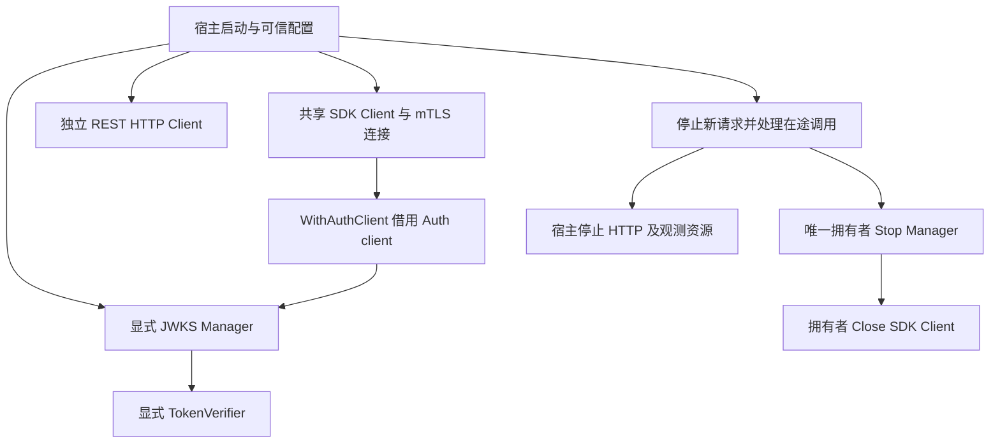

# Go SDK 与业务系统接入

> 状态：已实现 · 本篇按当前 `pkg/sdk`、生成协议及实际装配解释接入合同；改进候选另行标明，构造、编译和离线测试不作为线上接入证明。

## 1. 接入要同时回答服务身份、用户身份、授权与业务接受

SDK负责把请求送到IAM并返回合同内的结果。宿主负责选取可信主体、设置预算、解释结果、约束自己的数据和副作用，以及拥有连接与后台资源。把这些责任压成一句“调用SDK完成鉴权”，会遗漏真正决定接受的步骤。

| 层次 | 当前入口与事实 | 宿主仍须决定 |
| --- | --- | --- |
| 服务身份 | gRPC连接的客户端证书；IAM证书身份解析和方法ACL | 哪个服务可调用哪个方法；证书签发、信任和换证 |
| 用户身份 | `Auth().VerifyToken`或显式构造的verifier；带可信issuer/audience约束 | 接收哪类用户Token，如何将结果绑定当前请求；服务证书不证明UserID来自用户 |
| 权限与数据范围 | `Authz().Check/Allow`或Scope快照；Identity关系查询 | 哪个resource/action、哪个对象、哪家公司/门店；数据库过滤和关系接受 |
| 业务接受 | 宿主自己的事务、提交结果及请求回执 | 权限检查与写入之间的变化窗口，响应丢失、跨服务提交和恢复 |

例如服务A持有效证书调用`Check(subject="user:42")`，只能说明IAM允许A调用该方法；SDK不从证书或请求Token自动导出42，也不证明42与待操作档案有关。业务服务先验证用户凭证，再从可信结果建立subject、读取目标对象所属事实，最后执行适用的权限/关系检查。对象ID、UserID、公司或门店不能仅由客户端自由指定。一次在线Verify或Check也不形成所有在途请求的撤销屏障。

服务准入由[传输安全](../03-基础设施/05-传输层与服务间安全.md)维护，权限与范围消费由[AuthZ接入](../02-业务模块/03-AuthZ/06-关键链路-gRPC服务间授权与SDK.md)维护，关系接受由[ProfileLink](../02-业务模块/01-Identity/03-关键链路-建立与撤销ProfileLink.md)维护；本篇负责把它们接到宿主请求生命周期中。

## 2. 选择公开入口，而不是按包名猜能力

| 入口 | 当前用途 | 易混淆的边界 |
| --- | --- | --- |
| `sdk.NewClient`→`Auth()` | AuthN v3的Login、Token、Signup、Challenge、LoginIdentity、通知接收人及JWKS调用 | 构造所有stub不表示服务端每项capability已装配 |
| `Authz()` | AuthZ v4的7个RPC及Allow、Scoped快照helper | CheckObject已退役；PDP不执行宿主数据过滤 |
| `Identity()/Profile()/ProfileLink()` | Identity v2的读/生命周期、建档、关系查询/命令 | 17个RPC的拆分入口；默认分页helper不是全量遍历 |
| `IDP()` | IDP v2的应用查询、AppToken获取/刷新3个RPC | 不是通用外部身份解析入口；不替宿主校验目标App归属 |
| `auth/loginv3`、`signup`、`challenge`、`loginidentity` | 独立AuthN REST `/api/v3`客户端 | 独立HTTP配置、静态header和context，不继承共享gRPC配置 |
| `auth/jwks`、`auth/verifier` | 显式装配公钥获取、缓存和验签策略 | `Config.JWKS`只是配置容器，NewClient不创建Manager/Verifier |

Go module为`github.com/FangcunMount/iam/v5`，当前工作树`go.mod`要求Go **1.25.9**；AuthN v3、AuthZ v4、Identity/IDP v2是各自线协议版本，不能混成“SDK v4”。选用包含所需实现的已发布版本并核对消费者；当前源码存在Scope/全局已提交版本接口，不证明某个旧v5标签或已部署服务包含它们。发布与生成的兼容证据见[契约正文](01-REST-gRPC与契约治理.md)。

公共配置、错误facade、业务子客户端和hook是接入面，`pkg/sdk/internal/*`不是。公开`Conn()`和各`Raw()`返回共享连接或generated client：允许宿主使用`grpc.CallOption`等低层能力，但仍受连接TLS、重试及服务端准入。Raw绕过SDK错误包装和Scoped helper本地校验，不是绕过IAM安全链；也不是新连接。借用连接构造`identity.New*FromConn`时，连接生命周期仍由原拥有者负责。直接Auth子客户端工厂不验证必需Auth/JWKS接口，nil注入后调用可能panic；可选Signup/Challenge/Link缺失是包装的Unimplemented，通知接收人缺失却是裸Unavailable，不能把手工工厂视为健康探针或统一错误合同。

## 3. 配置如何变成实际连接和每次调用

`NewClient`先对传入的Config原地`WithDefaults`，validator只要求endpoint非空；然后应用options，追加默认metadata，构造TLS/service config和默认/自定义拦截器，最后非阻塞`grpc.DialContext`并创建子客户端。它没有复制输入配置，也没有验证全部TLS材料、负超时或重试参数。宿主宜一次构造并冻结配置，不在并发构造/调用期间修改同一指针、map或slice。

| 配置或选项 | 当前真实效果 | 接入决策 |
| --- | --- | --- |
| Timeout默认30s | 默认RPC链未据此设置deadline | 每次调用用request context建立预算 |
| DialTimeout默认10s | 只作用于DialContext；默认不WithBlock | 构造成功不证明握手、ACL或业务就绪，验证实际方法 |
| TLS/Retry/Keepalive为nil | 整组补默认；TLS及重试启用 | TLS/Retry须显式非nil Enabled:false；Keepalive无Enabled，nil会补默认；TLS不自动生成客户端证书 |
| Env/Viper的TLS/Retry false | loader输出nil，NewClient又补启用默认 | loader输出不是最终生效配置；宿主显式修正关闭值 |
| WithDialOptions | 在自动TLS/service config之后追加 | 能覆盖凭据和策略；配置字段不能代替最终选项审查 |
| LoadBalancer默认round_robin | 写入默认service config | 地址解析与resolver结果决定可选后端；不能据字段名承诺自动发现全部实例 |
| Observability=nil | 无默认观测链，即使注入collector/hook | 显式启用相应开关，宿主注册/导出并拥有生命周期 |
| Metadata/RequestID | metadata按缺失键补默认；公开helper写outgoing metadata | 请求关联ID不是幂等键，不把默认map放固定请求ID或用户凭证 |

`ConfigFromEnv`和`ConfigFromViper`是分别读取输入的loader，不自动形成“代码>环境>文件>默认”的合并链。Viper的文件、环境绑定和覆盖由宿主配置；最终代码覆盖仍需宿主自己做。TLS来源优先级、半套材料和凭据覆盖由[传输正文](../03-基础设施/05-传输层与服务间安全.md)维护，具体字段由[配置参考](../../pkg/sdk/docs/02-configuration.md)维护。

### 熔断开关与失败分类是两件事

默认链须`Observability.EnableCircuitBreaker=true`且未禁用默认拦截器。新发现的装配缺口是：公开非nil `CircuitBreakerConfig`转内部配置时只复制阈值/时间，未补内部`FailureCodes`默认；公开配置本身也没有该字段。内部构造只在整组nil时补默认。该分支的普通RPC错误不命中失败码，interceptor反而调用`RecordSuccess`，不能据自定义FailureThreshold承诺会开断。保持CircuitBreaker=nil而显式启用观测熔断才采用内部默认失败码；这与JWKS fetcher的独立熔断实现不同。

这是`default_interceptors.go`→`CircuitBreakerInterceptor`→`isFailureCode`的源码条件结论；本轮既有用例只覆盖默认链/回调/短路，没有完整自定义配置故障实验。修复应归SDK装配方并补失败分类合同，不能由文档宣布已修复。默认Prometheus对象未自动Register或公开导出；Tracing还须EnableTracing=true和非nil hook，DefaultObservabilityConfig的Tracing=false。跨服务trace/context桥接与出口由[观测主文](../03-基础设施/06-可观测性就绪与关闭.md#10-sdk观测属于宿主不继承服务端接线)维护。

## 4. 一个可编译的服务端接入骨架

下面是库片段，使用公开API；证书路径和issuer/audience由可信部署配置提供。它只完成连接装配及用户身份→动作判定，宿主仍要做对象归属、范围过滤和提交。没有在本轮连接实际IAM或读取证书。

```go
package iamintegration

import (
    "context"
    "crypto/tls"
    "errors"
    "strconv"
    "time"

    authnv3 "github.com/FangcunMount/iam/v5/api/grpc/iam/authn/v3"
    sdk "github.com/FangcunMount/iam/v5/pkg/sdk"
    "google.golang.org/grpc"
)

var ErrUserCredentialRejected = errors.New("user credential rejected")
var ErrActionDenied = errors.New("action denied")

func OpenIAM(ctx context.Context, endpoint, serverName, ca, cert, key string) (*sdk.Client, error) {
    return sdk.NewClient(ctx, &sdk.Config{
        Endpoint: endpoint,
        TLS: &sdk.TLSConfig{
            Enabled: true, ServerName: serverName, MinVersion: tls.VersionTLS12,
            CACert: ca, ClientCert: cert, ClientKey: key,
        },
        Retry: &sdk.RetryConfig{Enabled: false},
        Observability: &sdk.ObservabilityConfig{EnableRequestID: true},
    }, sdk.WithDialOptions(grpc.WithDisableRetry()))
}

func CheckUserAction(ctx context.Context, client *sdk.Client, token, issuer, audience, resource, action string) (string, error) {
    callCtx, cancel := context.WithTimeout(ctx, 2*time.Second)
    defer cancel()
    verified, err := client.Auth().VerifyToken(callCtx, &authnv3.VerifyTokenRequest{
        AccessToken: token, ExpectedIssuer: issuer,
        ExpectedAudience: []string{audience},
        AcceptedTokenTypes: []authnv3.TokenType{authnv3.TokenType_TOKEN_TYPE_ACCESS},
    })
    if err != nil { return "", err }
    if verified == nil || !verified.GetValid() || verified.GetClaims() == nil {
        return "", ErrUserCredentialRejected
    }
    userID := verified.GetClaims().GetUserId()
    id, err := strconv.ParseInt(userID, 10, 64)
    if err != nil || id <= 0 || strconv.FormatInt(id, 10) != userID {
        return "", ErrUserCredentialRejected
    }
    allowed, err := client.Authz().Allow(callCtx, "user:"+userID, resource, action)
    if err != nil { return "", err }
    if !allowed { return "", ErrActionDenied }
    return userID, nil
}
```

两次RPC共享2秒总预算，继承上游更短deadline；不能每一层重新从Background获得完整2秒。直接Verify的`valid=false,nil`是拒绝结果，不能只看error；Allowed=false,nil同样表示拒绝，非nil error表示未取得可用判定。骨架的本地拒绝用宿主sentinel供`errors.Is`分类，宿主自行映射响应，不解析message；远程error原样返回。resource/action由业务路由决定，不从任意请求字段照搬。宿主拥有OpenIAM返回的Client，复用它，在停止新请求并处理在途调用后Close；不要每次请求创建/关闭Client。

示例关闭SDK默认策略重试，并用gRPC选项禁止service config启用策略重试。锁定[gRPC-Go v1.80.0的WithDisableRetry](https://github.com/grpc/grpc-go/blob/v1.80.0/dialoptions.go)仍允许未写出或远端未处理的透明重试，不能据此承诺网络只发送一次；未知提交结果仍由业务恢复合同解决。构造返回、测试编译和真实方法调用是三种不同证据。

## 5. 权限消费要落到对象和查询条件

单次PDP检查适合回答主体是否具有resource/action；需要命中授权、策略版本和原因时用Check，Allow只提取Allowed。Scope helper调用同一GetAuthorizationSnapshot RPC并在本地要求contract version=1、正策略版本、无条件权限和有效范围。它没有资源/动作匹配、范围合并、对象归属或数据库过滤器。

例如查询`company=10`的订单，应先从可信主体得到快照、匹配订单read权限，再按当前Scope合同得到公司10的门店集合：`STORES=[101,102]`形成公司与门店共同谓词，`ALL_STORES`只覆盖该公司。对同一目标resource/action匹配的权限条目，只合并同公司的范围；不能把read的门店用于retry。ALL_STORES不证明当前公司成员资格，仍须验证真实对象归属。快照按具体AppName投影，当前排除全局App通配Grant，不能宣称它完整复刻Check；先Check再取快照的两次RPC也不保证同一策略版本。公司20的ALL_STORES不能放大成公司10可读；无匹配权限、空范围或未配置Scope也不能变成“查询全部”。这些是宿主必须实施的接受逻辑，不是SDK现有查询API。ID仍保留规范正int64十进制字符串，例如123456789012345678，不能经过浮点转换丢位。

管理面另请求IncludeAssignmentFacts=true，helper才额外检查完整标记、ID唯一、角色事实对应及每个角色有分配；它不验证保护值所有取值、RoleName唯一或权限范围与分配范围一致，也不能发现某角色仍有其他分配时漏掉的那一条事实。GetCommittedPolicyVersion是持久全局版本，不是用户快照，也不证明本地授权runtime已加载；缓存接受仍须绑定目标版本、实例/生产者与当前消费者合同。

Identity/IDP的Raw读取不自动证明被委托用户或应用归属。`HasProfileLink`与权限作用不同；以关系准入的用例必须解析可信UserID并核对目标Profile及活动关系。建立/撤销返回的对象也不替代宿主业务对象映射。各模块修改后的本地编译结果不能替代这些宿主接受规则。

IDP还要按敏感出口选方法：GetWechatApp可返回解密AppSecret，方法ACL不自动限制请求AppID；两个Token RPC只有token字符串，没有到期字段。Refresh绕过IAM上层EnsureToken，不保证下层微信SDK必然回源。Provider成功后cache.Set失败仍可返回error，不能据此推断没有先前副作用；调用、归属、缓存和凭据处理由[IDP主文](../02-业务模块/04-IDP/01-应用凭据与AppToken缓存.md)维护。

## 6. 写命令与分页、批次的结果怎样恢复

默认SDK策略maxAttempts=3、UNAVAILABLE/RESOURCE_EXHAUSTED/ABORTED，以空service名覆盖全部方法，未按写入幂等性拆分；MaxAttempts包含首次请求。Metrics/Tracing包裹逻辑RPC而非每次native网络尝试，记录数不能证明重试次数。内部per-method工具没有装入默认链；`IsRetryable`还包含DeadlineExceeded，却不决定幂等性或默认策略。网络错误可能发生在请求到达前，也可能是提交后响应丢失。[gRPC重试合同](https://grpc.io/docs/guides/retry/)的RPC提交判定也不等于业务数据库提交回执。

| 结果或命令 | 当前陷阱 | 宿主恢复方式与责任 |
| --- | --- | --- |
| CreateUser/CreateProfile | 无请求幂等键；空Phone/无证件非self可再次创建，唯一冲突也不返回首次结果 | 先确认已提交对象/业务映射；跨服务原子提交不能靠SDK实现，见[创建主文](../02-业务模块/01-Identity/02-关键链路-创建User与Profile.md) |
| Scoped Replace | 旧expected_policy_version继续Aborted；首次已提交后冲突不证明首次失败 | 重读事实/版本，核对意图与受管集合，不盲重发旧批次 |
| Establish/Revoke ProfileLink | 恢复复用原ID，没有expected周期或结果回执 | 旧建立可作用于撤销后周期，旧撤销可作用于恢复后周期；以[关系主文](../02-业务模块/01-Identity/03-关键链路-建立与撤销ProfileLink.md)定义恢复 |
| Import/BatchRevoke | failures是响应中的分项结果，SDK不转顶层error | nil error后检查每项created/revoked/failures，逐项确认失败或结果未知，再按当前状态/周期续作；不能把重发整批当恢复原结果 |
| BatchGetUsers | 另有not_found_ids | 返回成功不代表每个输入存在；与结果ID对应，不依赖输入位置 |
| GetUserProfiles/IncludingRevoked | 只发一次默认分页请求，未遍历全部关系；当前默认20、上限50，Page原样回显不等于有效limit | 要全量使用显式ListProfiles及page，另处理分页期间变化；31条关系不能仅取一次就称全量，IncludingRevoked只改变过滤 |

反向ListProfileLinks没有分页字段；缺失User的item仍可能保留User=nil。HasProfileLink为true也不保证详情非空，第二次详情读取错误当前被忽略。BatchGetProfiles把每次查询的任何错误记入not_found_ids，不能据此把超时或内部失败认定为实体不存在。宿主应按方法结果合同消费，而非用统一“RPC成功/未找到”分支覆盖全部响应。

服务端事务在IAM内部，宿主数据库事务在宿主内部；SDK不接管宿主连接/事务，也不提供分布式提交。请求ID用于关联日志；需要幂等回执时必须定义可信主体、方法、请求指纹、结果期限和重复接受规则，不能直接把WithRequestID当现成幂等协议。

## 7. HTTP、验签与后台资源要分别拥有



REST登录/Signup/Challenge/Link不继承gRPC TLS、Timeout或Retry；默认HTTP没有总超时。宿主分别注入HTTPClient、request context和重定向政策，不能把gRPC mTLS当HTTP通路的信任证明。loginidentity的WithBearerToken是构造时静态header，没有自动替换/刷新；长期跨用户复用该对象会复用同一Bearer，应按宿主身份生命周期构造或明确提供自己的受控调用层，勿在并发请求时改共享秘密状态。HTTP关闭、idle连接及collector/exporter仍由各拥有者管理。

Local verifier只验签/claims，不读Session/User/LoginIdentity在线状态；Remote增加IAM状态门禁，直接Verify的无效响应会被Remote strategy折叠为ErrTokenInvalid。Fallback只在取key失败或空集合走local→remote，未知kid/签名/claims失败不自动回源；远端RPC失败也不自动切local。Token-only验证结果缓存是显式包装且不重验调用options/有效期等，不能与公钥缓存混成一个撤销预算。具体缓存、分发和轮换由[Token主文](../02-业务模块/02-AuthN/05-关键链路-Token签发刷新吊销.md)与[JWKS主文](../02-业务模块/02-AuthN/06-关键链路-JWKS与本地验签.md)维护。

Manager constructor没有ctx参数，用Background同步首取；URL-only的HTTP请求超时可为0，constructor不补JWKS默认。优先WithAuthClient借用已受控连接，并为HTTP提供有界超时；仍不能据此声称整个构造链总预算已受控。Manager.Stop只关闭通道，非幂等、不join在途刷新，也不递归关闭fetcher。独立GRPCEndpointFetcher固定insecure、阻塞Dial并用sync.Once保存首次initErr；默认Manager链隐藏它且不调用其公开Close，Stop Manager+Close统一Client不覆盖这条独立连接。显式保留该Fetcher可自己Close，但不会使默认路径自动继承TLS或恢复失败初始化。

上图是借用AuthClient的宿主所有权安排，不是SDK自动关闭保证；Stop后在途刷新可仍使用连接。要严格join或原子换证需新生命周期合同，当前客户端证书仅构造时读取，没有自动重读文件。NewTokenVerifier失败时宿主还应Stop已创建Manager，成功时返回或保存唯一cleanup拥有者，不只返回verifier而丢掉Manager。

## 8. 错误处理与升级验收分层

`pkg/sdk/errors`提供AsIAMError、GRPCCode、Message、ToHTTPStatus及常用谓词。gRPC包装的Code是status名称，REST envelope可能保留数字业务码；Scope本地validator失败是普通Go error，Raw返回底层error。HTTP业务码、gRPC status及SDK映射不可逆，不能按错误message解析流程；映射边界见[契约错误出口](01-REST-gRPC与契约治理.md)。日志记录受控method/status/latency及关联ID，避免Token、密码、OTP、完整请求和未经审查的原error。

| 验收层 | 应保存的具体证据 | 不能由前层替代的结论 |
| --- | --- | --- |
| 源码/配置 | module版本、协议版本、最终TLS/options/重试策略、方法能力 | 选定标签/线上实例是否包含同一实现 |
| 编译/离线 | 真实消费者编译、文档片段编译、既有配置/策略测试及范围 | 实际握手、方法ACL、写入或范围接受 |
| 接入环境 | 指定实例、证书身份、带deadline的实际所需RPC | 一个读RPC成功不证明写方法/所有capability或后台新鲜度 |
| 业务接受 | 可信主体→对象/范围→提交及恢复回执，拒绝/批次失败用例 | readiness、CI或镜像构建不能替代它 |

公共compile test只引用部分符号，不穷举所有方法或编译Markdown；`go test ./pkg/sdk/...`也不自动遍历`_examples`。旧AuthZ程序仍有退役Domain字段和旧Allow参数，编译失败不能称完整可运行；其他示例即使编译，也不证明TLS材料、数字ID、deadline和结果判断适用。明确的版本/退役矩阵由[契约正文](01-REST-gRPC与契约治理.md)与[迁移参考](../../pkg/sdk/docs/07-migration-breaking-changes.md)维护，不泛化成所有模块必须同一天改变全部协议版本。

## 9. 具体改进候选与本轮证明范围

以下均未实施，避免把宿主责任直接塞入通用SDK或让SDK接管借用资源。

| 问题与owner | 候选合同 | 代价与必要接受证据 |
| --- | --- | --- |
| 配置/SDK装配 | 归一化后不可变有效配置；loader保留显式false；熔断失败码明确默认/可配置并完整复制 | 会改变现有关闭/启用行为；覆盖nil/false、所有输入、普通失败与开断，不只配置解析 |
| 重试/SDK与各用例 | 明确读方法与有请求回执的写方法，其他写禁策略重试；公开保留RPC options政策 | 方法清单需要维护；模拟已提交丢响应、版本冲突、批次与跨周期，结果仍由用例拥有 |
| 生命周期/JWKS与宿主 | constructor受ctx总预算，Stop幂等且可join，默认链拥有资源可Close，借用资源不关闭 | 换证/取消/并发刷新/初始化失败后重试需要定义；测独立连接关闭与借用Client存续 |
| 文档/SDK维护者与消费者 | 提取关键片段编译、单独检查下划线示例；按版本绑定真实消费者接受矩阵 | 编译成本小但不是业务接受；再验证audience/invalid、Scope过滤、部分失败和实际方法准入 |

本轮使用13个有既有测试的SDK包全量离线回归，共117个run/pass事件（含子用例）、0skip/fail，无新增测试。REST子客户端用httptest，JWKS独立endpoint用本机回环gRPC，策略/Scope/配置/观测/错误用替身或内存；Identity、IDP、auth/client、独立REST内部包没有既有测试，不能把117项说成所有业务RPC都被验证。AuthZ三项只直接测试两个validator和退役CheckObject，未覆盖helper真实RPC或宿主过滤。454份来源摘要绑定当前实现，不是逐文件测试覆盖率。

本篇唯一完整Go块单独编译通过，图离线渲染并目视检查；四个下划线程序另行显式编译，basic/mTLS/verifier通过，AuthZ因退役Domain和旧Allow参数两处失败，源码保留。这些编译不计入117个测试事件，也未执行程序。文档门禁检查表达/引用和部分事实，不证明构造总预算、配置关闭贯穿链、自定义熔断、真实丢响应、换证、join、范围过滤或线上消费者接受。未读真实凭据，未调用实际IAM/provider或执行发布/生产动作。原稿、摘要、选择与当前结果由[阶段台账](../_data/reviews/2026-10-06-docs-refactor.md)保留。

修改定位：入口/所有权在`client.go`、`identity/factory.go`；默认/输入在`config/{defaults,env_sections,viper_sections}.go`；装配在`internal/transport/{dial,dial_options,default_interceptors,service_config}.go`；结果在`auth/client`、`auth/verifier`、`authz/scope.go`、`identity/profile_link_*`；资源在`auth/jwks/{builder,manager,grpc_endpoint_fetcher}.go`。宿主接受应改业务服务自己的入口、查询和提交，不能仅修改SDK helper。
