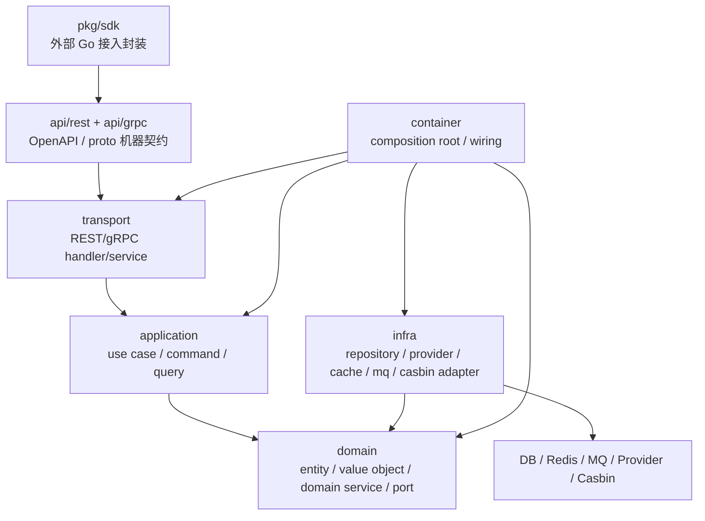

# 分层依赖边界

> 状态：设计目标 · 第一版正文，待继续按 `internal/pkg/architecture`、`internal/apiserver/domain`、`application`、`infra`、`transport`、`container`、`pkg/sdk` 和实际 import 图逐项核对。

---

## 1. 本文回答

本文回答 10 个问题：

- IAM 为什么需要分层依赖边界？
- `domain / application / infra / transport / container / api / pkg/sdk` 分别负责什么？
- 哪些依赖方向允许？
- 哪些依赖方向禁止？
- 为什么 `domain` 不能依赖 `infra`、`transport`、`proto`？
- 为什么 `transport` 不能绕过 `application` 直接访问 repository、transaction、Casbin 或 container？
- 为什么 SDK 不能 import IAM `internal` 包？
- 跨模块调用应该通过什么方式表达？
- 常见边界漂移有哪些？
- 修改代码后应该执行哪些 Verify？

本文是架构护栏文档，不替代具体业务模块文档。业务模块的模型和链路见 [../02-业务模块](../02-业务模块/README.md)，接入契约见 [../03-接入与契约](../03-接入与契约/README.md)。

---

## 2. 30 秒结论

IAM 的核心分层依赖方向是：

```text
transport
  -> application
  -> domain

infra
  -> domain

container
  -> transport / application / infra / domain ports

api/rest + api/grpc
  -> machine contract only

pkg/sdk
  -> public contract / generated client only
```

最重要的规则：

```text
domain 不依赖 application、infra、transport、api、proto、SDK；
application 不依赖 transport，也不直接依赖具体 infra；
transport 不绕过 application 直接访问 repository、transaction、Casbin 或 container；
infra 不反向依赖 application/transport；
container 只做 wiring，不执行业务用例；
SDK 不 import IAM internal 包；
proto/OpenAPI 是机器契约，不进入 domain；
跨模块协作通过 application port 或明确 service interface 表达。
```

如果只记一句话：

> 领域层保持纯粹，应用层编排用例，基础设施实现端口，传输层只做协议适配，组合根只做装配，SDK 只走公开契约。

---

## 3. 分层总图



读图规则：

```text
transport 调 application；
application 调 domain，并依赖 domain 定义的 port；
infra 实现 domain/application 需要的 port；
container 负责把 port 和 concrete 组装起来；
api 只定义机器契约；
SDK 是外部接入封装，不进入 internal；
DB/Redis/MQ/provider/Casbin 等技术细节只能在 infra 或 runtime adapter 中出现。
```

---

## 4. 各层职责

### 4.1 Domain

Domain 负责业务模型和核心不变量。

它应该包含：

```text
entity；
value object；
domain service；
domain error；
domain event；
repository port / policy port / external capability port；
领域规则和不变量。
```

它不应该包含：

```text
HTTP / gRPC DTO；
OpenAPI / proto generated type；
SQL / GORM / Mongo / Redis client；
NSQ / Kafka client；
Casbin concrete enforcer；
provider SDK concrete；
Gin / grpc-go handler；
container wiring；
SDK public API。
```

核心规则：

```text
domain 不知道自己会通过 REST 还是 gRPC 暴露；
domain 不知道自己会被 MySQL、Mongo、Redis 还是内存实现持久化；
domain 不知道自己会被哪个 container 装配；
domain 不 import generated proto；
domain 不 import transport DTO。
```

---

### 4.2 Application

Application 负责用例编排。

它应该包含：

```text
command / query；
use case service；
transaction boundary 抽象；
调用 domain model；
调用 repository port；
调用 external service port；
调用 AuthZ Check port；
编排事件发布、outbox、审计、指标等端口；
错误归一化。
```

它不应该包含：

```text
HTTP/gRPC 协议解析；
handler response encode；
具体 SQL / Redis / MQ client；
Gin context / grpc context 绑定；
container.NewXXX；
具体 provider SDK；
transport DTO 作为核心入参；
直接访问其他模块 repository concrete。
```

核心规则：

```text
application 可以依赖 domain；
application 可以依赖 port interface；
application 不直接依赖 infra concrete；
application 不依赖 transport；
application 不做路由注册；
application 不知道自己来自 REST 还是 gRPC。
```

---

### 4.3 Infra

Infra 负责技术实现。

它应该包含：

```text
repository concrete；
transaction manager concrete；
cache concrete；
MQ producer/consumer concrete；
outbox store concrete；
provider adapter；
Casbin adapter；
search index store；
crypto / KMS / SecretVault concrete；
Redis/MySQL/Mongo/NSQ 等客户端适配。
```

它不应该包含：

```text
REST/gRPC handler；
application use case 编排；
业务流程决策；
AuthN 登录主流程；
AuthZ 授权主流程；
transport DTO；
container 全局装配逻辑。
```

核心规则：

```text
infra 实现 port，不定义业务方向；
infra 可以依赖 domain 类型做映射；
infra 不应该反向调用 application use case；
infra store 不应该直接调用 AuthZ Check；
infra 不应该绕过 application 直接向 transport 返回 response。
```

---

### 4.4 Transport

Transport 负责协议适配。

它应该包含：

```text
REST handler；
gRPC service method；
request DTO / proto mapper；
response DTO / proto mapper；
HTTP status / gRPC code 映射；
authn/authz/rate-limit middleware/interceptor 接入；
路由或 service 注册。
```

它不应该包含：

```text
业务规则；
领域不变量；
repository 直接调用；
transaction 直接控制；
Casbin enforcer 直接使用；
provider SDK 调用；
container 访问；
复杂权限策略；
复杂搜索过滤逻辑。
```

核心规则：

```text
transport 只做协议适配；
transport 调 application；
transport 不绕过 application 访问 infra；
transport 不把 DTO 当 domain entity；
transport 不直接创建 repository 或 transaction；
transport 不直接调用 container。
```

---

### 4.5 Container

Container 是组合根。

它应该包含：

```text
依赖创建；
port 到 concrete 的绑定；
module service wiring；
handler/service wiring；
数据库、缓存、MQ、provider adapter 初始化；
生命周期管理；
配置注入。
```

它不应该包含：

```text
业务用例执行；
领域规则；
请求处理逻辑；
DTO mapper；
权限决策；
搜索候选过滤；
repository 查询结果加工成 response。
```

核心规则：

```text
container 可以知道所有 concrete；
container 只负责装配；
container 不被 transport/application/domain 反向调用；
handler/service method 不应该访问 container 来临时取依赖。
```

---

### 4.6 API Contract

`api/rest` 和 `api/grpc` 是机器契约源。

它应该包含：

```text
OpenAPI path / schema / status / security；
proto package / service / rpc / message / enum；
生成配置或契约定义。
```

它不应该包含：

```text
业务流程实现；
领域规则实现；
repository 实现；
transport handler 逻辑；
SDK 业务封装逻辑。
```

核心规则：

```text
OpenAPI/proto 是机器契约；
OpenAPI/proto 不进入 domain；
generated proto 不被 domain import；
REST/gRPC DTO/message 通过 mapper 转换到 application command/query。
```

---

### 4.7 SDK

SDK 是外部 Go 服务接入封装。

它应该包含：

```text
public client；
public request/response；
TokenSource；
transport wrapper；
错误映射；
示例和 compile test。
```

它不应该包含：

```text
internal/apiserver import；
domain entity 直接暴露；
repository 调用；
数据库访问；
绕过 AuthN/AuthZ 的本地规则；
IAM 服务端 use case 实现。
```

核心规则：

```text
SDK 只能依赖公开契约或 generated client；
SDK 不 import internal；
SDK public API 变化要有 compile test 保护；
SDK DTO 不是 domain entity。
```

---

## 5. 允许依赖方向

允许：

```text
transport -> application
application -> domain
application -> port interface
infra -> domain
infra -> port interface
container -> transport
container -> application
container -> infra
container -> domain ports
api/rest、api/grpc -> 被 transport 和 SDK 使用
pkg/sdk -> public contract / generated client / standard library / external client lib
```

更具体：

| From | Can depend on | 说明 |
| --- | --- | --- |
| `domain` | 标准库、领域内子包 | 保持纯粹 |
| `application` | `domain`、port interface、通用基础包 | 用例编排 |
| `infra` | `domain`、port interface、外部技术库 | 实现端口 |
| `transport` | `application`、DTO/mapper、middleware | 协议适配 |
| `container` | 各层 concrete | 组合根 |
| `pkg/sdk` | 公开契约、generated client、标准库 | 外部接入 |

---

## 6. 禁止依赖方向

禁止：

```text
domain -> application；
domain -> infra；
domain -> transport；
domain -> container；
domain -> generated proto；
domain -> OpenAPI DTO；
domain -> Redis/MySQL/Mongo/NSQ client；
application -> transport；
application -> container；
application -> infra concrete，除非通过明确 port 被倒置；
transport -> infra repository concrete；
transport -> transaction manager concrete；
transport -> Casbin enforcer concrete；
transport -> container；
infra -> application use case；
infra -> transport；
pkg/sdk -> internal/apiserver；
pkg/sdk -> internal/pkg；
```

---

## 7. 跨模块依赖边界

IAM 当前业务模块包括：

```text
Identity；
AuthN；
AuthZ；
IDP；
Suggest。
```

跨模块协作应该通过 application service 或 port 表达，而不是直接穿透对方内部实现。

推荐：

```text
AuthN -> IdentityUserPort；
AuthN -> IDPExternalIdentityResolver；
AuthN -> AuthZSubjectMapper，若需要；
Suggest -> IdentityProfileFactReader；
Suggest -> AuthZVisibilityChecker；
IDP -> ProviderAdapter；
AuthZ -> PolicyStore / RuntimeEnforcer port；
```

禁止：

```text
AuthN 直接 import Identity repository concrete；
Suggest 直接 import AuthZ RoleBinding repository concrete；
IDP 直接创建 Identity User；
AuthZ 直接解析 AuthN Credential；
Identity 直接调用 Suggest index；
transport 跨模块直接访问多个 repository 拼业务流程。
```

跨模块边界详见 [../02-业务模块/README.md](../02-业务模块/README.md)。

---

## 8. 典型链路如何落层

### 8.1 REST 登录链路

```text
transport/rest/authn handler
  -> application/authn LoginUseCase
  -> domain/authn LoginIdentity / Credential / Principal
  -> infra/idp adapter or infra/authn repository via ports
  -> application/authn result
  -> transport/rest response DTO
```

边界：

```text
handler 不校验密码规则；
handler 不直接查 credential repository；
domain 不知道 HTTP；
infra 不决定登录流程。
```

---

### 8.2 AuthZ Check 链路

```text
transport middleware or application use case
  -> application/authz CheckUseCase
  -> domain/authz Subject / Resource / Action / Scope
  -> infra/authz Casbin adapter via port
  -> AuthorizationDecision
```

边界：

```text
Token 验签不等于授权通过；
transport 不直接调用 Casbin concrete；
domain 不 import Casbin；
application 编排授权语义。
```

---

### 8.3 Suggest 查询链路

```text
transport/rest/suggest handler
  -> application/suggest SuggestProfileUseCase
  -> domain/suggest Query / ProfileAccessScope
  -> application/suggest ProfileSuggestItem
  -> infra/suggest search index via port
  -> Identity/AuthZ visibility ports
  -> masked response
```

边界：

```text
handler 不直接查 index；
index store 不直接调用 AuthZ；
Suggest 不创建 Profile；
ProfileSuggestItem 不返回明文手机号。
```

---

### 8.4 IDP 外部身份解析链路

```text
transport/rest or grpc idp endpoint
  -> application/idp ResolveExternalIdentityUseCase
  -> domain/idp WechatApp / Credentials / ExternalIdentity
  -> infra/idp provider adapter via port
  -> ExternalIdentity result
```

边界：

```text
IDP 不创建 LoginIdentity；
IDP 不签发 IAM Token；
provider AppToken 不是 IAM AccessToken；
provider adapter 不写 Identity/User 表。
```

---

## 9. 事务与 Repository 边界

事务边界应由 application 编排，通过 transaction port 或 unit-of-work 抽象表达。

推荐：

```text
application use case
  -> tx manager port
  -> repository port
  -> domain object
  -> commit / rollback
```

禁止：

```text
transport handler 直接 begin transaction；
transport handler 直接调用 repository concrete；
domain object 直接 commit transaction；
infra repository 自行决定跨聚合业务流程；
container 暴露 tx manager 给 handler 直接使用。
```

---

## 10. Casbin / AuthZ runtime 边界

Casbin 是 AuthZ runtime 的一种技术实现，不是 AuthZ 领域模型本体。

推荐：

```text
application/authz CheckUseCase
  -> domain/authz AuthorizationRequest
  -> AuthZRuntime port
  -> infra/authz Casbin adapter
  -> AuthorizationDecision
```

禁止：

```text
transport 直接调用 Casbin enforcer；
domain import Casbin；
非 AuthZ 模块直接写 Casbin policy；
Suggest index store 直接调用 Casbin；
业务系统根据 token claims 绕过 AuthZ Check。
```

---

## 11. Proto / OpenAPI 边界

OpenAPI/proto 是机器契约，不是 domain。

推荐：

```text
REST DTO / proto message
  -> transport mapper
  -> application command/query
  -> domain object/value
```

禁止：

```text
domain import generated proto；
domain import REST DTO；
application 把 proto message 当核心 command；
infra repository 返回 proto message；
SDK DTO 当 domain entity。
```

接入契约详见 [../03-接入与契约/README.md](../03-接入与契约/README.md)。

---

## 12. 常见边界漂移

| 漂移 | 表现 | 风险 | 修正 |
| --- | --- | --- | --- |
| domain 依赖 infra | domain import mysql/redis/gorm | 领域被技术污染 | 定义 port，infra 实现 |
| domain 依赖 proto | domain import generated pb | 协议污染领域 | mapper 放 transport/application 边界 |
| application 依赖 transport | use case 使用 handler DTO | 应用层被协议污染 | DTO 转 command/query |
| transport 访问 repository | handler 直接查 DB | 绕过用例和权限 | handler 调 application |
| transport 直接开事务 | handler 控制 tx | 事务边界分散 | application 编排 tx port |
| transport 直接用 Casbin | handler 调 enforcer | 授权语义分散 | AuthZ use case 封装 |
| infra 调 application | repository 调 use case | 依赖反转失败 | application 调 infra port |
| container 被业务调用 | handler 从 container 取依赖 | Service locator 反模式 | 构造期注入依赖 |
| SDK import internal | 外部包依赖服务内部 | 发布和边界破坏 | SDK 只依赖公开契约 |
| Store 调 AuthZ | index/repo 直接授权 | infra 吞并业务决策 | application 编排 visibility |

---

## 13. 文件移动与新增代码检查清单

新增包或移动代码时，先问：

```text
这是领域模型吗？放 domain；
这是用例编排吗？放 application；
这是数据库、缓存、MQ、provider、Casbin 实现吗？放 infra；
这是 REST/gRPC 协议适配吗？放 transport；
这是依赖装配吗？放 container；
这是机器契约吗？放 api/rest 或 api/grpc；
这是外部 Go 接入封装吗？放 pkg/sdk。
```

然后检查：

```text
是否引入了禁止方向 import；
是否绕过 application；
是否把 DTO/proto 带进 domain；
是否把具体 infra 带进 application；
是否把 container 当 service locator；
是否让 SDK 依赖 internal；
是否需要新增 architecture test。
```

---

## 14. 事实源

| 事实 | 路径 |
| --- | --- |
| 架构测试 | `../../internal/pkg/architecture` |
| Domain | `../../internal/apiserver/domain` |
| Application | `../../internal/apiserver/application` |
| Infra | `../../internal/apiserver/infra` |
| REST transport | `../../internal/apiserver/transport/rest` |
| gRPC transport | `../../internal/apiserver/transport/grpc` |
| Container | `../../internal/apiserver/container` |
| REST 契约 | `../../api/rest` |
| gRPC 契约 | `../../api/grpc` |
| SDK | `../../pkg/sdk` |
| 业务模块文档 | `../02-业务模块` |
| 接入契约文档 | `../03-接入与契约` |

注意：上表路径需要继续与当前源码核对。如果目录已调整，应以代码为准并同步更新本文。

---

## 15. Verify

修改分层依赖或新增包后至少执行：

```bash
go test ./internal/pkg/architecture
```

涉及业务模块：

```bash
go test ./internal/apiserver/domain/...
go test ./internal/apiserver/application/...
```

涉及 infra：

```bash
go test ./internal/apiserver/infra/...
```

涉及 transport：

```bash
go test ./internal/apiserver/transport/rest/...
go test ./internal/apiserver/transport/grpc/...
```

涉及 container：

```bash
go test ./internal/apiserver/container/...
```

涉及 SDK：

```bash
go test ./pkg/sdk/...
```

涉及契约：

```bash
make api-validate
make proto-gen
```

修改本文后至少执行：

```bash
make docs-hygiene
```

---

## 16. 本文总结

分层依赖边界可以压缩成：

```text
transport -> application -> domain
infra -> domain ports
container -> all concrete for wiring only
api/rest + api/grpc -> machine contract
pkg/sdk -> public contract client, no internal import
```

最重要的工程规则是：

```text
domain 保持纯粹；
application 负责编排；
infra 实现端口；
transport 只做协议适配；
container 只做依赖装配；
SDK 只走公开契约；
跨模块协作通过 port 或 application service；
AuthZ、IDP、Suggest、Identity、AuthN 的职责不能被 transport、infra 或 SDK 吞并。
```
