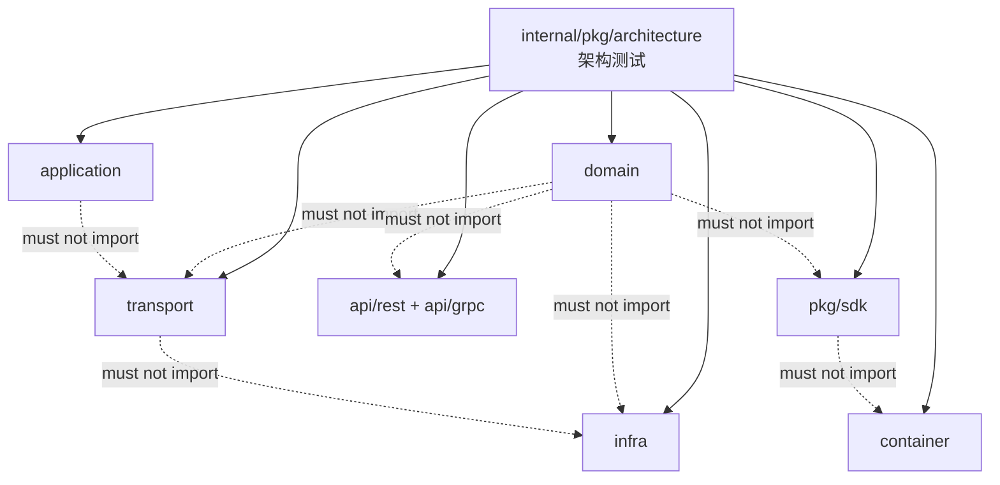

# 架构测试

> 状态：已实现 · 已与 `internal/pkg/architecture`、`go test ./internal/pkg/architecture/...` 核对。

---

## 1. 本文回答

本文回答 10 个问题：

- IAM 为什么需要架构测试？
- 架构测试保护哪些分层依赖边界？
- 哪些依赖方向应该被测试禁止？
- 哪些跨模块依赖应该被测试约束？
- SDK 为什么必须通过架构测试禁止 import `internal`？
- 如何把分层规则写成可执行测试？
- 架构测试失败时应该如何排查？
- 新增模块、新增包、新增依赖时应该如何补测试？
- 架构测试如何进入 CI？
- 修改后应该执行哪些 Verify？

本文是架构护栏的测试落地文档。分层规则见 [01-分层依赖边界.md](01-分层依赖边界.md)。

---

## 2. 30 秒结论

架构测试负责把“分层依赖边界”变成可执行规则。

核心目标：

```text
domain 不依赖 infra / transport / api / proto / SDK；
application 不依赖 transport / container / 具体 infra；
transport 不绕过 application 直接访问 repository / tx / Casbin / container；
infra 不反向依赖 application / transport；
container 只做 wiring，不被业务层反向调用；
SDK 不 import internal；
AuthZ domain 不被 Casbin facts 污染；
Suggest index/store 不直接调用 AuthZ；
IDP 不直接创建 Identity User；
REST/gRPC DTO/proto 不进入 domain。
```

架构测试事实源：

```text
../../internal/pkg/architecture
```

最重要的 Verify：

```bash
go test ./internal/pkg/architecture
```

如果只记一句话：

> 架构测试不是测业务正确性，而是防止代码依赖方向退化、职责穿透和安全链路绕过。

---

## 3. 架构测试保护什么

架构测试保护的是“结构性不变量”。

它不验证：

```text
登录密码是否正确；
Token 是否真的过期；
AuthZ Check 是否返回 allow；
Suggest 搜索排序是否符合预期；
IDP provider API 是否可用；
数据库 SQL 是否正确。
```

它验证：

```text
某层不能 import 某层；
某模块不能穿透另一个模块内部实现；
某些 concrete 只能出现在 infra 或 container；
SDK 不能依赖 internal；
domain 不能依赖 generated proto；
transport 不能绕过 application；
infra store 不能吞并业务决策。
```

---

## 4. 架构测试总图



读图规则：

```text
架构测试扫描 import 图；
它不关心业务用例运行结果；
它关心包之间是否出现禁止依赖；
它应该在 CI 中早于集成测试失败；
失败时应优先调整依赖方向，而不是豁免规则。
```

---

## 5. 核心规则组

### 5.1 Domain 纯粹性规则

目标：保持领域层不被协议、技术实现或生成物污染。

应禁止：

```text
domain -> infra；
domain -> transport；
domain -> container；
domain -> api/rest；
domain -> api/grpc；
domain -> generated proto；
domain -> pkg/sdk；
domain -> Redis/MySQL/Mongo/NSQ client；
domain -> Gin/grpc-go handler；
domain -> Casbin concrete；
domain -> provider SDK concrete。
```

原因：

```text
领域模型应该表达业务事实和不变量；
领域模型不应该知道自己如何被传输、持久化、缓存、调用或部署；
领域模型被 proto/DTO 污染后，协议变更会反向破坏业务模型。
```

---

### 5.2 Application 编排边界规则

目标：让 application 只编排用例，不依赖协议层和具体技术实现。

应禁止：

```text
application -> transport；
application -> container；
application -> handler DTO；
application -> generated proto as command/query；
application -> concrete repository，除非当前架构明确允许且有例外说明；
application -> concrete Redis/MySQL/Mongo client；
application -> provider SDK concrete；
application -> Casbin enforcer concrete。
```

允许：

```text
application -> domain；
application -> port interface；
application -> shared error / clock / id generator 等通用基础包；
application -> contract-neutral command/query/result。
```

---

### 5.3 Transport 协议适配规则

目标：防止 handler/service method 吞并业务用例。

应禁止：

```text
transport -> infra repository concrete；
transport -> transaction manager concrete；
transport -> Casbin enforcer concrete；
transport -> provider adapter concrete；
transport -> container；
transport -> domain repository concrete；
transport handler 直接访问 DB/cache/MQ；
transport service method 直接拼业务流程。
```

允许：

```text
transport -> application；
transport -> request/response DTO；
transport -> mapper；
transport -> middleware/interceptor；
transport -> generated proto for gRPC；
transport -> OpenAPI generated server glue，若存在。
```

---

### 5.4 Infra 实现端口规则

目标：让 infra 只实现技术细节，不反向驱动业务流程。

应禁止：

```text
infra -> application use case；
infra -> transport；
infra -> handler DTO；
infra -> container；
infra store -> AuthZ Check use case；
infra repository -> REST/gRPC response DTO。
```

允许：

```text
infra -> domain；
infra -> port interface；
infra -> external technical library；
infra -> persistence record mapper；
infra -> provider SDK concrete；
infra -> Redis/MySQL/Mongo/NSQ/Casbin concrete。
```

---

### 5.5 Container 组合根规则

目标：防止 container 变成运行时 Service Locator。

应禁止：

```text
domain -> container；
application -> container；
transport handler -> container；
infra -> container；
pkg/sdk -> container。
```

允许：

```text
container -> domain ports；
container -> application service；
container -> infra concrete；
container -> transport handler/service；
container -> configuration / lifecycle；
container -> process wiring。
```

规则：

```text
container 可以知道所有 concrete；
container 只在启动装配期使用；
运行时请求链路不应从 container 临时取依赖。
```

---

### 5.6 SDK 边界规则

目标：保证 SDK 是可发布、可复用的外部接入包。

应禁止：

```text
pkg/sdk -> internal/apiserver；
pkg/sdk -> internal/pkg；
pkg/sdk -> domain；
pkg/sdk -> application；
pkg/sdk -> infra；
pkg/sdk -> transport；
pkg/sdk -> container。
```

允许：

```text
pkg/sdk -> public generated client；
pkg/sdk -> api contract generated type，若该类型是公开包；
pkg/sdk -> standard library；
pkg/sdk -> external HTTP/gRPC client library。
```

---

## 6. 业务模块专项规则

### 6.1 AuthN 不能吞并 AuthZ

应禁止：

```text
AuthN domain -> AuthZ concrete；
AuthN token verifier -> 直接判断复杂资源权限；
AuthN login use case -> 直接写 RoleBinding；
```

原因：

```text
AuthN 负责认证；
AuthZ 负责授权；
Token 验签成功不等于授权通过。
```

---

### 6.2 AuthZ domain 不被 Casbin 污染

应禁止：

```text
domain/authz -> casbin concrete；
domain/authz -> Casbin p/g/r storage model；
```

允许：

```text
infra/authz -> Casbin adapter；
application/authz -> AuthZRuntime port；
domain/authz -> Subject / Resource / Action / Scope / AuthorizationDecision。
```

---

### 6.3 IDP 不直接创建 Identity User

应禁止：

```text
application/idp -> identity repository concrete；
infra/idp provider adapter -> identity user/profile write；
domain/idp -> identity User/Profile entity；
```

原因：

```text
IDP 只解析 ExternalIdentity；
AuthN/Identity 明确用例决定 login/link/onboard；
provider claims 不能直接污染内部身份事实。
```

---

### 6.4 Suggest index/store 不直接调用 AuthZ

应禁止：

```text
infra/suggest/search -> application/authz；
infra/suggest/search -> AuthZ Check concrete；
index store -> RoleBinding repository；
```

原因：

```text
Index 只返回候选；
可见性过滤由 application/suggest 编排；
Store / Index 不应吞并授权决策。
```

---

### 6.5 Identity 不依赖 Suggest 读模型

应禁止：

```text
domain/identity -> domain/suggest；
application/identity -> infra/suggest/search concrete；
identity write use case -> 直接操作 Suggest runtime snapshot；
```

推荐：

```text
Identity 发布 Profile changed 事实；
Suggest 通过 refresh / event / loader 派生读模型；
Identity 不需要知道 ProfileSuggestionIndex 如何实现。
```

---

## 7. 测试实现建议

架构测试可以基于 import 图实现。

建议测试维度：

```text
package path prefix；
forbidden import prefix；
allowed import prefix；
module-specific forbidden dependency；
SDK no-internal rule；
domain no-generated-proto rule；
transport no-infra-concrete rule；
infra no-application rule。
```

建议测试命名：

```text
TestDomainDoesNotDependOnInfraOrTransport
TestApplicationDoesNotDependOnTransport
TestTransportDoesNotBypassApplication
TestInfraDoesNotDependOnApplicationOrTransport
TestSDKDoesNotImportInternal
TestAuthZDomainDoesNotImportCasbin
TestDomainDoesNotImportGeneratedProto
TestSuggestStoreDoesNotDependOnAuthZApplication
TestIDPDoesNotDependOnIdentityWriteConcrete
```

注意：具体测试名称以当前代码为准。上方是建议模板。

---

## 8. 新增规则模板

新增架构规则时建议按以下模板写清楚：

```text
规则名称：
保护目标：
禁止依赖：
允许依赖：
为什么需要：
违反后风险：
对应文档：
Verify：
```

示例：

```text
规则名称：SDK 不得 import internal
保护目标：保证 SDK 可独立发布和被外部业务服务使用
禁止依赖：pkg/sdk -> internal/*
允许依赖：pkg/sdk -> public generated client / standard library
为什么需要：Go internal 包语义上不可被外部模块依赖
违反后风险：SDK 不能作为稳定接入面发布
对应文档：03-接入与契约/03-Go-SDK接入模型.md
Verify：go test ./internal/pkg/architecture && go test ./pkg/sdk/...
```

---

## 9. 失败排查流程

架构测试失败时，按顺序排查：

```text
1. 看失败规则名称；
2. 找到 forbidden import；
3. 判断是代码位置放错，还是依赖方向错；
4. 如果是 transport 依赖 infra，改为 transport -> application -> port -> infra；
5. 如果是 domain 依赖 proto/DTO，增加 mapper；
6. 如果是 application 依赖 infra concrete，抽 port；
7. 如果是 SDK 依赖 internal，改走 public contract/generated client；
8. 如果是合理例外，先更新架构设计文档，再谨慎增加白名单；
9. 重新运行 architecture test 和相关模块测试。
```

原则：

```text
优先调整代码结构；
不要第一反应加白名单；
白名单必须有文档说明和退出条件；
架构测试失败通常是设计反馈，不只是测试噪音。
```

---

## 10. 白名单与例外管理

架构测试可以有例外，但必须严格管理。

例外必须说明：

```text
为什么违反默认规则；
为什么当前阶段必须允许；
是否有替代方案；
什么时候移除；
对应 issue / TODO；
影响范围。
```

禁止：

```text
为了让测试通过随意加白名单；
没有文档说明的长期例外；
把临时迁移期例外写成永久规则；
用白名单掩盖 transport 访问 repository、domain import proto、SDK import internal 等核心风险。
```

---

## 11. CI 集成建议

架构测试应该进入 CI。

建议流水线：

```text
make docs-hygiene
make api-validate
make proto-gen
go test ./internal/pkg/architecture
go test ./internal/apiserver/domain/...
go test ./internal/apiserver/application/...
go test ./internal/apiserver/transport/rest/...
go test ./internal/apiserver/transport/grpc/...
go test ./pkg/sdk/...
```

对于架构测试：

```text
应在 PR 阶段运行；
失败应阻断合并；
失败输出应包含违反规则的 import 路径；
新增模块必须同步更新架构规则；
删除/移动目录必须同步更新测试路径。
```

---

## 12. 常见反模式

| 反模式 | 问题 | 修正 |
| --- | --- | --- |
| domain import generated proto | 协议污染领域 | transport mapper 转 command/query |
| domain import GORM/Redis | 技术污染领域 | domain 定义 port，infra 实现 |
| application 使用 handler DTO | 用例层被协议污染 | DTO 转 application command/query |
| handler 直接访问 repository | 绕过 use case 和权限 | handler 调 application |
| handler 直接开事务 | 事务边界分散 | application 编排 tx port |
| transport 直接调用 Casbin | 授权语义分散 | AuthZ application 封装 Check |
| repository 调 use case | infra 反向依赖 application | application 调 repository port |
| SDK import internal | SDK 不可稳定发布 | SDK 只依赖公开契约 |
| Store 直接调用 AuthZ | infra 吞并业务决策 | application 编排 visibility |
| 随意加白名单 | 护栏失效 | 白名单需文档说明和退出条件 |

---

## 13. 事实源

| 事实 | 路径 |
| --- | --- |
| 架构测试 | `../../internal/pkg/architecture` |
| 分层依赖边界文档 | `01-分层依赖边界.md` |
| Domain | `../../internal/apiserver/domain` |
| Application | `../../internal/apiserver/application` |
| Infra | `../../internal/apiserver/infra` |
| REST transport | `../../internal/apiserver/transport/rest` |
| gRPC transport | `../../internal/apiserver/transport/grpc` |
| Container | `../../internal/apiserver/container` |
| SDK | `../../pkg/sdk` |
| REST 契约 | `../../api/rest` |
| gRPC 契约 | `../../api/grpc` |
| 契约防漂移文档 | `../03-接入与契约/05-契约事实源与防漂移.md` |

注意：上表路径需要继续与当前源码核对。如果目录已调整，应以代码为准并同步更新本文。

---

## 14. Verify

修改架构测试后至少执行：

```bash
go test ./internal/pkg/architecture
```

涉及分层代码：

```bash
go test ./internal/apiserver/domain/...
go test ./internal/apiserver/application/...
go test ./internal/apiserver/infra/...
go test ./internal/apiserver/transport/rest/...
go test ./internal/apiserver/transport/grpc/...
go test ./internal/apiserver/container/...
```

涉及 SDK：

```bash
go test ./pkg/sdk/...
```

涉及契约：

```bash
make api-validate
make proto-gen
```

修改本文后至少执行：

```bash
make docs-hygiene
```

---

## 15. 本文总结

架构测试可以压缩成：

```text
把分层依赖边界写成可执行 import 规则；
把跨模块职责边界写成禁止依赖规则；
把 SDK no-internal、domain no-proto、transport no-repository 等规则放进 CI；
失败时优先修正依赖方向，而不是增加白名单。
```

最重要的工程规则是：

```text
架构测试不是业务测试；
架构测试保护的是分层、边界和职责；
每新增一个模块、包或接入方式，都要考虑是否需要新增护栏规则；
核心边界不能靠口头约定，必须靠测试和 CI 固化。
```
