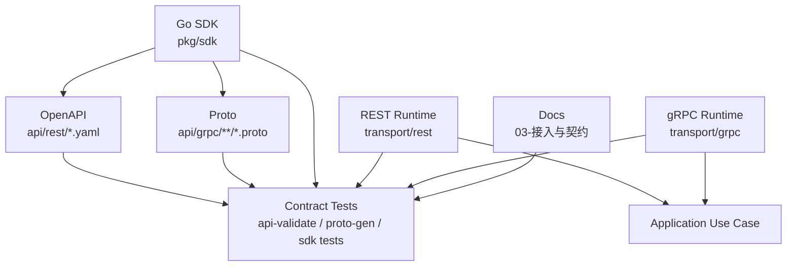

# 契约测试

> 状态：设计目标 · 第一版正文，待继续按 `api/rest`、`api/grpc`、`pkg/sdk`、`transport/rest`、`transport/grpc`、契约生成脚本、CI 流水线和测试用例逐项核对。

---

## 1. 本文回答

本文回答 10 个问题：

- IAM 为什么需要契约测试？
- REST 契约测试应该覆盖什么？
- gRPC 契约测试应该覆盖什么？
- Go SDK 契约测试应该覆盖什么？
- OpenAPI / proto / SDK / transport / docs 如何防漂移？
- 契约测试与架构测试有什么区别？
- 契约测试失败时应该如何排查？
- 新增或修改接口时应该补哪些测试？
- 契约测试如何进入 CI？
- 修改后应该执行哪些 Verify？

本文是架构护栏中的契约测试文档。
接入契约见 [../03-接入与契约](../03-接入与契约/README.md)；
契约事实源与防漂移见 [../03-接入与契约/05-契约事实源与防漂移.md](../03-接入与契约/05-契约事实源与防漂移.md)；
架构测试见 [02-架构测试.md](02-架构测试.md)；

---

## 2. 30 秒结论

契约测试负责确保“公开接口契约”和“运行时实现”一致。

核心目标：

```text
OpenAPI 与 REST handler 不漂移；
proto 与 gRPC service / mapper 不漂移；
SDK public API 与 OpenAPI/proto 不漂移；
错误模型在 REST/gRPC/SDK 之间语义一致；
认证、授权、脱敏、限流等接入语义不被绕过；
文档中的接入说明不制造机器契约之外的事实。
```

最重要的事实源：

| 契约 | 事实源 | Verify |
| --- | --- | --- |
| REST | `../../api/rest` | `make api-validate` + REST transport tests |
| gRPC | `../../api/grpc` | `make proto-gen` + gRPC transport tests |
| SDK | `../../pkg/sdk` | `go test ./pkg/sdk/...` |
| 文档链接 | `../../scripts/check-docs-links.py` | `make docs-hygiene` |

如果只记一句话：

> 契约测试不是测领域逻辑，而是防止 OpenAPI、proto、SDK、transport、文档之间发生漂移。

---

## 3. 契约测试与架构测试的区别

| 类型 | 关注点 | 示例 |
| --- | --- | --- |
| 架构测试 | import 依赖方向和分层边界 | `domain` 不能 import `transport`；SDK 不能 import `internal` |
| 契约测试 | 公开接口契约和运行时实现一致性 | OpenAPI path 有实现；proto RPC 有 service；SDK 错误映射正确 |
| 业务测试 | 业务规则和用例正确性 | 登录成功、权限检查、Profile 搜索过滤 |
| 集成测试 | 多组件协作行为 | REST -> application -> DB -> response |

边界：

```text
架构测试防“代码依赖方向错”；
契约测试防“接口定义和实现不一致”；
业务测试防“领域规则错”；
集成测试防“组件协作错”。
```

---

## 4. 契约测试总图



读图规则：

```text
OpenAPI 是 REST 机器契约；
proto 是 gRPC 机器契约；
SDK 封装公开调用面；
transport 是运行时实现；
application 是业务用例入口；
契约测试检查这些边是否保持一致。
```

---

## 5. REST 契约测试

REST 契约事实源：

```text
../../api/rest/*.yaml
```

REST 运行时事实源：

```text
../../internal/apiserver/transport/rest
```

### 5.1 测试目标

REST 契约测试应确认：

```text
OpenAPI 文件格式合法；
path / method / operationId 合法且无冲突；
request schema 与 handler DTO 对齐；
response schema 与 handler response 对齐；
error response schema 稳定；
security scheme 正确声明；
必需认证的接口不会漏 security；
状态码语义与错误映射一致；
敏感字段不出现在 response schema；
OpenAPI examples 与真实响应语义一致。
```

---

### 5.2 最小 Verify

```bash
make api-validate
```

涉及 REST 运行时：

```bash
go test ./internal/apiserver/transport/rest/...
```

涉及 SDK：

```bash
go test ./pkg/sdk/...
```

---

### 5.3 推荐测试用例

按模块覆盖：

```text
Identity REST：User/Profile/ProfileLink request/response schema；
AuthN REST：login/refresh/logout/JWKS response 和 token 安全字段；
AuthZ REST：Check、RoleBinding、PolicyVersion 错误语义；
IDP REST：Credentials 脱敏、AppToken 不外泄、provider error 映射；
Suggest REST：只返回 mobile_mask，不返回 mobile；手机号搜索限流/权限错误语义。
```

按错误覆盖：

```text
400 / InvalidArgument；
401 / Unauthenticated；
403 / PermissionDenied；
404 / NotFound；
409 / Conflict；
429 / RateLimited；
500 / Internal；
503 / Unavailable。
```

---

### 5.4 常见 REST 漂移

| 漂移 | 表现 | 修正 |
| --- | --- | --- |
| OpenAPI 有字段，handler 不读 | 调用方传参无效 | 更新 handler DTO / mapper |
| handler 返回字段，OpenAPI 没写 | SDK/文档缺字段 | 更新 OpenAPI |
| OpenAPI security 漏掉 | 未认证也能调用或文档误导 | 补 security scheme 和 middleware 测试 |
| 错误 schema 不一致 | 调用方无法统一处理错误 | 统一 error response |
| Suggest schema 出现 `mobile` | 隐私泄露风险 | 改为 `mobile_mask` |
| IDP schema 返回 provider token | 凭据泄露风险 | 移除或改内部接口 |

---

## 6. gRPC 契约测试

gRPC 契约事实源：

```text
../../api/grpc/**/*.proto
```

gRPC 运行时事实源：

```text
../../internal/apiserver/transport/grpc
```

### 6.1 测试目标

gRPC 契约测试应确认：

```text
proto 可生成；
package / service / rpc 命名稳定；
message field number 不复用；
删除字段使用 reserved；
enum 默认值和新增值兼容；
generated code 与当前 proto 同步；
service method 实现与 proto 一致；
proto mapper 不丢字段；
status code 与错误模型一致；
metadata 认证要求正确；
敏感字段不出现在 response message。
```

---

### 6.2 最小 Verify

```bash
make proto-gen
```

涉及 gRPC 运行时：

```bash
go test ./internal/apiserver/transport/grpc/...
```

涉及 SDK / generated client：

```bash
go test ./pkg/sdk/...
```

---

### 6.3 推荐测试用例

按模块覆盖：

```text
Identity gRPC：User/Profile/ProfileLink message 与 application result 对齐；
AuthN gRPC：login/refresh/token verify/JWKS message 与错误语义；
AuthZ gRPC：Check / BatchCheck / RoleBinding / PolicyVersion；
IDP gRPC：ExternalIdentity、Credentials 脱敏、provider error 映射；
Suggest gRPC：SuggestProfile 只返回脱敏候选，若已实现。
```

按 status code 覆盖：

```text
InvalidArgument；
Unauthenticated；
PermissionDenied；
NotFound；
AlreadyExists；
FailedPrecondition；
Aborted；
ResourceExhausted；
Unavailable；
DeadlineExceeded；
Internal。
```

---

### 6.4 常见 gRPC 漂移

| 漂移 | 表现 | 修正 |
| --- | --- | --- |
| proto 新增 RPC，service 未实现 | 编译或运行失败 | 实现 service method 或移除 RPC |
| field 改号 | 兼容性破坏 | 恢复 field number，新增字段用新编号 |
| 删除字段未 reserved | 后续复用导致兼容风险 | 补 reserved |
| mapper 漏字段 | 零值或数据丢失 | 更新 mapper 和测试 |
| status code 混乱 | 调用方错误处理失败 | 统一错误映射 |
| domain import pb | 协议污染领域 | mapper 留在 transport 边界 |

---

## 7. Go SDK 契约测试

SDK 事实源：

```text
../../pkg/sdk
```

### 7.1 测试目标

SDK 契约测试应确认：

```text
public API 可编译；
示例代码可编译；
SDK 不 import internal；
request/response DTO 与 OpenAPI/proto 对齐；
TokenSource 正确注入 Authorization header 或 metadata；
错误映射与 REST/gRPC 一致；
context cancellation 生效；
timeout / retry 默认值安全；
敏感字段不进日志；
Suggest response 不暴露明文 mobile；
IDP response 不暴露 raw secret / provider token。
```

---

### 7.2 最小 Verify

```bash
go test ./pkg/sdk/...
```

配合架构测试：

```bash
go test ./internal/pkg/architecture
```

---

### 7.3 推荐测试用例

```text
compile test：主要 public API 示例；
mock REST server test：HTTP status -> SDK error；
mock gRPC server test：gRPC code -> SDK error；
TokenSource test：header/metadata 注入、刷新、失败；
context test：取消和超时；
privacy test：日志不包含 token/mobile/secret；
compat test：新增字段不破坏旧调用。
```

---

## 8. 错误模型一致性测试

REST、gRPC、SDK 应保持错误语义一致。

| 语义 | REST | gRPC | SDK |
| --- | --- | --- | --- |
| 参数错误 | 400 / 422 | InvalidArgument | InvalidArgument |
| 未认证 | 401 | Unauthenticated | Unauthenticated |
| 无权限 | 403 | PermissionDenied | PermissionDenied |
| 不存在 | 404 | NotFound | NotFound |
| 已存在 | 409 | AlreadyExists | AlreadyExists |
| 冲突 | 409 | Aborted / FailedPrecondition | Conflict |
| 限流 | 429 | ResourceExhausted | RateLimited |
| 超时/不可用 | 503 / 504 | Unavailable / DeadlineExceeded | Unavailable |
| 内部错误 | 500 | Internal | Internal |

测试目标：

```text
同一业务错误在 REST/gRPC/SDK 中语义一致；
错误对象保留 traceID；
错误 details 不泄露敏感信息；
调用方可以基于稳定 code 做分支处理。
```

---

## 9. 安全与隐私契约测试

安全字段必须作为契约测试重点。

### 9.1 禁止出现在响应中的字段

```text
password；
otp；
session_key；
app_secret；
provider access_token；
raw credentials；
明文 mobile；
明文 id_no；
完整 refresh token，除非是明确 AuthN token endpoint；
完整 search token；
SQL / Redis key / stack trace。
```

### 9.2 必测场景

```text
AuthN token response 只返回契约允许字段；
IDP Credentials response 脱敏；
IDP provider error 不透传 raw response；
Suggest response 只返回 mobile_mask；
AuthZ deny 不泄露资源存在性，若安全策略要求；
日志和错误不包含 token/secret/mobile/id_no。
```

---

## 10. 文档契约测试

文档本身也需要防漂移。

Verify：

```bash
make docs-hygiene
```

应检查：

```text
README 链接存在；
active docs 不引用 archive 作为当前事实；
接入文档不手写完整 schema；
文档中 endpoint/RPC/API 示例不宣称未实现能力；
文件重命名后目录 README 已同步；
Verify 命令没有指向不存在路径。
```

---

## 11. 新增接口的契约测试清单

新增 REST endpoint：

```text
1. 更新 OpenAPI；
2. 增加或更新 api-validate；
3. 实现 handler；
4. 增加 request/response mapper 测试；
5. 增加错误映射测试；
6. 更新 SDK，若需要；
7. 更新接入文档，若需要；
8. 更新业务模块文档，若语义变化；
9. 运行 REST / SDK / docs Verify。
```

新增 gRPC RPC：

```text
1. 更新 proto；
2. 保证 field number 稳定；
3. 运行 proto-gen；
4. 实现 service method；
5. 增加 proto mapper 测试；
6. 增加 status code 测试；
7. 更新 SDK/generated client，若需要；
8. 更新接入文档，若需要；
9. 运行 gRPC / SDK / docs Verify。
```

新增 SDK method：

```text
1. 确认 OpenAPI/proto 已有机器契约；
2. 增加 public API；
3. 增加 compile test；
4. 增加 mock server test；
5. 增加错误映射测试；
6. 增加日志脱敏测试，若涉及敏感字段；
7. 更新 SDK docs/examples；
8. 运行 SDK / architecture / docs Verify。
```

---

## 12. 失败排查流程

契约测试失败时，按顺序排查：

```text
1. 判断失败来自 OpenAPI、proto、SDK、transport 还是 docs；
2. 找到机器事实源；
3. 对比运行时实现是否同步；
4. 对比 mapper 是否漏字段或语义错误；
5. 对比错误映射是否改变；
6. 对比 SDK public API 是否还按旧契约；
7. 对比文档是否仍指向旧文件名或旧字段；
8. 修正后运行对应 Verify；
9. 最后运行 docs-hygiene 和 architecture tests。
```

原则：

```text
机器契约优先；
不要用改文档掩盖机器契约问题；
不要用跳过测试掩盖运行时未实现；
不要让 SDK 用兼容 hack 长期掩盖契约漂移。
```

---

## 13. CI 集成建议

契约测试应进入 CI。

建议流水线：

```text
make docs-hygiene
make api-validate
make proto-gen
go test ./internal/pkg/architecture
go test ./internal/apiserver/transport/rest/...
go test ./internal/apiserver/transport/grpc/...
go test ./pkg/sdk/...
```

如果 `make proto-gen` 会修改生成文件，CI 应检测工作区是否干净。

如果 OpenAPI 生成 SDK 或客户端，CI 应检测生成物是否同步。

如果 docs-hygiene 失败，应阻断合并，避免 README 或接入文档引用不存在文件。

---

## 14. 常见反模式

| 反模式 | 问题 | 修正 |
| --- | --- | --- |
| 只改文档不改 OpenAPI | 文档制造假契约 | schema 以 OpenAPI 为准 |
| 只改 proto 不跑生成 | generated 漂移 | 执行 `make proto-gen` |
| handler 返回字段未写 OpenAPI | SDK/调用方不可见 | 更新 OpenAPI 和测试 |
| proto mapper 漏字段 | 数据丢失 | 增加 mapper 测试 |
| SDK public API 无 compile test | 兼容性不可控 | 添加 compile test |
| 错误映射各协议不一致 | 调用方处理困难 | 统一错误语义表 |
| Suggest 返回 mobile 明文 | 隐私泄露 | 契约只允许 mobile_mask |
| IDP 返回 provider token | 凭据泄露 | AppToken 仅内部使用 |
| 文档写未实现 endpoint | 误导接入方 | 标注规划或删除 |
| 测试失败后加白名单 | 护栏失效 | 优先修正契约或实现 |

---

## 15. 事实源

| 事实 | 路径 |
| --- | --- |
| REST 契约 | `../../api/rest` |
| REST transport | `../../internal/apiserver/transport/rest` |
| gRPC 契约 | `../../api/grpc` |
| gRPC transport | `../../internal/apiserver/transport/grpc` |
| Go SDK | `../../pkg/sdk` |
| 架构测试 | `../../internal/pkg/architecture` |
| 接入契约文档 | `../03-接入与契约` |
| 契约防漂移文档 | `../03-接入与契约/05-契约事实源与防漂移.md` |
| 业务模块文档 | `../02-业务模块` |

注意：上表路径需要继续与当前源码核对。如果目录已调整，应以代码为准并同步更新本文。

---

## 16. Verify

REST 契约测试：

```bash
make api-validate
go test ./internal/apiserver/transport/rest/...
```

gRPC 契约测试：

```bash
make proto-gen
go test ./internal/apiserver/transport/grpc/...
```

SDK 契约测试：

```bash
go test ./pkg/sdk/...
```

架构边界：

```bash
go test ./internal/pkg/architecture
```

涉及业务模块 application：

```bash
go test ./internal/apiserver/application/identity/...
go test ./internal/apiserver/application/authn/...
go test ./internal/apiserver/application/authz/...
go test ./internal/apiserver/application/idp/...
go test ./internal/apiserver/application/suggest/...
```

修改本文后至少执行：

```bash
make docs-hygiene
```

---

## 17. 本文总结

契约测试可以压缩成：

```text
REST：OpenAPI + transport/rest；
gRPC：proto + transport/grpc；
SDK：pkg/sdk public API + compile/mock tests；
Docs：docs-hygiene 防链接和事实漂移；
Security：敏感字段不能进入公开响应、错误和日志。
```

最重要的工程规则是：

```text
契约测试保护公开接入面；
机器契约优先于 prose docs；
OpenAPI/proto/SDK/transport/application/docs 必须同步；
错误模型、安全脱敏和认证授权语义必须跨协议一致；
契约测试应进入 CI，失败应阻断合并。
```
