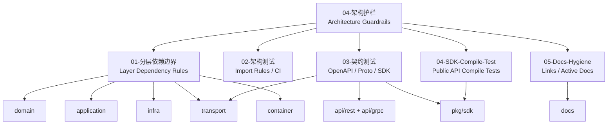

# 04-架构护栏

> 状态：待补证据 · 架构护栏总入口；`01`–`05` 五篇主文档齐全，`02`/`04`/`05` 已与测试脚本核对，`01`/`03` 仍待逐项 import/契约核对。

---

## 1. 本目录定位

`04-架构护栏/` 说明 IAM 如何防止代码结构、接入契约、SDK public API 和文档事实长期漂移。

它回答：

```text
IAM 的分层依赖边界是什么？
哪些依赖方向允许，哪些依赖方向禁止？
如何用架构测试固化分层规则？
如何用契约测试防止 REST/gRPC/SDK 漂移？
如何用 SDK Compile Test 保护 Go SDK public API？
如何用 Docs Hygiene 防止文档链接损坏和旧事实回流？
这些护栏如何进入 CI？
```

本目录关注“工程护栏”，不直接定义业务模型。

业务模型、关键链路和模块边界见 [../02-业务模块](../02-业务模块/README.md)。

接入契约、REST/gRPC/SDK 和防漂移事实源见 [../03-接入与契约](../03-接入与契约/README.md)。

---

## 2. 30 秒结论

IAM 架构护栏由五类规则组成：

| 护栏 | 保护什么 | 核心 Verify |
| --- | --- | --- |
| 分层依赖边界 | `domain / application / infra / transport / container / api / sdk` 的依赖方向 | `go test ./internal/pkg/architecture` |
| 架构测试 | 把分层依赖规则变成可执行 import 规则 | `go test ./internal/pkg/architecture` |
| 契约测试 | 防止 OpenAPI、proto、SDK、transport、docs 漂移 | `make api-validate` / `make proto-gen` / `go test ./pkg/sdk/...` |
| SDK Compile Test | 保护 Go SDK public API 和示例可编译 | `go test ./pkg/sdk/...` |
| Docs Hygiene | 防止文档链接损坏、旧事实回流、README 失效 | `make docs-hygiene` |

最重要的规则：

```text
domain 保持纯粹；
application 负责编排；
infra 实现端口；
transport 只做协议适配；
container 只做依赖装配；
SDK 只走公开契约，不 import internal；
OpenAPI/proto/SDK/transport/application/docs 必须同步；
active docs 不引用 archive 作为当前事实。
```

如果只记一句话：

> 架构护栏的目标不是增加流程，而是把“不能越界”的工程约定变成测试、CI 和文档入口。

---

## 3. 文档结构

当前目录包含 5 篇主文档：

| 文档 | 作用 | 阅读重点 |
| --- | --- | --- |
| [01-分层依赖边界.md](01-分层依赖边界.md) | 分层规则总说明 | 各层职责、允许依赖、禁止依赖、跨模块 port、典型链路落层 |
| [02-架构测试.md](02-架构测试.md) | 架构测试落地 | import 规则、专项规则、白名单、失败排查、CI 集成 |
| [03-契约测试.md](03-契约测试.md) | REST/gRPC/SDK 契约测试 | OpenAPI/proto/SDK/transport/docs 防漂移，错误模型和安全字段测试 |
| [04-SDK-Compile-Test.md](04-SDK-Compile-Test.md) | SDK public API 编译保护 | Go SDK 的 public API、示例代码、兼容性和 no-internal 规则 |
| [05-Docs-Hygiene.md](05-Docs-Hygiene.md) | 文档卫生规则 | 链接检查、active/archive 边界、README 对齐、旧事实防回流 |

---

## 4. 架构护栏总图



读图规则：

```text
分层依赖边界定义规则；
架构测试把规则变成 import 检查；
契约测试防止 OpenAPI/proto/SDK/transport 漂移；
SDK Compile Test 保护 SDK public API；
Docs Hygiene 保护文档链接、阅读路径和 active/archive 边界。
```

---

## 5. 分层依赖边界

分层依赖的核心方向是：

```text
transport
  -> application
  -> domain

infra
  -> domain ports

container
  -> all concrete for wiring only

api/rest + api/grpc
  -> machine contract

pkg/sdk
  -> public contract client, no internal import
```

各层职责：

| 层 | 职责 | 不应该做什么 |
| --- | --- | --- |
| `domain` | 领域模型、不变量、领域服务、port | 不依赖 infra/transport/proto/SDK |
| `application` | 用例编排、事务边界、端口调用 | 不依赖 transport，不直接依赖具体 infra |
| `infra` | repository、cache、MQ、provider、Casbin adapter | 不反向调用 application，不返回 transport DTO |
| `transport` | REST/gRPC 协议适配、DTO/proto mapper | 不直接访问 repository、tx、Casbin、container |
| `container` | composition root，依赖装配 | 不执行业务用例，不参与请求处理 |
| `api/rest` / `api/grpc` | OpenAPI/proto 机器契约 | 不进入 domain，不定义业务实现 |
| `pkg/sdk` | 外部 Go 接入封装 | 不 import IAM internal，不替代机器契约 |

详细说明见 [01-分层依赖边界.md](01-分层依赖边界.md)。

---

## 6. 架构测试

架构测试负责把分层依赖边界变成可执行规则。

它保护：

```text
domain 不依赖 infra / transport / api / proto / SDK；
application 不依赖 transport / container / 具体 infra；
transport 不绕过 application 直接访问 repository / tx / Casbin / container；
infra 不反向依赖 application / transport；
container 不被业务层反向调用；
SDK 不 import internal；
AuthZ domain 不被 Casbin facts 污染；
Suggest index/store 不直接调用 AuthZ；
IDP 不直接创建 Identity User；
REST/gRPC DTO/proto 不进入 domain。
```

最小 Verify：

```bash
go test ./internal/pkg/architecture
```

详细说明见 [02-架构测试.md](02-架构测试.md)。

---

## 7. 契约测试

契约测试负责确保公开接口契约和运行时实现一致。

它保护：

```text
OpenAPI 与 REST handler 不漂移；
proto 与 gRPC service / mapper 不漂移；
SDK public API 与 OpenAPI/proto 不漂移；
错误模型在 REST/gRPC/SDK 之间语义一致；
认证、授权、脱敏、限流等接入语义不被绕过；
文档中的接入说明不制造机器契约之外的事实。
```

最小 Verify：

```bash
make api-validate
make proto-gen
go test ./pkg/sdk/...
```

详细说明见 [03-契约测试.md](03-契约测试.md)。

---

## 8. SDK Compile Test

SDK Compile Test 负责保护 Go SDK public API 的可用性和兼容性。

它应该保护：

```text
SDK public client 能编译；
SDK 主要示例能编译；
SDK 不 import internal；
TokenSource、错误模型、request/response 主要类型稳定；
新增 public API 有示例或 compile test；
删除或修改 public API 会被测试发现。
```

最小 Verify：

```bash
go test ./pkg/sdk/...
```

本文后续应继续展开：

```text
04-SDK-Compile-Test.md
```

---

## 9. Docs Hygiene

Docs Hygiene 负责保护文档体系不漂移。

它应该保护：

```text
README 链接存在；
目录入口与实际文件一致；
active docs 不引用 archive 作为当前事实；
删除或合并旧文档后 README 已同步；
Verify 命令不指向不存在路径；
文档不把未实现能力写成已实现事实；
接入文档不手写完整机器契约 schema。
```

最小 Verify：

```bash
make docs-hygiene
```

本文后续应继续展开：

```text
05-Docs-Hygiene.md
```

---

## 10. 推荐阅读路径

### 10.1 新读者

```text
04-架构护栏/README.md
  -> 01-分层依赖边界.md
  -> 02-架构测试.md
  -> 03-契约测试.md
```

目标：先理解架构护栏为什么存在，以及它如何落到测试。

---

### 10.2 准备新增代码包

```text
01-分层依赖边界.md
  -> 02-架构测试.md
```

目标：判断新代码应该放在哪一层，以及是否会触发禁止依赖。

---

### 10.3 准备新增 REST/gRPC 接口

```text
03-契约测试.md
  -> ../03-接入与契约/01-REST接入契约.md
  -> ../03-接入与契约/02-gRPC接入契约.md
  -> ../03-接入与契约/05-契约事实源与防漂移.md
```

目标：确保机器契约、transport、application、SDK、测试和文档同步。

---

### 10.4 准备修改 SDK

```text
04-SDK-Compile-Test.md
  -> ../03-接入与契约/03-Go-SDK接入模型.md
  -> 03-契约测试.md
```

目标：确保 SDK public API 可编译、可迁移、不 import internal。

---

### 10.5 准备移动或删除文档

```text
05-Docs-Hygiene.md
  -> ../03-接入与契约/05-契约事实源与防漂移.md
```

目标：确保 README、链接、active/archive 边界和 Verify 命令同步。

---

## 11. 常见反模式

| 反模式 | 问题 | 推荐做法 |
| --- | --- | --- |
| domain import generated proto | 协议污染领域 | mapper 放 transport/application 边界 |
| application 使用 handler DTO | 用例层被协议污染 | DTO 转 command/query |
| handler 直接访问 repository | 绕过用例和权限 | handler 调 application |
| transport 直接调用 Casbin | 授权语义分散 | AuthZ application 封装 Check |
| infra 调 application | 依赖方向反转 | application 调 infra port |
| SDK import internal | SDK 不可稳定发布 | SDK 只依赖公开契约 |
| OpenAPI 改了 handler 不改 | REST 契约漂移 | OpenAPI、handler、test 同步 |
| proto 改了不跑生成 | gRPC 生成物漂移 | 执行 `make proto-gen` |
| 文档写未实现接口 | 文档制造假事实 | 标注规划或删除 |
| active docs 引用 archive | 旧事实回流 | active 只引用 active |

---

## 12. 事实源

| 事实 | 路径 |
| --- | --- |
| 架构测试 | `../../internal/pkg/architecture` |
| Domain | `../../internal/apiserver/domain` |
| Application | `../../internal/apiserver/application` |
| Infra | `../../internal/apiserver/infra` |
| REST transport | `../../internal/apiserver/transport/rest` |
| gRPC transport | `../../internal/apiserver/transport/grpc` |
| Container | `../../internal/apiserver/container` |
| REST 契约 | `../../api/rest` |
| gRPC 契约 | `../../api/grpc` |
| SDK | `../../pkg/sdk` |
| 接入契约文档 | `../03-接入与契约` |
| 业务模块文档 | `../02-业务模块` |

注意：上表路径需要继续与当前源码核对。如果目录已调整，应以代码为准并同步更新本文。

---

## 13. Verify

修改本目录文档后至少执行：

```bash
make docs-hygiene
```

涉及架构依赖：

```bash
go test ./internal/pkg/architecture
```

涉及业务模块代码：

```bash
go test ./internal/apiserver/domain/...
go test ./internal/apiserver/application/...
```

涉及 infra / transport / container：

```bash
go test ./internal/apiserver/infra/...
go test ./internal/apiserver/transport/rest/...
go test ./internal/apiserver/transport/grpc/...
go test ./internal/apiserver/container/...
```

涉及 REST/gRPC 契约：

```bash
make api-validate
make proto-gen
```

涉及 SDK：

```bash
go test ./pkg/sdk/...
```

---

## 14. 本目录总结

`04-架构护栏/` 的主线是：

```text
分层依赖边界：定义哪些依赖允许，哪些禁止；
架构测试：把依赖边界写成可执行 import 规则；
契约测试：防止 OpenAPI/proto/SDK/transport/docs 漂移；
SDK Compile Test：保护 SDK public API 可编译、可兼容；
Docs Hygiene：保护文档链接、入口和 active/archive 边界。
```

本目录最重要的工程规则是：

```text
不能只靠口头约定守边界；
不能只靠文档说明防漂移；
关键边界必须进入测试；
关键测试必须进入 CI；
失败时优先修正结构和契约，而不是增加白名单或忽略测试。
```
