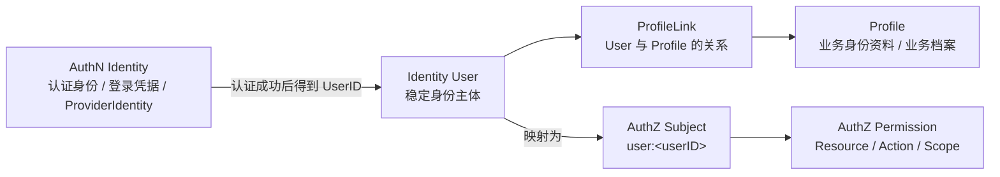

# 00-Identity 模型总览：User、Profile、ProfileLink

## 1. 本文定位

本文是 `04-身份Identity/` 文档组的模型总览文档。

它不先讲数据库表，不先讲 REST/gRPC 接口，也不先讲 AuthN 登录链路或 AuthZ 授权链路，而是先回答一个更基础的问题：

```text
IAM 的 Identity 模块到底在建模什么？
```

在当前 IAM 项目中，Identity 关注的是：

```text
系统中的稳定身份主体是谁？
这个身份主体关联哪些业务身份资料？
这些身份主体与业务身份资料之间是什么关系？
```

因此，Identity 的核心模型不是：

```text
账号登录方式
Token 签发
资源权限判定
```

而是：

```text
User
  -> ProfileLink
  -> Profile
```

本文负责建立这条主线，并压缩说明三个核心模型：

```text
User：IAM 内部稳定身份主体
Profile：业务身份资料 / 业务档案
ProfileLink：User 与 Profile 的关系
```

后续文档会在本文基础上继续展开：

```text
01-ProfileLink链路-User与Profile关系协作.md
02-Identity与AuthN-Account-Principal-User边界.md
03-Identity与AuthZ-Subject-Resource-Permission边界.md
04-Identity分层架构与事实源索引.md
```

---

## 2. 30 秒结论

Identity 负责建模身份主体与身份资料关系。

它回答的是：

```text
谁是系统中的稳定身份主体？
这个身份主体有哪些业务资料或业务档案？
身份主体与业务资料之间是什么关系？
```

核心模型是：

```text
User
  -> ProfileLink
  -> Profile
```

其中：

| 模型 | 一句话解释 |
| --- | --- |
| User | IAM 内部稳定身份主体 |
| Profile | 业务身份资料、业务档案或被服务对象 |
| ProfileLink | User 与 Profile 之间的关系 |

需要特别区分：

```text
AuthN 负责认证身份识别、凭据校验与 Principal 构造。
User 属于 Identity，是稳定身份主体。
Subject 属于 AuthZ，是授权主体引用。
ProfileLink 属于 Identity 关系，不是 AuthZ Permission。
```

一句话：

> Identity 不负责证明你是谁，也不负责判断你能访问什么；Identity 负责沉淀“系统中的人是谁、关联了哪些业务资料、这些关系如何表达”。

---

## 3. Identity 模块到底建模什么

IAM 中很容易把几个概念混在一起：

```text
账号
用户
登录主体
授权主体
业务档案
资源权限
```

但这些概念属于不同模块。

Identity 的关注点是：

```text
User
Profile
ProfileLink
```

也就是：

```text
身份主体
身份资料
身份关系
```

它不负责：

```text
密码校验
第三方登录
Access Token 签发
Refresh Token 轮换
JWKS 发布
资源权限判定
Casbin policy 匹配
```

这些分别属于 AuthN 或 AuthZ。

Identity 只负责提供稳定身份事实。

这些事实会被其他模块使用：

```text
AuthN 认证成功后关联 User。
AuthZ 将 User 映射为 user:<userID> Subject。
业务系统通过 Profile / ProfileLink 理解用户关联的业务档案。
```

---

## 4. 核心模型总图



这张图表达的是：

```text
AuthN 解决认证身份识别、凭据校验与 Principal 构造问题。
User 是 Identity 的稳定身份主体。
Profile 是业务身份资料或业务档案。
ProfileLink 表达 User 与 Profile 的关系。
User 可以在 AuthZ 中被引用为 user:<userID> Subject。
Subject 再通过 AuthZ 参与资源权限判定。
```

不要把这些概念混在一个模型里。

---

## 5. User：IAM 内部稳定身份主体

### 5.1 User 是什么

`User` 是 IAM 内部稳定身份主体。

它回答：

```text
系统中这个“人”是谁？
```

User 是 Identity 模块的核心身份对象。

它可以被 AuthN 认证结果中的 UserID 引用，也可以被 AuthZ 引用为授权主体。

例如：

```text
UserID = 1001
```

在 AuthN 中，认证成功后的 Principal 可以携带它：

```text
Principal.UserID = 1001
```

---

### 5.2 User 不是什么

User 不是认证身份，也不是登录凭据。

认证身份识别、凭据校验、ProviderIdentity 解析属于 AuthN。

例如：

```text
微信小程序 openid
运营后台 username/password
手机号登录凭据
第三方 OAuth subject
```

这些都属于 AuthN 的认证上下文，而不是 Identity.User。

---

### 5.3 为什么 User 要独立于 AuthN 认证身份

一个真实用户可能通过多种认证方式进入系统：

```text
微信小程序 openid
微信公众号 openid / unionid
运营后台用户名密码
手机号验证码
第三方 OAuth subject
```

如果把 User 和 AuthN 认证身份混成一个模型，会出现：

```text
多认证方式难以归一到同一个身份主体
第三方 provider 标识变更会影响 Identity.User
用户身份生命周期和登录凭据生命周期纠缠
AuthN 模块会吞掉 Identity 模型
```

更合理的模型是：

```text
AuthN 负责认证身份识别、凭据校验与 Principal 构造。
Identity.User 负责稳定身份主体。
Principal 通过 UserID 指向 Identity.User。
```

这样，无论认证入口来自微信、运营后台、手机号还是第三方 OAuth，认证成功后都可以归一到同一个 Identity.User。

---

### 5.4 为什么 User 要独立于 Profile

User 是系统中的身份主体。

Profile 是业务身份资料或业务档案。

一个 User 可能关联多个 Profile。

例如：

```text
家长 User 关联多个儿童 Profile
医生 User 关联医生 Profile
运营 User 关联运营 Profile
```

如果直接把 Profile 字段塞进 User，会出现：

```text
User 模型膨胀
多业务资料难以扩展
User 与被服务对象无法区分
不同业务域的资料生命周期被迫和 User 绑定
```

所以需要：

```text
User
  -> ProfileLink
  -> Profile
```

---

### 5.5 User 生命周期

User 通常会有生命周期状态。

常见状态包括：

```text
active
disabled
deleted
```

具体枚举以代码事实源为准。

生命周期语义可以这样理解：

```text
active：正常可用身份主体
disabled：身份主体被禁用，不应继续作为正常业务主体使用
deleted：身份主体被删除或逻辑删除
```

注意：User 状态不等于 AuthN 认证身份或登录凭据状态。

例如：

```text
某个登录凭据被禁用，不一定代表 User 被删除。
User 被禁用，通常会影响该 User 对应的所有认证入口。
```

具体策略需要在 AuthN 与 Identity 协作链路中明确。

---

## 6. Profile：业务身份资料与业务档案

### 6.1 Profile 是什么

`Profile` 是业务身份资料或业务档案。

它回答：

```text
这个身份主体关联了哪些业务资料？
```

Profile 可以表示：

```text
儿童档案
家长资料
医生资料
运营人员资料
被服务对象档案
业务侧扩展身份资料
```

具体含义取决于业务场景。

在 IAM 中，Profile 不等于登录账号，也不等于权限主体。

它更像是：

```text
可被 User 关联的业务身份资料。
```

---

### 6.2 为什么需要 Profile

如果只有 User，业务资料会全部堆到 User 上。

例如：

```text
昵称
头像
儿童姓名
儿童年龄
医生执业信息
机构信息
被服务对象资料
```

这会导致 User 模型过载。

更好的方式是：

```text
User 只承担稳定身份主体。
Profile 承担业务资料或业务档案。
```

这样可以支持：

```text
一个 User 关联多个 Profile
一个 Profile 被多个 User 以不同关系关联
不同 Profile 类型有不同业务含义
Profile 生命周期可以独立演进
```

---

### 6.3 Profile 不是什么

Profile 不是 AuthN 认证身份。

它不负责登录。

Profile 也不是 Permission。

它不直接表达资源访问权。

例如：

```text
User A 是儿童 Profile P 的 guardian
```

这表达的是身份关系。

但它不必然等于：

```text
User A 可以读取 Profile P 的所有报告
```

是否可以读取报告，仍然可能需要 AuthZ 判定：

```text
Resource: iam:identity:profile:* 或 qs:evaluation:report:*
Action: read
Scope: origin:<profileID>
```

---

### 6.4 Profile 生命周期

Profile 可以有自己的生命周期。

例如：

```text
created
active
archived
deleted
```

具体枚举以代码事实源为准。

Profile 生命周期不一定和 User 完全一致。

例如：

```text
User 仍然 active，但某个儿童 Profile 已归档。
Profile 仍然存在，但某个 User 不再与它关联。
User 被禁用后，Profile 是否继续保留取决于业务规则。
```

因此不要把 Profile 生命周期强行绑定到 User 生命周期。

---

## 7. ProfileLink：User 与 Profile 的关系

### 7.1 ProfileLink 是什么

`ProfileLink` 表示 User 与 Profile 之间的关系。

它回答：

```text
某个 User 与某个 Profile 之间是什么关系？
```

例如：

```text
User 是 Profile 的 owner
User 是 Profile 的 guardian
User 是 Profile 的 member
User 是 Profile 的 operator
```

具体关系类型以代码事实源为准。

ProfileLink 是 Identity 模块中非常关键的模型。

它把 User 和 Profile 解耦，同时保留二者之间的业务关系。

---

### 7.2 为什么不直接在 Profile 上放 user_id

最简单的设计是：

```text
Profile.user_id = User.ID
```

但这样只能表达非常简单的一对一归属。

现实中可能需要：

```text
一个 User 关联多个 Profile
一个 Profile 被多个 User 关联
不同 User 对同一 Profile 有不同关系
关系本身有状态
关系本身需要审计
关系可能有生效时间或失效时间
```

这时单个 `user_id` 字段就不够了。

ProfileLink 可以表达：

```text
UserID
ProfileID
RelationType
Status
CreatedAt
UpdatedAt
```

它让关系本身成为可以建模、查询、审计和演进的对象。

---

### 7.3 ProfileLink 不是 Permission

这是 Identity 与 AuthZ 最容易混淆的地方。

ProfileLink 表达身份关系：

```text
User A 与 Profile P 有 guardian 关系。
```

Permission 表达资源访问权：

```text
User A 能否读取 Profile P 相关报告？
```

二者不同。

ProfileLink 可以成为授权判断的上下文。

但它不应该直接替代 AuthZ Permission。

例如：

```text
ProfileLink: user:1001 guardian profile:2001
```

只能说明：

```text
user:1001 与 profile:2001 有监护关系。
```

至于是否允许读取报告，应该通过 AuthZ：

```text
Check(user:1001, resource=qs:evaluation:report:*, action=read, scope=origin:2001)
```

这样边界更清楚。

---

### 7.4 ProfileLink 的生命周期

ProfileLink 自身也可能有生命周期。

例如：

```text
active
revoked
expired
deleted
```

具体枚举以代码事实源为准。

为什么关系也需要状态？

因为关系可能变化：

```text
家长不再关联某个儿童档案
运营人员不再负责某个 Profile
某个绑定关系被管理员撤销
某个关系需要保留审计记录
```

如果直接删除关系，可能影响审计。

因此很多场景更适合：

```text
状态变更 / 逻辑删除
```

而不是物理删除。

---

## 8. Identity 与 AuthN 的关系预览

详细内容会放到：

```text
02-Identity与AuthN-Account-Principal-User边界.md
```

本文先给出核心关系。

AuthN 与 Identity 通过 `UserID` 连接：

```text
AuthN 认证成功
  -> Principal.UserID
  -> Identity.User
```

登录成功后，AuthN 可以得到：

```text
Principal.UserID
```

这个 UserID 指向 Identity.User。

因此：

```text
AuthN 负责认证入口、凭据校验和 Principal 构造。
User 是身份主体。
Principal 是认证结果中的主体表达。
```

不要把 AuthN 认证身份和 Identity.User 合并。

---

## 9. Identity 与 AuthZ 的关系预览

详细内容会放到：

```text
03-Identity与AuthZ-Subject-Resource-Permission边界.md
```

本文先给出核心关系。

AuthZ 负责：

```text
Subject
Role
Permission
RoleBinding
Resource
Action
Scope
Check
```

Identity.User 可以在 AuthZ 中被引用为：

```text
Subject = user:<userID>
```

例如：

```text
Identity.User.ID = 1001
AuthZ.Subject = user:1001
```

但 User 本身不直接拥有权限。

权限链路仍然是：

```text
Subject
  -> RoleBinding
  -> Role
  -> Permission
```

Profile 也可以作为资源或 scope 上下文参与授权。

例如：

```text
Resource: iam:identity:profile:*
Action: read
Scope: origin:<profileID>
```

但 ProfileLink 不等于 Permission。

---

## 10. 当前阶段性边界

当前 Identity 模型的核心边界应该保持清晰：

```text
User 是稳定身份主体。
Profile 是业务身份资料或业务档案。
ProfileLink 是 User 与 Profile 的关系。
AuthN 认证身份、登录凭据、ProviderIdentity 属于 AuthN，不属于 Identity。
Subject 属于 AuthZ，不属于 Identity。
Permission 属于 AuthZ，不属于 Identity。
```

当前文档先按这条边界建模。

具体字段、枚举和接口以代码事实源为准。

如果后续新增更多能力，例如：

```text
多 Profile 类型
Profile 审批
ProfileLink 邀请流程
ProfileLink 审计事件
Profile 作为 AuthZ resource 的更细粒度 scope
```

应在后续文档或专题中补充。

---

## 11. 常见误区

### 11.1 Identity = AuthN

错误。

AuthN 负责认证登录。

Identity 负责身份主体和身份资料关系。

---

### 11.2 User = AuthN 认证身份

错误。

AuthN 认证身份用于完成登录识别和凭据校验。

User 是 Identity 的稳定身份主体。

多种认证入口可以在认证成功后归一到同一个 UserID。

---

### 11.3 User = Principal

不准确。

Principal 是认证成功后的主体表达。

User 是 Identity 中的身份主体。

Principal 通常包含 UserID，但它不是 User 聚合本身。

---

### 11.4 User = AuthZ Subject

不准确。

User 是 Identity 模型。

AuthZ Subject 是授权主体引用。

User 可以映射成：

```text
user:<userID>
```

但二者不应混为一谈。

---

### 11.5 Profile = User 的扩展字段

不准确。

Profile 是独立业务资料或业务档案。

它可以通过 ProfileLink 与 User 关联。

不要把所有业务字段都塞进 User。

---

### 11.6 ProfileLink = Permission

错误。

ProfileLink 是身份关系。

Permission 是资源访问权。

是否允许访问某个 Profile 相关资源，应由 AuthZ 判定。

---

### 11.7 在 Profile 上放 user_id 就足够

不一定。

如果只是一对一关系，可以临时够用。

但只要存在多用户、多关系、关系状态、关系审计，ProfileLink 就更合适。

---

## 12. 代码事实源

本文涉及的主要代码事实源：

```text
internal/apiserver/domain/identity
internal/apiserver/application/identity
internal/apiserver/infra/mysql/identity
internal/apiserver/transport/rest/identity
internal/apiserver/transport/grpc/service/identity
```

如果 Identity 模块已经按子包拆分，可重点关注：

```text
internal/apiserver/domain/identity/user
internal/apiserver/domain/identity/profile
internal/apiserver/domain/identity/profilelink
```

与 AuthN 的协作事实源：

```text
internal/apiserver/domain/authn
internal/apiserver/application/authn
```

与 AuthZ 的协作事实源：

```text
internal/apiserver/domain/authz/subject
internal/apiserver/application/authz/authorization
```

重点关注：

| 主题 | 事实源 |
| --- | --- |
| User 模型 | `domain/identity` 或 `domain/identity/user` |
| Profile 模型 | `domain/identity` 或 `domain/identity/profile` |
| ProfileLink 模型 | `domain/identity` 或 `domain/identity/profilelink` |
| User 应用服务 | `application/identity` |
| Profile 应用服务 | `application/identity` |
| ProfileLink 应用服务 | `application/identity` |
| Identity MySQL 映射 | `infra/mysql/identity` |
| REST Identity 接口 | `transport/rest/identity` |
| gRPC Identity 接口 | `transport/grpc/service/identity` |
| AuthN Principal -> User | `domain/authn`、`application/authn` |
| User -> Subject | `domain/authz/subject` |

如果本文与代码不一致，以代码事实源为准，并同步修正文档。

---

## 13. 本文总结

Identity 的核心模型可以压缩成一句话：

```text
User 是 IAM 内部稳定身份主体，Profile 是业务身份资料或业务档案，ProfileLink 表达 User 与 Profile 之间的关系。
```

也可以画成：

```text
User
  -> ProfileLink
  -> Profile
```

同时要记住三条边界：

```text
AuthN 认证身份、登录凭据、ProviderIdentity 不等于 User。
Principal 通过 UserID 指向 Identity.User。
Subject 属于 AuthZ，是 User 的授权引用。
ProfileLink 属于 Identity 关系，不等于 Permission。
```

理解这条主线后，后续文档会继续展开：

```text
ProfileLink 如何协作 User 与 Profile
Identity 如何与 AuthN 的 Account / Principal 协作
Identity 如何与 AuthZ 的 Subject / Resource / Permission 协作
Identity 的分层架构与事实源在哪里
```

如果只记住一句话：

> Identity 不负责登录认证，也不负责资源授权；Identity 负责沉淀稳定身份主体 User、业务身份资料 Profile，以及二者之间的关系 ProfileLink。
