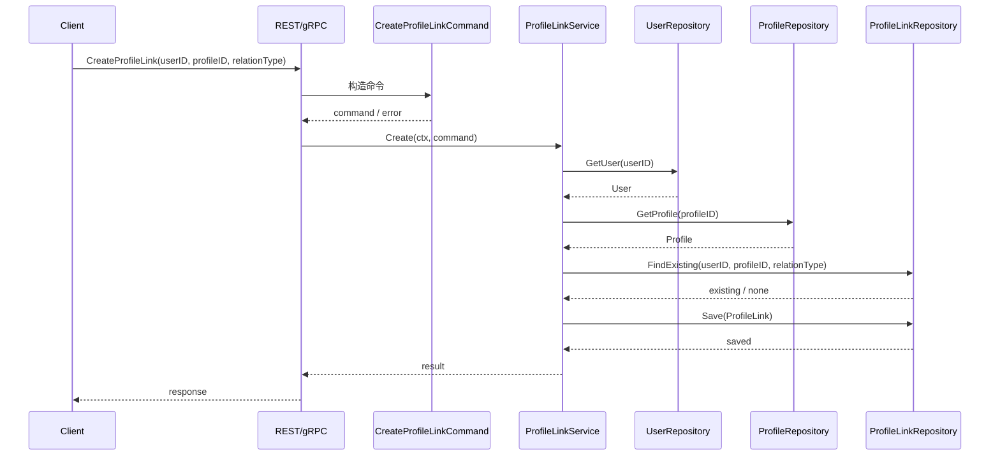

# 01-ProfileLink 链路：User 与 Profile 关系协作

## 1. 本文定位

本文是 `04-身份Identity/` 文档组中关于 **ProfileLink 关系链路** 的文档。

上一篇《00-Identity模型总览》已经建立了 Identity 的核心主线：

```text
User
  -> ProfileLink
  -> Profile
```

本文聚焦其中的关键关系对象：

```text
ProfileLink
```

也就是回答：

```text
User 与 Profile 为什么需要关系模型？
ProfileLink 到底表达什么？
为什么不直接在 Profile 上放 user_id？
ProfileLink 如何支持多用户、多档案、多关系？
ProfileLink 与 AuthN 认证身份 / 登录凭据 / Principal 有什么关系？
ProfileLink 与 AuthZ Permission 有什么边界？
```

本文不深入展开 AuthN 登录、认证入口绑定、Token 签发。

这些内容放在：

```text
02-Identity与AuthN-认证身份-Principal-User边界.md
```

本文也不深入展开 AuthZ Check、RoleBinding、Permission。

这些内容放在：

```text
03-Identity与AuthZ-Subject-Resource-Permission边界.md
```

---

## 2. 30 秒结论

ProfileLink 是 User 与 Profile 之间的关系模型。

它回答的是：

```text
哪个 User，以什么关系，关联到了哪个 Profile？
```

核心模型是：

```text
User
  -> ProfileLink
  -> Profile
```

ProfileLink 不是简单外键。

它是一个可以承载关系语义的对象：

```text
UserID
ProfileID
RelationType
Status
CreatedAt
UpdatedAt
```

必要时还可以扩展：

```text
CreatedBy
RevokedBy
Reason
EffectiveAt
ExpiredAt
```

一句话：

> ProfileLink 的价值是把“User 与 Profile 的关系”从一个简单外键提升为可建模、可查询、可审计、可演进的身份关系对象。

---

## 3. 为什么需要 ProfileLink

最简单的设计是：

```text
profiles.user_id = users.id
```

这适合非常简单的一对一关系。

例如：

```text
一个 User 只有一个 Profile
一个 Profile 只属于一个 User
关系类型永远只有 owner
关系没有状态
关系不需要审计
```

但 IAM 中的 Identity 不应该被这种简单模型锁死。

现实业务经常需要表达：

```text
一个 User 关联多个 Profile
一个 Profile 被多个 User 关联
不同 User 对同一个 Profile 有不同关系
关系本身有状态
关系本身需要审计
关系可能有生效时间和失效时间
关系可能由管理员、系统或邀请流程创建
```

这时，单个 `user_id` 字段就不够了。

因此需要：

```text
ProfileLink
```

它让关系本身成为领域对象。

---

## 4. ProfileLink 核心模型

### 4.1 ProfileLink 是什么

ProfileLink 表示 User 与 Profile 之间的一条关系。

它回答：

```text
这个 User 和这个 Profile 是什么关系？
```

例如：

```text
user:1001 是 profile:2001 的 owner
user:1002 是 profile:2001 的 guardian
user:3001 是 profile:2001 的 operator
```

ProfileLink 的语义不是：

```text
这个 User 拥有什么权限？
```

而是：

```text
这个 User 与这个 Profile 存在什么身份关系？
```

---

### 4.2 ProfileLink 的核心字段

ProfileLink 通常包含：

```text
ID
UserID
ProfileID
RelationType
Status
CreatedAt
UpdatedAt
```

其中：

| 字段 | 含义 |
| --- | --- |
| ID | 关系记录标识 |
| UserID | 关联的 User |
| ProfileID | 关联的 Profile |
| RelationType | 关系类型 |
| Status | 关系状态 |
| CreatedAt | 创建时间 |
| UpdatedAt | 更新时间 |

根据业务需要，可以继续扩展：

```text
CreatedBy
UpdatedBy
RevokedBy
Reason
EffectiveAt
ExpiredAt
```

这些扩展字段用于：

```text
审计
邀请流程
关系撤销
限时授权
历史追踪
```

具体字段以代码事实源为准。

---

### 4.3 RelationType：关系类型

RelationType 表示 User 与 Profile 的业务关系。

常见关系可能包括：

```text
owner
guardian
member
operator
viewer
```

具体枚举以代码事实源为准。

RelationType 的价值是：

```text
同一个 User 与 Profile 之间不只是“有关联”
而是“以什么关系关联”
```

例如：

```text
家长 User 与儿童 Profile 是 guardian 关系。
医生 User 与患者 Profile 可能是 operator / doctor 关系。
运营 User 与 Profile 可能是 operator 关系。
```

不要把所有关系都折叠成一个模糊的：

```text
linked
```

否则后续业务规则很难表达。

---

### 4.4 Status：关系状态

ProfileLink 可以有状态。

例如：

```text
active
revoked
expired
deleted
```

具体枚举以代码事实源为准。

状态的价值是：

```text
关系可以被禁用或撤销
关系可以保留历史审计
关系可以支持邀请待确认
关系可以支持临时生效
```

如果每次关系失效都物理删除，会丢失：

```text
谁创建了关系
谁撤销了关系
什么时候撤销
为什么撤销
历史上是否存在过关系
```

因此 ProfileLink 更适合作为带状态的关系对象。

---

## 5. ProfileLink 链路总览

### 5.1 关系创建链路

创建 ProfileLink 的核心链路可以抽象为：

```text
REST / gRPC / Application Caller
  -> CreateProfileLinkCommand
  -> ProfileLinkService
  -> Load User
  -> Load Profile
  -> Validate RelationType
  -> Check existing link
  -> Create ProfileLink
  -> Persist
```

流程图：



---

### 5.2 关系查询链路

ProfileLink 查询通常有两种方向。

第一种，从 User 查 Profile：

```text
给定 UserID，查询这个 User 关联了哪些 Profile。
```

例如：

```text
user:1001 关联了哪些儿童档案？
```

第二种，从 Profile 查 User：

```text
给定 ProfileID，查询哪些 User 关联了这个 Profile。
```

例如：

```text
profile:2001 关联了哪些 guardian / operator？
```

这两个方向都应该由 ProfileLink 承载。

不要通过 User 表或 Profile 表反向拼凑。

---

### 5.3 关系撤销链路

撤销 ProfileLink 的核心链路可以抽象为：

```text
REST / gRPC / Application Caller
  -> RevokeProfileLinkCommand
  -> ProfileLinkService
  -> Load ProfileLink
  -> Validate current status
  -> Revoke / Disable / Delete
  -> Persist
```

撤销时需要关注：

```text
谁撤销的
为什么撤销
什么时候撤销
是否保留历史记录
是否影响 AuthZ 权限
```

最后一点非常重要。

ProfileLink 撤销不应该默认直接删除 AuthZ Permission。

如果某些权限依赖 ProfileLink，需要通过明确的业务流程触发 AuthZ 写入。

---

## 6. 为什么 ProfileLink 不等于 AuthZ Permission

### 6.1 两者回答的问题不同

ProfileLink 回答：

```text
User 与 Profile 是什么关系？
```

Permission 回答：

```text
Subject 能否访问某个 Resource，执行某个 Action，作用于某个 Scope？
```

例如：

```text
ProfileLink:
  user:1001 是 profile:2001 的 guardian

Permission:
  user:1001 能否读取 profile:2001 相关测评报告？
```

这两个问题不同。

---

### 6.2 ProfileLink 可以作为授权上下文

ProfileLink 虽然不是 Permission，但可以成为授权判断的上下文。

例如业务服务在执行授权前，可能先查询：

```text
user:1001 是否与 profile:2001 有 guardian 关系？
```

然后再发起 AuthZ Check：

```text
Subject: user:1001
Resource: qs:evaluation:report:*
Action: read
Scope: origin:2001
```

这时 ProfileLink 提供的是：

```text
关系事实
```

AuthZ 提供的是：

```text
访问判定
```

---

### 6.3 为什么不能用 ProfileLink 替代 Permission

如果直接把 ProfileLink 当成权限，会出现问题：

```text
无法表达动作差异：read / update / delete / export
无法表达资源差异：profile / report / questionnaire / assessment
无法表达角色聚合：guardian / operator 是否自动有全部权限不清楚
无法表达租户边界
无法统一走 AuthZ Check / PolicyVersion / Outbox / RuntimeReload
```

因此，ProfileLink 只能说明关系。

资源访问仍应通过 AuthZ。

---

## 7. ProfileLink 与 AuthN 的边界

AuthN 负责认证身份识别、登录凭据校验和 Principal 构造。

ProfileLink 不参与认证凭据校验。

例如，登录链路可以抽象为：

```text
AuthN 认证入口 / ProviderIdentity
  -> verify credential
  -> Principal(UserID)
```

ProfileLink 不应该参与：

```text
密码校验
openid 校验
OAuth subject 校验
JWT 签发
refresh token 轮换
```

但是登录成功后，业务可能基于 `Principal.UserID` 查询 ProfileLink：

```text
Principal.UserID
  -> ListProfileLinks(userID)
  -> 得到当前用户关联的 Profile 列表
```

这属于 Identity 查询，不属于 AuthN 认证。

换句话说：

```text
AuthN 负责把认证入口归一成 Principal(UserID)。
Identity 负责根据 UserID 查询 User / Profile / ProfileLink。
```

## 8. ProfileLink 与 AuthZ 的边界

AuthZ 使用 Subject 做资源权限判定。

Identity.User 可以映射为：

```text
Subject = user:<userID>
```

Profile 可以作为资源或 scope 上下文出现。

例如：

```text
Resource: iam:identity:profile:*
Action: read
Scope: origin:<profileID>
```

ProfileLink 与 AuthZ 的协作方式可以是：

```text
Identity 提供 User 与 Profile 的关系事实。
AuthZ 判断这个 Subject 是否有权访问某个 Resource / Action / Scope。
```

不要让 AuthZ 直接持有完整 ProfileLink 聚合。

更好的方式是：

```text
业务服务或 application service 根据 ProfileLink 生成 scope / context。
AuthZ 只处理标准 Subject / Resource / Action / Scope。
```

---

## 9. ProfileLink 的一致性边界

### 9.1 Identity 内部一致性

ProfileLink 创建时至少要保证：

```text
User 存在
Profile 存在
RelationType 合法
同一关系不重复
状态合法
```

这些属于 Identity 内部一致性。

---

### 9.2 与 AuthZ 的一致性

如果某些 ProfileLink 变化会影响权限，需要明确触发 AuthZ 写入。

例如：

```text
创建 guardian 关系后，需要授予某些 profile 相关权限
撤销 guardian 关系后，需要撤销某些 profile 相关权限
```

这不应该隐式发生。

应该通过明确流程：

```text
ProfileLink changed
  -> Application policy / domain event
  -> AuthZ command
  -> PolicyChange
  -> PolicyChangeCommitter
```

不要在 ProfileLink repository 里直接修改 AuthZ facts。

---

### 9.3 与业务数据的一致性

Profile 可能代表业务档案。

这些业务档案可能还被 QS、评估、报告等模块引用。

ProfileLink 只表达身份关系。

它不应该直接维护所有业务数据一致性。

如果业务模块需要响应 ProfileLink 变化，应通过：

```text
领域事件
应用服务编排
显式 API 调用
```

而不是数据库级联魔法。

---

## 10. ProfileLink 的建模示例

### 10.1 家长与儿童档案

```text
User: user:1001
Profile: profile:2001
RelationType: guardian
Status: active
```

含义：

```text
user:1001 是 profile:2001 的监护人。
```

这表示身份关系。

是否可以读取测评报告，需要进一步通过 AuthZ 判断。

---

### 10.2 运营人员与业务档案

```text
User: user:3001
Profile: profile:2001
RelationType: operator
Status: active
```

含义：

```text
user:3001 是 profile:2001 的运营处理人。
```

这可以作为业务工作台展示和任务分配依据。

是否可以修改 Profile，仍然应通过 AuthZ Resource / Action / Scope 控制。

---

### 10.3 一个 Profile 多个关联 User

```text
profile:2001
  <- user:1001 guardian
  <- user:1002 guardian
  <- user:3001 operator
```

这种场景下，如果只在 Profile 上放一个 `user_id` 就无法表达。

ProfileLink 可以自然支持多关系。

---

### 10.4 一个 User 多个 Profile

```text
user:1001
  -> profile:2001 guardian
  -> profile:2002 guardian
  -> profile:2003 owner
```

这种场景适合：

```text
家长管理多个儿童档案
用户拥有多个业务身份资料
运营人员负责多个 Profile
```

---

## 11. Application Service 设计建议

ProfileLink 的应用服务应该围绕用例组织。

常见能力包括：

```text
CreateProfileLink
RevokeProfileLink
ListProfilesByUser
ListUsersByProfile
GetProfileLink
ChangeProfileLinkStatus
```

Command / Query 可以包括：

```text
CreateProfileLinkCommand
RevokeProfileLinkCommand
ListProfilesByUserQuery
ListUsersByProfileQuery
```

这些 command/query 应在 application boundary 做基本校验：

```text
UserID 非空
ProfileID 非空
RelationType 合法
Status 合法
Actor 合法
Reason 规范化
```

应用服务负责加载上下文：

```text
User 是否存在
Profile 是否存在
是否已有重复关系
当前状态是否允许变更
```

Domain 层负责关系对象不变量。

Infra 层负责持久化。

---

## 12. Repository 设计建议

ProfileLinkRepository 至少应支持：

```text
Create
GetByID
FindByUserAndProfile
ListByUser
ListByProfile
UpdateStatus
Delete / SoftDelete
```

建议有唯一性保护，例如：

```text
UserID + ProfileID + RelationType
```

是否把 Status 纳入唯一约束，取决于是否允许历史多条记录。

两种策略：

```text
策略一：同一关系只保留一条记录，状态流转
策略二：历史关系保留多条记录，active 状态唯一
```

如果需要审计，更推荐：

```text
状态流转 + 审计日志
```

或者：

```text
active 唯一 + 历史记录保留
```

具体以当前实现和业务要求为准。

---

## 13. REST / gRPC 接入建议

REST 可以提供管理型接口：

```text
POST /identity/profile-links
GET /identity/users/{user_id}/profiles
GET /identity/profiles/{profile_id}/users
DELETE /identity/profile-links/{link_id}
PATCH /identity/profile-links/{link_id}/status
```

gRPC 可以提供服务间接口：

```text
CreateProfileLink
RevokeProfileLink
ListProfilesByUser
ListUsersByProfile
GetProfileLink
```

接口层要注意：

```text
REST / gRPC 使用 DTO / proto 术语
Application 使用 command / query
Domain 使用 ProfileLink 领域对象
```

不要在 handler 中直接写 repository。

---

## 14. 常见误区

### 14.1 ProfileLink 只是中间表

不准确。

它可以用数据库中间表实现。

但在领域上，它是 User 与 Profile 的关系对象。

---

### 14.2 ProfileLink 可以替代 AuthZ Permission

错误。

ProfileLink 是身份关系。

Permission 是资源访问权。

---

### 14.3 Profile 上放 user_id 就永远够用

不一定。

只要存在多用户、多关系、关系状态、关系审计，就应该使用 ProfileLink。

---

### 14.4 ProfileLink 创建后必须自动授权

不一定。

是否自动授权是业务策略。

如果需要授权，应该显式调用 AuthZ 写入链路。

---

### 14.5 ProfileLink 撤销后可以直接删 AuthZ facts

错误。

撤销 AuthZ facts 必须通过 AuthZ PolicyChangeCommitter。

---

### 14.6 ProfileLink 应该参与登录认证

错误。

登录认证属于 AuthN。

ProfileLink 是登录成功后的身份关系查询或业务上下文。

---

## 15. 代码事实源

本文涉及的主要代码事实源：

```text
internal/apiserver/domain/identity
internal/apiserver/application/identity
internal/apiserver/infra/mysql/identity
internal/apiserver/transport/rest/identity
internal/apiserver/transport/grpc/service/identity
```

如果 Identity 已拆分子包，可重点关注：

```text
internal/apiserver/domain/identity/profilelink
internal/apiserver/application/identity/profilelink
internal/apiserver/infra/mysql/identity/profilelink
```

相关协作事实源：

```text
internal/apiserver/domain/identity/user
internal/apiserver/domain/identity/profile
internal/apiserver/domain/authz/subject
internal/apiserver/application/authz/policy
```

重点关注：

| 主题 | 事实源 |
| --- | --- |
| ProfileLink 领域模型 | `domain/identity/profilelink` 或 `domain/identity` |
| RelationType / Status | `domain/identity/profilelink` 或 `domain/identity` |
| ProfileLink 应用服务 | `application/identity/profilelink` 或 `application/identity` |
| ProfileLink repository | `infra/mysql/identity/profilelink` 或 `infra/mysql/identity` |
| REST ProfileLink 接口 | `transport/rest/identity` |
| gRPC ProfileLink 接口 | `transport/grpc/service/identity` |
| User 事实源 | `domain/identity/user` 或 `domain/identity` |
| Profile 事实源 | `domain/identity/profile` 或 `domain/identity` |
| AuthZ Subject | `domain/authz/subject` |
| AuthZ 写入链路 | `application/authz/policy` |

如果本文与代码不一致，以代码事实源为准，并同步修正文档。

---

## 16. 本文总结

ProfileLink 是 Identity 模块中连接 User 与 Profile 的关系模型。

核心主线是：

```text
User
  -> ProfileLink
  -> Profile
```

ProfileLink 的价值是：

```text
表达多用户、多档案、多关系
承载 RelationType
承载 Status
支持查询和审计
为 AuthZ 提供关系上下文，但不替代 Permission
```

它不是简单中间表，也不是 AuthZ 权限事实。

如果只记住一句话：

> ProfileLink 负责表达 User 与 Profile 的身份关系；它可以为授权提供上下文，但不能替代 AuthZ Permission，任何资源访问权仍应通过 AuthZ 的 Subject / Resource / Action / Scope 判定。
