# User 与 Profile 模型

## 本文回答

本文回答：IAM Identity 模块中 `User` 与 `Profile` 分别表达什么；为什么 User 是登录主体和身份锚点，而 Profile 是业务档案；为什么两者不能简单合并；User、Profile、ProfileLink、Account、Session、AuthZ Role 之间的边界是什么；UserModule 如何把 User/Profile/ProfileLink 应用能力装配成 REST/gRPC 对外接口。

读完本文，你应该能回答：

- User 是什么，为什么它是 IAM 内部身份锚点；
- User 和 AuthN Account 有什么区别；
- User 状态 active / inactive / blocked 分别影响什么；
- 为什么 User blocked 会撤销 session；
- Profile 是什么，为什么它不是登录主体；
- Profile 与 User 为什么不是一对一关系；
- Profile 的基本信息、证件信息、身高体重分别如何建模；
- User/Profile 的创建、查询、编辑分别由哪些 application service 承担；
- 当前用户视角的 `/identity/me` 和 `/identity/me/profiles` 分别从哪里来；
- 为什么 `MyProfiles` 会组合 Profile 与 ProfileLink；
- active self ProfileLink 维护什么不变量；
- 本篇与下一篇 ProfileLink 链路文档的边界是什么。

---

## 30 秒结论

IAM 的 Identity 模型不是一个简单的“用户表”。

它至少分成三层：

```text
Account
  -> 登录账号 / 外部身份账号
User
  -> IAM 内部登录主体 / 身份锚点
Profile
  -> 业务档案，例如儿童档案、本人档案
```

其中：

| 模型 | 所属能力 | 语义 |
| --- | --- | --- |
| Account | AuthN | 登录入口与凭据归属，例如手机号、微信、企微、密码账号 |
| User | Identity | IAM 内部用户身份锚点，承接登录主体、状态和角色关系 |
| Profile | Identity | 业务档案，承接姓名、性别、生日、证件、身高体重等业务资料 |
| ProfileLink | Identity | User 与 Profile 的关系边，表达 self、parent、grandparent、other 等关系 |

User 和 Profile 不能合并，原因是：

```text
一个 User 可以关联多个 Profile
一个 Profile 也可能被多个 User 关联
User 的状态影响认证与 session
Profile 的资料影响业务档案
二者之间的关系需要可撤销、可查询、可建模
```

所以正确模型是：

```text
User -- ProfileLink -- Profile
```

而不是：

```text
User has one Profile
```

当前 UserModule 负责装配：

```text
UserCreator / UserEditor / UserStatusChanger / UserDirectory
ProfileDirectory / MyProfiles
ProfileLinkCommands / ProfileLinkDirectory / MyProfileLinks
```

REST 侧则通过 `/api/v2/identity` 暴露当前用户、当前用户档案和档案关系接口。

核心源码入口：

- [../../internal/apiserver/domain/identity/user/user.go](../../internal/apiserver/domain/identity/user/user.go)
- [../../internal/apiserver/domain/identity/user/types.go](../../internal/apiserver/domain/identity/user/types.go)
- [../../internal/apiserver/domain/identity/profile/profile.go](../../internal/apiserver/domain/identity/profile/profile.go)
- [../../internal/apiserver/domain/identity/profile/creation.go](../../internal/apiserver/domain/identity/profile/creation.go)
- [../../internal/apiserver/domain/identity/profilelink/profile_link.go](../../internal/apiserver/domain/identity/profilelink/profile_link.go)
- [../../internal/apiserver/domain/identity/profilelink/linker.go](../../internal/apiserver/domain/identity/profilelink/linker.go)
- [../../internal/apiserver/application/identity/user/services.go](../../internal/apiserver/application/identity/user/services.go)
- [../../internal/apiserver/application/identity/profile/services.go](../../internal/apiserver/application/identity/profile/services.go)
- [../../internal/apiserver/container/assembler/user.go](../../internal/apiserver/container/assembler/user.go)
- [../../internal/apiserver/transport/rest/identity/router.go](../../internal/apiserver/transport/rest/identity/router.go)

---

## 主图：Identity 模型关系

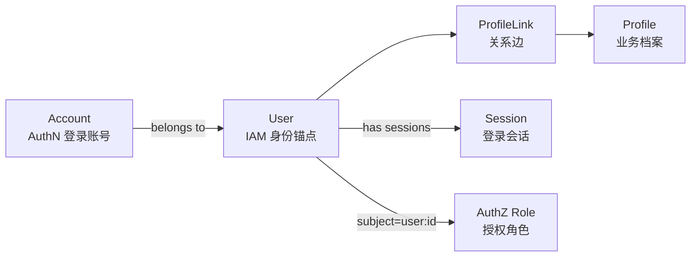

更贴近领域对象的关系：

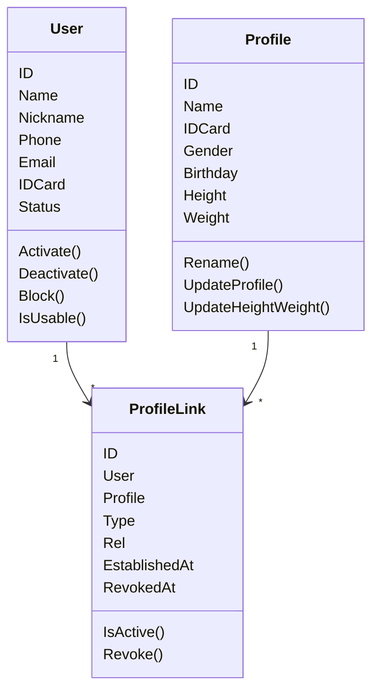

---

## 重点速查

| 问题 | 当前答案 | 代码证据 |
| --- | --- | --- |
| User 领域对象在哪里 | `domain/identity/user/user.go`。 | [../../internal/apiserver/domain/identity/user/user.go](../../internal/apiserver/domain/identity/user/user.go) |
| User 状态有哪些 | `active`、`inactive`、`blocked`。 | [../../internal/apiserver/domain/identity/user/types.go](../../internal/apiserver/domain/identity/user/types.go) |
| User 创建后默认状态 | `UserActive`。 | [../../internal/apiserver/domain/identity/user/user.go](../../internal/apiserver/domain/identity/user/user.go) |
| User 创建用例是否维护 self profile | 不维护；User 可以没有 self Profile。 | [../../internal/apiserver/application/identity/user/service_create.go](../../internal/apiserver/application/identity/user/service_create.go) |
| User blocked 是否撤销 session | `StatusChanger.Block` 成功后调用 `sessionManager.RevokeByUser`。 | [../../internal/apiserver/application/identity/user/service_status.go](../../internal/apiserver/application/identity/user/service_status.go) |
| Profile 领域对象在哪里 | `domain/identity/profile/profile.go`。 | [../../internal/apiserver/domain/identity/profile/profile.go](../../internal/apiserver/domain/identity/profile/profile.go) |
| Profile 创建输入如何统一 | `CreationSpec` + `NewFromCreationSpec`。 | [../../internal/apiserver/domain/identity/profile/creation.go](../../internal/apiserver/domain/identity/profile/creation.go) |
| Profile 编辑领域服务在哪里 | `domain/identity/profile/editor.go`。 | [../../internal/apiserver/domain/identity/profile/editor.go](../../internal/apiserver/domain/identity/profile/editor.go) |
| Profile 查询仓储支持什么 | `FindByID`、`FindByIDCard`、`FindSimilar` 等。 | [../../internal/apiserver/domain/identity/profile/repository.go](../../internal/apiserver/domain/identity/profile/repository.go) |
| UserModule 装配了哪些 Identity 能力 | User、Profile、ProfileLink、MyProfiles、MyProfileLinks 等。 | [../../internal/apiserver/container/assembler/user.go](../../internal/apiserver/container/assembler/user.go) |
| REST Identity 路由在哪里 | `/api/v2/identity`，需要 AuthMiddleware。 | [../../internal/apiserver/transport/rest/identity/router.go](../../internal/apiserver/transport/rest/identity/router.go) |
| gRPC Identity 聚合服务在哪里 | 注册 IdentityRead、ProfileLinkQuery、ProfileLinkCommand、IdentityLifecycle。 | [../../internal/apiserver/transport/grpc/service/identity/service.go](../../internal/apiserver/transport/grpc/service/identity/service.go) |

---

## 1. Identity 模块解决什么问题

Identity 模块解决的是：

> 登录主体是谁？业务档案是谁？用户和档案是什么关系？

它不是 AuthN，也不是 AuthZ。

| 模块 | 关注点 |
| --- | --- |
| AuthN | 如何登录、如何签发 token、如何管理 session |
| AuthZ | 登录主体有没有访问某个资源的权限 |
| Identity | 登录主体、业务档案、主体与档案关系 |
| IDP | 第三方身份源配置、secret、外部 API |

Identity 模块中的两个核心实体是：

```text
User
Profile
```

二者之间通过：

```text
ProfileLink
```

建立关系。

本篇只讲 `User` 与 `Profile` 的模型边界。
ProfileLink 的链路、关系创建、关系撤销、当前用户视角 guard，会在下一篇单独展开。

---

## 2. User：IAM 内部身份锚点

`User` 是 IAM 内部用户身份锚点。

字段包括：

| 字段 | 含义 |
| --- | --- |
| `ID` | 用户 ID |
| `Name` | 用户名称 |
| `Nickname` | 昵称 |
| `Phone` | 手机号 |
| `Email` | 邮箱 |
| `IDCard` | 身份证 |
| `Status` | active / inactive / blocked |

User 的创建函数：

```text
NewUser(name, phone, opts...)
```

要求：

```text
name cannot be empty
```

新用户默认状态：

```text
UserActive
```

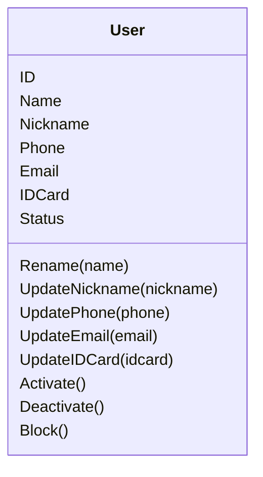

### User 的核心语义

User 不是“某一次登录账号”，而是 IAM 系统里的身份锚点。

一个 User 可以通过多个 Account 登录，例如：

```text
手机号账号
密码账号
微信小程序账号
企业微信账号
```

但这些登录账号最终都应该指向同一个或某个 User。

### User 和 Account 的边界

| 模型 | 所属模块 | 语义 |
| --- | --- | --- |
| Account | AuthN | 登录账号和凭据归属 |
| User | Identity | IAM 内部用户身份锚点 |

AuthN onboarding 中的 `UserProvisioner` 会根据已有 account、手机号或微信身份决定复用 User、修复 User 或创建 User。创建或复用 User 后不会自动创建 self ProfileLink。

核心源码：

- [../../internal/apiserver/domain/identity/user/user.go](../../internal/apiserver/domain/identity/user/user.go)
- [../../internal/apiserver/application/authn/onboarding/user_provisioner.go](../../internal/apiserver/application/authn/onboarding/user_provisioner.go)

---

## 3. User 状态

User 状态定义：

```text
active
inactive
blocked
```

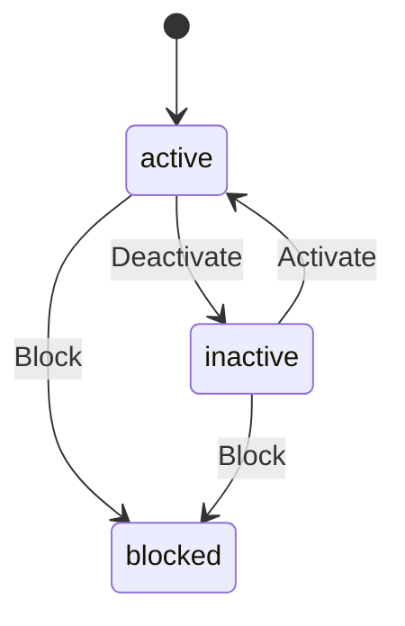

| 状态 | 语义 |
| --- | --- |
| `active` | 可用用户 |
| `inactive` | 非活跃用户 |
| `blocked` | 被封禁用户 |

User 实体提供：

```text
Activate()
Deactivate()
Block()
IsUsable()
IsBlocked()
IsInactive()
```

### 状态变更对 AuthN 的影响

Identity 模块的状态变更会影响 AuthN。

当前 `StatusChanger.Block` 在用户封禁成功后会调用：

```text
sessionManager.RevokeByUser(ctx, userID, "user_blocked", userID)
```

也就是说，封禁用户会主动撤销该用户的 active sessions。

`Deactivate` 当前只修改 User 状态，不主动 revoke sessions。
但是 AuthN 的在线 Verify / Refresh 会通过 subject access 重新检查 User 状态，inactive user 也会导致在线认证失败。

核心源码：

- [../../internal/apiserver/domain/identity/user/types.go](../../internal/apiserver/domain/identity/user/types.go)
- [../../internal/apiserver/domain/identity/user/lifecycler.go](../../internal/apiserver/domain/identity/user/lifecycler.go)
- [../../internal/apiserver/application/identity/user/service_status.go](../../internal/apiserver/application/identity/user/service_status.go)

---

## 4. User 领域能力

User 领域层定义了几个能力接口：

| 能力 | 作用 |
| --- | --- |
| `Validator` | 创建、改名、联系方式更新、手机号唯一性 |
| `ProfileEditor` | 修改 User 基础资料 |
| `Lifecycler` | 激活、停用、封禁 |
| `Repository` | 持久化端口 |

### Validator

User validator 负责：

```text
ValidateCreate
ValidateRename
ValidateUpdateContact
CheckPhoneUnique
```

其中手机号唯一性通过 `repo.FindByPhone` 检查。
如果手机号已存在，返回用户已存在错误。

### ProfileEditor

User 的 `ProfileEditor` 名字容易和 Profile 模块混淆。
它编辑的是 User 自身资料，不是业务档案 Profile。

能力包括：

```text
Rename
Renickname
UpdateContact
UpdateIDCard
```

它的工作方式是：

```text
load User
  -> apply domain mutation
  -> return modified User
```

持久化由 application 层完成。

### Lifecycler

`Lifecycler` 负责：

```text
Activate
Deactivate
Block
```

它同样只加载 User、修改状态并返回实体，持久化由 application 层负责。

核心源码：

- [../../internal/apiserver/domain/identity/user/interfaces.go](../../internal/apiserver/domain/identity/user/interfaces.go)
- [../../internal/apiserver/domain/identity/user/validator.go](../../internal/apiserver/domain/identity/user/validator.go)
- [../../internal/apiserver/domain/identity/user/profile_editor.go](../../internal/apiserver/domain/identity/user/profile_editor.go)
- [../../internal/apiserver/domain/identity/user/lifecycler.go](../../internal/apiserver/domain/identity/user/lifecycler.go)
- [../../internal/apiserver/domain/identity/user/repository.go](../../internal/apiserver/domain/identity/user/repository.go)

---

## 5. User Application Services

User application 层把领域能力组织成用例：

| Application Port | 用途 |
| --- | --- |
| `Creator` | 创建 User |
| `Editor` | 编辑 User 资料 |
| `StatusChanger` | 改变 User 状态 |
| `Directory` | 查询 User |

DTO 包括：

```text
CreateUserDTO
UpdateContactDTO
PatchUserProfileDTO
UserResult
```

### 5.1 Create User

创建 User 的流程：

```text
CreateUserDTO
  -> parse phone/email
  -> ValidateCreate
  -> user.NewUser
  -> tx.Users.Create
  -> UserResult
```

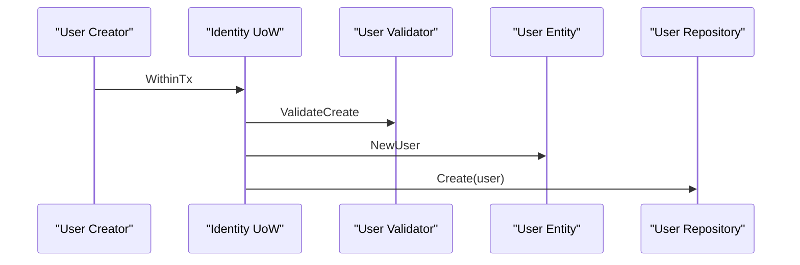

关键点是：User 创建后只产生登录主体，不自动创建 self profile/link。
用户可以先没有本人档案，后续由 C 端显式建档能力创建 self ProfileLink。

### 5.2 Edit User

User 编辑流程一般是：

```text
parse user id / value objects
  -> domain ProfileEditor
  -> tx.Users.Update
```

支持：

```text
Rename
Renickname
PatchProfile
UpdateContact
UpdateIDCard
```

### 5.3 Change User Status

User 状态变更流程：

```text
parse user id
  -> domain Lifecycler
  -> tx.Users.Update
  -> if Block: sessionManager.RevokeByUser
```

注意：`Block` 的 session revoke 在 UoW 成功后执行。
这避免用户状态更新失败时误撤销 session。

### 5.4 Query User

User 查询通过 `Directory`：

```text
GetByID
GetByPhone
```

查询也通过 UoW，但本质是只读用例。

核心源码：

- [../../internal/apiserver/application/identity/user/services.go](../../internal/apiserver/application/identity/user/services.go)
- [../../internal/apiserver/application/identity/user/service_create.go](../../internal/apiserver/application/identity/user/service_create.go)
- [../../internal/apiserver/application/identity/user/service_profile.go](../../internal/apiserver/application/identity/user/service_profile.go)
- [../../internal/apiserver/application/identity/user/service_status.go](../../internal/apiserver/application/identity/user/service_status.go)
- [../../internal/apiserver/application/identity/user/service_query.go](../../internal/apiserver/application/identity/user/service_query.go)

---

## 6. Profile：业务档案

`Profile` 是业务档案。

当前字段：

| 字段 | 含义 |
| --- | --- |
| `ID` | 档案 ID |
| `Name` | 档案姓名 |
| `IDCard` | 身份证 |
| `Gender` | 性别 |
| `Birthday` | 生日 |
| `Height` | 身高 |
| `Weight` | 体重 |

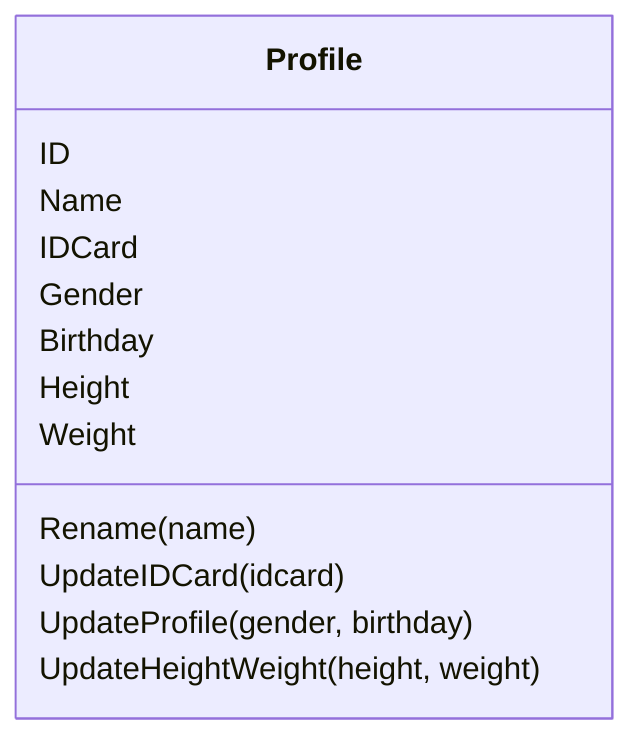

Profile 创建要求：

```text
name cannot be empty
```

### Profile 的核心语义

Profile 不是登录主体。
Profile 更接近业务对象，例如：

```text
儿童档案
本人档案
被测评者档案
业务侧需要被记录和关联的个体资料
```

它可以被多个 User 关联。
例如一个儿童档案可能同时被父母、祖父母关联。

这就是为什么 Profile 不应该直接塞进 User。

核心源码：

- [../../internal/apiserver/domain/identity/profile/profile.go](../../internal/apiserver/domain/identity/profile/profile.go)

---

## 7. Profile 创建模型：CreationSpec

Profile 创建使用：

```text
CreationSpec
NewFromCreationSpec
```

字段：

```text
ID
Name
IDCard
Gender
Birthday
Height
Weight
```

应用层负责把外部 DTO 解析成值对象：

```text
Gender
Birthday
IDCard
Height
Weight
```

然后交给领域层创建 Profile。

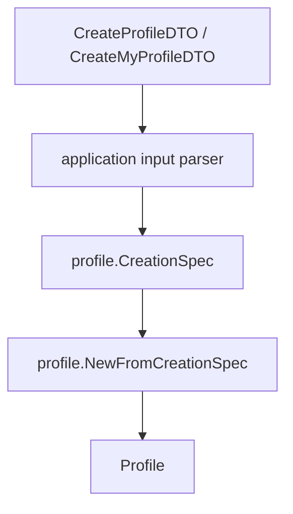

### 为什么用 CreationSpec

因为 Profile 创建字段比较多，而且不同入口都会创建 Profile：

```text
直接创建 Profile
当前用户创建自己的 Profile
当前用户为自己创建 self Profile
```

`CreationSpec` 把创建字段集中起来，避免每个入口手动拼 option。

核心源码：

- [../../internal/apiserver/domain/identity/profile/creation.go](../../internal/apiserver/domain/identity/profile/creation.go)
- [../../internal/apiserver/application/identity/profile/profile_creation.go](../../internal/apiserver/application/identity/profile/profile_creation.go)

---

## 8. Profile 领域能力

Profile 领域层定义：

| 能力 | 作用 |
| --- | --- |
| `Validator` | 校验创建、改名、资料更新 |
| `ProfileEditor` | 修改 Profile 资料 |
| `Repository` | 持久化端口 |

### Validator

当前 validator 主要检查：

```text
name cannot be empty
```

`ValidateUpdateProfile` 当前没有额外规则。
这意味着现阶段性别、生日等值对象的合法性主要在 application input parse 阶段完成。

### ProfileEditor

Profile editor 负责：

```text
Rename
UpdateIDCard
UpdateProfile
UpdateHeightWeight
```

它的模式与 User editor 一致：

```text
load Profile
  -> domain mutation
  -> return modified Profile
```

持久化由 application 层完成。

核心源码：

- [../../internal/apiserver/domain/identity/profile/interfaces.go](../../internal/apiserver/domain/identity/profile/interfaces.go)
- [../../internal/apiserver/domain/identity/profile/validator.go](../../internal/apiserver/domain/identity/profile/validator.go)
- [../../internal/apiserver/domain/identity/profile/editor.go](../../internal/apiserver/domain/identity/profile/editor.go)
- [../../internal/apiserver/domain/identity/profile/repository.go](../../internal/apiserver/domain/identity/profile/repository.go)

---

## 9. Profile Application Services

Profile application 层定义：

| Application Port | 用途 |
| --- | --- |
| `Creator` | 创建 Profile |
| `Editor` | 编辑 Profile |
| `Directory` | 查询 Profile |
| `MyProfiles` | 当前用户视角的 Profile 访问 |

### 9.1 Creator

直接创建 Profile：

```text
CreateProfileDTO
  -> buildProfileEntity
  -> tx.Profiles.Create
  -> ProfileResult
```

### 9.2 Editor

编辑 Profile：

```text
Rename
UpdateIDCard
UpdateProfile
UpdateHeightWeight
```

每个写操作都通过 UoW：

```text
parse profile id / value objects
  -> domain ProfileEditor
  -> tx.Profiles.Update
```

### 9.3 Directory

查询 Profile：

```text
GetByID
GetByIDCard
FindSimilar
```

其中 `FindSimilar` 使用：

```text
name + gender + birthday
```

用于发现相似档案。

### 9.4 MyProfiles

`MyProfiles` 是当前用户视角的 Profile 用例。
它不是普通 profile CRUD，而是组合了：

```text
Profile
ProfileLink
current user guard
```

能力包括：

```text
Create
List
Get
Patch
```

例如当前用户创建档案时：

```text
create Profile
  -> create ProfileLink(current user, profile, relation)
```

当前用户查询或更新某个 Profile 时，会先检查该 User 是否有 active ProfileLink。

这个部分会在下一篇 ProfileLink 链路文档中详细展开。

核心源码：

- [../../internal/apiserver/application/identity/profile/services.go](../../internal/apiserver/application/identity/profile/services.go)
- [../../internal/apiserver/application/identity/profile/service_create.go](../../internal/apiserver/application/identity/profile/service_create.go)
- [../../internal/apiserver/application/identity/profile/service_profile.go](../../internal/apiserver/application/identity/profile/service_profile.go)
- [../../internal/apiserver/application/identity/profile/service_query.go](../../internal/apiserver/application/identity/profile/service_query.go)
- [../../internal/apiserver/application/identity/profile/service_my_profiles.go](../../internal/apiserver/application/identity/profile/service_my_profiles.go)
- [../../internal/apiserver/application/identity/profile/service_access.go](../../internal/apiserver/application/identity/profile/service_access.go)

---

## 10. ProfileLink：User 与 Profile 的关系边

ProfileLink 是 User 与 Profile 的关系边。

它表达：

```text
这个 User 和这个 Profile 是什么关系？
这个关系是否仍然有效？
这个关系什么时候建立？
是否被撤销？
```

当前 ProfileLink 包含：

| 字段 | 含义 |
| --- | --- |
| `User` | User ID |
| `Profile` | Profile ID |
| `Type` | self / relation |
| `Rel` | self / parent / grandparent / other |
| `EstablishedAt` | 建立时间 |
| `RevokedAt` | 撤销时间 |

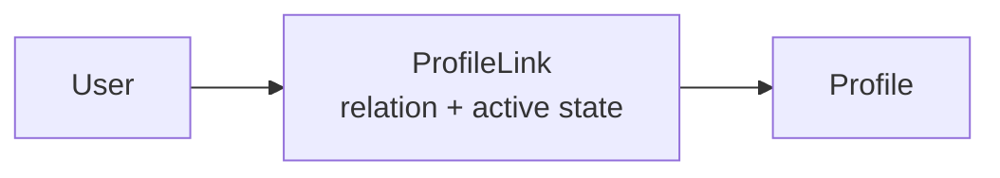

### 本篇只讲边界，不展开链路

本篇只需要明确：

```text
User 与 Profile 不直接绑定
二者通过 ProfileLink 建立关系
```

ProfileLink 的建立、撤销、self link、不变量、当前用户 guard，会在下一篇：

```text
02-ProfileLink链路--用户与儿童档案关系协作.md
```

中单独展开。

核心源码：

- [../../internal/apiserver/domain/identity/profilelink/profile_link.go](../../internal/apiserver/domain/identity/profilelink/profile_link.go)

---

## 11. Active Self Guard：本人档案不变量

系统允许 User 没有 self Profile，但如果存在 self ProfileLink，则一个 User 最多只能有一个 active self profile link。

当前创建规则：

```text
User 创建:
  -> 不创建 Profile
  -> 不创建 ProfileLink

C 端主动创建 Profile:
  -> relation == self 时创建 self ProfileLink
  -> relation != self 时创建 relation ProfileLink

如果 User 已有 active self link:
  -> 拒绝重复 self 创建

relation Profile:
  -> 允许多个
```

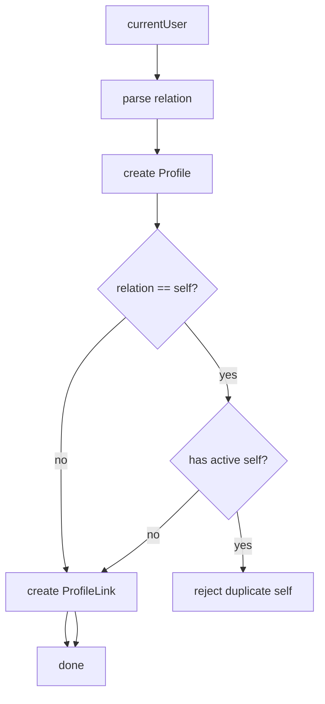

active self guard 在两个层面生效：

| 场景 | 作用 |
| --- | --- |
| `SelfProfileGuard.EnsureCanCreateSelf` | relation 为 self 时检查当前 User 是否已有 active self |
| `ProfileLinker.LinkSelf/LinkRelation` | 创建 User -> Profile 的关系实体，不负责 self 唯一性 |
| `self_key` unique index | DB 层兜底防止并发写入多个 active self |

### 为什么要有 self profile

因为很多业务流程需要“当前登录用户自己的档案”。
没有 self profile/link 是允许状态；需要“当前登录用户自己的档案”的业务流程应先显式创建或查询 self profile。

但 self profile 仍然是 Profile，不是 User 本身。
它只是通过 ProfileLink 与 User 形成 `self` 关系。

核心源码：

- [../../internal/apiserver/domain/identity/profilelink/linker.go](../../internal/apiserver/domain/identity/profilelink/linker.go)
- [../../internal/apiserver/application/identity/user/service_create.go](../../internal/apiserver/application/identity/user/service_create.go)
- [../../internal/apiserver/application/authn/onboarding/user_provisioner.go](../../internal/apiserver/application/authn/onboarding/user_provisioner.go)

---

## 12. Identity Unit of Work

Identity/User/Profile/ProfileLink 的应用服务共享 Identity UoW。

UoW 内部仓储：

```text
Users
Profiles
ProfileLinks
```

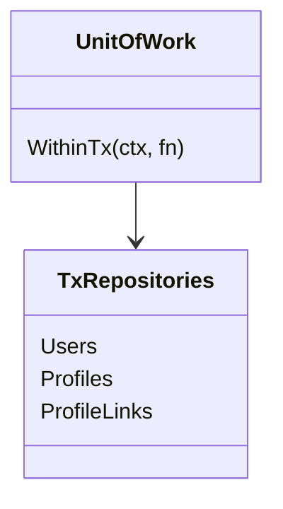

MySQL Identity UoW 会在 GORM transaction 内创建：

```text
user repository
profile repository
profilelink repository
```

这样 Profile 与 ProfileLink 的组合操作可以同事务提交。

例如 `MyProfiles.Create`：

```text
create Profile
create ProfileLink
```

必须同事务成功或同事务失败。

核心源码：

- [../../internal/apiserver/application/identity/uow/uow.go](../../internal/apiserver/application/identity/uow/uow.go)
- [../../internal/apiserver/infra/mysql/uow/identity/uow.go](../../internal/apiserver/infra/mysql/uow/identity/uow.go)
- [../../internal/apiserver/application/identity/profile/service_my_profiles.go](../../internal/apiserver/application/identity/profile/service_my_profiles.go)

---

## 13. UserModule 装配

`UserModule` 是 Identity 相关能力的组合模块。

初始化依赖：

```text
DB
RoleNameReader
SessionManager
```

| 依赖 | 用途 |
| --- | --- |
| `DB` | 创建 Identity UoW |
| `RoleNameReader` | `/identity/me` 返回 roles |
| `SessionManager` | User block 时 revoke user sessions |

UserModule 装配：

```text
UserCreator
UserEditor
UserStatusChanger
UserDirectory
ProfileDirectory
MyProfiles
ProfileLinkCommands
ProfileLinkDirectory
MyProfileLinks
RoleNames
```

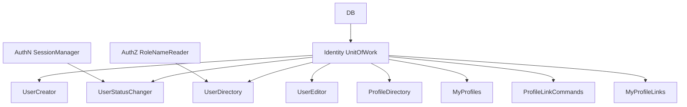

这说明 Identity 模块不是孤立模块。
它依赖：

- AuthZ 提供角色名读取；
- AuthN 提供 session manager。

核心源码：

- [../../internal/apiserver/container/assembler/user.go](../../internal/apiserver/container/assembler/user.go)
- [../../internal/apiserver/container/module_graph.go](../../internal/apiserver/container/module_graph.go)

---

## 14. REST Identity 接口

REST Identity routes 统一挂在：

```text
/api/v2/identity
```

并要求：

```text
AuthMiddleware
```

即必须先经过 AuthN JWT middleware。

### User routes

```text
GET   /api/v2/identity/me
PATCH /api/v2/identity/me
```

`GET /identity/me`：

- 从 JWT context 读取 `user_id`；
- 查询 User；
- 读取角色名；
- 返回 UserResponse。

`PATCH /identity/me`：

- 从 JWT context 读取 `user_id`；
- 更新昵称和联系方式；
- 返回最新 UserResponse。

### Profile routes

```text
GET   /api/v2/identity/me/profiles
POST  /api/v2/identity/profiles
GET   /api/v2/identity/profiles/search
GET   /api/v2/identity/profiles/:id
PATCH /api/v2/identity/profiles/:id
```

其中：

- `POST /profiles` 会创建 Profile 并建立当前用户关系；
- `GET /profiles/:id` 只允许访问当前用户有关联的 Profile；
- `PATCH /profiles/:id` 也会先检查当前用户是否 linked。

### ProfileLink routes

```text
GET  /api/v2/identity/profile-links
POST /api/v2/identity/profile-links
POST /api/v2/identity/profile-links/:id/revoke
```

ProfileLink route 细节放下一篇。

核心源码：

- [../../internal/apiserver/transport/rest/identity/router.go](../../internal/apiserver/transport/rest/identity/router.go)
- [../../internal/apiserver/transport/rest/identity/handler/user.go](../../internal/apiserver/transport/rest/identity/handler/user.go)
- [../../internal/apiserver/transport/rest/identity/handler/profile_command.go](../../internal/apiserver/transport/rest/identity/handler/profile_command.go)
- [../../internal/apiserver/transport/rest/identity/handler/profile_query.go](../../internal/apiserver/transport/rest/identity/handler/profile_query.go)

---

## 15. gRPC Identity 服务

gRPC Identity service 聚合了四个服务：

```text
IdentityRead
ProfileLinkQuery
ProfileLinkCommand
IdentityLifecycle
```

它注入的 application services 包括：

```text
user directory
profile directory
profile link directory
user creator
user editor
user status changer
profile link commands
my profile link access
```

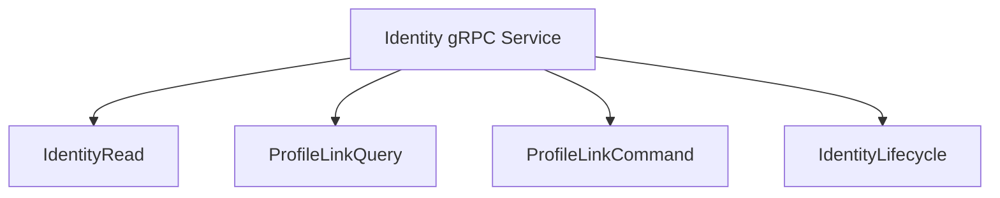

本篇重点只关注 User/Profile 模型。
gRPC 的具体 ProfileLink command/query 会在下一篇展开。

核心源码：

- [../../internal/apiserver/transport/grpc/service/identity/service.go](../../internal/apiserver/transport/grpc/service/identity/service.go)

---

## 16. User/Profile 与 AuthN/AuthZ 的关系

### 16.1 与 AuthN 的关系

AuthN 登录成功后 token claims 中有：

```text
user_id
account_id
tenant_id
session_id
```

其中 `user_id` 指向 Identity 的 User。

User 状态会影响在线 Verify / Refresh：

```text
blocked -> fail
inactive -> fail
active -> continue
```

User block 还会主动调用 session manager 撤销该 User 的 sessions。

### 16.2 与 AuthZ 的关系

AuthZ 的 subject 表达：

```text
user:<user_id>
```

`/identity/me` 会通过 `RoleNameReader` 读取当前用户在当前 tenant 和 platform tenant 下的角色名。

但 User 不是 Role。
User 只是 AuthZ subject，是否有权限仍由 AuthZ 模块判断。

### 16.3 与 IDP 的关系

IDP 管第三方身份源配置。
AuthN onboarding 可能通过微信身份找到或创建 User。
但 IDP 不直接管理 User/Profile 模型。

---

## 17. 模型边界总结

| 概念 | 是什么 | 不是什么 |
| --- | --- | --- |
| User | IAM 内部身份锚点 | 不是登录凭据，不是业务档案 |
| Account | AuthN 登录账号 | 不是业务档案，不承载 Profile 资料 |
| Profile | 业务档案 | 不是登录主体，不直接拥有 session |
| ProfileLink | User/Profile 关系边 | 不是 AuthZ 权限，不是简单外键 |
| Self Profile | User 的本人档案关系 | 不是把 User 和 Profile 合并 |
| MyProfiles | 当前用户视角的 Profile 用例 | 不是无权限校验的 Profile CRUD |
| RoleNameReader | AuthZ 角色读取能力 | 不是 Identity 自己的角色模型 |
| SessionManager | AuthN session 管理能力 | 不是 Identity 生命周期仓储 |

---

## 18. 常见误区

### 误区一：User 就是 Profile

不对。
User 是登录主体，Profile 是业务档案。一个 User 可以关联多个 Profile，一个 Profile 也可以被多个 User 关联。

### 误区二：Profile 属于某个 User

不准确。
Profile 不直接属于 User，关系由 ProfileLink 表达。

### 误区三：User blocked 只是改一个字段

不完整。
当前 User block 成功后还会调用 `sessionManager.RevokeByUser`，影响 AuthN 在线登录态。

### 误区四：`User.ProfileEditor` 编辑的是 Profile

不对。
`domain/identity/user.ProfileEditor` 编辑的是 User 自身资料。
Profile 的编辑器在 `domain/identity/profile.ProfileEditor`。

### 误区五：MyProfiles 是普通 Profile CRUD

不对。
MyProfiles 是当前用户视角的 Profile 访问用例，会通过 ProfileLink 检查访问关系。

### 误区六：Active self guard 把 User 复制成 Profile

不准确。
它不再在缺少 active self link 时自动补档案。`SelfProfileGuard` 只提供显式唯一性保护，调用方必须在用户主动选择“为自己创建档案”时才调用 guard 并创建 self ProfileLink。

### 误区七：Identity 模块负责权限判定

不对。
Identity 模块可读取角色名用于展示，但权限判定仍然是 AuthZ 的职责。

---

## 19. 当前边界与待讨论点

### 19.1 User deactivate 不主动 revoke session

当前 `Deactivate` 只改 User 状态并持久化，不主动撤销 session。
但是 AuthN 在线 Verify / Refresh 会重新检查 User 状态，因此 inactive User 的旧 token 在线校验会失败。

### 19.2 User block 主动 revoke session

当前 `Block` 在 UoW 成功后调用 `sessionManager.RevokeByUser`。
这体现了 Identity 状态变化对 AuthN session 的主动影响。

### 19.3 Profile access 目前依赖 ProfileLink guard

`MyProfiles.Get/Patch` 会检查当前 User 是否存在对应 ProfileLink。
它不是 AuthZ resource/action 判定。后续如果要把 Profile 访问纳入统一 AuthZ，需要设计 ResourceKey、Scope 和 Check 链路。

### 19.4 self Profile 只在用户主动建档时创建

User 创建和 AuthN onboarding 不再自动创建 Profile 或 self ProfileLink。C 端用户主动选择“为自己创建档案”时，`MyProfiles.Create` 在同一事务里创建 Profile，并按 relation 创建 ProfileLink。

---

## 20. 设计模式

| 模式 | 为什么用 | IAM 落地 | 代价和边界 |
| --- | --- | --- | --- |
| Identity Anchor | 登录主体需要稳定内部 ID | User 作为 IAM 身份锚点 | 不能把 User 当业务档案 |
| Profile as Business Record | 业务档案可能多人关联 | Profile 独立建模 | 访问必须经 ProfileLink guard |
| Relationship Entity | User/Profile 关系有类型和状态 | ProfileLink | 链路复杂度高于简单外键 |
| Self Invariant | 一个 User 最多一个 active self link | SelfProfileGuard + self_key unique index | User 可以没有 self Profile |
| Application UoW | Profile + ProfileLink 要同事务 | Identity UnitOfWork | service 需要在 tx repos 中完成组合写入 |
| Cross-module Capability | Identity 状态影响 AuthN/AuthZ | SessionManager / RoleNameReader | 模块边界要靠显式 deps 维护 |
| Current-user View | 前端关心“我的档案” | MyProfiles / MyProfileLinks | 不等于全局 Profile 管理 |

---

## 21. 推荐源码阅读路线

### 第一轮：User 领域模型

```text
internal/apiserver/domain/identity/user/types.go
internal/apiserver/domain/identity/user/user.go
internal/apiserver/domain/identity/user/interfaces.go
internal/apiserver/domain/identity/user/validator.go
internal/apiserver/domain/identity/user/profile_editor.go
internal/apiserver/domain/identity/user/lifecycler.go
internal/apiserver/domain/identity/user/repository.go
```

目标：理解 User 的字段、状态、领域能力和持久化端口。

### 第二轮：User 应用服务

```text
internal/apiserver/application/identity/user/services.go
internal/apiserver/application/identity/user/service_create.go
internal/apiserver/application/identity/user/service_profile.go
internal/apiserver/application/identity/user/service_status.go
internal/apiserver/application/identity/user/service_query.go
```

目标：理解 User 创建、资料编辑、状态变更、查询。

### 第三轮：Profile 领域模型

```text
internal/apiserver/domain/identity/profile/profile.go
internal/apiserver/domain/identity/profile/creation.go
internal/apiserver/domain/identity/profile/interfaces.go
internal/apiserver/domain/identity/profile/validator.go
internal/apiserver/domain/identity/profile/editor.go
internal/apiserver/domain/identity/profile/repository.go
```

目标：理解 Profile 的字段、创建规格、编辑能力和查询端口。

### 第四轮：Profile 应用服务

```text
internal/apiserver/application/identity/profile/services.go
internal/apiserver/application/identity/profile/profile_creation.go
internal/apiserver/application/identity/profile/service_create.go
internal/apiserver/application/identity/profile/service_profile.go
internal/apiserver/application/identity/profile/service_query.go
internal/apiserver/application/identity/profile/service_my_profiles.go
internal/apiserver/application/identity/profile/service_access.go
```

目标：理解普通 Profile 用例与当前用户视角 MyProfiles 用例。

### 第五轮：ProfileLink 边界预读

```text
internal/apiserver/domain/identity/profilelink/profile_link.go
internal/apiserver/domain/identity/profilelink/linker.go
```

目标：理解 User/Profile 为什么通过关系边连接。

### 第六轮：模块和协议装配

```text
internal/apiserver/application/identity/uow/uow.go
internal/apiserver/infra/mysql/uow/identity/uow.go
internal/apiserver/container/assembler/user.go
internal/apiserver/transport/rest/identity/router.go
internal/apiserver/transport/rest/identity/handler/user.go
internal/apiserver/transport/rest/identity/handler/profile_command.go
internal/apiserver/transport/rest/identity/handler/profile_query.go
internal/apiserver/transport/grpc/service/identity/service.go
```

目标：理解 Identity 模块如何被装配成 REST/gRPC 能力。

---

## 22. 验证建议

```bash
go test ./internal/apiserver/domain/identity/user \
  ./internal/apiserver/domain/identity/profile \
  ./internal/apiserver/domain/identity/profilelink \
  ./internal/apiserver/application/identity/user \
  ./internal/apiserver/application/identity/profile \
  ./internal/apiserver/application/identity/profilelink \
  ./internal/apiserver/infra/mysql/uow/identity \
  ./internal/apiserver/transport/rest/identity \
  ./internal/apiserver/transport/grpc/service/identity

make docs-hygiene
```

建议重点测试方向：

| 测试方向 | 目的 |
| --- | --- |
| User create | name 不能为空，默认 active |
| User phone uniqueness | 手机号变更检查唯一性 |
| User block | 状态改为 blocked，并调用 RevokeByUser |
| User deactivate | 状态改为 inactive，不主动 revoke session |
| Profile create | name 必填，CreationSpec 正确装配字段 |
| Profile update | Rename / IDCard / gender+birthday / height+weight |
| Active self guard | self 创建时拒绝第二条 active self，DB self_key 唯一索引兜底 |
| MyProfiles.Create | Profile + ProfileLink 同事务创建 |
| MyProfiles.Get/Patch | 没有关联时返回 permission denied |
| REST /identity/me | 从 JWT context 读取 user_id |
| REST /identity/profiles/:id | 只能访问当前用户 linked profile |
| UserModule init | DB required，SessionManager/RoleNameReader 可被注入 |
| Identity UoW | Users/Profiles/ProfileLinks 在同一事务中可用 |

---

## 本文总结

User 与 Profile 的模型可以压缩成一句话：

> User 是 IAM 登录主体和身份锚点，Profile 是业务档案，二者通过 ProfileLink 建立关系；User 状态影响 AuthN session 和在线认证，Profile 资料服务业务对象，ProfileLink 决定当前用户能访问哪些档案。

核心关系是：

```text
Account -> User -> ProfileLink -> Profile
```

这篇文档要守住三个边界：

```text
User 不是 Account
User 不是 Profile
ProfileLink 不是 AuthZ 权限
```

理解这篇后，下一篇《ProfileLink链路--用户与儿童档案关系协作.md》会继续展开：

```text
ProfileLink 如何建立
self link 如何保证
MyProfileLinks 如何保护当前用户视角
关系撤销如何工作
Suggest 与 ProfileLink 的边界是什么
```
