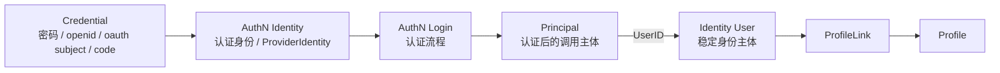
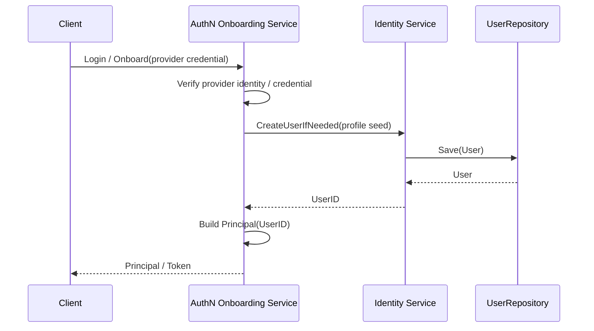

# 02-Identity 与 AuthN 边界：认证身份、Principal、User

## 1. 本文定位

本文是 `04-身份Identity/` 文档组中关于 **Identity 与 AuthN 边界** 的文档。

前两篇文档已经建立了 Identity 的核心模型：

```text
User
  -> ProfileLink
  -> Profile
```

其中：

```text
User 是 IAM 内部稳定身份主体。
Profile 是业务身份资料或业务档案。
ProfileLink 是 User 与 Profile 的身份关系。
```

本文聚焦 Identity 与 AuthN 的协作边界，重点回答：

```text
AuthN 认证身份是什么？
AuthN 登录凭据是什么？
ProviderIdentity 是什么？
Principal 是什么？
User 是什么？
AuthN 认证结果与 Identity.User 是什么关系？
登录成功后为什么返回 Principal，而不是完整 User 聚合？
身份开通、登录、认证入口绑定/解绑分别由谁负责？
为什么 AuthN 不应该吞掉 Identity，Identity 也不应该处理认证凭据？
```

注意：**新版 AuthN 模块已经不再以 `Account` 作为领域对象**。

因此本文不再使用：

```text
Account
Account.UserID
Account -> User
Account linking
Account status
```

这些旧口径。

本文统一使用新版口径：

```text
认证身份 / 登录凭据 / ProviderIdentity
  -> Principal(UserID)
  -> Identity.User
```

本文不深入展开 AuthZ 的 Subject / Role / Permission / Check。

这些内容放到下一篇：

```text
03-Identity与AuthZ-Subject-Resource-Permission边界.md
```

---

## 2. 30 秒结论

Identity 与 AuthN 的核心边界是：

```text
AuthN 负责认证身份识别、凭据校验与 Principal 构造。
Identity 负责稳定身份主体、身份资料与身份关系。
```

三组核心概念是：

| 概念 | 所属模块 | 一句话解释 |
| --- | --- | --- |
| 认证身份 / 登录凭据 / ProviderIdentity | AuthN | 用于识别和验证登录入口，如 openid、username、OAuth subject |
| Principal | AuthN | 认证成功后的当前调用主体表达，通常携带 UserID |
| User | Identity | IAM 内部稳定身份主体 |

核心关系是：

```text
AuthN 认证成功
  -> Principal(UserID)
  -> Identity.User
```

或者：

```text
AuthN 识别认证入口并校验凭据。
AuthN 登录成功后生成 Principal。
Principal 中携带 UserID。
UserID 指向 Identity.User。
```

一句话：

> AuthN 认证身份解决“通过什么入口证明身份”，User 解决“系统中的稳定身份是谁”，Principal 解决“本次认证后代表谁在调用系统”。

---

## 3. 为什么要区分认证身份、Principal、User

很多系统会把这些概念混在一起：

```text
登录入口 = 用户 = 当前登录人 = 权限主体
```

简单系统可以这么做，但 IAM 不适合。

因为 IAM 需要支持：

```text
多种认证入口归一到同一个 User
第三方 provider identity 与内部身份主体解耦
认证结果通过 Principal 表达
授权系统通过 Subject 引用 User
Identity 继续管理 Profile / ProfileLink
```

如果不区分这些概念，会出现：

```text
微信 openid 变化会影响 User 身份
运营后台登录方式和微信登录方式无法归一到同一个 User
登录态和身份主体生命周期混在一起
User 模型被迫保存认证凭据
AuthN 模块和 Identity 模块职责纠缠
AuthZ 无法稳定引用 user:<userID>
```

因此必须拆开：

```text
AuthN 认证身份：认证入口和凭据上下文
Principal：认证结果
User：稳定身份主体
```

---

## 4. 核心关系图



这张图表达的是：

```text
AuthN 认证身份代表登录入口和 provider identity。
AuthN 使用认证身份和凭据完成认证。
认证成功后生成 Principal。
Principal 携带 UserID。
UserID 指向 Identity.User。
User 再通过 ProfileLink 关联 Profile。
```

---

## 5. AuthN 认证身份：认证入口与凭据上下文

### 5.1 AuthN 认证身份是什么

AuthN 认证身份不是 Identity 领域对象。

它是 AuthN 在认证过程中识别登录入口和凭据上下文的概念。

它回答：

```text
本次登录请求来自哪个认证入口？
使用什么 provider？
对应哪个外部身份标识或登录凭据？
认证成功后应该归一到哪个 UserID？
```

这些认证入口可能包括：

```text
微信小程序 openid
微信公众号 openid / unionid
运营后台 username/password
手机号验证码
OAuth / OIDC subject
```

具体代码中可能表现为：

```text
credential
provider identity
login method
identity provider subject
principal claim
```

本文不再使用 `Account` 作为 AuthN 领域对象前提。

---

### 5.2 AuthN 负责什么

AuthN 负责认证相关事实和流程：

```text
识别 provider
校验登录凭据
解析外部身份标识
判断认证入口是否可用
认证成功后构造 Principal
在 Principal 中携带 UserID
签发 Token / Session
```

AuthN 的核心职责是：

```text
证明当前调用者是谁，并把认证结果表达为 Principal。
```

---

### 5.3 AuthN 不负责什么

AuthN 不应该负责：

```text
User / Profile / ProfileLink 的领域事实维护
Profile / ProfileLink 业务关系
资源权限
Role / Permission / RoleBinding
用户业务资料
业务档案生命周期
```

这些分别属于 Identity 或 AuthZ。

AuthN 也不应该成为系统中唯一的“人”的模型。

稳定身份主体应该由 Identity.User 承担。

---

## 6. User：Identity 的稳定身份主体

### 6.1 User 是什么

`User` 是 Identity 模块中的稳定身份主体。

它回答：

```text
IAM 内部这个人是谁？
```

User 不关心具体怎么登录。

它更像系统内部稳定的身份锚点。

例如：

```text
UserID = 1001
```

多种认证入口认证成功后，都可以归一到同一个 UserID：

```text
wechat openid       -> Principal.UserID = 1001
operation username  -> Principal.UserID = 1001
phone credential    -> Principal.UserID = 1001
```

---

### 6.2 User 负责什么

User 负责 Identity 层的身份主体事实：

```text
用户基本身份
用户状态
用户与 Profile 的关系入口
用户作为 AuthZ Subject 的身份锚点
```

User 可以被其他模块引用：

```text
AuthN Principal.UserID
AuthZ Subject user:<userID>
ProfileLink.UserID
```

---

### 6.3 User 不负责什么

User 不应该保存认证凭据。

例如：

```text
password hash
openid
oauth subject
refresh token
jwt key id
```

这些属于 AuthN。

User 也不应该直接保存权限集合。

例如：

```text
roles
permissions
casbin policies
```

这些属于 AuthZ。

User 也不应该承载所有业务资料字段。

大量业务资料应该进入 Profile。

---

## 7. Principal：认证成功后的调用主体

### 7.1 Principal 是什么

`Principal` 是 AuthN 认证成功后的调用主体表达。

它回答：

```text
本次请求经过认证后，代表谁在调用系统？
```

Principal 通常包含：

```text
UserID
认证方式 / provider
认证入口标识
Tenant / Domain context
SessionID / TokenID
IssuedAt / ExpiredAt
Claims
```

具体字段以 AuthN 代码事实源为准。

Principal 是认证结果，不是数据库中的完整 User 聚合。

---

### 7.2 为什么登录成功返回 Principal，而不是 User

登录成功后，系统需要表达的是：

```text
当前请求的认证主体是谁？
```

这和返回完整 User 聚合不是一回事。

Principal 更适合作为认证上下文，因为它可以包含：

```text
UserID
认证方式
ProviderIdentity 信息
Token 信息
Session 信息
Claims
```

而 User 只表达 Identity 中的稳定身份主体。

所以：

```text
登录结果 = Principal
身份事实 = User
```

二者不能混淆。

---

### 7.3 Principal 与 User 的关系

Principal 通常携带：

```text
UserID
```

这个 UserID 指向 Identity.User。

也就是说：

```text
Principal.UserID -> Identity.User.ID
```

但 Principal 不是 User。

Principal 是本次认证上下文。

User 是稳定身份主体。

同一个 User 在不同认证方式、不同 token、不同 session 下，可能产生不同 Principal。

---

## 8. AuthN 认证结果与 User 的关系

### 8.1 多认证入口可以归一到同一个 User

同一个真实用户可能通过多种认证入口进入系统。

例如：

```text
微信小程序 openid
运营后台用户名密码
手机号验证码
第三方 OAuth subject
```

这些认证入口在 AuthN 中完成识别和校验。

认证成功后，它们都可以归一到同一个：

```text
UserID
```

这个 UserID 指向 Identity.User。

---

### 8.2 Principal 通过 UserID 指向 User

AuthN 登录成功后生成 Principal。

Principal 通常携带：

```text
UserID
```

这表示：

```text
本次认证后的调用主体是 Identity.User(UserID)。
```

因此，Identity 与 AuthN 的稳定连接点不是某个 AuthN Account 领域对象，而是：

```text
Principal.UserID -> Identity.User.ID
```

---

### 8.3 未完成身份归一的边界

某些认证入口可能已经被 AuthN 识别，但还没有归一到 Identity.User。

例如：

```text
第三方登录返回 external subject
AuthN 校验凭据成功
但尚未完成身份开通 onboarding
```

这种情况下，AuthN 不应该直接生成完整可用 Principal。

它应该进入身份开通或绑定流程，直到获得有效的：

```text
UserID
```

---

## 9. 身份开通：AuthN 与 Identity 的协作

### 9.1 Onboarding 要解决什么

身份开通要解决的是：

```text
一个已经通过 AuthN 识别和校验的认证入口，如何归一到一个 Identity.User？
```

典型场景：

```text
用户首次使用微信小程序登录
系统识别到 openid
AuthN 校验 provider credential
Identity 创建 User
AuthN 认证结果携带 UserID
```

---

### 9.2 Onboarding 责任划分

AuthN 负责：

```text
识别 provider identity
校验认证材料
处理认证入口状态
构造 Principal
在 Principal 中携带 UserID
签发 Token / Session
```

Identity 负责：

```text
创建 User
初始化 User 基础状态
必要时创建 Profile
必要时创建 ProfileLink
```

也就是说：

```text
身份开通流程可以由 AuthN application 编排。
但 User / Profile / ProfileLink 的创建应通过 Identity 能力完成。
```

不要让 AuthN 直接拼 Identity 数据库表。

---

### 9.3 Onboarding 链路示意



这张图表达的是：

```text
AuthN 编排认证入口识别与身份开通。
Identity 提供 User 创建能力。
AuthN 认证成功后通过 Principal.UserID 指向 Identity.User。
```

---

## 10. 登录：从认证入口到 Principal

### 10.1 登录链路要做什么

登录链路要回答：

```text
这个登录请求是否能证明某个认证入口的身份？
如果可以，它对应哪个 User？
最终生成什么 Principal？
```

典型流程：

```text
1. 接收登录凭据
2. 识别认证方式
3. 识别认证入口 / provider identity
4. 校验认证入口与凭据状态
5. 得到或解析 UserID
6. 必要时确认 User 状态
7. 生成 Principal
8. 签发 Token / Session
```

---

### 10.2 登录不应该做什么

登录链路不应该直接处理：

```text
ProfileLink 复杂业务关系
资源权限计算
RoleBinding 写入
Permission 写入
业务档案大规模初始化
```

如果登录后需要返回当前用户的 Profile 列表，可以调用 Identity 查询能力。

如果登录后需要返回权限快照，可以调用 AuthZ Snapshot。

但这应该是明确的查询，而不是把所有逻辑塞进 Login 核心链路。

---

## 11. 认证入口绑定：多种登录入口归一到同一个 User

### 11.1 绑定要解决什么

认证入口绑定要解决的是：

```text
把一个新的认证入口归一到已有 User 上。
```

例如：

```text
用户先通过微信小程序登录。
后来绑定手机号登录入口。
再绑定第三方 OAuth 登录入口。
```

绑定后，这些认证入口在认证成功后都可以得到同一个 UserID。

---

### 11.2 绑定的基本约束

认证入口绑定是安全敏感操作。

至少要校验：

```text
当前操作者是否已认证
目标 User 是否存在且状态正常
待绑定认证入口是否已完成必要验证
待绑定认证入口是否已经归属其他 User
绑定方式是否经过必要安全校验
```

例如手机号绑定需要验证码。

第三方 OAuth 绑定需要完成第三方认证回调。

运营入口绑定可能需要管理员权限。

---

### 11.3 认证入口绑定不是创建 ProfileLink

认证入口绑定表达：

```text
AuthN 认证入口 -> UserID
```

ProfileLink 表达：

```text
User -> Profile
```

二者不是一回事。

绑定一个手机号登录入口，不等于绑定一个儿童 Profile。

绑定一个微信认证入口，也不等于授予任何资源权限。

---

## 12. 认证入口解绑：解除某种登录入口与 User 的归一关系

### 12.1 解绑要解决什么

认证入口解绑要解决的是：

```text
某个认证入口不再作为某个 User 的登录方式。
```

例如：

```text
用户解除手机号登录入口
管理员禁用某个运营登录入口
用户解除第三方 OAuth 登录入口
```

---

### 12.2 解绑风险

解绑可能导致用户无法登录。

因此需要考虑：

```text
是否至少保留一个可用认证入口
是否需要二次验证
是否需要管理员审批
是否需要撤销相关 session / refresh token
是否需要审计
```

这些属于 AuthN 安全策略。

Identity.User 不应该因为一个认证入口解绑就被自动删除。

---

## 13. 状态边界

### 13.1 AuthN 认证入口状态

AuthN 认证入口状态属于 AuthN。

它表达：

```text
这个认证入口或登录凭据是否可用于认证登录？
```

常见状态可能包括：

```text
active
disabled
locked
pending
```

具体以 AuthN 代码事实源为准。

---

### 13.2 User 状态

User 状态属于 Identity。

它表达：

```text
这个稳定身份主体是否可用？
```

常见状态可能包括：

```text
active
disabled
deleted
```

具体以 Identity 代码事实源为准。

---

### 13.3 Principal 有时效性

Principal 是认证结果。

它通常有时间边界：

```text
issued_at
expires_at
session_id
token_id
```

因此 Principal 不是持久身份主体。

它是某次认证成功后的上下文表达。

---

### 13.4 状态协作原则

登录时通常要同时考虑：

```text
AuthN 认证入口是否可用
User 是否可用
```

AuthN 认证入口 disabled：

```text
该登录方式不可用。
```

User disabled：

```text
该身份主体整体不可用，通常所有认证入口都不应继续登录。
```

具体规则以 AuthN 登录用例为准。

---

## 14. Identity 能力在 AuthN 中的使用方式

AuthN 不应该直接操作 Identity 数据表。

它应该通过 Identity application capabilities 完成：

```text
CreateUser
GetUser
EnsureUser
CreateProfile
CreateProfileLink
GetUserStatus
```

具体能力以代码事实源为准。

这样做的好处是：

```text
User 不变量由 Identity 维护
Profile / ProfileLink 初始化逻辑集中
AuthN 不需要知道 Identity 存储细节
未来 Identity 模型演进不破坏 AuthN
```

错误方式是：

```text
AuthN service 直接 insert users 表
AuthN service 直接 insert profiles 表
AuthN service 自己拼 profile_links
```

这会破坏模块边界。

---

## 15. Identity 与 AuthN 的一致性边界

### 15.1 同步事务还是最终一致

认证入口与 User 的归一通常希望在同一用例中完成。

但具体是否同一个数据库事务，要看当前项目架构。

如果 AuthN 与 Identity 的相关事实在同一个数据库中，可以通过 UoW 保证：

```text
User 创建成功
认证结果能得到有效 UserID
```

要么一起提交，要么一起回滚。

如果未来 AuthN / Identity 拆成独立服务，则可能变成：

```text
provider identity verified
User created
Principal built with UserID
```

通过事件或补偿保证最终一致。

当前文档只定义边界：

```text
认证身份、登录凭据、ProviderIdentity 属于 AuthN。
User 属于 Identity。
二者通过 Principal.UserID 连接。
```

---

### 15.2 创建 User 成功但 Principal 构造失败怎么办

这是典型一致性问题。

可能策略包括：

```text
同事务回滚 User 创建
保留 User 但标记为未完成 onboarding
后台补偿 Principal 构造或认证入口归一
重试登录 / onboarding
```

具体策略以当前实现为准。

但无论采用哪种策略，都应该避免：

```text
Principal.UserID 指向不存在的 User
User 已创建但没有任何可追踪 onboarding 状态
登录成功但 Principal.UserID 无效
```

---

## 16. 常见误区

### 16.1 AuthN 认证身份 = User

错误。

AuthN 认证身份用于识别和校验登录入口。

User 是稳定身份主体。

多个认证入口可以在认证成功后归一到同一个 UserID。

---

### 16.2 Principal = User

不准确。

Principal 是认证成功后的当前调用主体表达。

User 是 Identity 中的持久身份主体。

---

### 16.3 User 应该保存密码或 openid

错误。

密码、openid、OAuth subject 等认证材料属于 AuthN。

User 不应该保存认证凭据。

---

### 16.4 登录成功后应该直接返回完整 User 聚合

不推荐。

登录结果应该以 Principal / Token 为中心。

User 资料可以通过 Identity 查询接口按需读取。

---

### 16.5 绑定认证入口就是创建 ProfileLink

错误。

认证入口绑定是：

```text
AuthN 认证入口 -> UserID
```

ProfileLink 是：

```text
User -> Profile
```

---

### 16.6 解绑认证入口应该删除 User

错误。

解绑只是解除某种登录方式。

User 是否删除是 Identity 生命周期问题。

---

### 16.7 AuthN 可以直接写 Identity 表

不推荐。

AuthN 应通过 Identity application capabilities 创建或读取 User / Profile / ProfileLink。

---

## 17. 代码事实源

本文涉及的主要代码事实源：

```text
internal/apiserver/domain/authn
internal/apiserver/application/authn
internal/apiserver/domain/identity
internal/apiserver/application/identity
```

如果模块已拆分子包，可重点关注：

```text
internal/apiserver/domain/authn/principal
internal/apiserver/application/authn/login
internal/apiserver/application/authn/onboarding
internal/apiserver/application/authn/linking

internal/apiserver/domain/identity/user
internal/apiserver/domain/identity/profile
internal/apiserver/domain/identity/profilelink
internal/apiserver/application/identity/user
internal/apiserver/application/identity/profile
internal/apiserver/application/identity/profilelink
```

重点关注：

| 主题 | 事实源 |
| --- | --- |
| AuthN 认证身份 / ProviderIdentity / Credential | `domain/authn`、`application/authn` |
| Principal 模型 | `domain/authn/principal` 或 `domain/authn` |
| Login 用例 | `application/authn/login` |
| Onboarding 用例 | `application/authn/onboarding` |
| 认证入口绑定用例 | `application/authn/linking` 或当前 AuthN 绑定相关实现 |
| User 模型 | `domain/identity/user` 或 `domain/identity` |
| User 应用服务 | `application/identity/user` 或 `application/identity` |
| Profile 初始化 | `application/identity/profile` 或 `application/identity` |
| ProfileLink 初始化 | `application/identity/profilelink` 或 `application/identity` |
| AuthN -> Identity capabilities | container assembler / capabilities |

如果本文与代码不一致，以代码事实源为准，并同步修正文档。

---

## 18. 本文总结

Identity 与 AuthN 的边界可以压缩成三句话：

```text
AuthN 负责认证身份识别、凭据校验与 Principal 构造。
User 属于 Identity，负责稳定身份主体。
Principal 是 AuthN 认证成功后的当前调用主体表达。
```

三者关系是：

```text
AuthN 认证成功
  -> Principal(UserID)
  -> Identity.User
```

或者：

```text
AuthN 通过 provider identity / credential 证明调用者身份。
Principal 通过 UserID 表达当前认证主体。
User 作为稳定身份主体继续关联 Profile / ProfileLink。
```

如果只记住一句话：

> AuthN 认证身份解决“通过什么入口证明身份”，User 解决“系统中的稳定身份是谁”，Principal 解决“本次认证后代表谁在调用系统”；AuthN 可以编排身份开通和认证入口绑定，但 User / Profile / ProfileLink 的事实应由 Identity 维护。
