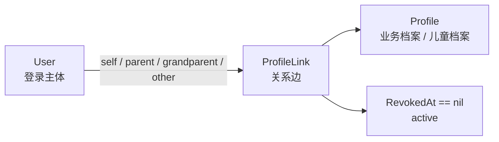
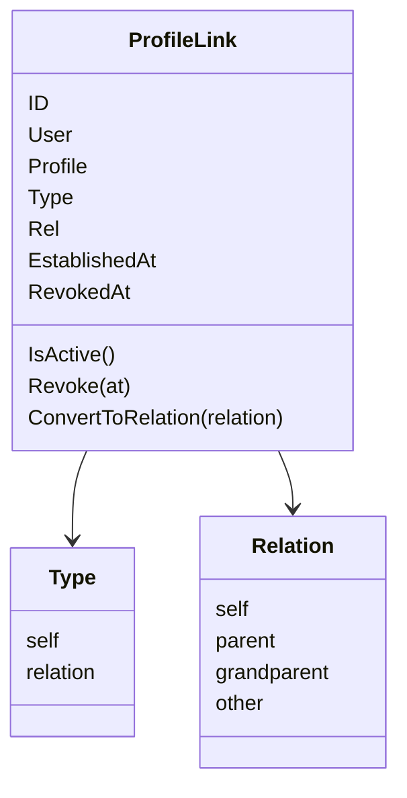
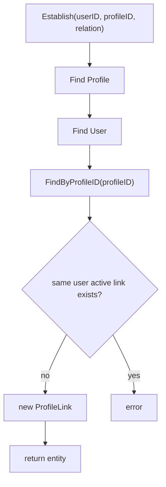
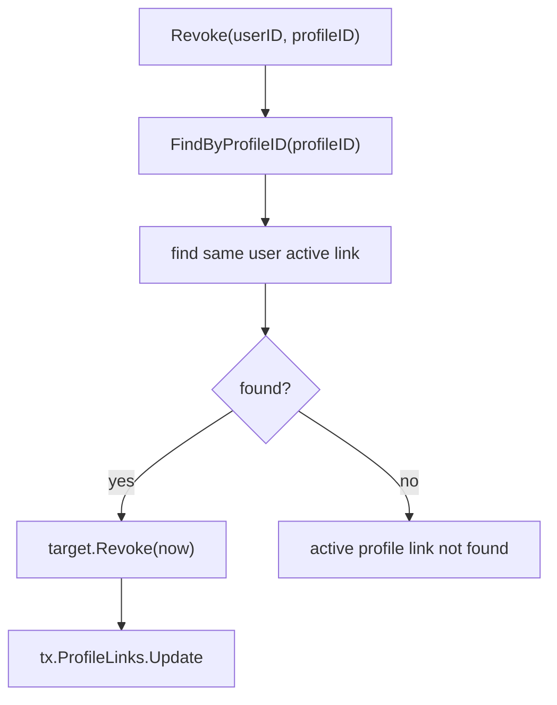
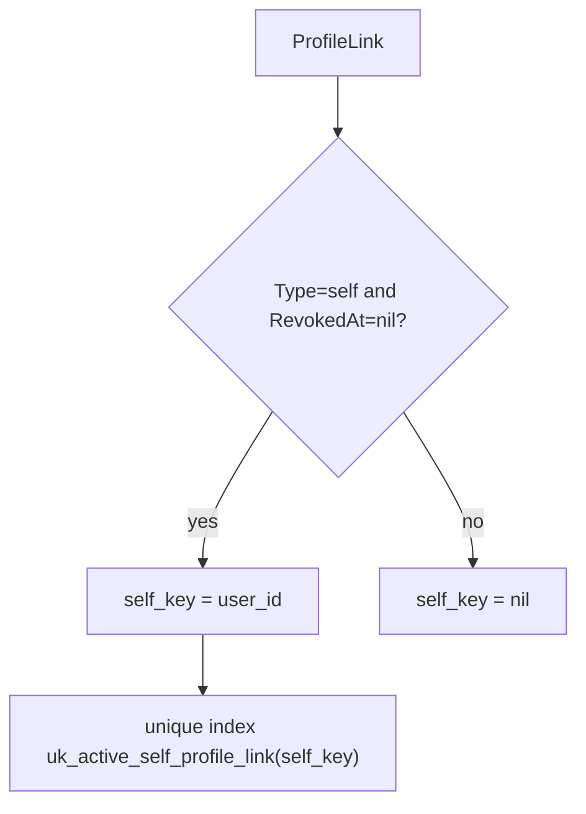
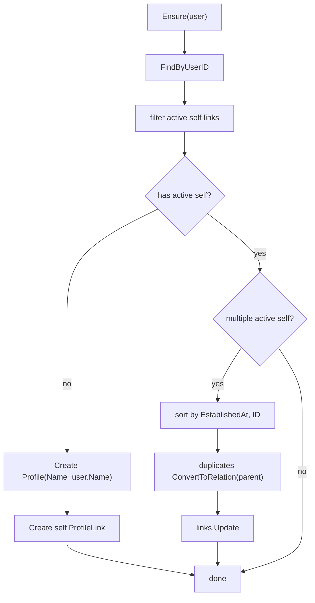
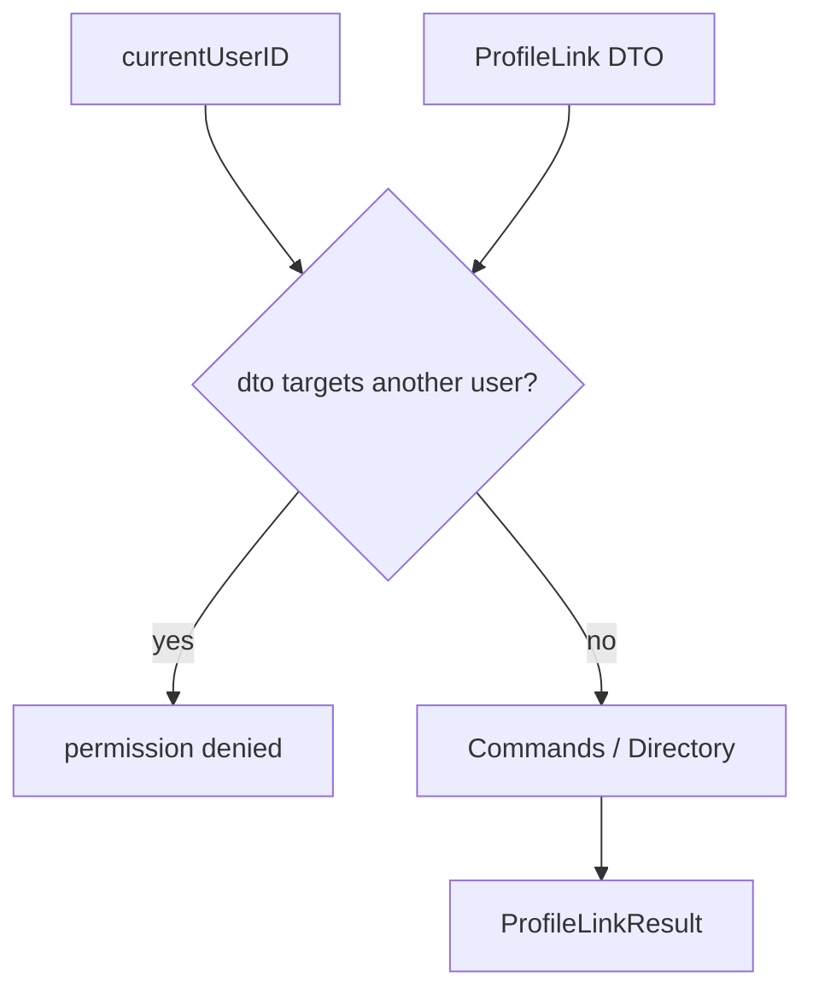

# ProfileLink 链路：用户与用户档案关系协作

## 本文回答

本文回答：IAM Identity 模块中 `ProfileLink` 如何表达 User 与 Profile 的关系；为什么它不是简单外键，也不是 AuthZ 权限；系统如何建立、查询、撤销关系；当前用户视角的 `MyProfileLinks` 如何防止用户操作其他用户的档案关系；`SelfProfileEnsurer` 如何维护每个 User 的 active self profile link；REST/gRPC 如何把 ProfileLink 能力暴露给调用方。

读完本文，你应该能回答：

- ProfileLink 解决什么问题；
- ProfileLink 的 `Type` 和 `Relation` 有什么区别；
- `self`、`parent`、`grandparent`、`other` 分别表达什么；
- `ProfileLink.IsActive()` 和 `RevokedAt` 的关系是什么；
- 建立 ProfileLink 时会校验哪些条件；
- 撤销 ProfileLink 时为什么是设置 `RevokedAt`，不是物理删除；
- `Commands` 和 `MyProfileLinks` 的区别是什么；
- 当前用户为什么不能为另一个 user grant/revoke profile link；
- 当前用户访问 Profile 时如何通过 ProfileLink guard；
- `SelfProfileEnsurer` 如何保证 active self link；
- 数据库层如何保护一个 User 只有一个 active self link；
- ProfileLink 与 AuthZ 权限、Suggest 候选搜索之间的边界是什么。

---

## 30 秒结论

ProfileLink 是 User 与 Profile 之间的关系实体。

它表达的是：

```text
某个 User 与某个 Profile 当前是什么关系，以及这条关系是否仍然有效。
```

核心模型是：

```text
User
  -> ProfileLink
  -> Profile
```

而不是：

```text
User.profile_id
Profile.user_id
```

ProfileLink 的当前关系类型包括：

```text
self
parent
grandparent
other
```

其中：

- `self` 表达 User 与本人档案的强关系；
- `parent/grandparent/other` 表达 User 与儿童档案或其他业务档案的普通关系。

ProfileLink 当前有两个维度：

| 字段 | 作用 |
| --- | --- |
| `Type` | 关系主类别：`self` 或 `relation` |
| `Rel` | 业务关系：`self`、`parent`、`grandparent`、`other` |

关系是否有效由：

```text
RevokedAt == nil
```

判断。撤销关系不是物理删除，而是设置 `RevokedAt`。

应用层有两类用例：

| 用例 | 语义 |
| --- | --- |
| `Commands` | 系统侧 ProfileLink 命令，可以指定 user/profile |
| `MyProfileLinks` | 当前用户视角，只允许操作当前用户自己的关系 |

最关键的边界：

```text
ProfileLink 是身份关系，不是 AuthZ 权限。
```

它可以作为“当前用户是否与某个 Profile 有关系”的 guard，但不能替代 AuthZ 的 Role/Permission/Check。

核心源码入口：

- [../../internal/apiserver/domain/uc/profilelink/profile_link.go](../../internal/apiserver/domain/uc/profilelink/profile_link.go)
- [../../internal/apiserver/domain/uc/profilelink/relation.go](../../internal/apiserver/domain/uc/profilelink/relation.go)
- [../../internal/apiserver/domain/uc/profilelink/linker.go](../../internal/apiserver/domain/uc/profilelink/linker.go)
- [../../internal/apiserver/domain/uc/profilelink/self_profile_ensurer.go](../../internal/apiserver/domain/uc/profilelink/self_profile_ensurer.go)
- [../../internal/apiserver/application/uc/profilelink/services.go](../../internal/apiserver/application/uc/profilelink/services.go)
- [../../internal/apiserver/application/uc/profilelink/service_command.go](../../internal/apiserver/application/uc/profilelink/service_command.go)
- [../../internal/apiserver/application/uc/profilelink/service_query.go](../../internal/apiserver/application/uc/profilelink/service_query.go)
- [../../internal/apiserver/application/uc/profilelink/service_access.go](../../internal/apiserver/application/uc/profilelink/service_access.go)
- [../../internal/apiserver/application/uc/profile/service_my_profiles.go](../../internal/apiserver/application/uc/profile/service_my_profiles.go)
- [../../internal/apiserver/application/uc/profile/service_access.go](../../internal/apiserver/application/uc/profile/service_access.go)
- [../../internal/apiserver/transport/rest/identity/handler/profile_link.go](../../internal/apiserver/transport/rest/identity/handler/profile_link.go)

---

## 主图：ProfileLink 的业务链路



建立关系链路：

```mermaid
sequenceDiagram
    participant REST as "REST / gRPC"
    participant Access as "MyProfileLinks or Commands"
    participant UOW as "UC UoW"
    participant Linker as "Domain ProfileLinker"
    participant Users as "User Repository"
    participant Profiles as "Profile Repository"
    participant Links as "ProfileLink Repository"

    REST->>Access: Grant / Establish
    Access->>UOW: WithinTx
    UOW->>Linker: Establish(userID, profileID, relation)
    Linker->>Profiles: FindByID(profileID)
    Linker->>Users: FindByID(userID)
    Linker->>Links: FindByProfileID(profileID)
    Linker-->>UOW: new ProfileLink
    UOW->>Links: Create(profileLink)
```

---

## 重点速查

| 问题 | 当前答案 | 代码证据 |
| --- | --- | --- |
| ProfileLink 领域对象在哪里 | `domain/uc/profilelink/profile_link.go`。 | [../../internal/apiserver/domain/uc/profilelink/profile_link.go](../../internal/apiserver/domain/uc/profilelink/profile_link.go) |
| 支持哪些 relation | `self`、`parent`、`grandparent`、`other`。 | [../../internal/apiserver/domain/uc/profilelink/profile_link.go](../../internal/apiserver/domain/uc/profilelink/profile_link.go) |
| relation 输入如何规范化 | `ParseRelation`，未知值默认 `other`。 | [../../internal/apiserver/domain/uc/profilelink/relation.go](../../internal/apiserver/domain/uc/profilelink/relation.go) |
| 关系是否 active 如何判断 | `IsActive()` 判断 `RevokedAt == nil`。 | [../../internal/apiserver/domain/uc/profilelink/profile_link.go](../../internal/apiserver/domain/uc/profilelink/profile_link.go) |
| 建立关系的领域能力在哪里 | `ProfileLinker.Establish`。 | [../../internal/apiserver/domain/uc/profilelink/linker.go](../../internal/apiserver/domain/uc/profilelink/linker.go) |
| 建立关系会检查什么 | Profile 存在、User 存在、同 User/Profile 没有 active duplicate。 | [../../internal/apiserver/domain/uc/profilelink/linker.go](../../internal/apiserver/domain/uc/profilelink/linker.go) |
| 撤销关系的领域能力在哪里 | `ProfileLinker.Revoke`。 | [../../internal/apiserver/domain/uc/profilelink/linker.go](../../internal/apiserver/domain/uc/profilelink/linker.go) |
| 系统侧命令在哪里 | `application/uc/profilelink/service_command.go`。 | [../../internal/apiserver/application/uc/profilelink/service_command.go](../../internal/apiserver/application/uc/profilelink/service_command.go) |
| 当前用户视角在哪里 | `application/uc/profilelink/service_access.go`。 | [../../internal/apiserver/application/uc/profilelink/service_access.go](../../internal/apiserver/application/uc/profilelink/service_access.go) |
| MyProfiles 如何检查访问 | `accessibleProfileIDInTx` 查询 active ProfileLink。 | [../../internal/apiserver/application/uc/profile/service_access.go](../../internal/apiserver/application/uc/profile/service_access.go) |
| self link 不变量在哪里维护 | `SelfProfileEnsurer`。 | [../../internal/apiserver/domain/uc/profilelink/self_profile_ensurer.go](../../internal/apiserver/domain/uc/profilelink/self_profile_ensurer.go) |
| DB 如何保护 active self link | `self_key` + `uk_active_self_profile_link`。 | [../../internal/pkg/migration/migrations/000007_add_active_self_profile_link_guard.up.sql](../../internal/pkg/migration/migrations/000007_add_active_self_profile_link_guard.up.sql) |
| REST ProfileLink 入口在哪里 | `/api/v2/identity/profile-links`。 | [../../internal/apiserver/transport/rest/identity/router.go](../../internal/apiserver/transport/rest/identity/router.go)、[../../internal/apiserver/transport/rest/identity/handler/profile_link.go](../../internal/apiserver/transport/rest/identity/handler/profile_link.go) |
| gRPC ProfileLink 命令在哪里 | `profile_link_command.go`。 | [../../internal/apiserver/transport/grpc/service/uc/identity/profile_link_command.go](../../internal/apiserver/transport/grpc/service/uc/identity/profile_link_command.go) |

---

## 1. 为什么需要 ProfileLink

如果只有 User 和 Profile，最简单的设计是：

```text
Profile.user_id
```

但这会立即遇到问题：

- 一个 User 可能有自己的 Profile，也可能有多个儿童 Profile；
- 一个儿童 Profile 可能被父亲、母亲、祖父母等多个 User 关联；
- 关系有类型，例如 self、parent、grandparent；
- 关系可以撤销，但历史应保留；
- 当前用户只能操作自己的关系；
- self profile 是特殊不变量，需要单独保护；
- Profile access guard 需要基于 active relationship 判断。

因此关系必须成为一等模型：

```text
ProfileLink
```

ProfileLink 的价值是把关系本身建模出来：

```text
谁
和哪个档案
是什么关系
什么时候建立
是否已经撤销
```

---

## 2. ProfileLink 领域模型

ProfileLink 字段：

| 字段 | 含义 |
| --- | --- |
| `ID` | 关系 ID |
| `User` | User ID |
| `Profile` | Profile ID |
| `Type` | 关系主类别：self / relation |
| `Rel` | 业务关系：self / parent / grandparent / other |
| `EstablishedAt` | 建立时间 |
| `RevokedAt` | 撤销时间，nil 表示 active |



### Active 语义

当前 active 判断非常明确：

```text
RevokedAt == nil
```

也就是说：

```text
active link: RevokedAt nil
revoked link: RevokedAt non-nil
```

撤销不会删除记录，而是设置 `RevokedAt`。

### 并发安全

ProfileLink 内部有 `sync.RWMutex`，`IsActive`、`Revoke`、`ConvertToRelation` 都使用锁。  
`Revoke(at)` 会分配新的 `time.Time` 指针，避免多个调用者共享同一个栈地址。

核心源码：

- [../../internal/apiserver/domain/uc/profilelink/profile_link.go](../../internal/apiserver/domain/uc/profilelink/profile_link.go)

---

## 3. Type 与 Relation 的区别

ProfileLink 中有两个容易混淆的字段：

```text
Type
Rel
```

| 字段 | 取值 | 作用 |
| --- | --- | --- |
| `Type` | `self` / `relation` | 描述关系主类别 |
| `Rel` | `self` / `parent` / `grandparent` / `other` | 描述业务关系 |

当前规则：

```text
RelSelf        -> TypeSelf
其他 Relation  -> TypeRelation
```

也就是：

```text
TypeFromRelation(RelSelf) = TypeSelf
TypeFromRelation(RelParent) = TypeRelation
TypeFromRelation(RelGrandparent) = TypeRelation
TypeFromRelation(RelOther) = TypeRelation
```

### 为什么要有 Type

`self` 关系有特殊约束：

```text
一个 User 只能有一个 active self ProfileLink
```

普通 relation 则不适用这个约束。

所以 `Type` 不是重复字段，它给数据库和领域不变量提供了更稳定的分类。

### ParseRelation

外部传入 relation 文本会被规范化：

| 输入 | Relation |
| --- | --- |
| `self` | `RelSelf` |
| `parent` | `RelParent` |
| `grandparent` | `RelGrandparent` |
| `other` | `RelOther` |
| 其他未知值 | `RelOther` |

核心源码：

- [../../internal/apiserver/domain/uc/profilelink/profile_link.go](../../internal/apiserver/domain/uc/profilelink/profile_link.go)
- [../../internal/apiserver/domain/uc/profilelink/relation.go](../../internal/apiserver/domain/uc/profilelink/relation.go)

---

## 4. Establish：建立 ProfileLink

领域能力：

```text
ProfileLinker.Establish(ctx, userID, profileID, relation)
```

流程：

1. 查询 Profile，确保 Profile 存在；
2. 查询 User，确保 User 存在；
3. 查询该 Profile 下已有 links；
4. 如果同一个 User 对该 Profile 已有 active link，则拒绝；
5. 根据 relation 计算 Type；
6. 创建 ProfileLink entity；
7. 返回给 application 层持久化。



### 建立关系不直接持久化

领域层 `Establish` 只返回实体，不调用 `repo.Create`。  
持久化由 application service 在 UoW 内完成：

```text
linker.Establish
  -> tx.ProfileLinks.Create
```

这保持了领域能力和事务编排的边界。

### duplicate 判断

duplicate 的判断是：

```text
同一个 User
同一个 Profile
并且 existing link IsActive()
```

如果旧 link 已经 revoked，则可以再次建立新 link。

核心源码：

- [../../internal/apiserver/domain/uc/profilelink/linker.go](../../internal/apiserver/domain/uc/profilelink/linker.go)
- [../../internal/apiserver/application/uc/profilelink/service_command.go](../../internal/apiserver/application/uc/profilelink/service_command.go)

---

## 5. Revoke：撤销 ProfileLink

领域能力：

```text
ProfileLinker.Revoke(ctx, userID, profileID)
```

流程：

1. 查询该 Profile 的 active links；
2. 找到目标 User 的 active link；
3. 如果找不到，返回 active profile link not found；
4. 调用 `target.Revoke(time.Now())`；
5. 返回修改后的 entity；
6. application 层调用 `tx.ProfileLinks.Update` 持久化。



### 为什么不是物理删除

撤销用 `RevokedAt` 表达，而不是删除记录。  
好处是：

- 保留历史关系；
- 支持 including revoked 查询；
- 可以审计关系何时撤销；
- 可以重新建立新的 active link；
- 可以区分“从未有关联”和“曾有关联但已撤销”。

核心源码：

- [../../internal/apiserver/domain/uc/profilelink/linker.go](../../internal/apiserver/domain/uc/profilelink/linker.go)
- [../../internal/apiserver/domain/uc/profilelink/profile_link.go](../../internal/apiserver/domain/uc/profilelink/profile_link.go)

---

## 6. Repository：active 与 including revoked 查询

ProfileLink repository 支持两类查询：

```text
active only
including revoked
```

核心方法：

| 方法 | 语义 |
| --- | --- |
| `FindByUserID` | 用户的 active links |
| `FindByUserIDIncludingRevoked` | 用户的所有 links |
| `FindByProfileID` | 档案的 active links |
| `FindByProfileIDIncludingRevoked` | 档案的所有 links |
| `FindByUserIDAndProfileID` | 某 user/profile 的 active link |
| `FindByUserIDAndProfileIDIncludingRevoked` | 某 user/profile 的所有状态 link |
| `IsLinked` | 是否存在 active link |

active 查询都会加条件：

```text
revoked_at IS NULL
```

### Duplicate DB 保护

Repository 注册了 duplicate error translator。  
如果数据库唯一约束冲突，会转换成：

```text
ErrIdentityProfileLinkExists
```

这与领域层 duplicate 检查形成双层保护：

```text
领域层先检查 active duplicate
数据库层兜底约束并发冲突
```

核心源码：

- [../../internal/apiserver/domain/uc/profilelink/repository.go](../../internal/apiserver/domain/uc/profilelink/repository.go)
- [../../internal/apiserver/infra/mysql/profilelink/repo.go](../../internal/apiserver/infra/mysql/profilelink/repo.go)

---

## 7. 数据库模型与 self link 约束

`ProfileLinkPO` 字段：

| 字段 | 含义 |
| --- | --- |
| `user_id` | User ID |
| `profile_id` | Profile ID |
| `type` | self / relation |
| `relation` | self / parent / grandparent / other |
| `self_key` | active self link 唯一性保护键 |
| `established_at` | 建立时间 |
| `revoked_at` | 撤销时间 |

普通唯一索引：

```text
idx_user_profile_link(user_id, profile_id, type)
```

self link 保护：

```text
uk_active_self_profile_link(self_key)
```

mapper 中：

```text
if Type == self && RevokedAt == nil:
    self_key = user_id
else:
    self_key = nil
```

这意味着同一个 User 只能有一个 active self link。  
普通 relation link 的 `self_key` 为 nil，不受这个唯一索引约束。



### Migration 修复历史数据

迁移脚本会：

1. 找出同一个 user 的多个 active self links；
2. 保留最早的 self link；
3. 把后续 active self links 转成 `relation/parent`；
4. 添加 `self_key`；
5. 为 active self link 设置 `self_key=user_id`；
6. 创建唯一索引。

这和领域层 `SelfProfileEnsurer` 的策略一致。

核心源码：

- [../../internal/apiserver/infra/mysql/profilelink/profile_link.go](../../internal/apiserver/infra/mysql/profilelink/profile_link.go)
- [../../internal/apiserver/infra/mysql/profilelink/mapper.go](../../internal/apiserver/infra/mysql/profilelink/mapper.go)
- [../../internal/pkg/migration/migrations/000007_add_active_self_profile_link_guard.up.sql](../../internal/pkg/migration/migrations/000007_add_active_self_profile_link_guard.up.sql)

---

## 8. SelfProfileEnsurer：维护本人档案不变量

`SelfProfileEnsurer` 负责保证：

```text
每个 User 最多一个 active self ProfileLink
如果没有 active self link，则创建一个 self Profile 和 self link
```

流程：

```text
FindByUserID(userID)
  -> active self links
  -> if none: create self Profile + self ProfileLink
  -> if multiple: keep earliest, convert duplicates to parent relation
```



调用场景：

| 场景 | 作用 |
| --- | --- |
| User 创建 | 创建 User 后自动补 self Profile/ProfileLink |
| AuthN onboarding | 复用或创建 User 后确保 self link |

### self link 的意义

self link 让“当前用户自己的档案”成为普通 ProfileLink 关系的一种。  
这避免系统一边有 User，一边有 Profile，又没有明确的本人关系。

但要注意：

```text
self Profile 不是 User 本身
```

它只是一个 Profile，通过 self ProfileLink 与 User 关联。

核心源码：

- [../../internal/apiserver/domain/uc/profilelink/self_profile_ensurer.go](../../internal/apiserver/domain/uc/profilelink/self_profile_ensurer.go)
- [../../internal/apiserver/application/uc/user/service_create.go](../../internal/apiserver/application/uc/user/service_create.go)
- [../../internal/apiserver/application/authn/onboarding/user_provisioner.go](../../internal/apiserver/application/authn/onboarding/user_provisioner.go)

---

## 9. Commands：系统侧 ProfileLink 命令

Application 层的 `Commands` 是系统侧命令接口：

```text
Establish
Revoke
RevokeBySelector
```

DTO：

```text
CreateProfileLinkDTO
RemoveProfileLinkDTO
RevokeProfileLinkBySelectorDTO
```

### 9.1 Establish

系统侧建立关系：

```text
parse userID/profileID
  -> domain.NewLinker
  -> linker.Establish
  -> tx.ProfileLinks.Create
  -> load Profile
  -> ProfileLinkResult
```

### 9.2 Revoke

系统侧撤销关系：

```text
parse userID/profileID
  -> linker.Revoke
  -> tx.ProfileLinks.Update
  -> load Profile
  -> ProfileLinkResult
```

### 9.3 RevokeBySelector

支持两种 selector：

```text
profileLinkID
userID + profileID
```

如果传 `profileLinkID`：

```text
FindByID(profileLinkID)
  -> resolve userID/profileID
  -> revokeProfileLinkInTx
```

这让 REST/gRPC 可以通过 link id 或 user/profile key 撤销关系。

核心源码：

- [../../internal/apiserver/application/uc/profilelink/services.go](../../internal/apiserver/application/uc/profilelink/services.go)
- [../../internal/apiserver/application/uc/profilelink/service_command.go](../../internal/apiserver/application/uc/profilelink/service_command.go)

---

## 10. Directory：ProfileLink 查询用例

`Directory` 是系统侧查询接口。

能力包括：

```text
IsLinked
Get
GetIncludingRevoked
ListProfilesForUser
ListProfilesForUserIncludingRevoked
ListLinksForProfile
ListLinksForProfileIncludingRevoked
```

### 查询维度

| 查询 | 语义 |
| --- | --- |
| `ListProfilesForUser` | 某个 User 关联的 active Profile links |
| `ListLinksForProfile` | 某个 Profile 的 active User links |
| `Get` | 某 user/profile 的 active link |
| `IncludingRevoked` | 包含 revoked 历史关系 |

Directory 查询会补充 Profile 信息到 `ProfileLinkResult`：

```text
ProfileName
ProfileGender
ProfileBirthday
```

这让调用方不必再额外查 Profile 只为了展示关系列表。

核心源码：

- [../../internal/apiserver/application/uc/profilelink/service_query.go](../../internal/apiserver/application/uc/profilelink/service_query.go)
- [../../internal/apiserver/application/uc/profilelink/mapper.go](../../internal/apiserver/application/uc/profilelink/mapper.go)

---

## 11. MyProfileLinks：当前用户视角

`MyProfileLinks` 是当前用户视角的 ProfileLink 访问用例。

它和系统侧 `Commands/Directory` 的最大区别是：

```text
MyProfileLinks 必须限制 currentUserID
```

接口：

```text
Grant(currentUserID, dto)
List(currentUserID, dto)
Revoke(currentUserID, dto)
```

### 11.1 Grant guard

规则：

```text
如果 dto.UserID 非空且不等于 currentUserID:
    permission denied

dto.UserID = currentUserID
Commands.Establish(dto)
```

也就是说，当前用户只能给自己建立 ProfileLink，不能给其他用户建立关系。

### 11.2 List guard

规则：

```text
如果 dto.UserID 非空且不等于 currentUserID:
    permission denied

dto.UserID = currentUserID
```

如果查询指定 `profileID`，还会先调用：

```text
ensureActiveProfileLinkAccess(currentUserID, profileID)
```

确保当前用户本来就是这个 Profile 的 active link 之一。

### 11.3 Revoke guard

Revoke 会先解析 selector：

```text
profileLinkID
或 userID + profileID
```

然后校验：

```text
resolved userID == currentUserID
```

如果不是当前用户，返回 permission denied。



### 这个 guard 不是 AuthZ

MyProfileLinks 的 guard 是关系访问控制：

```text
你只能操作自己的 ProfileLink
你只能查看自己 linked 的 Profile
```

它不是 AuthZ 的 Role/Permission/Check。  
如果以后需要管理员跨用户管理关系，应走系统侧 Commands，并配合 AuthZ admin route protection。

核心源码：

- [../../internal/apiserver/application/uc/profilelink/service_access.go](../../internal/apiserver/application/uc/profilelink/service_access.go)

---

## 12. MyProfiles 与 ProfileLink

`MyProfiles` 是当前用户视角的 Profile 用例，它也依赖 ProfileLink。

### 12.1 Create

当前用户创建 Profile：

```text
parse currentUserID
  -> build Profile
  -> tx.Profiles.Create
  -> ProfileLinker.Establish(currentUserID, newProfile.ID, relation)
  -> tx.ProfileLinks.Create
  -> return Profile + ProfileLink
```

```mermaid
sequenceDiagram
    participant App as "MyProfiles.Create"
    participant UOW as "UC UoW"
    participant Profile as "Profile"
    participant Linker as "ProfileLinker"
    participant Links as "ProfileLinks"

    App->>UOW: WithinTx
    UOW->>Profile: build + Create
    UOW->>Linker: Establish(currentUserID, profileID, relation)
    Linker-->>UOW: ProfileLink
    UOW->>Links: Create(ProfileLink)
```

### 12.2 List

`MyProfiles.List(userID)`：

```text
Find ProfileLinks by userID
  -> for each active link load Profile
  -> return ProfileResult[]
```

### 12.3 Get / Patch

`MyProfiles.Get` 和 `Patch` 都会先检查：

```text
accessibleProfileIDInTx(userID, profileID)
```

也就是：

```text
FindByUserIDAndProfileID(userID, profileID)
```

如果没有 active link，返回 permission denied。

### 12.4 为什么 MyProfiles 不直接查 Profile

因为当前用户只能访问和自己有 active ProfileLink 的 Profile。  
如果直接按 ProfileID 查 Profile，会绕过关系 guard。

核心源码：

- [../../internal/apiserver/application/uc/profile/service_my_profiles.go](../../internal/apiserver/application/uc/profile/service_my_profiles.go)
- [../../internal/apiserver/application/uc/profile/service_access.go](../../internal/apiserver/application/uc/profile/service_access.go)

---

## 13. REST ProfileLink 链路

REST ProfileLink routes：

```text
GET  /api/v2/identity/profile-links
POST /api/v2/identity/profile-links
POST /api/v2/identity/profile-links/:id/revoke
```

全部位于：

```text
/api/v2/identity
```

并受 AuthMiddleware 保护。

### 13.1 Grant

请求：

```json
{
  "userId": "",
  "profileId": "123",
  "relation": "parent"
}
```

handler 流程：

```text
BindJSON
  -> Get current user_id from JWT context
  -> MyProfileLinks.Grant(currentUserID, dto)
  -> Created(ProfileLinkResponse)
```

如果请求中 `userId` 指向其他用户，MyProfileLinks 会拒绝。

### 13.2 List

Query：

```text
user_id
profile_id
active
limit
offset
```

handler 流程：

```text
BindQuery
  -> Get current user_id
  -> MyProfileLinks.List(currentUserID, dto)
  -> ProfileLinkPageResponse
```

### 13.3 Revoke

路径：

```text
POST /api/v2/identity/profile-links/:id/revoke
```

handler 流程：

```text
path id
  -> Get current user_id
  -> MyProfileLinks.Revoke(currentUserID, ProfileLinkID=id)
  -> ProfileLinkResponse
```

注意：当前 REST revoke 是“当前用户视角撤销”，不是管理员任意撤销。  
如果 id 指向别的用户关系，application 会解析后拒绝。

核心源码：

- [../../internal/apiserver/transport/rest/identity/router.go](../../internal/apiserver/transport/rest/identity/router.go)
- [../../internal/apiserver/transport/rest/identity/handler/profile_link.go](../../internal/apiserver/transport/rest/identity/handler/profile_link.go)
- [../../internal/apiserver/transport/rest/identity/request/profile_link.go](../../internal/apiserver/transport/rest/identity/request/profile_link.go)

---

## 14. gRPC ProfileLink 链路

gRPC Identity 服务包含：

```text
ProfileLinkQuery
ProfileLinkCommand
```

### 14.1 ProfileLinkQuery

提供：

```text
HasProfileLink
ListProfiles
ListProfileLinks
```

语义：

| RPC | 作用 |
| --- | --- |
| `HasProfileLink` | 判断 user/profile 是否有关联 |
| `ListProfiles` | 列出某 user 关联的 profiles |
| `ListProfileLinks` | 列出某 profile 的 linked users |

注意：gRPC query 是系统侧查询，不等同于 REST 当前用户视角。  
调用方需要根据自身接入场景做好权限保护。

### 14.2 ProfileLinkCommand

提供：

```text
EstablishProfileLink
RevokeProfileLink
BatchRevokeProfileLinks
ImportProfileLinks
```

这些命令调用的是系统侧 `profileLinkSvc`，不是 `MyProfileLinks`。

这说明：

| 协议 | 当前语义 |
| --- | --- |
| REST `/identity/profile-links` | 当前用户视角 |
| gRPC ProfileLinkCommand | 系统侧服务接口 |

如果业务服务通过 gRPC 调用，需要自己确保调用方身份和操作权限。

核心源码：

- [../../internal/apiserver/transport/grpc/service/uc/identity/service.go](../../internal/apiserver/transport/grpc/service/uc/identity/service.go)
- [../../internal/apiserver/transport/grpc/service/uc/identity/profile_link_query.go](../../internal/apiserver/transport/grpc/service/uc/identity/profile_link_query.go)
- [../../internal/apiserver/transport/grpc/service/uc/identity/profile_link_command.go](../../internal/apiserver/transport/grpc/service/uc/identity/profile_link_command.go)

---

## 15. ProfileLink 与 AuthZ 的边界

ProfileLink 可以用于关系 guard：

```text
当前 user 是否 linked 到 profile？
```

AuthZ 用于权限判定：

```text
当前 subject 是否能对 resource 执行 action？
```

这两件事不同。

| 能力 | 回答的问题 | 示例 |
| --- | --- | --- |
| ProfileLink | user 和 profile 有没有关系 | 用户是不是这个儿童档案的 parent |
| AuthZ | subject 能不能操作某资源 | 用户能不能 read scale:form:* |
| MyProfiles guard | 当前用户能不能访问这个 profile | 没有 active link 则拒绝 |
| AuthZ Check | 角色和策略是否允许操作 | role teacher can read resource |

当前 `MyProfiles.Get/Patch` 使用 ProfileLink guard，不走 AuthZ Check。  
这说明它是一种 identity-layer access guard，而不是完整权限系统。

未来如果要把 Profile access 纳入 AuthZ，可以设计：

```text
ResourceKey = identity:profile:*
Action = read / update
Scope = origin:<profile-id> 或 profile:<id>
```

但这需要扩展 AuthZ Resource/Scope 设计，不能直接把 ProfileLink 当成 Permission。

---

## 16. ProfileLink 与 Suggest 的边界

Suggest 只提供候选发现能力，例如搜索相似 Profile。  
它不建立关系，也不证明当前用户有权访问某 Profile。

正确链路应该是：

```text
Suggest 找到候选 Profile
  -> 用户或系统选择目标 Profile
  -> ProfileLink.Establish 建立关系
  -> 后续 MyProfiles / MyProfileLinks 基于 active link 访问
```

不要把 Suggest 写成：

```text
搜索到了 Profile = 已有关联
```

Suggest 是候选，ProfileLink 是关系。

---

## 17. 失败边界

| 阶段 | 失败点 | 当前行为 |
| --- | --- | --- |
| relation parse | 未知 relation | 默认 `other` |
| Establish | Profile 不存在 | 返回 profile not found |
| Establish | User 不存在 | 返回 user not found |
| Establish | 同 User/Profile 已有 active link | 返回 profile link already exists |
| DB Create | 唯一索引冲突 | 转成 `ErrIdentityProfileLinkExists` |
| Revoke | 找不到 active link | 返回 active profile link not found |
| RevokeBySelector | selector id 无效 | 返回 parse/find 错误 |
| MyProfileLinks.Grant | 目标 user 不是 current user | permission denied |
| MyProfileLinks.List | 查询其他 user links | permission denied |
| MyProfileLinks.Revoke | selector 解析出的 user 不是 current user | permission denied |
| MyProfiles.Get/Patch | 当前用户没有 active link | permission denied |
| SelfProfileEnsurer | profiles/links repo nil | no-op |
| SelfProfileEnsurer | 多 active self link | 保留最早，其他转 parent |
| DB self unique | 多 active self link 并发创建 | unique index 阻止 |

---

## 18. 当前边界与待讨论点

### 18.1 REST 是当前用户视角，gRPC command 是系统侧

REST `/identity/profile-links` 使用 `MyProfileLinks`，会限制 currentUserID。  
gRPC `ProfileLinkCommand` 使用系统侧 `Commands`，允许显式指定 user/profile。  
这不是矛盾，而是接入边界不同。

### 18.2 active 查询默认排除 revoked

大多数查询默认只返回 active links。  
如果需要历史关系，必须显式调用 including revoked 能力。

### 18.3 Revoke 是软撤销

撤销只设置 `RevokedAt`。  
历史关系仍可被 including revoked 查询看到。

### 18.4 self relation 有数据库约束

self link 不只靠代码维护。  
数据库通过 `self_key` 唯一索引保护 active self link。

### 18.5 ProfileLink 不是 Profile ownership

一个 Profile 可以有多个 links。  
因此不能写成“Profile 属于某 User”。更准确是“User 与 Profile 有关系”。

---

## 19. 常见误区

### 误区一：ProfileLink 是 AuthZ 权限

不对。  
ProfileLink 是 identity relationship。AuthZ 权限由 Role/Permission/Check 处理。

### 误区二：ProfileLink 是简单 user_id/profile_id 外键

不完整。  
它还包含 relation、type、establishedAt、revokedAt、self invariant。

### 误区三：撤销 ProfileLink 就删除记录

不对。  
撤销是设置 `RevokedAt`，保留历史。

### 误区四：用户可以给任何人建立 ProfileLink

REST 当前用户视角不允许。  
`MyProfileLinks.Grant` 会阻止给其他 user 建立关系。

### 误区五：self link 可以有多个 active

不应该。  
领域 ensurer 会规整，数据库 self_key unique index 会兜底。

### 误区六：Suggest 搜索到 Profile 就代表用户有访问权

不对。  
Suggest 只是候选发现，访问仍要看 ProfileLink 或 AuthZ。

### 误区七：Profile 是 User 的子对象

不准确。  
Profile 是独立业务档案，通过 ProfileLink 和 User 建立关系。

---

## 20. 设计模式

| 模式 | 为什么用 | IAM 落地 | 代价和边界 |
| --- | --- | --- | --- |
| Relationship Entity | 关系有类型、状态和历史 | ProfileLink | 比简单外键复杂，但语义完整 |
| Soft Revocation | 关系撤销需要历史 | RevokedAt | 查询必须区分 active / including revoked |
| Current-user Guard | 用户只能操作自己的关系 | MyProfileLinks | 系统侧 gRPC/Commands 需另有权限保护 |
| Self Invariant | 每个 User 需要本人档案关系 | SelfProfileEnsurer + self_key unique index | 自动创建 Profile，需要明确业务语义 |
| UoW Composition | Profile + ProfileLink 要同事务 | UC UnitOfWork | 所有组合写入必须走 tx repos |
| Domain Capability | 领域只返回实体，不持久化 | Linker.Establish/Revoke | 应用层必须负责 Update/Create |
| Dual Interface | 用户侧与系统侧能力不同 | REST MyProfileLinks / gRPC Commands | 文档要明确接入边界 |

---

## 21. 推荐源码阅读路线

### 第一轮：ProfileLink 领域模型

```text
internal/apiserver/domain/uc/profilelink/profile_link.go
internal/apiserver/domain/uc/profilelink/relation.go
internal/apiserver/domain/uc/profilelink/interfaces.go
internal/apiserver/domain/uc/profilelink/repository.go
```

目标：理解 Type、Relation、active/revoked、Repository 查询边界。

### 第二轮：Linker 与 self invariant

```text
internal/apiserver/domain/uc/profilelink/linker.go
internal/apiserver/domain/uc/profilelink/self_profile_ensurer.go
internal/pkg/migration/migrations/000007_add_active_self_profile_link_guard.up.sql
```

目标：理解建立/撤销关系、self link 不变量和 DB 约束。

### 第三轮：Application Commands / Directory

```text
internal/apiserver/application/uc/profilelink/services.go
internal/apiserver/application/uc/profilelink/service_command.go
internal/apiserver/application/uc/profilelink/service_query.go
internal/apiserver/application/uc/profilelink/mapper.go
```

目标：理解系统侧建立、撤销、查询。

### 第四轮：当前用户视角

```text
internal/apiserver/application/uc/profilelink/service_access.go
internal/apiserver/application/uc/profile/service_my_profiles.go
internal/apiserver/application/uc/profile/service_access.go
```

目标：理解 MyProfileLinks / MyProfiles 如何防止操作其他用户的关系和档案。

### 第五轮：MySQL 持久化

```text
internal/apiserver/infra/mysql/profilelink/profile_link.go
internal/apiserver/infra/mysql/profilelink/mapper.go
internal/apiserver/infra/mysql/profilelink/repo.go
```

目标：理解表结构、self_key、active query、including revoked query、duplicate error translation。

### 第六轮：REST/gRPC 接入

```text
internal/apiserver/transport/rest/identity/router.go
internal/apiserver/transport/rest/identity/request/profile_link.go
internal/apiserver/transport/rest/identity/handler/profile_link.go
internal/apiserver/transport/grpc/service/uc/identity/profile_link_query.go
internal/apiserver/transport/grpc/service/uc/identity/profile_link_command.go
```

目标：理解 REST 当前用户视角和 gRPC 系统侧接口边界。

---

## 22. 验证建议

```bash
go test ./internal/apiserver/domain/uc/profilelink \
  ./internal/apiserver/application/uc/profilelink \
  ./internal/apiserver/application/uc/profile \
  ./internal/apiserver/infra/mysql/profilelink \
  ./internal/apiserver/transport/rest/identity \
  ./internal/apiserver/transport/grpc/service/uc/identity

make docs-hygiene
```

建议重点测试方向：

| 测试方向 | 目的 |
| --- | --- |
| ParseRelation | 未知输入默认 other |
| TypeFromRelation | self -> TypeSelf，其他 -> TypeRelation |
| Establish success | User/Profile 存在且无 duplicate 时创建 link |
| Establish duplicate | 同 User/Profile active link 被拒绝 |
| Revoke success | active link 设置 RevokedAt |
| Revoke not found | 无 active link 返回错误 |
| Repository active query | 默认排除 revoked |
| Repository including revoked | 包含已撤销历史 |
| SelfProfileEnsurer no self | 自动创建 self Profile + self link |
| SelfProfileEnsurer duplicates | 保留最早 self，其他转 parent |
| self_key mapper | active self 设置 self_key，revoked/self relation 不设置 |
| MyProfileLinks Grant | 不能给其他 user 建立关系 |
| MyProfileLinks List | 不能查其他 user links |
| MyProfileLinks Revoke | 不能撤销其他 user 的关系 |
| MyProfiles Get/Patch | 没有 active ProfileLink 时拒绝 |
| REST revoke by id | id 指向其他 user 时拒绝 |
| gRPC command | 系统侧 command 能显式指定 user/profile |

---

## 本文总结

ProfileLink 链路可以压缩成一句话：

> ProfileLink 是 User 与 Profile 之间带类型、状态和历史的关系实体；它让一个登录主体可以关联一个或多个业务档案，也让一个业务档案可以被多个用户以不同关系协作访问。

核心链路是：

```text
User
  -> ProfileLink(self/parent/grandparent/other)
  -> Profile
```

系统侧链路：

```text
Commands.Establish/Revoke
  -> Linker
  -> Repository
```

当前用户视角链路：

```text
MyProfileLinks / MyProfiles
  -> currentUser guard
  -> active ProfileLink check
  -> Profile/ProfileLink result
```

这篇文档要守住三个边界：

```text
ProfileLink 不是 AuthZ 权限
ProfileLink 不是简单外键
ProfileLink 是 User/Profile 协作关系
```

到这里，Identity 两篇核心文档的主线闭合：

```text
User 与 Profile 模型
  -> ProfileLink 关系协作链路
```
