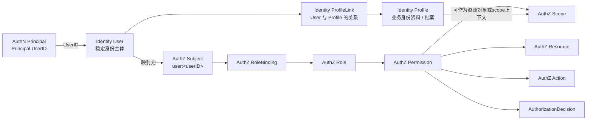

# 03-Identity 与 AuthZ 边界：Subject、Resource、Permission

## 1. 本文定位

本文是 `04-身份Identity/` 文档组中关于 **Identity 与 AuthZ 边界** 的文档。

前面几篇文档已经建立了 Identity 与 AuthN 的边界：

```text
Identity:
  User
    -> ProfileLink
    -> Profile

AuthN:
  认证身份 / 登录凭据 / ProviderIdentity
    -> Principal(UserID)
    -> Identity.User
```

本文继续解释 Identity 与 AuthZ 的协作边界，重点回答：

```text
Principal.UserID 如何指向 Identity.User？
Identity.User 如何映射为 AuthZ Subject？
Profile 是否是 AuthZ Resource？
ProfileLink 是否等于 Permission？
Identity 是否应该直接判断资源访问权？
AuthZ 如何使用 Identity 提供的身份事实？
Profile / ProfileLink 如何作为授权上下文参与 Check？
```

本文不重新展开 AuthZ 的完整模型。

AuthZ 完整模型见：

```text
../03-授权AuthZ/00-AuthZ模型总览-Subject-Role-Resource-Permission-RoleBinding.md
../03-授权AuthZ/01-授权资源与动作模型-ResourceKey-ResourcePattern-Action-Scope.md
../03-授权AuthZ/03-Check与Snapshot读链路.md
```

本文只聚焦 Identity 与 AuthZ 的边界。

---

## 2. 30 秒结论

Identity 与 AuthZ 的核心边界是：

```text
Identity 提供身份事实。
AuthZ 负责资源访问判定。
```

三组核心关系是：

| Identity / AuthN 概念 | AuthZ 概念 | 关系 |
| --- | --- | --- |
| Principal.UserID | User | AuthN 认证成功后通过 UserID 指向 Identity.User |
| User | Subject | User 可以被引用为 `user:<userID>` |
| Profile | Resource / Scope Context | Profile 可以作为资源对象或 scope 上下文 |
| ProfileLink | Authorization Context | ProfileLink 是身份关系，不是 Permission |

最重要的边界是：

```text
Principal != User
User != Subject 聚合本身
ProfileLink != Permission
Identity relationship != Authorization decision
```

一句话：

> Identity 负责回答“这个人是谁、关联了哪些档案、关系是什么”；AuthZ 负责回答“这个 Subject 能不能访问某个 Resource、执行某个 Action、作用于某个 Scope”。

---

## 3. 为什么要区分 Identity 与 AuthZ

如果不区分 Identity 与 AuthZ，很容易把身份关系直接当成访问权限。

例如看到：

```text
user:1001 是 profile:2001 的 guardian
```

就直接认为：

```text
user:1001 可以读取 profile:2001 的所有数据
```

这在简单系统中可能暂时可用，但在 IAM 中会带来问题：

```text
无法区分 read / update / delete / export 等动作
无法区分 Profile 本身、测评报告、问卷答卷等不同资源
无法表达 Role / Permission / RoleBinding
无法表达 Tenant 边界
无法进入 PolicyVersion / Outbox / RuntimeReload 版本传播链路
无法统一使用 Check / Snapshot
无法审计权限写入和撤销
```

因此必须拆开：

```text
Identity relationship：身份关系事实
AuthZ permission：资源访问事实
Authorization decision：一次访问判定结果
```

---

## 4. 核心关系图



这张图表达的是：

```text
AuthN 认证成功后生成 Principal。
Principal 通过 UserID 指向 Identity.User。
User 可以映射为 AuthZ Subject。
Subject 通过 RoleBinding 获得 Role。
Role 通过 Permission 获得 Resource / Action / Scope 能力。
Profile 可以作为被保护资源或 scope 上下文。
ProfileLink 可以为授权提供身份关系上下文，但不等于 Permission。
```

---

## 5. Principal、User 与 Subject 的边界

### 5.1 Principal 是 AuthN 的认证结果

`Principal` 是 AuthN 认证成功后的当前调用主体表达。

它回答：

```text
本次请求经过认证后，代表谁在调用系统？
```

Principal 通常携带：

```text
UserID
```

这个 UserID 指向 Identity.User。

也就是说：

```text
Principal.UserID -> Identity.User.ID
```

Principal 不是 User 聚合。

Principal 也不是 AuthZ Subject。

它是 AuthN 的认证结果。

---

### 5.2 User 是 Identity 的稳定身份主体

`User` 是 Identity 中的稳定身份主体。

它回答：

```text
IAM 内部这个人是谁？
```

User 可以被 AuthN Principal 通过 UserID 指向。

User 也可以被 AuthZ 映射为 Subject。

但 User 本身不直接表达：

```text
Role
Permission
Resource access
Casbin facts
```

这些属于 AuthZ。

---

### 5.3 Subject 是 AuthZ 的授权主体引用

`Subject` 是 AuthZ 中的授权主体引用。

对于 Identity.User，典型映射是：

```text
Identity.User.ID = 1001
AuthZ.Subject = user:1001
```

因此，完整链路是：

```text
AuthN Principal.UserID
  -> Identity.User.ID
  -> AuthZ Subject user:<userID>
```

这条链路要保持清晰。

不要把 Principal、User、Subject 混成一个对象。

---

## 6. User 与 Subject 的边界

### 6.1 User 是 Identity 模型

`User` 是 Identity 中的稳定身份主体。

它回答：

```text
IAM 内部这个人是谁？
```

User 负责身份事实：

```text
UserID
User status
User basic identity state
User 与 Profile 的关系入口
```

User 不直接表达：

```text
角色
权限
资源访问能力
Casbin facts
```

这些属于 AuthZ。

---

### 6.2 Subject 是 AuthZ 授权主体引用

`Subject` 是 AuthZ 中的授权主体引用。

它回答：

```text
谁在请求访问资源？
```

Identity.User 可以被映射成：

```text
user:<userID>
```

例如：

```text
Identity.User.ID = 1001
AuthZ.Subject = user:1001
```

注意：

```text
Subject 不是 User 聚合。
Subject 是授权系统中的主体引用。
```

AuthZ 不应该持有完整 User 对象。

它只需要稳定的 subject reference。

---

### 6.3 为什么 AuthZ 不直接依赖 User 聚合

如果 AuthZ 直接依赖完整 User 聚合，会出现：

```text
AuthZ 被 Identity 数据结构牵连
User 字段变化影响授权模块
授权判定需要加载完整用户资料
group / service subject 扩展困难
测试替身复杂
```

更好的方式是：

```text
Identity 负责维护 User。
AuthZ 只引用 subject.Ref = user:<userID>。
SubjectResolver 在必要时校验 User 是否存在或可授权。
```

这样 AuthZ 能保持通用性。

---

## 7. Profile 与 Resource / Scope 的边界

### 7.1 Profile 是 Identity 业务档案

`Profile` 是 Identity 中的业务身份资料或业务档案。

它可以表示：

```text
儿童档案
家长资料
医生资料
运营资料
被服务对象档案
业务侧扩展身份资料
```

Profile 是业务对象。

但它本身不是 AuthZ Permission。

---

### 7.2 Profile 可以作为 AuthZ Resource

如果业务需要控制 Profile 自身的访问，可以把 Profile 建模为 AuthZ Resource。

例如：

```text
Resource: iam:identity:profile:*
Action: read / update / delete
Scope: origin:<profileID>
```

一次 Check 可以是：

```text
Subject: user:1001
Tenant: tenant-a
Resource: iam:identity:profile:*
Action: read
Scope: origin:2001
```

含义是：

```text
user:1001 在 tenant-a 下，是否可以读取 profile:2001？
```

这时 Profile 是被保护资源对象。

---

### 7.3 Profile 也可以作为 Scope 上下文

Profile 不一定总是 Resource。

有时它更适合作为 scope 上下文。

例如 QS 中的测评报告资源：

```text
Resource: qs:evaluation:report:*
Action: read
Scope: origin:<profileID>
```

这里被访问的 Resource 是：

```text
qs:evaluation:report:*
```

ProfileID 只是对象归属范围：

```text
origin:<profileID>
```

也就是说：

```text
Profile 可以是资源本身，也可以是其他资源的 scope context。
```

具体如何建模，取决于业务资源语义。

---

### 7.4 不要把 ProfileID 拼进 ResourceKey

不推荐：

```text
iam:identity:profile:2001
qs:evaluation:report:profile:2001
```

更推荐：

```text
ResourcePattern: iam:identity:profile:*
Action: read
Scope: origin:2001
```

或者：

```text
ResourcePattern: qs:evaluation:report:*
Action: read
Scope: origin:2001
```

原因是：

```text
ResourceKey 表达资源类型或资源族。
Scope 表达对象范围。
```

这与 AuthZ 的四段 ResourceKey / Scope 设计保持一致。

---

## 8. ProfileLink 与 Permission 的边界

### 8.1 ProfileLink 是身份关系

ProfileLink 表达：

```text
User 与 Profile 的关系。
```

例如：

```text
user:1001 是 profile:2001 的 guardian
```

这是一条身份关系事实。

它属于 Identity。

---

### 8.2 Permission 是访问能力

Permission 表达：

```text
某个 Role 对某个 Resource / Action / Scope 的访问能力。
```

例如：

```text
Role: guardian
Resource: qs:evaluation:report:*
Action: read
Scope: origin:2001
```

或更通用地：

```text
RoleName
TenantID
ResourcePattern
ActionPattern
Scope
```

这是 AuthZ 访问事实。

---

### 8.3 两者不能合并

ProfileLink 和 Permission 回答的问题不同。

```text
ProfileLink：这个 User 和这个 Profile 有什么身份关系？
Permission：这个 Subject 是否有某种资源访问能力？
```

如果把 ProfileLink 当成 Permission，会导致：

```text
guardian 是否能 read？
guardian 是否能 update？
guardian 是否能 export？
guardian 是否能 delete？
operator 和 guardian 的动作差异在哪里？
profile 相关 report、assessment、questionnaire 权限如何区分？
```

这些问题无法靠 ProfileLink 本身回答。

必须交给 AuthZ。

---

## 9. ProfileLink 如何参与授权

### 9.1 作为授权上下文

ProfileLink 可以为授权提供上下文。

例如业务服务处理请求：

```text
GET /profiles/2001/reports
```

可以先知道：

```text
当前 Principal.UserID = 1001
目标 ProfileID = 2001
```

然后查询 Identity：

```text
user:1001 与 profile:2001 是否存在 active guardian link？
```

再构造 AuthZ Check：

```text
Subject: user:1001
Resource: qs:evaluation:report:*
Action: read
Scope: origin:2001
```

ProfileLink 提供的是：

```text
关系上下文
```

AuthZ Check 提供的是：

```text
访问判定
```

---

### 9.2 作为授权写入触发条件

某些业务中，创建 ProfileLink 后可能需要同步创建 AuthZ 授权。

例如：

```text
创建 guardian link
  -> 给 user 绑定 guardian role
  -> 或授予 profile 相关资源权限
```

这可以设计成显式流程：

```text
CreateProfileLink
  -> Domain/Application Policy
  -> AuthZ Grant / Bind command
  -> PolicyChange
  -> PolicyChangeCommitter
```

注意：

```text
ProfileLink repository 不应该直接写 AuthZ facts。
```

如果需要影响权限，必须通过 AuthZ 写入链路。

---

### 9.3 作为授权撤销触发条件

撤销 ProfileLink 也可能需要同步撤销某些权限。

例如：

```text
撤销 guardian link
  -> 撤销 user 对 profile 相关资源的访问能力
```

同样不能直接删除 AuthZ facts。

正确流程是：

```text
RevokeProfileLink
  -> Domain/Application Policy
  -> AuthZ Revoke / Unbind command
  -> PolicyChange
  -> PolicyChangeCommitter
```

这样才能保证：

```text
PolicyVersion 递增
Outbox event stage
RuntimeReload
审计链路完整
```

---

## 10. Identity 与 AuthZ 协作方式

### 10.1 AuthZ 校验 Subject 存在性

当 AuthZ 写入 RoleBinding 时，需要确认：

```text
subject 是否存在？
subject 是否可被授权？
```

对于 `user:<userID>`，这通常需要访问 Identity.User。

但 AuthZ 不应该直接依赖 User 聚合细节。

更好的方式是：

```text
SubjectResolver
  -> UserSubjectResolver
  -> Identity user reader
```

这样 AuthZ 只关心：

```text
这个 subject ref 是否可解析？
```

而不是关心 User 的所有字段。

---

### 10.2 业务服务组合 Identity 与 AuthZ

很多场景下，业务服务需要同时使用 Identity 和 AuthZ。

例如：

```text
读取某个儿童 Profile 的测评报告
```

流程可能是：

```text
1. AuthN 得到 Principal.UserID
2. Identity 查询 User 与 Profile 的关系
3. 业务服务确定目标资源和 scope
4. AuthZ Check 判定是否允许访问
5. 业务服务读取报告
```

这是一种常见组合方式。

不要强行让 Identity 或 AuthZ 单独完成所有逻辑。

---

### 10.3 AuthZ Snapshot 与 Identity

AuthZ Snapshot 返回：

```text
Subject 当前拥有的 roles / permissions
```

它不应该返回完整 Profile 列表。

Profile 列表属于 Identity。

如果前端需要初始化当前用户上下文，可以分别调用：

```text
Identity: ListProfilesByUser
AuthZ: GetAuthorizationSnapshot
```

然后由前端或 BFF 组合展示。

---

## 11. 典型场景示例

### 11.1 家长读取儿童报告

AuthN 事实：

```text
Principal.UserID = 1001
```

Identity 事实：

```text
User: user:1001
Profile: profile:2001
ProfileLink: user:1001 guardian profile:2001 active
```

AuthZ 判定请求：

```text
Subject: user:1001
Tenant: tenant-a
Resource: qs:evaluation:report:*
Action: read
Scope: origin:2001
```

判定结果：

```text
AuthorizationDecision.allowed = true / false
```

说明：

```text
ProfileLink 说明 user 与 profile 的关系。
AuthZ Check 决定是否允许读取 report。
```

---

### 11.2 运营人员编辑 Profile

AuthN 事实：

```text
Principal.UserID = 3001
```

Identity 事实：

```text
User: user:3001
Profile: profile:2001
ProfileLink: user:3001 operator profile:2001 active
```

AuthZ 判定请求：

```text
Subject: user:3001
Tenant: tenant-a
Resource: iam:identity:profile:*
Action: update
Scope: origin:2001
```

说明：

```text
operator 关系可以作为业务上下文。
但是否能 update Profile，需要 AuthZ Permission 支持。
```

---

### 11.3 管理员查看所有 Profile

AuthN 事实：

```text
Principal.UserID = 9001
```

Identity 事实：

```text
User: user:9001
```

AuthZ 判定请求：

```text
Subject: user:9001
Tenant: tenant-a
Resource: iam:identity:profile:*
Action: read_all
Scope: all:*
```

说明：

```text
管理员可能不需要与每个 Profile 建立 ProfileLink。
它通过 Role / Permission 获得 all:* 范围访问能力。
```

这正说明：

```text
ProfileLink 不是所有访问的唯一来源。
AuthZ Permission 才是统一访问判定机制。
```

---

### 11.4 用户查看自己关联的 Profile 列表

这个场景更偏 Identity 查询：

```text
Principal.UserID = 1001
ListProfilesByUser(userID=1001)
```

它可能不需要 AuthZ Check。

但如果这是一个后台管理接口，用于查询任意用户的 Profile 列表，则需要 AuthZ：

```text
Subject: user:admin
Resource: iam:identity:profile_link:*
Action: read
Scope: all:*
```

是否需要 Check 取决于：

```text
查询的是自己的关系，还是管理别人关系。
接口是否是安全敏感管理接口。
```

---

## 12. 建模建议

### 12.1 Resource 命名建议

Identity 相关资源可以按 AuthZ 四段结构建模。

例如：

```text
iam:identity:user:*
iam:identity:profile:*
iam:identity:profile_link:*
```

对应动作可以是：

```text
read
read_all
create
update
delete
link
unlink
```

具体 actions 以 ResourceCatalog 为准。

---

### 12.2 Scope 建议

Profile 相关资源常见 scope：

```text
all:*
origin:<profileID>
```

User 相关资源可能使用：

```text
origin:<userID>
```

ProfileLink 相关资源也可以根据场景使用：

```text
origin:<profileID>
origin:<userID>
```

但要注意：

```text
scope 的含义必须在资源文档中明确。
```

不要让同一个 `origin` 在不同资源下含义过度混乱。

---

### 12.3 Role 建议

Identity 相关角色可以包括：

```text
iam:identity_admin
iam:profile_operator
iam:profile_viewer
```

如果是业务域角色，也可以放在业务 app namespace 下：

```text
qs:guardian
qs:evaluator
qs:operator
```

RoleName 应保持稳定，不要随展示名称变化。

---

## 13. 一致性边界

### 13.1 ProfileLink 变化不应隐式改权限

ProfileLink 变化是否影响 AuthZ 权限，必须由显式业务流程决定。

不要在 repository 层做：

```text
保存 ProfileLink 时顺手写 casbin_rule
删除 ProfileLink 时顺手删 casbin_rule
```

这种方式会绕过 AuthZ 的：

```text
PolicyChangeCommitter
PolicyVersion
Outbox
RuntimeReload
审计
```

---

### 13.2 权限变化不应隐式修改 Identity 关系

反过来也一样。

授予某个 Role 或 Permission，不应该自动创建 ProfileLink。

例如：

```text
给 user:1001 授予 profile read 权限
```

不等于：

```text
user:1001 是 profile:2001 的 guardian
```

权限是访问能力。

ProfileLink 是身份关系。

两者可以由业务流程协同创建，但不能互相偷偷推导。

---

## 14. 常见误区

### 14.1 Principal = User = Subject

错误。

Principal 是 AuthN 认证结果。

User 是 Identity 稳定身份主体。

Subject 是 AuthZ 授权主体引用。

三者通过 UserID 串联，但不是同一个对象。

---

### 14.2 User 就是 AuthZ Subject 聚合

不准确。

User 是 Identity 模型。

Subject 是 AuthZ 主体引用。

AuthZ 中只需要 `user:<userID>`，不需要完整 User 聚合。

---

### 14.3 ProfileLink 就是 Permission

错误。

ProfileLink 是身份关系。

Permission 是访问能力。

---

### 14.4 有 guardian 关系就一定能访问所有报告

错误。

guardian 关系可以作为上下文，但最终访问仍应由 AuthZ Check 判定。

---

### 14.5 管理员必须和所有 Profile 建立 ProfileLink

错误。

管理员可以通过 `all:*` 范围 Permission 获得访问能力。

不需要与每个 Profile 建立关系。

---

### 14.6 ProfileID 应该直接拼进 ResourceKey

不推荐。

ResourceKey 表达资源类型或资源族。

ProfileID 更适合作为 Scope 中的对象范围。

---

### 14.7 AuthZ 可以直接操作 Identity 表

不推荐。

AuthZ 可以通过 SubjectResolver 或 Identity reader 校验 subject。

但不应该直接修改 Identity 数据。

---

### 14.8 Identity repository 可以直接改 AuthZ facts

错误。

AuthZ facts 必须通过 PolicyChangeCommitter 修改。

---

## 15. 代码事实源

本文涉及的主要代码事实源：

```text
internal/apiserver/domain/authn
internal/apiserver/application/authn
internal/apiserver/domain/identity
internal/apiserver/application/identity
internal/apiserver/domain/authz
internal/apiserver/application/authz
```

如果模块已拆分子包，可重点关注：

```text
internal/apiserver/domain/authn/principal
internal/apiserver/application/authn/login
internal/apiserver/domain/identity/user
internal/apiserver/domain/identity/profile
internal/apiserver/domain/identity/profilelink
internal/apiserver/application/identity/profilelink

internal/apiserver/domain/authz/subject
internal/apiserver/domain/authz/resource
internal/apiserver/domain/authz/scope
internal/apiserver/domain/authz/permission
internal/apiserver/application/authz/authorization
internal/apiserver/application/authz/policy
```

重点关注：

| 主题 | 事实源 |
| --- | --- |
| Principal.UserID | `domain/authn/principal` 或 `domain/authn` |
| User 模型 | `domain/identity/user` 或 `domain/identity` |
| Profile 模型 | `domain/identity/profile` 或 `domain/identity` |
| ProfileLink 模型 | `domain/identity/profilelink` 或 `domain/identity` |
| User -> Subject | `domain/authz/subject` |
| Identity ResourceKey | `domain/authz/resource`、ResourceCatalog 初始化 |
| Scope | `domain/authz/scope` |
| Check 链路 | `application/authz/authorization` |
| Permission 写入 | `application/authz/policy` |
| SubjectResolver | `domain/authz/rolebinding` 或相关 resolver 实现 |
| REST Identity 接口 | `transport/rest/identity` |
| REST AuthZ 接口 | `transport/rest/authz` |
| gRPC Identity 接口 | `transport/grpc/service/identity` |
| gRPC AuthZ 接口 | `transport/grpc/service/authz` |

如果本文与代码不一致，以代码事实源为准，并同步修正文档。

---

## 16. 本文总结

Identity 与 AuthZ 的边界可以压缩成三句话：

```text
Identity 提供身份事实。
AuthZ 提供资源访问判定。
ProfileLink 是身份关系，不是 Permission。
```

核心关系是：

```text
AuthN Principal.UserID
  -> Identity.User.ID
  -> AuthZ.Subject(user:<userID>)
  -> RoleBinding
  -> Role
  -> Permission
  -> Resource / Action / Scope
  -> AuthorizationDecision
```

Profile 可以作为：

```text
被保护 Resource
或其他 Resource 的 Scope 上下文
```

ProfileLink 可以作为：

```text
授权判断的上下文
或授权写入的显式触发条件
```

但不能直接替代 AuthZ Permission。

如果只记住一句话：

> Principal 通过 UserID 指向 Identity.User，User 再映射为 AuthZ Subject；Profile 可以作为 Resource 或 Scope 上下文，ProfileLink 可以提供身份关系上下文，但资源访问权必须通过 AuthZ 的 Subject / RoleBinding / Role / Permission / Resource / Action / Scope 链路判定。
