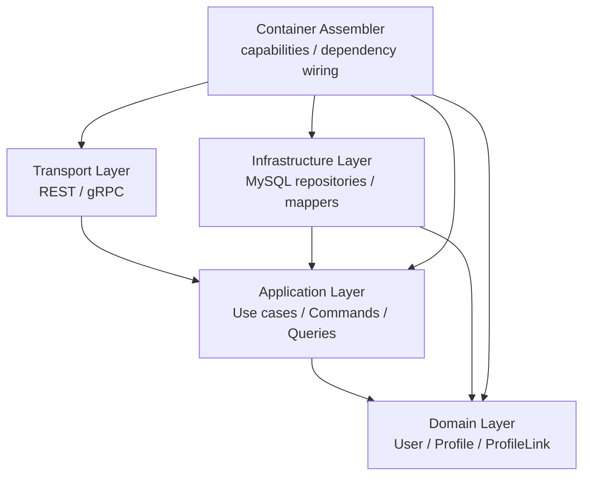

# 04-Identity 分层架构与事实源索引

## 1. 本文定位

本文是 `04-身份Identity/` 文档组的收束篇。

前面几篇文档已经解释了 Identity 的核心模型与跨模块边界：

```text
00-Identity模型总览：User -> ProfileLink -> Profile
01-ProfileLink链路：User 与 Profile 关系协作
02-Identity与AuthN边界：认证身份 / Principal / User
03-Identity与AuthZ边界：Subject / Resource / Permission
```

本文负责从架构层面收束 Identity 模块，回答：

```text
Identity 模块整体分几层？
每一层分别负责什么？
User / Profile / ProfileLink 的事实源在哪里？
REST / gRPC 与 Identity application 如何协作？
Identity 如何被 AuthN / AuthZ 使用？
Identity 修改时应该检查哪些代码和文档？
哪些架构边界不能突破？
```

本文不是接口教程，也不是字段说明文档。

它是：

```text
架构地图
事实源索引
维护规则
防漂移检查清单
```

---

## 2. 30 秒结论

Identity 当前应按分层架构理解：

```text
transport
  -> application
  -> domain
  -> infra
  -> container assembler
```

各层职责是：

| 层次 | 职责 |
| --- | --- |
| Domain | 表达 User / Profile / ProfileLink 领域模型与不变量 |
| Application | 编排 Identity 用例，构造 command/query，协调仓储与事务 |
| Infra | 实现 MySQL repository、mapper、transaction 等技术细节 |
| Transport | REST / gRPC 协议适配，只做 DTO/proto 与 application 的转换 |
| Container | 组合根，负责装配 Identity 能力并暴露给其他模块 |

核心依赖方向是：

```text
transport -> application -> domain
infra -> application/domain ports
container -> all concrete implementations
```

禁止方向是：

```text
domain -> infra
domain -> transport
application -> transport
transport -> infra/mysql repository
AuthN 直接写 Identity 表
AuthN 将认证身份 / 登录凭据建模塞进 Identity
AuthZ 直接写 Identity 表
Identity repository 直接写 AuthZ facts
```

一句话：

> Identity 的核心边界是：领域模型在 domain，用例编排在 application，存储实现和技术适配在 infra，协议转换在 transport，依赖装配在 container；AuthN 可以通过 Principal.UserID 指向 Identity.User，AuthZ 可以通过 user:< userID > 引用 Identity.User，但二者都不能绕过 Identity application 直接改 Identity 事实。

---

## 3. Identity 分层总览

Identity 模块分层可以画成：



图中的 `Container -> *` 表示组合根负责构造依赖。

实际业务调用方向应该是：

```text
Transport -> Application -> Domain
```

Infra 通过实现 application/domain 所需端口被注入。

Domain 不主动依赖 infra。

---

## 4. Domain 层

### 4.1 Domain 层职责

Identity domain 层负责表达身份领域语言。

它回答：

```text
什么是 User？
什么是 Profile？
什么是 ProfileLink？
这些模型有哪些不变量？
User 与 Profile 如何通过 ProfileLink 建立关系？
关系类型和关系状态如何约束？
```

Domain 层不关心：

```text
HTTP request
protobuf message
数据库表结构
GORM model
MySQL transaction
AuthN login handler
AuthZ casbin facts
```

Domain 层应该只讲：

```text
User
Profile
ProfileLink
RelationType
Status
Identity domain errors
```

---

### 4.2 Domain 模型主线

Identity 的领域模型主线是：

```text
User
  -> ProfileLink
  -> Profile
```

其中：

```text
User 是 IAM 内部稳定身份主体。
Profile 是业务身份资料或业务档案。
ProfileLink 是 User 与 Profile 的关系。
```

这条主线必须保持稳定。

不要把它改成：

```text
认证身份 / 登录凭据 / ProviderIdentity -> User -> Profile
```

因为认证身份识别、登录凭据校验和 ProviderIdentity 解析属于 AuthN。

也不要改成：

```text
User -> Permission -> Profile
```

因为 Permission 属于 AuthZ。

---

### 4.3 Domain 子包建议

如果当前 Identity 已经拆分子包，建议保持类似结构：

```text
internal/apiserver/domain/identity/
├── user
├── profile
├── profilelink
└── model.go              # compatibility facade，可选
```

其中：

| 子包 | 职责 |
| --- | --- |
| `user` | User、UserID、UserStatus、User 不变量 |
| `profile` | Profile、ProfileID、ProfileStatus、Profile 类型或资料模型 |
| `profilelink` | ProfileLink、RelationType、LinkStatus、关系不变量 |
| `model.go` | 兼容旧代码的 facade，后续应减少依赖 |

如果当前代码还没有拆分到这个粒度，也可以先在文档中保持这个语义边界，后续再逐步重构代码结构。

---

### 4.4 Domain 层事实源

Identity 领域事实源主要是：

```text
internal/apiserver/domain/identity
```

如果已拆分子包，则重点关注：

```text
internal/apiserver/domain/identity/user
internal/apiserver/domain/identity/profile
internal/apiserver/domain/identity/profilelink
```

常见查询入口：

| 想确认什么 | 看哪里 |
| --- | --- |
| User 如何建模 | `domain/identity/user` 或 `domain/identity` |
| User 状态有哪些 | `domain/identity/user` 或 `domain/identity` |
| Profile 如何建模 | `domain/identity/profile` 或 `domain/identity` |
| Profile 状态有哪些 | `domain/identity/profile` 或 `domain/identity` |
| ProfileLink 如何建模 | `domain/identity/profilelink` 或 `domain/identity` |
| RelationType 有哪些 | `domain/identity/profilelink` 或 `domain/identity` |
| LinkStatus 有哪些 | `domain/identity/profilelink` 或 `domain/identity` |
| 领域错误如何定义 | `domain/identity` |

---

### 4.5 Domain 层禁止事项

Domain 层禁止出现：

```text
GORM
MySQL concrete client
Gin context
protobuf generated request/response
HTTP status code
Casbin Enforcer
casbin_rule
AuthN provider identity / credential repository
AuthZ PolicyChangeCommitter concrete implementation
```

Domain 可以定义领域对象和领域服务。

但不能依赖基础设施实现。

如果你发现 `domain/identity` 中出现：

```text
*gorm.DB
http.Request
gin.Context
casbin.Enforcer
```

那就是架构污染。

---

## 5. Application 层

### 5.1 Application 层职责

Identity application 层负责编排身份用例。

它回答：

```text
如何创建 User？
如何读取 User？
如何创建 Profile？
如何更新 Profile？
如何创建 ProfileLink？
如何撤销 ProfileLink？
如何按 User 查询 Profiles？
如何按 Profile 查询 Users？
AuthN 在身份开通或 Principal.UserID 归一时应该调用什么 Identity 能力？
```

Application 层不应该关心：

```text
HTTP body 怎么绑定
proto 字段叫什么
GORM 怎么保存
SQL 表如何 join
Casbin facts 如何写入
```

它应该关心：

```text
Command / Query
Use Case Service
Repository ports
Transaction boundary
Domain object construction
Cross-module capabilities
```

---

### 5.2 Application 能力建议

Identity application 可以按用例组织为：

```text
internal/apiserver/application/identity/
├── user
├── profile
├── profilelink
└── service / ports / commands
```

或在一个包中按文件拆分。

关键不是目录形式，而是职责边界清楚。

典型能力包括：

```text
CreateUser
GetUser
ListUsers
DisableUser
EnableUser

CreateProfile
GetProfile
UpdateProfile
ArchiveProfile

CreateProfileLink
RevokeProfileLink
ListProfilesByUser
ListUsersByProfile
GetProfileLink
```

---

### 5.3 Command / Query 边界

Transport 层传入的是协议数据。

Application 层应该通过 command / query 接收语义化请求。

例如：

```text
CreateUserCommand
CreateProfileCommand
CreateProfileLinkCommand
RevokeProfileLinkCommand
ListProfilesByUserQuery
ListUsersByProfileQuery
```

Command / Query constructor 应该完成基本校验：

```text
UserID 非空
ProfileID 非空
RelationType 合法
Status 合法
Actor 合法
Reason 规范化
```

不要让 handler 直接拼 domain 对象。

也不要让 infra repository 处理应用层输入校验。

---

### 5.4 Application 层端口

Application 层可以定义端口，例如：

```text
UserRepository
ProfileRepository
ProfileLinkRepository
IdentityUnitOfWork
```

也可以为跨模块协作定义窄接口：

```text
UserReader
UserStatusReader
ProfileLinkReader
```

这些端口由 infra 实现。

AuthN / AuthZ 如果需要 Identity 能力，也应该依赖更窄的 capability，而不是直接依赖完整 service 或 repository。

---

### 5.5 Application 层禁止事项

Application 层不应该：

```text
依赖 transport/rest 或 transport/grpc
直接使用 gin.Context
直接操作 GORM model
直接调用 casbin Enforce
直接写 AuthZ casbin_rule
直接处理 AuthN 密码校验或 token 签发
```

Application 应该通过端口和 capabilities 与其他模块协作。

---

## 6. Infra 层

### 6.1 Infra 层职责

Identity infra 层负责技术实现。

它回答：

```text
User 如何存储到 MySQL？
Profile 如何存储到 MySQL？
ProfileLink 如何存储到 MySQL？
领域对象如何映射为数据库模型？
事务如何组织？
唯一约束如何落地？
```

Infra 层可以依赖具体技术：

```text
GORM
MySQL
migration
transaction
```

但这些技术细节不应该泄漏到 domain/application。

---

### 6.2 Infra 子包建议

Identity infra 可以组织为：

```text
internal/apiserver/infra/mysql/identity/
├── user
├── profile
├── profilelink
└── mapper / model / repository
```

或者在一个 identity 包中按文件拆分：

```text
user_model.go
user_repository.go
profile_model.go
profile_repository.go
profilelink_model.go
profilelink_repository.go
mapper.go
```

关键要求是：

```text
数据库模型与领域模型不要混用。
Repository 负责转换。
```

---

### 6.3 Repository 事实源

Identity 存储事实源主要是：

```text
internal/apiserver/infra/mysql/identity
```

如果已拆分子包，则重点关注：

```text
internal/apiserver/infra/mysql/identity/user
internal/apiserver/infra/mysql/identity/profile
internal/apiserver/infra/mysql/identity/profilelink
```

常见 repository：

```text
UserRepository
ProfileRepository
ProfileLinkRepository
```

它们应该实现 application 层定义的端口。

---

### 6.4 数据约束建议

User 应该有稳定 ID 和状态约束。

Profile 应该有稳定 ID 和状态约束。

ProfileLink 应考虑唯一性约束。

常见唯一性策略：

```text
UserID + ProfileID + RelationType
```

如果保留历史多条关系，则可以考虑：

```text
同一 UserID + ProfileID + RelationType 下 active 关系唯一
历史 revoked / expired 关系可保留多条
```

具体以当前业务设计和数据库能力为准。

---

### 6.5 Infra 层禁止事项

Infra 层可以做持久化，但不能主导业务规则。

例如：

```text
repository 可以保存 ProfileLink
但不能决定创建 link 后是否自动授予 AuthZ Permission
```

```text
repository 可以查询 User
但不能决定 User 是否能登录
```

```text
repository 可以保存 Profile
但不能绕过 domain 构造函数写入非法 Profile
```

Infra 是技术实现，不是业务流程入口。

---

## 7. Transport 层

### 7.1 Transport 层职责

Transport 层负责 REST / gRPC 协议适配。

它回答：

```text
HTTP request 如何转换成 application command/query？
gRPC request 如何转换成 application command/query？
application result 如何转换成 response？
```

Transport 层可以处理：

```text
JSON binding
path params
query params
protobuf message
HTTP status code
error mapping
```

但它不应该处理 Identity 领域规则。

---

### 7.2 REST 事实源

REST Identity 事实源：

```text
internal/apiserver/transport/rest/identity
```

REST handler 应该做：

```text
绑定请求参数
构造 application command/query
调用 application service
转换 response
```

REST handler 不应该：

```text
直接访问 infra/mysql repository
直接创建 GORM model
直接写 ProfileLink 表
直接调用 AuthZ PolicyChangeCommitter
直接处理 AuthN 登录凭证
```

---

### 7.3 gRPC 事实源

gRPC Identity 事实源：

```text
internal/apiserver/transport/grpc/service/identity
```

gRPC service 应该做：

```text
proto request -> application command/query
application result -> proto response
```

不要把 proto message 传入 domain 层。

proto 是接入层契约，不是领域模型。

---

### 7.4 Transport 层禁止事项

Transport 层禁止：

```text
直接 import infra/mysql/identity
直接 import infra/casbin
直接操作数据库事务
直接构造 AuthZ PolicyChange
直接写 AuthN 认证身份 / 登录凭据
绕过 application command/query constructor
```

Transport 的核心原则是：

```text
只适配协议，不解释身份业务。
```

---

## 8. Container / Assembler 层

### 8.1 Container 层职责

Container assembler 是组合根。

它负责：

```text
构造 Identity infra repositories
构造 Identity application services
构造 Identity capabilities
把 capabilities 暴露给 AuthN / AuthZ / Transport
```

Container 可以依赖所有具体实现。

这是组合根的职责。

但业务规则不应该写在 assembler 中。

---

### 8.2 Identity capabilities

Assembler 最终应该暴露 Identity capabilities。

它可以理解为：

```text
Identity 模块对其他模块可用的能力集合
```

典型能力包括：

```text
UserService
ProfileService
ProfileLinkService
UserReader
ProfileReader
ProfileLinkReader
```

对 AuthN 来说，可能只需要：

```text
CreateUser
GetUser
GetUserStatus
EnsureUserForPrincipal
CreateInitialProfile
CreateInitialProfileLink
```

对 AuthZ 来说，可能只需要：

```text
ResolveUserSubject
GetUserStatus
```

因此 capabilities 应该尽量窄。

不要把整个 Identity application service 无差别暴露给所有模块。

---

### 8.3 Assembler 禁止事项

Assembler 不应该写业务规则。

例如不应该在 assembler 中判断：

```text
某个 RelationType 是否允许创建
某个 ProfileLink 是否应该自动授权
某个 User 是否可以登录
```

这些规则属于：

```text
Domain / Application / AuthN / AuthZ 对应模块
```

Assembler 只负责：

```text
把正确实现注入正确位置。
```

---

## 9. 与 AuthN 的依赖边界

### 9.1 AuthN 可以使用 Identity 能力

AuthN 在身份开通、登录、认证入口归一和认证入口绑定中可能需要 Identity。

典型需求：

```text
创建 User
查询 User 状态
将认证结果归一到 UserID
初始化 Profile
初始化 ProfileLink
```

正确依赖方式是：

```text
AuthN application
  -> Identity capability / port
  -> Identity application service
```

错误方式是：

```text
AuthN application
  -> infra/mysql/identity repository
  -> users / profiles / profile_links table
```

AuthN 不应该绕过 Identity application。

---

### 9.2 认证身份与登录凭据仍然属于 AuthN

认证身份识别、登录凭据校验、ProviderIdentity 解析仍然属于 AuthN。

这些能力应留在 AuthN：

```text
internal/apiserver/domain/authn
internal/apiserver/application/authn
```

不要为了方便，把认证身份、登录凭据、provider identity 塞进 Identity。

否则 Identity 会被 provider、credential、token、session 等概念污染。

---

### 9.3 User 创建不等于登录成功

Identity 创建 User，只表示：

```text
系统中有了一个稳定身份主体。
```

登录成功还需要 AuthN 完成：

```text
认证入口识别
登录凭据校验
Principal(UserID) 构造
Token / Session 签发
```

因此不要在 Identity 中处理登录成功语义。

---

## 10. 与 AuthZ 的依赖边界

### 10.1 AuthZ 可以解析 User Subject

AuthZ 可能需要校验：

```text
user:<userID> 是否存在？
这个 User 是否可被授权？
```

正确方式是：

```text
AuthZ SubjectResolver
  -> Identity UserReader capability
```

AuthZ 不应该直接读取完整 User 聚合，也不应该直接修改 User。

---

### 10.2 Identity 不应该直接写 AuthZ facts

Identity 创建或撤销 ProfileLink 时，不应该直接：

```text
insert casbin_rule
delete casbin_rule
AddPolicy
RemovePolicy
```

如果 ProfileLink 变化需要影响权限，必须通过显式流程进入 AuthZ：

```text
Identity application / domain event
  -> AuthZ command
  -> PolicyChange
  -> PolicyChangeCommitter
```

这样才能保证：

```text
PolicyVersion
Outbox
RuntimeReload
审计
```

---

### 10.3 ProfileLink 不等于 Permission

这是 Identity 与 AuthZ 的核心边界。

ProfileLink 表达：

```text
User 与 Profile 的身份关系。
```

Permission 表达：

```text
Subject 对 Resource / Action / Scope 的访问能力。
```

两者可以协作，但不能互相替代。

---

## 11. 关键链路与事实源

### 11.1 创建 User 链路

典型链路：

```text
REST / gRPC / AuthN caller
  -> CreateUserCommand
  -> UserService.Create
  -> User domain model
  -> UserRepository.Save
```

事实源：

```text
domain/identity/user
application/identity/user
infra/mysql/identity/user
transport/rest/identity
transport/grpc/service/identity
```

---

### 11.2 创建 Profile 链路

典型链路：

```text
REST / gRPC / Application caller
  -> CreateProfileCommand
  -> ProfileService.Create
  -> Profile domain model
  -> ProfileRepository.Save
```

事实源：

```text
domain/identity/profile
application/identity/profile
infra/mysql/identity/profile
transport/rest/identity
transport/grpc/service/identity
```

---

### 11.3 创建 ProfileLink 链路

典型链路：

```text
REST / gRPC / Application caller
  -> CreateProfileLinkCommand
  -> ProfileLinkService.Create
  -> Load User
  -> Load Profile
  -> ProfileLink domain model
  -> ProfileLinkRepository.Save
```

事实源：

```text
domain/identity/profilelink
application/identity/profilelink
infra/mysql/identity/profilelink
transport/rest/identity
transport/grpc/service/identity
```

---

### 11.4 查询 User 关联 Profiles 链路

典型链路：

```text
REST / gRPC / Application caller
  -> ListProfilesByUserQuery
  -> ProfileLinkService.ListProfilesByUser
  -> ProfileLinkRepository.ListByUser
  -> ProfileRepository.BatchGet
```

事实源：

```text
application/identity/profilelink
infra/mysql/identity/profilelink
infra/mysql/identity/profile
transport/rest/identity
transport/grpc/service/identity
```

---

### 11.5 AuthN Onboarding 使用 Identity 链路

典型链路：

```text
AuthN Onboarding
  -> Verify provider identity / credential
  -> Identity CreateUser / EnsureUser
  -> Identity optional CreateProfile
  -> Identity optional CreateProfileLink
  -> AuthN BuildPrincipal(UserID)
```

事实源：

```text
application/authn/onboarding
application/identity/user
application/identity/profile
application/identity/profilelink
container/assembler capabilities
```

---

### 11.6 AuthZ SubjectResolver 使用 Identity 链路

典型链路：

```text
AuthZ BindRole
  -> SubjectResolver(user:<userID>)
  -> Identity UserReader
  -> User exists / status result
```

事实源：

```text
domain/authz/subject
application/authz/rolebinding
application/identity/user
container/assembler capabilities
```

---

## 12. 数据事实源索引

### 12.1 User 数据

User 数据用于：

```text
稳定身份主体
Principal.UserID 指向
AuthN 认证结果归一
AuthZ Subject user:<userID> 解析
ProfileLink.UserID 关联
```

事实源：

```text
domain/identity/user
application/identity/user
infra/mysql/identity/user
```

---

### 12.2 Profile 数据

Profile 数据用于：

```text
业务身份资料
被服务对象档案
ProfileLink.ProfileID 关联
AuthZ scope context
业务模块引用
```

事实源：

```text
domain/identity/profile
application/identity/profile
infra/mysql/identity/profile
```

---

### 12.3 ProfileLink 数据

ProfileLink 数据用于：

```text
User 与 Profile 的关系
按 User 查 Profiles
按 Profile 查 Users
关系状态管理
关系审计
AuthZ 授权上下文
```

事实源：

```text
domain/identity/profilelink
application/identity/profilelink
infra/mysql/identity/profilelink
```

---

### 12.4 Identity capabilities

Identity capabilities 用于：

```text
AuthN 创建或读取 User
AuthN 将认证结果归一到 Principal.UserID
AuthN 初始化 Profile / ProfileLink
AuthZ 解析 user subject
Transport 调用 Identity application services
```

事实源：

```text
container/assembler
application/identity
```

---

## 13. 架构护栏

### 13.1 为什么需要架构护栏

Identity 是 AuthN 和 AuthZ 的中间身份事实层。

一旦边界漂移，很容易出现：

```text
AuthN 直接写 User 表
AuthN 把认证身份 / 登录凭据塞进 Identity
AuthZ 直接改 ProfileLink
Identity repository 顺手写 casbin_rule
User 模型保存 password/openid/OAuth subject
ProfileLink 被当成 Permission
Transport 直接操作 repository
```

这些问题短期能跑，但长期会破坏模块边界。

---

### 13.2 应保护的规则

建议持续保护这些规则：

```text
domain/identity 不依赖 infra/mysql
domain/identity 不依赖 transport
domain/identity 不依赖 authn concrete implementation
domain/identity 不依赖 authz concrete implementation
application/identity 不依赖 transport
transport/identity 不直接依赖 infra/mysql/identity
AuthN 不直接依赖 infra/mysql/identity
AuthZ 不直接依赖 infra/mysql/identity
Identity 不保存 AuthN provider identity / credential
Identity 不直接依赖 infra/casbin
Identity repository 不写 casbin_rule
```

这些规则可以通过架构测试逐步固化。

---

### 13.3 跨模块依赖规则

允许：

```text
AuthN application -> Identity capability
AuthN Principal.UserID -> Identity.User.ID
AuthZ SubjectResolver -> Identity UserReader capability
Transport identity -> Identity application service
Container assembler -> all concrete implementations
```

不允许：

```text
AuthN -> infra/mysql/identity
AuthN provider identity / credential -> Identity domain model
AuthZ -> infra/mysql/identity
Identity -> infra/casbin
Identity -> AuthZ concrete repository
Identity repository -> AuthZ PolicyChangeCommitter
```

如果需要跨模块动作，应通过：

```text
application capability
或 domain/application event
或显式 use case orchestration
```

而不是直接互相改表。

---

## 14. 修改 Identity 时的检查清单

### 14.1 修改 User 模型时

检查：

```text
是否影响 AuthN Principal.UserID？
是否影响认证结果归一到 UserID 的流程？
是否影响 AuthZ Subject user:<userID>？
是否影响 ProfileLink.UserID？
是否需要 migration？
是否需要更新 00 / 02 / 03 文档？
```

---

### 14.2 修改 Profile 模型时

检查：

```text
是否影响 ProfileLink.ProfileID？
是否影响业务模块对 Profile 的引用？
是否影响 AuthZ Resource / Scope 建模？
是否需要 migration？
是否需要更新 00 / 01 / 03 文档？
```

---

### 14.3 修改 ProfileLink 模型时

检查：

```text
RelationType 是否变化？
Status 是否变化？
唯一约束是否变化？
是否影响 ListProfilesByUser？
是否影响 ListUsersByProfile？
是否影响 AuthZ 授权上下文？
是否需要同步设计 AuthZ 写入流程？
```

---

### 14.4 修改 AuthN onboarding 时

检查：

```text
是否仍通过 Identity capability 创建或确认 User？
是否直接写了 Identity 表？
User 创建失败 / Principal 构造失败如何处理？
认证入口归一到 UserID 失败如何处理？
是否需要初始化 Profile / ProfileLink？
是否更新 02 文档？
```

---

### 14.5 修改 AuthZ subject resolver 时

检查：

```text
是否仍通过 Identity UserReader 校验 user subject？
是否直接依赖完整 User 聚合？
是否支持未来 group / service subject 扩展？
是否更新 03 文档？
```

---

### 14.6 修改 REST / gRPC 接口时

检查：

```text
是否仍通过 application command/query？
是否绕过 application service？
DTO/proto 与 domain 是否隔离？
OpenAPI / proto / SDK 是否同步？
README 是否需要更新？
```

---

## 15. 测试建议

### 15.1 Domain 单测

应覆盖：

```text
User 构造与状态不变量
Profile 构造与状态不变量
ProfileLink 构造
RelationType 校验
LinkStatus 校验
非法 UserID / ProfileID 拒绝
重复关系规则
```

---

### 15.2 Application 单测

应覆盖：

```text
CreateUserCommand
CreateProfileCommand
CreateProfileLinkCommand
RevokeProfileLinkCommand
ListProfilesByUserQuery
ListUsersByProfileQuery
UserService
ProfileService
ProfileLinkService
```

重点测试：

```text
User 不存在时不能创建 ProfileLink
Profile 不存在时不能创建 ProfileLink
重复 ProfileLink 的处理策略
撤销不存在 Link 的处理策略
状态流转是否合法
```

---

### 15.3 Infra 集成测试

应覆盖：

```text
User repository save/get/list
Profile repository save/get/list
ProfileLink repository create/list/revoke
唯一约束
软删除 / 状态变更
mapper domain <-> db model
transaction rollback
```

---

### 15.4 架构测试

应覆盖：

```text
domain/identity 不依赖 infra/mysql
domain/identity 不依赖 transport
application/identity 不依赖 transport
transport/identity 不直接依赖 infra/mysql
Identity 不依赖 infra/casbin
AuthN 不直接依赖 infra/mysql/identity
AuthZ 不直接依赖 infra/mysql/identity
```

---

## 16. 文档维护规则

### 16.1 文档必须跟随代码事实源

如果代码变了，文档必须同步。

尤其是：

```text
User 状态
Profile 状态
RelationType
ProfileLink Status
User / Profile / ProfileLink 创建链路
AuthN onboarding 与 Identity 协作方式
AuthZ SubjectResolver 与 Identity 协作方式
REST / gRPC 接口
```

---

### 16.2 文档不要替代代码事实源

本文档是解释性文档。

不是最终事实源。

最终事实源仍然是：

```text
代码
migration
REST / OpenAPI contract
gRPC proto
SDK public API
测试
```

如果文档与代码冲突，以代码为准，并修正文档。

---

### 16.3 新增能力要补对应文档

例如未来新增：

```text
多 Profile 类型
ProfileLink 邀请流程
ProfileLink 审批流程
ProfileLink 事件
Profile 作为 AuthZ resource 的细粒度 scope
User 合并 / 认证入口迁移
```

应同步更新：

```text
00-Identity模型总览
01-ProfileLink链路
02-Identity与AuthN边界
03-Identity与AuthZ边界
04-Identity分层架构与事实源索引
README.md
```

必要时新增专题文档，而不是把所有细节塞进总览文档。

---

## 17. 当前阶段性边界

当前 Identity 文档体系按以下边界建立：

```text
User 是稳定身份主体。
Profile 是业务身份资料或业务档案。
ProfileLink 是 User 与 Profile 的关系。
认证身份、登录凭据、ProviderIdentity 属于 AuthN。
Principal 属于 AuthN。
Subject 属于 AuthZ。
Permission 属于 AuthZ。
```

当前重点是把模型边界讲清楚。

后续可继续增强：

```text
ProfileLink 事件化
ProfileLink 审计日志
ProfileLink 与 AuthZ 授权流程联动
更细的 Profile 类型建模
User merge / split
Identity 专属 UoW
```

这些增强不应该破坏现有边界。

---

## 18. 本文总结

Identity 的核心分层是：

```text
Domain：User / Profile / ProfileLink 领域模型与不变量
Application：Identity 用例编排与 command/query
Infra：MySQL repository / mapper / transaction
Transport：REST / gRPC 协议适配
Container：依赖装配与 capabilities 暴露
```

核心事实主线是：

```text
User
  -> ProfileLink
  -> Profile
```

核心跨模块边界是：

```text
AuthN 认证成功后通过 Principal.UserID 指向 Identity.User。
AuthN Principal 通过 UserID 表达当前调用主体。
AuthZ Subject 通过 user:<userID> 引用 Identity.User。
ProfileLink 是身份关系，不是 AuthZ Permission。
```

如果只记住一句话：

> Identity 是 IAM 的身份事实层：它维护 User、Profile、ProfileLink，并通过 capabilities 被 AuthN/AuthZ 使用；AuthN 通过 Principal.UserID 指向 Identity.User，但不直接写 Identity 表，也不把认证身份 / 登录凭据塞进 Identity；AuthZ 通过 user:< userID > 引用 Identity.User，但不直接写 Identity 表，Identity 也不直接写 AuthZ facts。
