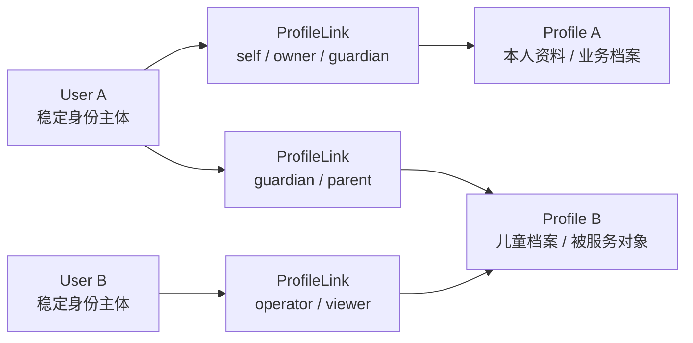
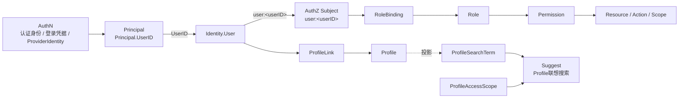

# 04-身份 Identity

## 1. 本目录定位

`04-身份Identity/` 是 IAM 文档体系中解释 **User、Profile、ProfileLink 身份事实模型** 的模块。

它回答的是：

```text
系统内部这个人是谁？
这个人关联了哪些业务身份资料或业务档案？
这些关系如何表达、查询、撤销和治理？
```

Identity 不是认证模块。

认证身份识别、登录凭据校验、ProviderIdentity 解析、Principal 构造、Token / Session 签发属于：

```text
02-认证AuthN/
```

Identity 也不是授权模块。

Subject、Role、Resource、Permission、RoleBinding、Check、PolicyVersion、Outbox 授权版本传播属于：

```text
03-授权AuthZ/
```

Identity 也不是 Suggest 模块。

Profile 联想搜索、ProfileSearchTerm、ProfileAccessScope、Trie / Hash 索引、Full / Delta refresh、手机号搜索安全属于：

```text
08-Suggest/
```

REST/gRPC/SDK 的完整接口契约属于：

```text
05-接入与契约/
```

本目录专注于 Identity 自身：

```text
User
Profile
ProfileLink
User 与 Profile 的关系
Identity 与 AuthN / AuthZ / Suggest 的边界
Identity 分层架构与事实源
```

---

## 2. 30 秒结论

Identity 负责身份事实。

它回答：

```text
谁是 IAM 内部稳定身份主体？
这个身份主体关联了哪些 Profile？
User 与 Profile 之间是什么关系？
```

核心模型是：

```text
User
  -> ProfileLink
  -> Profile
```

其中：

| 模型 | 一句话解释 |
| --- | --- |
| User | IAM 内部稳定身份主体 |
| Profile | 业务身份资料、业务档案或被服务对象 |
| ProfileLink | User 与 Profile 之间的身份关系 |

跨模块边界是：

```text
AuthN 认证成功后通过 Principal.UserID 指向 Identity.User。
AuthZ 通过 user:<userID> 引用 Identity.User。
Suggest 可以使用 Profile 相关读模型做联想搜索，但 Suggest 可见范围由 ProfileAccessScope 表达。
ProfileLink 是身份关系，不是 AuthZ Permission，也不是 Suggest 可见范围的直接替代品。
```

一句话：

> **Identity 负责维护稳定身份主体 User、业务身份资料 Profile，以及二者之间的关系 ProfileLink；AuthN 通过 Principal.UserID 指向 User，AuthZ 通过 user:< userID > 引用 User，Suggest 通过 ProfileSearchTerm / ProfileAccessScope 使用 Profile 相关读模型，但这些模块都不应该绕过 Identity 直接修改身份事实。**

---

## 3. 文档目录

新版 `04-身份Identity/` 采用 5 篇核心文档结构：

```text
04-身份Identity/
├── README.md
├── 00-Identity模型总览-User-Profile-ProfileLink.md
├── 01-ProfileLink链路-User与Profile关系协作.md
├── 02-Identity与AuthN-认证身份-Principal-User边界.md
├── 03-Identity与AuthZ-Subject-Resource-Permission边界.md
└── 04-Identity分层架构与事实源索引.md
```

| 文档 | 主题 |
| --- | --- |
| `00-Identity模型总览` | User、Profile、ProfileLink 核心模型 |
| `01-ProfileLink链路` | User 与 Profile 关系协作、创建、查询、撤销 |
| `02-Identity与AuthN边界` | 认证身份 / 登录凭据 / ProviderIdentity、Principal、User 的边界 |
| `03-Identity与AuthZ边界` | Principal.UserID、Identity.User、AuthZ Subject / Resource / Permission 的边界 |
| `04-Identity分层架构与事实源索引` | 分层架构、依赖规则、事实源、维护检查清单 |

Suggest 的实现细节不在本目录展开。

如果要理解 Profile 联想搜索读模型，请阅读：

```text
../08-Suggest/README.md
```

---

## 4. Identity 知识地图

```mermaid
flowchart TD
    Identity["04-身份 Identity"]

    Overview["00 模型总览"]
    LinkDoc["01 ProfileLink 链路"]
    AuthNBoundary["02 Identity 与 AuthN 边界"]
    AuthZBoundary["03 Identity 与 AuthZ 边界"]
    Architecture["04 分层架构与事实源"]
    SuggestBoundary["08-Suggest 边界"]

    Identity --> Overview
    Identity --> LinkDoc
    Identity --> AuthNBoundary
    Identity --> AuthZBoundary
    Identity --> Architecture
    Identity -.关联阅读.-> SuggestBoundary

    Overview --> User["User<br/>稳定身份主体"]
    Overview --> Profile["Profile<br/>业务身份资料 / 档案"]
    Overview --> ProfileLink["ProfileLink<br/>身份关系"]

    LinkDoc --> Relation["RelationType"]
    LinkDoc --> LinkStatus["Link Status"]
    LinkDoc --> ListByUser["ListProfilesByUser"]
    LinkDoc --> ListByProfile["ListUsersByProfile"]

    AuthNBoundary --> AuthnIdentity["认证身份 / 登录凭据 / ProviderIdentity"]
    AuthNBoundary --> Principal["Principal(UserID)"]

    AuthZBoundary --> Subject["Subject user:&lt;userID&gt;"]
    AuthZBoundary --> Resource["Resource / Scope Context"]
    AuthZBoundary --> Permission["Permission"]

    Architecture --> Domain["Domain"]
    Architecture --> Application["Application"]
    Architecture --> Infra["Infra"]
    Architecture --> Transport["Transport"]
    Architecture --> Container["Container"]

    SuggestBoundary --> ProfileSearchTerm["ProfileSearchTerm"]
    SuggestBoundary --> ProfileAccessScope["ProfileAccessScope"]
```



这张图表达：

```text
Identity 的核心仍然是 User / Profile / ProfileLink。
Suggest 是关联阅读对象，不是 Identity 核心子模型。
Suggest 使用 ProfileSearchTerm 和 ProfileAccessScope 做联想搜索读模型。
```

---

## 5. 推荐阅读顺序

### 5.1 标准顺序

如果你是第一次系统阅读 Identity，推荐按顺序读：

```text
00-Identity模型总览
  -> 01-ProfileLink链路
  -> 02-Identity与AuthN边界
  -> 03-Identity与AuthZ边界
  -> 04-Identity分层架构与事实源索引
```

原因是：

```text
先理解 User / Profile / ProfileLink 模型
再理解关系链路
再理解 Identity 与 AuthN 的边界
再理解 Identity 与 AuthZ 的边界
最后用分层架构和事实源索引收束
```

---

### 5.2 只想理解核心模型

推荐路径：

```text
00-Identity模型总览-User-Profile-ProfileLink.md
  -> 01-ProfileLink链路-User与Profile关系协作.md
```

重点关注：

```text
User 是稳定身份主体
Profile 是业务身份资料或业务档案
ProfileLink 是 User 与 Profile 的关系
ProfileLink 不是 User.profile_id
ProfileLink 不是 AuthZ Permission
ProfileLink 不是 Suggest 可见范围的直接替代品
```

---

### 5.3 只想理解 Identity 与 AuthN 的边界

推荐路径：

```text
02-Identity与AuthN-认证身份-Principal-User边界.md
  -> ../02-认证AuthN/README.md
```

重点关注：

```text
AuthN 认证身份 / 登录凭据 / ProviderIdentity 属于 AuthN
Principal 属于 AuthN
Principal.UserID 指向 Identity.User
Identity.User 不保存 password / openid / OAuth subject
Identity.User 不负责 Token / Session 签发
```

---

### 5.4 只想理解 Identity 与 AuthZ 的边界

推荐路径：

```text
03-Identity与AuthZ-Subject-Resource-Permission边界.md
  -> ../03-授权AuthZ/README.md
```

重点关注：

```text
Principal.UserID -> Identity.User.ID
Identity.User.ID -> AuthZ Subject user:<userID>
Profile 可以作为 Resource 或 Scope 上下文
ProfileLink 是身份关系，不是 Permission
资源访问权必须通过 AuthZ Check 判定
```

---

### 5.5 只想理解 Identity 与 Suggest 的边界

推荐路径：

```text
00-Identity模型总览-User-Profile-ProfileLink.md
  -> 01-ProfileLink链路-User与Profile关系协作.md
  -> ../08-Suggest/README.md
```

重点关注：

```text
Identity 维护 User / Profile / ProfileLink 身份事实；
Suggest 维护 Profile 联想搜索读模型；
ProfileSearchTerm 不是 Profile 聚合本体；
ProfileAccessScope 是 Suggest 查询可见范围，不是 ProfileLink；
ProfileLink 变化如果影响 Suggest 可见性，应通过可见性读模型、ScopeProvider 或刷新链路显式同步。
```

---

### 5.6 只想维护代码和文档

推荐路径：

```text
04-Identity分层架构与事实源索引.md
```

重点关注：

```text
Domain / Application / Infra / Transport / Container 分层
AuthN / AuthZ / Suggest 依赖 Identity 的方式
代码事实源入口
架构护栏
修改检查清单
```

---

## 6. 核心模型主图



这张图表达的是：

```text
User 和 Profile 不是一对一强绑定。
User 通过 ProfileLink 关联 Profile。
一个 User 可以关联多个 Profile。
一个 Profile 可以被多个 User 关联。
关系本身有类型、状态和生命周期。
```

---

## 7. 跨模块主图



这张图表达的是：

```text
AuthN 认证成功后得到 Principal.UserID。
Principal.UserID 指向 Identity.User。
Identity.User 通过 ProfileLink 关联 Profile。
Identity.User 可以映射为 AuthZ Subject user:<userID>。
资源访问权由 AuthZ RoleBinding / Role / Permission 判定。
Suggest 可以使用 Profile 投影出的 ProfileSearchTerm 做联想搜索。
Suggest 的可见范围由 ProfileAccessScope 表达，而不是直接由 ProfileLink 替代。
```

---

## 8. Identity 核心概念速查

| 概念 | 当前职责 |
| --- | --- |
| User | IAM 内部稳定身份主体 |
| UserID | AuthN Principal 与 AuthZ Subject 引用 Identity.User 的稳定标识 |
| Profile | 业务身份资料、业务档案或被服务对象 |
| ProfileLink | User 与 Profile 之间的身份关系 |
| RelationType | User 与 Profile 的关系类型 |
| LinkStatus | ProfileLink 的当前状态 |
| Principal | AuthN 认证成功后的当前调用主体表达 |
| Subject | AuthZ 中的授权主体引用，如 `user:<userID>` |
| Permission | AuthZ 中的资源访问能力，不属于 Identity |
| Resource / Scope | AuthZ 中的资源与对象范围，Profile 可作为上下文 |
| ProfileSearchTerm | Suggest 索引项读模型，不是 Profile 聚合本体 |
| ProfileAccessScope | Suggest 查询可见范围，不是 ProfileLink |

---

## 9. User / Profile / ProfileLink 的边界

### 9.1 User

User 是：

```text
IAM 内部稳定身份主体
AuthN Principal.UserID 指向的身份事实
AuthZ subject user:<userID> 的来源
ProfileLink.UserID 的关联对象
```

User 不是：

```text
登录凭据
ProviderIdentity
微信 openid
OAuth subject
Token / Session
Role / Permission 集合
所有业务资料字段的容器
```

---

### 9.2 Profile

Profile 是：

```text
业务身份资料
业务档案
被记录、被测评、被关联的业务对象
```

Profile 不是：

```text
登录主体
认证凭据
Principal
AuthZ subject 本身
Permission
Suggest 索引结构本身
```

---

### 9.3 ProfileLink

ProfileLink 是：

```text
User 与 Profile 的身份关系实体
```

它回答：

```text
哪个 User 和哪个 Profile 有关系？
是什么关系？
这条关系是否仍然有效？
什么时候建立？
什么时候撤销？
```

ProfileLink 不是：

```text
User 字段
Profile 字段
AuthZ Permission
Casbin fact
Suggest ProfileAccessScope
Suggest 查询结果
```

---

## 10. Identity 与其他模块的关系

| 模块 | 关系 |
| --- | --- |
| AuthN | AuthN 认证成功后通过 Principal.UserID 指向 Identity.User |
| AuthZ | AuthZ 通过 `user:<userID>` 引用 Identity.User，并用 Check 判定资源访问 |
| Suggest | Suggest 使用 ProfileSearchTerm 读模型和 ProfileAccessScope 做 Profile 联想搜索；ProfileLink 可以成为可见性读模型的事实来源之一，但 Suggest 不直接等价于 ProfileLink 查询 |
| REST | REST 提供 Identity / Profile / ProfileLink 接口适配 |
| gRPC | gRPC 提供服务间 Identity 能力 |
| SDK | SDK 封装 Identity/Profile/ProfileLink 接入能力 |
| 业务系统 | 业务系统可以使用 Profile / ProfileLink 作为业务上下文，但资源访问仍应走 AuthZ |

---

## 11. ProfileLink 与 AuthZ 的边界

这是 Identity 模块最容易混淆的问题。

### 11.1 ProfileLink 回答

```text
User 和 Profile 有没有关系？
关系是什么？
关系是否有效？
```

例如：

```text
user:123 是 profile:456 的 guardian
```

### 11.2 AuthZ 回答

```text
Subject 能不能对 Resource 执行 Action？
作用范围 Scope 是什么？
```

例如：

```text
Subject: user:123
Resource: qs:evaluation:report:*
Action: read
Scope: origin:456
```

### 11.3 当前边界

```text
ProfileLink = 身份关系事实
AuthZ Permission = 资源访问能力
AuthZ Check = 权威访问判定
```

因此：

```text
ProfileLink 可以作为授权上下文。
ProfileLink 可以作为授权写入的显式触发条件。
ProfileLink 不能直接替代 Permission。
Identity repository 不能直接写 AuthZ facts。
```

---

## 12. ProfileLink 与 Suggest 的边界

这是新增 Suggest 文档后需要特别说明的边界。

### 12.1 ProfileLink 回答

```text
User 与 Profile 是否存在身份关系？
这条关系是什么类型？
这条关系是否有效？
```

### 12.2 Suggest 回答

```text
operating 后台输入一个关键词时，如何快速返回当前操作员可见的 Profile 候选？
```

Suggest 的核心输入不是 ProfileLink，而是：

```text
OperatingPrincipal
ProfileAccessScope
Keyword / Query
ProfileSearchTerm 索引
```

### 12.3 当前边界

```text
ProfileLink = 身份关系事实；
ProfileAccessScope = Suggest 查询时的可见范围；
ProfileSearchTerm = Suggest 索引项读模型；
Suggest Store = 只消费 scope filter，不计算完整权限。
```

因此：

```text
ProfileLink 可以参与构建 Profile visibility read model。
ProfileLink 可以成为 ProfileAccessScopeProvider 的事实来源之一。
ProfileLink 变化如果影响 Suggest 可见性，应通过 visibility read model / ScopeProvider / Delta refresh 显式同步。
Suggest 不应在每次 autocomplete 查询中直接扫描 ProfileLink。
Suggest 不应把 ProfileLink 直接解释成当前操作员可见全部关联 Profile。
```

Suggest 的实现细节见：

```text
../08-Suggest/README.md
```

---

## 13. Identity 与 AuthN 的边界

新版 AuthN 模型不再以 `Account` 作为领域对象。

因此 Identity 文档统一使用：

```text
认证身份 / 登录凭据 / ProviderIdentity
  -> Principal(UserID)
  -> Identity.User
```

边界是：

```text
AuthN 负责认证身份识别、凭据校验与 Principal 构造。
Identity 负责 User / Profile / ProfileLink 身份事实。
```

Identity 不应该保存：

```text
password hash
openid
OAuth subject
refresh token
jwt key id
provider credential
```

这些属于 AuthN。

---

## 14. 代码证据入口

| 主题 | 代码入口 |
| --- | --- |
| UserModule 装配 | `internal/apiserver/container/assembler/user.go` 或当前 Identity assembler |
| User 领域模型 | `internal/apiserver/domain/identity/user` 或 `internal/apiserver/domain/identity` |
| Profile 领域模型 | `internal/apiserver/domain/identity/profile` 或 `internal/apiserver/domain/identity` |
| ProfileLink 领域模型 | `internal/apiserver/domain/identity/profilelink` 或 `internal/apiserver/domain/identity` |
| User application | `internal/apiserver/application/identity/user` 或 `internal/apiserver/application/identity` |
| Profile application | `internal/apiserver/application/identity/profile` 或 `internal/apiserver/application/identity` |
| ProfileLink application | `internal/apiserver/application/identity/profilelink` 或 `internal/apiserver/application/identity` |
| Identity UoW | `internal/apiserver/application/identity/uow` |
| MySQL Identity UoW | `internal/apiserver/infra/mysql/uow/identity` |
| ProfileLink MySQL repo | `internal/apiserver/infra/mysql/profilelink` 或 `internal/apiserver/infra/mysql/identity/profilelink` |
| REST Identity | `internal/apiserver/transport/rest/identity` |
| gRPC Identity | `internal/apiserver/transport/grpc/service/identity` |
| Identity proto | `api/grpc/iam/identity/v2/identity.proto` |
| SDK Identity | `pkg/sdk/identity` |
| AuthN Principal | `internal/apiserver/domain/authn/principal` 或 `internal/apiserver/domain/authn` |
| AuthN Login / Onboarding | `internal/apiserver/application/authn/login`、`internal/apiserver/application/authn/onboarding` |
| AuthZ Subject | `internal/apiserver/domain/authz/subject` |
| AuthZ Check | `internal/apiserver/application/authz/authorization` |
| Suggest domain | `internal/apiserver/domain/suggest` |
| Suggest application | `internal/apiserver/application/suggest` |
| Suggest visibility / search infra | `internal/apiserver/infra/suggest`、`internal/apiserver/infra/mysql/suggest` |

---

## 15. 事实源优先级

Identity 相关事实冲突时，按以下顺序判断：

1. **源码运行行为**

   ```text
   internal/apiserver/domain/identity
   internal/apiserver/application/identity
   internal/apiserver/infra/mysql
   internal/apiserver/transport/rest/identity
   internal/apiserver/transport/grpc/service/identity
   ```

2. **机器契约与迁移**

   ```text
   api/rest/identity.v2.yaml
   api/grpc/iam/identity/v2/identity.proto
   internal/pkg/migration/migrations
   ```

3. **架构与契约测试**

   ```text
   internal/pkg/architecture
   REST/gRPC contract tests
   SDK public API compile test
   domain / application / infra tests
   ```

4. **当前维护文档**

   ```text
   docs/04-身份Identity
   docs/05-接入与契约
   docs/06-架构护栏
   docs/07-宣讲
   docs/08-Suggest
   ```

   其中 `docs/08-Suggest` 只用于说明 Profile 联想搜索读模型如何消费 Profile 相关读模型与 ProfileAccessScope，不是 Identity 的核心事实源。

5. **历史归档材料**

   ```text
   _archive/
   ```

历史归档只用于追溯，不作为当前事实源。

---

## 16. 与架构护栏、宣讲、Suggest 文档的关系

### 16.1 事实层

`04-身份Identity/` 是事实层，回答：

```text
当前源码如何表达 User / Profile / ProfileLink？
当前 ProfileLink 如何表达身份关系？
当前 Identity 与 AuthN / AuthZ / Suggest 的边界是什么？
当前 Identity 分层架构和事实源在哪里？
```

---

### 16.2 架构护栏层

`06-架构护栏/` 更适合回答：

```text
如何防止 Identity 与 AuthN/AuthZ/Suggest 边界漂移？
如何防止 ProfileLink 被写成权限表？
如何防止 ProfileLink 被写成 Suggest 可见范围？
如何通过事实源和检查清单防止文档漂移？
```

---

### 16.3 宣讲层

`07-宣讲/` 更适合回答：

```text
如何把 Identity 与 ProfileLink 讲给别人听？
如何准备面试追问？
如何画图说明 User / Profile / ProfileLink？
```

宣讲层可以使用事实层作为证据索引。

---

### 16.4 Suggest 文档

`08-Suggest/` 更适合回答：

```text
Profile 联想搜索如何工作？
ProfileSearchTerm 如何构建？
ProfileAccessScope 如何过滤可见候选？
Trie / Hash / Runtime 如何组织？
手机号搜索、限流、指标和降级如何设计？
```

Identity 文档只说明边界，不复制 Suggest 的索引实现。

---

## 17. 常见误区

### 17.1 Identity = 用户资料 CRUD

错误。

Identity 不只是 User 资料，还包括 Profile 与 ProfileLink 关系模型。

---

### 17.2 User = Profile

错误。

User 是稳定身份主体。

Profile 是业务身份资料或业务档案。

一个 User 可以关联多个 Profile，一个 Profile 也可以被多个 User 关联。

---

### 17.3 User = AuthN 认证身份

错误。

AuthN 认证身份、登录凭据、ProviderIdentity 属于 AuthN。

User 属于 Identity。

AuthN 认证成功后通过 Principal.UserID 指向 User。

---

### 17.4 Principal = User = Subject

错误。

Principal 是 AuthN 认证结果。

User 是 Identity 稳定身份主体。

Subject 是 AuthZ 授权主体引用。

三者通过 UserID 串联，但不是同一个对象。

---

### 17.5 ProfileLink = User.profile_id

错误。

`user.profile_id` 只能表达简单一对一关系，无法表达多档案、多用户、关系类型、状态和审计。

---

### 17.6 ProfileLink = AuthZ Permission

错误。

ProfileLink 是身份关系，不是资源权限。

资源级权限仍应进入 AuthZ。

---

### 17.7 ProfileLink = Suggest 可见范围

错误。

ProfileLink 是 User 与 Profile 的身份关系事实。

Suggest 的 operating 后台可见范围由 ProfileAccessScope 表达。

ProfileLink 可以参与构建可见性读模型，但不能直接替代 ProfileAccessScope。

---

### 17.8 Suggest 属于 Identity 核心域

错误。

Suggest 使用 Profile 相关读模型，但它是辅助搜索读模型，不是 Identity 核心模型。

Identity 仍然只负责 User / Profile / ProfileLink 身份事实。

---

### 17.9 ProfileID 应该直接拼进 ResourceKey

不推荐。

ResourceKey 表达资源类型或资源族。

ProfileID 更适合作为 Scope 中的对象范围。

---

## 18. 验证建议

修改 Identity 文档或相关代码后，建议运行：

```bash
make docs-hygiene
```

Identity 应用与领域测试：

```bash
go test ./internal/apiserver/application/identity/... \
  ./internal/apiserver/domain/identity/...
```

MySQL / UoW 相关：

```bash
go test ./internal/apiserver/infra/mysql/uow/identity \
  ./internal/apiserver/infra/mysql/profilelink
```

REST/gRPC 接入相关：

```bash
go test ./internal/apiserver/transport/rest/identity \
  ./internal/apiserver/transport/grpc/service/identity
```

SDK Identity 接入相关：

```bash
go test ./pkg/sdk/identity
```

架构边界相关：

```bash
go test ./internal/pkg/architecture
```

涉及 REST/gRPC 契约时：

```bash
make docs-swagger
make api-validate
make proto-gen
```

如果改动 Profile / ProfileLink 与 Suggest 可见性边界，还应检查：

```bash
go test ./internal/apiserver/domain/suggest/... \
  ./internal/apiserver/application/suggest/... \
  ./internal/apiserver/infra/suggest/... \
  ./internal/apiserver/infra/mysql/suggest/...
```

并同步检查：

```text
../08-Suggest/README.md
../08-Suggest/02-权限范围-OperatingPrincipal与ProfileAccessScope.md
../08-Suggest/04-刷新链路-Loader-Refresher-FullDelta-Snapshot.md
```

---

## 19. 维护规则

### 19.1 README 只做 Identity 模块入口

本 README 负责：

```text
说明 Identity 模块回答什么
列出 5 篇核心文档
提供阅读路径
提供知识地图和事实源入口
说明常见误区和维护规则
```

详细模型与链路放到对应正文。

---

### 19.2 不把 AuthN 写成 Identity

Identity 不负责：

```text
认证身份识别
登录凭据校验
ProviderIdentity 解析
Session 创建
Access Token 签发
Refresh Token 轮换
JWKS 发布
```

这些属于 `02-认证AuthN/`。

---

### 19.3 不把 AuthZ 写成 Identity

Identity 不负责：

```text
Subject
Role
Resource
Permission
RoleBinding
AuthZ Check
PolicyVersion
Outbox 授权版本传播
```

这些属于 `03-授权AuthZ/`。

---

### 19.4 不把 Suggest 写成 Identity

Identity 不负责：

```text
Profile autocomplete；
ProfileSearchTerm 索引项；
ProfileAccessScope 可见范围；
Trie / Hash / Runtime；
Full / Delta refresh；
手机号搜索、限流、指标和降级。
```

这些属于 `08-Suggest/`。

---

### 19.5 不把 ProfileLink 写成权限表

ProfileLink 是身份关系实体。

如果未来 Profile 操作要纳入统一资源权限，应通过：

```text
AuthZ Resource / Action / Scope
```

扩展，而不是让 ProfileLink 承担所有权限语义。

---

### 19.6 不把 ProfileLink 写成 Suggest 可见范围

ProfileLink 可以成为构建可见性读模型的事实来源之一。

但 Suggest 查询时应消费：

```text
ProfileAccessScope
```

而不是直接把 ProfileLink 当作查询权限结果。

如果 ProfileLink 变化影响 Suggest 可见性，需要通过：

```text
Profile visibility read model；
ProfileAccessScopeProvider；
Full / Delta refresh；
```

显式同步。

---

### 19.7 文档必须跟随代码事实源

如果这些事实变化，必须同步更新文档：

```text
User 状态
Profile 状态
RelationType
ProfileLink Status
AuthN Principal.UserID 语义
User -> AuthZ Subject 映射规则
ProfileLink 与 AuthZ 的协作方式
ProfileLink 与 Suggest 可见性读模型的协作方式
REST/gRPC response 字段
Identity capabilities
```

---

## 20. 本文总结

`04-身份Identity/` 解释 IAM 如何表达内部身份主体与业务身份资料关系。

核心心智是：

```text
Identity 不只是用户资料 CRUD。
User 不是 Profile。
User 不是 AuthN 认证身份。
Principal 不是 User。
ProfileLink 不是 User 字段。
ProfileLink 不是 AuthZ Permission。
ProfileLink 不是 Suggest 可见范围。
Suggest 不是 Identity 核心域。
```

Identity 的主线是：

```text
User
  -> ProfileLink
  -> Profile
```

跨模块主线是：

```text
AuthN 认证身份 / 登录凭据 / ProviderIdentity
  -> Principal(UserID)
  -> Identity.User
  -> AuthZ Subject user:<userID>
```

Suggest 关联主线是：

```text
Identity.Profile
  -> ProfileSearchTerm read model
  -> ProfileAccessScope filter
  -> Suggest autocomplete result
```

读完本目录后，读者应该能回答：

```text
User 和 Profile 为什么分开？
ProfileLink 为什么是独立关系实体？
Identity.User 与 AuthN Principal 是什么关系？
Identity.User 与 AuthZ Subject 是什么关系？
ProfileLink 与 AuthZ Permission 有什么区别？
ProfileLink 与 Suggest ProfileAccessScope 有什么区别？
Identity 如何与 AuthN/AuthZ/Suggest 协作？
```

如果只记一句话：

> **Identity 负责把稳定身份主体 User、业务身份资料 Profile 和关系实体 ProfileLink 分开建模；AuthN 通过 Principal.UserID 指向 User，AuthZ 通过 user:< userID > 引用 User，ProfileLink 可以提供关系上下文，但不能替代 AuthZ Permission，也不能直接替代 Suggest 的 ProfileAccessScope。**
