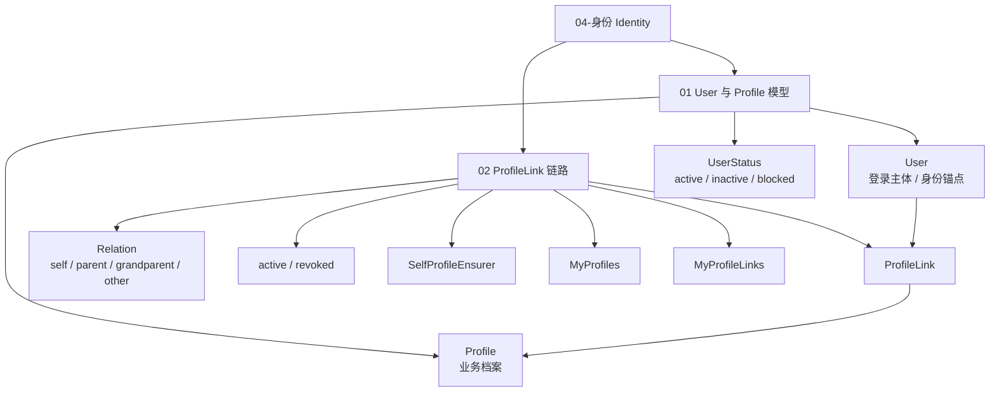
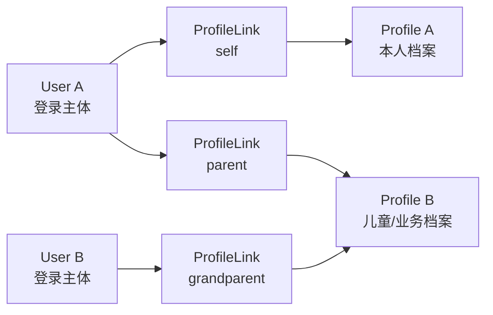
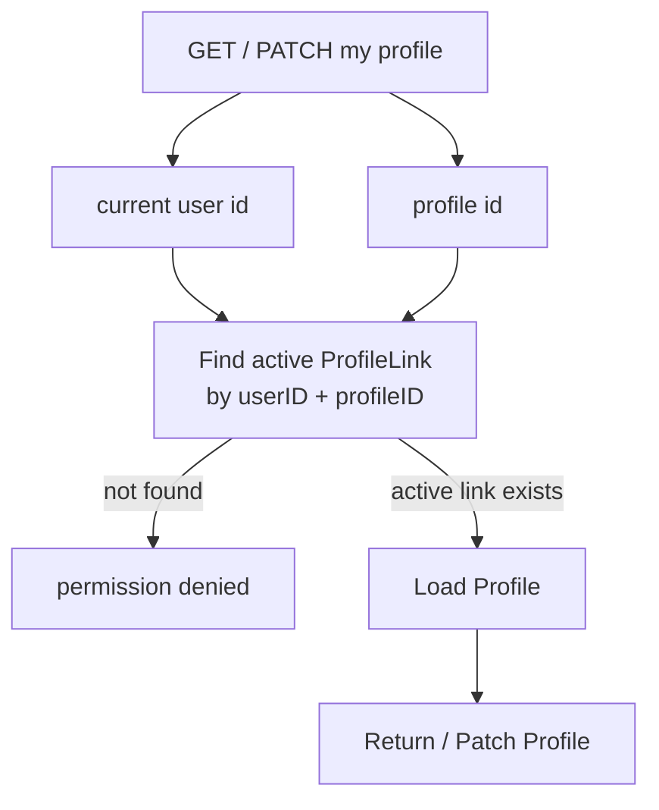

# 04-身份 Identity

## 本文回答

`04-身份Identity/` 是 IAM 文档体系中解释 **User、Profile、ProfileLink 身份关系模型** 的模块。

它回答：

1. User 为什么是登录主体和 IAM 内部身份锚点；
2. Profile 为什么是业务档案，而不是登录用户；
3. ProfileLink 为什么是 User 与 Profile 之间的关系事实；
4. 为什么 ProfileLink 不能只是 `User.profile_id` 或 `Profile.user_id`；
5. self / parent / grandparent / other 等关系如何表达；
6. active / revoked 关系状态如何影响当前用户访问；
7. MyProfiles 与 MyProfileLinks 如何保护当前用户视角；
8. SelfProfileEnsurer 为什么要维护 active self link；
9. Identity 与 AuthN、AuthZ、IDP、SDK 的边界分别是什么。

本目录只解释 **身份主体与业务档案关系**。  
认证登录态属于 `02-认证AuthN/`；资源级授权属于 `03-授权AuthZ/`；REST/gRPC/SDK 接入属于 `05-接入与契约/`。

---

## 30 秒结论

Identity 负责回答：

```text
系统内部这个人是谁？
这个人和哪些业务档案有关？
这些关系是否仍然有效？
```

IAM 的 Identity 不是普通：

```text
User CRUD
```

也不是：

```text
User.profile_id
```

而是把三个概念分开：

```text
User
  -> 登录主体 / 身份锚点

Profile
  -> 业务档案 / 被记录对象

ProfileLink
  -> User 与 Profile 之间的关系事实
```

核心模型是：

```text
User -- ProfileLink -- Profile
```

其中 ProfileLink 支持：

```text
self
parent
grandparent
other
active / revoked
```

一句话：

> **Identity 把登录主体 User、业务档案 Profile、关系实体 ProfileLink 分开建模，用于表达本人档案、儿童档案、亲属关系和当前用户访问边界。**

---

## 本目录文档

当前 `04-身份Identity/` 建议包含 2 篇正文文档：

```text
04-身份Identity/
├── README.md
├── 01-User与Profile模型.md
└── 02-ProfileLink链路--用户与儿童档案关系协作.md
```

| 文档 | 作用 | 读完后应该能回答 |
| --- | --- | --- |
| `01-User与Profile模型.md` | 解释 User 与 Profile 的领域边界 | User 为什么是登录主体，Profile 为什么是业务档案，二者为什么不能合并 |
| `02-ProfileLink链路--用户与儿童档案关系协作.md` | 解释 ProfileLink 关系链路 | ProfileLink 如何建立/撤销，MyProfiles/MyProfileLinks 如何保护当前用户视角 |

---

## Identity 知识地图



---

## 推荐阅读顺序

### 标准顺序

```text
01-User与Profile模型
  -> 02-ProfileLink链路--用户与儿童档案关系协作
```

原因：

1. 先理解 User 与 Profile 为什么分开；
2. 再理解二者之间为什么需要 ProfileLink；
3. 最后理解当前用户访问边界和 self link 不变量。

---

### 如果你只想理解“User 和 Profile 为什么分开”

推荐路径：

```text
01-User与Profile模型.md
  -> ../07-专题分析/07-为什么ProfileLink不能只是User字段.md
  -> ../08-宣讲/05-Identity与ProfileLink讲法.md
```

重点关注：

```text
User 是登录主体
Profile 是业务档案
二者不是一对一
ProfileLink 是关系实体
```

---

### 如果你只想理解“当前用户如何访问档案”

推荐路径：

```text
02-ProfileLink链路--用户与儿童档案关系协作.md
  -> ../08-宣讲/05-Identity与ProfileLink讲法.md
```

重点关注：

```text
MyProfiles.Create
MyProfiles.Get / Patch
MyProfileLinks.Grant / List / Revoke
active ProfileLink guard
permission denied
```

---

### 如果你只想理解“Identity 和 AuthN/AuthZ 的边界”

推荐路径：

```text
01-User与Profile模型.md
  -> 02-ProfileLink链路--用户与儿童档案关系协作.md
  -> ../02-认证AuthN/02-认证语义--用户状态&会话&Token边界.md
  -> ../03-授权AuthZ/01-授权模型--Role&Resource&Permission&RoleBinding.md
```

重点关注：

```text
User status 影响 AuthN Verify
user:<id> 作为 AuthZ subject
ProfileLink 是关系 guard
ProfileLink 不是 AuthZ Permission
```

---

## 核心模型主图



这张图表达的是：

```text
User 和 Profile 不是一对一
User 通过 ProfileLink 关联 Profile
一个 User 可以关联多个 Profile
一个 Profile 可以被多个 User 关联
关系本身有类型和生命周期
```

---

## 当前用户访问 guard



这张图表达的是：

```text
当前用户不能直接按 profile_id 访问档案
必须先确认 currentUser 和 profile 之间有 active ProfileLink
```

---

## Identity 核心概念

| 概念 | 当前职责 | 常见误解 |
| --- | --- | --- |
| User | 登录主体，IAM 内部身份锚点，带状态 | 误以为 User 等于所有业务档案 |
| UserStatus | User 的可用状态，例如 active、inactive、blocked | 误以为只影响资料显示，不影响认证 |
| Profile | 业务档案，例如本人档案、儿童档案、被测评者档案 | 误以为 Profile 是登录账号 |
| ProfileLink | User 与 Profile 的关系事实 | 误以为只是 `user.profile_id` |
| Relation | 关系语义，例如 self、parent、grandparent、other | 误以为所有关系都是 parent-child |
| Type | 关系主类别，例如 self、relation | 误以为和 Relation 完全重复 |
| RevokedAt | 关系撤销时间，nil 表示 active | 误以为撤销就是物理删除 |
| SelfProfileEnsurer | 维护每个登录 User 的 active self link | 误以为 self profile 应直接写在 User 字段里 |
| MyProfiles | 当前用户视角的 Profile 用例 | 误以为是系统侧 Profile 管理接口 |
| MyProfileLinks | 当前用户视角的 ProfileLink 用例 | 误以为可操作任意用户的关系 |

---

## User / Profile / ProfileLink 的边界

### User

User 是：

```text
登录主体
IAM 内部身份锚点
AuthN Principal 的 UserID 来源
AuthZ subject 的来源之一
```

User 不是：

```text
所有业务档案的容器
儿童档案本身
第三方平台 openid
```

---

### Profile

Profile 是：

```text
业务档案
被记录、被测评、被关联的业务对象
```

Profile 不是：

```text
登录主体
账号凭据
Session 主体
AuthZ subject 本身
```

---

### ProfileLink

ProfileLink 是：

```text
User 与 Profile 的关系实体
```

它回答：

```text
哪个 User 和哪个 Profile 有关系？
是什么关系？
这条关系是否仍然有效？
什么时候建立？
什么时候撤销？
```

ProfileLink 不是：

```text
User 字段
Profile 字段
AuthZ Permission
Casbin fact
```

---

## Identity 与其他模块的关系

| 模块 | 关系 |
| --- | --- |
| AuthN | AuthN 使用 UserID 作为 Principal 身份锚点；Verify 会检查 User 状态 |
| AuthZ | AuthZ 使用 `user:<id>` 等 subject 做资源权限判定；ProfileLink 不等于 Permission |
| IDP | 外部身份源通过 AuthN 绑定 Account/User；微信 openid 不是 IAM User |
| REST | REST 提供当前用户视角的 Identity / Profile / ProfileLink 接口 |
| gRPC | gRPC 提供系统侧 IdentityRead、ProfileLinkQuery、ProfileLinkCommand、IdentityLifecycle |
| SDK | SDK 封装系统侧 Identity/ProfileLink gRPC 能力，但不替代当前用户 guard |
| Suggest | Suggest 只提供 Profile 候选发现，不建立关系、不判断权限 |
| Session | UserStatusChanger 可依赖 SessionManager 影响用户会话状态 |

---

## ProfileLink 与 AuthZ 的边界

这是 Identity 模块最容易被问到的问题。

### ProfileLink 回答

```text
User 和 Profile 有没有 active relationship？
关系是什么？
```

例如：

```text
user:123 是 profile:456 的 parent
```

### AuthZ 回答

```text
subject 能不能对 resource 执行 action？
```

例如：

```text
user:123 can read identity:profile:456
```

### 当前边界

```text
ProfileLink = 身份关系 guard
AuthZ = 资源权限系统
```

因此：

```text
MyProfiles 可以用 active ProfileLink 判断当前用户是否能访问自己的关联档案
但平台级资源授权仍应走 AuthZ Resource/Action/Scope
```

不要把 ProfileLink 写成通用权限表。

---

## SelfProfileEnsurer 的意义

`SelfProfileEnsurer` 维护一个重要不变量：

```text
每个登录 User 应该有一个 active self ProfileLink
```

它做两件事：

1. 如果没有 active self link，则创建一个 self Profile 和 self ProfileLink；
2. 如果历史数据中有多个 active self link，则保留最早一条，其他转换为 parent relation。

这个设计的价值是：

```text
本人档案也走 ProfileLink 统一关系模型
不需要额外 User.self_profile_id 字段
当前用户可以稳定找到自己的 self profile
历史异常数据可以被规范化
```

---

## 代码证据入口

| 主题 | 代码入口 |
| --- | --- |
| UserModule 装配 | `internal/apiserver/container/assembler/user.go` |
| User 领域模型 | `internal/apiserver/domain/uc/user/user.go` |
| UserStatus | `internal/apiserver/domain/uc/user/status.go` |
| Profile 领域模型 | `internal/apiserver/domain/uc/profile/profile.go` |
| ProfileLink 领域模型 | `internal/apiserver/domain/uc/profilelink/profile_link.go` |
| Relation parser | `internal/apiserver/domain/uc/profilelink/relation.go` |
| ProfileLinker | `internal/apiserver/domain/uc/profilelink/linker.go` |
| SelfProfileEnsurer | `internal/apiserver/domain/uc/profilelink/self_profile_ensurer.go` |
| User application | `internal/apiserver/application/uc/user` |
| Profile application | `internal/apiserver/application/uc/profile` |
| MyProfiles | `internal/apiserver/application/uc/profile/service_my_profiles.go`、`service_access.go` |
| ProfileLink application | `internal/apiserver/application/uc/profilelink` |
| MyProfileLinks | `internal/apiserver/application/uc/profilelink/service_access.go` |
| UC UoW | `internal/apiserver/application/uc/uow` |
| MySQL UC UoW | `internal/apiserver/infra/mysql/uow/uc` |
| ProfileLink MySQL repo | `internal/apiserver/infra/mysql/profilelink` |
| REST Identity | `internal/apiserver/transport/rest/identity` |
| gRPC Identity | `internal/apiserver/transport/grpc/service/uc/identity` |
| Identity proto | `api/grpc/iam/identity/v2/identity.proto` |
| SDK Identity | `pkg/sdk/identity` |

---

## 事实源优先级

Identity 相关事实冲突时，按以下顺序判断：

1. **源码运行行为**  
   `internal/apiserver/domain/uc`、`application/uc`、`infra/mysql/uc`、`transport/rest/identity`、`transport/grpc/service/uc/identity`。

2. **机器契约与迁移**  
   `api/rest/identity.v2.yaml`、`api/grpc/iam/identity/v2/identity.proto`、`internal/pkg/migration/migrations`。

3. **架构与契约测试**  
   `internal/pkg/architecture`、REST/gRPC contract tests、SDK public API compile test。

4. **当前维护文档**  
   `docs/04-身份Identity`、`docs/05-接入与契约`、`docs/07-专题分析`、`docs/08-宣讲`。

5. **历史归档材料**  
   `_archive/` 只用于历史追溯，不作为当前事实源。

---

## 与专题分析、宣讲文档的关系

### 事实层

`04-身份Identity/` 是事实层，回答：

```text
当前源码如何表达 User/Profile/ProfileLink
当前 MyProfiles/MyProfileLinks 如何保护当前用户视角
当前 Identity 与 AuthN/AuthZ 的边界是什么
```

### 专题分析层

`07-专题分析/` 回答：

```text
为什么 ProfileLink 不能只是 User 字段
为什么 User/Profile/ProfileLink 要分开
为什么 ProfileLink 不能直接替代 AuthZ
```

推荐阅读：

```text
../07-专题分析/07-为什么ProfileLink不能只是User字段.md
```

### 宣讲层

`08-宣讲/` 回答：

```text
如何把 Identity 与 ProfileLink 讲给别人听
如何准备面试追问
如何画图说明 User/Profile/ProfileLink
```

推荐阅读：

```text
../08-宣讲/05-Identity与ProfileLink讲法.md
../08-宣讲/12-架构图素材索引.md
../08-宣讲/13-面试追问证据索引.md
```

---

## 常见误区

### 误区一：Identity = 用户资料 CRUD

错误。  
Identity 不只是 User 资料，还包括 Profile 与 ProfileLink 关系模型。

---

### 误区二：User = Profile

错误。  
User 是登录主体；Profile 是业务档案。  
一个 User 可以关联多个 Profile，一个 Profile 也可以被多个 User 关联。

---

### 误区三：ProfileLink = User.profile_id

错误。  
`user.profile_id` 只能表达一对一关系，无法表达多档案、多用户、关系类型、撤销历史和 active guard。

---

### 误区四：ProfileLink = AuthZ Permission

错误。  
ProfileLink 是身份关系，不是资源权限。  
资源级权限仍应进入 AuthZ。

---

### 误区五：Suggest 找到 Profile 就代表可访问

错误。  
Suggest 只提供候选发现。  
能否访问要看 active ProfileLink 或 AuthZ 判定。

---

### 误区六：self profile 应该直接存在 User 字段

不推荐。  
当前设计中 self 也是 ProfileLink 的一种关系，只是带更强不变量。这样模型统一，不需要两套 Profile 关联机制。

---

## 验证建议

修改 Identity 文档或相关代码后，建议运行：

```bash
make docs-hygiene
```

Identity 应用与领域测试：

```bash
go test ./internal/apiserver/application/uc/... \
  ./internal/apiserver/domain/uc/...
```

MySQL / UoW 相关：

```bash
go test ./internal/apiserver/infra/mysql/uow/uc \
  ./internal/apiserver/infra/mysql/profilelink
```

REST/gRPC 接入相关：

```bash
go test ./internal/apiserver/transport/rest/identity \
  ./internal/apiserver/transport/grpc/service/uc/identity
```

SDK Identity 接入相关：

```bash
go test ./pkg/sdk/identity
```

架构边界相关：

```bash
go test ./internal/pkg/architecture
```

涉及 REST/gRPC 契约时：

```bash
make docs-swagger
make api-validate
make proto-gen
```

---

## 维护规则

### 1. README 只做 Identity 模块入口

本 README 负责：

```text
说明 Identity 模块回答什么
列出两篇正文
提供阅读路径
提供术语表和证据入口
说明和专题/宣讲/接入文档的关系
```

详细模型与链路放到对应正文。

---

### 2. 不把 AuthN 写成 Identity

Identity 不负责：

```text
登录方式选择
Session 创建
Access Token 签发
Refresh Token 轮换
JWKS 发布
Online Verify
```

这些属于 `02-认证AuthN/`。

---

### 3. 不把 AuthZ 写成 Identity

Identity 不负责：

```text
Role
Resource
Permission
RoleBinding
AuthZ Check
PolicyVersion
Outbox 授权版本传播
```

这些属于 `03-授权AuthZ/`。

---

### 4. 不把 ProfileLink 写成权限表

ProfileLink 是关系实体。  
如果未来 Profile 操作要纳入统一资源权限，应通过：

```text
AuthZ Resource / Action / Scope
```

扩展，而不是让 ProfileLink 承担所有权限语义。

---

### 5. 不恢复旧命名

当前标准术语是：

```text
User
Profile
ProfileLink
MyProfiles
MyProfileLinks
SelfProfileEnsurer
```

不要恢复或混用旧术语：

```text
GuardianRef
ChildRef
ProfileRef
```

除非是在 `_archive` 或历史迁移说明中明确标注。

---

## 本文总结

`04-身份Identity/` 解释的是 IAM 如何表达内部身份与业务档案关系。

核心心智是：

```text
Identity 不只是用户资料
User 不是 Profile
ProfileLink 不是 User 字段
ProfileLink 不是 AuthZ Permission
```

它的主线是：

```text
User
  -> ProfileLink
  -> Profile
```

当前用户视角主线是：

```text
currentUserID
  -> active ProfileLink guard
  -> Profile access
```

读完本目录后，读者应该能回答：

```text
User 和 Profile 为什么分开？
ProfileLink 为什么是独立关系实体？
self / parent / grandparent / other 如何表达？
active / revoked 关系状态如何影响访问？
MyProfiles / MyProfileLinks 如何防止越权？
ProfileLink 与 AuthZ Permission 有什么区别？
Identity 如何与 AuthN/AuthZ/IDP 协作？
```

如果只记一句话：

> **Identity 负责把登录主体 User、业务档案 Profile 和关系实体 ProfileLink 分开建模，用 active ProfileLink 保护当前用户档案访问边界，并与 AuthN 登录态、AuthZ 资源权限保持清晰分工。**
