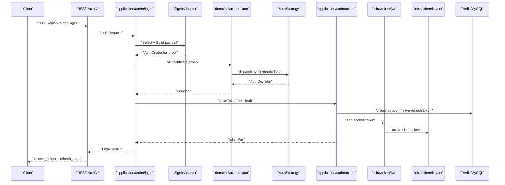
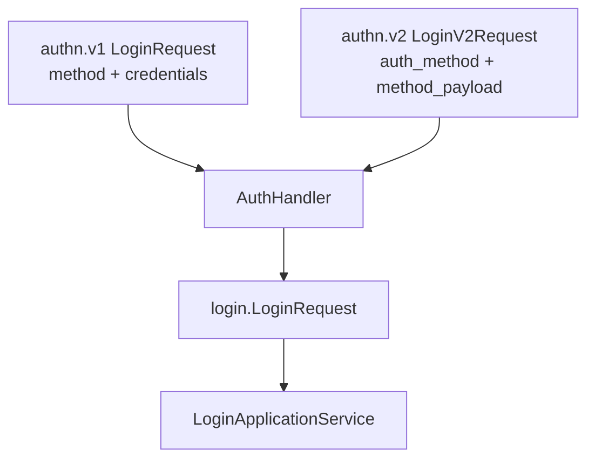
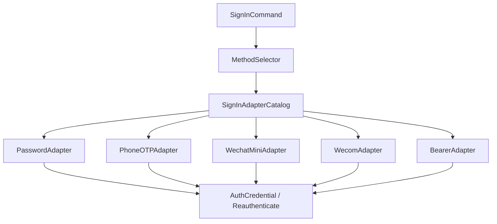
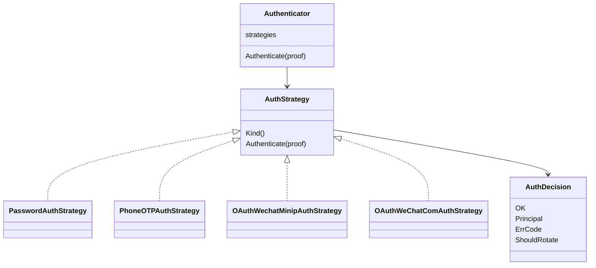
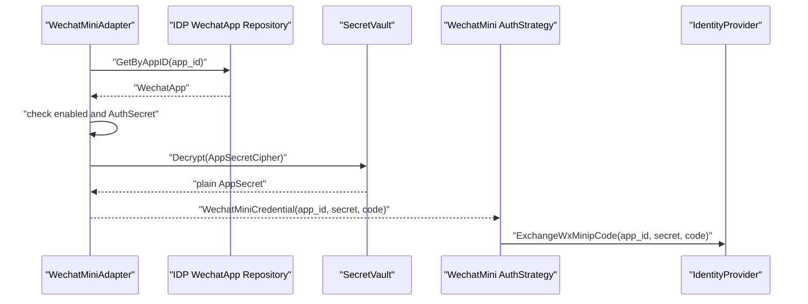
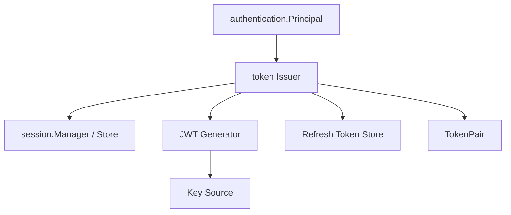
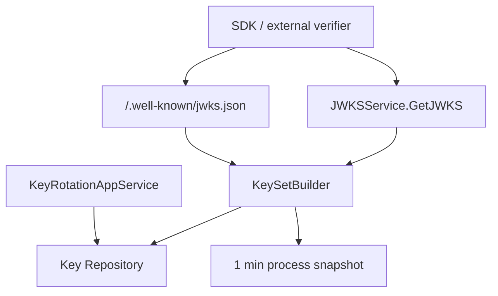

# 认证链路：从登录请求到 Token 与 JWKS

## 本文回答

本文回答：IAM 一次登录请求如何从 REST/gRPC transport 进入 AuthN application，如何通过 SignInAdapterCatalog 和 AuthStrategy 转换为认证决策，如何在 onboarding、session、token issue、JWT 签名和 JWKS/keyset 发布之间协作，以及这些设计为什么能同时支持多登录方式和可离线验签。

## 30 秒结论

- REST 当前登录入口是 `POST /api/v2/authn/login` 和 v2 `POST /api/v2/authn/login`；二者使用不同 request schema，但最终进入同一个 login application。
- 登录不是 handler 直接查账号，而是 `SignInAdapterCatalog -> MethodSelector -> AuthCredential proof -> Authenticator/AuthStrategy -> TokenIssuer`。
- 微信小程序和企业微信登录的 AppSecret 来自 IDP/WechatApp，解密通过 `SecretVault`，外部 code exchange 通过 AuthN domain 的 `IdentityProvider` 端口。
- 登录成功后由 token issuer 创建 session、签发 Access Token、保存 Refresh Token；JWT 编码在 `infra/token/jwt`，签名密钥来自 `infra/token/keyset`。
- JWKS 发布面只发布可发布公钥；在线 Verify 比离线 JWKS 验签多检查撤销、session 和 subject 状态。
- 设计模式主轴是 Adapter Catalog、Strategy、Ports & Adapters、DTO/Mapper、Cache Tag/Snapshot。

## 主图：登录到 JWKS 的跨层链路



## 重点速查

| 阶段 | 当前事实 | 代码证据 |
| ---- | ---- | ---- |
| REST 登录 | v1/v2 request 先映射为 login application request。 | [../../internal/apiserver/transport/rest/authn/handler/auth_login.go](../../internal/apiserver/transport/rest/authn/handler/auth_login.go)、[../../api/rest/authn.v2.yaml](../../api/rest/authn.v2.yaml)、[../../api/rest/authn.v2.yaml](../../api/rest/authn.v2.yaml) |
| Adapter catalog | password、phone_otp、wechat、wecom、bearer 适配器注册并拒绝重复。 | [../../internal/apiserver/application/authn/login/adapter_catalog.go](../../internal/apiserver/application/authn/login/adapter_catalog.go) |
| SignIn 编排 | 选择登录方法、准备 proof、调用 domain authenticator、签发 token。 | [../../internal/apiserver/application/authn/login/sign_in.go](../../internal/apiserver/application/authn/login/sign_in.go) |
| 领域认证 | Authenticator 按 CredentialType 选择 AuthStrategy。 | [../../internal/apiserver/domain/authn/authentication/authenticater.go](../../internal/apiserver/domain/authn/authentication/authenticater.go) |
| Token application | issue、refresh、verify、revoke 由 application/authn/token 承载。 | [../../internal/apiserver/application/authn/token](../../internal/apiserver/application/authn/token) |
| JWT 与 keyset | JWT codec 和 keyset/JWKS 是 infra 适配器。 | [../../internal/apiserver/infra/token/jwt](../../internal/apiserver/infra/token/jwt)、[../../internal/apiserver/infra/token/keyset](../../internal/apiserver/infra/token/keyset) |
| JWKS 合同 | REST `/.well-known/jwks.json`、`/api/v2/.well-known/jwks.json`，gRPC `JWKSService.GetJWKS`。 | [../../api/rest/authn.v2.yaml](../../api/rest/authn.v2.yaml)、[../../api/grpc/iam/authn/v2/authn.proto](../../api/grpc/iam/authn/v2/authn.proto) |

## 1. Transport：登录入口只做合同适配

REST handler 负责三件事：

1. 绑定 request。
2. 按登录方法把 payload 转成 login application request。
3. 调用 application service 并映射 response。

它不直接访问账号、凭据、session、JWT 或 JWKS。这样做是为了避免 REST v1/v2 合同差异污染认证领域模型。



v1 保留 legacy inference；v2 使用显式 method payload。二者进入同一应用服务后，后续链路一致。

## 2. Application：SignInAdapterCatalog 解决登录输入变化

登录方式的变化点在两个位置：

- wire payload 不同：password、phone OTP、wechat、wecom、bearer 的输入字段不一样。
- domain proof 不同：每种认证方式需要不同的 `AuthCredential`。

`SignInAdapterCatalog` 的作用是把这些变化点收拢到 adapter：



Adapter catalog 的关键约束：

- adapter 不能为空。
- `Kind()` 不能为空且不能重复。
- `AuthType()` 不能为空且不能重复。
- 对 domain proof 登录方式，adapter 必须实现 `PrepareProof`。
- 对 bearer 兼容方式，adapter 走 `Reauthenticate`，不进入 domain strategy。

## 3. Domain：Authenticator + AuthStrategy 解决认证算法变化

领域层的统一入口是 `Authenticator.Authenticate(ctx, proof)`。它先从 proof 读取 `CredentialType()`，再选择对应 `AuthStrategy`。



这个模式解决的是“新增认证方式时不改主登录编排”。SignIn 只知道自己要拿到 `AuthDecision`；各 strategy 自己处理 credential repository、account repository、password hasher、OTP verifier 或 IDP identity provider。

## 4. IDP 与微信登录的交叉点

微信小程序登录的 proof 构造发生在 application adapter，而不是 transport：



这里有两层 IDP：

- `domain/idp/wechatapp` 管理微信应用配置和 secret。
- AuthN domain 的 `IdentityProvider` 端口负责把 code 换成外部身份。

最终登录成功后的账号、session 和 token 仍由 AuthN 负责，不由 IDP 负责。

## 5. Token issue：session、Access Token、Refresh Token 的组合

登录成功后，SignIn 调用 token issuer。token issuer 的职责不是单纯签 JWT，而是把登录主体变成一组可在线管理的访问凭据：

- 创建或记录 session。
- 构造 Access Token claims。
- 用 JWT generator 签名 Access Token。
- 保存 Refresh Token。
- 返回 token pair。



Access Token 是短期 JWT；Refresh Token 是可轮换的长期凭证。二者生命周期的区别在 [02-IAM认证语义拆层--用户状态&会话&Token边界.md](02-IAM认证语义拆层--用户状态&会话&Token边界.md) 展开。

## 6. Verify、Refresh、Revoke 链路

| 能力 | 当前行为 | 关键差异 |
| ---- | ---- | ---- |
| Verify | 校验 Access Token，并可校验 expected issuer/audience。 | 在线 Verify 可接入撤销、session、subject 状态检查。 |
| Refresh | 读取 refresh token，校验后签发新 token pair。 | 刷新后旧 refresh token 删除或失效。 |
| Revoke access | 写 access token revoke marker。 | 适合单 token 失效。 |
| Revoke refresh | 删除 refresh token，并撤销关联 session。 | 适合终止续期能力。 |

这些能力由 `application/authn/token` 暴露给 REST/gRPC。JWT 离线验签只能证明 token 曾由 IAM 私钥签出，不能看到 Redis 中的撤销 marker 或 session 状态。

## 7. JWKS/keyset 发布与轮换



JWKS 发布只包含可发布密钥。keyset builder 会：

- 查询可发布密钥。
- 过滤 `ShouldPublish()` 的 key。
- 按 kid 排序，保证输出稳定。
- 生成 ETag 和 Last-Modified。
- 更新进程内 snapshot。

轮换服务的语义是：

1. 生成新 Active key。
2. 旧 Active key 进入 Grace。
3. 超出 MaxKeys 的旧 Grace key 进入 Retired。
4. 清理过期 Retired key。

## 8. 设计模式

| 模式 | 为什么用 | 解决的问题 | IAM 落地 | 代价和边界 |
| ---- | ---- | ---- | ---- | ---- |
| Adapter Catalog | 登录合同和登录方式持续变化。 | 避免 handler 和 SignIn 出现巨大条件分支。 | `SignInAdapterCatalog`、各登录 adapter。 | adapter 增加间接层，需要 contract test 保持对齐。 |
| Strategy | 不同凭据类型认证算法不同。 | 新增认证方式时不改 Authenticator 主流程。 | `AuthStrategy` + password/OTP/wechat/wecom strategy。 | strategy 只处理认证，不处理 token 签发。 |
| Ports & Adapters | 认证依赖密码哈希、OTP、IDP、JWT、Redis。 | domain/application 不绑定具体基础设施。 | IDP provider、SecretVault、JWT/keyset、stores。 | 端口缺失时需要 fail closed，而不是默认放行。 |
| DTO/Mapper | v1/v2 REST 与应用命令不一致。 | wire term 不污染 application/domain。 | authn request -> login request -> result response。 | mapper 必须随 OpenAPI 更新。 |
| Snapshot/Cache Tag | JWKS 被频繁读取且需要 HTTP 缓存语义。 | 避免每次都重新构建并支持 304。 | `KeySetBuilder` snapshot、ETag、Last-Modified。 | 进程内快照不是跨实例一致性机制。 |

## 9. 失败边界

| 失败点 | 当前边界 |
| ---- | ---- |
| adapter 找不到或 payload 非法 | 返回 invalid argument，不进入 domain authentication。 |
| Authenticator 未初始化 | 登录失败，不签发 token。 |
| 微信应用不存在、禁用、缺少 secret 或 secret 解密失败 | 微信登录失败，不回退到其他 app。 |
| AuthStrategy 返回不通过 | SignIn 通过 failure translator 转成业务错误。 |
| token issue 失败 | 登录整体失败，不返回部分 token。 |
| JWKS 无可发布 key | 返回空 JWKS JSON，而不是伪造 key。 |
| 离线验签通过但 token 已撤销 | 离线验签看不到撤销；需要在线 Verify。 |

## 10. 代码证据与验证

核心入口：

- REST AuthN：[../../internal/apiserver/transport/rest/authn](../../internal/apiserver/transport/rest/authn)
- gRPC AuthN：[../../internal/apiserver/transport/grpc/service/authn](../../internal/apiserver/transport/grpc/service/authn)
- Login application：[../../internal/apiserver/application/authn/login](../../internal/apiserver/application/authn/login)
- AuthN domain：[../../internal/apiserver/domain/authn](../../internal/apiserver/domain/authn)
- Token application：[../../internal/apiserver/application/authn/token](../../internal/apiserver/application/authn/token)
- JWKS application：[../../internal/apiserver/application/authn/jwks](../../internal/apiserver/application/authn/jwks)
- Token infra：[../../internal/apiserver/infra/token](../../internal/apiserver/infra/token)

建议验证：

```bash
go test ./internal/apiserver/domain/authn/... ./internal/apiserver/application/authn/... ./internal/apiserver/infra/token/... ./internal/apiserver/transport/rest/authn ./internal/apiserver/transport/grpc/service/authn
```
