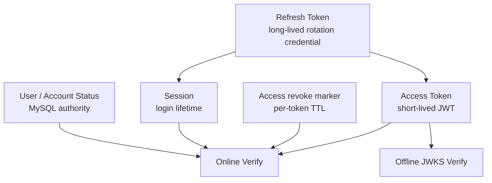
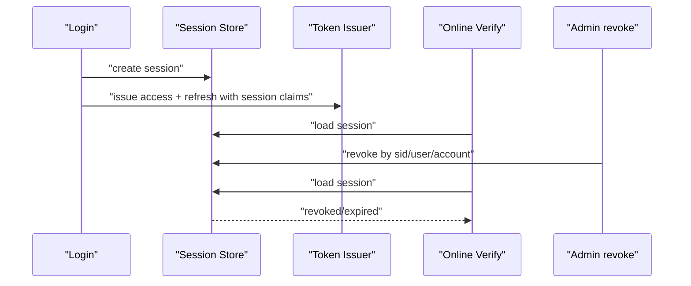
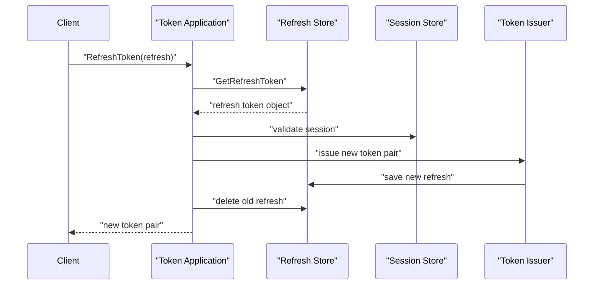

# IAM 认证语义拆层：用户状态、会话与 Token 边界

## 本文回答

本文回答：为什么 IAM 认证不能只依赖一个 JWT，为什么还需要用户/账号状态、Session、Access Token revoke marker 和 Refresh Token 四层语义；在线 Verify 与离线 JWKS 验签分别能保证什么；以及这些状态如何支撑“即时失效”和“低耦合离线验签”两个方向的取舍。

## 30 秒结论

- 用户/账号状态是 subject 能否继续访问的权威业务事实。
- Session 表达一次登录会话，用于登录态管理、按用户或账号批量撤销，以及 refresh 时的会话校验。
- Access Token 是短期 JWT；离线验签只校验签名和 claims，逐 token 撤销依赖在线 revoke marker。
- Refresh Token 是长期续期凭证；刷新后旧 token 被删除或失效，用来降低长期凭证泄漏风险。
- 需要“即时禁用”语义时使用在线 Verify 或缩短离线 token TTL；仅依赖 JWKS 离线验签无法看到撤销和 session 状态。

## 主图：四层认证语义



## 四层速查

| 层 | 主要事实 | 解决的问题 | 看不到什么 |
| ---- | ---- | ---- | ---- |
| 用户/账号状态 | User、Account、Credential 状态。 | 禁用用户、封禁账号、凭据生命周期。 | 单个 JWT 是否被撤销。 |
| Session | 一次登录态，关联 user/account 和过期时间。 | 批量撤销、在线状态、refresh 绑定。 | 资源级授权。 |
| Access Token | JWT claims、签名、issuer、audience、过期时间。 | 低成本访问凭证和离线验签。 | Redis 撤销、session、subject 当前状态。 |
| Refresh Token | 可续期凭证，存储端口保存。 | 长期续期和 token rotation。 | 业务资源权限。 |

## 1. 用户/账号状态：subject 的权威事实

用户和账号状态回答的是：“这个 subject 现在是否还允许作为 IAM 主体存在？”

典型场景：

- 用户被禁用后，新登录应失败。
- 账号被禁用后，相关认证方式应失败。
- Credential 被锁定、过期或轮换后，对应 proof 不应继续通过。

这些事实属于业务状态，不属于 JWT 自身。一个已经签出的 JWT 不会自动知道 MySQL 中的用户状态变化，所以需要在线 Verify 或短 TTL 策略配合。

## 2. Session：一次登录会话，不是 token 本身

Session 表达一次登录事件形成的会话生命周期。它不是 Access Token，也不是 Refresh Token；它是二者背后的在线状态锚点。



Session 解决三个 JWT 本身不适合解决的问题：

- 按用户或账号批量撤销登录态。
- Refresh 时确认这次续期仍属于有效登录会话。
- 给在线 Verify 一个可查询的登录状态。

## 3. Access Token：短期 JWT 与逐 token 撤销

Access Token 的优势是可以离线验证：

- 签名有效。
- `kid` 能在 JWKS 中找到对应公钥。
- issuer/audience 符合预期。
- `exp`、`nbf` 等时间 claims 合法。

但离线验证不能看到：

- token 是否被写入 revoke marker。
- session 是否已经被撤销。
- user/account 是否已禁用。
- 业务系统自己的资源授权。

所以 IAM 同时提供在线 Verify。在线 Verify 在基础签名校验之外，可以接入 revoke marker、session 和 subject 状态检查。

## 4. Refresh Token：续期凭证与轮换边界

Refresh Token 的作用是让客户端不必频繁重新登录。它比 Access Token 生命周期更长，也因此必须更严格管理。



刷新链路的核心不是“再签一个 JWT”，而是确认：

- refresh token 本身存在且未过期。
- 关联 session 仍有效。
- subject 状态仍允许继续访问。
- 旧 refresh token 不应继续无限复用。

## 5. 在线 Verify 与离线 JWKS

| 校验方式 | 依赖 | 能保证 | 不能保证 |
| ---- | ---- | ---- | ---- |
| 离线 JWKS | JWT、公钥、issuer/audience 配置。 | token 由 IAM 私钥签出，且 claims 当前时间有效。 | revoke、session、用户/账号状态、业务授权。 |
| 在线 Verify | IAM AuthN service、token store、session store、subject state。 | 离线项 + 在线失效语义。 | 业务系统自己的资源级授权。 |

离线 JWKS 适合高频、本地、低延迟校验；在线 Verify 适合安全敏感、需要即时失效的路径。业务系统可以混用：普通请求离线验签，高风险操作在线 Verify。

## 6. 撤销语义表

| 动作 | 影响范围 | 典型用途 |
| ---- | ---- | ---- |
| Revoke Access Token | 单个 access token。 | 退出当前请求凭证、检测到单 token 泄漏。 |
| Revoke Refresh Token | 单个 refresh token，通常同时终止续期能力。 | 客户端登出、刷新凭证泄漏。 |
| Revoke Session | 一次登录会话。 | 终止某设备登录态。 |
| Revoke Sessions By User | 某用户全部会话。 | 用户禁用、修改安全设置后强制下线。 |
| Revoke Sessions By Account | 某账号全部会话。 | 某认证账号被封禁或凭据风险。 |
| Disable User/Account | 后续登录和在线校验。 | 权威身份状态变更。 |

## 7. Redis 建模与 TTL 的关系

本专题只讲语义，具体 Redis 数据结构在 [06-IAM缓存层--数据结构选择与 Redis 建模判断.md](06-IAM缓存层--数据结构选择与%20Redis%20建模判断.md) 展开。

这里需要记住两个原则：

- Access revoke marker 用独立 key，是为了让每个 token 按自己的过期时间自然消失。
- Session index 使用 ZSet，是为了按 user/account 列举和批量撤销会话，并用 score 表达过期时间。

## 8. 设计模式

| 模式 | 为什么用 | 解决的问题 | IAM 落地 | 代价和边界 |
| ---- | ---- | ---- | ---- | ---- |
| Layered State | 不同失效语义不能混在一个 token 里。 | 同时支持离线验签和在线即时失效。 | User/Account、Session、Access、Refresh 四层。 | 需要清晰文档，否则调用方容易误以为 JWT 能看到一切。 |
| Repository/Store Port | 状态存储可能是 Redis/MySQL/测试内存实现。 | 应用服务不依赖具体存储实现。 | token store、session store、account/user repository。 | 端口失败时必须 fail closed。 |
| Token Rotation | 长期凭证不能无限复用。 | 降低 refresh token 泄漏后的窗口。 | Refresh 后签发新 pair，并处理旧 refresh。 | 客户端需要正确保存新 token。 |
| Revocation Marker | JWT 已签出，不能从 JWT 内部撤回。 | 单 access token 在线撤销。 | Redis marker + token 剩余 TTL。 | 离线验签看不到 marker。 |

## 9. 失败边界

| 场景 | 当前边界 |
| ---- | ---- |
| Access Token 过期 | 离线/在线都应失败。 |
| Access Token 已撤销 | 在线 Verify 失败；离线 JWKS 仍可能通过签名验证。 |
| Session 已撤销 | 在线 Verify 和 refresh 应失败。 |
| User/Account 被禁用 | 新登录失败；在线校验可拒绝继续访问。 |
| Refresh Token 不存在或已过期 | refresh 失败，不回退到重新签发。 |
| JWKS 缓存滞后 | 离线验签依赖 TTL 和 key grace period；需要合理设置刷新策略。 |

## 10. 代码证据与验证

核心入口：

- Token application：[../../internal/apiserver/application/authn/token](../../internal/apiserver/application/authn/token)
- Session domain：[../../internal/apiserver/domain/authn/session](../../internal/apiserver/domain/authn/session)
- Redis stores：[../../internal/apiserver/infra/redis](../../internal/apiserver/infra/redis)
- SDK verifier：[../../pkg/sdk/auth/verifier](../../pkg/sdk/auth/verifier)
- SDK JWKS manager：[../../pkg/sdk/auth/jwks](../../pkg/sdk/auth/jwks)

建议验证：

```bash
go test ./internal/apiserver/application/authn/token ./internal/apiserver/domain/authn/session ./internal/apiserver/infra/redis ./pkg/sdk/auth/verifier ./pkg/sdk/auth/jwks
```
