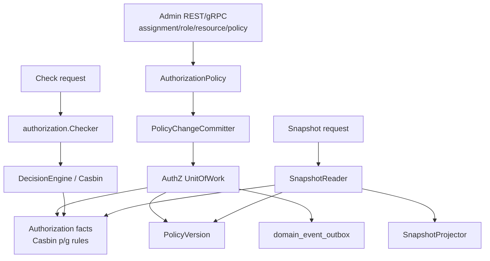
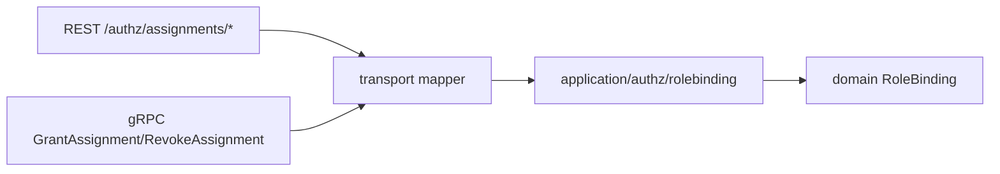
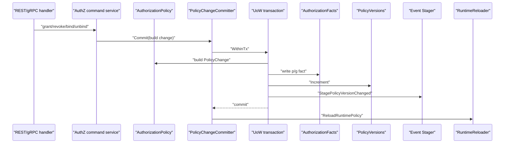
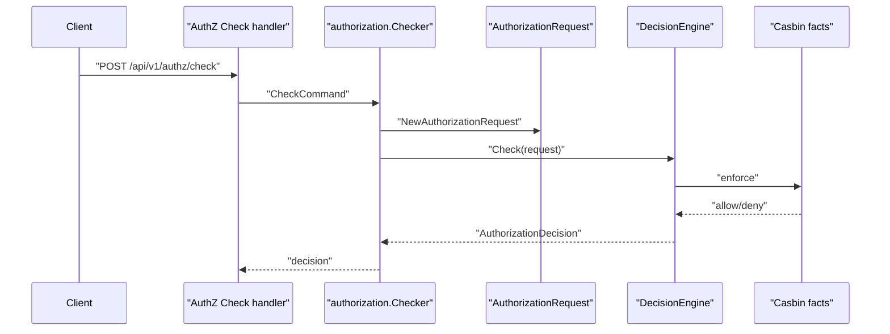
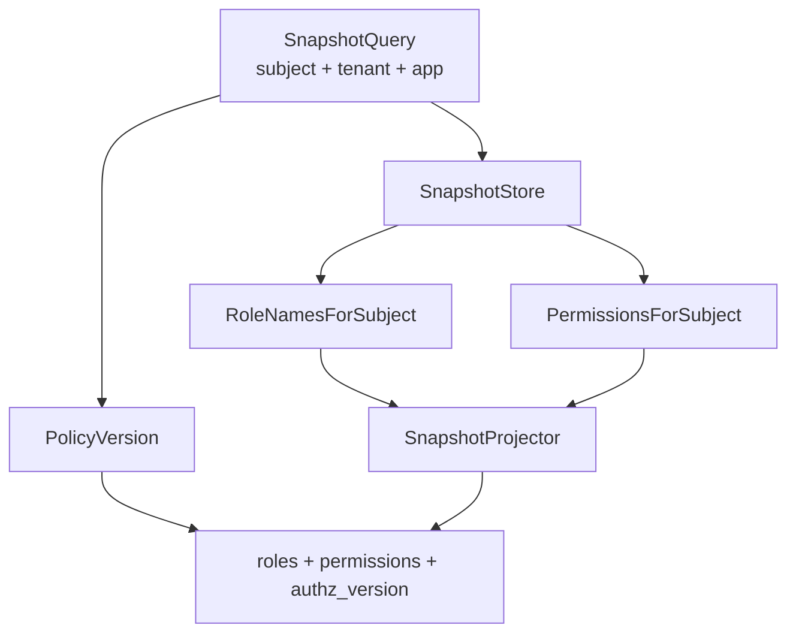

# 授权判定链路：角色、策略、资源、Assignment 与 Casbin

## 本文回答

本文回答：IAM AuthZ 如何从角色、资源、权限和公开 `assignment` 合同走到内部 `rolebinding`、Casbin facts、在线 PDP 判定、授权快照和 policy version；为什么写入链路要经过 PolicyChangeCommitter；以及 Casbin 在当前设计中扮演什么角色。

## 30 秒结论

- 公开 REST/proto 仍使用 `assignment` 作为 wire term；内部 application/domain 统一使用 `rolebinding`。
- 写授权事实时，domain `AuthorizationPolicy` 先产生 `PolicyChange`，application `PolicyChangeCommitter` 再在 UoW 中写业务事实、Casbin facts、policy version 和 outbox event。
- 在线 PDP 判定由 `authorization.Checker` 构造 `AuthorizationRequest`，再交给 `DecisionEngine`。
- 授权快照由 `SnapshotReader` 读取 subject 的角色和权限，再由 `SnapshotProjector` 按 app name 过滤和去重。
- Casbin 是授权事实和判定引擎适配器，不是 IAM 对外业务语言；业务语言仍是 Role、Resource、Permission、RoleBinding、PolicyChange。

## 主图：授权写入、判定、快照三条链



## 重点速查

| 关注点 | 当前事实 | 代码证据 |
| ---- | ---- | ---- |
| 授权模型 | Subject、Scope、Permission、RoleBinding、AuthorizationRequest、AuthorizationDecision。 | [../../internal/apiserver/domain/authz/model.go](../../internal/apiserver/domain/authz/model.go) |
| 授权策略 | `AuthorizationPolicy` 产生 grant/revoke/bind/unbind 的 `PolicyChange`。 | [../../internal/apiserver/domain/authz/policy/authorization_policy.go](../../internal/apiserver/domain/authz/policy/authorization_policy.go) |
| 写入事务 | `PolicyChangeCommitter` 在 UoW 中写 facts、version、outbox event。 | [../../internal/apiserver/application/authz/policy/committer.go](../../internal/apiserver/application/authz/policy/committer.go) |
| 在线判定 | `Checker.Check` 构造 domain request 后调用 decision engine。 | [../../internal/apiserver/application/authz/authorization/service.go](../../internal/apiserver/application/authz/authorization/service.go) |
| 授权快照 | `SnapshotReader` + `SnapshotProjector`。 | [../../internal/apiserver/application/authz/authorization/service.go](../../internal/apiserver/application/authz/authorization/service.go) |
| Casbin adapter | 管理 p/g facts 和 Enforce。 | [../../internal/apiserver/infra/casbin](../../internal/apiserver/infra/casbin) |
| REST/gRPC | REST `/api/v1/authz/*`，gRPC `AuthorizationService`。 | [../../api/rest/authz.v1.yaml](../../api/rest/authz.v1.yaml)、[../../api/grpc/iam/authz/v1/authz.proto](../../api/grpc/iam/authz/v1/authz.proto) |

## 1. 术语边界：assignment 是 wire term，rolebinding 是内部事实



这条边界的目的不是制造两个概念，而是兼容公开合同：

- 对外：接入方熟悉的是 `assignment`，表示“给主体分配角色”。
- 对内：领域事实是 `rolebinding`，表示 subject 与 role 的绑定。

文档和代码不能把内部实现重新写成 assignment 包；公开合同也不应突然改名为 rolebinding。

## 2. 授权写入：PolicyChangeCommitter 的事务边界

授权写入不是简单 CRUD。以授予权限或绑定角色为例，需要同时维护：

- 业务记录。
- Casbin 可判定 facts。
- policy version。
- durable outbox event。
- runtime policy reload。



`PolicyChangeCommitter` 的顺序很关键：

1. 在事务里构建 `PolicyChange`。
2. 执行 before facts mutation。
3. 写授权 facts。
4. 执行 after facts mutation。
5. 递增 policy version。
6. stage policy version changed event。
7. 事务提交后 reload runtime policy。

这样做的原因是：授权事实和版本事件必须共同提交；runtime reload 不是数据库事实的一部分，放在事务后执行。

## 3. 在线 PDP 判定

在线判定的输入是 subject、tenant、resource key、action、scope。



`Checker` 自身不直接知道 Casbin 模型，它只依赖 `DecisionEngine` 端口。这样 application 可以测试 request 构造和边界，而 infra adapter 承担 Casbin 的 p/g 规则和 Enforce。

## 4. 授权快照：接入方缓存的读模型

授权快照不是把全量 IAM 授权表吐出去，而是按 subject、tenant、app_name 投影：



`SnapshotProjector` 做两件事：

- roles：只保留以 `appName + ":"` 为前缀的 role name，并去重。
- permissions：只保留以 `appName + ":"` 为前缀的 resource key，并按 resource/action/scope 去重。

`authz_version` 让接入方能判断本地缓存是否需要刷新。

## 5. Casbin 的位置

Casbin 负责运行时判定和 facts 存储适配，但它不是业务语言本身。

| 层 | 语言 |
| ---- | ---- |
| 公开合同 | assignment、check、snapshot。 |
| application/domain | rolebinding、Permission、AuthorizationRequest、PolicyChange。 |
| infra/casbin | p rule、g rule、Enforce。 |

这个分层避免了两个问题：

- 把 Casbin p/g 规则暴露给外部接入方。
- 在业务代码里直接拼 Casbin 参数，导致领域语义丢失。

## 6. 设计模式

| 模式 | 为什么用 | 解决的问题 | IAM 落地 | 代价和边界 |
| ---- | ---- | ---- | ---- | ---- |
| Policy Object | 授权变化是领域动作，不是表操作。 | grant/revoke/bind/unbind 统一输出 PolicyChange。 | `AuthorizationPolicy`。 | 只表达授权事实变化，不做 transport 映射。 |
| Unit of Work | 授权写入涉及多 repository 和 outbox。 | 业务事实、Casbin facts、version、event 一致提交。 | `PolicyChangeCommitter` + AuthZ UoW。 | 事务边界变重，读路径不应滥用。 |
| Ports & Adapters | 判定引擎可替换，application 不绑定 Casbin。 | application 可独立测试。 | `DecisionEngine`、`SnapshotStore`。 | adapter 需要合同测试锁定行为。 |
| Projection | 接入方只需要某 app 的授权快照。 | 避免暴露全量授权事实。 | `SnapshotProjector`。 | 需要 role/resource 命名约定稳定。 |
| Transactional Outbox | 授权版本事件必须可靠投递。 | DB 提交与消息发布一致性。 | `StagePolicyVersionChanged`。 | 投递异步，接入方要处理延迟。 |

## 7. 失败边界

| 场景 | 当前边界 |
| ---- | ---- |
| Checker 缺少 decision engine | 返回内部错误，不默认允许。 |
| SnapshotReader 缺少 store 或 version repository | 返回内部错误，不返回不完整快照。 |
| Snapshot query 缺 subject、tenant 或 app | 返回参数错误。 |
| PolicyChange 缺 permission/rolebinding | committer 返回内部错误。 |
| 写 facts 成功但 version/event stage 失败 | UoW 回滚，避免只提交部分事实。 |
| runtime reload 失败 | 业务事实已提交；需要运行时和日志排查，不应回滚数据库事实。 |

## 8. 代码证据与验证

核心入口：

- AuthZ domain：[../../internal/apiserver/domain/authz](../../internal/apiserver/domain/authz)
- AuthZ application：[../../internal/apiserver/application/authz](../../internal/apiserver/application/authz)
- Casbin adapter：[../../internal/apiserver/infra/casbin](../../internal/apiserver/infra/casbin)
- REST AuthZ：[../../internal/apiserver/transport/rest/authz](../../internal/apiserver/transport/rest/authz)
- gRPC AuthZ：[../../internal/apiserver/transport/grpc/service/authz](../../internal/apiserver/transport/grpc/service/authz)

建议验证：

```bash
go test ./internal/apiserver/domain/authz/... ./internal/apiserver/application/authz/... ./internal/apiserver/infra/casbin ./internal/apiserver/transport/rest/authz ./internal/apiserver/transport/grpc/service/authz
```
