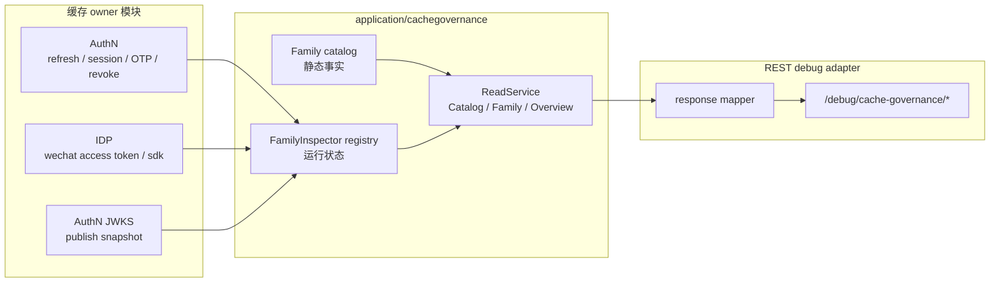
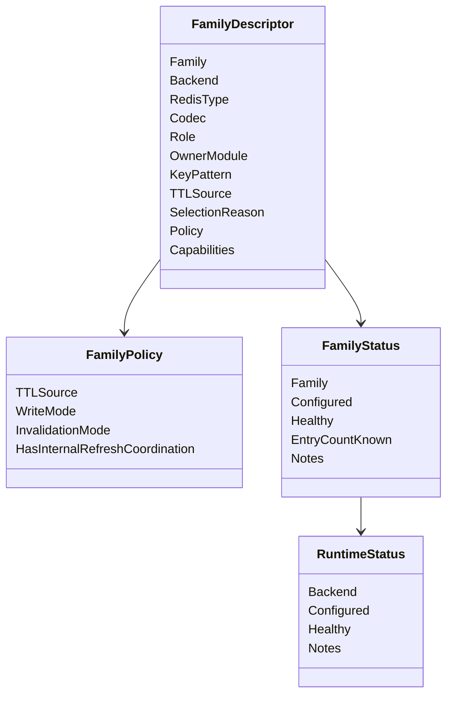
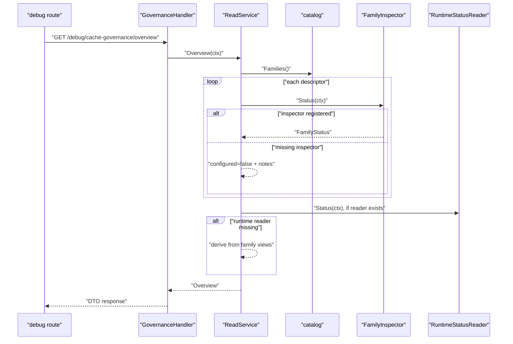
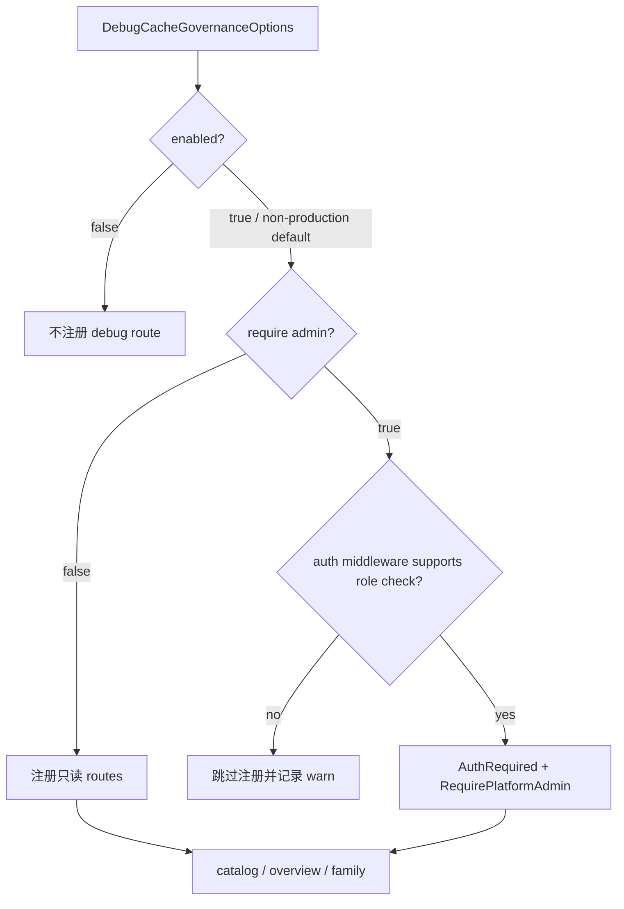

# IAM 缓存层：缓存层的设计与治理

本文回答：IAM 为什么需要一个独立的 CacheGovernance 读侧治理面；它如何把 AuthN、IDP、JWKS 等分散缓存族统一成可解释、可检查、可维护的目录；以及它为什么只做 inspect/catalog，不做在线清理、改写或业务兜底。

## 30 秒结论

- CacheGovernance 的核心不是“缓存实现”，而是“缓存族目录 + 只读运行状态”。静态目录定义在 [../../internal/apiserver/application/cachegovernance/catalog.go](../../internal/apiserver/application/cachegovernance/catalog.go)，运行状态由各模块 inspector 提供。
- 当前治理面覆盖 10 个 family：AuthN refresh token、revoked access token、session、session index、OTP、IDP 微信 access token、微信 SDK 缓存、JWKS 发布快照。
- 治理面是读模型：它可以说明缓存属于谁、怎么编码、TTL 从哪里来、为什么选这种结构、当前 inspector 是否健康；它不负责清空缓存、不参与认证授权判定，也不把 debug 接口变成运维写入口。
- REST debug 面在 `/debug/cache-governance/*`，由 [../../internal/apiserver/transport/rest/debug_routes.go](../../internal/apiserver/transport/rest/debug_routes.go) 注册；生产模式默认要求平台管理员保护。
- 这个专题讲治理模型；Redis 数据结构选择的细节见 [06-IAM缓存层--数据结构选择与 Redis 建模判断.md](06-IAM缓存层--数据结构选择与%20Redis%20建模判断.md)。

## 主图：从分散缓存到统一治理面



这个设计把两个容易混淆的问题分开了：

- 缓存读写由各业务或基础设施模块自己负责，例如 AuthN session store、IDP token cache、JWKS keyset builder。
- 缓存治理只汇总元数据和运行状态，帮助开发、运维和评审者回答“当前有哪些缓存、谁拥有、怎么过期、是否可检查、缺 inspector 会怎样”。

## 当前缓存族速查

| Family | Owner | 后端 | 数据结构 / 编码 | 数据角色 | TTL 来源 | 选择原因 |
| ---- | ---- | ---- | ---- | ---- | ---- | ---- |
| `authn.refresh_token` | AuthN | Redis | String / JSON | authoritative_state | `token.RemainingDuration()` | 单 token 单对象，整对象读写，key 级 TTL。 |
| `authn.revoked_access_token` | AuthN | Redis | String / marker | marker_state | 调用方传入 expiry | 只关心存在性，且逐 token 独立 TTL。 |
| `authn.session` | AuthN | Redis | String / JSON | authoritative_state | `session.ExpiresAt` | 会话主对象按 sid 独立寻址。 |
| `authn.user_session_index` | AuthN | Redis | ZSet / string | authoritative_state | 成员 score 取会话过期时间 | 按用户列举、批量回收、懒清理。 |
| `authn.account_session_index` | AuthN | Redis | ZSet / string | authoritative_state | 成员 score 取会话过期时间 | 按账号列举、批量回收、懒清理。 |
| `authn.login_otp` | AuthN | Redis | String / marker | marker_state | OTP 有效期 | 一次性存在性语义，适合原子消费。 |
| `authn.login_otp_send_gate` | AuthN | Redis | String / marker | marker_state | 发送冷却时间 | cooldown 占位 key。 |
| `idp.wechat_access_token` | IDP | Redis | String / JSON | remote_token_cache | 应用层计算后传入 | 单 app 单对象，带内部刷新协调。 |
| `idp.wechat_sdk` | IDP | Redis | String / string | remote_token_cache | 调用方传入 | 值本身就是 token 或 ticket 字符串。 |
| `authn.jwks_publish_snapshot` | AuthN | Memory | object | derived_snapshot | 进程内复用窗口 | 当前是单进程派生发布快照，无跨实例共享需求。 |

这张表是 `catalog.go` 的文档化视图。文档不应该手工发明 family；如果新增缓存族，应先补 catalog、inspector、测试，再补这里。

## 深度链路一：Catalog 如何成为缓存事实源



`FamilyDescriptor` 是治理面的静态事实，表达“这个 family 被设计成什么”。它包含：

- `Backend`：redis 或 memory。
- `RedisType`：治理视角下的数据结构，内存 family 使用 `none`。
- `Codec`：value 编码，例如 JSON、marker、string、memory object。
- `Role`：数据角色，例如 authoritative state、marker state、remote token cache、derived snapshot。
- `SelectionReason`：为什么选择这种结构，防止后续维护者只看到 key，不知道设计取舍。
- `Policy`：TTL、写入方式、失效方式、是否有内部刷新协调。
- `Capabilities`：当前只有 `inspect`，这点很关键，因为治理面不是 mutation API。

这种 catalog 设计解决的是“缓存知识散落”的问题。没有 catalog 时，缓存事实只能从 Redis key、store 代码、业务服务和运维经验里拼；重构之后，每个缓存族至少有一个稳定的解释入口。

## 深度链路二：ReadService 如何聚合静态目录和运行状态



`ReadService` 做了三层聚合：

1. `Catalog(ctx)` 返回静态目录，不依赖 Redis 或内存状态。
2. `Family(ctx, family)` 返回某个 family 的静态描述和运行状态；未知 family 返回错误，由 REST handler 映射为 404。
3. `Overview(ctx)` 遍历所有 family，按 backend 汇总 runtime status。

`FamilyInspector` 缺失时不会 panic，也不会让整个 overview 失败，而是返回：

- `Configured=false`
- `Healthy=false`
- `EntryCountKnown=false`
- `Notes=["未注册 FamilyInspector，当前只返回静态目录信息。"]`

这是一种有意的降级语义：治理面可以在模块不完整时继续告诉你“目录事实存在，但运行检查不可用”。它不假装健康，也不阻塞主业务启动。

## 深度链路三：debug 路由为什么只读



debug 面当前只有三个读接口：

| 路由 | handler | 语义 |
| ---- | ---- | ---- |
| `/debug/cache-governance/catalog` | `GetCatalog` | 返回静态 family catalog。 |
| `/debug/cache-governance/overview` | `GetOverview` | 返回所有 family 视图和 backend 运行状态。 |
| `/debug/cache-governance/families/:family` | `GetFamily` | 返回单 family 视图；未知 family 返回 404。 |

handler 的失败边界很明确：

- `ReadService` 未初始化时返回 503。
- family 不存在时返回 404。
- inspector 读取失败时，不直接让 HTTP 请求失败，而是在 family status 里表达 unhealthy 和错误 notes。

不提供 delete、flush、rebuild、force refresh 之类写接口，是因为这些动作都有业务后果。例如刷新 token、撤销 token、重建 JWKS、清理 session index 都必须通过对应 owner 模块的应用服务或运维流程完成。治理面如果越权提供写能力，会绕过领域规则、审计和事务边界。

## 设计模式

| 模式 | 为什么用 | 解决什么问题 | IAM 落地 | 代价和边界 |
| ---- | ---- | ---- | ---- | ---- |
| Read Model | 运维观测形状不同于业务写模型。 | 不让 debug/inspect 反向污染 AuthN、IDP、JWKS 写路径。 | `FamilyDescriptor`、`FamilyView`、`Overview`。 | 读模型可能滞后于新缓存实现，需要维护 catalog。 |
| Registry | inspector 来自不同模块，需要统一收集。 | 避免 `ReadService` 硬编码 Redis store 或 IDP 实现。 | `NewReadService(inspectors)` 按 family 注册。 | family 名冲突或未注册 inspector 只能在测试和运行状态里发现。 |
| Ports & Adapters | 治理服务不应依赖具体 Redis client。 | 让 AuthN、IDP、memory snapshot 各自提供只读状态。 | `FamilyInspector`、`RuntimeStatusReader`。 | 只能看到 port 暴露的信息，不做深层诊断。 |
| Fail Soft / Explicit Degradation | debug 面不能影响主业务。 | inspector 缺失或读取失败时仍返回可解释状态。 | `configured=false`、`healthy=false`、`notes`。 | 需要监控读取 notes，否则容易忽略不健康状态。 |
| DTO/Mapper | 内部治理模型不应直接绑定 HTTP JSON。 | 后续调整字段或响应格式更容易。 | [../../internal/apiserver/transport/rest/cachegovernance/response](../../internal/apiserver/transport/rest/cachegovernance/response)。 | Mapper 需要随模型演进同步维护。 |

## 失败边界

| 场景 | 当前行为 | 设计含义 |
| ---- | ---- | ---- |
| 缓存治理服务未初始化 | debug handler 返回 503。 | 这是运行时装配问题，不伪装为空 catalog。 |
| family 不存在 | `ReadService.Family` 返回错误，REST 映射为 404。 | family 名必须来自 catalog。 |
| inspector 未注册 | family view 仍返回，但 `Configured=false`。 | 静态事实和运行检查分离。 |
| inspector 查询失败 | family view 返回 unhealthy notes。 | 单个 family 的诊断失败不拖垮 overview。 |
| runtime reader 未注册 | `ReadService` 从 family views 推导 backend status。 | 后端级状态是增强能力，不是必需依赖。 |
| 生产环境暴露 debug route | 默认要求平台管理员保护；authz 不可用时跳过注册。 | debug 面要 fail closed，而不是降级裸露。 |

## 与其他专题的关系

- AuthN token/session/JWKS 的业务语义见 [01-认证链路--从登录请求到 Token 与 JWKS.md](01-认证链路--从登录请求到%20Token%20与%20JWKS.md) 和 [02-IAM认证语义拆层--用户状态&会话&Token边界.md](02-IAM认证语义拆层--用户状态&会话&Token边界.md)。
- Redis 数据结构取舍见 [06-IAM缓存层--数据结构选择与 Redis 建模判断.md](06-IAM缓存层--数据结构选择与%20Redis%20建模判断.md)。
- IDP 微信 access token 的 cache-aside 链路见 [08-IDP与微信登录链路--WechatApp到AuthNProof.md](08-IDP与微信登录链路--WechatApp到AuthNProof.md)。
- 运行时 debug route 的开关和降级边界见 [../01-运行时/04-健康检查&debug 路由与降级启动边界.md](../01-运行时/04-健康检查&debug%20路由与降级启动边界.md)。

## 代码证据与验证

| 事实 | 代码 |
| ---- | ---- |
| 缓存族 catalog | [../../internal/apiserver/application/cachegovernance/catalog.go](../../internal/apiserver/application/cachegovernance/catalog.go) |
| ReadService 聚合逻辑 | [../../internal/apiserver/application/cachegovernance/service.go](../../internal/apiserver/application/cachegovernance/service.go) |
| JWKS 内存快照 inspector | [../../internal/apiserver/application/cachegovernance/jwks_inspector.go](../../internal/apiserver/application/cachegovernance/jwks_inspector.go) |
| Redis inspectors | [../../internal/apiserver/infra/redis](../../internal/apiserver/infra/redis) |
| REST debug handler | [../../internal/apiserver/transport/rest/cachegovernance/handler/governance.go](../../internal/apiserver/transport/rest/cachegovernance/handler/governance.go) |
| debug route 注册 | [../../internal/apiserver/transport/rest/debug_routes.go](../../internal/apiserver/transport/rest/debug_routes.go) |

建议验证：

```bash
go test ./internal/apiserver/application/cachegovernance ./internal/apiserver/infra/redis ./internal/apiserver/transport/rest
make docs-hygiene
```
