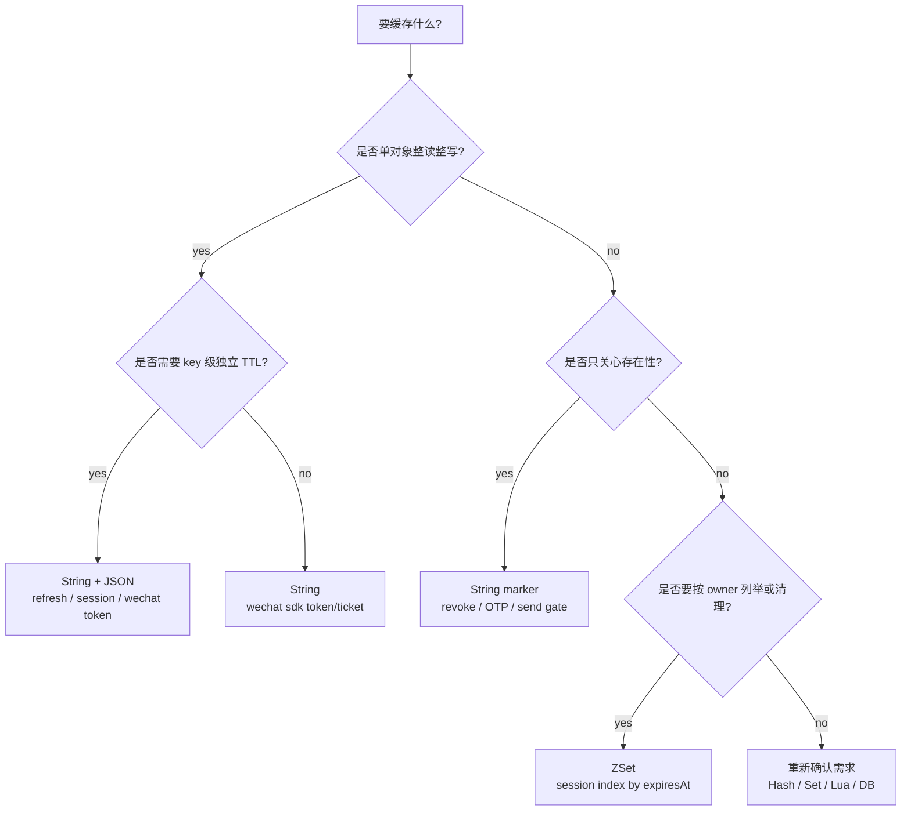
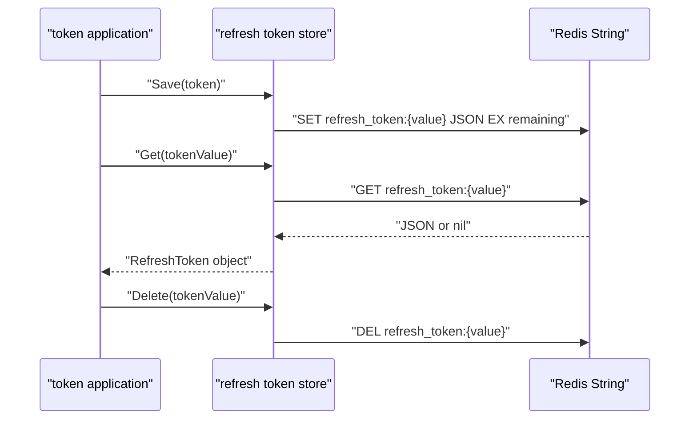
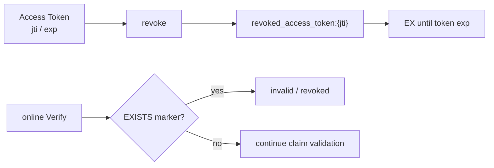
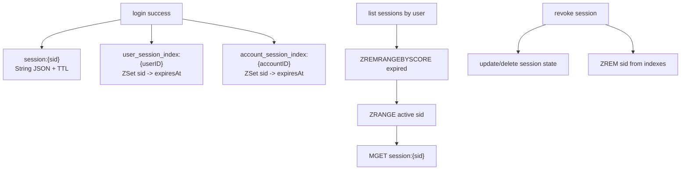
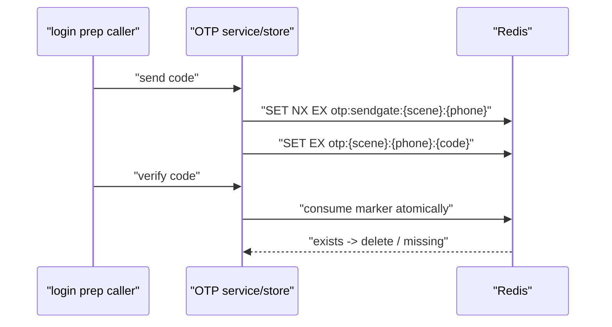
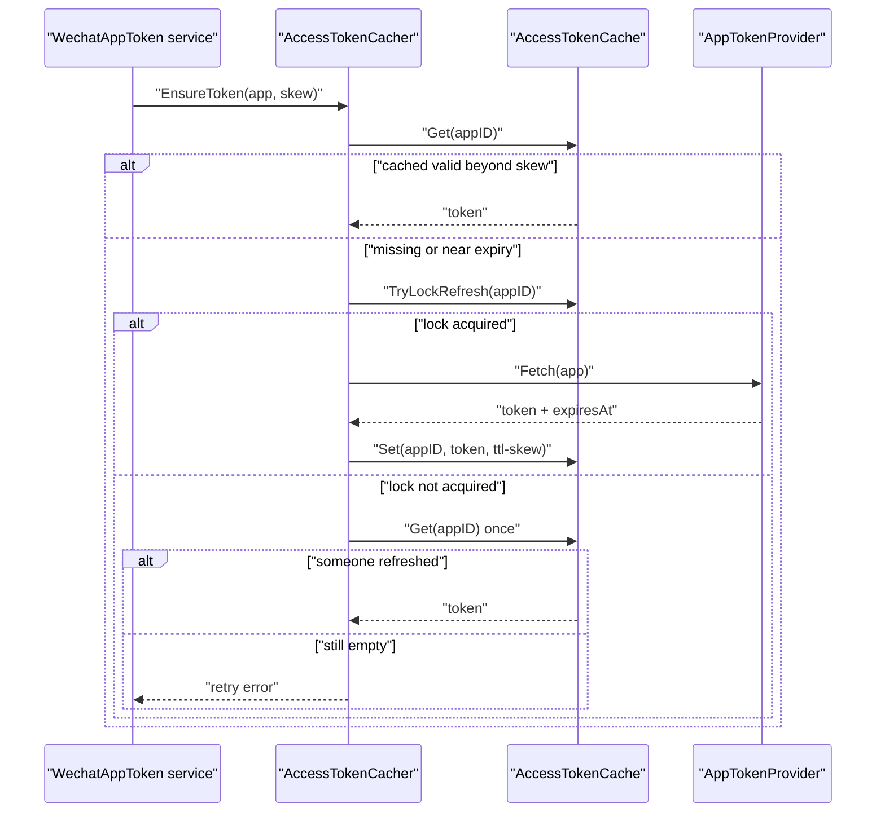
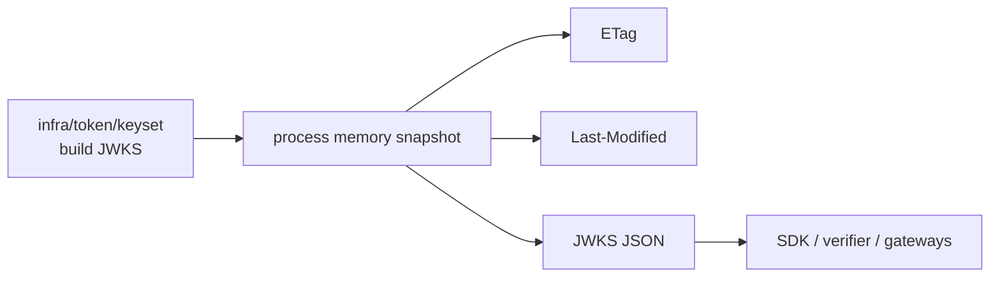

# IAM 缓存层：数据结构选择与 Redis 建模判断

本文回答：IAM 为什么大量缓存族选择 Redis String，为什么 session index 使用 ZSet，为什么撤销 token 不使用 Set，为什么 JWKS 发布快照是内存对象；以及这些选择分别解决什么问题、带来什么代价。

## 30 秒结论

- IAM 的 Redis 建模原则是：先看访问语义，再选数据结构。单对象、整对象读写、独立 TTL 优先 String；存在性判断优先 marker；需要按时间排序或批量回收才用 ZSet。
- `authn.revoked_access_token` 不使用 Redis Set，因为 Set 无法给单个 member 设置独立 TTL。撤销 access token 需要每个 token marker 随自身过期时间自然消失。
- session 主对象和 session index 分开建模：`session:{sid}` 保存 authoritative session object，`user_session_index:{userID}` / `account_session_index:{accountID}` 保存 sid 到过期时间的索引。
- IDP 微信 access token 是 cache-aside + refresh lock，不是简单 KV；缓存族 catalog 用 `HasInternalRefreshCoordination=true` 标识这个事实。
- `authn.jwks_publish_snapshot` 当前是 process-local memory snapshot，因为它是派生发布视图，不是跨实例共享状态。

## 主图：从访问语义到 Redis 类型



这张图背后的工程判断是：缓存结构越复杂，维护成本越高。只有当查询、清理、并发或一致性需求真的需要某种结构时，才升级为 Hash、Set、ZSet、Lua 或事务封装。

## 当前建模矩阵

| Family | Key pattern | Redis 类型 | Value codec | 写入方式 | 失效方式 | 为什么这样建模 |
| ---- | ---- | ---- | ---- | ---- | ---- | ---- |
| `authn.refresh_token` | `refresh_token:{tokenValue}` | String | JSON | 整体写入 | TTL 到期或显式删除 | Refresh Token 是单 token 主对象，需要独立生命周期。 |
| `authn.revoked_access_token` | `revoked_access_token:{tokenID}` | String | marker | marker 写入 | TTL 到期 | 只需判定 tokenID 是否已撤销，每个 token 独立过期。 |
| `authn.session` | `session:{sid}` | String | JSON | 整体写入 | TTL 到期或主动撤销后自然过期 | session 主对象按 sid 获取，字段不需要局部更新。 |
| `authn.user_session_index` | `user_session_index:{userID}` | ZSet | string | `ZADD sid -> expiresAtUnix` | 撤销移除，读取前懒清理 | 按用户列举和批量回收 session。 |
| `authn.account_session_index` | `account_session_index:{accountID}` | ZSet | string | `ZADD sid -> expiresAtUnix` | 撤销移除，读取前懒清理 | 按账号列举和批量回收 session。 |
| `authn.login_otp` | `otp:{scene}:{phoneE164}:{code}` | String | marker | marker 写入 + 原子消费 | 消费删除或 TTL 到期 | OTP 是一次性存在性凭证。 |
| `authn.login_otp_send_gate` | `otp:sendgate:{scene}:{phoneE164}` | String | marker | `SET NX EX` | TTL 到期 | 发送冷却是短生命周期 gate。 |
| `idp.wechat_access_token` | `idp:wechat:token:{appID}` | String | JSON | 整体写入 | TTL 到期或刷新覆盖 | 外部 access token 是单 app 远程 token cache。 |
| `idp.wechat_sdk` | 由微信 SDK 调用方提供 | String | string | 字符串整体写入 | TTL 到期或显式删除 | 值本身就是 token 或 ticket 字符串。 |
| `authn.jwks_publish_snapshot` | 无 Redis key | Memory | object | 重建快照覆盖内存字段 | 重建刷新 | JWKS 发布视图是派生快照，当前无跨实例共享需求。 |

## 深度链路一：Refresh Token 为什么是 String JSON



Refresh Token 的关键特征：

- 读写单位是 token 对象，不是对象里的某个字段。
- 每个 token 有自己的剩余有效期。
- 刷新和撤销都围绕一个 token value。
- JSON 编码方便表达 token 的元数据，Redis key TTL 承载过期语义。

如果改用 Hash，会引入字段级更新能力，但当前没有这个需求，反而要额外处理 Hash key TTL、字段兼容和局部更新不变量。

## 深度链路二：Access Token revoke marker 为什么不用 Set



撤销 Access Token 的需求不是“保存一个撤销集合”，而是“某个 tokenID 在它原本有效期内被标记为撤销”。Redis Set 的问题是：

- Set 可以聚合 tokenID，但无法给单个 member 设置独立 TTL。
- 如果整个 Set 设置 TTL，会让不同过期时间的 token 相互影响。
- 如果永不过期，需要额外清理任务和数据膨胀治理。

使用独立 marker key 后，撤销状态和 token 原始过期时间对齐，Redis 自然淘汰即可完成清理。这是“用 key 级 TTL 表达业务生命周期”的典型选择。

## 深度链路三：session 主对象与 ZSet 索引为什么分离



session 有两类访问路径：

- 按 sid 获取主对象：适合 String。
- 按 user 或 account 列举、批量撤销、懒清理过期 session：适合 ZSet。

ZSet score 使用 session 过期时间，因此读取前可以按 score 清理过期成员。这样避免了 index key 必须和每个 session 拥有相同 TTL 的问题，也避免了把 session 主对象塞进一个大集合导致单条 session 生命周期难以管理。

代价是主对象和索引之间存在短暂不一致可能。例如 session key 已过期但 ZSet 成员还没清理。当前设计通过读取前懒清理和按 sid 回表来吸收这种不一致。

## 深度链路四：OTP 和 send gate 为什么是 marker



OTP 本身不是持久账户事实，只是短生命周期登录凭证。send gate 也不是业务对象，只是防抖门闩。因此它们都不需要 JSON 对象，也不需要集合结构：

- OTP marker 表达“这个 code 在这个 scene 和 phone 下是否有效”。
- send gate marker 表达“这个 scene 和 phone 当前是否处于发送冷却期”。
- TTL 是核心语义，value 内容不是核心语义。

## 深度链路五：IDP 微信 access token 为什么是 cache-aside + lock



微信 access token 的难点是外部获取成本和并发刷新：

- 多个请求同时发现 token 快过期时，不应该全部打到微信 API。
- token 需要提前刷新，避免拿到马上过期的 token。
- 外部 provider 失败时，不能把空 token 写进缓存。

因此 `AccessTokenCacher` 使用 cache-aside：先读缓存，缓存不可用时尝试刷新锁，拿锁者调用 provider 并写回；未拿到锁者再读一次缓存，否则返回 retry 语义。catalog 里的 `HasInternalRefreshCoordination=true` 就是这个事实的治理表达。

## 深度链路六：JWKS publish snapshot 为什么不是 Redis



JWKS 发布快照与 Redis 缓存不同：

- 它是签名 keyset 的派生视图，不是业务写模型。
- 当前实现使用进程内 1 分钟复用窗口，减少重复构建。
- 它需要被治理面看见，所以作为 `authn.jwks_publish_snapshot` 纳入 catalog。
- 它当前不承诺跨实例共享；如果未来需要跨实例一致的 JWKS cache，应先调整架构和测试，再修改 catalog。

## 设计模式

| 模式 | 为什么用 | 解决什么问题 | IAM 落地 | 代价和边界 |
| ---- | ---- | ---- | ---- | ---- |
| Data Structure as Policy | Redis 类型就是业务访问策略的一部分。 | 防止缓存结构随意升级或误用。 | catalog 的 `RedisType`、`Codec`、`SelectionReason`。 | 需要文档和测试一起维护。 |
| Marker State | 存在性比对象内容更重要。 | 撤销 token、OTP、冷却 gate 的 value 不应复杂化。 | `revoked_access_token`、`login_otp`、`login_otp_send_gate`。 | marker 只能表达简单状态，复杂审计要走业务日志或 DB。 |
| Secondary Index | 主对象访问和按 owner 查询是两种路径。 | session 既要 sid 获取，又要用户/账号级枚举。 | `session:{sid}` + session index ZSet。 | 主对象和索引可能短暂不一致，需要懒清理和回表。 |
| Cache Aside | 外部 token 获取成本高且有明确过期时间。 | 避免每次调用微信 API，又不让缓存成为唯一事实源。 | `AccessTokenCacher`。 | 外部 provider 不可用时仍可能失败。 |
| Process-local Snapshot | 派生发布视图读频高、构建可复用。 | JWKS 发布减少重复构建，保持接口轻量。 | `authn.jwks_publish_snapshot`。 | 当前不是跨实例共享缓存。 |

## 失败边界

| 场景 | 当前选择 | 风险控制 |
| ---- | ---- | ---- |
| revoked marker TTL 计算错误 | marker 可能过早消失或保留过久。 | TTL 必须来自 token expiry；在线 Verify 仍要校验 JWT exp。 |
| session index 残留过期 sid | 查询时可能读到已过期 sid。 | ZSet 按 score 懒清理，并回表加载 session 主对象。 |
| OTP marker 被重复消费 | 登录凭证可能复用。 | store 需要原子消费；文档不把 OTP 写成普通 GET/DEL。 |
| 微信 access token 并发刷新 | 可能打爆外部 provider 或写入竞争。 | `TryLockRefresh` + 二次读缓存。 |
| JWKS 多实例发布差异 | 离线验证方可能看到不同实例快照。 | 当前文档只描述现状，不承诺跨实例共享；生产网关应按公开 JWKS/issuer 配置缓存策略。 |

## 代码证据与验证

| 事实 | 代码 |
| ---- | ---- |
| 缓存族结构与选择原因 | [../../internal/apiserver/cache/catalog.go](../../internal/apiserver/cache/catalog.go) |
| AuthN session domain | [../../internal/apiserver/domain/authn/session](../../internal/apiserver/domain/authn/session) |
| AuthN token 应用服务 | [../../internal/apiserver/application/authn/token](../../internal/apiserver/application/authn/token) |
| IDP access token cache-aside | [../../internal/apiserver/domain/idp/wechatapp/accesstoken-cacher.go](../../internal/apiserver/domain/idp/wechatapp/accesstoken-cacher.go) |
| Redis 基础设施实现 | [../../internal/apiserver/infra/cache/redis](../../internal/apiserver/infra/cache/redis) |
| JWKS keyset | [../../internal/apiserver/infra/token/keyset](../../internal/apiserver/infra/token/keyset) |

建议验证：

```bash
go test ./internal/apiserver/application/cachegovernance ./internal/apiserver/infra/cache/redis ./internal/apiserver/infra/token/...
make docs-hygiene
```
