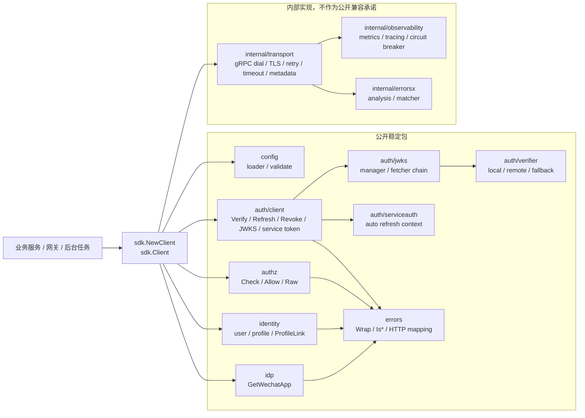
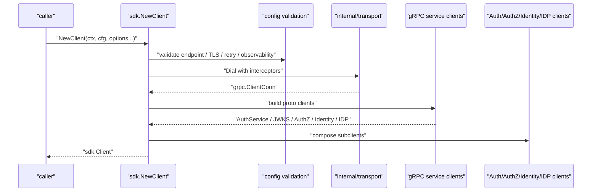
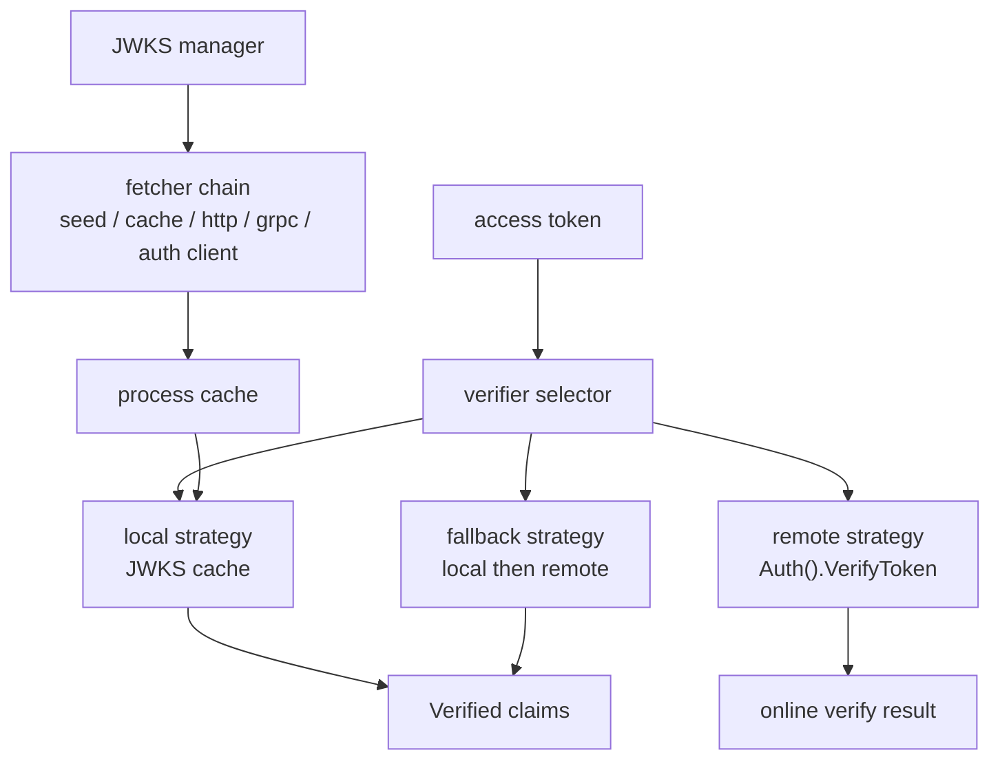
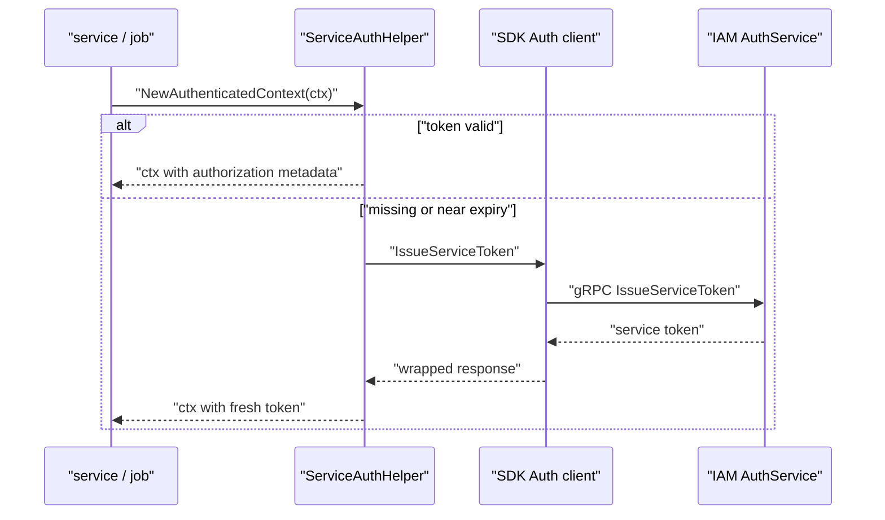
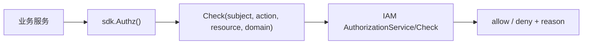
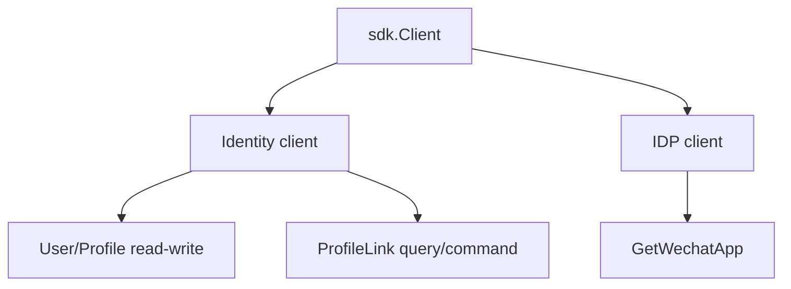

# SDK 封装与接入价值

本文回答：为什么 `pkg/sdk` 是 IAM 文档体系的一部分；它不是把 proto client 包一层的薄 wrapper，而是面向接入产品的稳定边界；它如何封装配置、gRPC transport、JWT/JWKS 验证、service auth、AuthZ、Identity/ProfileLink、IDP 和错误映射。

## 30 秒结论

- SDK 是 IAM 面向 Go 接入方的产品层。服务端文档说明 IAM 怎么实现，SDK 文档说明调用方如何稳定消费这些能力。
- 当前公开稳定面固定为 `sdk / config / auth/client / auth/loginv2 / auth/jwks / auth/verifier / auth/serviceauth / authz / identity / idp / errors`；transport、observability、高级错误分析已收回内部实现。
- SDK 的价值主要有四类：统一配置、统一连接与拦截器、统一认证授权调用、统一错误处理。
- SDK 不替业务方设计权限模型，也不把所有 REST 管理能力都封装成 Go API；授权管理、用户管理等复杂管理面仍以服务端合同和业务文档为准。
- 具体使用手册在 [../../pkg/sdk/docs/README.md](../../pkg/sdk/docs/README.md)，本专题只解释 SDK 作为接入层的架构价值和设计取舍。

## 主图：SDK 作为接入产品层



SDK 的边界看起来像客户端封装，但它真正解决的是“接入一致性”问题：调用方不应每个服务都自己拼 endpoint、TLS、metadata、重试、token 校验、JWKS 刷新和错误判断。

## SDK 能力速查

| 能力 | 公开入口 | 解决的问题 | 深入文档 |
| ---- | ---- | ---- | ---- |
| 客户端创建 | `sdk.NewClient` | 统一创建 AuthN/AuthZ/Identity/IDP 子客户端。 | [../../pkg/sdk/README.md](../../pkg/sdk/README.md) |
| 配置加载 | `pkg/sdk/config`、`sdk.ConfigFromEnv` | endpoint、TLS、retry、observability、token/JWKS 配置集中校验。 | [../../pkg/sdk/docs/02-configuration.md](../../pkg/sdk/docs/02-configuration.md) |
| Token 生命周期消费 | `pkg/sdk/auth/client` | Verify、Refresh、Revoke、GetJWKS、IssueServiceToken。 | [../../pkg/sdk/docs/03-token-lifecycle.md](../../pkg/sdk/docs/03-token-lifecycle.md) |
| JWT/JWKS 离线验签 | `pkg/sdk/auth/jwks`、`pkg/sdk/auth/verifier` | 本地验签、远程兜底、JWKS 刷新与缓存。 | [../../pkg/sdk/docs/04-jwt-verification.md](../../pkg/sdk/docs/04-jwt-verification.md) |
| 服务间认证 | `pkg/sdk/auth/serviceauth` | 服务 token 获取、提前刷新、注入认证上下文。 | [../../pkg/sdk/docs/05-service-auth.md](../../pkg/sdk/docs/05-service-auth.md) |
| 授权判定 | `pkg/sdk/authz` | 统一调用 `AuthorizationService/Check`。 | [../../pkg/sdk/docs/06-authz.md](../../pkg/sdk/docs/06-authz.md) |
| 身份访问 | `pkg/sdk/identity` | User/Profile/ProfileLink 查询与命令封装。 | [../../pkg/sdk/identity](../../pkg/sdk/identity) |
| IDP 读取 | `pkg/sdk/idp` | 当前封装 `GetWechatApp`。 | [../../pkg/sdk/idp](../../pkg/sdk/idp) |
| 错误处理 | `pkg/sdk/errors` | 统一 wrap gRPC 错误、判断类别、映射 HTTP。 | [../../pkg/sdk/errors](../../pkg/sdk/errors) |
| 迁移说明 | `pkg/sdk/docs/07-*` | 公开面收口后的替代路径。 | [../../pkg/sdk/docs/07-migration-breaking-changes.md](../../pkg/sdk/docs/07-migration-breaking-changes.md) |

## 深度链路一：Client 创建不是简单 Dial



这条链路承担了接入方最容易写散的逻辑：

- endpoint、TLS、timeout、retry 的默认值和校验。
- request-id、trace-id、metadata 传播。
- gRPC 错误包装成 SDK 统一错误。
- 子客户端组合，避免调用方直接依赖一堆 proto stub。

`internal/transport` 不是公开稳定包，是为了避免 SDK 使用方绑定底层拦截器实现。公开面只承诺 `Config` 和 `ClientOption` 级别的控制。

## 深度链路二：JWT/JWKS verifier 为什么需要多策略



离线验签和在线 Verify 解决的问题不同：

- 离线验签适合网关和高频请求，依赖 JWT 签名、issuer、audience、exp 等公开 claim。
- 在线 Verify 可以识别服务端撤销、账号状态、session 状态等实时语义，但需要一次 RPC。
- fallback 策略用来在 JWKS 缓存、网络和服务端可用性之间做折中。

SDK 把 JWKS manager、fetcher chain、verifier strategy 放在接入层，是因为这些复杂度属于“如何可靠消费 IAM Token”，不是每个业务服务都应该重复实现。

## 深度链路三：Service Auth 把服务 token 变成运行时能力



Service Auth 的设计目标是减少“服务间调用把 token 当配置复制”的风险：

- service token 有 TTL，需要提前刷新。
- 每次调用都手写 metadata 容易漏注入或注入过期 token。
- 服务调用链需要统一错误处理和重试边界。

SDK helper 把 token 获取、刷新和上下文注入收在一处。它仍然不替调用方决定“哪个服务应该拥有什么权限”，权限模型仍由 IAM 服务端 AuthZ 管理。

## 深度链路四：AuthZ SDK 为什么保持轻量



AuthZ SDK 当前稳定能力是 `Check`、`Allow` 和 `Raw`。它有意不封装完整策略管理面，原因是：

- 策略管理是后台管理能力，涉及 role、permission、resource、rolebinding、policy version 和审计，不适合被每个接入服务随意调用。
- 授权判定是高频接入能力，适合 SDK 简化。
- 调用方必须显式传入 subject、action、resource、domain，SDK 不替你猜资源语义。

这种轻量封装可以降低接入成本，同时避免 SDK 复制服务端授权模型。

## 深度链路五：Identity/ProfileLink 与 IDP 为什么也放进 SDK



Identity 和 IDP 放进 SDK 不是为了让所有管理功能都搬到客户端，而是为了给常见接入路径一个稳定入口：

- 业务服务可能需要读取用户或 profile。
- 接入方可能需要查询 ProfileLink，或发起当前契约支持的命令。
- IDP 当前 gRPC 只暴露 `GetWechatApp`，SDK 只封装这个读能力，不扩展服务端未提供的管理面。

这里的边界与 `docs/02-业务域` 一致：ProfileLink 是档案关系模型，IDP 是外部身份配置和凭据管理，AuthN 才负责登录和 token。

## 设计模式

| 模式 | 为什么用 | 解决什么问题 | IAM SDK 落地 | 代价和边界 |
| ---- | ---- | ---- | ---- | ---- |
| Facade | 接入方不应直接组装所有 proto client。 | 降低配置、连接、子服务组合复杂度。 | `sdk.Client`、`sdk.NewClient`。 | Facade 不能无限膨胀，复杂管理面应回到服务端合同。 |
| Adapter | proto/gRPC 错误和 SDK 公开错误需要隔离。 | 避免调用方散落处理 gRPC status。 | `pkg/sdk/errors.Wrap`、子客户端方法。 | 包装会隐藏部分底层细节，需要保留 Raw 逃生口。 |
| Strategy | 验签有本地、远程、fallback 多种策略。 | 不同业务对实时性和可用性要求不同。 | `auth/verifier` strategies。 | 策略配置不当会造成过度 RPC 或过度信任离线 token。 |
| Chain of Responsibility | JWKS 获取有 seed、cache、HTTP、gRPC 等来源。 | 提高 JWKS 获取可靠性。 | `auth/jwks` fetcher chain。 | 链路越长，错误诊断越依赖日志和配置。 |
| Helper / Lifecycle Object | service token 需要刷新和关闭。 | 避免 token 刷新逻辑散落在业务代码。 | `auth/serviceauth` helper。 | helper 生命周期需要 `Stop`。 |
| Public Surface Boundary | SDK 必须有兼容承诺边界。 | 防止接入方依赖内部 transport/observability。 | `internal/transport`、`internal/observability` 收口。 | 高级自定义能力减少，需要通过 `ClientOption` 或配置扩展。 |

## 失败边界

| 场景 | 当前建议 |
| ---- | ---- |
| 需要即时撤销语义 | 使用在线 `VerifyToken` 或服务端鉴权链；只做离线验签不能感知所有实时撤销。 |
| 需要高频网关验签 | 使用 JWKS manager + local verifier，并合理配置刷新间隔和 issuer/audience。 |
| 需要策略管理 | 不要在 SDK 里绕过管理面；按 REST/gRPC 合同和后台权限设计接入。 |
| SDK 没有封装某个 gRPC 方法 | 使用子客户端 `Raw()` 作为过渡，同时评估是否应该扩展 SDK 公开面。 |
| 需要自定义 metrics/tracing | 使用公开 option/hook；不要依赖 `internal/observability`。 |
| 多服务复用 service auth | 每个服务按自身身份配置 helper，不要共享不属于自己的 service token。 |

## 代码证据与验证

| 事实 | 代码 / 文档 |
| ---- | ---- |
| SDK 总览与公开面 | [../../pkg/sdk/README.md](../../pkg/sdk/README.md)、[../../pkg/sdk/sdk.go](../../pkg/sdk/sdk.go) |
| Client facade | [../../pkg/sdk/client.go](../../pkg/sdk/client.go) |
| 配置 | [../../pkg/sdk/config](../../pkg/sdk/config) |
| transport 内部实现 | [../../pkg/sdk/internal/transport](../../pkg/sdk/internal/transport) |
| Auth client | [../../pkg/sdk/auth/client](../../pkg/sdk/auth/client) |
| Login v2 client | [../../pkg/sdk/auth/loginv2](../../pkg/sdk/auth/loginv2) |
| JWKS manager | [../../pkg/sdk/auth/jwks](../../pkg/sdk/auth/jwks) |
| Token verifier | [../../pkg/sdk/auth/verifier](../../pkg/sdk/auth/verifier) |
| Service auth helper | [../../pkg/sdk/auth/serviceauth](../../pkg/sdk/auth/serviceauth) |
| AuthZ client | [../../pkg/sdk/authz](../../pkg/sdk/authz) |
| Identity client | [../../pkg/sdk/identity](../../pkg/sdk/identity) |
| IDP client | [../../pkg/sdk/idp](../../pkg/sdk/idp) |
| SDK 文档索引 | [../../pkg/sdk/docs/README.md](../../pkg/sdk/docs/README.md) |

建议验证：

```bash
go test ./pkg/sdk/...
make docs-hygiene
```
