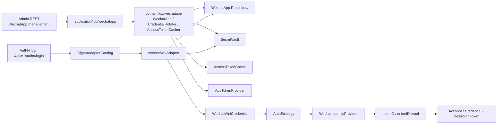
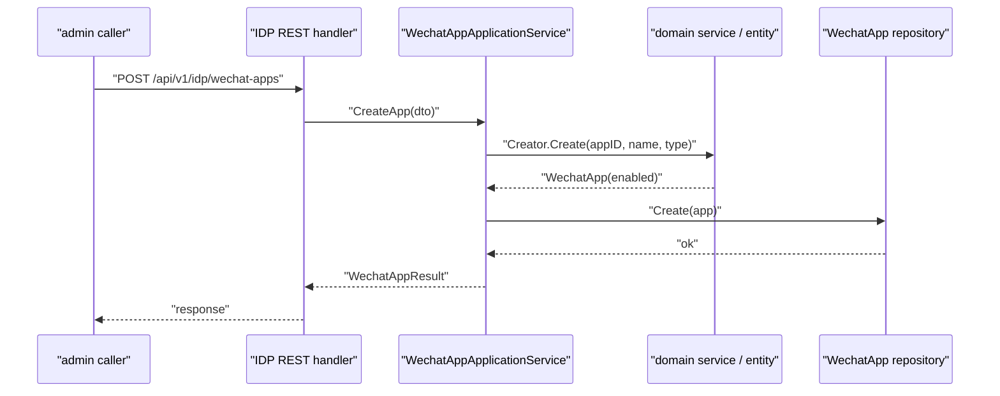
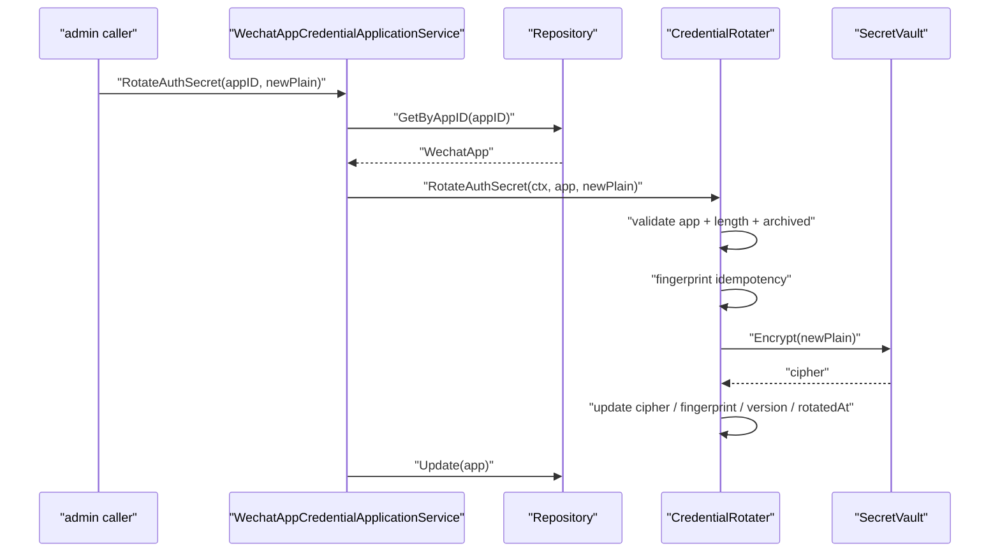
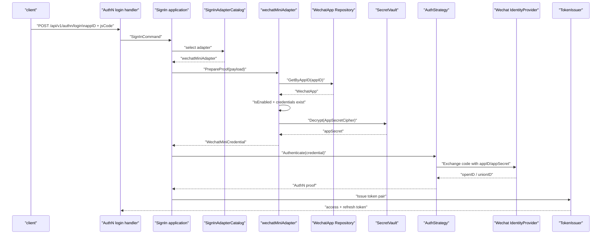
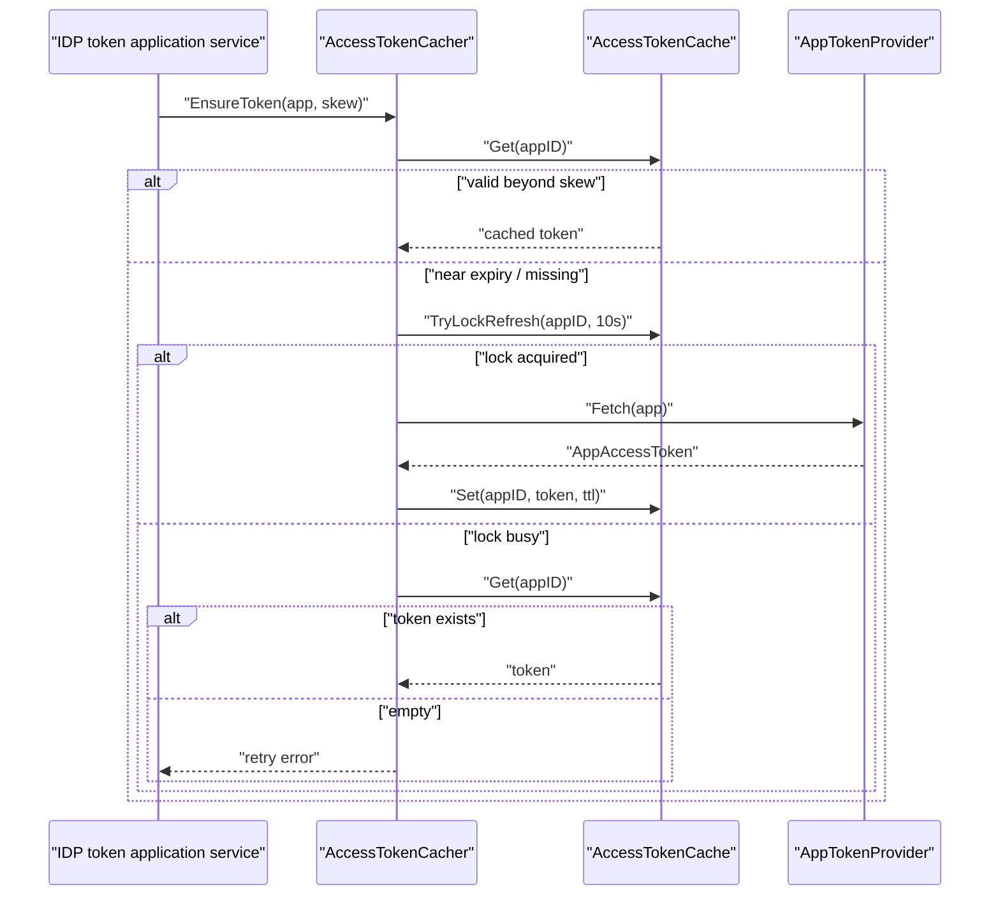

# IDP 与微信登录链路：WechatApp 到 AuthN Proof

本文回答：IAM 中的 WechatApp、SecretVault、微信 provider、AuthN 登录 adapter 是如何协作的；为什么 IDP 不是“登录模块”，而是外部身份配置和凭据边界；以及微信小程序登录如何从 appID/code 变成 AuthN 可消费的 proof。

## 30 秒结论

- IDP 管理的是外部身份提供者配置：`WechatApp`、AppSecret、消息密钥、access token cache。登录成功后的 Account、Credential、Session、Token 仍由 AuthN 负责。
- 微信登录入口在 AuthN 登录链路中通过 `wechatMiniAdapter` 选择；adapter 根据 appID 查 `WechatApp`，检查启用状态，解密 AppSecret，构造 `WechatMiniCredential`。
- 领域认证策略再调用微信 identity provider，用 code 换取 openID/unionID，形成 AuthN proof，之后进入 IAM 自己的账号凭据匹配、onboarding、session 和 token 签发。
- IDP access token 获取使用 `AccessTokenCacher` 的 cache-aside + refresh lock；它服务微信 API 调用，不等同于用户登录 token。
- 当前 `CredentialRotater.RotateAPISymKey` 和 `RotateAPIAsymKey` 是空实现，不应在文档或接入承诺中写成已实现能力。

## 主图：IDP 配置与 AuthN 登录 proof 的关系



IDP 和 AuthN 的分工是本专题的核心：

- IDP 负责“某个微信应用是否存在、是否启用、secret 如何安全保存、外部 token 如何缓存”。
- AuthN 负责“这次登录能否产生 IAM 身份、能否绑定账号凭据、是否需要 onboarding、如何签发 token”。

## 模型速查

| 概念 | 代码名 | 所属层 | 语义 |
| ---- | ---- | ---- | ---- |
| 微信应用 | `WechatApp` | domain/idp | 外部微信应用配置聚合根。 |
| 认证密钥 | `AuthSecret` | domain/idp | AppSecret 密文、指纹、版本、轮换时间。 |
| 消息密钥 | `MsgSecret` | domain/idp | callback token、EncodingAESKey 密文、版本。 |
| 凭据轮换 | `CredentialRotater` | domain/idp service | 校验、加密、版本递增、幂等指纹判断。 |
| 密钥保管箱 | `SecretVault` | domain port | 加密/解密 secret 的端口。 |
| 外部 access token cache | `AccessTokenCacher` | domain/idp service | cache-aside + refresh lock。 |
| 微信登录 adapter | `wechatMiniAdapter` | application/authn/login | 把登录请求转换成 AuthN credential。 |
| 微信 proof | `WechatMiniCredential` | domain/authn/authentication | 认证策略可消费的凭据输入。 |

## 深度链路一：WechatApp 管理链路



`WechatApp` 的管理链路有几个重要边界：

- 创建应用默认启用，但是否能用于登录还取决于是否有可解密的 `AuthSecret`。
- `UpdateApp` 只更新名称、类型等基础信息，secret 轮换走单独应用服务。
- enable/disable 是状态变更，不删除历史配置。
- archived app 不允许变更 credentials。

REST 管理面在 `/api/v1/idp/wechat-apps` 下，具体路由由 [../../internal/apiserver/transport/rest/idp/router.go](../../internal/apiserver/transport/rest/idp/router.go) 注册；gRPC 当前只提供 `IDPService.GetWechatApp` 读能力。

## 深度链路二：AppSecret 轮换为什么是领域服务



AppSecret 轮换被放进领域服务而不是 REST handler，是因为它有领域规则：

- app 不能为空。
- secret 非空且长度至少 16。
- archived app 不能改 credentials。
- 新 secret 与当前指纹一致时幂等返回。
- 必须通过 `SecretVault` 加密存储。
- 每次真实轮换要递增版本并记录轮换时间。

消息密钥轮换类似，但 `EncodingAESKey` 必须是 43 位。API 对称密钥和非对称密钥轮换接口虽然存在于领域接口中，但当前实现为空方法；它们不是已完成能力。

## 深度链路三：微信小程序登录如何产生 AuthN proof



这里有三个容易混淆的点：

- `wechatMiniAdapter` 不直接签发 token；它只准备认证 proof。
- 微信 openID/unionID 不是 IAM userID；它们是外部身份结果，需要通过 AuthN credential/account/onboarding 转换成 IAM 身份。
- IDP 的 `AccessTokenCacher` 不参与这条 code 登录链路；code2session 使用的是 appID/appSecret。access token cache 面向其他微信 API 调用。

## 深度链路四：IDP access token cache-aside



`AccessTokenCacher` 的默认提前刷新窗口是 120 秒，最小缓存 TTL 保护是 60 秒。这能降低“刚拿到 token 就过期”的概率，也避免并发刷新时所有请求都打外部 provider。

## 设计模式

| 模式 | 为什么用 | 解决什么问题 | IAM 落地 | 代价和边界 |
| ---- | ---- | ---- | ---- | ---- |
| Aggregate Root | 微信应用配置、状态和凭据需要一致表达。 | 防止 appID、status、secret 分散无约束。 | `WechatApp` 持有 `Credentials` 和状态行为。 | 聚合较轻，复杂事务仍由 application/repository 管。 |
| Domain Service | secret 轮换不是单纯 setter。 | 轮换包含校验、加密、幂等、版本和时间。 | `CredentialRotater`。 | 当前 API sym/asym key 方法未实现，不能过度承诺。 |
| Secret Vault Port | domain 不应依赖具体 KMS 或加密库实现。 | 避免 secret 明文和 infra 细节进入领域模型。 | `SecretVault`。 | vault 不可用时 secret 轮换和登录 proof 准备都会失败。 |
| Adapter | AuthN 登录请求形状和领域 credential 形状不同。 | 支持多登录方式统一进入认证策略。 | `wechatMiniAdapter`。 | adapter 需要和登录合同字段同步。 |
| Cache Aside + Lock | 外部 access token 有成本、过期和并发刷新问题。 | 降低微信 API 调用压力，避免刷新风暴。 | `AccessTokenCacher`。 | 外部 provider 失败仍会向上返回错误。 |

## 失败边界

| 场景 | 当前行为 |
| ---- | ---- |
| AuthN 微信登录时 IDP repo 或 vault 缺失 | adapter 返回 invalid argument，登录失败。 |
| appID 不存在 | adapter 返回 `wechat app not found` 语义。 |
| WechatApp 被禁用 | adapter 拒绝登录。 |
| WechatApp 缺少 AuthSecret | adapter 拒绝登录。 |
| AppSecret 解密失败 | adapter 返回错误，不能用旧值或空值兜底。 |
| 微信 code exchange 失败 | 认证策略失败，不进入 token 签发。 |
| access token 刷新锁未获得且缓存仍为空 | 返回 retry 语义。 |
| API 对称/非对称密钥轮换 | 当前实现为空，不作为能力承诺。 |

## 代码证据与验证

| 事实 | 代码 |
| ---- | ---- |
| WechatApp 聚合 | [../../internal/apiserver/domain/idp/wechatapp/wechatapp.go](../../internal/apiserver/domain/idp/wechatapp/wechatapp.go) |
| CredentialRotater | [../../internal/apiserver/domain/idp/wechatapp/rotater.go](../../internal/apiserver/domain/idp/wechatapp/rotater.go) |
| AccessTokenCacher | [../../internal/apiserver/domain/idp/wechatapp/accesstoken-cacher.go](../../internal/apiserver/domain/idp/wechatapp/accesstoken-cacher.go) |
| IDP 应用服务 | [../../internal/apiserver/application/idp/wechatapp/services_impl.go](../../internal/apiserver/application/idp/wechatapp/services_impl.go) |
| 微信登录 adapter | [../../internal/apiserver/application/authn/login/adapter_wechat_mini.go](../../internal/apiserver/application/authn/login/adapter_wechat_mini.go) |
| 微信 provider | [../../internal/apiserver/infra/wechat](../../internal/apiserver/infra/wechat) |
| IDP REST 合同 | [../../api/rest/idp.v1.yaml](../../api/rest/idp.v1.yaml) |
| IDP gRPC 合同 | [../../api/grpc/iam/idp/v1/idp.proto](../../api/grpc/iam/idp/v1/idp.proto) |

建议验证：

```bash
go test ./internal/apiserver/domain/idp/... ./internal/apiserver/application/idp/... ./internal/apiserver/application/authn/login ./internal/apiserver/application/authn/onboarding
make docs-hygiene
```
