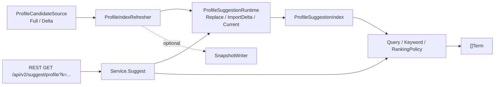
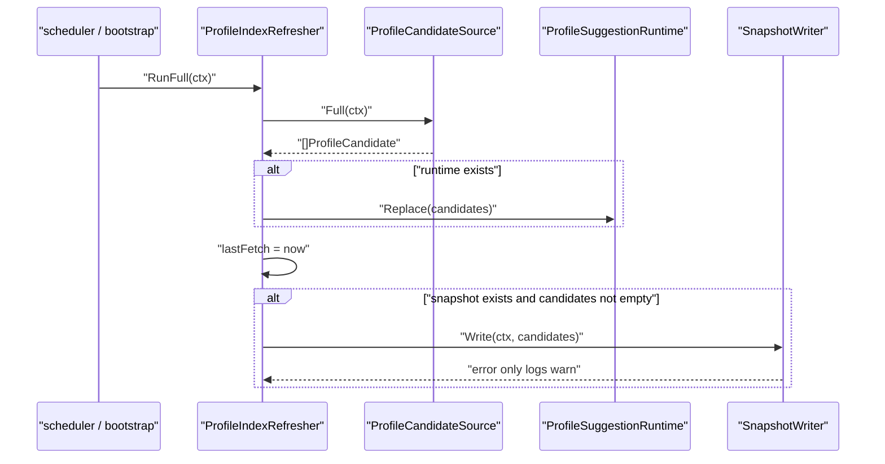
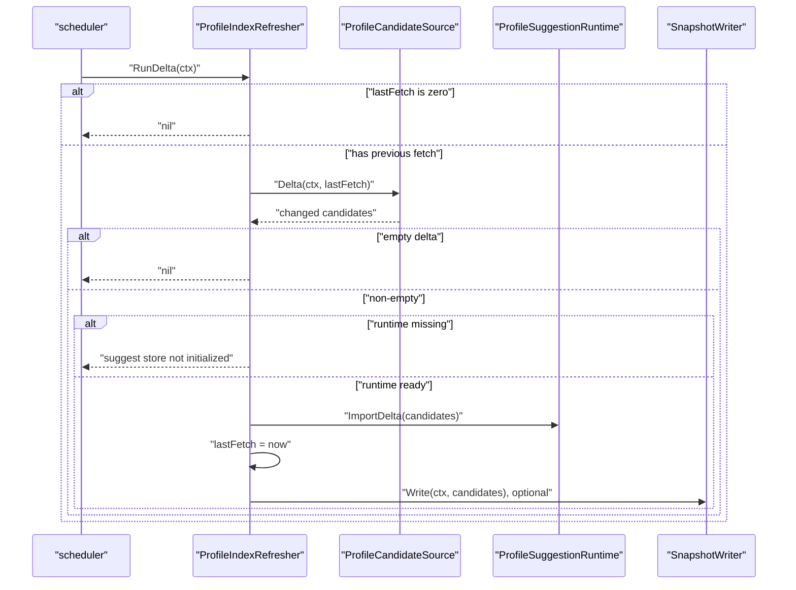
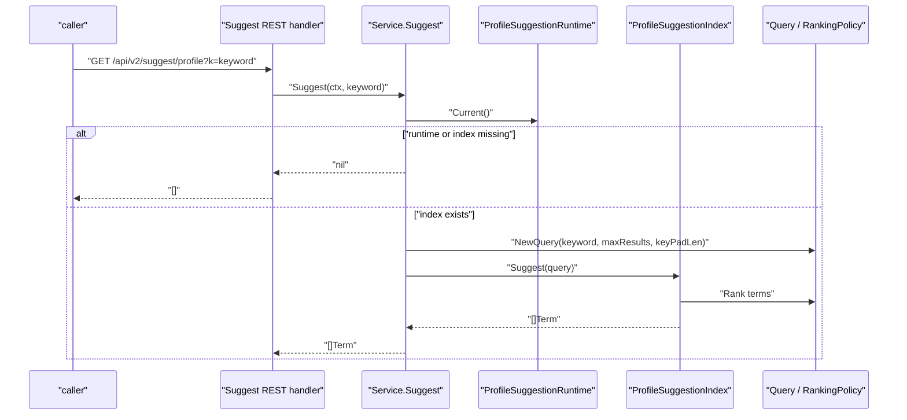
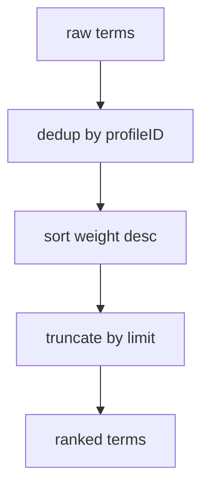

# Suggest 读模型链路：候选刷新到联想查询

本文回答：IAM Suggest 如何从 Profile 候选数据构建进程内联想索引；full refresh、delta refresh、snapshot writer、query service 和 RankingPolicy 如何协作；以及它为什么只是读侧辅助能力，不负责 ProfileLink 写入或 AuthZ 权限判定。

## 30 秒结论

- Suggest 是读模型，不是用户关系或权限模型。它回答“哪些 profile 可能匹配这个关键词”，不回答“当前用户能否管理这个 profile”。
- 刷新链路由 `ProfileIndexRefresher` 驱动：`RunFull` 全量替换 runtime index，`RunDelta` 在已有 `lastFetch` 后导入变化候选。
- 查询链路由 `Service.Suggest` 驱动：从 `ProfileSuggestionRuntime.Current()` 取当前 index，构造 `Query`，返回 `Term` 列表；runtime 或 index 缺失时返回空结果而不是 panic。
- 领域层最核心的规则是 `ProfileCandidate` 清洗、`Keyword` 数字判断、`Query` 默认限制和 `RankingPolicy` 去重排序。
- REST 当前入口是 `GET /api/v2/suggest/profile?k=...`，handler 需要认证 middleware 和 suggest service 存在才注册。

## 主图：Suggest 读模型协作



这条链路体现了典型读模型设计：

- 写侧 Profile 数据不直接服务联想搜索。
- 应用服务只依赖候选来源、runtime index 和可选 snapshot 端口。
- 查询接口只读当前 index，不修改 Profile 或 ProfileLink。

## 模型速查

| 概念 | 代码名 | 语义 |
| ---- | ---- | ---- |
| 候选输入 | `ProfileCandidate` | 从 Profile 数据抽出的联想搜索候选，包含 profileID、displayName、mobiles、weight。 |
| 查询关键词 | `Keyword` | 对输入做 trim，并提供数字判断。 |
| 查询对象 | `Query` | keyword、limit、keyPadLen；缺省使用 `DefaultLimit=20`、`DefaultKeyPadLen=25`。 |
| 结果项 | `Term` | REST 返回项：name、id、mobile、weight。 |
| 排名策略 | `RankingPolicy` | 按 profileID 去重，再按 weight 降序，最后截断 limit。 |
| 候选来源端口 | `ProfileCandidateSource` | 提供 full/delta 候选。 |
| 运行时索引端口 | `ProfileSuggestionRuntime` | 持有当前 index，支持 Replace/ImportDelta。 |
| 可选快照端口 | `SnapshotWriter` | 以 infra 自有格式保存刷新结果，失败只记录 warning。 |

## 深度链路一：Full refresh



`RunFull` 的语义是“用完整候选集合替换当前索引”。它适合启动后初始化、定期校准或需要纠偏时使用。它的关键边界：

- `source` 缺失直接返回错误，因为没有候选来源就无法构建读模型。
- `runtime` 可以为空；这时不会替换索引，但仍会更新 `lastFetch` 和尝试 snapshot。这个行为表示刷新器和运行时索引是分离端口。
- snapshot 写入失败只 warning，不影响刷新主链路。snapshot 是辅助持久化，不是查询强依赖。

## 深度链路二：Delta refresh



Delta refresh 比 full refresh 更严格：

- 如果从未成功 full refresh，`lastFetch` 为零，delta 直接 no-op，避免“从未知基线增量导入”。
- 有非空 delta 但 runtime 缺失时返回错误，因为增量必须落到已有索引。
- 只有成功 import 后才更新 `lastFetch`。

这体现了读模型的一致性底线：可以允许读模型短暂滞后，但不能在没有基线的情况下假装完成增量同步。

## 深度链路三：查询链路



查询路径非常窄：

- 不读数据库。
- 不写 Profile。
- 不创建 ProfileLink。
- 不做 AuthZ 判定。
- 空 runtime/index 返回空结果，避免启动初期或降级状态下 panic。

认证边界由 REST 注册时的 middleware 保护；Suggest 自身不负责解释“谁能看哪个 profile”。如果调用方要基于候选建立档案关系，应继续走 Identity/ProfileLink 的命令链路。

## 深度链路四：RankingPolicy 为什么在 domain



排名看似只是排序，但它包含业务语义：

- 同一个 profile 可能通过姓名、手机号等多个索引命中，只应返回一次。
- weight 是候选质量信号，结果按权重降序。
- limit 是领域查询限制，不应由 REST handler 自己截断。

因此 `RankingPolicy` 放在 domain/suggest，而不是 transport 或 infra。索引实现可以变化，但去重和排序规则应保持一致。

## 设计模式

| 模式 | 为什么用 | 解决什么问题 | IAM 落地 | 代价和边界 |
| ---- | ---- | ---- | ---- | ---- |
| Read Model | 联想搜索的查询形状与 Profile 写模型不同。 | 不让搜索需求污染 Profile 聚合。 | `ProfileCandidate`、runtime index。 | 读模型需要刷新，可能短暂滞后。 |
| CQRS | 刷新/导入和查询是不同用例。 | full/delta refresh 不应该和 request 查询耦合。 | `ProfileIndexRefresher` vs `Service.Suggest`。 | 需要运行时或调度器触发刷新。 |
| Ports & Adapters | 候选来源和索引实现可以替换。 | 应用服务不依赖具体 DB 或索引结构。 | `ProfileCandidateSource`、`ProfileSuggestionRuntime`。 | 端口缺失时要定义明确降级。 |
| Policy Object | 排名去重规则需要统一。 | 防止每个 index/handler 自己排序。 | `RankingPolicy`。 | 当前规则较简单，复杂排序需扩展测试。 |
| Null Boundary | 启动早期 index 可能为空。 | 避免 runtime nil 导致查询 panic。 | `Service.Suggest` 返回 nil，handler 输出空数组。 | 空结果需要监控，否则可能掩盖刷新失败。 |

## 失败边界

| 场景 | 当前行为 |
| ---- | ---- |
| refresher 缺 source | `RunFull` / `RunDelta` 返回错误。 |
| delta 前没有 full 基线 | `RunDelta` no-op。 |
| delta 为空 | no-op，不更新 snapshot。 |
| delta 非空但 runtime 缺失 | 返回 `suggest store not initialized`。 |
| snapshot 写入失败 | 记录 warning，不影响查询 runtime。 |
| runtime 或 index 缺失 | 查询返回空结果。 |
| 查询关键词为空 | 由 `Keyword` trim 后进入 index；是否返回结果由 index 实现决定。 |
| 用户拿到候选后尝试建立关系 | 必须走 ProfileLink，不由 Suggest 写入。 |

## 与其他模块的边界

| 模块 | 边界 |
| ---- | ---- |
| Identity/Profile | 提供 profile 事实来源；Suggest 不创建或修改 profile。 |
| ProfileLink | 建立、撤销、查询档案关系；Suggest 不写 ProfileLink。 |
| AuthZ | 判定资源权限；Suggest 不做权限判定。 |
| CacheGovernance | 观测缓存族；Suggest 当前不是 cache governance 独立 family。 |
| REST | 只做认证保护、参数读取和响应映射。 |

## 代码证据与验证

| 事实 | 代码 |
| ---- | ---- |
| Suggest domain 模型 | [../../internal/apiserver/domain/suggest/profile.go](../../internal/apiserver/domain/suggest/profile.go)、[../../internal/apiserver/domain/suggest/term.go](../../internal/apiserver/domain/suggest/term.go) |
| 应用端口 | [../../internal/apiserver/application/suggest/ports.go](../../internal/apiserver/application/suggest/ports.go) |
| 查询服务 | [../../internal/apiserver/application/suggest/service.go](../../internal/apiserver/application/suggest/service.go) |
| 刷新服务 | [../../internal/apiserver/application/suggest/refresher.go](../../internal/apiserver/application/suggest/refresher.go) |
| REST handler/router | [../../internal/apiserver/transport/rest/suggest](../../internal/apiserver/transport/rest/suggest) |
| 业务域总览 | [../02-业务域/04-suggest-儿童联想搜索.md](../02-业务域/04-suggest-儿童联想搜索.md) |

建议验证：

```bash
go test ./internal/apiserver/domain/suggest ./internal/apiserver/application/suggest ./internal/apiserver/transport/rest
make docs-hygiene
```
