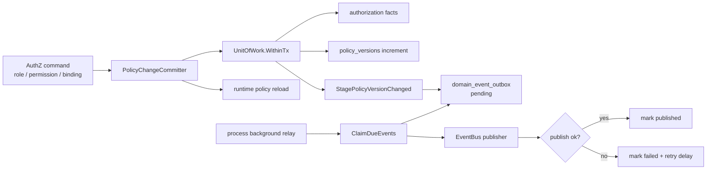
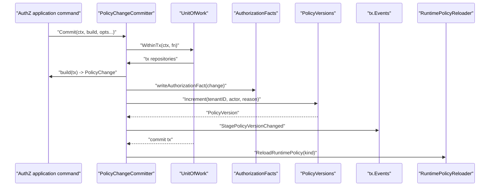
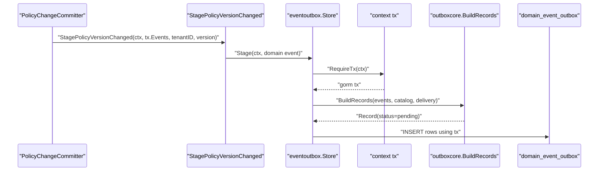
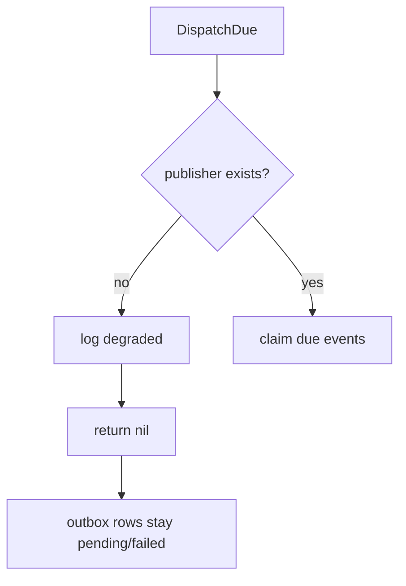
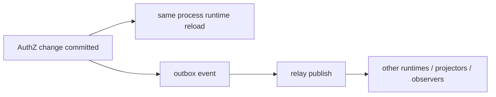

# 授权版本事件链路：UoW 到 Outbox Relay

本文回答：AuthZ 策略变更为什么不仅要写授权事实，还要递增 policy version 并 stage 领域事件；这个事件如何在 Unit of Work 中进入 `domain_event_outbox`，再由 outbox relay claim、publish、mark；以及 event bus 不可用时为什么保留 pending 语义。

## 30 秒结论

- AuthZ 策略变更的应用事务由 `PolicyChangeCommitter` 管：构造 `PolicyChange`、写 authorization facts、递增 `PolicyVersion`、stage version changed event、事务提交后 reload runtime policy。
- 事件 stage 通过 `authzshared.StagePolicyVersionChanged` 写入 UoW 中的 `tx.Events`，底层 MySQL outbox store 要求从 context 取当前事务，保证授权事实和 outbox 记录同事务提交。
- outbox 记录初始状态是 `pending`；relay 批量 claim due records，发布到 event bus，成功标记 `published`，失败标记 `failed` 并设置下一次重试时间。
- event bus 不可用时 relay 进入 degraded：记录 warning 并返回 nil，不 claim 事件，因此记录保留在 pending/failed 状态，等待 event bus 恢复。
- 这条链路是跨模块特色设计：AuthZ 应用事务、领域事件、MySQL outbox、消息发布和运行时后台任务共同完成“事实一致 + 异步传播”。

## 主图：策略变更到事件投递



这条链路的关键不是“发一条消息”，而是保证：

- 授权事实变更和事件入 outbox 在同一个数据库事务里。
- 事务提交后即使进程宕机，outbox 记录仍可被 relay 继续投递。
- 消息系统不可用不影响授权事实提交，但会通过 pending/failed 积压暴露出来。

## 核心对象速查

| 概念 | 代码名 | 责任 |
| ---- | ---- | ---- |
| 策略变更提交器 | `PolicyChangeCommitter` | 组织 AuthZ 变更应用事务。 |
| 策略变更 | `PolicyChange` | 表达 grant/revoke/bind/unbind 等授权事实变化。 |
| 策略版本 | `PolicyVersion` | 每次策略事实变化递增，用于版本事件和快照感知。 |
| 事件 stage | `StagePolicyVersionChanged` | 将 version changed domain event stage 到 UoW events。 |
| 事件 stager/store | `event.Stager` / `eventoutbox.Store` | 在当前 DB 事务中写 outbox 记录。 |
| outbox record | `outboxcore.Record` | eventID、eventType、topic、payload、status、nextAttemptAt。 |
| relay | `OutboxRelay` | claim due events、publish、mark result。 |

## 深度链路一：PolicyChangeCommitter 的事务骨架



`Committer` 把所有 AuthZ 写侧操作拉回同一套骨架，解决两个问题：

- 不同命令不能各自忘记递增版本或 stage event。
- 授权事实、版本、事件不能分散提交，否则会出现“事实已变，订阅者永远不知道”的不一致。

`BeforeFacts` 和 `AfterFacts` option 为少数命令提供扩展点，但主干仍保持统一：构建 change、写 facts、递增版本、stage event。

## 深度链路二：event 如何进入 MySQL outbox



MySQL outbox store 的强约束：

- `Stage` 必须从 context 取当前事务；没有事务就返回错误。
- `BuildRecords` 会通过 event catalog 解析 topic，并可校验 delivery class 必须是 durable outbox。
- outbox row 初始 `status=pending`，`attempt_count=0`，`next_attempt_at=now`。

这保证了事件不是“事务提交后顺手发一下”。它先作为数据库事实存在，再由后台 relay 异步投递。

## 深度链路三：Outbox Relay 的 claim/publish/mark

```mermaid
sequenceDiagram
    participant Loop as "relay loop"
    participant Relay as "OutboxRelay"
    participant Store as "outbox Store"
    participant Bus as "EventBus Publisher"

    Loop->>Relay: "DispatchDue(ctx)"
    alt "store nil"
        Relay-->>Loop: "nil"
    else "publisher nil"
        Relay-->>Loop: "warn degraded, nil"
    else "ready"
        Relay->>Store: "ClaimDueEvents(limit, now)"
        Store-->>Relay: "pending events, status=publishing"
        loop "each pending"
            Relay->>Bus: "PublishMessage(topic, payload, metadata)"
            alt "publish ok"
                Relay->>Store: "MarkEventPublished(eventID)"
            else "publish failed"
                Relay->>Store: "MarkEventFailed(eventID, err, now+retryDelay)"
            end
        end
    end
```

relay 的状态语义：

| 状态 | 含义 | 下一步 |
| ---- | ---- | ---- |
| `pending` | 已入库，等待投递。 | 到期后可 claim。 |
| `publishing` | 已被某个 relay claim，正在投递。 | 成功变 `published`，失败变 `failed`；超时后可被重新 claim。 |
| `published` | 已成功发布并标记完成。 | 不再参与 unfinished 扫描。 |
| `failed` | 发布失败，记录错误和下一次重试时间。 | 到 `next_attempt_at` 后可再次 claim。 |

`ClaimDueEvents` 会选择：

- `pending` 且到期。
- `failed` 且到期。
- `publishing` 但超过 stale 窗口。

非 sqlite 场景使用 `FOR UPDATE SKIP LOCKED`，减少多个 relay 并发 claim 同一批记录的风险。

## 深度链路四：event bus 不可用为什么不 claim



如果 event bus 不可用，relay 直接降级返回，不 claim 事件。这个选择很重要：

- 如果先 claim 再发现 publisher 不可用，会把大量事件推进 `publishing` 或 `failed`，制造无意义的重试噪音。
- 不 claim 可以让事件保持 pending/failed 的原状态，等待消息系统恢复。
- AuthZ 主事务已经完成，服务端授权事实可立即生效；异步订阅者的更新通过 outbox 延迟补偿。

这不是“吞消息”，而是 transactional outbox 的正常退化模式：数据库里的未完成状态就是待处理队列。

## 设计模式

| 模式 | 为什么用 | 解决什么问题 | IAM 落地 | 代价和边界 |
| ---- | ---- | ---- | ---- | ---- |
| Unit of Work | 授权事实、版本、事件必须同事务。 | 避免部分提交造成事实和事件不一致。 | `authz/uow` + `PolicyChangeCommitter`。 | 写路径必须走 committer，不能绕路写 facts。 |
| Domain Event | 策略版本变化需要通知其他读侧或运行时。 | 解耦 AuthZ 写事务和异步消费者。 | `PolicyVersionChanged` event。 | 事件只能表达事实发生，不保证消费者即时完成。 |
| Transactional Outbox | DB 事务和消息发布不能原子提交。 | 先同事务写 outbox，再异步投递。 | `eventoutbox.Store`。 | 需要 relay、重试、积压监控。 |
| Relay / Polling Publisher | 消息投递从业务事务中移出。 | 减少业务命令对消息系统可用性的依赖。 | `infra/messaging/outbox_relay.go`。 | 投递是最终一致，不是同步完成。 |
| State Machine | outbox record 有明确状态迁移。 | 可恢复、可重试、可观测。 | pending/publishing/published/failed。 | 状态机需要处理 stale publishing。 |
| Catalog-driven Topic Resolution | 事件类型和 topic 不应散落硬编码。 | 防止事件无法路由或误投递。 | `outboxcore.BuildRecords` + event catalog。 | catalog 缺失会让 stage 失败。 |

## 失败边界

| 场景 | 当前行为 | 结果 |
| ---- | ---- | ---- |
| `PolicyChangeCommitter` 缺 UoW | 返回 internal error。 | AuthZ 写命令失败，不写部分事实。 |
| stage event 时 stager 缺失 | 返回错误，事务失败。 | 避免事实提交但事件缺失。 |
| outbox store 没有当前 tx | `RequireTx` 返回错误。 | 强制 outbox 写入事务边界。 |
| event catalog 无 topic | `BuildRecords` 返回错误。 | 防止事件无路由地入库。 |
| relay 缺 publisher | 记录 degraded，返回 nil，不 claim。 | 事件保持待处理。 |
| publish 失败 | mark failed，设置 retry delay。 | 后续可重试。 |
| relay 进程在 publishing 后宕机 | stale 窗口后重新 claim。 | 避免永久卡在 publishing。 |
| mark published 失败 | 记录 mark_failed。 | 可能重复投递，消费者需按事件 ID 幂等。 |

## 与 AuthZ 读模型的关系

授权事实写入后，`PolicyChangeCommitter` 会在事务提交后触发 runtime policy reload。这是本进程内的即时刷新路径。outbox 事件则服务于跨进程或异步消费者：



因此不能把 outbox 误解为本进程内授权判定的唯一更新机制。它是跨边界传播事实的机制；本进程授权运行时还有直接 reload 路径。

## 代码证据与验证

| 事实 | 代码 |
| ---- | ---- |
| PolicyChangeCommitter | [../../internal/apiserver/application/authz/policy/committer.go](../../internal/apiserver/application/authz/policy/committer.go) |
| version event stage | [../../internal/apiserver/application/authz/shared/version_event.go](../../internal/apiserver/application/authz/shared/version_event.go) |
| AuthZ UoW | [../../internal/apiserver/application/authz/uow](../../internal/apiserver/application/authz/uow) |
| MySQL outbox store | [../../internal/apiserver/infra/mysql/eventoutbox/store.go](../../internal/apiserver/infra/mysql/eventoutbox/store.go) |
| outbox core 状态与 record 构建 | [../../pkg/outboxcore/core.go](../../pkg/outboxcore/core.go) |
| outbox relay | [../../internal/apiserver/infra/messaging/outbox_relay.go](../../internal/apiserver/infra/messaging/outbox_relay.go) |
| outbox port | [../../pkg/outbox](../../pkg/outbox) |
| event runtime | [../../pkg/eventruntime](../../pkg/eventruntime) |

建议验证：

```bash
go test ./internal/apiserver/application/authz/... ./internal/apiserver/infra/mysql/eventoutbox ./internal/apiserver/infra/messaging ./pkg/outbox/... ./pkg/outboxcore/... ./pkg/eventruntime/...
make docs-hygiene
```
