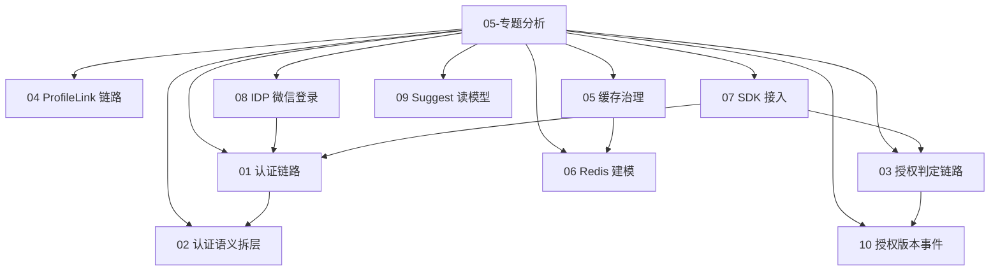

# 05-专题分析

## 本文回答

本组文档回答：IAM 中最关键的跨模块链路如何执行，为什么这些链路采用当前架构、领域模型、应用服务和设计模式，以及排查问题时应从哪些代码、契约和测试回到事实源。

`02-业务域` 负责按模块讲清 AuthN、AuthZ、Identity/ProfileLink、IDP、Suggest 的领域模型和应用服务；本组负责把重要链路纵向打穿，讲清一个请求、一次轮换、一次授权变更、一次缓存读取或一次 SDK 调用如何跨越 transport、application、domain、infra 和 runtime。

## 30 秒结论

- `05-专题分析` 是跨层深潜层，不是业务域索引，也不是运行时索引。
- 每篇都以“本文回答 -> 30 秒结论 -> 主图/速查表 -> 深度链路 -> 设计模式 -> 失败边界 -> 代码证据与验证”组织。
- 当前事实口径保持一致：`ProfileLink`、内部 `rolebinding`、公开 `assignment` wire term、`application/authn/token`、`infra/token/*`、`internal/apiserver/cache/catalog.go`、transactional outbox + relay。
- 旧质量报告和历史材料不放在活跃专题层；历史材料只从 [../_archive](../_archive/README.md) 追溯。

## 专题地图



## 文档清单

| 顺序 | 文档 | 深潜问题 |
| ---- | ---- | ---- |
| 1 | [01-认证链路--从登录请求到 Token 与 JWKS.md](01-认证链路--从登录请求到%20Token%20与%20JWKS.md) | 登录请求如何经过 adapter、strategy、onboarding、session、token、JWKS。 |
| 2 | [02-IAM认证语义拆层--用户状态&会话&Token边界.md](02-IAM认证语义拆层--用户状态&会话&Token边界.md) | 为什么需要用户/账号状态、session、Access Token、Refresh Token 四层失效语义。 |
| 3 | [03-授权判定链路--角色&策略&资源&Assignment&Casbin.md](03-授权判定链路--角色&策略&资源&Assignment&Casbin.md) | 授权事实如何写入、判定、投影为快照，并维持 `assignment`/`rolebinding` 边界。 |
| 4 | [04-ProfileLink链路--用户&儿童档案关系协作.md](04-ProfileLink链路--用户&儿童档案关系协作.md) | self profile/link、建立关系、撤销关系、当前用户视角 guard 如何协作。 |
| 5 | [05-IAM缓存层--缓存层的设计与治理.md](05-IAM缓存层--缓存层的设计与治理.md) | cache family catalog、inspector、debug route 如何形成只读治理面。 |
| 6 | [06-IAM缓存层--数据结构选择与 Redis 建模判断.md](06-IAM缓存层--数据结构选择与%20Redis%20建模判断.md) | 为什么不同缓存族选择 String、ZSet、marker、lease 或 memory snapshot。 |
| 7 | [07-SDK封装与接入价值.md](07-SDK封装与接入价值.md) | SDK 如何把配置、transport、JWT/JWKS、service auth、AuthZ、Identity 封装成接入产品层。 |
| 8 | [08-IDP与微信登录链路--WechatApp到AuthNProof.md](08-IDP与微信登录链路--WechatApp到AuthNProof.md) | WechatApp、SecretVault、微信 provider 和 AuthN proof 如何协作。 |
| 9 | [09-Suggest读模型链路--候选刷新到联想查询.md](09-Suggest读模型链路--候选刷新到联想查询.md) | full/delta refresh、runtime index、RankingPolicy、snapshot 如何支撑联想搜索。 |
| 10 | [10-授权版本事件链路--UoW到OutboxRelay.md](10-授权版本事件链路--UoW到OutboxRelay.md) | AuthZ policy version event 如何在 UoW 内入 outbox，再由 relay 异步投递。 |

## 读者路径

| 读者 | 推荐路径 | 重点 |
| ---- | ---- | ---- |
| 新成员 | 01 -> 03 -> 04 -> 05 | 先理解 IAM 最常被调用的认证、授权、关系和缓存链路。 |
| 业务域开发 | 对应 `02-业务域` 模块文档 -> 本组相应链路 | 从领域模型跳到执行链路，确认应用服务和基础设施协作方式。 |
| 接入方 | 01/02 -> 03 -> 07 | 理解 token、JWKS、AuthZ 和 SDK 接入边界。 |
| 运维/平台 | 05 -> 06 -> 10 -> 01 的 JWKS 部分 | 理解缓存族、事件投递、密钥发布和失败排查入口。 |
| 文档维护者 | README -> 每篇“代码证据与验证” | 保持专题事实回到代码、合同、迁移和测试。 |

## 事实源优先级

1. 当前代码与测试：`internal/apiserver/domain`、`internal/apiserver/application`、`internal/apiserver/transport`、`internal/apiserver/infra`、`pkg/sdk`。
2. 机器合同：`api/rest`、`api/grpc`、迁移和配置。
3. 已重建文档：`00-概览`、`01-运行时`、`02-业务域`、`04-基础设施与运维`。
4. 本组专题。
5. 归档材料。

## 本组不替代什么

- 不替代 [../02-业务域](../02-业务域/README.md)：业务域讲模块模型，本组讲跨层链路。
- 不替代 [../01-运行时](../01-运行时/README.md)：运行时讲进程、transport、安全中间件和 graceful shutdown。
- 不替代 [../04-基础设施与运维](../04-基础设施与运维/README.md)：基础设施层讲运维、迁移、证书、CQRS 和 outbox 总体实践。
- 不替代 [../../pkg/sdk/docs/README.md](../../pkg/sdk/docs/README.md)：SDK docs 面向接入方，本组只解释 SDK 在 IAM 文档体系中的设计价值。

## 维护验证

修改本组文档后至少运行：

```bash
make docs-hygiene
git diff --check -- docs/05-专题分析 docs/README.md
```

如果专题补充了代码事实或合同表，应补跑对应事实测试：

```bash
go test ./internal/apiserver/domain/... ./internal/apiserver/application/authn/... ./internal/apiserver/application/authz/... ./internal/apiserver/application/uc/... ./internal/apiserver/application/idp/... ./internal/apiserver/application/suggest
go test ./internal/apiserver/application/cachegovernance ./internal/apiserver/infra/cache/redis ./internal/apiserver/infra/token/... ./internal/apiserver/infra/casbin ./internal/apiserver/infra/mysql/eventoutbox ./internal/apiserver/infra/messaging ./pkg/outbox/... ./pkg/outboxcore/... ./pkg/eventruntime/...
go test ./internal/apiserver/transport/rest ./internal/apiserver/transport/grpc/... ./pkg/sdk/...
```
