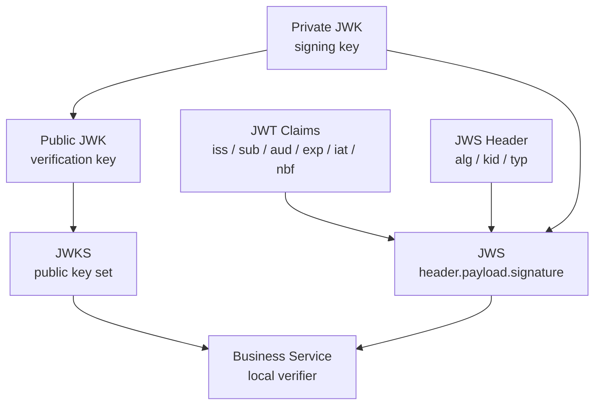

# JWT / JWS / JWK / JWKS / KeyRotation

> 状态：待补证据 · 第一版正文，待继续按 `internal/apiserver/application/authn/token`、AuthN Token/JWKS 代码、KeySet 配置、REST/gRPC 契约、SDK 验签用法和测试逐项核对。

---

## 1. 本文回答

本文回答 10 个问题：

- JWT、JWS、JWK、JWKS、Key Rotation 分别是什么？
- IAM 中 AccessToken / RefreshToken 与 JWT/JWS 的关系是什么？
- 为什么 AccessToken 可以被本地验签，而 RefreshToken 不应被当作普通 Bearer Token 使用？
- JWKS 为什么只发布公钥？
- `kid`、`alg`、`iss`、`aud`、`exp`、`nbf`、`iat` 应该如何理解？
- Key Rotation 为什么需要 active / grace / retired 生命周期？
- 业务系统如何使用 JWKS 做本地验签？
- 本地验签和 AuthZ Check 的边界是什么？
- 常见安全反模式有哪些？
- 修改 Token/JWKS 相关实现后应该执行哪些 Verify？

本文是 Token 与密钥治理专题文档，不替代 AuthN 模块主文档。AuthN 模块总览见 [../02-业务模块/02-AuthN/README.md](../02-业务模块/02-AuthN/README.md)，JWKS 关键链路见 [../02-业务模块/02-AuthN/06-关键链路-JWKS与本地验签.md](../02-业务模块/02-AuthN/06-关键链路-JWKS与本地验签.md)，Token 签发刷新吊销链路见 [../02-业务模块/02-AuthN/05-关键链路-Token签发刷新吊销.md](../02-业务模块/02-AuthN/05-关键链路-Token签发刷新吊销.md)。

---

## 2. 30 秒结论

几个概念的最短定义：

| 概念 | 一句话 | IAM 中的作用 |
| --- | --- | --- |
| JWT | JSON claims 的紧凑表达 | 表达 AccessToken 的 claims，例如 subject、issuer、audience、过期时间 |
| JWS | 对 payload 做签名保护的结构 | 防止 Token claims 被篡改 |
| JWK | JSON 格式的密钥对象 | 表达单把验签公钥或签名私钥的元数据 |
| JWKS | JWK Set，即一组公开 JWK | 公开给业务系统做 AccessToken 本地验签 |
| `kid` | Key ID | Token header 指向使用哪把 key 验签 |
| Key Rotation | 签名密钥生命周期治理 | active / grace / retired 切换，支持平滑换钥 |

IAM Token 主线：

```text
AuthN login success
  -> build Principal
  -> build AccessToken claims
  -> sign as JWS with active private key
  -> token header contains kid / alg
  -> publish public keys as JWKS
  -> business service verifies AccessToken locally by kid
  -> map Principal to AuthZ Subject
  -> AuthZ Check
```

最重要的边界：

```text
JWT 是 claims 表达，不等于权限；
JWS 是签名保护，不等于加密；
JWKS 只发布公钥，不发布私钥；
AccessToken 可作为 Bearer Token；
RefreshToken 不应作为普通 API Bearer Token；
Token 验签成功只代表已认证，不代表授权通过；
provider access_token 不是 IAM AccessToken；
Key retired 后不再用于签名，是否保留验签能力取决于 grace/过期策略。
```

如果只记一句话：

> JWT/JWS 解决“Token 是否可信”，JWKS 解决“业务系统如何验签”，AuthZ 解决“验签后是否有权限”。

---

## 3. 概念关系图



读图规则：

```text
JWT claims 是 payload；
JWS header 指明 alg / kid；
AuthN 使用 private key 签名；
JWKS 发布 public key；
业务系统根据 kid 从 JWKS 选择公钥验签；
验签通过后得到 Principal/claims；
后续授权仍要走 AuthZ Check。
```

---

## 4. JWT：claims 的紧凑表达

JWT 在 IAM 中主要用于表达 AccessToken 的 claims。

典型 claims：

| Claim | 含义 | 说明 |
| --- | --- | --- |
| `iss` | issuer | Token 签发者，应为 IAM 的稳定 issuer |
| `sub` | subject | 认证主体标识，通常对应 Principal 的主体引用 |
| `aud` | audience | Token 目标受众，业务服务验签时应校验 |
| `exp` | expires at | 过期时间，必须校验 |
| `nbf` | not before | 生效时间，若存在必须校验 |
| `iat` | issued at | 签发时间，可用于审计和安全策略 |
| `jti` | token id | Token 唯一标识，可用于吊销、黑名单、审计，具体以实现为准 |
| custom claims | 自定义 claims | 应保持最小化，避免放敏感信息和复杂权限事实 |

边界：

```text
JWT 只是 claims 的表达；
JWT 本身不保证可信，必须有签名或其他保护；
JWT claims 不应承载复杂授权策略；
JWT 中不应放 password、otp、RefreshToken、provider secret、明文手机号、证件号；
JWT claims 应足够小，避免把 User/Profile 全量信息塞进 Token。
```

---

## 5. JWS：签名保护结构

JWS 是对 JWT payload 做签名保护的结构。

典型结构：

```text
base64url(header).base64url(payload).base64url(signature)
```

Header 典型字段：

| 字段 | 含义 | 说明 |
| --- | --- | --- |
| `typ` | token type | 常见为 `JWT`，具体以实现为准 |
| `alg` | signing algorithm | 必须白名单校验，不能信任任意输入 |
| `kid` | key id | 指向 JWKS 中的验签公钥 |

JWS 解决：

```text
payload 是否被篡改；
Token 是否由对应私钥签发；
业务系统是否能用公钥验签。
```

JWS 不解决：

```text
payload 是否加密；
Token 是否仍未吊销，除非结合黑名单/session 状态；
请求者是否有资源访问权限；
业务数据是否可见。
```

安全规则：

```text
禁止接受 alg=none；
alg 必须和配置白名单匹配；
kid 只能用于选 key，不能直接信任；
验签必须同时校验 iss、aud、exp、nbf 等 claims；
签名通过后仍要执行 AuthZ Check。
```

---

## 6. JWK：JSON 密钥对象

JWK 是 JSON 格式的密钥表达。

在 IAM 中分为两类：

```text
private JWK：服务端内部签名使用，绝不公开；
public JWK：公开验签使用，可通过 JWKS 暴露。
```

典型字段：

| 字段 | 含义 |
| --- | --- |
| `kty` | key type，例如 RSA / EC / OKP，具体以实现为准 |
| `kid` | key id |
| `use` | public key use，例如 `sig` |
| `alg` | recommended algorithm |
| public params | 公钥参数，例如 RSA 的 `n` / `e` |
| private params | 私钥参数，绝不进入 JWKS |

边界：

```text
JWK 是密钥对象表达；
JWKS 只能暴露 public JWK；
private key 只存在于服务端安全配置或 KMS/SecretVault；
日志不应打印 private key；
错误响应不应暴露 key material。
```

---

## 7. JWKS：公开验签公钥集合

JWKS 是一组公开 JWK。

它的作用：

```text
业务系统无需请求 IAM introspection；
业务系统可根据 kid 获取公钥；
业务系统可本地验证 AccessToken 签名；
支持多把 key 并存，支撑 Key Rotation。
```

JWKS endpoint 应满足：

```text
只返回公钥；
包含当前 active key 的 public JWK；
在 grace 期保留旧 key 的 public JWK；
不返回 retired 且不再需要验签的 key；
可被缓存，但要有合理 cache-control；
响应不依赖用户登录态；
不暴露 private params。
```

JWKS 与本地验签链路：

```text
Business service receives AccessToken
  -> parse header without trusting claims
  -> read kid / alg
  -> load JWKS from IAM or cache
  -> find public key by kid
  -> verify signature
  -> validate iss / aud / exp / nbf / iat
  -> build authenticated Principal context
  -> call AuthZ Check if resource permission is needed
```

---

## 8. Key Rotation：签名密钥生命周期

Key Rotation 是签名密钥轮换治理。

推荐状态：

| 状态 | 说明 | 是否签发新 Token | 是否允许验签旧 Token |
| --- | --- | --- | --- |
| `active` | 当前签名 key | 是 | 是 |
| `grace` | 旧 key 宽限期 | 否 | 是 |
| `retired` | 已退役 key | 否 | 通常否，具体按 token max lifetime 决定 |

标准轮换链路：

```text
Generate new key
  -> assign kid
  -> publish new public JWK to JWKS
  -> mark new key active
  -> move old active key to grace
  -> sign new AccessToken with new active key
  -> keep old public key for old AccessToken verification
  -> wait until all old AccessToken expired
  -> retire old key
  -> remove old public JWK from JWKS
```

关键点：

```text
先发布新公钥，再用新私钥签名更安全；
旧 key 进入 grace 后不再签发新 Token；
grace 时长至少覆盖 AccessToken 最大有效期和业务系统 JWKS 缓存窗口；
retired key 不应继续用于签名；
private key rotation 需要审计；
kid 必须唯一且稳定。
```

---

## 9. AccessToken 与 RefreshToken 边界

AccessToken：

```text
用于访问普通 API；
通常生命周期较短；
可以是 JWT/JWS；
业务系统可通过 JWKS 本地验签；
验签后得到 Principal/claims；
仍需 AuthZ Check。
```

RefreshToken：

```text
用于换取新的 AccessToken；
生命周期更长；
应由 AuthN 服务端管理；
不应作为普通 API Bearer Token；
不应被业务系统本地验签后当访问凭证；
需要支持吊销、轮换、重放检测等策略，具体以实现为准。
```

边界：

```text
AccessToken 面向资源访问；
RefreshToken 面向认证会话延续；
RefreshToken 泄露风险更高；
普通业务系统只应接受 AccessToken；
RefreshToken 相关接口应只出现在 AuthN token refresh/logout 语义中。
```

---

## 10. 本地验签与 AuthZ 的边界

本地验签回答：

```text
这个 Token 是否由 IAM 签发？
签名是否有效？
是否过期？
issuer/audience 是否匹配？
能否构造认证上下文 Principal？
```

AuthZ Check 回答：

```text
这个 Principal/Subject 能不能对某个 Resource 执行某个 Action？
```

正确链路：

```text
Bearer AccessToken
  -> local verification via JWKS
  -> Principal
  -> map Principal to AuthZ Subject
  -> AuthZ Check(Resource, Action, Scope)
  -> allow / deny
```

禁止：

```text
Token 验签成功后直接访问所有资源；
把 JWT custom claims 当复杂权限策略；
把 ProfileLink 当 RoleBinding；
业务系统只校验 exp，不校验签名；
业务系统只校验签名，不校验 aud/iss/exp；
业务系统绕过 AuthZ Check。
```

---

## 11. 业务系统接入建议

业务系统使用本地验签时：

```text
缓存 JWKS；
按 kid 选择公钥；
严格校验 alg 白名单；
严格校验 iss；
严格校验 aud；
严格校验 exp / nbf；
允许有限 clock skew；
不要信任未验签的 claims；
不要打印完整 Token；
验签通过后仍执行 AuthZ Check。
```

缓存建议：

```text
尊重 JWKS cache-control，若实现提供；
kid 未命中时主动刷新 JWKS；
刷新失败时可短期使用已有缓存，但不能接受未知 kid；
缓存窗口不能长于 key rotation 的 grace 策略；
业务系统应能处理 key rotation 期间的 kid 切换。
```

---

## 12. 安全规则

必须遵守：

```text
private key 不进入 Git；
private key 不进入 JWKS；
private key 不进入日志；
private key 不进入错误响应；
RefreshToken 不作为普通 Bearer Token；
JWT 中不放 password / otp / secret / 明文手机号 / 证件号；
禁止 alg=none；
alg 必须白名单；
kid 不可被当作权限或身份；
JWKS 只用于验签，不用于授权；
Key Rotation 必须审计；
key material 访问应限制在 AuthN token/key 管理组件内。
```

---

## 13. 常见反模式

| 反模式 | 问题 | 推荐做法 |
| --- | --- | --- |
| JWT 不签名 | claims 可被篡改 | 使用 JWS 签名 |
| 接受 `alg=none` | 严重绕过验签 | alg 白名单 |
| 只校验 exp，不校验签名 | 伪造 Token 可通过 | 必须验签 |
| 只验签，不校验 aud/iss | Token 可被跨系统误用 | 校验 iss/aud |
| JWKS 暴露私钥 | 严重密钥泄露 | JWKS 只发布公钥 |
| RefreshToken 当普通 Bearer Token | 长期凭证扩大暴露面 | 只用于 refresh/logout |
| JWT 中放复杂权限 | 权限更新难生效 | AuthZ Check 决策 |
| Token 验签成功直接放行 | 认证授权混淆 | 验签后继续 AuthZ Check |
| key rotation 直接删旧 key | 旧 AccessToken 无法验签 | grace 期保留旧公钥 |
| 日志打印完整 Token | 凭证泄露 | 脱敏或不记录 |

---

## 14. 代码事实源

| 事实 | 路径 |
| --- | --- |
| AuthN Token application | `../..//internal/apiserver/application/authn/token` |
| AuthN domain | `../../internal/apiserver/domain/authn` |
| AuthN transport REST | `../../internal/apiserver/transport/rest` |
| AuthN transport gRPC | `../../internal/apiserver/transport/grpc` |
| AuthN container | `../../internal/apiserver/container` |
| REST OpenAPI | `../../api/rest/authn.v2.yaml` |
| gRPC proto | `../../api/grpc/iam/authn/v2/authn.proto` |
| SDK | `../../pkg/sdk` |
| 架构测试 | `../../internal/pkg/architecture` |
| AuthN JWKS 文档 | `../02-业务模块/02-AuthN/06-关键链路-JWKS与本地验签.md` |
| AuthN Token 文档 | `../02-业务模块/02-AuthN/05-关键链路-Token签发刷新吊销.md` |

注意：上表路径需要继续与当前源码核对。如果目录已调整，应以代码为准并同步更新本文。

---

## 15. Verify

修改 Token / JWKS / Key Rotation 相关代码后至少执行：

```bash
go test ./internal/apiserver/application/authn/...
go test ./internal/apiserver/domain/authn/...
```

涉及 REST / gRPC：

```bash
make api-validate
make proto-gen
go test ./internal/apiserver/transport/rest/...
go test ./internal/apiserver/transport/grpc/...
```

涉及 SDK：

```bash
go test ./pkg/sdk/...
```

涉及分层依赖：

```bash
go test ./internal/pkg/architecture
```

修改本文后至少执行：

```bash
make docs-hygiene
```

建议补充的测试：

```text
AccessToken 签发包含 kid；
JWKS 只返回 public key；
未知 kid 验签失败；
过期 Token 验签失败；
错误 aud/iss 验签失败；
alg 不在白名单时失败；
active key 用于新签发；
grace key 可验旧 Token；
retired key 不再签发；
RefreshToken 不能访问普通 API。
```

---

## 16. 本文总结

JWT / JWS / JWK / JWKS / Key Rotation 可以压缩成：

```text
JWT：claims 表达；
JWS：签名保护；
JWK：JSON 密钥对象；
JWKS：公开验签公钥集合；
Key Rotation：active / grace / retired 生命周期治理。
```

IAM 中的核心链路是：

```text
AuthN 使用 active private key 签发 AccessToken；
AccessToken header 带 kid；
JWKS 发布 public keys；
业务系统根据 kid 本地验签；
验签通过后构造 Principal；
资源访问仍要走 AuthZ Check。
```

最重要的工程规则是：

```text
签名不等于加密；
验签不等于授权；
公钥可以发布，私钥绝不发布；
AccessToken 用于资源访问；
RefreshToken 只用于刷新；
Key Rotation 必须保留 grace 期；
Token、secret、private key 不进日志；
JWT claims 最小化，不承载复杂权限事实。
```
