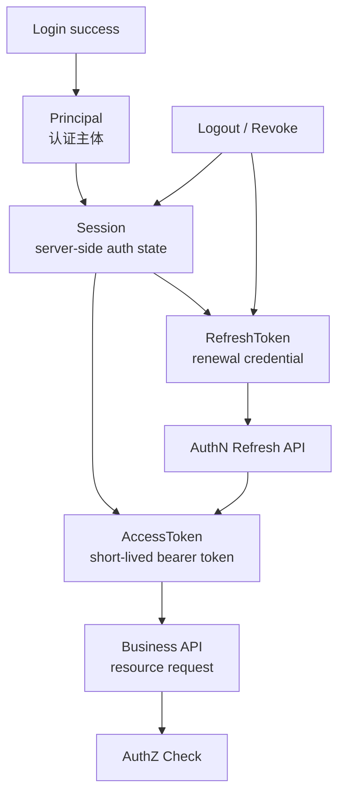

# Session / AccessToken / RefreshToken 边界

> 状态：规划改造 · 已完成当前事实盘点；正文仍含待实现或尚未收敛的设计内容，不得作为现有能力承诺。

---

## 1. 本文回答

本文回答 10 个问题：

- Session、AccessToken、RefreshToken 分别是什么？
- 为什么三者不能混成一个“登录 token”？
- AccessToken 为什么应该短期有效？
- RefreshToken 为什么不能作为普通 API Bearer Token？
- Session 与 RefreshToken 是什么关系？
- Token 刷新、续期、吊销和登出分别应该改变什么状态？
- AccessToken 本地验签与 Session 状态检查的边界是什么？
- RefreshToken 轮换和重放检测应该如何理解？
- 业务系统接入时应该只接受哪类 Token？
- 修改相关实现后应该执行哪些 Verify？

本文是 AuthN 会话与 Token 边界专题文档，不替代 AuthN 模块主文档。
AuthN 模块总览见 [../02-业务模块/02-AuthN/README.md](../02-业务模块/02-AuthN/README.md)；
Token 签发刷新吊销链路见 [../02-业务模块/02-AuthN/05-关键链路-Token签发刷新吊销.md](../02-业务模块/02-AuthN/05-关键链路-Token签发刷新吊销.md)；
JWKS 与本地验签见 [../02-业务模块/02-AuthN/06-关键链路-JWKS与本地验签.md](../02-业务模块/02-AuthN/06-关键链路-JWKS与本地验签.md)；

---

## 2. 30 秒结论

三者最短定义：

| 对象 | 一句话 | 主要用途 | 是否给普通业务 API 使用 |
| --- | --- | --- | --- |
| `Session` | 服务端认证会话状态 | 表达一次登录会话、设备、生命周期、吊销状态 | 否，服务端内部状态 |
| `AccessToken` | 短期访问凭证 | 调用普通业务 API，表达已认证 Principal | 是，作为 Bearer Token |
| `RefreshToken` | 续期凭证 | 向 AuthN 换取新的 AccessToken | 否，只用于 refresh/logout 等 AuthN 接口 |

核心主线：

```text
Login success
  -> create Session
  -> issue AccessToken(short-lived)
  -> issue RefreshToken(longer-lived, server-side managed)
  -> business API uses AccessToken
  -> refresh endpoint uses RefreshToken
  -> logout/revoke invalidates Session / RefreshToken state
```

最重要的边界：

```text
Session 是服务端状态；
AccessToken 是短期访问凭证；
RefreshToken 是续期凭证；
AccessToken 可以通过 JWKS 本地验签；
RefreshToken 不应作为普通 API Bearer Token；
Token 验签成功不等于授权通过；
登出主要影响 Session/RefreshToken，已签发 AccessToken 是否立即失效取决于黑名单/短 TTL 策略；
业务系统只应接受 AccessToken，不应接受 RefreshToken。
```

如果只记一句话：

> Session 管“这次登录还在不在”，AccessToken 管“这次请求是否已认证”，RefreshToken 管“能不能续发新的 AccessToken”。

---

## 3. 三者关系图



读图规则：

```text
登录成功后创建 Session；
AccessToken 和 RefreshToken 都由 AuthN 基于认证结果签发或生成；
业务 API 使用 AccessToken；
刷新接口使用 RefreshToken；
登出/吊销主要改变服务端 Session / RefreshToken 状态；
业务资源访问仍要经过 AuthZ Check。
```

---

## 4. Session：服务端认证会话状态

Session 是服务端认证上下文，不是普通业务 API 的 Bearer Token。

它通常表达：

```text
session_id；
principal_id / user_id / login_identity_id，具体以实现为准；
device / client / app_id；
created_at；
last_seen_at；
expires_at；
revoked_at；
refresh token family / current refresh token id，若实现支持；
安全状态，例如 locked、revoked、risk state，具体以实现为准。
```

Session 解决：

```text
这次登录会话是否仍有效；
是否已登出；
是否被管理员吊销；
是否允许继续刷新 Token；
是否需要统一管理多端登录、设备、风险控制。
```

Session 不解决：

```text
普通业务 API 的直接访问凭证；
JWT 签名验签；
资源授权决策；
外部 provider 身份解析；
Profile 可见性过滤。
```

边界：

```text
Session 是服务端状态；
Session 不应被业务系统直接当 Token 使用；
Session 不应暴露敏感内部字段；
Session 状态变化应影响 RefreshToken 是否可继续续期；
是否让 Session 状态影响 AccessToken 即时有效性，取决于是否启用 introspection/黑名单/短 TTL 策略。
```

---

## 5. AccessToken：短期访问凭证

AccessToken 是普通业务 API 的短期访问凭证。

它通常表达：

```text
issuer；
subject / principal reference；
audience；
issued_at；
not_before；
expires_at；
token_id，若实现支持；
minimal custom claims。
```

AccessToken 解决：

```text
请求是否携带有效认证凭证；
业务系统能否通过 JWKS 本地验签；
能否构造 Principal 上下文；
能否进入后续 AuthZ Check。
```

AccessToken 不解决：

```text
长期会话续期；
RefreshToken 重放检测；
复杂资源授权；
用户/Profile 事实的实时更新；
外部 provider token 管理。
```

边界：

```text
AccessToken 生命周期应短；
AccessToken 可以是 JWT/JWS；
AccessToken 可以通过 JWKS 本地验签；
AccessToken 不应包含 password、otp、secret、RefreshToken、明文手机号、证件号；
AccessToken 验签成功只代表已认证，不代表有资源权限；
普通业务系统只应接受 AccessToken 作为 Bearer Token。
```

---

## 6. RefreshToken：续期凭证

RefreshToken 是用来换取新 AccessToken 的凭证。

它解决：

```text
AccessToken 过期后如何续期；
用户不重新登录的情况下如何延续认证会话；
服务端如何管理长生命周期会话；
登出/吊销后如何阻止继续续期；
重放检测和 Token family 风险控制，若实现支持。
```

RefreshToken 不解决：

```text
普通业务资源访问；
业务系统本地验签；
资源授权；
Profile 可见性过滤；
外部 provider 身份解析。
```

边界：

```text
RefreshToken 不应作为普通 API Bearer Token；
RefreshToken 只应提交给 AuthN refresh/logout/revoke 相关接口；
RefreshToken 生命周期通常长于 AccessToken；
RefreshToken 泄露风险更高；
RefreshToken 应服务端可吊销；
RefreshToken 建议支持轮换和重放检测，具体以实现为准。
```

---

## 7. 生命周期对比

| 维度 | Session | AccessToken | RefreshToken |
| --- | --- | --- | --- |
| 位置 | 服务端状态 | 客户端持有，服务端签发 | 客户端持有，服务端管理 |
| 生命周期 | 中长，受登录状态影响 | 短 | 中长 |
| 主要用途 | 会话管理 | 访问普通 API | 换取新 AccessToken |
| 是否本地验签 | 不适用 | 可以，若为 JWT/JWS | 不推荐作为普通验签凭证 |
| 是否可吊销 | 是 | 可通过短 TTL/黑名单/introspection 策略 | 是，必须可控 |
| 泄露风险 | 服务端内部风险 | 中 | 高 |
| 业务 API 是否接受 | 否 | 是 | 否 |
| 是否进入 AuthZ | 间接 | 验签后进入 | 不进入普通资源 AuthZ |

---

## 8. 登录链路

标准登录链路：

```text
Login request
  -> AuthN verifies Credential / ExternalIdentity / Challenge
  -> build Principal
  -> create Session
  -> issue AccessToken
  -> issue RefreshToken
  -> return token pair and expiration metadata
```

边界：

```text
登录成功创建认证上下文；
Session 是服务端状态；
AccessToken 用于业务访问；
RefreshToken 用于续期；
登录成功不代表拥有所有业务权限；
业务访问仍要 AuthZ Check。
```

---

## 9. 刷新链路

标准刷新链路：

```text
Refresh request
  -> submit RefreshToken
  -> validate refresh token format / hash / id
  -> load Session / token family state
  -> check revoked / expired / reused
  -> rotate RefreshToken，若实现支持
  -> issue new AccessToken
  -> return new token pair or new AccessToken
```

关键点：

```text
RefreshToken 只进入 AuthN refresh endpoint；
RefreshToken 校验应查服务端状态；
刷新应检查 Session 是否仍有效；
建议 RefreshToken 使用一次性轮换，具体以实现为准；
如果发现旧 RefreshToken 被重复使用，应视为重放风险，可能吊销整个 token family。
```

边界：

```text
刷新不是重新登录；
刷新不应绕过 Session revoked 状态；
刷新不应绕过账号锁定、LoginIdentity disabled 等安全状态，具体以实现为准；
RefreshToken 不应通过 JWKS 当普通 Token 验签后放行。
```

---

## 10. 登出、吊销与失效

登出/吊销可能影响三类对象：

```text
Session：标记 revoked / expired；
RefreshToken：标记 revoked / used / rotated / family revoked；
AccessToken：依赖短 TTL、黑名单或 introspection 策略。
```

常见策略：

| 策略 | 说明 | 优点 | 代价 |
| --- | --- | --- | --- |
| 短 TTL AccessToken | AccessToken 很快自然过期 | 简单，适合本地验签 | 登出后短窗口仍可能有效 |
| AccessToken blacklist | 记录 jti 黑名单 | 可即时吊销 | 业务系统或网关需要查询状态 |
| Introspection | 每次或关键接口向 AuthN 查询 Token 状态 | 最强控制 | 增加延迟和 AuthN 依赖 |
| RefreshToken revoke | 禁止继续刷新 | 控制长期会话 | 不立即影响已发 AccessToken |
| Session revoke | 禁止该会话继续续期 | 管理会话 | AccessToken 即时失效仍需配套策略 |

推荐理解：

```text
登出一定要阻止继续刷新；
是否立即让 AccessToken 失效，需要额外黑名单/introspection；
如果不做黑名单/introspection，就必须依赖短 TTL 降低风险；
高风险操作可要求重新认证或实时检查 Session 状态。
```

---

## 11. RefreshToken 轮换与重放检测

RefreshToken 轮换是指：

```text
每次刷新时消费旧 RefreshToken，并返回新的 RefreshToken。
```

推荐模型：

```text
refresh_token_family_id
  -> current_refresh_token_id
  -> used / rotated / revoked state
  -> reuse detection
```

重放检测：

```text
如果一个已被使用或已轮换的 RefreshToken 再次出现，说明可能泄露或并发重放；
系统可以吊销整个 token family；
系统可以要求用户重新登录；
系统应记录审计事件。
```

边界：

```text
RefreshToken 轮换不是 AccessToken 轮换；
AccessToken 短 TTL 不能替代 RefreshToken 重放检测；
RefreshToken 重放检测依赖服务端状态；
纯无状态 JWT RefreshToken 不利于精细吊销和重放检测。
```

---

## 12. 本地验签与 Session 状态检查

本地验签适合 AccessToken：

```text
业务系统缓存 JWKS；
按 kid 找公钥；
验签；
校验 iss/aud/exp/nbf；
构造 Principal；
执行 AuthZ Check。
```

Session 状态检查适合：

```text
refresh；
logout；
revoke；
高风险操作；
需要即时吊销能力的接口；
需要检查账号/会话风险状态的场景。
```

边界：

```text
本地验签降低 AuthN 运行时依赖；
本地验签无法天然知道 Session 是否刚刚被吊销；
需要即时吊销时要引入 blacklist/introspection/session check；
不要让所有普通 API 都强依赖 AuthN 状态查询，除非明确需要。
```

---

## 13. AuthZ 边界

AccessToken 验签成功后只能得到认证上下文。

后续仍必须：

```text
Principal
  -> map to AuthZ Subject
  -> build Resource / Action / Scope
  -> AuthZ Check
  -> allow / deny
```

禁止：

```text
把 AccessToken 中的 claims 当完整权限；
把 Session 存在当授权通过；
把 RefreshToken 能刷新当资源访问权限；
把 ProfileLink 当 RoleBinding；
业务系统只校验 Token 不做 AuthZ Check。
```

---

## 14. 业务系统接入规则

业务系统应该：

```text
只接受 AccessToken 访问普通 API；
通过 Authorization: Bearer <access_token> 传递；
校验签名、iss、aud、exp、nbf；
验签通过后构造 Principal；
继续执行 AuthZ Check；
遇到 401 触发重新登录或 refresh 流程；
遇到 403 不要盲目 refresh，应按无权限处理；
日志中不打印完整 Token。
```

业务系统不应该：

```text
接受 RefreshToken 调普通业务 API；
把 SessionID 当 Bearer Token；
自行解析 provider access_token/openid 充当 IAM Principal；
只根据 Token claims 做复杂授权；
把 RefreshToken 存在前端不安全位置；
在日志、错误、埋点中记录 token 明文。
```

---

## 15. 安全规则

必须遵守：

```text
AccessToken 短 TTL；
RefreshToken 长 TTL 但服务端可吊销；
RefreshToken 只用于 refresh/logout/revoke；
RefreshToken 建议轮换和重放检测；
Session 状态改变要影响 refresh 能力；
Token 中不放 password/otp/secret/明文手机号/证件号；
完整 Token 不进日志；
RefreshToken 存储服务端应使用 hash 或等价安全策略，具体以实现为准；
高风险操作可要求重新认证或 Session 状态检查；
Token 验签成功后仍要 AuthZ Check。
```

---

## 16. 常见反模式

| 反模式 | 问题 | 推荐做法 |
| --- | --- | --- |
| 把 Session/AccessToken/RefreshToken 都叫登录 token | 边界混乱 | 分别命名和建模 |
| RefreshToken 调普通业务 API | 长期凭证暴露面扩大 | 普通 API 只接受 AccessToken |
| AccessToken 生命周期过长 | 泄露后风险大 | 短 TTL + refresh |
| 登出只删前端 Token | 服务端仍可刷新 | revoke Session/RefreshToken |
| 本地验签后认为已授权 | 认证授权混淆 | 验签后 AuthZ Check |
| RefreshToken 不可吊销 | 无法控制长期会话 | 服务端状态管理 |
| RefreshToken 不轮换 | 泄露后难发现 | 支持 rotation/reuse detection |
| 日志打印完整或部分 Token | 凭证泄露 | 完全不记录 Token、Redis key 或摘要 |
| 把 provider access_token 当 IAM AccessToken | 外部/内部 Token 混淆 | 通过 IDP/AuthN 换 IAM Token |
| 用 JWT 存复杂权限 | 权限更新不及时 | AuthZ 决策 |

---

## 17. 代码事实源

| 事实 | 路径 |
| --- | --- |
| AuthN application | `../../internal/apiserver/application/authn` |
| AuthN token application | `../../internal/apiserver/application/authn/token` |
| AuthN domain | `../../internal/apiserver/domain/authn` |
| AuthN transport REST | `../../internal/apiserver/transport/rest` |
| AuthN transport gRPC | `../../internal/apiserver/transport/grpc` |
| AuthN container | `../../internal/apiserver/container` |
| REST OpenAPI | `../../api/rest/authn.v2.yaml` |
| gRPC proto | `../../api/grpc/iam/authn/v2/authn.proto` |
| SDK | `../../pkg/sdk` |
| 架构测试 | `../../internal/pkg/architecture` |
| AuthN Token 文档 | `../02-业务模块/02-AuthN/05-关键链路-Token签发刷新吊销.md` |
| AuthN JWKS 文档 | `../02-业务模块/02-AuthN/06-关键链路-JWKS与本地验签.md` |

注意：上表路径需要继续与当前源码核对。如果目录已调整，应以代码为准并同步更新本文。

---

## 18. Verify

修改 Session / AccessToken / RefreshToken 相关代码后至少执行：

```bash
go test ./internal/apiserver/application/authn/...
go test ./internal/apiserver/domain/authn/...
```

涉及 REST / gRPC：

```bash
make api-validate
make proto-gen
go test ./internal/apiserver/transport/rest/...
go test ./internal/apiserver/transport/grpc/...
```

涉及 SDK：

```bash
go test ./pkg/sdk/...
```

涉及分层依赖：

```bash
go test ./internal/pkg/architecture
```

修改本文后至少执行：

```bash
make docs-hygiene
```

建议补充的测试：

```text
登录成功创建 Session；
登录成功返回 AccessToken 和 RefreshToken；
AccessToken 过期后普通 API 拒绝；
RefreshToken 可换取新 AccessToken；
已吊销 RefreshToken 不能刷新；
已登出 Session 不能刷新；
RefreshToken 不能访问普通 API；
RefreshToken 重放触发风险处理，若实现支持；
AccessToken 验签成功后仍需要 AuthZ Check；
Token 不进入日志。
```

---

## 19. 本文总结

Session / AccessToken / RefreshToken 可以压缩成：

```text
Session：服务端认证会话状态；
AccessToken：短期访问凭证；
RefreshToken：续期凭证。
```

核心链路是：

```text
登录创建 Session，并签发 AccessToken + RefreshToken；
业务 API 使用 AccessToken；
刷新接口使用 RefreshToken；
登出/吊销影响 Session 和 RefreshToken；
AccessToken 即时失效依赖短 TTL、黑名单或 introspection 策略；
资源访问最终仍要 AuthZ Check。
```

最重要的工程规则是：

```text
不要把三者混成一个登录 token；
RefreshToken 不进普通 API；
AccessToken 短 TTL；
Session/RefreshToken 服务端可吊销；
刷新链路要防重放；
验签不等于授权；
Token 不进日志；
业务系统只接受 AccessToken，并继续执行 AuthZ Check。
```
