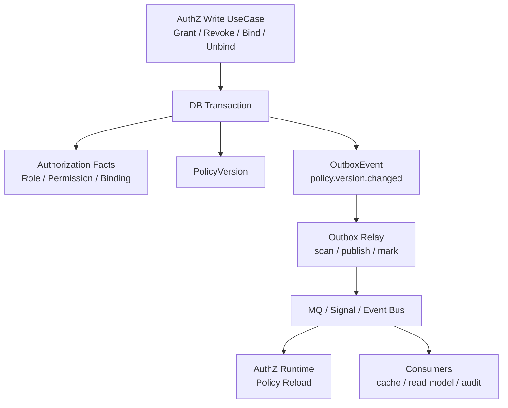

# Transactional Outbox 设计

> 状态：设计目标 · 第一版正文，待继续按 `internal/apiserver/application/authz`、AuthZ 授权写入链路、PolicyVersion、Outbox store、relay、MQ/事件发布、RuntimeReload 和测试逐项核对。

---

## 1. 本文回答

本文回答 10 个问题：

- Transactional Outbox 解决什么问题？
- 它为什么不是消息队列？
- 它为什么不承诺 exactly-once？
- IAM 哪些场景需要 Outbox？
- AuthZ 授权事实写入与 PolicyVersion 事件发布如何保持一致？
- Outbox event、业务事件、MQ message、RuntimeReload 之间是什么关系？
- Relay 如何扫描、发布、重试和标记状态？
- 消费端如何做幂等？
- Outbox 积压、重复发布、发布失败应该如何处理？
- 修改 Outbox 相关实现后应该执行哪些 Verify？

本文是 Transactional Outbox 专题文档，不替代 AuthZ 模块主文档。
AuthZ 模块总览见 [../02-业务模块/03-AuthZ/README.md](../02-业务模块/03-AuthZ/README.md)；
授权版本传播链路见 [../02-业务模块/03-AuthZ/04-关键链路-授权版本传播PolicyVersion-Outbox-RuntimeReload.md](../02-业务模块/03-AuthZ/04-关键链路-授权版本传播PolicyVersion-Outbox-RuntimeReload.md)；

---

## 2. 30 秒结论

Transactional Outbox 用于解决“业务事实写入”和“事件发布”之间的双写一致性问题。

核心模式：

```text
业务事务内：
  写业务表 / 授权事实
  写 outbox_event
  commit

事务外：
  relay 扫描 outbox_event
  发布 MQ / Signal / RuntimeReload event
  标记 published 或等待重试
```

它保证：

```text
只要业务事务提交，待发布事件也一定被记录；
如果业务事务回滚，待发布事件也不会单独存在；
事件发布失败可以通过 relay 重试；
消费端可以基于 event_id / aggregate_id / version 做幂等。
```

它不保证：

```text
不是消息队列；
不提供 exactly-once；
不保证消费端只收到一次；
不保证事件实时发布；
不替代 MQ；
不替代消费者幂等；
不替代分布式事务。
```

如果只记一句话：

> Outbox 解决“本地事务内先可靠记录事件”，MQ/Signal 解决“把事件送出去”，消费者幂等解决“重复收到也不出错”。

---

## 3. 为什么需要 Transactional Outbox

没有 Outbox 时，常见双写链路是：

```text
write business data
  -> commit db transaction
  -> publish event
```

或者：

```text
publish event
  -> write business data
  -> commit db transaction
```

这两种都会有问题。

### 3.1 先写库再发事件

```text
业务事实写入成功；
事务提交成功；
发布事件失败；
下游永远不知道事实已经变化。
```

风险：

```text
AuthZ policy 写入成功，但 Runtime 没有 reload；
业务系统继续使用旧授权快照；
缓存、索引、读模型不同步；
人工排查困难。
```

---

### 3.2 先发事件再写库

```text
事件发布成功；
业务事务失败或回滚；
下游看到一个并不存在的事实。
```

风险：

```text
Runtime 提前 reload；
消费者读取不到对应业务事实；
事件语义污染；
补偿复杂。
```

---

### 3.3 Outbox 的解决方式

Outbox 把“业务事实”和“待发布事件”写入同一个本地事务。

```text
begin transaction
  -> write authorization facts
  -> write policy_version
  -> write outbox_event(policy.changed)
commit transaction

relay async publish event
```

这样可以保证：

```text
业务事实和待发布事件同生共死；
发布失败可以事后重试；
不需要在业务事务中依赖 MQ 可用性；
避免跨数据库/消息队列的强分布式事务。
```

---

## 4. IAM 中的典型场景

IAM 最典型的 Outbox 场景是 AuthZ 授权事实变更。

例如：

```text
Grant Permission；
Revoke Permission；
Bind Role；
Unbind Role；
PolicyVersion bump；
Casbin runtime reload；
权限缓存失效；
SDK/业务系统感知策略版本变化，若实现支持。
```

核心问题：

```text
授权事实已经写入；
AuthZ runtime 必须最终感知；
如果 RuntimeReload 事件丢失，授权结果可能长期停留在旧版本。
```

Outbox 链路：

```text
AuthZ write use case
  -> write Role / Permission / RoleBinding / PolicyVersion
  -> write OutboxEvent(policy.version.changed)
  -> commit
  -> Relay publish event
  -> RuntimeReload subscriber receives event
  -> reload policy snapshot / invalidate cache
```

---

## 5. Outbox 总图



读图规则：

```text
UseCase 只在本地事务中写事实和 Outbox；
Relay 在事务外异步发布；
MQ/Signal 负责传递；
Runtime/Consumer 负责幂等消费；
Outbox 不是 MQ，也不替代消费者幂等。
```

---

## 6. Outbox Event 模型

Outbox event 应表达“要发布的一条事件记录”。

典型字段：

| 字段 | 含义 | 说明 |
| --- | --- | --- |
| `id` | outbox event id | 全局唯一，用于幂等和追踪 |
| `event_type` | 事件类型 | 例如 `authz.policy_version.changed` |
| `aggregate_type` | 聚合类型 | 例如 `PolicyVersion` / `RoleBinding` |
| `aggregate_id` | 聚合 ID | 关联业务事实 |
| `aggregate_version` | 聚合版本 | 支持按版本幂等或乱序处理 |
| `payload` | 事件负载 | 应包含消费者所需的最小字段 |
| `status` | 发布状态 | pending / publishing / published / failed |
| `attempts` | 尝试次数 | 用于重试和告警 |
| `next_attempt_at` | 下次尝试时间 | 用于退避 |
| `created_at` | 创建时间 | 用于延迟和积压监控 |
| `published_at` | 发布时间 | 成功发布时间 |
| `last_error` | 最近错误 | 只存安全可公开摘要，不存敏感信息 |

边界：

```text
OutboxEvent 是待发布记录，不是领域事实本身；
payload 不应塞入过大的业务快照；
payload 不应包含 token、secret、password、明文手机号、证件号；
OutboxEvent 不等于 MQ message，但可以被 relay 转成 MQ message；
OutboxEvent id 应进入 MQ message header 或 body，方便幂等。
```

---

## 7. PolicyVersion 与 Outbox 的关系

PolicyVersion 表达授权策略版本。

Outbox 负责传播“版本变化”事件。

推荐关系：

```text
AuthZ write use case
  -> modify authorization facts
  -> bump PolicyVersion
  -> write OutboxEvent{
       event_type: authz.policy_version.changed,
       aggregate_type: PolicyVersion,
       aggregate_id: policy_scope_id,
       aggregate_version: new_version
     }
```

消费端处理：

```text
receive policy.version.changed
  -> read aggregate_version
  -> if version <= current_loaded_version: ignore
  -> else reload policy snapshot
  -> mark current_loaded_version = new_version
```

这样可以处理：

```text
重复事件；
乱序事件；
延迟事件；
relay 重试；
consumer 重启后重新消费。
```

---

## 8. Relay 发布模型

Relay 是 Outbox 的异步发布组件。

它负责：

```text
扫描 pending / failed 且 next_attempt_at 到期的事件；
抢占或锁定一批事件；
发布到 MQ / Signal / Event Bus；
发布成功后标记 published；
发布失败后增加 attempts、记录 last_error、设置 next_attempt_at；
超过最大次数后进入 failed 或 dead-letter 语义，具体以实现为准。
```

典型流程：

```text
loop:
  events = fetchPending(limit)
  for event in events:
    markPublishing(event)
    err = publish(event)
    if err == nil:
      markPublished(event)
    else:
      markFailedWithBackoff(event, err)
  sleep or wait
```

关键点：

```text
Relay 可以重复发布同一事件；
Relay 不应在发布成功前删除事件；
Relay 的状态更新要能抗进程崩溃；
Relay 需要并发抢占控制，避免多个 relay 重复处理过多；
即使重复发布，消费者也必须幂等。
```

---

## 9. 发布语义：At-least-once，不是 exactly-once

Transactional Outbox 通常提供 at-least-once 发布语义。

原因：

```text
Relay 发布 MQ 成功后，标记 Outbox published 前可能崩溃；
下次 relay 会再次发布同一事件；
MQ 本身也可能重投递；
Consumer 处理成功后，ack 前也可能崩溃。
```

因此必须接受：

```text
事件可能重复；
事件可能延迟；
事件可能乱序；
消费者必须幂等；
需要监控积压和失败。
```

禁止宣称：

```text
Outbox 保证 exactly-once；
Outbox 保证消费者只收到一次；
Outbox 代替 MQ；
Outbox 代替消费者幂等。
```

---

## 10. 消费端幂等

消费端必须幂等。

常见幂等依据：

```text
event_id；
aggregate_id + aggregate_version；
policy_scope_id + policy_version；
consumer_name + event_id processed table；
current_loaded_version >= event_version。
```

AuthZ RuntimeReload 推荐策略：

```text
if event.version <= runtime.current_version:
  ignore
else:
  reload policy snapshot
  set runtime.current_version = event.version
```

其他消费者推荐：

```text
记录 processed_event_id；
重复事件直接跳过；
处理过程和 processed 标记尽量保持原子；
如果不能原子，也要保证重复处理无副作用。
```

---

## 11. 事务边界

Outbox 必须在业务事务内写入。

正确：

```text
begin tx
  write authz facts
  bump policy version
  insert outbox event
commit tx
```

错误：

```text
commit authz facts
insert outbox event outside tx
```

错误：

```text
publish MQ inside tx
commit authz facts
```

原因：

```text
Outbox 的核心价值就是业务事实和待发布事件同事务；
MQ 发布不应成为业务事务提交的强依赖；
事务内只记录待发布事件，不做外部不可控 I/O。
```

---

## 12. Outbox 与 MQ 的边界

| 对象 | 职责 | 不负责 |
| --- | --- | --- |
| Outbox | 本地事务内可靠记录待发布事件 | 跨服务投递、消费者订阅、消息路由 |
| Relay | 扫描 Outbox 并发布 | 业务事实写入、消费者业务逻辑 |
| MQ / Signal | 传递事件 | 本地事务一致性 |
| Consumer | 幂等处理事件 | 保证事件只收到一次 |

边界：

```text
Outbox 不是 MQ；
MQ 不是本地事务表；
Relay 是 Outbox 和 MQ 之间的桥；
Consumer 幂等是最终一致链路的一部分。
```

---

## 13. Outbox 与分布式事务的边界

Outbox 不是强分布式事务。

它选择的是：

```text
本地事务强一致；
跨系统事件最终一致；
消费者幂等；
失败可重试；
积压可观测。
```

它不提供：

```text
跨数据库和 MQ 的两阶段提交；
跨服务同步强一致；
全链路 exactly-once；
消费者业务操作自动回滚。
```

适合 IAM 的原因：

```text
AuthZ policy 写入需要可靠传播；
Runtime reload 可以最终一致；
重复 reload 可接受；
版本号可以处理乱序和重复；
不需要引入复杂 2PC。
```

---

## 14. 失败、重试与积压治理

Relay 失败需要可观测。

监控指标建议：

```text
outbox_pending_count；
outbox_failed_count；
outbox_publish_latency；
outbox_oldest_pending_age；
outbox_publish_attempts；
outbox_publish_success_total；
outbox_publish_failure_total；
relay_loop_errors；
consumer_lag；
runtime_policy_version_lag。
```

重试策略建议：

```text
指数退避；
最大尝试次数；
dead-letter 或 failed 状态；
人工重放入口，若需要；
按 event_type 分级告警；
按 oldest_pending_age 告警。
```

积压风险：

```text
授权变更后 Runtime 长时间不更新；
消费者读模型落后；
业务侧看到旧权限；
重复重试压垮 MQ 或下游。
```

---

## 15. 数据清理与保留

Outbox 不能无限增长。

建议：

```text
published 事件保留一段审计窗口；
failed 事件保留更长时间用于排查；
清理任务按 status 和 created_at/published_at 删除；
清理前确保不影响幂等记录；
关键事件可归档到审计系统，若实现支持。
```

注意：

```text
不要过早删除 pending / failed 事件；
不要删除仍可能被消费者用于去重的记录；
清理策略要和审计、合规、排查需求匹配。
```

---

## 16. IAM AuthZ 推荐事件

AuthZ Outbox 事件建议保持语义稳定。

典型事件：

```text
authz.policy_version.changed；
authz.role_binding.created；
authz.role_binding.revoked；
authz.permission.granted；
authz.permission.revoked；
authz.runtime_reload.requested；
```

其中最核心的是：

```text
authz.policy_version.changed
```

因为 RuntimeReload 最关心的是：

```text
哪个授权域 / policy scope 的策略版本变了；
新版本号是多少；
是否需要 reload；
重复或旧版本事件能否忽略。
```

---

## 17. 安全规则

必须遵守：

```text
Outbox payload 不放 token；
Outbox payload 不放 password / otp / secret；
Outbox payload 不放明文手机号 / 证件号；
last_error 不记录敏感 raw error；
relay 日志不打印敏感 payload；
事件 payload 最小化；
消费者不能信任事件绕过 AuthZ 事实读取，必要时回查事实源；
人工重放需要审计。
```

---

## 18. 常见反模式

| 反模式 | 问题 | 推荐做法 |
| --- | --- | --- |
| 业务提交后再单独写 Outbox | 仍有双写丢事件风险 | 同事务写业务事实和 Outbox |
| 事务内直接发布 MQ | 外部 I/O 影响事务 | 事务内只写 Outbox，事务外 Relay 发布 |
| 认为 Outbox 是 MQ | 职责混淆 | Outbox 记录待发布，MQ 负责投递 |
| 宣称 exactly-once | 不符合现实语义 | 明确 at-least-once + 幂等 |
| 消费端不幂等 | 重复事件导致副作用 | event_id/version 幂等 |
| Relay 成功发布前删除事件 | 崩溃后丢事件 | 成功发布后标记 published |
| Outbox payload 放敏感信息 | 日志/消息泄露 | payload 最小化和脱敏 |
| 不监控 pending 积压 | 延迟不可见 | pending/oldest age 告警 |
| 不保留 failed 事件 | 无法排查 | failed 状态和人工处理 |
| PolicyVersion 不带版本号 | 难处理乱序重复 | aggregate_version/version 必传 |

---

## 19. 代码事实源

| 事实 | 路径 |
| --- | --- |
| AuthZ application | `../../internal/apiserver/application/authz` |
| AuthZ domain | `../../internal/apiserver/domain/authz` |
| AuthZ infra | `../../internal/apiserver/infra` |
| Outbox store / relay | `../../internal/apiserver/infra`，具体以当前代码为准 |
| AuthZ transport REST | `../../internal/apiserver/transport/rest` |
| AuthZ transport gRPC | `../../internal/apiserver/transport/grpc` |
| AuthZ container | `../../internal/apiserver/container` |
| REST OpenAPI | `../../api/rest/authz.v2.yaml` |
| gRPC proto | `../../api/grpc/iam/authz/v2/authz.proto` |
| 架构测试 | `../../internal/pkg/architecture` |
| AuthZ PolicyVersion 文档 | `../02-业务模块/03-AuthZ/04-关键链路-授权版本传播PolicyVersion-Outbox-RuntimeReload.md` |

注意：上表路径需要继续与当前源码核对。如果目录已调整，应以代码为准并同步更新本文。

---

## 20. Verify

修改 Outbox / PolicyVersion / RuntimeReload 相关代码后至少执行：

```bash
go test ./internal/apiserver/application/authz/...
go test ./internal/apiserver/domain/authz/...
```

涉及 infra / relay：

```bash
go test ./internal/apiserver/infra/...
```

涉及 REST / gRPC：

```bash
make api-validate
make proto-gen
go test ./internal/apiserver/transport/rest/...
go test ./internal/apiserver/transport/grpc/...
```

涉及 container：

```bash
go test ./internal/apiserver/container/...
```

涉及架构边界：

```bash
go test ./internal/pkg/architecture
```

修改本文后至少执行：

```bash
make docs-hygiene
```

建议补充的测试：

```text
授权写入和 Outbox 插入在同一事务内；
事务回滚时不产生 OutboxEvent；
事务提交后 OutboxEvent 存在；
Relay 发布成功后标记 published；
Relay 发布失败后 attempts 增加并进入退避；
重复发布同一 event 消费端幂等；
PolicyVersion 旧版本事件被忽略；
RuntimeReload 可处理重复事件；
Outbox payload 不包含敏感字段。
```

---

## 21. 本文总结

Transactional Outbox 可以压缩成：

```text
在本地业务事务内同时写业务事实和待发布事件；
事务提交后由 Relay 异步发布；
发布失败可以重试；
重复发布由消费者幂等处理。
```

IAM 中最重要的场景是：

```text
AuthZ 授权事实写入
  -> PolicyVersion bump
  -> OutboxEvent(policy.version.changed)
  -> Relay publish
  -> RuntimeReload
  -> AuthZ runtime 更新策略快照
```

最重要的工程规则是：

```text
Outbox 不是 MQ；
Outbox 不承诺 exactly-once；
Outbox 必须和业务事实同事务；
Relay 可以重复发布；
Consumer 必须幂等；
PolicyVersion 需要版本号；
Outbox 积压必须可观测；
payload 不放敏感信息。
```
