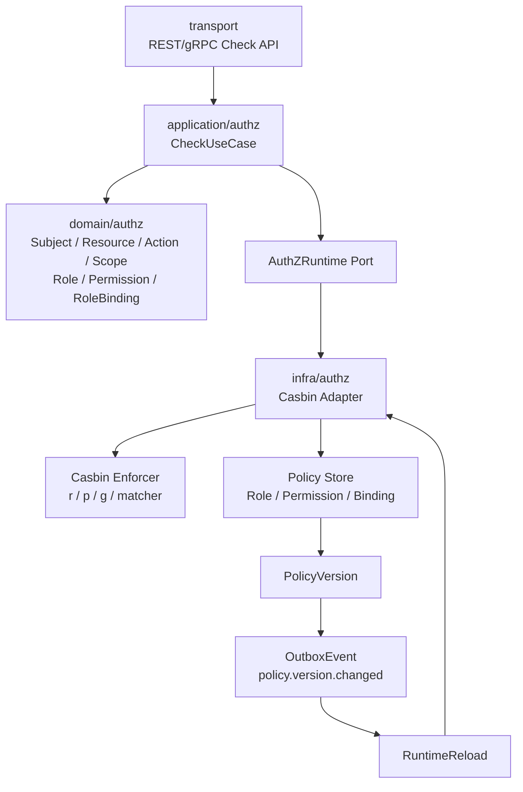

# Casbin 在 AuthZ 中的定位

> 状态：待补证据 · 第一版正文，待继续按 `internal/apiserver/domain/authz`、`application/authz`、`infra/authz`、Casbin adapter、PolicyVersion、RuntimeReload、REST/gRPC 契约和测试逐项核对。

---

## 1. 本文回答

本文回答 10 个问题：

- Casbin 在 IAM AuthZ 中到底是什么？
- 为什么 Casbin 不是 AuthZ 领域模型？
- Subject、Role、Permission、RoleBinding、Resource、Action、Scope 与 Casbin `sub / obj / act / dom` 如何映射？
- Casbin 的 `p / g / r` facts 应该放在哪一层？
- AuthZ Check 链路中哪些逻辑属于 domain/application，哪些属于 Casbin runtime？
- PolicyVersion 与 Casbin runtime reload 是什么关系？
- Casbin adapter 如何接入 infra？
- 业务系统是否应该直接使用 Casbin？
- 常见 Casbin 误用有哪些？
- 修改 Casbin/AuthZ runtime 相关实现后应该执行哪些 Verify？

本文是 AuthZ runtime 专题文档，不替代 AuthZ 模块主文档。
AuthZ 模块总览见 [../02-业务模块/03-AuthZ/README.md](../02-业务模块/03-AuthZ/README.md)；
Casbin 运行时模型见 [../02-业务模块/03-AuthZ/05-Casbin运行时模型.md](../02-业务模块/03-AuthZ/05-Casbin运行时模型.md)；
授权版本传播链路见 [../02-业务模块/03-AuthZ/04-关键链路-授权版本传播PolicyVersion-Outbox-RuntimeReload.md](../02-业务模块/03-AuthZ/04-关键链路-授权版本传播PolicyVersion-Outbox-RuntimeReload.md)；

---

## 2. 30 秒结论

Casbin 在 IAM 中的定位是：

```text
AuthZ 的 infra runtime engine。
```

它负责：

```text
把领域授权事实转换成 runtime policy；
在运行时执行匹配和判定；
提供高性能、可复用的授权决策引擎；
支撑 RBAC / RBAC with domains / ABAC-like matcher 等运行时策略表达，具体以当前模型为准。
```

它不负责：

```text
定义 AuthZ 领域语言；
替代 Subject / Role / Permission / RoleBinding / Resource / Action / Scope；
管理授权写入用例；
决定业务资源是什么；
决定 Principal 如何映射 Subject；
决定 PolicyVersion 如何变更；
替代 Outbox / RuntimeReload；
替代业务系统的 AuthZ Check 接入契约。
```

最重要的边界：

```text
Casbin 是 runtime engine，不是领域模型；
Casbin p/g/r facts 是运行时表达，不应污染 domain 语言；
domain/authz 不 import Casbin；
application/authz 通过 AuthZRuntime port 调用 runtime；
infra/authz 实现 Casbin adapter；
transport 不直接调用 Casbin enforcer；
业务系统不直接依赖 Casbin policy；
PolicyVersion 变化后 RuntimeReload 负责刷新 Casbin runtime。
```

如果只记一句话：

> AuthZ 领域模型讲“谁能对什么做什么”，Casbin 只是在 infra 层把这些授权事实编译成可执行的运行时判定。

---

## 3. 总体位置图



读图规则：

```text
transport 只调用 application；
application 构造 AuthZ 领域请求；
domain 表达授权对象和不变量；
application 通过 AuthZRuntime port 调用运行时；
infra/authz 的 Casbin adapter 才知道 Casbin；
PolicyVersion/Outbox/RuntimeReload 负责运行时策略刷新；
domain 和 transport 都不直接依赖 Casbin。
```

---

## 4. AuthZ 领域语言与 Casbin 语言

### 4.1 AuthZ 领域语言

AuthZ 领域模型应该使用：

```text
Subject；
Role；
Permission；
RoleBinding；
Resource；
Action；
Scope；
AuthorizationRequest；
AuthorizationDecision；
PolicyVersion。
```

这些对象回答的是业务问题：

```text
谁在访问？
访问什么资源？
执行什么动作？
在哪个授权域/范围内？
是否被授予权限？
策略版本是多少？
```

---

### 4.2 Casbin 运行时语言

Casbin runtime 常见表达：

```text
r = sub, obj, act, dom
p = sub, obj, act, dom
g = user_or_subject, role, dom
matcher = some expression
```

这些对象回答的是运行时问题：

```text
如何把请求参数喂给 enforcer？
如何把 policy facts 组织成 p/g rules？
如何执行 matcher？
如何返回 allow/deny？
```

---

### 4.3 为什么不能混用

禁止在 domain 中直接使用：

```text
p rule；
g rule；
r tuple；
Casbin enforcer；
Casbin model.conf；
Casbin adapter concrete；
```

原因：

```text
p/g/r 是运行时存储和匹配表达；
Subject/Role/Permission/RoleBinding 是领域事实；
如果领域层直接说 p/g/r，业务语言会被引擎实现污染；
后续更换 runtime engine 会变得困难；
领域文档和面试讲解会变成解释 Casbin，而不是解释 IAM AuthZ。
```

---

## 5. 推荐映射关系

Casbin 映射应发生在 infra/authz adapter 或 application 到 runtime port 的边界。

推荐映射：

| AuthZ 领域对象 | Casbin runtime 表达 | 说明 |
| --- | --- | --- |
| `Subject` | `sub` | 当前授权主体，可能来自 Principal 映射 |
| `Resource` | `obj` | 资源类型或资源实例表达 |
| `Action` | `act` | 操作，例如 read/write/manage |
| `Scope` / domain | `dom` | 授权域、租户、组织、项目或业务域 |
| `RoleBinding` | `g(sub, role, dom)` | 主体在某域绑定某角色 |
| `Permission` | `p(role, obj, act, dom)` 或等价表达 | 角色拥有某资源动作权限 |
| `AuthorizationRequest` | `r(sub, obj, act, dom)` | 运行时检查请求 |
| `AuthorizationDecision` | `allow/deny` | Casbin enforce 结果再映射为领域决策 |
| `PolicyVersion` | runtime snapshot version | 用于 reload 和幂等 |

注意：具体映射以当前 Casbin model 和代码为准。本文表达的是边界原则，不替代 `model.conf` 或代码事实。

---

## 6. Check 链路中的职责划分

### 6.1 正确链路

```text
REST/gRPC request
  -> transport mapper
  -> application/authz CheckUseCase
  -> build AuthorizationRequest
  -> validate Subject / Resource / Action / Scope
  -> call AuthZRuntime.Check(request)
  -> infra/authz CasbinAdapter.Enforce
  -> map allow/deny to AuthorizationDecision
  -> transport response
```

---

### 6.2 Domain 负责什么

Domain 负责：

```text
Subject、Resource、Action、Scope 的建模；
Role、Permission、RoleBinding 的不变量；
AuthorizationRequest 的语义；
AuthorizationDecision 的语义；
PolicyVersion 的领域含义；
错误和边界条件。
```

Domain 不负责：

```text
Casbin model.conf；
Casbin enforcer 初始化；
Casbin adapter；
Casbin policy load；
Casbin p/g/r 存储格式；
```

---

### 6.3 Application 负责什么

Application 负责：

```text
用例编排；
Principal -> Subject 的协作或调用映射端口；
Resource / Action / Scope 构造；
调用 AuthZRuntime port；
处理 allow/deny/error；
写入授权事实时 bump PolicyVersion；
写入 OutboxEvent；
触发或等待 RuntimeReload。
```

Application 不负责：

```text
直接 import Casbin；
直接管理 enforcer concrete；
直接拼 p/g/r 存储细节；
把 Casbin error 原样暴露给 transport；
把 model.conf 暴露给业务系统。
```

---

### 6.4 Infra/Casbin Adapter 负责什么

Infra/Casbin Adapter 负责：

```text
加载 Casbin model；
加载 policy facts；
把 AuthZ 领域请求映射为 r tuple；
把 RoleBinding/Permission 映射为 g/p rules；
调用 enforcer；
处理 runtime reload；
维护 runtime snapshot；
暴露当前 loaded PolicyVersion；
把 Casbin 结果映射回 AuthorizationDecision。
```

Infra/Casbin Adapter 不负责：

```text
定义业务资源语义；
决定谁是 Principal；
决定 RoleBinding 写入是否合法；
决定 transport error schema；
绕过 application 自行处理 Check 用例。
```

---

## 7. PolicyVersion / Outbox / RuntimeReload

Casbin runtime 需要和授权事实保持同步。

推荐链路：

```text
Grant / Revoke / Bind / Unbind
  -> write authorization facts
  -> bump PolicyVersion
  -> write OutboxEvent(authz.policy_version.changed)
  -> commit
  -> relay publish event
  -> RuntimeReload receives event
  -> CasbinAdapter reloads policy snapshot
  -> loaded_version = new PolicyVersion
```

关键点：

```text
授权事实写入和 OutboxEvent 应在同一事务；
RuntimeReload 可以最终一致；
重复 reload 应幂等；
旧版本事件应被忽略；
Casbin runtime loaded_version 应可观测；
如果 RuntimeReload 失败，应有重试和告警。
```

和 Casbin 的关系：

```text
PolicyVersion 是 AuthZ 领域/应用层版本概念；
Casbin runtime 只是加载某个版本的 policy snapshot；
Casbin 不决定 PolicyVersion 何时增加；
Outbox 不等于 Casbin；
RuntimeReload 不是授权写入本身。
```

---

## 8. Casbin Model 的边界

Casbin model 可以表达 runtime matcher，但不能替代 AuthZ 业务模型。

Casbin model 可以定义：

```text
request_definition；
policy_definition；
role_definition；
policy_effect；
matchers；
```

Casbin model 不应该成为：

```text
业务模块的术语表；
REST/gRPC 契约事实源；
Role/Permission/RoleBinding 的写模型；
ProfileLink 或监护关系模型；
复杂业务流程判断入口。
```

风险：

```text
如果把业务语义都塞进 matcher，规则会难以测试；
如果把领域概念都压成字符串，业务边界会丢失；
如果业务系统直接依赖 model.conf，后续修改 runtime 会破坏外部接入。
```

---

## 9. 业务系统接入边界

业务系统不应该直接调用 Casbin。

业务系统应该：

```text
携带 AccessToken；
通过 AuthN 得到 Principal；
把业务资源映射成 Resource / Action / Scope；
通过 IAM AuthZ Check API 或 SDK 调用授权检查；
根据 AuthorizationDecision 处理 allow/deny。
```

业务系统不应该：

```text
读取 IAM Casbin policy；
复制一份 Casbin model.conf；
本地维护一份 p/g rules；
根据 JWT claims 直接模拟 Casbin；
绕过 IAM AuthZ Check；
把 ProfileLink 当 RoleBinding；
把 openid/unionid 当 Subject。
```

---

## 10. Casbin 与 ProfileLink / Identity 的边界

Identity 的 ProfileLink 表达身份关系。

AuthZ 的 RoleBinding 表达授权关系。

Casbin 的 g rule 通常表达运行时角色继承或主体角色绑定。

三者不能混用：

| 对象 | 所属模块 | 含义 |
| --- | --- | --- |
| `ProfileLink` | Identity | User 与 Profile/Child 的身份关系、监护关系或档案关系 |
| `RoleBinding` | AuthZ | Subject 在某个 Scope/Domain 下绑定 Role |
| `g(sub, role, dom)` | Casbin runtime | RoleBinding 的运行时表达 |

禁止：

```text
把 ProfileLink 直接写成 g rule；
把 Casbin g rule 当 Identity 关系事实；
用 openid/unionid 直接作为 g rule 的 sub；
绕过 Subject 映射。
```

---

## 11. Casbin 与 Subject 映射

Principal 不是 Subject。

正确链路：

```text
AuthN Principal
  -> SubjectMapper
  -> AuthZ Subject
  -> Casbin sub
```

边界：

```text
Principal 表达认证结果；
Subject 表达授权主体；
Casbin sub 是 runtime 字符串或结构化 key；
不要把 JWT sub 原样当所有授权域的 Subject；
不要把 openid、unionid、手机号直接当 Subject。
```

---

## 12. Casbin 与缓存

Casbin enforcer 通常持有运行时 policy snapshot。

需要关注：

```text
loaded PolicyVersion；
reload 时间；
reload 成功/失败；
policy 数量；
enforce latency；
policy stale duration；
```

缓存边界：

```text
Casbin runtime snapshot 不是授权事实源；
授权事实源仍在 AuthZ store；
RuntimeReload 失败时不能静默长期使用旧版本；
旧版本事件重复到达应幂等忽略；
新版本 reload 失败应告警。
```

---

## 13. 安全规则

必须遵守：

```text
transport 不直接调用 Casbin；
domain 不 import Casbin；
业务系统不直接读取 Casbin policy；
Casbin policy 不存 token、secret、password；
Casbin policy 不用明文手机号、证件号作为主体；
Casbin deny 不应泄露敏感资源存在性，具体以错误模型为准；
Casbin adapter error 不应原样暴露给外部；
PolicyVersion reload 失败应可观测；
人工修改 policy 需要审计。
```

---

## 14. 常见反模式

| 反模式 | 问题 | 推荐做法 |
| --- | --- | --- |
| 把 Casbin 当 AuthZ 领域模型 | 领域语言被 runtime 污染 | domain 使用 Subject/Role/Permission/RoleBinding |
| domain import Casbin | 分层破坏 | Casbin 只在 infra adapter |
| transport 直接调用 enforcer | 绕过 application | transport -> application -> runtime port |
| 业务系统复制 p/g rules | 策略漂移 | 通过 AuthZ Check API/SDK |
| ProfileLink 直接写 g rule | 身份关系和授权关系混淆 | Identity -> Subject/RoleBinding 明确映射 |
| JWT claims 直接当权限 | 认证授权混淆 | AuthZ Check 决策 |
| model.conf 写复杂业务流程 | matcher 失控 | 复杂语义放 domain/application |
| RuntimeReload 失败无告警 | 长期使用旧策略 | 监控 loaded_version 和 reload error |
| 没有 PolicyVersion | 难处理重复/乱序事件 | 引入版本号 |
| Casbin error 原样返回 | 暴露实现细节 | 映射为稳定错误模型 |

---

## 15. 代码事实源

| 事实 | 路径 |
| --- | --- |
| AuthZ domain | `../../internal/apiserver/domain/authz` |
| AuthZ application | `../../internal/apiserver/application/authz` |
| AuthZ infra / Casbin adapter | `../../internal/apiserver/infra`，具体以当前代码为准 |
| AuthZ transport REST | `../../internal/apiserver/transport/rest` |
| AuthZ transport gRPC | `../../internal/apiserver/transport/grpc` |
| AuthZ container | `../../internal/apiserver/container` |
| REST OpenAPI | `../../api/rest/authz.v2.yaml` |
| gRPC proto | `../../api/grpc/iam/authz/v2/authz.proto` |
| 架构测试 | `../../internal/pkg/architecture` |
| AuthZ Casbin 文档 | `../02-业务模块/03-AuthZ/05-Casbin运行时模型.md` |
| AuthZ PolicyVersion 文档 | `../02-业务模块/03-AuthZ/04-关键链路-授权版本传播PolicyVersion-Outbox-RuntimeReload.md` |

注意：上表路径需要继续与当前源码核对。如果目录已调整，应以代码为准并同步更新本文。

---

## 16. Verify

修改 Casbin / AuthZ runtime 相关代码后至少执行：

```bash
go test ./internal/apiserver/application/authz/...
go test ./internal/apiserver/domain/authz/...
```

涉及 infra / Casbin adapter：

```bash
go test ./internal/apiserver/infra/...
```

涉及 REST / gRPC：

```bash
make api-validate
make proto-gen
go test ./internal/apiserver/transport/rest/...
go test ./internal/apiserver/transport/grpc/...
```

涉及 container：

```bash
go test ./internal/apiserver/container/...
```

涉及架构边界：

```bash
go test ./internal/pkg/architecture
```

修改本文后至少执行：

```bash
make docs-hygiene
```

建议补充的测试：

```text
domain/authz 不 import Casbin；
transport 不直接调用 Casbin enforcer；
application 通过 AuthZRuntime port 调用 runtime；
RoleBinding 可映射为 g rule；
Permission 可映射为 p rule；
AuthorizationRequest 可映射为 r tuple；
Casbin allow/deny 可映射为 AuthorizationDecision；
PolicyVersion 变化后 runtime reload；
旧版本 reload event 被忽略；
RuntimeReload 失败可观测。
```

---

## 17. 本文总结

Casbin 在 AuthZ 中的定位可以压缩成：

```text
Casbin 是 infra runtime engine；
AuthZ domain 使用 Subject / Role / Permission / RoleBinding / Resource / Action / Scope；
Casbin p/g/r facts 是运行时表达；
application 通过 AuthZRuntime port 调用；
infra/authz Casbin adapter 负责映射和 enforce；
PolicyVersion / Outbox / RuntimeReload 负责运行时策略刷新。
```

最重要的工程规则是：

```text
Casbin 不进入 domain；
Casbin 不被 transport 直接调用；
Casbin 不暴露给业务系统；
p/g/r 不替代领域模型；
ProfileLink 不等于 RoleBinding；
Principal 不等于 Subject；
Token claims 不等于权限；
Runtime policy snapshot 不等于授权事实源；
PolicyVersion reload 必须可观测。
```
