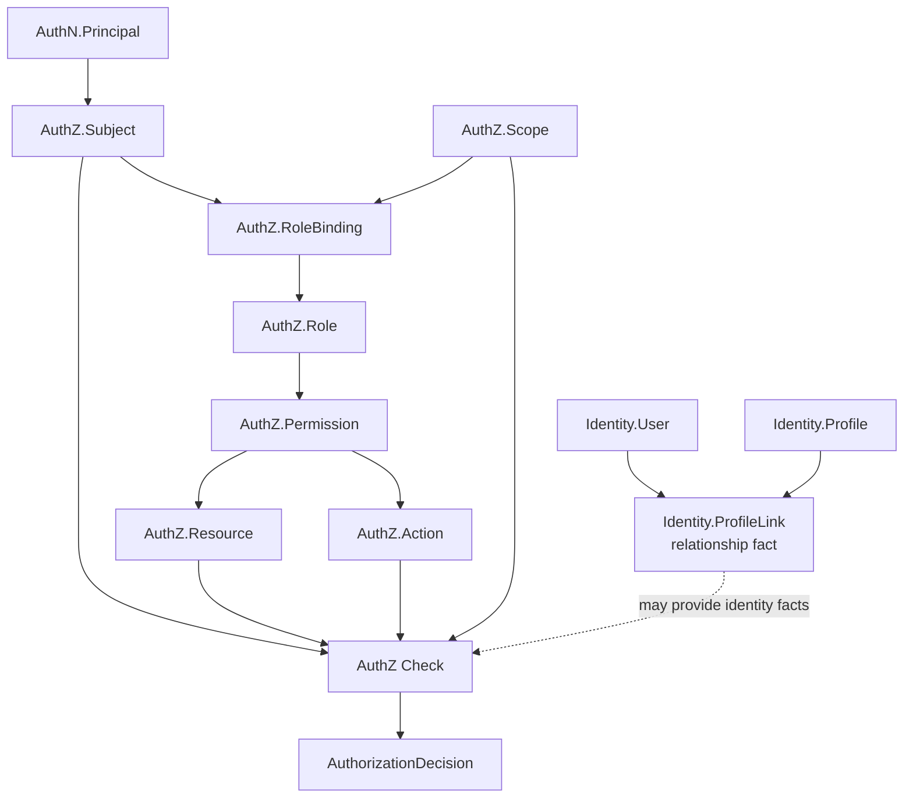

# ProfileLink 为什么不是 Permission

> 状态：设计目标 · 第一版正文，待继续按 `internal/apiserver/domain/identity`、`domain/authz`、Identity ProfileLink 写模型、AuthZ RoleBinding/Permission 写模型、Suggest 可见性过滤、REST/gRPC 契约和测试逐项核对。

---

## 1. 本文回答

本文回答 10 个问题：

- ProfileLink 是什么？
- Permission 是什么？
- 为什么 ProfileLink 不是 Permission？
- 为什么“User 与 Profile 有关系”不等于“Subject 有资源访问权”？
- ProfileLink、RoleBinding、Permission、Subject、Resource、Action、Scope 分别解决什么问题？
- 监护关系、档案关系、授权关系应该如何分开建模？
- ProfileLink 如何参与 AuthZ，但不替代 AuthZ？
- Suggest Profile 搜索为什么不能只看 ProfileLink？
- 把 ProfileLink 当 Permission 会造成哪些问题？
- 修改相关模型后应该执行哪些 Verify？

本文是 Identity 与 AuthZ 边界专题文档，不替代 Identity/AuthZ 模块主文档。
Identity 模型见 [../02-业务模块/01-Identity](../02-业务模块/01-Identity/README.md)；
AuthZ 模型见 [../02-业务模块/03-AuthZ](../02-业务模块/03-AuthZ/README.md)；
Suggest 边界见 [../02-业务模块/05-Suggest/README.md](../02-业务模块/05-Suggest/README.md)。

---

## 2. 30 秒结论

ProfileLink 和 Permission 回答的是两个不同问题。

| 概念 | 所属模块 | 回答的问题 | 一句话 |
| --- | --- | --- | --- |
| `ProfileLink` | Identity | User 和 Profile 是什么关系？ | 身份/档案关系事实 |
| `RoleBinding` | AuthZ | Subject 在某个 Scope 下绑定什么 Role？ | 授权绑定事实 |
| `Permission` | AuthZ | Role/Subject 能对 Resource 执行什么 Action？ | 访问权声明 |
| `AuthZ Check` | AuthZ | 当前请求能不能访问目标资源？ | 授权决策 |

最重要的边界：

```text
ProfileLink 是身份关系事实；
Permission 是访问权声明；
RoleBinding 是授权关系事实；
Subject 是授权主体；
User 不是天然 Subject；
Profile 不是天然 Resource；
有 ProfileLink 不等于拥有所有访问权限；
没有 ProfileLink 也不必然代表没有任何授权；
最终能不能访问资源，要通过 AuthZ Check 判断。
```

如果只记一句话：

> ProfileLink 说明“你和这个档案有什么关系”，Permission 说明“你能对某个资源做什么操作”。

---

## 3. 概念关系图



读图规则：

```text
ProfileLink 留在 Identity；
RoleBinding/Permission 留在 AuthZ；
Principal 需要映射成 Subject；
Resource/Action/Scope 构成授权请求；
ProfileLink 可以作为授权判断的事实输入之一；
ProfileLink 不能直接替代 RoleBinding 或 Permission。
```

---

## 4. ProfileLink 是什么

ProfileLink 是 Identity 模块的身份关系事实。

它通常表达：

```text
某个 User 与某个 Profile/Child/ProfileEntity 之间存在关系；
关系类型是什么，例如 guardian、owner、viewer、staff-related，具体以当前代码为准；
关系状态是什么，例如 active、disabled、revoked，具体以当前代码为准；
关系从什么时候创建；
关系由什么业务流程产生；
关系是否可用于身份事实查询或档案归属判断。
```

ProfileLink 回答：

```text
User 与 Profile 有没有关系？
是什么关系？
这段关系是否仍有效？
这个 Profile 是否属于该用户家庭/档案集合的一部分？
```

ProfileLink 不回答：

```text
Subject 能不能读取某个资源；
Subject 能不能修改某个资源；
Subject 能不能删除某个资源；
Subject 能不能给别人授权；
Subject 能不能访问某个业务系统接口；
Subject 在某个授权域下绑定了什么 Role。
```

边界：

```text
ProfileLink 是身份事实，不是授权策略；
ProfileLink 不应携带完整 Permission 列表；
ProfileLink 不应直接被写成 Casbin g rule；
ProfileLink 不应替代 RoleBinding；
ProfileLink 的存在可以影响 AuthZ 的事实输入，但不能绕过 AuthZ Check。
```

---

## 5. Permission 是什么

Permission 是 AuthZ 模块的访问权声明。

它通常表达：

```text
允许对某类 Resource 执行某个 Action；
适用于哪个 Scope/Domain；
归属于哪个 Role 或策略；
由授权写入链路创建、撤销或版本化；
最终通过 AuthZ Check 生效。
```

Permission 回答：

```text
某个 Role/Subject 可以对什么资源做什么动作？
这个动作是否在当前 Scope 下允许？
授权策略版本是多少？
```

Permission 不回答：

```text
User 与 Profile 是什么亲属/档案关系；
Profile 属于哪个家庭；
Child 的监护人是谁；
外部 openid 对应哪个 User；
登录者是否已认证。
```

边界：

```text
Permission 是授权声明；
Permission 应由 AuthZ 管理；
Permission 不应该反向定义 Identity 关系；
Permission 不应该存储 ProfileLink 的业务关系细节；
Permission 需要通过 RoleBinding/Policy 和 Check 链路生效。
```

---

## 6. ProfileLink 与 Permission 的本质差异

| 维度 | ProfileLink | Permission |
| --- | --- | --- |
| 所属模块 | Identity | AuthZ |
| 对象类型 | 身份/档案关系事实 | 访问权声明 |
| 核心问题 | User 和 Profile 是什么关系 | Subject 能对 Resource 做什么 Action |
| 典型主语 | User | Subject / Role |
| 典型宾语 | Profile / Child / 档案 | Resource |
| 是否表达动作 | 通常不表达 | 必须表达 Action |
| 是否表达授权域 | 不一定 | 通常需要 Scope/Domain |
| 是否用于认证 | 否 | 否 |
| 是否用于授权决策 | 可作为事实输入 | 是授权策略组成部分 |
| 生命周期 | 跟身份关系走 | 跟授权策略走 |
| 变更影响 | 身份关系/档案归属 | 访问控制结果 |
| 版本传播 | 通常不等同 PolicyVersion | 通常影响 PolicyVersion |

---

## 7. 为什么有 ProfileLink 不等于有权限

一个 User 与一个 Profile 有关系，只能说明存在身份或档案关系。

例如：

```text
父亲 User 与儿童 Profile 有 guardian ProfileLink；
医生 Staff 与儿童 Profile 有服务关系；
运营人员与某个 Profile 有处理记录；
机构账号与某批 Profile 有项目关系。
```

这些关系不自动推出：

```text
可以读取所有健康数据；
可以修改儿童档案；
可以删除档案；
可以查看隐私字段；
可以导出数据；
可以授权其他人；
可以访问后台管理接口。
```

原因：

```text
不同资源敏感度不同；
不同 Action 风险不同；
不同业务场景 Scope 不同；
关系存在不代表所有操作都被允许；
授权需要显式策略和决策链路。
```

正确做法：

```text
ProfileLink 作为身份事实；
AuthZ 根据 Subject / Resource / Action / Scope 做 Check；
必要时 Check 读取或引用 ProfileLink 事实；
最终返回 AuthorizationDecision。
```

---

## 8. 为什么没有 ProfileLink 也不一定没有权限

有些权限并不来自 User 与 Profile 的直接关系。

例如：

```text
医生基于就诊服务关系访问问诊资源；
训练师基于机构任务访问训练记录；
运营人员基于后台角色访问脱敏数据；
系统服务基于 service subject 访问内部资源；
管理员基于组织 RoleBinding 管理某个授权域。
```

这些场景可能没有直接 ProfileLink，但仍可能有授权。

因此：

```text
ProfileLink 不能作为唯一授权依据；
AuthZ 需要 Subject / RoleBinding / Permission / Scope；
业务资源访问要统一走 AuthZ Check；
某些 Check 可以同时引用 ProfileLink、项目关系、机构关系等事实。
```

---

## 9. 正确的授权链路

推荐链路：

```text
AuthN Principal
  -> map to AuthZ Subject
  -> build Resource
  -> build Action
  -> build Scope
  -> AuthZ Check
  -> AuthZ may read identity facts such as ProfileLink if policy needs
  -> AuthorizationDecision allow/deny
```

示例：读取儿童档案：

```text
Principal(user_id=U1)
  -> Subject(user:U1)
  -> Resource(profile:P1)
  -> Action(profile.read)
  -> Scope(family/account/project/org)
  -> Check
  -> Check may confirm ProfileLink(U1, P1, guardian)
  -> allow / deny
```

关键点：

```text
ProfileLink 是 Check 的事实之一；
Action 必须明确；
Resource 必须明确；
Scope 必须明确；
最终由 AuthZ 返回决策；
不能因为存在 ProfileLink 就跳过 Check。
```

---

## 10. 与 RoleBinding 的区别

RoleBinding 是 AuthZ 模块的授权绑定事实。

| 概念 | 含义 |
| --- | --- |
| `ProfileLink` | User 与 Profile 的身份/档案关系 |
| `RoleBinding` | Subject 在某个 Scope 下绑定某个 Role |
| `Permission` | Role 拥有哪些 Resource/Action 权限 |

RoleBinding 回答：

```text
这个授权主体在这个授权域下是什么角色？
```

ProfileLink 回答：

```text
这个用户和这个档案是什么关系？
```

禁止：

```text
用 ProfileLink 直接替代 RoleBinding；
把 guardian ProfileLink 直接写成 admin RoleBinding；
把 RoleBinding 当作身份关系；
把 Casbin g rule 当 ProfileLink 存储。
```

---

## 11. 与 Casbin 的边界

Casbin 的 `g(sub, role, dom)` 是 RoleBinding 的运行时表达，不是 ProfileLink。

正确映射：

```text
AuthZ RoleBinding
  -> infra/authz Casbin adapter
  -> g(sub, role, dom)
```

错误映射：

```text
Identity ProfileLink
  -> g(user, profile, relation)
```

风险：

```text
把身份关系变成运行时授权规则；
绕过 Subject/Role/Scope 设计；
难以表达 Action；
难以吊销和版本化；
难以解释为什么某个操作被允许。
```

Casbin 专题见 [04-Casbin在AuthZ中的定位.md](04-Casbin在AuthZ中的定位.md)。

---

## 12. 与 Suggest 可见性过滤的边界

Suggest 需要回答：

```text
当前请求者在允许范围内，能搜索到哪些 Profile 候选项？
```

ProfileLink 可以作为候选可见性的事实之一。

但 Suggest 不能只看 ProfileLink：

```text
有 ProfileLink 不代表可以搜索到所有字段；
手机号搜索需要额外安全策略；
跨机构、项目、运营场景可能不依赖 ProfileLink；
搜索结果必须脱敏；
可见性过滤应由 Suggest application 编排，必要时调用 Identity/AuthZ 端口。
```

正确链路：

```text
keyword
  -> SuggestProfile
  -> candidate match
  -> ProfileAccessScope
  -> Identity facts / AuthZ visibility check
  -> rank / limit
  -> mask
  -> ProfileSuggestItem
```

边界：

```text
ProfileLink 不是 ProfileSuggestItem；
ProfileLink 不是 ProfileAccessScope；
ProfileLink 不替代 AuthZ visibility check；
Suggest 不应直接返回明文手机号或证件号。
```

---

## 13. 与医疗/儿童场景的关系

在儿童互联网医疗场景中，ProfileLink 很容易被误认为权限。

例如：

```text
家长与儿童有监护关系；
医生与儿童有服务关系；
训练中心老师与儿童有训练关系；
运营人员处理过儿童档案；
学校项目包含某批儿童。
```

这些都属于“关系事实”或“业务事实”。

但访问控制还要继续问：

```text
访问什么资源？
执行什么动作？
是否在有效服务期？
是否在当前项目/机构/家庭 Scope？
是否需要脱敏？
是否需要二次确认？
是否允许导出？
是否允许修改？
```

因此：

```text
ProfileLink 可以帮助判断“相关性”；
Permission/Policy 才表达“可操作性”；
AuthZ Check 负责最终决策。
```

---

## 14. 写模型建议

Identity 写模型：

```text
User；
Profile / Child；
ProfileLink；
relationship_type；
relationship_status；
```

AuthZ 写模型：

```text
Subject；
Role；
Permission；
RoleBinding；
Resource；
Action；
Scope；
PolicyVersion；
```

建议：

```text
Identity 只管理身份关系事实；
AuthZ 管理授权策略事实；
AuthZ 可以通过 port 读取 Identity facts；
Identity 不直接写 AuthZ policy，除非通过明确 onboarding/grant use case 编排；
ProfileLink 变化是否触发授权变化，需要明确用例，不要隐式耦合。
```

---

## 15. 事件与版本传播

ProfileLink 变化和 Permission 变化的事件语义不同。

ProfileLink 变化事件：

```text
identity.profile_link.created；
identity.profile_link.revoked；
identity.profile_link.updated；
```

Permission/RoleBinding 变化事件：

```text
authz.permission.granted；
authz.permission.revoked；
authz.role_binding.created；
authz.role_binding.revoked；
authz.policy_version.changed；
```

边界：

```text
ProfileLink 变化不应自动等同 PolicyVersion 变化，除非当前授权策略明确依赖该事实；
Permission/RoleBinding 变化通常应影响 PolicyVersion；
Suggest index 可能需要响应 ProfileLink 变化；
AuthZ runtime 需要响应 PolicyVersion 变化；
事件命名应体现所属模块。
```

---

## 16. 安全规则

必须遵守：

```text
不要把 ProfileLink 当通用放行条件；
不要因为 guardian 关系就允许所有 Action；
不要把 ProfileLink 直接暴露为权限列表；
不要把 openid/unionid 当 Subject；
不要把 UserID 直接当所有授权域的 Subject；
不要用 ProfileLink 直接生成 Casbin g rule；
不要在 Suggest 中因 ProfileLink 命中就返回敏感明文；
高风险 Action 必须有明确 Permission 或策略判断；
导出、删除、授权他人等操作必须单独建模 Action。
```

---

## 17. 常见反模式

| 反模式 | 问题 | 推荐做法 |
| --- | --- | --- |
| ProfileLink 即 Permission | 身份关系和授权策略耦合 | ProfileLink 作为事实，AuthZ Check 决策 |
| guardian 自动拥有所有权限 | 过度授权 | 按 Resource/Action/Scope 建 Permission |
| ProfileLink 直接写 Casbin g rule | 混淆身份关系和角色绑定 | RoleBinding 映射 g rule |
| Suggest 只看 ProfileLink | 可见性过宽或过窄 | ProfileAccessScope + Identity/AuthZ filter |
| UserID 直接当 Subject | 授权主体边界不清 | Principal -> SubjectMapper |
| Profile 直接等同 Resource | 资源语义缺失 | 明确 Resource 类型和实例 |
| 没有 Action 维度 | 无法区分读/写/删/导出 | 显式 Action 建模 |
| 权限写在 Identity 表 | 模块耦合 | AuthZ 管理授权策略 |
| Permission 反向表达亲属关系 | 领域污染 | Identity 管 ProfileLink |
| ProfileLink 变化隐式改变所有授权 | 难以审计 | 明确事件和授权用例 |

---

## 18. 代码事实源

| 事实 | 路径 |
| --- | --- |
| Identity domain | `../../internal/apiserver/domain/identity` |
| Identity application | `../../internal/apiserver/application/identity` |
| AuthZ domain | `../../internal/apiserver/domain/authz` |
| AuthZ application | `../../internal/apiserver/application/authz` |
| Suggest domain | `../../internal/apiserver/domain/suggest` |
| Suggest application | `../../internal/apiserver/application/suggest` |
| REST transport | `../../internal/apiserver/transport/rest` |
| gRPC transport | `../../internal/apiserver/transport/grpc` |
| REST OpenAPI | `../../api/rest` |
| gRPC proto | `../../api/grpc` |
| 架构测试 | `../../internal/pkg/architecture` |
| Identity 文档 | `../02-业务模块/01-Identity/README.md` |
| AuthZ 文档 | `../02-业务模块/03-AuthZ/README.md` |
| Suggest 文档 | `../02-业务模块/05-Suggest/README.md` |

注意：上表路径需要继续与当前源码核对。如果目录已调整，应以代码为准并同步更新本文。

---

## 19. Verify

修改 ProfileLink / Permission / RoleBinding 相关代码后至少执行：

```bash
go test ./internal/apiserver/domain/identity/...
go test ./internal/apiserver/application/identity/...
go test ./internal/apiserver/domain/authz/...
go test ./internal/apiserver/application/authz/...
```

涉及 Suggest 可见性：

```bash
go test ./internal/apiserver/domain/suggest/...
go test ./internal/apiserver/application/suggest/...
```

涉及 REST / gRPC：

```bash
make api-validate
make proto-gen
go test ./internal/apiserver/transport/rest/...
go test ./internal/apiserver/transport/grpc/...
```

涉及架构边界：

```bash
go test ./internal/pkg/architecture
```

修改本文后至少执行：

```bash
make docs-hygiene
```

建议补充的测试：

```text
ProfileLink 创建不自动生成 Permission，除非明确 use case；
ProfileLink 存在但无对应 Permission 时，高风险 Action 被拒绝；
RoleBinding 可独立于 ProfileLink 建模；
Permission 必须包含 Resource/Action/Scope 语义；
Suggest 不因 ProfileLink 命中返回敏感明文；
Principal 经过 SubjectMapper 后再进入 AuthZ Check；
ProfileLink 变化事件与 authz.policy_version.changed 事件区分清楚。
```

---

## 20. 本文总结

ProfileLink 与 Permission 的关系可以压缩成：

```text
ProfileLink：User 与 Profile 的身份/档案关系事实；
Permission：Subject 对 Resource 执行 Action 的访问权声明；
RoleBinding：Subject 在 Scope 下绑定 Role 的授权事实；
AuthZ Check：结合 Subject / Resource / Action / Scope 和相关事实做最终决策。
```

最重要的工程规则是：

```text
ProfileLink 不是 Permission；
ProfileLink 不是 RoleBinding；
ProfileLink 可以作为授权事实输入，但不能替代 AuthZ Check；
有关系不等于有所有权限；
没直接关系也不等于没有授权；
权限必须显式表达 Resource / Action / Scope；
Identity 管身份关系，AuthZ 管授权策略，Suggest 管可见范围内的脱敏搜索。
```
