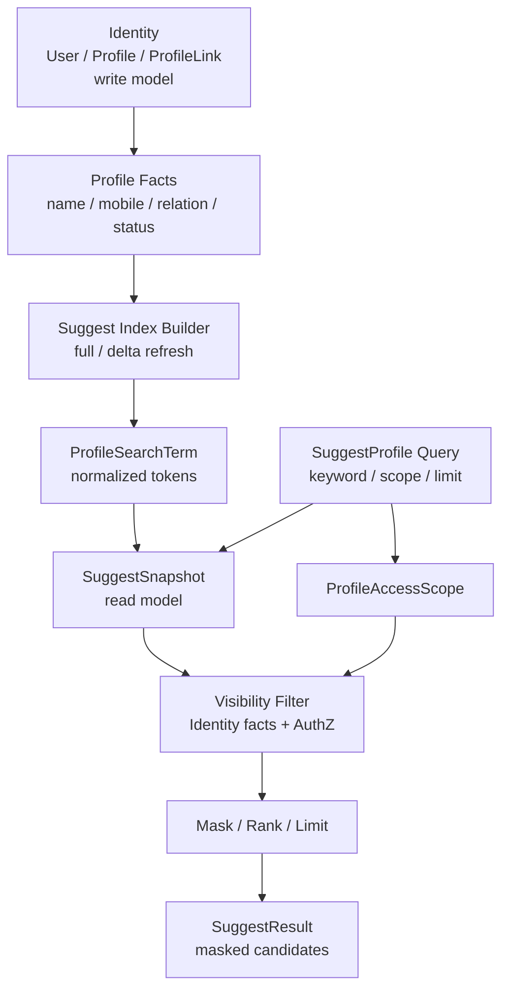

# Suggest 为什么是读模型

> 状态：待补证据 · 第一版正文，待继续按 `internal/apiserver/domain/suggest`、`application/suggest`、Identity Profile 事实源、Suggest Snapshot、索引刷新、可见性过滤、REST/gRPC 契约和测试逐项核对。

---

## 1. 本文回答

本文回答 10 个问题：

- Suggest 是什么？
- 为什么 Suggest 是读模型，而不是 Identity 写模型？
- 为什么 Profile autocomplete 不应该直接查 Identity 主表？
- SuggestSnapshot、ProfileSearchTerm、ProfileAccessScope、SuggestResult 分别解决什么问题？
- Suggest 如何使用 Identity/Profile 事实，但不拥有 Profile？
- Suggest 如何使用 AuthZ/Identity 可见性事实，但不替代 AuthZ？
- 为什么 Suggest 可以最终一致、可降级？
- 手机号搜索、脱敏、限流为什么属于 Suggest 的读侧安全能力？
- 把 Suggest 当核心身份域会造成什么问题？
- 修改 Suggest 相关实现后应该执行哪些 Verify？

本文是 Suggest 读模型专题文档，不替代 Suggest 模块主文档。
Suggest 模块总览见 [../02-业务模块/05-Suggest/README.md](../02-业务模块/05-Suggest/README.md)；
Suggest 领域模型见 [../02-业务模块/05-Suggest/01-领域模型-ProfileSearchTerm-ProfileAccessScope-Snapshot.md](../02-业务模块/05-Suggest/01-领域模型-ProfileSearchTerm-ProfileAccessScope-Snapshot.md)；
索引刷新链路见 [../02-业务模块/05-Suggest/02-关键链路-索引刷新Full-Delta-Snapshot.md](../02-业务模块/05-Suggest/02-关键链路-索引刷新Full-Delta-Snapshot.md)；
查询链路见 [../02-业务模块/05-Suggest/03-关键链路-SuggestProfile查询.md](../02-业务模块/05-Suggest/03-关键链路-SuggestProfile查询.md)。

---

## 2. 30 秒结论

Suggest 是 IAM 为 Profile autocomplete 构建的辅助读模型。

它负责：

```text
把 Identity Profile 主数据派生成可搜索索引；
把 keyword 归一化成查询条件；
从 Snapshot 中匹配候选 Profile；
结合 ProfileAccessScope / Identity facts / AuthZ visibility 做可见性过滤；
排序、截断、脱敏后返回 SuggestResult。
```

它不负责：

```text
创建 User / Profile / ProfileLink；
维护 Profile 主数据；
表达监护关系、档案关系、授权关系；
替代 AuthZ Check；
返回明文手机号、证件号等敏感字段；
作为身份事实源。
```

最重要的边界：

```text
Identity 拥有 Profile 写模型；
Suggest 拥有 Profile 搜索读模型；
SuggestSnapshot 是派生快照，不是 Profile 主数据；
ProfileSearchTerm 是搜索 token，不是 Profile 字段本身；
ProfileAccessScope 是查询可见范围输入，不是 ProfileLink，也不是 AuthZ Scope 本体；
SuggestResult 是脱敏候选结果，不是 Profile entity；
索引命中不等于可见；
可见不等于有任意资源权限。
```

如果只记一句话：

> Suggest 不是“身份事实”，而是“为了更快、更安全地找候选 Profile”而派生出来的读侧索引和查询能力。

---

## 3. Suggest 读模型总图



读图规则：

```text
Identity 是 Profile 主数据事实源；
Suggest 从 Identity 派生搜索索引；
Snapshot 是运行时读模型；
查询时先匹配候选，再做可见性过滤；
最终返回脱敏 SuggestResult；
任何时候 Suggest 都不反向成为 Profile 主数据源。
```

---

## 4. 什么是读模型

读模型是为了满足查询场景而派生出的数据结构。

它通常具备：

```text
面向查询优化；
由写模型或事实源派生；
可重建；
可最终一致；
可降级；
可以有索引、缓存、快照；
不承载核心写入不变量。
```

Suggest 符合这些特征：

```text
它面向 Profile autocomplete 查询；
它由 Identity Profile facts 派生；
它可以 full refresh 重建；
它可以 delta refresh 增量更新；
它可以使用 Snapshot 原子切换；
它可以在索引不可用时降级；
它不负责创建或修改 Profile。
```

---

## 5. 为什么不放进 Identity 核心身份域

Identity 核心问题是：

```text
User 是谁？
Profile/Child 是什么？
User 和 Profile/Child 是什么关系？
ProfileLink 是否存在、有效、属于什么关系类型？
```

Suggest 核心问题是：

```text
当前请求者在允许范围内，根据 keyword 能看到哪些可选择的 Profile 候选项？
```

两者差异：

| 维度 | Identity | Suggest |
| --- | --- | --- |
| 模型类型 | 写模型 / 事实源 | 派生读模型 |
| 核心对象 | User / Profile / ProfileLink | ProfileSearchTerm / ProfileAccessScope / SuggestSnapshot / SuggestResult |
| 核心职责 | 维护身份事实和关系不变量 | 快速、安全、脱敏地搜索候选 |
| 一致性要求 | 强一致或事务一致，具体以实现为准 | 可最终一致 |
| 可降级性 | 核心能力，不应轻易降级 | 可降级，不应阻断核心身份认证授权 |
| 数据形态 | 主数据 | 索引 / 快照 / 缓存 |
| 失败影响 | 影响身份事实 | 影响联想体验，不应破坏主数据 |

因此：

```text
把 Suggest 放进 Identity 核心域，会让身份域承担搜索索引、排序、限流、脱敏、快照刷新等读侧复杂度；
这会污染 Identity 的模型边界；
也会让联想搜索故障影响核心身份能力。
```

---

## 6. Suggest 不拥有 Profile 写模型

Suggest 可以读取或派生 Profile facts，但不拥有 Profile 写模型。

Suggest 不应该做：

```text
创建 Profile；
修改 Profile 姓名、生日、手机号；
创建 ProfileLink；
撤销 ProfileLink；
决定 User 与 Profile 的身份关系；
维护 Child/Guardian 业务不变量；
把索引内容反写回 Profile 主表。
```

Suggest 可以做：

```text
读取 Profile facts；
构建搜索 token；
构建 SuggestSnapshot；
保存或缓存索引；
根据 keyword 匹配候选；
过滤不可见候选；
返回脱敏 SuggestResult。
```

核心规则：

```text
Identity -> Suggest 是事实派生方向；
Suggest -> Identity 不应反向写主数据；
SuggestSnapshot 可丢弃重建；
Profile 主数据不可从 SuggestSnapshot 反推恢复。
```

---

## 7. SuggestSnapshot 是什么

SuggestSnapshot 是某一时刻的搜索读模型快照。

它解决：

```text
查询链路读取稳定索引；
刷新链路构建新索引；
构建完成后原子切换；
避免查询读到半构建状态；
支持 full refresh / delta refresh；
支持版本观测和回滚，若实现支持。
```

它不是：

```text
Profile 主数据；
Identity 事实源；
权限事实源；
永久审计记录；
业务写模型。
```

边界：

```text
Snapshot 可以落后于 Identity；
Snapshot 可以重建；
Snapshot 命中不等于用户可见；
Snapshot 中敏感字段应最小化、hash 化或脱敏；
Snapshot 不应直接返回给业务系统。
```

---

## 8. ProfileSearchTerm 是什么

ProfileSearchTerm 是为了搜索而派生出的 token。

可能来源于：

```text
姓名；
拼音；
手机号后缀或 hash token；
档案编号；
项目编号；
机构相关字段；
其他可搜索字段，具体以实现为准。
```

它解决：

```text
keyword 归一化；
模糊匹配；
前缀匹配；
手机号安全搜索；
排序和召回。
```

它不是：

```text
Profile 字段本身；
敏感字段明文仓库；
权限声明；
可见性结果；
用户可直接看到的响应字段。
```

安全边界：

```text
手机号等敏感字段不应以明文搜索词裸存；
搜索 token 应最小化；
命中 token 后还要做可见性过滤；
响应结果仍要脱敏。
```

---

## 9. ProfileAccessScope 是什么

ProfileAccessScope 是一次 Suggest 查询的可见范围输入。

它表达：

```text
本次搜索允许在哪个范围内找候选；
例如当前用户关联档案、当前机构、当前项目、当前服务范围，具体以实现为准；
它是查询约束，不是身份关系本体。
```

它不是：

```text
ProfileLink；
AuthZ Scope 本体；
RoleBinding；
Permission；
最终授权决策。
```

正确理解：

```text
ProfileAccessScope 是 Suggest 查询层的范围参数；
它可能由 Identity facts、AuthZ facts、业务上下文共同计算；
它不能绕过 AuthZ；
它不能替代 ProfileLink；
它不能单独证明某个候选可见。
```

---

## 10. SuggestResult 是什么

SuggestResult 是联想搜索返回给调用方的候选结果。

它应该包含：

```text
profile_id；
display_name；
masked fields，例如 mobile_mask；
relation/scope hints，若安全允许；
score/rank，若需要；
必要的业务展示字段。
```

它不应该包含：

```text
明文手机号；
明文证件号；
完整地址；
password / token / secret；
完整 Profile entity；
完整 ProfileLink；
完整授权策略；
搜索索引内部 token。
```

边界：

```text
SuggestResult 是展示候选；
不是 Profile 详情；
不是权限凭证；
不是下一步业务操作的授权证明；
用户选择候选后，后续业务操作仍要重新按 Resource/Action/Scope 做 AuthZ Check。
```

---

## 11. 查询链路为什么要先过滤再截断

错误做法：

```text
从全量索引匹配 TopN
  -> limit
  -> 再做可见性过滤
```

问题：

```text
如果 TopN 大多不可见，最终返回很少甚至为空；
可能泄露不可见候选的排序侧信号；
不同用户结果不稳定；
可见候选被不可见候选挤掉。
```

推荐做法：

```text
match candidates
  -> visibility filter
  -> rank visible candidates
  -> limit
  -> mask
  -> return
```

原因：

```text
可见性是安全边界；
排序是体验优化；
安全边界应先于体验优化；
limit 应作用于可见候选。
```

---

## 12. Suggest 与 AuthZ 的边界

Suggest 可以调用 AuthZ 或使用 AuthZ 派生事实做可见性过滤。

但 Suggest 不替代 AuthZ。

Suggest 回答：

```text
当前请求者能搜索到哪些候选 Profile？
```

AuthZ 回答：

```text
当前 Subject 能不能对某个 Resource 执行某个 Action？
```

边界：

```text
能搜索到候选，不代表能读取详情；
能搜索到候选，不代表能修改、删除、导出；
SuggestResult 不能作为授权凭证；
后续业务操作必须重新 AuthZ Check；
Suggest visibility filter 不能绕过 AuthZ/Identity facts。
```

示例：

```text
Suggest 返回 profile:P1 候选；
用户点击 P1 进入详情；
详情接口仍要执行 Resource(profile:P1) + Action(profile.read) + Scope 的 AuthZ Check。
```

---

## 13. Suggest 与 ProfileLink 的边界

ProfileLink 可以作为 Suggest 可见性的事实之一。

但 ProfileLink 不是 Suggest 的全部依据。

原因：

```text
有 ProfileLink 不代表可以通过所有 keyword 搜到；
没有 ProfileLink 也可能因为项目/机构/服务关系具备搜索可见性；
手机号搜索需要更严格权限和限流；
不同调用场景可见范围不同；
ProfileLink 不表达搜索脱敏策略。
```

边界：

```text
ProfileLink 是 Identity 关系事实；
ProfileAccessScope 是 Suggest 查询范围；
VisibilityFilter 是查询时安全过滤；
SuggestResult 是脱敏候选；
四者不能混用。
```

ProfileLink 专题见 [05-ProfileLink为什么不是Permission.md](05-ProfileLink为什么不是Permission.md)。

---

## 14. 手机号搜索为什么属于读侧安全能力

手机号搜索是高风险查询能力。

它属于 Suggest 的读侧安全能力，因为它涉及：

```text
keyword 形态检测；
手机号归一化；
手机号 hash/suffix token；
额外权限或开关；
更严格限流；
更严格审计；
命中后可见性过滤；
响应脱敏，只返回 mobile_mask。
```

它不应该放进 Identity 写模型：

```text
Identity 负责保存和维护手机号事实；
Suggest 负责如何安全地搜索手机号；
搜索策略、限流、脱敏、排序属于读侧能力；
手机号搜索可以禁用或降级，不应影响 Profile 主数据。
```

核心规则：

```text
手机号搜索只能扩大“匹配方式”；
不能扩大“可见范围”；
不能返回明文手机号；
不能绕过 AuthZ/Identity 可见性过滤。
```

---

## 15. 为什么 Suggest 可以最终一致

Suggest 是读模型，因此可以接受短暂延迟。

例如：

```text
Profile 刚创建，Suggest 暂时搜不到；
Profile 姓名刚修改，Suggest 暂时显示旧 display name；
ProfileLink 刚变化，Suggest 可见性短暂未刷新；
手机号刚更新，手机号搜索索引短暂滞后。
```

但必须满足：

```text
不能因为索引滞后返回越权数据；
查询时仍要做可见性过滤；
敏感字段仍要脱敏；
刷新延迟要可观测；
必要时可触发强制刷新或回源校验，具体以实现为准。
```

边界：

```text
最终一致可以接受体验延迟；
最终一致不能接受安全越权；
读模型滞后不能成为绕过 AuthZ 的理由。
```

---

## 16. 为什么 Suggest 可以降级

Suggest 是辅助查询体验。

降级场景：

```text
索引构建失败；
Snapshot 加载失败；
搜索服务超时；
手机号搜索被限流；
可见性过滤依赖不可用；
索引版本过旧。
```

可接受降级：

```text
返回空候选；
只支持精确 ID 查询；
禁用手机号搜索；
降低 limit；
提示稍后重试；
回源慢查，若安全和性能允许。
```

不可接受降级：

```text
跳过可见性过滤；
返回未脱敏字段；
扩大搜索范围；
忽略手机号限流；
把索引内部 token 返回给调用方。
```

---

## 17. 索引刷新模型

Suggest 索引刷新可以有多种方式。

常见方式：

```text
Full refresh：从 Identity facts 全量重建；
Delta refresh：根据 Profile/ProfileLink 变化增量更新；
Snapshot swap：构建完成后原子替换；
Version tracking：记录当前索引版本；
Metrics：记录刷新耗时、失败、滞后。
```

推荐链路：

```text
load Identity facts
  -> extract searchable fields
  -> normalize terms
  -> build ProfileSearchTerm
  -> build SuggestSnapshot
  -> validate snapshot
  -> atomic swap
  -> expose version/metrics
```

边界：

```text
刷新失败不能污染当前可用 Snapshot；
查询链路不能读半构建索引；
刷新链路不应修改 Identity 主数据；
Snapshot 版本和滞后时间应可观测。
```

---

## 18. 把 Suggest 当核心身份域的风险

风险包括：

```text
Identity 模型被搜索 token、索引、排序污染；
Profile 写事务被索引刷新拖慢；
搜索限流和脱敏规则散落到身份写模型；
联想查询故障影响注册、登录、身份关系维护；
主数据和索引数据边界不清；
权限过滤容易被简化成“有关系就可见”；
难以重建索引；
难以做降级。
```

正确边界：

```text
Identity 保持主数据和关系不变量；
Suggest 作为可重建读模型；
AuthZ 保持授权决策；
Suggest 查询时组合 Identity facts 和 AuthZ visibility；
结果只返回脱敏候选。
```

---

## 19. 安全规则

必须遵守：

```text
Suggest 不返回明文手机号；
Suggest 不返回证件号；
Suggest 不返回完整 Profile entity；
Suggest 不返回内部 search token；
手机号搜索必须额外限流和审计；
索引命中不等于可见；
可见候选不等于有详情读取权限；
后续业务操作必须重新 AuthZ Check；
索引中敏感字段应最小化、脱敏或 hash 化；
降级不能跳过安全过滤。
```

---

## 20. 常见反模式

| 反模式 | 问题 | 推荐做法 |
| --- | --- | --- |
| Suggest 写 Profile 主数据 | 读写模型混淆 | Profile 写入归 Identity |
| 直接查 Identity 主表做模糊搜索 | 性能和安全策略难控 | 派生 SuggestSnapshot |
| Snapshot 命中直接返回 | 可能越权 | 先可见性过滤再返回 |
| 先 limit 再过滤 | 可见候选被挤掉 | filter -> rank -> limit |
| 返回明文手机号 | 隐私泄露 | 只返回 mobile_mask |
| ProfileLink 命中即返回 | 可见性过宽 | ProfileAccessScope + VisibilityFilter |
| SuggestResult 当授权凭证 | 后续接口越权 | 后续操作重新 AuthZ Check |
| 索引刷新失败覆盖旧索引 | 查询不可用或数据错乱 | 构建成功后原子切换 |
| 索引滞后无监控 | 问题不可见 | 监控 version/lag/failure |
| 降级时跳过权限过滤 | 安全事故 | 降级只能更保守 |

---

## 21. 代码事实源

| 事实 | 路径 |
| --- | --- |
| Suggest domain | `../../internal/apiserver/domain/suggest` |
| Suggest application | `../../internal/apiserver/application/suggest` |
| Suggest infra / index | `../../internal/apiserver/infra`，具体以当前代码为准 |
| Identity domain | `../../internal/apiserver/domain/identity` |
| Identity application | `../../internal/apiserver/application/identity` |
| AuthZ domain | `../../internal/apiserver/domain/authz` |
| AuthZ application | `../../internal/apiserver/application/authz` |
| REST transport | `../../internal/apiserver/transport/rest` |
| gRPC transport | `../../internal/apiserver/transport/grpc` |
| REST OpenAPI | `../../api/rest/suggest.v2.yaml`，若已存在 |
| gRPC proto | `../../api/grpc/iam/suggest/v2/suggest.proto`，若已存在 |
| 架构测试 | `../../internal/pkg/architecture` |
| Suggest 文档 | `../02-业务模块/05-Suggest/README.md` |

注意：上表路径需要继续与当前源码核对。如果目录已调整，应以代码为准并同步更新本文。

---

## 22. Verify

修改 Suggest 相关代码后至少执行：

```bash
go test ./internal/apiserver/domain/suggest/...
go test ./internal/apiserver/application/suggest/...
```

涉及 Identity / AuthZ 协作：

```bash
go test ./internal/apiserver/domain/identity/...
go test ./internal/apiserver/application/identity/...
go test ./internal/apiserver/domain/authz/...
go test ./internal/apiserver/application/authz/...
```

涉及 REST / gRPC：

```bash
make api-validate
make proto-gen
go test ./internal/apiserver/transport/rest/...
go test ./internal/apiserver/transport/grpc/...
```

涉及架构边界：

```bash
go test ./internal/pkg/architecture
```

修改本文后至少执行：

```bash
make docs-hygiene
```

建议补充的测试：

```text
Suggest 不创建 Profile；
SuggestSnapshot 可由 Identity facts 重建；
刷新失败不污染当前 Snapshot；
Snapshot 命中后仍做可见性过滤；
先过滤再排序截断；
手机号搜索只返回 mobile_mask；
手机号搜索触发限流和审计；
SuggestResult 不能作为详情读取授权；
降级时不跳过可见性过滤；
索引滞后指标可观测。
```

---

## 23. 本文总结

Suggest 作为读模型可以压缩成：

```text
Identity 拥有 Profile 写模型；
Suggest 从 Identity facts 派生 ProfileSearchTerm；
SuggestSnapshot 是可重建、可最终一致、可降级的搜索读模型；
Suggest 查询先匹配候选，再做可见性过滤、排序、截断和脱敏；
SuggestResult 是候选展示，不是 Profile entity，也不是授权凭证。
```

最重要的工程规则是：

```text
Suggest 不拥有 Profile；
Suggest 不替代 Identity；
Suggest 不替代 AuthZ；
索引命中不等于可见；
可见候选不等于有详情权限；
手机号搜索属于读侧安全能力；
读模型可以最终一致和降级，但不能牺牲安全边界。
```
