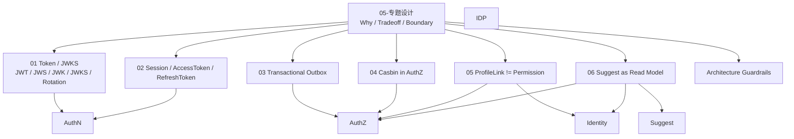

# 05-专题设计

> 状态：待补证据 · 专题设计总入口，已按 Token/JWKS、Session/双 Token、Transactional Outbox、Casbin、ProfileLink/Permission、Suggest 读模型六篇专题重写；后续专题设计、边界取舍、替代方案和讲解口径统一维护在本目录。

---

## 1. 本目录定位

`05-专题设计/` 讲 IAM 中几个容易混淆、容易被问深、也最能体现架构判断的专题。

业务模块目录回答：

```text
当前模块是什么？
有哪些核心对象？
关键链路如何走？
模块边界在哪里？
代码事实源在哪里？
```

专题设计目录回答：

```text
为什么这样设计？
为什么不那样设计？
哪些概念不能混用？
替代方案是什么？
工程取舍是什么？
面试或评审时应该如何讲清楚？
```

本目录不是 REST/gRPC/SDK 机器契约事实源，也不是具体业务模块的唯一事实源。

业务模块见 [../02-业务模块](../02-业务模块/README.md)。

接入契约见 [../03-接入与契约](../03-接入与契约/README.md)。

架构护栏见 [../04-架构护栏](../04-架构护栏/README.md)。

---

## 2. 30 秒结论

本目录目前覆盖 6 个专题：

| 专题 | 核心问题 | 一句话结论 |
| --- | --- | --- |
| JWT / JWS / JWK / JWKS / KeyRotation | Token 如何可信表达，业务系统如何本地验签，密钥如何轮换 | JWT/JWS 解决 Token 可信，JWKS 解决验签公钥发布，AuthZ 仍负责授权 |
| Session / AccessToken / RefreshToken | 会话状态、访问凭证、续期凭证如何分工 | Session 管登录会话，AccessToken 管 API 访问，RefreshToken 管续期 |
| Transactional Outbox | 业务事实写入和事件发布如何保持一致 | 本地事务写事实和 Outbox，Relay 异步发布，消费者幂等 |
| Casbin 在 AuthZ 中的定位 | Casbin 是领域模型还是运行时引擎 | Casbin 是 infra runtime，不是 AuthZ 领域模型 |
| ProfileLink 为什么不是 Permission | 身份关系和授权权限如何区分 | ProfileLink 说明关系，Permission 说明能做什么操作 |
| Suggest 为什么是读模型 | Profile autocomplete 为什么是派生读模型 | Suggest 是可重建、可最终一致、可降级的搜索读模型，不拥有 Profile 主数据 |

最重要的共同边界：

```text
验签不等于授权；
RefreshToken 不进普通 API；
Outbox 不等于 MQ，也不承诺 exactly-once；
Casbin 不进入 domain；
ProfileLink 不等于 Permission；
ProfileSuggestionIndex 不等于 Profile 主数据；
读模型可以最终一致，但不能牺牲安全边界。
```

如果只记一句话：

> 本目录专门解释 IAM 中“最容易混用的概念”，目标是把设计取舍讲清楚、把反模式挡在实现之前。

---

## 3. 文档结构

| 文档 | 主题 | 阅读重点 |
| --- | --- | --- |
| [01-JWT-JWS-JWK-JWKS-KeyRotation.md](01-JWT-JWS-JWK-JWKS-KeyRotation.md) | Token 安全表达和密钥轮换 | JWT/JWS/JWK/JWKS 概念、`kid`、本地验签、Key Rotation、验签与授权边界 |
| [02-Session-AccessToken-RefreshToken边界.md](02-Session-AccessToken-RefreshToken边界.md) | Session 与双 Token 边界 | Session、AccessToken、RefreshToken 的职责、生命周期、刷新、吊销、重放检测 |
| [03-Transactional-Outbox设计.md](03-Transactional-Outbox设计.md) | 授权版本传播中的 Outbox | 双写一致性、PolicyVersion、Relay、at-least-once、消费者幂等、积压治理 |
| [04-Casbin在AuthZ中的定位.md](04-Casbin在AuthZ中的定位.md) | Casbin 作为 AuthZ infra runtime | Casbin 与 AuthZ 领域模型边界、p/g/r 映射、PolicyVersion、RuntimeReload |
| [05-ProfileLink为什么不是Permission.md](05-ProfileLink为什么不是Permission.md) | 身份关系和权限事实边界 | ProfileLink、RoleBinding、Permission、Subject、Resource、Action、Scope 的区别 |
| [06-Suggest为什么是读模型.md](06-Suggest为什么是读模型.md) | Suggest 辅助读模型定位 | ProfileSuggestionIndex、ProfileSearchTerm、ProfileAccessScope、ProfileSuggestItem、最终一致和降级 |

---

## 4. 专题设计总图



读图规则：

```text
Token/JWKS 和 Session/双 Token 主要服务 AuthN；
Transactional Outbox 和 Casbin 主要服务 AuthZ；
ProfileLink/Permission 连接 Identity 与 AuthZ；
Suggest 读模型连接 Suggest、Identity 与 AuthZ；
所有专题都需要架构护栏约束分层和契约漂移。
```

---

## 5. 六个专题的核心讲法

### 5.1 Token / JWKS

核心讲法：

```text
JWT 是 claims 表达；
JWS 是签名保护；
JWK 是 JSON 密钥对象；
JWKS 是公开验签公钥集合；
Key Rotation 是 active / grace / retired 生命周期治理。
```

工程取舍：

```text
AccessToken 可以被业务系统通过 JWKS 本地验签，降低 AuthN 运行时依赖；
本地验签提升性能和可用性，但无法天然感知刚刚发生的会话吊销；
需要即时吊销时要引入黑名单、introspection 或高风险接口 session check；
验签成功只代表认证通过，不能替代 AuthZ Check。
```

常见反模式：

```text
只验 exp 不验签；
只验签不验 aud/iss；
JWKS 暴露私钥；
RefreshToken 当普通 Bearer Token；
JWT claims 承载复杂权限。
```

详细说明见 [01-JWT-JWS-JWK-JWKS-KeyRotation.md](01-JWT-JWS-JWK-JWKS-KeyRotation.md)。

---

### 5.2 Session / AccessToken / RefreshToken

核心讲法：

```text
Session 是服务端认证会话状态；
AccessToken 是短期 API 访问凭证；
RefreshToken 是续期凭证。
```

工程取舍：

```text
AccessToken 短 TTL 降低泄露风险；
RefreshToken 长 TTL 提升体验，但必须服务端可吊销；
Session 管理登录会话和设备状态；
登出一定要阻止继续刷新；
已签发 AccessToken 是否立即失效，取决于黑名单、introspection 或短 TTL 策略。
```

常见反模式：

```text
把三者都叫登录 token；
RefreshToken 调普通业务 API；
登出只删前端 token；
本地验签后直接授权；
RefreshToken 不可吊销或不防重放。
```

详细说明见 [02-Session-AccessToken-RefreshToken边界.md](02-Session-AccessToken-RefreshToken边界.md)。

---

### 5.3 Transactional Outbox

核心讲法：

```text
Outbox 解决业务事实写入和事件发布之间的双写一致性；
业务事务内写事实和 outbox_event；
Relay 事务外异步发布；
消费者基于 event_id/version 幂等。
```

工程取舍：

```text
Outbox 选择本地事务强一致 + 跨系统最终一致；
避免引入复杂 2PC；
发布语义通常是 at-least-once；
消费者必须幂等；
Outbox 积压必须可观测。
```

常见反模式：

```text
业务提交后再单独写 Outbox；
事务内直接发布 MQ；
把 Outbox 当 MQ；
宣称 exactly-once；
消费者不幂等；
payload 放敏感信息。
```

详细说明见 [03-Transactional-Outbox设计.md](03-Transactional-Outbox设计.md)。

---

### 5.4 Casbin 在 AuthZ 中的定位

核心讲法：

```text
Casbin 是 AuthZ 的 infra runtime engine；
AuthZ domain 使用 Subject / Role / Permission / RoleBinding / Resource / Action / Scope；
Casbin p/g/r 是运行时表达，不是领域语言。
```

工程取舍：

```text
领域模型保持业务语义清晰；
Casbin adapter 负责把领域授权事实映射为 runtime policy；
PolicyVersion / Outbox / RuntimeReload 负责策略刷新；
domain 和 transport 都不直接依赖 Casbin。
```

常见反模式：

```text
把 Casbin 当 AuthZ 领域模型；
domain import Casbin；
transport 直接调用 enforcer；
业务系统复制 p/g rules；
ProfileLink 直接写成 g rule。
```

详细说明见 [04-Casbin在AuthZ中的定位.md](04-Casbin在AuthZ中的定位.md)。

---

### 5.5 ProfileLink 为什么不是 Permission

核心讲法：

```text
ProfileLink 是 User 与 Profile 的身份/档案关系事实；
Permission 是 Subject 对 Resource 执行 Action 的访问权声明；
RoleBinding 是 Subject 在 Scope 下绑定 Role 的授权事实；
AuthZ Check 才是最终授权决策。
```

工程取舍：

```text
Identity 管身份关系；
AuthZ 管授权策略；
ProfileLink 可以作为授权判断的事实输入；
但 ProfileLink 不能直接替代 Permission / RoleBinding / AuthZ Check。
```

常见反模式：

```text
ProfileLink 即 Permission；
guardian 自动拥有所有权限；
ProfileLink 直接写 Casbin g rule；
UserID 直接当 Subject；
没有 Resource/Action/Scope 维度。
```

详细说明见 [05-ProfileLink为什么不是Permission.md](05-ProfileLink为什么不是Permission.md)。

---

### 5.6 Suggest 为什么是读模型

核心讲法：

```text
Identity 拥有 Profile 写模型；
Suggest 从 Identity facts 派生 ProfileSearchTerm；
ProfileSuggestionIndex 是可重建、可最终一致、可降级的搜索读模型；
ProfileSuggestItem 是脱敏候选展示，不是 Profile entity，也不是授权凭证。
```

工程取舍：

```text
把搜索索引、排序、限流、手机号搜索、脱敏放在读侧；
避免污染 Identity 核心写模型；
允许读模型最终一致和降级；
但不能牺牲可见性过滤和隐私边界。
```

常见反模式：

```text
Suggest 写 Profile 主数据；
Snapshot 命中直接返回；
先 limit 再过滤；
返回明文手机号；
ProfileSuggestItem 当授权凭证；
降级时跳过权限过滤。
```

详细说明见 [06-Suggest为什么是读模型.md](06-Suggest为什么是读模型.md)。

---

## 6. 关键边界总表

| 易混概念 | 正确边界 |
| --- | --- |
| JWT vs JWS | JWT 是 claims 表达，JWS 是签名保护结构 |
| JWK vs JWKS | JWK 是单把密钥对象，JWKS 是公开公钥集合 |
| AccessToken vs RefreshToken | AccessToken 访问 API，RefreshToken 只用于续期 |
| Session vs AccessToken | Session 是服务端状态，AccessToken 是客户端访问凭证 |
| 验签 vs 授权 | 验签确认 Token 可信，授权确认资源操作是否允许 |
| Outbox vs MQ | Outbox 记录待发布事件，MQ 负责投递 |
| Outbox vs exactly-once | Outbox 通常是 at-least-once，消费者必须幂等 |
| Casbin vs AuthZ domain | Casbin 是 runtime engine，AuthZ domain 是业务授权模型 |
| ProfileLink vs Permission | ProfileLink 是身份关系，Permission 是访问权声明 |
| RoleBinding vs ProfileLink | RoleBinding 是授权绑定，ProfileLink 是身份/档案关系 |
| ProfileSuggestionIndex vs Profile | ProfileSuggestionIndex 是派生读模型，Profile 是 Identity 主数据 |
| ProfileSuggestItem vs AuthorizationDecision | ProfileSuggestItem 是候选展示，AuthorizationDecision 是授权决策 |

---

## 7. 推荐阅读路径

### 7.1 准备讲 AuthN Token 设计

```text
01-JWT-JWS-JWK-JWKS-KeyRotation.md
  -> 02-Session-AccessToken-RefreshToken边界.md
  -> ../02-业务模块/02-AuthN/README.md
```

目标：讲清 Token 可信、会话续期、密钥轮换和验签授权边界。

---

### 7.2 准备讲 AuthZ 设计

```text
04-Casbin在AuthZ中的定位.md
  -> 03-Transactional-Outbox设计.md
  -> 05-ProfileLink为什么不是Permission.md
  -> ../02-业务模块/03-AuthZ/README.md
```

目标：讲清领域模型、runtime engine、策略版本传播和身份关系/授权关系边界。

---

### 7.3 准备讲 Identity 与授权边界

```text
05-ProfileLink为什么不是Permission.md
  -> ../02-业务模块/01-Identity/README.md
  -> ../02-业务模块/03-AuthZ/README.md
```

目标：讲清 User/Profile/ProfileLink 和 Subject/RoleBinding/Permission 的分工。

---

### 7.4 准备讲 Suggest 设计

```text
06-Suggest为什么是读模型.md
  -> ../02-业务模块/05-Suggest/README.md
  -> 05-ProfileLink为什么不是Permission.md
```

目标：讲清 Suggest 不是身份主数据，而是安全、脱敏、可重建的搜索读模型。

---

### 7.5 准备讲工程护栏

```text
../04-架构护栏/README.md
  -> ../04-架构护栏/01-分层依赖边界.md
  -> ../04-架构护栏/02-架构测试.md
  -> ../04-架构护栏/03-契约测试.md
```

目标：讲清这些专题边界如何通过分层、架构测试、契约测试固化。

---

## 8. 常见反模式

| 反模式 | 问题 | 推荐做法 |
| --- | --- | --- |
| 验签成功直接放行业务资源 | 认证授权混淆 | 验签后继续 AuthZ Check |
| RefreshToken 进入普通 API | 长期凭证扩大暴露面 | 普通 API 只接受 AccessToken |
| JWKS 暴露私钥 | 严重密钥泄露 | JWKS 只发布公钥 |
| Outbox 代替 MQ | 职责混淆 | Outbox + Relay + MQ + Consumer 幂等 |
| 宣称 Outbox exactly-once | 语义不真实 | 明确 at-least-once 和幂等 |
| Casbin 进入 domain | 领域模型被 runtime 污染 | Casbin 留在 infra adapter |
| ProfileLink 当 Permission | 身份关系和授权策略耦合 | ProfileLink 作为事实输入，AuthZ Check 决策 |
| Suggest 当 Identity 主数据 | 读写模型混淆 | ProfileSuggestionIndex 可重建，不反写 Profile |
| 搜索命中直接返回 | 可能越权 | 先可见性过滤，再排序截断脱敏 |
| 文档写成已实现但代码未实现 | 事实漂移 | 标注规划或待核对，机器契约以代码为准 |

---

## 9. 事实源

| 事实 | 路径 |
| --- | --- |
| AuthN 模块 | `../02-业务模块/02-AuthN` |
| AuthZ 模块 | `../02-业务模块/03-AuthZ` |
| Identity 模块 | `../02-业务模块/01-Identity` |
| Suggest 模块 | `../02-业务模块/05-Suggest` |
| 接入契约 | `../03-接入与契约` |
| 架构护栏 | `../04-架构护栏` |
| AuthN application | `../../internal/apiserver/application/authn` |
| AuthZ application | `../../internal/apiserver/application/authz` |
| Identity application | `../../internal/apiserver/application/identity` |
| Suggest application | `../../internal/apiserver/application/suggest` |
| Domain | `../../internal/apiserver/domain` |
| Infra | `../../internal/apiserver/infra` |
| REST/OpenAPI | `../../api/rest` |
| gRPC/proto | `../../api/grpc` |
| SDK | `../../pkg/sdk` |
| 架构测试 | `../../internal/pkg/architecture` |

注意：上表路径需要继续与当前源码核对。如果目录已调整，应以代码为准并同步更新本文。

---

## 10. Verify

修改本目录文档后至少执行：

```bash
make docs-hygiene
```

涉及 AuthN Token / Session：

```bash
go test ./internal/apiserver/application/authn/...
go test ./internal/apiserver/domain/authn/...
```

涉及 AuthZ / Outbox / Casbin：

```bash
go test ./internal/apiserver/application/authz/...
go test ./internal/apiserver/domain/authz/...
go test ./internal/apiserver/infra/...
```

涉及 Identity / ProfileLink：

```bash
go test ./internal/apiserver/application/identity/...
go test ./internal/apiserver/domain/identity/...
```

涉及 Suggest：

```bash
go test ./internal/apiserver/application/suggest/...
go test ./internal/apiserver/domain/suggest/...
```

涉及 REST / gRPC / SDK：

```bash
make api-validate
make proto-gen
go test ./internal/apiserver/transport/rest/...
go test ./internal/apiserver/transport/grpc/...
go test ./pkg/sdk/...
```

涉及架构边界：

```bash
go test ./internal/pkg/architecture
```

---

## 11. 本目录总结

`05-专题设计/` 的主线是：

```text
Token/JWKS：解释认证凭证如何可信表达和验签；
Session/双 Token：解释会话、访问、续期的职责分离；
Outbox：解释授权事实和事件发布如何最终一致；
Casbin：解释 runtime engine 和 AuthZ 领域模型的边界；
ProfileLink/Permission：解释身份关系和授权权限的边界；
Suggest：解释搜索读模型和 Identity 主数据的边界。
```

本目录最重要的工程规则是：

```text
概念先分清，再写代码；
边界先讲清，再做抽象；
专题设计不替代机器契约和代码事实；
每个专题都要能回链到业务模块、接入契约和架构护栏；
所有“看起来能简化”的混用，最后都会变成权限、安全或一致性问题。
```
