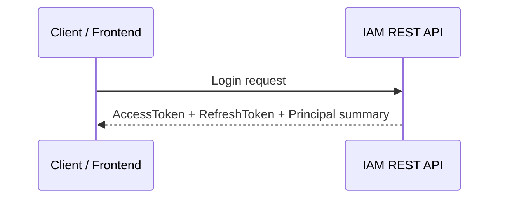
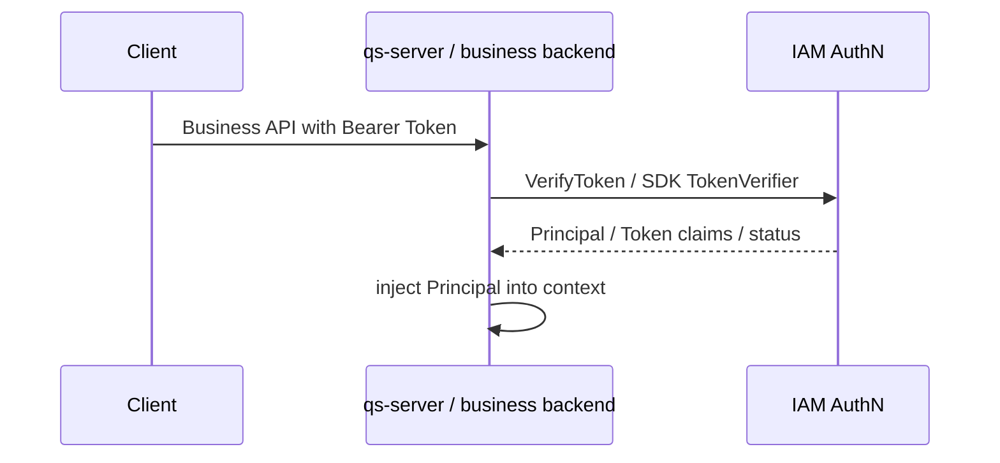
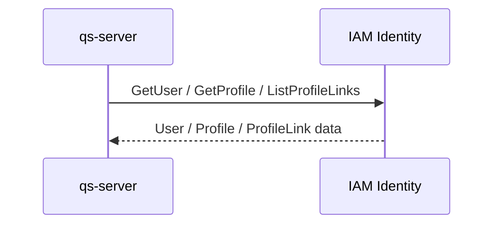
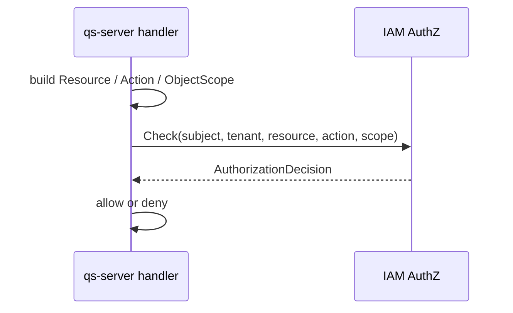
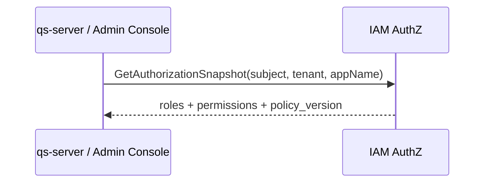

# 00-接入总览：业务系统如何接入 IAM

## 1. 本文定位

本文是 `05-接入与契约/` 文档组的第一篇。

它不先展开 REST API、gRPC service、SDK method 的字段细节，而是先从 **业务系统如何接入 IAM** 的角度，说明完整接入链路。

IAM 不是一个只能被前端调用的登录服务。

在当前系统设计中，IAM 是其他业务项目的身份与授权中心。

典型接入方包括：

```text
前端应用；
管理后台；
业务后端服务，例如 qs-server；
内部 worker，例如 qs-worker；
采集服务，例如 collection-server；
其他需要认证、身份查询、权限判定的 Go 服务。
```

本文回答：

```text
业务系统为什么需要接入 IAM？
业务系统应该通过 REST、gRPC 还是 SDK 接入？
前端登录后，业务后端如何验证 Token？
业务后端如何获取当前用户、Profile、ProfileLink？
业务后端如何调用 IAM 做权限 Check？
服务间调用如何认证？
qs-server 接入 IAM 时，推荐链路是什么？
哪些逻辑应该留在 IAM，哪些逻辑应该留在业务系统？
```

REST / gRPC / SDK 的细节分别放在后续文档中：

```text
01-REST API契约-前端与管理端接入.md
02-gRPC API契约-服务间调用与内部集成.md
03-SDK接入模型-Go服务端集成.md
04-业务系统接入链路-以qs-server为例.md
05-契约事实源与防漂移机制.md
```

一句话：

> 本文讲 IAM 接入的整体链路；后续文档再分别讲 REST、gRPC、SDK、qs-server 案例和契约防漂移。

---

## 2. 30 秒结论

业务系统接入 IAM，本质上是在接入三类能力：

```text
AuthN：认证登录、Token、Session、Principal；
Identity：User、Profile、ProfileLink；
AuthZ：Subject、Role、Permission、RoleBinding、Check、Snapshot。
```

典型链路是：

```text
Client
  -> IAM REST Login
  -> AccessToken / RefreshToken
  -> Client calls business API with Bearer Token
  -> business backend verifies token through IAM gRPC / SDK / verifier
  -> business backend gets Principal / User / ProfileLink
  -> business backend calls IAM AuthZ Check
  -> allow / deny business operation
```

三种接入形态的定位是：

| 接入形态 | 主要使用者 |
| --- | --- |
| REST | 前端、管理后台、调试、非 Go 调用方 |
| gRPC | 服务间调用、内部系统集成 |
| Go SDK | Go 服务端项目的工程化封装 |

核心边界：

```text
前端只负责登录、保存 Token、携带 Token；
业务系统负责验证 Token、构造业务资源、调用 IAM Check；
IAM 负责认证、身份事实、授权事实和权限判定；
业务系统不复制 IAM 的 LoginIdentity / Credential / RoleBinding / Permission 表；
业务系统不直接调用 Casbin，也不拼接 p/g facts。
```

---

## 3. IAM 作为身份与授权中心

IAM 在系统中的定位是：

```text
Identity and Access Management service
```

它统一提供：

```text
身份主体管理；
登录身份管理；
认证材料管理；
Token / Session 管理；
外部 IDP 接入；
角色、资源、权限、角色绑定管理；
权限判定；
授权快照；
服务间接入契约。
```

业务系统接入 IAM 后，不应该再自己实现一套登录、Token、角色、权限模型。

业务系统应该保存的通常是：

```text
iam_user_id；
iam_profile_id；
tenant_id；
业务对象 owner / origin；
业务对象与 IAM 主体的引用关系。
```

业务系统不应该复制：

```text
LoginIdentity；
Credential；
Challenge；
AccessToken / RefreshToken 存储；
Role；
Permission；
RoleBinding；
Casbin p/g facts。
```

这些属于 IAM。

---

## 4. 接入方类型

### 4.1 Browser / Mini Program / Mobile App

前端应用通常通过 REST 接入 IAM。

它负责：

```text
发起登录；
保存 AccessToken / RefreshToken；
在请求业务 API 时携带 Authorization: Bearer <access_token>；
处理登录过期、刷新 Token、退出登录。
```

前端不应该：

```text
直接调用内部 gRPC；
保存长期认证材料；
解析权限事实；
本地决定资源访问权；
直接读取 Casbin p/g facts。
```

---

### 4.2 Business Backend，例如 qs-server

业务后端是 IAM 最重要的接入方。

它负责：

```text
接收前端传来的 Bearer Token；
验证 Token；
把 Principal 注入请求上下文；
根据业务对象构造 Resource / Action / Scope；
调用 IAM AuthZ Check；
根据 AuthorizationDecision 放行或拒绝；
按需查询 User / Profile / ProfileLink。
```

业务后端可以通过：

```text
gRPC；
Go SDK；
本地 JWKS verifier + 远程 Check；
```

接入 IAM。

推荐 Go 服务优先使用 SDK。

---

### 4.3 Admin Console

管理后台主要通过 REST 接入 IAM。

它负责：

```text
用户管理；
Profile / ProfileLink 管理；
登录身份管理；
角色管理；
资源目录管理；
权限管理；
角色绑定管理；
PolicyLinter 查看；
授权快照查看。
```

管理后台调用的是 IAM 的管理能力。

这些接口通常需要管理员 Token，并通过 IAM AuthZ 做二次权限控制。

---

### 4.4 Internal Worker / Service

内部 worker 或服务通常没有前端登录流程。

它们需要的是服务间认证。

例如：

```text
qs-worker；
collection-server；
scheduled job；
outbox relay；
internal integration service。
```

它们接入 IAM 时通常需要：

```text
service identity；
service token；
mTLS 或内网边界；
gRPC metadata；
timeout / retry / deadline；
```

服务间调用不应该伪装成普通用户登录。

它应该走 service-to-service authentication。

---

## 5. 三种接入形态

### 5.1 REST：前端与管理端接入

REST API 适合：

```text
浏览器；
小程序；
移动端；
管理后台；
调试；
非 Go 调用方；
低门槛外部集成。
```

REST 文档重点说明：

```text
Base URL；
HTTP method；
path；
headers；
request body；
response body；
error code；
OpenAPI 事实源。
```

REST API 通常承载：

```text
登录；
刷新 Token；
退出登录；
当前用户查询；
用户 / Profile / ProfileLink 管理；
角色 / 资源 / 权限管理；
授权 Check / Snapshot；
IDP app 管理。
```

详细说明见：

```text
01-REST API契约-前端与管理端接入.md
```

---

### 5.2 gRPC：服务间调用与内部集成

gRPC API 适合：

```text
业务后端到 IAM；
worker 到 IAM；
collection-server 到 IAM；
内部服务到 IAM；
高频 Check；
批量身份查询；
服务间 Token 验证。
```

gRPC 文档重点说明：

```text
proto package；
service；
rpc method；
request / response message；
metadata；
deadline；
retry；
error code；
proto 事实源。
```

gRPC 适合服务间调用，是因为它基于 service definition 定义远程方法、参数和返回类型，客户端可以像调用本地对象一样调用远程服务。

详细说明见：

```text
02-gRPC API契约-服务间调用与内部集成.md
```

---

### 5.3 Go SDK：Go 服务端集成

Go SDK 适合：

```text
Go 业务服务；
Go worker；
Go gateway；
Go internal service。
```

SDK 的定位是：

```text
封装 IAM REST / gRPC 调用；
统一配置；
统一错误处理；
提供 Token verifier；
提供 AuthZ Check / Allow 便利方法；
提供 Identity 查询 client；
提供 middleware / interceptor 接入方式。
```

SDK 不是：

```text
IAM server 的本地副本；
本地授权引擎；
业务规则引擎；
数据库访问层；
internal 包访问入口。
```

详细说明见：

```text
03-SDK接入模型-Go服务端集成.md
```

---

## 6. 标准接入链路

### 6.1 用户登录链路

用户登录通常由前端发起。



典型结果：

```text
AccessToken：访问业务 API 时携带；
RefreshToken：AccessToken 过期后用于刷新；
Principal：当前认证主体摘要。
```

前端随后调用业务系统：

```http
Authorization: Bearer <access_token>
```

Bearer Token 的语义是：任何持有该 Token 的一方都可以用它访问相关受保护资源，因此必须在存储和传输中保护 Token。

---

### 6.2 Token 验证链路

业务系统收到请求后，需要验证 Token。

推荐链路：



验证成功后，业务系统应得到：

```text
UserID；
Subject；
TenantID；
LoginIdentityID；
AuthMethod；
AMR；
Token version / expiration；
```

具体字段以 AuthN 契约为准。

业务系统不应该只做字符串解析后就信任 Token。

---

### 6.3 当前用户与身份关系查询链路

业务系统常需要查询当前用户和身份关系。

例如 qs-server 可能需要：

```text
当前 User；
当前儿童 Profile；
User 与 Profile 的 ProfileLink；
当前用户是否是某个 Profile 的 guardian / owner / operator。
```

链路：



注意：

```text
ProfileLink 是身份关系，不是权限本身。
```

如果某个业务操作需要资源级访问控制，仍然应该进入 AuthZ Check。

---

### 6.4 权限 Check 链路

业务系统在执行受保护操作前，应调用 IAM AuthZ Check。



典型请求语义：

```text
Subject: user:<iam_user_id>
TenantID: tenant-a
ResourceKey: qs:evaluation:report:*
Action: read
ObjectScope: origin:<profile_id>
```

IAM 返回：

```text
Allowed；
Reason；
DenyCode；
MatchedRole；
MatchedPermission；
PolicyVersion；
```

业务系统根据 `Allowed` 决定是否继续执行业务逻辑。

---

### 6.5 授权 Snapshot 链路

Snapshot 用于查询当前主体的授权视图。



Snapshot 适合：

```text
管理后台展示；
调试权限问题；
SDK 缓存当前主体权限视图；
前端按钮展示。
```

Snapshot 不应该替代 Check。

访问控制仍应走 Check。

---

## 7. 服务间调用链路

### 7.1 服务身份

内部服务调用 IAM 时，需要有自己的服务身份。

例如：

```text
qs-server；
qs-worker；
collection-server；
admin-job；
outbox-relay。
```

服务身份用于说明：

```text
谁在调用 IAM？
这个服务是否被允许调用该 RPC？
调用是否来自可信内部网络？
调用是否携带合法 service token？
```

---

### 7.2 服务间认证方式

推荐组合：

```text
mTLS；
service token；
internal network boundary；
gRPC metadata；
trace metadata。
```

其中：

```text
mTLS 用于传输层服务身份；
service token 用于应用层调用身份；
metadata 用于传递 caller-service、request-id、tenant-id、trace-id。
```

具体采用哪种组合，以当前部署与 IAM 契约为准。

---

### 7.3 服务间调用不要伪装成用户登录

内部 worker 不应该通过用户密码登录 IAM。

错误方式：

```text
worker 使用某个管理员账号 username/password 登录；
worker 保存管理员 RefreshToken；
worker 用管理员用户身份执行系统任务。
```

正确方式：

```text
worker 使用 service identity；
通过服务间认证调用 IAM；
需要资源权限时以 service subject 做 AuthZ Check；
需要代用户执行时显式传递 on-behalf-of 语义。
```

---

## 8. qs-server 接入 IAM 的推荐方式

qs-server 是 IAM 的典型接入方。

推荐总体链路：

```text
Client
  -> IAM REST Login
  -> qs-server with Bearer Token
  -> qs-server SDK / gRPC VerifyToken
  -> qs-server business context with Principal
  -> qs-server Identity query if needed
  -> qs-server AuthZ Check before protected operation
  -> business operation
```

### 8.1 qs-server 不应该复制 IAM 模型

qs-server 可以保存：

```text
iam_user_id；
iam_profile_id；
tenant_id；
业务对象 owner / origin；
业务对象与 IAM 主体的引用关系。
```

qs-server 不应该保存：

```text
LoginIdentity；
Credential；
AccessToken / RefreshToken；
Role；
Permission；
RoleBinding；
Casbin rule。
```

这些由 IAM 负责。

---

### 8.2 qs-server 中间件建议

qs-server 可以在 HTTP/gRPC middleware 中完成：

```text
1. 读取 Authorization: Bearer <token>；
2. 调用 IAM SDK / gRPC VerifyToken；
3. 得到 Principal；
4. 将 Principal 注入 context；
5. 后续 handler 从 context 中取当前主体。
```

业务 handler 不应该重复解析 Token。

---

### 8.3 qs-server 权限判定建议

业务 handler 执行敏感操作前，应构造授权请求。

例如读取测评报告：

```text
subject = user:<iam_user_id>
tenant = tenant-a
resource = qs:evaluation:report:*
action = read
scope = origin:<profile_id>
```

然后调用：

```text
IAM AuthZ Check
```

如果 `Allowed = false`，业务 handler 应拒绝请求。

---

### 8.4 qs-server 与 ProfileLink

qs-server 可以通过 IAM Identity 查询 ProfileLink。

但要明确：

```text
ProfileLink 是身份关系；
AuthZ Check 是资源权限判定。
```

例如：

```text
用户是某个儿童 Profile 的 guardian；
不等于用户自动拥有所有 report:read 权限。
```

是否允许读取报告，应由 AuthZ Resource / Action / Scope 决定。

---

## 9. 接入边界与误区

### 9.1 前端自己解析 JWT 后决定权限

错误。

前端可以读取部分展示信息，但不能作为最终权限判定依据。

最终访问控制应由业务后端调用 IAM AuthZ Check。

---

### 9.2 业务系统直接使用 JWKS 本地验签就够了

不一定。

本地验签可以确认 Token 签名和 claims 基础有效性。

但如果系统需要强状态控制，例如：

```text
Session revoke；
RefreshToken rotation；
账号禁用；
Token audit；
风险控制；
```

可能还需要远程 VerifyToken 或 Online Check。

具体使用策略应由 AuthN 契约明确。

---

### 9.3 业务系统缓存 Permission 后本地判定

不推荐作为默认方案。

业务系统可以缓存 Snapshot 用于展示。

但资源访问控制应优先走 Check。

如果需要本地缓存授权结果，必须关注：

```text
PolicyVersion；
TTL；
Outbox version_changed；
cache invalidation；
一致性边界。
```

---

### 9.4 业务系统直接调用 Casbin

错误。

Casbin 是 IAM 内部 runtime engine。

业务系统应该调用：

```text
IAM AuthZ Check；
IAM SDK Authz().Check / Allow；
```

而不是调用：

```text
casbin.Enforce；
casbin_rule；
p/g facts。
```

---

### 9.5 把 ProfileLink 当作权限

错误。

ProfileLink 说明用户和 Profile 的身份关系。

权限仍然要通过 Resource / Action / Scope 判定。

---

### 9.6 SDK 替代 IAM Server

错误。

SDK 是客户端封装。

SDK 不拥有 IAM 事实源。

SDK 不应该本地复制 RoleBinding、Permission、Credential、Session。

---

## 10. 推荐阅读路径

### 10.1 业务系统第一次接入 IAM

```text
00-接入总览-业务系统如何接入IAM.md
  -> 04-业务系统接入链路-以qs-server为例.md
  -> 03-SDK接入模型-Go服务端集成.md
  -> 02-gRPC API契约-服务间调用与内部集成.md
```

---

### 10.2 前端或管理后台接入

```text
00-接入总览-业务系统如何接入IAM.md
  -> 01-REST API契约-前端与管理端接入.md
```

---

### 10.3 服务间调用接入

```text
00-接入总览-业务系统如何接入IAM.md
  -> 02-gRPC API契约-服务间调用与内部集成.md
  -> 03-SDK接入模型-Go服务端集成.md
```

---

### 10.4 维护接口契约

```text
00-接入总览-业务系统如何接入IAM.md
  -> 05-契约事实源与防漂移机制.md
  -> 01-REST API契约-前端与管理端接入.md
  -> 02-gRPC API契约-服务间调用与内部集成.md
  -> 03-SDK接入模型-Go服务端集成.md
```

---

## 11. 契约事实源

本文只做总览。

详细事实源见：

```text
05-契约事实源与防漂移机制.md
```

总体原则：

```text
REST 契约以 OpenAPI / REST handler / REST test 为准；
gRPC 契约以 proto / generated code / gRPC transport test 为准；
SDK 契约以 pkg/sdk public API / SDK test / examples 为准；
文档用于解释接入链路，不替代机器契约。
```

常见事实源入口：

```text
api/rest
api/grpc
pkg/sdk
internal/apiserver/transport/rest
internal/apiserver/transport/grpc
```

OpenAPI 的价值是提供人和机器都能读取的 REST API 描述，可用于文档生成、集成校验和客户端生成。

gRPC 的价值是通过 `.proto` 文件定义 service、method、request、response，并生成客户端和服务端代码。

---

## 12. 本文总结

业务系统接入 IAM，不是简单调用一个登录接口。

完整链路包括：

```text
登录；
Token 获取；
Token 验证；
Principal 注入；
User / Profile / ProfileLink 查询；
Resource / Action / Scope 构造；
AuthZ Check；
Snapshot 展示；
服务间认证；
契约防漂移。
```

接入形态包括：

```text
REST：前端、管理后台、调试、外部低门槛接入；
gRPC：服务间调用、内部系统集成；
SDK：Go 服务端工程化封装。
```

如果只记住一句话：

> IAM 是业务系统的身份与授权中心；前端通过 REST 登录并携带 Token，业务后端通过 gRPC / SDK 验证 Token、查询身份、调用 AuthZ Check，IAM 统一维护身份事实、认证状态、授权事实和权限判定。
