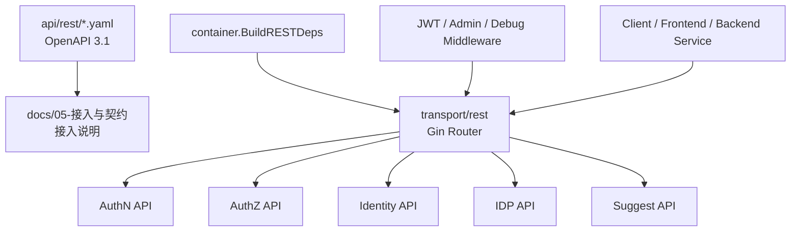
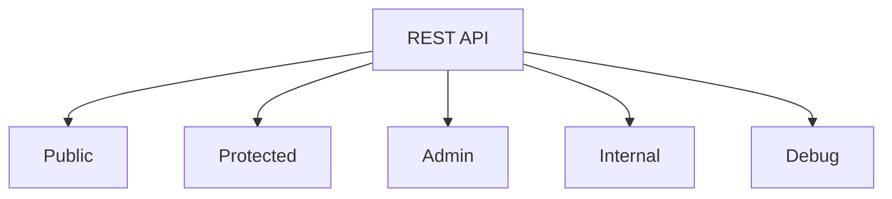

# REST API 契约

## 本文回答

本文回答：IAM 的 REST API 如何作为外部接入契约使用；OpenAPI 与运行时路由之间如何对应；调用方如何区分 public、protected、admin、internal、debug 路由；登录、Token、JWKS、AuthZ Check、Identity/ProfileLink、IDP、Suggest 各类接口分别适合什么场景；REST 接入时如何选择在线 Verify、离线 JWKS 验签和授权 Check。

读完本文，你应该能回答：

- REST API 的机器契约事实源在哪里；
- OpenAPI 文件和运行时 Gin routes 分别负责什么；
- `/api/v2` 前缀和各模块路径如何组织；
- 哪些 REST 能力是 public，哪些需要 Bearer JWT，哪些需要 platform admin；
- AuthN REST API 如何完成登录、刷新、验证和登出；
- JWKS public endpoint 与 JWKS admin endpoint 的区别；
- AuthZ Check 适合什么接入场景；
- assignment wire term 与 rolebinding internal term 的边界；
- Identity/Profile/ProfileLink REST API 如何表达当前用户视角；
- IDP REST API 管理的是微信平台能力，不是 IAM 登录 token；
- Suggest REST API 只是候选发现，不建立 ProfileLink；
- REST 契约如何通过测试和脚本防漂移。

---

## 30 秒结论

IAM REST API 的事实源分两层：

```text
api/rest/*.yaml
  -> OpenAPI 3.1 机器契约
  -> 路径、字段、schema、认证声明、错误响应

internal/apiserver/transport/rest
  -> 运行时路由注册
  -> middleware、fail-closed、module availability、admin protection
```

`docs/` 不重复维护字段清单。字段和 schema 以 OpenAPI 为准；运行时是否真的注册某个路由，以 `transport/rest` 和 router matrix test 为准。

REST API 当前按模块分为：

| OpenAPI 文件 | 模块 | 主要能力 |
| --- | --- | --- |
| `api/rest/authn.v2.yaml` | AuthN | 登录、Token、JWKS、账户、signup |
| `api/rest/authz.v2.yaml` | AuthZ | 授权判定、角色、assignment、策略、资源 |
| `api/rest/identity.v2.yaml` | Identity | 当前用户、Profile、ProfileLink |
| `api/rest/idp.v2.yaml` | IDP | 微信应用配置、微信 access_token、secret 轮换 |
| `api/rest/suggest.v2.yaml` | Suggest | 档案联想搜索 |

REST 接入最常用的三条链路是：

```text
登录：
POST /api/v2/authn/login
  -> access_token + refresh_token

认证：
Authorization: Bearer <access_token>
  -> protected routes

授权判定：
POST /api/v2/authz/check
  -> allowed true/false
```

核心边界：

```text
REST API 是接入契约
不是领域模型本身
不是 OpenAPI 字段大全
不是 gRPC 的替代品
不是 SDK 的内部实现细节
```

核心源码入口：

- [../../api/rest/README.md](../../api/rest/README.md)
- [../../api/rest/authn.v2.yaml](../../api/rest/authn.v2.yaml)
- [../../api/rest/authz.v2.yaml](../../api/rest/authz.v2.yaml)
- [../../api/rest/identity.v2.yaml](../../api/rest/identity.v2.yaml)
- [../../api/rest/idp.v2.yaml](../../api/rest/idp.v2.yaml)
- [../../api/rest/suggest.v2.yaml](../../api/rest/suggest.v2.yaml)
- [../../internal/apiserver/transport/rest/router.go](../../internal/apiserver/transport/rest/router.go)
- [../../internal/apiserver/transport/rest/module_routes.go](../../internal/apiserver/transport/rest/module_routes.go)
- [../../internal/apiserver/transport/rest/router_matrix_test.go](../../internal/apiserver/transport/rest/router_matrix_test.go)

---

## 主图：REST 契约与运行时注册



---

## 重点速查

| 问题 | 当前答案 | 代码证据 |
| --- | --- | --- |
| REST 机器契约在哪里 | `api/rest/*.yaml`，OpenAPI 3.1。 | [../../api/rest/README.md](../../api/rest/README.md) |
| REST 契约文件有哪些 | authn、authz、identity、idp、suggest 五个 v2 文件。 | [../../api/rest/README.md](../../api/rest/README.md) |
| 运行时路由在哪里注册 | `internal/apiserver/transport/rest`。 | [../../api/rest/README.md](../../api/rest/README.md)、[../../internal/apiserver/transport/rest/router.go](../../internal/apiserver/transport/rest/router.go) |
| 关键路由是否被测试保护 | router matrix test 检查关键路由注册与 OpenAPI 覆盖。 | [../../internal/apiserver/transport/rest/router_matrix_test.go](../../internal/apiserver/transport/rest/router_matrix_test.go) |
| 路由合同脚本做什么 | 比较 swagger 生成路由与 `api/rest` specs。 | [../../scripts/check-route-contracts.py](../../scripts/check-route-contracts.py) |
| OpenAPI schema 合同脚本做什么 | 比较 swagger definitions 与 OpenAPI component schemas。 | [../../scripts/check-openapi-contracts.py](../../scripts/check-openapi-contracts.py) |
| 登录入口 | `POST /api/v2/authn/login`。 | [../../api/rest/authn.v2.yaml](../../api/rest/authn.v2.yaml) |
| JWKS public endpoint | `GET /.well-known/jwks.json`、`GET /api/v2/.well-known/jwks.json`。 | [../../api/rest/README.md](../../api/rest/README.md)、[../../api/rest/authn.v2.yaml](../../api/rest/authn.v2.yaml) |
| AuthZ Check | `POST /api/v2/authz/check`。 | [../../api/rest/authz.v2.yaml](../../api/rest/authz.v2.yaml) |
| Identity 当前用户 | `GET /api/v2/identity/me`。 | [../../api/rest/identity.v2.yaml](../../api/rest/identity.v2.yaml) |
| ProfileLink 路由 | `/api/v2/identity/profile-links`。 | [../../api/rest/identity.v2.yaml](../../api/rest/identity.v2.yaml) |
| IDP 微信应用管理 | `/api/v2/idp/wechat-apps/*`。 | [../../api/rest/idp.v2.yaml](../../api/rest/idp.v2.yaml) |
| Suggest profile | `GET /api/v2/suggest/profile?k=...`。 | [../../api/rest/suggest.v2.yaml](../../api/rest/suggest.v2.yaml) |

---

## 1. REST API 的事实源边界

REST API 有三个层次：

| 层次 | 文件/代码 | 作用 |
| --- | --- | --- |
| 机器契约 | `api/rest/*.yaml` | OpenAPI 3.1：路径、方法、字段、schema、响应、认证声明 |
| 运行时注册 | `internal/apiserver/transport/rest` | Gin route、middleware、条件注册、admin protection、debug routes |
| 解释文档 | `docs/05-接入与契约/*.md` | 接入方式、语义边界、调用场景、设计取舍 |

因此遇到冲突时：

```text
字段、schema、响应格式
  -> 看 api/rest/*.yaml

路由是否真的注册、是否受 middleware 保护
  -> 看 transport/rest 和 router_matrix_test

业务语义
  -> 看 AuthN/AuthZ/Identity/IDP/Suggest 专题文档和源码
```

这篇文档只做解释，不替代 OpenAPI。

---

## 2. 路径组织与版本

REST API 当前使用 v2 版本：

```text
/api/v2
```

OpenAPI 文件中的 server URL 已包含 `/api/v2`：

```text
https://iam.fangcunmount.cn/api/v2
http://localhost:18081/api/v2
```

因此 OpenAPI paths 通常写成：

```text
/authn/login
/authz/check
/identity/me
```

运行时完整路径是：

```text
/api/v2/authn/login
/api/v2/authz/check
/api/v2/identity/me
```

### 2.1 模块路径

| 模块 | 路径前缀 |
| --- | --- |
| AuthN | `/api/v2/authn` |
| AuthZ | `/api/v2/authz` |
| Identity | `/api/v2/identity` |
| IDP | `/api/v2/idp` |
| Suggest | `/api/v2/suggest` |
| Admin | `/api/v2/admin` |
| Internal | `/api/v2/internal` |
| Well-known JWKS | `/.well-known/jwks.json` 和 `/api/v2/.well-known/jwks.json` |
| Debug | `/debug/*` |

### 2.2 v2 显式契约

AuthN v2 登录使用：

```text
auth_method + method_payload
```

不是旧式“根据字段猜测登录方式”。  
公开 v2 登录方式当前是：

```text
password
phone_otp
wechat
wecom
```

核心源码：

- [../../api/rest/authn.v2.yaml](../../api/rest/authn.v2.yaml)
- [../../internal/apiserver/transport/rest/authn/handler/auth_login.go](../../internal/apiserver/transport/rest/authn/handler/auth_login.go)

---

## 3. REST 路由分类

IAM REST API 不是所有路由都同一种保护等级。

| 分类 | 示例 | 保护方式 |
| --- | --- | --- |
| Public | `/api/v2/authn/login`、`/.well-known/jwks.json` | 不要求已有 IAM access token |
| Protected | `/api/v2/identity/me`、`/api/v2/authz/check`、`/api/v2/suggest/profile` | 需要 Bearer access token |
| Admin | `/api/v2/authn/admin/jwks/*`、`/api/v2/idp/wechat-apps/*`、`/api/v2/admin/sessions/*` | 需要 JWT + platform admin / role check |
| Internal | `/api/v2/internal/authn/mock-consumers/ensure` | 内部能力，依赖配置与 shared secret |
| Debug | `/debug/routes`、`/debug/modules`、`/debug/cache-governance/*` | 运行时诊断，生产环境需谨慎 |



### Fail-closed 原则

运行时不是“服务启动就注册所有路由”。  
受保护路由依赖 AuthN TokenService/JWT middleware；admin routes 还依赖 AuthZ route authorization 和角色检查能力。

如果这些能力缺失：

```text
protected/admin routes 不注册
```

而不是注册一个无法正确保护的接口。

核心源码：

- [../../internal/apiserver/transport/rest/router.go](../../internal/apiserver/transport/rest/router.go)
- [../../internal/apiserver/transport/rest/module_routes.go](../../internal/apiserver/transport/rest/module_routes.go)
- [../../internal/apiserver/transport/rest/admin_routes.go](../../internal/apiserver/transport/rest/admin_routes.go)

---

## 4. 认证与凭证传递

### 4.1 Bearer Token

Protected/Admin REST routes 使用：

```http
Authorization: Bearer <IAM_ACCESS_TOKEN>
```

Access token 来自：

```text
POST /api/v2/authn/login
POST /api/v2/authn/refresh_token
```

JWT middleware 会把 token claims 写入 Gin context，例如：

```text
user_id
account_id
tenant_id
session_id
```

这些上下文随后被 Identity/AuthZ handlers 使用。

### 4.2 在线 Verify 与离线 JWKS

REST 接入中有两种验证方式：

| 方式 | 接口/能力 | 能看到在线状态吗 |
| --- | --- | ---: |
| 在线 Verify | `POST /api/v2/authn/verify` | 是 |
| 离线 JWKS 验签 | `GET /.well-known/jwks.json` | 否 |

在线 Verify 会检查：

```text
JWT
access token revoke marker
session active
user/account status
```

离线 JWKS 只能检查：

```text
签名
kid
exp / nbf / iss / aud 等静态 claim
```

如果业务需要“封禁、撤销、session 失效立即生效”，应走在线 Verify 或让业务服务调用 IAM/SDK 提供的在线验证能力。

---

## 5. AuthN REST 契约

AuthN REST API 主要处理：

```text
登录
登录预准备
refresh / logout / verify
JWKS public
JWKS admin
账户与 signup
```

### 5.1 登录

```http
POST /api/v2/authn/login
```

请求：

```json
{
  "auth_method": "password",
  "method_payload": {
    "username": "alice",
    "password": "secret",
    "tenant_id": 1
  }
}
```

公开 auth method：

| auth_method | payload |
| --- | --- |
| `password` | username/password/tenant_id |
| `phone_otp` | phone/otp_code |
| `wechat` | app_id/code |
| `wecom` | corp_id/auth_code |

响应返回：

```text
token_type = Bearer
access_token
expires_in
refresh_token
```

### 5.2 登录挑战

```http
POST /api/v2/authn/challenges/phone-otp
```

用于发送手机 OTP 登录验证码。
它不是登录成功，只是为 `phone_otp` 登录方式准备验证码。

### 5.3 Token 生命周期

| 能力 | 路由 |
| --- | --- |
| Refresh | `POST /api/v2/authn/refresh_token` |
| Logout | `POST /api/v2/authn/logout` |
| Verify | `POST /api/v2/authn/verify` |

Refresh 使用 refresh token 生成新的 token pair。  
Logout 可以撤销 access token 和/或 refresh token。  
Verify 用于在线验证 access token，并返回有效性与 claims。

### 5.4 JWKS

Public JWKS：

```http
GET /.well-known/jwks.json
GET /api/v2/.well-known/jwks.json
```

Admin JWKS：

```text
/api/v2/authn/admin/jwks/keys/*
```

Public JWKS 不要求 Bearer token，用于外部服务离线验签。  
Admin JWKS 需要 admin protection，用于密钥创建、grace、retire、force-retire、cleanup、publishable preview。

### 5.5 微信小程序 signup

```http
POST /api/v2/authn/signups/wechat-miniprogram
```

这是 account onboarding 能力，不等同于 `auth_method=wechat` 登录。  
登录要求已有 OAuth credential 绑定；signup/onboarding 负责创建或绑定 IAM 用户/账号。

核心事实源：

- [../../api/rest/authn.v2.yaml](../../api/rest/authn.v2.yaml)

---

## 6. AuthZ REST 契约

AuthZ REST API 主要处理：

```text
授权判定
角色管理
assignment / rolebinding 管理
policy permission 管理
resource 管理
policy version
```

### 6.1 授权判定

```http
POST /api/v2/authz/check
```

请求核心字段：

```json
{
  "object": "scale:form:template:*",
  "action": "read",
  "scope_type": "origin",
  "scope_value": "school-a"
}
```

可选显式 subject：

```json
{
  "subject_type": "user",
  "subject_id": "123",
  "object": "scale:form:template:*",
  "action": "read"
}
```

如果不传 subject，则使用当前 JWT user。  
REST tenant 来自 JWT context，不从 body 传入。

响应：

```json
{
  "allowed": true
}
```

### 6.2 Role / Resource / Policy

| 能力 | 路由 |
| --- | --- |
| Roles | `/api/v2/authz/roles` |
| Resources | `/api/v2/authz/resources` |
| Permissions | `/api/v2/authz/policies` |
| Policy version | `/api/v2/authz/policies/version` |

### 6.3 Assignment wire term

REST 对外路径使用：

```text
/api/v2/authz/assignments
```

但内部领域术语是：

```text
rolebinding
```

因此：

```text
assignment = REST/OpenAPI wire term
rolebinding = application/domain internal term
```

REST assignment 当前 subject_type 枚举为：

```text
user
```

不要把它误读成 REST 已开放 group/service 赋权。

核心事实源：

- [../../api/rest/authz.v2.yaml](../../api/rest/authz.v2.yaml)

---

## 7. Identity REST 契约

Identity REST API 主要处理：

```text
当前用户
当前用户 profiles
Profile 创建/查询/更新
ProfileLink 查询/授予/撤销
```

全部挂在：

```text
/api/v2/identity
```

并需要 Bearer token。

### 7.1 当前用户

```http
GET /api/v2/identity/me
PATCH /api/v2/identity/me
```

`GET /identity/me` 返回当前登录用户信息和 roles。  
`PATCH /identity/me` 支持更新昵称、联系方式等当前用户资料。

### 7.2 当前用户 Profile

```http
GET /api/v2/identity/me/profiles
POST /api/v2/identity/profiles
GET /api/v2/identity/profiles/{id}
PATCH /api/v2/identity/profiles/{id}
```

关键语义：

- `POST /identity/profiles` 会创建 Profile，并自动建立当前用户与 Profile 的 ProfileLink；
- `GET/PATCH /identity/profiles/{id}` 只允许访问当前用户有关联的 Profile；
- 访问 guard 来自 ProfileLink，不是直接全局 Profile CRUD。

### 7.3 ProfileLink

```http
GET  /api/v2/identity/profile-links
POST /api/v2/identity/profile-links
POST /api/v2/identity/profile-links/{id}/revoke
```

REST ProfileLink 是当前用户视角：

- 不能给其他 user grant profile link；
- 不能查询其他 user 的 profile links；
- 不能 revoke 其他 user 的 profile link。

核心事实源：

- [../../api/rest/identity.v2.yaml](../../api/rest/identity.v2.yaml)

---

## 8. IDP REST 契约

IDP REST API 处理的是第三方身份源配置，当前重点是微信应用。

OpenAPI 文件说明：

```text
微信应用管理及第三方身份提供能力
登录由 authn 模块统一提供
```

这条边界必须保留：

```text
IDP 管微信应用配置、AppSecret、微信 access_token
AuthN 管 IAM 登录态和 IAM token
```

### 8.1 IDP Health

```http
GET /api/v2/idp/health
```

用于 IDP 模块基本健康检查。

### 8.2 微信应用管理

```text
GET    /api/v2/idp/wechat-apps
POST   /api/v2/idp/wechat-apps
GET    /api/v2/idp/wechat-apps/{app_id}
PATCH  /api/v2/idp/wechat-apps/{app_id}
POST   /api/v2/idp/wechat-apps/{app_id}/enable
POST   /api/v2/idp/wechat-apps/{app_id}/disable
POST   /api/v2/idp/wechat-apps/rotate-auth-secret
POST   /api/v2/idp/wechat-apps/rotate-msg-secret
```

这些是管理面能力，运行时需要 admin middlewares 才会注册管理路由。

### 8.3 微信 access_token

```http
GET  /api/v2/idp/wechat-apps/{app_id}/access-token
POST /api/v2/idp/wechat-apps/refresh-access-token
```

这里返回的是微信平台 access_token，不是 IAM access token。  
不要把它用于 IAM Bearer Authorization。

核心事实源：

- [../../api/rest/idp.v2.yaml](../../api/rest/idp.v2.yaml)
- [../../internal/apiserver/transport/rest/idp/router.go](../../internal/apiserver/transport/rest/idp/router.go)

---

## 9. Suggest REST 契约

Suggest REST 当前只有一个核心接口：

```http
GET /api/v2/suggest/profile?k=<keyword>
```

语义：

```text
档案联想搜索
```

OpenAPI 描述中明确：

- 中文/拼音前缀联想；
- 数字关键词走手机号/ID 精确匹配；
- 返回结果按权重降序、去重。

### Suggest 的边界

Suggest 只做候选发现：

```text
输入关键词
  -> 返回候选 term
```

它不做：

- ProfileLink 建立；
- Profile 访问授权；
- AuthZ 权限判定；
- Profile 详情读取。

后续如果用户要对候选 Profile 建立关系，应走 Identity/ProfileLink 链路。

核心事实源：

- [../../api/rest/suggest.v2.yaml](../../api/rest/suggest.v2.yaml)

---

## 10. Health、Debug 与 OpenAPI

### 10.1 REST base/debug routes

运行时 base routes 包括：

```text
GET /health
GET /ping
GET /debug/routes
GET /debug/modules
GET /openapi/*
GET /swagger/*
GET /api/v2/public/info
```

这些并不都属于 `api/rest/*.yaml` 的公共业务契约。

### 10.2 `/health` 与 `/healthz`

需要区分：

| 路由 | 所属层 | 语义 |
| --- | --- | --- |
| `/health` | IAM REST Router | AuthN/AuthZ 运行面健康 |
| `/healthz` | GenericAPIServer | 通用 HTTP server healthz |
| `/debug/routes` | IAM REST Router | Gin 实际注册路由 |
| `/debug/modules` | IAM REST Router | module status |

### 10.3 Debug cache governance

```text
/debug/cache-governance/*
```

这是运行时诊断面，不是普通业务 API。  
production 下需要 admin protection 或被跳过注册。

---

## 11. 响应与错误

### 11.1 不同模块响应包装不完全一致

当前 REST 模块历史来源不同，响应形态并不完全统一：

| 模块 | 常见响应形态 |
| --- | --- |
| AuthN | TokenPair / message / ErrResponse |
| AuthZ | `Response{code,message,data}` 或 `ListResponse` |
| Identity | 直接返回 User/Profile/ProfileLink response |
| IDP | WechatAppResponse / ErrorResponse |
| Suggest | Term array |

因此接入方不要假设所有 REST response 都有完全一致的 envelope。  
字段和响应结构以对应 OpenAPI schema 为准。

### 11.2 常见状态码语义

| 状态码 | 语义 |
| ---: | --- |
| 200 | 查询或操作成功 |
| 201 | 创建成功，例如 Profile、ProfileLink、signup |
| 204 | 无 body 成功，例如部分 JWKS lifecycle 操作 |
| 400 | 请求参数错误 |
| 401 | 未认证或 token 无效 |
| 403 | 无权限 |
| 404 | 资源不存在 |
| 409 | 冲突，例如重复 ProfileLink |
| 500 | 服务器内部错误 |

### 11.3 错误结构

多个模块使用：

```text
pkg/core.ErrResponse
```

典型字段：

```text
code
message
reference
```

但 IDP 也有自己的 `ErrorResponse`。  
具体以 OpenAPI schemas 为准。

---

## 12. REST 接入推荐路径

### 12.1 前端 / Web / Mobile Client

推荐流程：

```text
1. POST /api/v2/authn/login
2. 保存 access_token 和 refresh_token
3. 请求 protected API 时带 Authorization: Bearer
4. access token 过期后 POST /api/v2/authn/refresh_token
5. 登出时 POST /api/v2/authn/logout
```

前端常用接口：

```text
GET /api/v2/identity/me
GET /api/v2/identity/me/profiles
POST /api/v2/identity/profiles
GET /api/v2/suggest/profile?k=...
```

### 12.2 业务后端服务

推荐流程：

```text
1. 接收客户端 IAM access token
2. 需要强一致认证时调用 /authn/verify
3. 需要离线快速验签时缓存 JWKS
4. 需要权限判定时调用 /authz/check
```

选择规则：

| 场景 | 推荐 |
| --- | --- |
| 只需验签，接受短期撤销延迟 | JWKS 离线验签 |
| 需要 session/user/account 最新状态 | `/authn/verify` |
| 需要判断资源权限 | `/authz/check` |
| 需要用户档案关系 | `/identity/profile-links` 或 gRPC Identity |

### 12.3 管理后台

管理后台通常需要：

```text
AuthZ roles/resources/policies/assignments
AuthN admin JWKS
IDP wechat-apps
Admin session revoke
```

这些能力需要 admin protection。  
如果 AuthZ route authorization 或 JWT role check 不可用，admin routes 不会注册。

---

## 13. 示例调用

### 13.1 登录

```bash
curl -X POST http://localhost:18081/api/v2/authn/login \
  -H "Content-Type: application/json" \
  -d '{
    "auth_method": "password",
    "method_payload": {
      "username": "alice",
      "password": "secret",
      "tenant_id": 1
    }
  }'
```

### 13.2 当前用户

```bash
curl http://localhost:18081/api/v2/identity/me \
  -H "Authorization: Bearer ${IAM_ACCESS_TOKEN}"
```

### 13.3 在线 Verify

```bash
curl -X POST http://localhost:18081/api/v2/authn/verify \
  -H "Content-Type: application/json" \
  -d "{
    \"access_token\": \"${IAM_ACCESS_TOKEN}\"
  }"
```

### 13.4 AuthZ Check

```bash
curl -X POST http://localhost:18081/api/v2/authz/check \
  -H "Authorization: Bearer ${IAM_ACCESS_TOKEN}" \
  -H "Content-Type: application/json" \
  -d '{
    "object": "scale:form:template:*",
    "action": "read",
    "scope_type": "origin",
    "scope_value": "school-a"
  }'
```

### 13.5 JWKS

```bash
curl http://localhost:18081/.well-known/jwks.json
```

### 13.6 ProfileLink

```bash
curl -X POST http://localhost:18081/api/v2/identity/profile-links \
  -H "Authorization: Bearer ${IAM_ACCESS_TOKEN}" \
  -H "Content-Type: application/json" \
  -d '{
    "profileId": "123",
    "relation": "parent"
  }'
```

---

## 14. OpenAPI 与运行时防漂移

IAM 当前通过多种方式防止 REST 契约漂移。

### 14.1 Router matrix test

`router_matrix_test.go` 检查：

- 关键路由是否注册；
- OpenAPI 是否覆盖实际注册的 public routes；
- 退役路由不应重新出现。

关键路由包括：

```text
/authn/login
/authz/check
/identity/me
/idp/wechat-apps
/suggest/profile
/.well-known/jwks.json
```

### 14.2 Route contract script

`scripts/check-route-contracts.py` 比较：

```text
internal/apiserver/docs/swagger.yaml
api/rest/*.yaml
```

用于发现：

- spec 里有但代码 swagger 没有的路由；
- 代码 swagger 有但 spec 没有的路由。

### 14.3 OpenAPI schema contract script

`scripts/check-openapi-contracts.py` 比较：

```text
swagger definitions
OpenAPI component schemas
```

用于发现 DTO 字段漂移。

核心源码：

- [../../internal/apiserver/transport/rest/router_matrix_test.go](../../internal/apiserver/transport/rest/router_matrix_test.go)
- [../../scripts/check-route-contracts.py](../../scripts/check-route-contracts.py)
- [../../scripts/check-openapi-contracts.py](../../scripts/check-openapi-contracts.py)

---

## 15. 常见误区

### 误区一：docs 可以替代 OpenAPI

不可以。  
字段、schema、参数、响应以 `api/rest/*.yaml` 为准。

### 误区二：OpenAPI 写了就一定运行时注册

不一定。  
运行时是否注册还取决于 module availability、JWT middleware、admin middleware、debug config。必须看 `transport/rest`。

### 误区三：登录后只需要离线 JWKS 验签

不一定。  
如果要让撤销、封禁、session 失效立即生效，需要在线 Verify。

### 误区四：IDP access_token 是 IAM access_token

不对。  
IDP 的 access_token 是微信平台 token；IAM access_token 来自 AuthN。

### 误区五：AuthZ assignment 是内部领域模型

不对。  
assignment 是 REST wire term；内部模型是 rolebinding。

### 误区六：ProfileLink 是 AuthZ 权限

不对。  
ProfileLink 是 Identity 关系。AuthZ 权限仍由 Role/Permission/Check 判定。

### 误区七：Suggest 搜到了 Profile 就有访问权

不对。  
Suggest 只是候选发现，不建立关系，也不授予权限。

### 误区八：Admin routes 一定存在

不一定。  
Admin routes 依赖 JWT middleware 和 role check。缺失时 fail-closed，不注册。

---

## 16. 当前边界与待讨论点

### 16.1 REST response envelope 尚未完全统一

AuthN/AuthZ/Identity/IDP/Suggest 的响应风格不完全一致。  
第一版文档不强行统一，只说明以 OpenAPI schema 为准。后续如果要统一 response envelope，应先改契约和 handler。

### 16.2 REST ProfileLink 是当前用户视角

REST `/identity/profile-links` 使用 `MyProfileLinks`，限制当前用户。  
gRPC ProfileLinkCommand 更偏系统侧。不要把两者混为同一接入语义。

### 16.3 AuthZ Check 的 REST tenant 来自 JWT context

REST `/authz/check` 不从 body 传 tenant。  
如果业务服务需要显式指定 domain/tenant 的判定能力，更适合 gRPC Check 或后续明确扩展 REST 契约。

### 16.4 Internal mock consumer route 不应作为公开 API

`/api/v2/internal/authn/mock-consumers/ensure` 是内部能力，依赖 seed mock 配置和 shared secret。  
不要把它放进正式接入手册。

---

## 17. 推荐源码阅读路线

### 第一轮：REST 机器契约

```text
api/rest/README.md
api/rest/authn.v2.yaml
api/rest/authz.v2.yaml
api/rest/identity.v2.yaml
api/rest/idp.v2.yaml
api/rest/suggest.v2.yaml
```

目标：看清 OpenAPI 路径、字段和响应 schema。

### 第二轮：运行时注册

```text
internal/apiserver/transport/rest/router.go
internal/apiserver/transport/rest/module_routes.go
internal/apiserver/transport/rest/admin_routes.go
internal/apiserver/transport/rest/debug_routes.go
```

目标：看清 base/debug/module/admin routes 和 fail-closed 条件。

### 第三轮：各模块 REST handler

```text
internal/apiserver/transport/rest/authn
internal/apiserver/transport/rest/authz
internal/apiserver/transport/rest/identity
internal/apiserver/transport/rest/idp
internal/apiserver/transport/rest/suggest
```

目标：看清 DTO 如何映射到 application services。

### 第四轮：middleware

```text
internal/pkg/middleware/authn/jwt_middleware.go
```

目标：看清 Bearer token 如何被验证，context 如何写入 user/account/tenant/session。

### 第五轮：契约防漂移

```text
internal/apiserver/transport/rest/router_matrix_test.go
scripts/check-route-contracts.py
scripts/check-openapi-contracts.py
```

目标：看清路由、OpenAPI、Swagger 之间如何做合同检查。

---

## 18. 验证建议

```bash
make docs-swagger
make api-validate
go test ./internal/apiserver/transport/rest
go test ./internal/pkg/architecture
make docs-hygiene
```

说明：

- `make docs-swagger` 用于从代码生成 swagger 文档；
- `make api-validate` 用于验证 REST/OpenAPI/API 契约，通常依赖 Docker daemon；
- `go test ./internal/apiserver/transport/rest` 会执行 router matrix 和 OpenAPI 覆盖测试；
- `go test ./internal/pkg/architecture` 用于确认 transport 边界没有回退；
- `make docs-hygiene` 用于文档卫生检查。

建议重点测试方向：

| 测试方向 | 目的 |
| --- | --- |
| 关键路由注册 | 登录、JWKS、AuthZ Check、Identity、IDP、Suggest |
| Protected route fail-closed | AuthN TokenService 缺失时不注册 protected routes |
| Admin route fail-closed | Role check 缺失时不注册 admin routes |
| OpenAPI coverage | 实际 public routes 必须被 api/rest 覆盖 |
| Schema drift | swagger definitions 与 OpenAPI schemas 不漂移 |
| Retired routes | 旧路由不应重新出现 |
| Debug routes | production 下 debug cache governance 受 admin protection |

---

## 本文总结

REST API 契约可以压缩成一句话：

> `api/rest/*.yaml` 是 REST 的机器契约事实源，`transport/rest` 是运行时注册事实源，本文只解释如何接入、如何选择接口、如何理解认证授权边界。

REST 接入主线是：

```text
AuthN 登录拿 token
  -> Bearer 访问 protected routes
  -> 在线 Verify 或 JWKS 离线验签
  -> AuthZ Check 做权限判定
  -> Identity/ProfileLink 管用户与档案关系
  -> IDP 管第三方身份源配置
  -> Suggest 做候选发现
```

接入时最重要的边界是：

```text
字段看 OpenAPI
路由注册看 transport
认证看 AuthN
权限看 AuthZ
档案关系看 Identity/ProfileLink
微信配置看 IDP
候选搜索看 Suggest
```
