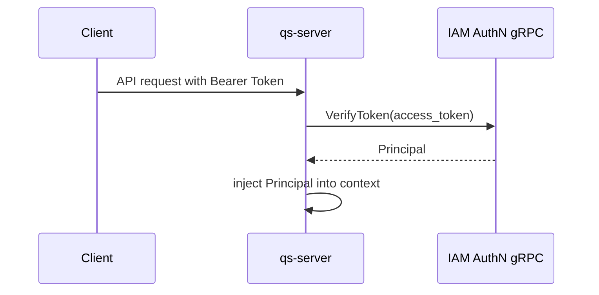
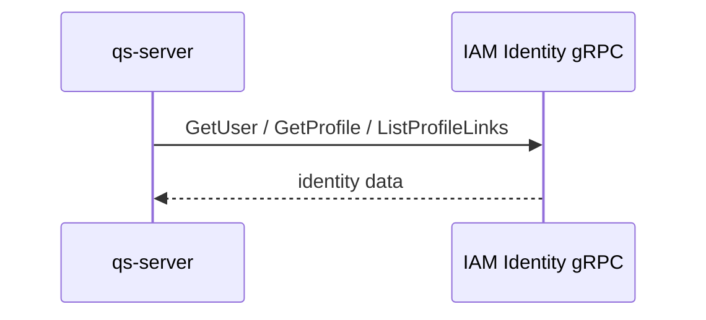
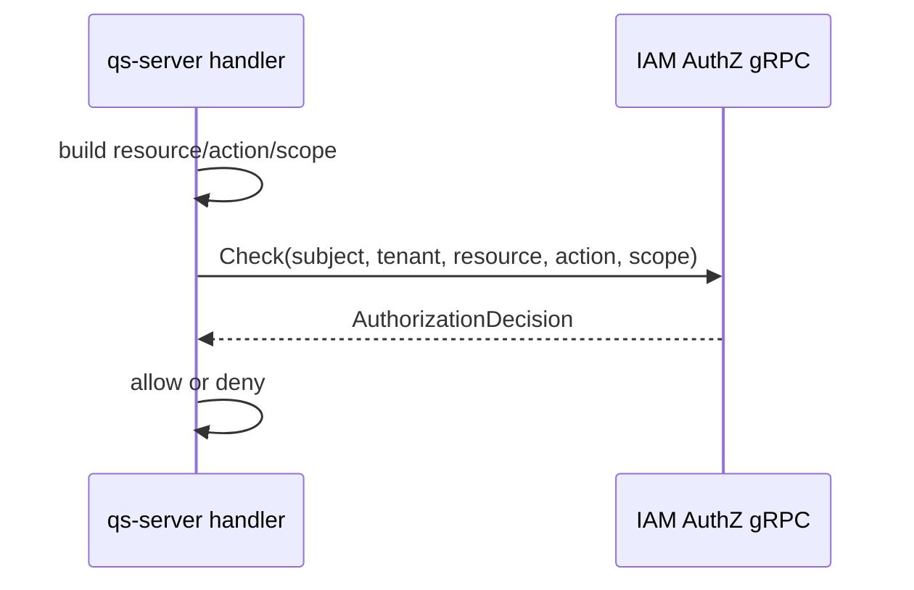

# 02-gRPC API 契约：服务间调用与内部集成

## 1. 本文定位

本文是 `05-接入与契约/` 文档组中关于 **gRPC API 接入契约** 的文档。

前面两篇已经说明：

```text
00-接入总览：业务系统如何接入 IAM；
01-REST API 契约：前端与管理端接入。
```

本文聚焦 gRPC。

gRPC API 的核心使用者是：

```text
业务后端服务，例如 qs-server；
内部 worker，例如 qs-worker；
采集服务，例如 collection-server；
内部 gateway；
服务间集成方；
Go SDK 底层 client。
```

本文回答：

```text
IAM gRPC API 面向哪些服务间调用场景？
gRPC 和 REST 如何分工？
gRPC 契约的事实源在哪里？
proto package、service、rpc、message 应如何组织？
metadata、deadline、retry、error code 如何约定？
AuthN / Identity / AuthZ / IDP 在 gRPC 层如何暴露？
qs-server 这类业务服务应该如何调用 IAM gRPC？
哪些 RPC 属于公开服务间契约，哪些属于内部管理契约？
```

本文不试图替代 `.proto` 文件。

gRPC 的机器契约事实源应以项目中的 proto、generated code、gRPC transport 实现和 gRPC 测试为准。

本文负责解释：

```text
gRPC API 的接入场景；
gRPC API 的分组方式；
gRPC metadata 与安全边界；
gRPC error / deadline / retry 语义；
gRPC 与 REST / SDK 的分工；
gRPC 契约如何防漂移。
```

---

## 2. 30 秒结论

gRPC 是 IAM 面向 **服务间调用与内部系统集成** 的主通道。

它适合：

```text
高频 Token Verify；
高频 AuthZ Check；
批量 Identity 查询；
worker / backend 调用 IAM；
Go SDK 底层封装；
内部服务之间的低延迟、强契约调用。
```

它不适合：

```text
浏览器直接调用；
小程序直接调用；
公开给不可信外部客户端；
绕过 IAM 应用层直接操作领域事实。
```

典型 gRPC 调用链路：

```text
qs-server / worker
  -> IAM gRPC client
  -> metadata: authorization / caller-service / tenant / trace
  -> IAM gRPC interceptor
  -> Application service
  -> Domain / Infra ports
  -> response / status code
```

核心原则：

```text
proto 是 gRPC 字段级契约事实源；
gRPC transport 只做协议适配；
业务语义必须与 REST / SDK 保持一致；
所有调用必须设置 deadline；
所有跨服务调用必须传递 request-id / trace-id；
认证失败用 Unauthenticated；
授权失败用 PermissionDenied；
参数错误用 InvalidArgument；
服务端不可用用 Unavailable。
```

---

## 3. gRPC API 的职责边界

### 3.1 gRPC 适合什么

gRPC 适合内部服务间调用。

典型场景：

```text
qs-server 调用 IAM VerifyToken；
qs-server 调用 IAM AuthZ Check；
qs-server 批量查询 User / Profile / ProfileLink；
qs-worker 使用 service identity 调用 IAM；
collection-server 调用 IAM 验证服务间请求；
Go SDK 封装 IAM gRPC client；
内部 gateway 调用 IAM 做认证与授权。
```

gRPC 的优势是：

```text
强类型 proto 契约；
生成客户端和服务端代码；
适合服务间调用；
支持 metadata；
支持 deadline；
支持 streaming，虽然 IAM 当前多数接口应优先 unary；
错误状态码语义统一。
```

---

### 3.2 gRPC 不适合什么

gRPC 不应该作为前端直接接入方式。

不推荐：

```text
Browser -> IAM gRPC；
Mini Program -> IAM gRPC；
Mobile App -> internal gRPC service；
不可信第三方直接调用内部 gRPC。
```

这些场景更适合 REST。

原因：

```text
浏览器原生 HTTP/JSON 接入更简单；
REST 更适合公开 API 网关；
gRPC metadata、mTLS、service token 更偏服务间调用；
内部 gRPC service 不应直接暴露到公网。
```

---

### 3.3 gRPC 与 Application 的关系

gRPC service 的职责是：

```text
接收 proto request；
读取 metadata；
做基础参数校验；
转换为 Application Command / Query；
调用 Application service；
将 Application result 转为 proto response；
将错误映射为 gRPC status code。
```

gRPC service 不应该：

```text
直接操作 repository；
直接调用 Casbin Enforce；
直接签发 Token；
直接拼接 p/g facts；
直接递增 PolicyVersion；
直接写 Outbox；
承载领域不变量。
```

正确方向：

```text
gRPC Service
  -> Application Command / Query
  -> Application Service
  -> Domain / Infra ports
```

---

## 4. gRPC 契约事实源

gRPC 契约必须以机器事实源为准。

常见事实源入口：

```text
api/grpc
internal/apiserver/transport/grpc
internal/apiserver/application
internal/apiserver/domain
gRPC integration tests
pkg/sdk
```

推荐事实优先级：

```text
proto files
  -> generated code
  -> gRPC transport implementation
  -> Application command/query
  -> tests
  -> docs/05 文档
```

如果本文与 proto / generated code / transport tests 冲突，应优先相信代码和机器契约，并同步修正文档。

gRPC 的基本模型是：

```text
在 proto 文件中定义 service；
在 service 中定义 rpc method；
rpc method 使用 protobuf message 作为 request / response；
通过 protoc 和插件生成客户端与服务端代码。
```

本文只保留：

```text
服务分组；
核心用途；
关键 request / response 语义；
metadata 约定；
error code 约定；
deadline / retry 约定；
事实源入口。
```

---

## 5. proto 组织建议

### 5.1 Package 与版本

gRPC proto 应有稳定 package 和版本。

推荐形态：

```proto
package iam.authn.v3;
package iam.identity.v3;
package iam.authz.v3;
package iam.idp.v3;
```

实际 package 以当前 `api/grpc` 为准。

版本规则建议：

```text
同一 package 内保持向后兼容；
breaking change 新开版本；
旧版本保留兼容期；
文档标明推荐版本和 deprecated 版本。
```

---

### 5.2 Service 命名

Service 名称应表达业务能力，而不是表名。

推荐风格：

```text
AuthService
TokenService
IdentityService
ProfileService
AuthorizationService
PolicyAdministrationService
IdpService
```

不推荐：

```text
UserTableService
CasbinRuleService
MysqlAuthzService
```

原因：

```text
gRPC 是应用契约，不是数据库表契约；
service 应表达业务能力，而不是 infra 实现。
```

---

### 5.3 RPC 命名

RPC 名称应使用动词短语。

示例：

```text
Login
RefreshToken
VerifyToken
GetUser
BatchGetUsers
ListProfileLinks
Check
GetAuthorizationSnapshot
GrantAssignment
RevokeAssignment
```

RPC 不应暴露内部技术动作：

```text
InsertCasbinRule
UpdatePolicyVersionRow
ReloadEnforcer
```

这些属于 IAM 内部实现。

---

### 5.4 Message 命名

Message 推荐使用：

```text
<MethodName>Request
<MethodName>Response
```

例如：

```proto
message VerifyTokenRequest {}
message VerifyTokenResponse {}
message CheckRequest {}
message CheckResponse {}
```

共享类型可以独立定义：

```proto
message Principal {}
message SubjectRef {}
message TenantRef {}
message AuthorizationDecision {}
message PageRequest {}
message PageResponse {}
```

---

## 6. 通用 metadata 契约

gRPC metadata 是与 RPC 调用关联的 key-value 侧信道，可用于传递认证凭证、trace 信息和自定义 header。

### 6.1 认证 metadata

服务间调用应携带认证信息。

常见形式：

```text
authorization: Bearer <service_token>
```

或使用 mTLS 作为传输层身份。

推荐组合：

```text
mTLS；
service token；
caller-service metadata；
trace metadata。
```

---

### 6.2 Caller metadata

推荐携带调用方服务名：

```text
x-caller-service: qs-server
x-caller-instance: qs-server-xxx
```

用途：

```text
审计；
限流；
问题排查；
服务间权限控制；
灰度策略。
```

---

### 6.3 Tenant metadata

如果 RPC 需要授权域上下文，可携带：

```text
x-tenant-id: tenant-a
```

也可以在 request message 中显式携带 `tenant_id`。

推荐原则：

```text
业务语义字段放 request message；
横切关注点放 metadata；
如果两边都有 tenant，必须校验一致性。
```

对于 AuthZ Check，`tenant_id` 应优先作为 request message 的业务字段。

---

### 6.4 Trace metadata

推荐携带：

```text
x-request-id: req_xxx
x-trace-id: trace_xxx
```

如果使用 OpenTelemetry，可以透传标准 trace context。

trace metadata 用于：

```text
跨 IAM / qs-server / worker 链路追踪；
日志关联；
错误排查；
审计关联。
```

---

### 6.5 metadata 注意事项

gRPC metadata key 通常是 ASCII 字符串，且 `grpc-` 前缀是 gRPC 自身保留前缀，不应被业务自定义使用。

不要在 metadata 中传递：

```text
password；
refresh token；
private key；
IDP AppSecret；
SMS OTP；
```

access token / service token 可以通过 `authorization` 传递，但必须注意日志脱敏。

---

## 7. Deadline / Timeout 契约

gRPC 调用必须设置 deadline。

不要让内部服务调用无限等待。

Deadline 表示：

```text
客户端愿意等待服务端响应的最晚时间点。
```

如果超过 deadline，客户端会收到 `DeadlineExceeded`。

推荐原则：

```text
所有 IAM gRPC client 必须设置默认 timeout；
业务 handler 可以根据接口重要性覆盖 timeout；
server 应尊重 context cancellation；
长耗时管理接口应避免占用普通高频调用线程；
Check / VerifyToken 应保持低延迟。
```

建议默认值按场景区分：

| 场景 | 建议 |
| --- | --- |
| VerifyToken | 短 deadline |
| AuthZ Check | 短 deadline |
| BatchGetUsers | 中等 deadline |
| 管理写入 | 中等 deadline |
| PolicyLinter | 较长 deadline |

具体数值以项目性能目标和部署环境为准。

---

## 8. Retry / Idempotency 契约

### 8.1 哪些调用可以重试

读操作通常更适合重试：

```text
VerifyToken；
GetUser；
BatchGetUsers；
Check；
GetAuthorizationSnapshot；
ListProfileLinks。
```

但也要注意：

```text
Check 结果可能受 PolicyVersion 变化影响；
VerifyToken 结果可能受 Session / revoke 状态影响；
重试应有短 timeout 和有限次数。
```

---

### 8.2 哪些调用要谨慎重试

写操作必须考虑幂等性：

```text
CreateUser；
CreateProfile；
GrantAssignment；
RevokeAssignment；
GrantPermission；
RevokePermission；
UpdateIdpApp。
```

如果要重试写操作，推荐使用：

```text
request_id；
idempotency_key；
业务唯一键；
幂等语义明确的 command。
```

否则可能造成重复写入或重复审计记录。

---

### 8.3 Retry 不应掩盖权限错误

以下错误不应盲目重试：

```text
InvalidArgument；
Unauthenticated；
PermissionDenied；
NotFound；
FailedPrecondition。
```

以下错误可以有限重试：

```text
Unavailable；
DeadlineExceeded；
ResourceExhausted。
```

是否重试以业务场景和 SDK 策略为准。

---

## 9. gRPC Status Code 语义

gRPC 每个 RPC 最终都会返回 status。status 包含 code 和描述，应用应使用 gRPC 定义的标准状态码。

推荐映射：

| Code | 场景 |
| --- | --- |
| `OK` | 成功 |
| `InvalidArgument` | 请求参数非法 |
| `Unauthenticated` | 未认证或 token 无效 |
| `PermissionDenied` | 已认证但无权限 |
| `NotFound` | 资源不存在 |
| `AlreadyExists` | 资源已存在 |
| `FailedPrecondition` | 当前状态不满足操作前置条件 |
| `Aborted` | 并发冲突或事务冲突 |
| `ResourceExhausted` | 限流或资源耗尽 |
| `DeadlineExceeded` | 调用超时 |
| `Unavailable` | 服务暂不可用 |
| `Internal` | 服务端内部错误 |
| `Unimplemented` | RPC 未实现或版本不支持 |

关键边界：

```text
Unauthenticated = 调用方身份无法确认；
PermissionDenied = 调用方身份已确认，但无权限；
InvalidArgument = 参数本身非法；
FailedPrecondition = 参数可能合法，但当前系统状态不允许；
Unavailable = 可以考虑有限重试；
Internal = 服务端 bug 或不可预期错误。
```

---

## 10. AuthN gRPC API

AuthN gRPC API 面向认证、Token、Principal。

主要服务于：

```text
业务服务验证用户 Token；
服务间认证；
Go SDK AuthN client；
内部 gateway 认证；
worker 校验 service token。
```

### 10.1 Login

Login RPC 负责：

```text
接收登录请求；
校验登录证明；
产出 Principal；
签发 AccessToken / RefreshToken；
返回登录结果。
```

典型 RPC 名称以 proto 为准，可能类似：

```text
AuthService.Login
AuthService.LoginV3
```

注意：

```text
前端登录通常走 REST；
gRPC Login 更适合内部服务、SDK 或受信任客户端。
```

---

### 10.2 RefreshToken

RefreshToken RPC 负责：

```text
使用 RefreshToken 换取新的 AccessToken；
处理 RefreshToken rotation；
维护 Session / Token 状态；
返回新的 Token 结果。
```

典型 RPC 名称以 proto 为准，可能类似：

```text
AuthService.RefreshToken
AuthService.RefreshV3
```

---

### 10.3 VerifyToken

VerifyToken 是业务服务最常用的 AuthN RPC。

它负责：

```text
校验 AccessToken 是否有效；
返回 Principal / claims / status；
根据策略检查 token version、session、账号状态、撤销状态。
```

典型 RPC 名称以 proto 为准，可能类似：

```text
AuthService.VerifyToken
AuthService.VerifyV3
```

qs-server 的常见用法：

```text
接收 Bearer Token；
调用 VerifyToken；
得到 Principal；
注入 context；
后续 handler 使用 Principal 构造 AuthZ Check。
```

---

### 10.4 Service Token

Service Token RPC 或能力用于服务间认证。

它回答：

```text
某个内部服务如何证明自己是谁？
```

典型能力可能包括：

```text
IssueServiceToken；
VerifyServiceToken；
ExchangeServiceCredential；
```

实际方法以当前 proto 为准。

内部 worker 不应通过管理员用户名密码登录 IAM。

---

## 11. Identity gRPC API

Identity gRPC API 面向 User、Profile、ProfileLink 查询和管理。

主要服务于：

```text
qs-server 查询当前用户；
qs-server 查询儿童 Profile；
qs-server 查询 User 与 Profile 的 ProfileLink；
worker 批量读取身份数据；
管理后台后端聚合身份数据。
```

### 11.1 User Query

典型能力：

```text
GetUser；
BatchGetUsers；
ListUsers；
```

使用场景：

```text
根据 Principal.UserID 获取 User；
批量渲染用户名称；
审计记录展示用户信息；
```

---

### 11.2 Profile Query

典型能力：

```text
GetProfile；
BatchGetProfiles；
ListProfiles；
```

使用场景：

```text
qs-server 根据 profile_id 查询儿童档案；
报告展示 Profile 基本信息；
业务对象关联 Profile。
```

---

### 11.3 ProfileLink Query

典型能力：

```text
ListProfileLinks；
GetProfileLink；
ListProfilesByUser；
ListUsersByProfile；
```

使用场景：

```text
判断当前用户和 Profile 的身份关系；
列出某个用户关联的儿童档案；
管理后台维护 user-profile 关系。
```

注意：

```text
ProfileLink 是身份关系，不是资源权限。
```

如果要做访问控制，应继续调用 AuthZ Check。

---

## 12. AuthZ gRPC API

AuthZ gRPC API 面向授权判定、授权快照和授权管理。

主要服务于：

```text
qs-server 高频 Check；
worker 权限判定；
SDK Authz client；
管理后台后端授权配置；
内部服务查询授权快照。
```

### 12.1 Check

Check RPC 是 AuthZ 最重要的服务间调用。

它回答：

```text
Subject 在 Tenant 下，能否对 Resource 执行 Action，并满足 ObjectScope？
```

典型 RPC：

```text
AuthorizationService.Check
```

典型 request 语义：

```text
subject = user:u_123
tenant_id = tenant-a
resource = qs:evaluation:report:*
action = read
scope = origin:p_123
```

典型 response 语义：

```text
allowed；
reason；
deny_code；
matched_role；
matched_permission；
policy_version；
```

Check 是权威判定。

业务系统不应在本地复制 IAM Permission 后自行判定。

---

### 12.2 BatchCheck

如果存在 BatchCheck，应明确语义。

BatchCheck 适合：

```text
同一请求中检查多个资源；
批量判断页面按钮；
减少网络往返。
```

但要注意：

```text
BatchCheck 不能绕过单条 Check 的领域规则；
每个 decision 应保留自己的 reason / deny_code；
response 应携带统一或逐条 policy_version，以 proto 为准。
```

如果当前没有 BatchCheck，不应在文档中承诺存在。

---

### 12.3 GetAuthorizationSnapshot

Snapshot RPC 负责读取授权视图。

典型 RPC：

```text
AuthorizationService.GetAuthorizationSnapshot
```

用途：

```text
管理后台展示；
SDK 缓存当前主体授权视图；
调试权限问题；
前端按钮展示的后端聚合。
```

注意：

```text
Snapshot 不是 Check 的替代品。
```

访问控制仍应调用 Check。

---

### 12.4 Grant / Revoke Assignment

对外契约可以使用 Assignment 术语。

内部领域模型仍是 RoleBinding。

典型 RPC：

```text
AuthorizationService.GrantAssignment
AuthorizationService.RevokeAssignment
```

语义：

```text
给 Subject 在 Tenant 下绑定 Role；
撤销 Subject 在 Tenant 下的 Role；
```

内部链路必须进入：

```text
PolicyAdministration
  -> AuthorizationPolicy
  -> PolicyChange
  -> PolicyChangeCommitter
```

---

### 12.5 Grant / Revoke Permission

如果 gRPC 暴露权限管理能力，语义应是：

```text
给 Role 授予 Resource / Action / Scope；
从 Role 撤销 Resource / Action / Scope；
```

内部必须通过 PolicyChangeCommitter。

不应暴露：

```text
InsertCasbinRule；
DeleteCasbinRule；
AddPolicy；
AddGroupingPolicy。
```

---

## 13. IDP gRPC API

IDP gRPC API 面向外部身份源配置和内部登录集成。

典型能力：

```text
GetIdpApp；
ListIdpApps；
CreateIdpApp；
UpdateIdpApp；
ResolveIdpConfig；
```

实际方法以当前 proto 为准。

注意：

```text
IDP AppSecret 不应在 response 中明文返回；
secret 更新必须审计；
IDP 配置不等于 LoginIdentity；
LoginIdentity 属于 AuthN 账号模型。
```

---

## 14. System / Runtime gRPC API

如果 IAM 暴露内部 runtime gRPC API，应明确它是内部接口。

可能能力：

```text
HealthCheck；
ReadinessCheck；
GetRuntimeHealth；
GetAuthzPolicyVersion；
```

注意：

```text
RuntimeReload 不应作为普通外部公开 RPC；
debug / admin RPC 应限制调用方；
metrics 更适合 Prometheus endpoint；
health check 应符合部署平台要求。
```

---

## 15. qs-server 调用 IAM gRPC 的推荐链路

### 15.1 VerifyToken 链路



qs-server 不应在每个 handler 中重复解析 token。

推荐放在 middleware / interceptor 中。

---

### 15.2 Identity 查询链路



用途：

```text
查询当前用户；
查询儿童 Profile；
确认 User 与 Profile 的身份关系；
渲染报告或测评记录中的身份信息。
```

---

### 15.3 AuthZ Check 链路



典型授权请求：

```text
subject = user:<iam_user_id>
tenant = tenant-a
resource = qs:evaluation:report:*
action = read
scope = origin:<profile_id>
```

---

## 16. gRPC 与 REST / SDK 的关系

gRPC、REST、SDK 是同一套 IAM 应用能力的三种投影。

```text
REST -> HTTP/JSON projection
gRPC -> proto service projection
SDK  -> Go client projection
```

gRPC 与 REST 应保持：

```text
业务语义一致；
错误语义可映射；
权限要求一致；
审计行为一致；
版本策略一致；
```

SDK 可以封装 gRPC。

但 SDK 不应改变 IAM 语义。

---

## 17. 安全边界

### 17.1 gRPC 不直接公网暴露

默认建议：

```text
gRPC 只在内网、service mesh 或受控网络中暴露；
公网接入走 REST API Gateway；
内部服务调用使用 mTLS / service token。
```

---

### 17.2 管理 RPC 必须授权

管理类 RPC 包括：

```text
CreateRole；
GrantPermission；
GrantAssignment；
UpdateIdpApp；
PolicyLinter；
```

这些 RPC 必须经过认证和授权。

不能因为是内部 gRPC 就默认可信。

---

### 17.3 Metadata 与日志脱敏

日志中不应记录：

```text
authorization metadata；
access token；
service token；
refresh token；
password；
AppSecret；
private key。
```

可以记录：

```text
method；
caller-service；
subject；
tenant；
request-id；
trace-id；
status code；
latency；
error code。
```

---

## 18. gRPC 契约维护规则

### 18.1 proto 不要随意 breaking

以下通常属于 breaking change：

```text
删除 service；
删除 rpc；
删除 message field；
修改 field number；
修改 field type；
修改 enum number；
改变 required 语义；
改变错误码语义；
改变认证或授权要求。
```

Proto 字段编号一旦发布，不应复用。

废弃字段应保留编号并标注 deprecated。

---

### 18.2 新增字段优先保持向后兼容

新增字段一般应：

```text
使用新的 field number；
保持 optional 语义；
服务端对缺省值有合理处理；
客户端忽略未知字段也能正常工作。
```

---

### 18.3 Deprecated RPC

如果 RPC 废弃，应在 proto 注释和文档中说明：

```text
deprecated；
replacement；
remove_after；
migration guide。
```

不要只在实现中保留旧 RPC，却不说明迁移路径。

---

## 19. 验证建议

修改 gRPC 契约后，建议运行：

```bash
make proto-gen
make api-validate
```

以及 gRPC transport 测试：

```bash
go test ./internal/apiserver/transport/grpc/...
```

如果变更影响 Application command / query，还应运行：

```bash
go test ./internal/apiserver/application/...
```

如果变更影响 SDK 封装，还应运行：

```bash
go test ./pkg/sdk/...
```

具体命令以项目 Makefile 和 CI 为准。

---

## 20. 后续文档入口

本文说明 gRPC API 契约。

继续阅读：

```text
03-SDK接入模型-Go服务端集成.md
04-业务系统接入链路-以qs-server为例.md
05-契约事实源与防漂移机制.md
```

也可以回看：

```text
00-接入总览-业务系统如何接入IAM.md
01-REST API契约-前端与管理端接入.md
```

其中：

```text
第 03 篇说明 Go SDK 如何封装 REST / gRPC；
第 04 篇说明 qs-server 如何组合 VerifyToken / Identity Query / AuthZ Check；
第 05 篇说明 OpenAPI / proto / SDK / docs 如何防漂移。
```

---

## 21. 本文总结

gRPC API 是 IAM 面向服务间调用和内部系统集成的强类型契约。

它承载：

```text
AuthN：Login、RefreshToken、VerifyToken、Service Token；
Identity：User、Profile、ProfileLink 查询；
AuthZ：Check、Snapshot、Assignment、Permission 管理；
IDP：外部身份源配置；
System：内部 health / runtime 状态。
```

gRPC API 的核心边界是：

```text
gRPC service 只做协议适配；
Application 承载用例编排；
Domain 承载模型和不变量；
Infra 承载数据库、Token、Casbin、Outbox 等技术实现；
proto 是 gRPC 字段级机器契约事实源。
```

如果只记住一句话：

> gRPC 是 IAM 面向 qs-server、worker 和内部服务的服务间调用契约；它通过 proto 定义强类型服务，通过 metadata 传递认证和追踪上下文，通过 deadline / status code / retry 策略保证分布式调用边界清晰。
