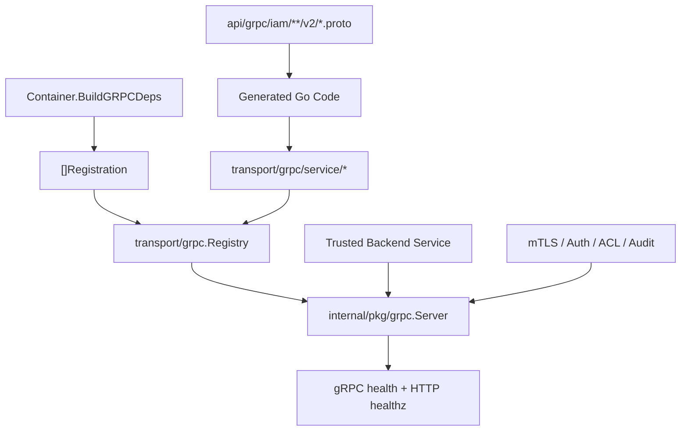
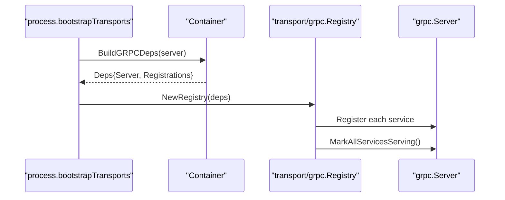

# gRPC API 契约

## 本文回答

本文回答：IAM 的 gRPC API 如何作为可信服务间调用契约使用；proto 文件、生成代码、transport 注册、服务实现和 SDK 编译测试之间是什么关系；AuthN、AuthZ、Identity、IDP 四组 gRPC service 分别适合什么接入场景；调用方如何传递 metadata、service token、mTLS 身份；gRPC health、reflection、ACL、audit 和 proto contract test 如何支撑服务间接入。

读完本文，你应该能回答：

- gRPC API 的机器契约事实源在哪里；
- gRPC 与 REST 的接入边界有什么不同；
- 当前发布了哪些 v2 proto；
- 哪些 service 会被 `iam-apiserver` 注册；
- AuthN gRPC 为什么没有 Login，而是偏 token / onboarding / JWKS；
- AuthZ gRPC Check 与 REST Check 的差异；
- Identity gRPC 为什么分成 Read、ProfileLinkQuery、ProfileLinkCommand、Lifecycle；
- IDP gRPC 暴露 `GetWechatApp` 时为什么要特别注意 secret；
- gRPC 服务如何从 container 生成 registrations 并注册到 server；
- gRPC 安全层包括哪些：mTLS、Bearer/HMAC/API key、ACL、audit；
- gRPC health 和 HTTP `/readyz`、`/livez`、`/healthz` 分别是什么；
- proto 演进时为什么只能追加字段，不能复用 field number；
- 如何验证 proto 与 transport 注册没有漂移。

---

## 30 秒结论

IAM gRPC API 面向 **可信服务间调用**，不是浏览器或普通前端入口。

它的事实源是：

```text
api/grpc/iam/**/v2/*.proto
```

当前 proto 布局：

```text
api/grpc/iam/
├── authn/v2/authn.proto
├── authz/v2/authz.proto
├── identity/v2/identity.proto
└── idp/v2/idp.proto
```

gRPC 运行时注册链路是：

```text
Container.BuildGRPCDeps(server)
  -> []Registration
  -> transport/grpc.Registry.RegisterServices()
  -> grpc.Server.MarkAllServicesServing()
```

当前服务矩阵：

| Proto | Service | 主要能力 |
| --- | --- | --- |
| `authn/v2/authn.proto` | `AuthService` | VerifyToken、RefreshToken、RevokeToken、RevokeRefreshToken、IssueServiceToken |
| `authn/v2/authn.proto` | `AccountOnboardingService` | CreateOperationAccount |
| `authn/v2/authn.proto` | `JWKSService` | GetJWKS |
| `authz/v2/authz.proto` | `AuthorizationService` | Check、GetAuthorizationSnapshot、GrantAssignment、RevokeAssignment |
| `identity/v2/identity.proto` | `IdentityRead` | GetUser、BatchGetUsers、SearchUsers、GetProfile、BatchGetProfiles |
| `identity/v2/identity.proto` | `ProfileLinkQuery` | HasProfileLink、ListProfiles、ListProfileLinks |
| `identity/v2/identity.proto` | `ProfileLinkCommand` | EstablishProfileLink、RevokeProfileLink、BatchRevokeProfileLinks、ImportProfileLinks |
| `identity/v2/identity.proto` | `IdentityLifecycle` | CreateUser、UpdateUser、DeactivateUser、BlockUser |
| `idp/v2/idp.proto` | `IDPService` | GetWechatApp |

最重要的接入边界：

```text
REST 面向 Web/Admin/通用 HTTP 接入
gRPC 面向后端服务间调用
SDK 封装 REST/gRPC 的常用调用模式
```

核心源码入口：

- [../../api/grpc/README.md](../../api/grpc/README.md)
- [../../api/grpc/iam/authn/v2/authn.proto](../../api/grpc/iam/authn/v2/authn.proto)
- [../../api/grpc/iam/authz/v2/authz.proto](../../api/grpc/iam/authz/v2/authz.proto)
- [../../api/grpc/iam/identity/v2/identity.proto](../../api/grpc/iam/identity/v2/identity.proto)
- [../../api/grpc/iam/idp/v2/idp.proto](../../api/grpc/iam/idp/v2/idp.proto)
- [../../internal/apiserver/container/grpc_registry.go](../../internal/apiserver/container/grpc_registry.go)
- [../../internal/apiserver/transport/grpc/registry.go](../../internal/apiserver/transport/grpc/registry.go)
- [../../internal/apiserver/transport/grpc/proto_contract_test.go](../../internal/apiserver/transport/grpc/proto_contract_test.go)

---

## 主图：gRPC 契约与运行时注册



---

## 重点速查

| 问题 | 当前答案 | 代码证据 |
| --- | --- | --- |
| gRPC API 契约在哪里 | `api/grpc/iam/*/v2/*.proto`。 | [../../api/grpc/README.md](../../api/grpc/README.md) |
| gRPC 面向谁 | 可信服务间调用。 | [../../api/grpc/README.md](../../api/grpc/README.md) |
| 当前 proto 有哪些模块 | AuthN、AuthZ、Identity、IDP。 | [../../api/grpc/README.md](../../api/grpc/README.md) |
| 服务由谁注册 | `iam-apiserver` 同一进程注册所有 gRPC services。 | [../../api/grpc/README.md](../../api/grpc/README.md) |
| container 如何暴露 gRPC 注册 | `BuildGRPCDeps(server)` 返回 `Registrations`。 | [../../internal/apiserver/container/grpc_registry.go](../../internal/apiserver/container/grpc_registry.go) |
| transport 如何注册 | `Registry.RegisterServices()` 遍历 registrations 并调用 Register。 | [../../internal/apiserver/transport/grpc/registry.go](../../internal/apiserver/transport/grpc/registry.go) |
| 服务注册完成后做什么 | `MarkAllServicesServing()` 标记整体和已注册服务为 SERVING。 | [../../internal/apiserver/transport/grpc/registry.go](../../internal/apiserver/transport/grpc/registry.go)、[../../internal/pkg/grpc/server.go](../../internal/pkg/grpc/server.go) |
| proto 与实现如何防漂移 | `proto_contract_test.go` 检查 proto service 是否有对应 `Register<Service>Server` 调用。 | [../../internal/apiserver/transport/grpc/proto_contract_test.go](../../internal/apiserver/transport/grpc/proto_contract_test.go) |
| gRPC 安全支持什么 | mTLS、Bearer/HMAC/API key、ACL、audit。 | [../../internal/pkg/options/grpc.go](../../internal/pkg/options/grpc.go)、[../../internal/pkg/grpc/server.go](../../internal/pkg/grpc/server.go) |
| gRPC health 有哪些入口 | 标准 gRPC health service；独立 HTTP `/healthz`、`/readyz`、`/livez`。 | [../../internal/pkg/grpc/server.go](../../internal/pkg/grpc/server.go) |

---

## 1. gRPC API 的定位

IAM gRPC API 的定位是：

> 面向可信后端服务、SDK、内部系统集成的服务间调用接口。

它不适合直接给浏览器使用，也不应该替代 REST 的通用 HTTP 接入。典型调用方是：

```text
qs-server
backend worker
policy sync worker
internal admin service
SDK server-side client
```

gRPC 的优势是：

- 强类型 proto contract；
- 服务间调用效率高；
- 更适合内部服务调用；
- 可配合 mTLS、service token、ACL 和 audit；
- 更适合批量读、授权快照、ProfileLink 查询等后端场景。

REST 的优势是：

- 更适合 Web/Admin/移动端；
- 更容易调试；
- OpenAPI 生态成熟；
- 适合前端直接使用。

因此接入选择可以这样理解：

| 场景 | 推荐 |
| --- | --- |
| Web/Admin 登录、Profile 管理 | REST |
| 服务端 token verify、AuthZ Check | gRPC 或 SDK |
| 服务端授权快照 | gRPC |
| 服务端 ProfileLink 查询 | gRPC |
| 内部创建运营账号 | gRPC |
| 浏览器直接调用 | REST，不建议 gRPC |

---

## 2. Proto 事实源与演进规则

gRPC 的机器契约事实源是：

```text
api/grpc/iam/**/v2/*.proto
```

当前发布 v2 proto：

```text
iam.authn.v2
iam.authz.v2
iam.identity.v2
iam.idp.v2
```

每个 proto 都声明：

```proto
option go_package = "...";
```

### 演进规则

proto 演进必须遵守：

```text
新增字段只能追加
禁止复用 field number
服务名、RPC 名、message 名变更必须同步更新 transport、生成代码、SDK、契约文档
```

原因很简单：

- field number 是二进制 wire contract；
- 复用 field number 会导致旧客户端和新服务端语义错乱；
- 删除字段时也不应复用原编号；
- proto service 增删必须同步注册实现，否则 proto 声明和运行时服务漂移。

当前 `api/grpc/README.md` 已明确要求 proto、transport 注册、生成代码、SDK compile test 和契约文档同步更新。

核心源码：

- [../../api/grpc/README.md](../../api/grpc/README.md)

---

## 3. 运行时注册链路

gRPC 服务不是 proto 写了就自动存在。

运行时链路是：

```text
Container.BuildGRPCDeps(server)
  -> container.grpcRegistrations()
  -> transport/grpc.Registry
  -> Registry.RegisterServices()
  -> server.MarkAllServicesServing()
```



### 3.1 Registrations 如何生成

container 根据已初始化模块生成 registrations：

| Module | Registration 描述 |
| --- | --- |
| AuthN | `AuthService, JWKSService` |
| User | `IdentityRead, ProfileLinkQuery, ProfileLinkCommand, IdentityLifecycle` |
| IDP | `IDPService` |
| AuthZ | `AuthorizationService` |

只有对应 module 存在，才生成 registration。  
这意味着 degraded startup 或模块初始化失败时，某些 gRPC service 可能不会被注册。

### 3.2 Registry 只负责注册

`transport/grpc.Registry` 不初始化业务模块，不创建 application service。  
它只消费：

```text
Registration{Module, Description, Register}
```

然后逐个调用：

```text
registration.Register(server.Server)
```

这保持了 transport 的边界：  
**container 负责模块能力投影，transport 负责协议注册。**

核心源码：

- [../../internal/apiserver/container/grpc_registry.go](../../internal/apiserver/container/grpc_registry.go)
- [../../internal/apiserver/transport/grpc/registry.go](../../internal/apiserver/transport/grpc/registry.go)

---

## 4. AuthN gRPC 契约

AuthN proto：

```text
api/grpc/iam/authn/v2/authn.proto
```

定义三个 service：

```text
AuthService
AccountOnboardingService
JWKSService
```

### 4.1 AuthService

RPC：

```text
VerifyToken
RefreshToken
RevokeToken
RevokeRefreshToken
IssueServiceToken
```

| RPC | 作用 |
| --- | --- |
| `VerifyToken` | 在线验证 IAM access token |
| `RefreshToken` | 用 refresh token 生成新的 token pair |
| `RevokeToken` | 撤销 access token，并影响关联 session |
| `RevokeRefreshToken` | 撤销 refresh token，并撤销 session |
| `IssueServiceToken` | 签发服务间 service token |

注意：

```text
AuthService 没有 Login RPC
```

用户登录仍主要走 REST：

```text
POST /api/v2/authn/login
```

gRPC AuthN 更偏服务端 token 生命周期和内部服务认证能力。

### 4.2 VerifyToken

`VerifyTokenRequest` 字段：

```text
access_token
force_remote
include_metadata
expected_issuer
expected_audience
```

当前实现实际使用：

```text
access_token
include_metadata
expected_issuer
expected_audience
```

`force_remote` 当前 proto 中存在，但当前 service 实现没有使用它。  
文档中不要把它写成已生效的强制远程能力。

### 4.3 IssueServiceToken

`IssueServiceToken` 用于服务间凭证，不属于用户 session 登录语义。  
调用方应提供：

```text
subject
audience
ttl
attributes
```

Service token 在 AuthN 在线 verify 中有独立边界，通常不走用户 session/user/account 检查。

### 4.4 AccountOnboardingService

当前 RPC：

```text
CreateOperationAccount
```

用于服务端创建运营账号。  
这不是普通前端 signup API，也不等同于微信小程序 signup REST。

### 4.5 JWKSService

当前 RPC：

```text
GetJWKS
```

返回：

```text
bytes jwks
etag
last_modified
```

这适合服务端通过 gRPC 获取 JWKS，而不是走 HTTP `/.well-known/jwks.json`。

### 4.6 条件注册

AuthN gRPC service 聚合时：

| Subservice | 注册条件 |
| --- | --- |
| `AuthService` | TokenService 存在 |
| `AccountOnboardingService` | AccountOnboarder 存在 |
| `JWKSService` | KeyPublishApp 存在 |

如果能力不存在，对应 service 不注册。

核心源码：

- [../../api/grpc/iam/authn/v2/authn.proto](../../api/grpc/iam/authn/v2/authn.proto)
- [../../internal/apiserver/transport/grpc/service/authn/service.go](../../internal/apiserver/transport/grpc/service/authn/service.go)
- [../../internal/apiserver/transport/grpc/service/authn/auth_token_service.go](../../internal/apiserver/transport/grpc/service/authn/auth_token_service.go)

---

## 5. AuthZ gRPC 契约

AuthZ proto：

```text
api/grpc/iam/authz/v2/authz.proto
```

定义：

```text
AuthorizationService
```

RPC：

```text
Check
GetAuthorizationSnapshot
GrantAssignment
RevokeAssignment
```

### 5.1 Check

`CheckRequest`：

```text
subject
domain
object
action
scope_type
scope_value
```

与 REST Check 的关键差异：

| 维度 | REST Check | gRPC Check |
| --- | --- | --- |
| subject | 可省略，默认当前 JWT user | 必填 |
| tenant/domain | 来自 JWT context | request.domain 必填 |
| subject 格式 | `subject_type + subject_id` | `<type>:<id>`，例如 `user:123` |
| 调用方 | Web/Admin/通用 HTTP | 后端服务 |
| 返回 | JSON `{allowed}` | proto `CheckResponse{allowed}` |

gRPC Check 会校验：

```text
subject/domain/object/action 必填
subject 必须是 <type>:<id>
scope 必须可 NormalizeScope
```

### 5.2 GetAuthorizationSnapshot

`GetAuthorizationSnapshot` 返回：

```text
roles
permissions
authz_version
```

它适合业务服务缓存某个 subject 在某个 tenant/app 下的授权快照。

它不是一次具体动作判定。  
具体动作是否 allowed，仍应使用 `Check` 或本地等价判定逻辑。

### 5.3 GrantAssignment / RevokeAssignment

这两个 RPC 是 assignment facade：

```text
subject
domain
role_name
granted_by
```

注意这里使用的是：

```text
role_name
```

而 REST assignment 通常使用 role_id。  
gRPC 这个接口更偏服务端按角色名直接授予/撤销。

### 5.4 术语边界

proto 使用：

```text
Assignment
```

内部应用服务使用：

```text
rolebinding
```

这与 REST 一致：

```text
assignment = wire term
rolebinding = internal domain/application term
```

核心源码：

- [../../api/grpc/iam/authz/v2/authz.proto](../../api/grpc/iam/authz/v2/authz.proto)
- [../../internal/apiserver/transport/grpc/service/authz/service.go](../../internal/apiserver/transport/grpc/service/authz/service.go)

---

## 6. Identity gRPC 契约

Identity proto：

```text
api/grpc/iam/identity/v2/identity.proto
```

定义四组 service：

```text
IdentityRead
ProfileLinkQuery
ProfileLinkCommand
IdentityLifecycle
```

### 6.1 IdentityRead

RPC：

```text
GetUser
BatchGetUsers
SearchUsers
GetProfile
BatchGetProfiles
```

用途：

- 后端服务查询用户；
- 批量查询用户；
- 查询 Profile；
- 批量查询 Profile。

### 6.2 ProfileLinkQuery

RPC：

```text
HasProfileLink
ListProfiles
ListProfileLinks
```

用途：

| RPC | 作用 |
| --- | --- |
| `HasProfileLink` | 判断 user/profile 是否有关联 |
| `ListProfiles` | 列出某 user 关联的 profiles |
| `ListProfileLinks` | 列出某 profile 的 linked users |

这适合业务服务判断某用户是否和某儿童档案有关联。

### 6.3 ProfileLinkCommand

RPC：

```text
EstablishProfileLink
RevokeProfileLink
BatchRevokeProfileLinks
ImportProfileLinks
```

这些是系统侧命令接口，不是 REST 当前用户视角。  
调用方需要由自身的服务认证、ACL 或业务权限保护。

### 6.4 IdentityLifecycle

RPC：

```text
CreateUser
UpdateUser
DeactivateUser
BlockUser
```

用于服务端创建和维护 User 生命周期。

### 6.5 REST 与 gRPC ProfileLink 边界

| 能力 | REST | gRPC |
| --- | --- | --- |
| ProfileLink 当前用户视角 | `/api/v2/identity/profile-links` 使用 `MyProfileLinks` | 不等同 |
| ProfileLink 系统侧命令 | REST 当前不主要暴露系统侧命令 | `ProfileLinkCommand` |
| ProfileLink 查询 | REST 当前用户视角 | `ProfileLinkQuery` 系统侧 query |
| 权限保护 | JWT + current user guard | gRPC security / ACL / 调用方业务控制 |

核心源码：

- [../../api/grpc/iam/identity/v2/identity.proto](../../api/grpc/iam/identity/v2/identity.proto)
- [../../internal/apiserver/container/grpc_registry.go](../../internal/apiserver/container/grpc_registry.go)
- [../../internal/apiserver/transport/grpc/service/identity/profile_link_query.go](../../internal/apiserver/transport/grpc/service/identity/profile_link_query.go)
- [../../internal/apiserver/transport/grpc/service/identity/profile_link_command.go](../../internal/apiserver/transport/grpc/service/identity/profile_link_command.go)

---

## 7. IDP gRPC 契约

IDP proto：

```text
api/grpc/iam/idp/v2/idp.proto
```

定义：

```text
IDPService
```

当前 RPC：

```text
GetWechatApp
```

请求：

```text
app_id
```

响应：

```text
WechatApp
```

字段包括：

```text
id
app_id
app_secret
name
type
status
```

### 7.1 重要安全边界：app_secret

当前 gRPC IDP 实现会：

1. 根据 app_id 查询 WechatApp；
2. 通过 SecretVault 解密 AppSecret；
3. 把解密后的 `app_secret` 放入 proto response。

这意味着 `IDPService.GetWechatApp` 是高敏感服务间接口。  
它不应暴露给不可信调用方，必须依赖 gRPC mTLS、应用层认证、ACL 和审计控制访问。

### 7.2 IDP gRPC 与 REST IDP 的区别

REST IDP 主要是管理微信应用配置、secret 轮换、微信 access_token。  
gRPC IDP 当前更偏内部服务读取 WechatApp 配置。因为会返回 app_secret，所以调用边界更敏感。

核心源码：

- [../../api/grpc/iam/idp/v2/idp.proto](../../api/grpc/iam/idp/v2/idp.proto)
- [../../internal/apiserver/transport/grpc/service/idp/service.go](../../internal/apiserver/transport/grpc/service/idp/service.go)
- [../../internal/apiserver/transport/grpc/service/idp/service_impl.go](../../internal/apiserver/transport/grpc/service/idp/service_impl.go)

---

## 8. gRPC 安全模型

gRPC 安全在 process 层通过 `grpc` 配置装配，server 层通过 interceptors 实现。

当前配置支持：

```text
mTLS
应用层认证
ACL
Audit
Insecure
```

### 8.1 mTLS

配置字段包括：

```text
grpc.mtls.enabled
grpc.mtls.ca-file
grpc.mtls.ca-dir
grpc.mtls.cert-file
grpc.mtls.key-file
grpc.mtls.require-client-cert
grpc.mtls.allowed-cns
grpc.mtls.allowed-ous
grpc.mtls.allowed-sans
grpc.mtls.min-tls-version
grpc.mtls.enable-auto-reload
grpc.mtls.reload-interval
```

启用 mTLS 时：

```text
grpcConfig.Insecure = false
```

server 会安装 mTLS credentials，并在启用 auto reload 时启动证书自动重载。

### 8.2 应用层认证

应用层认证支持：

```text
Bearer
HMAC
API Key
RequireIdentityMatch
```

配置字段：

```text
grpc.auth.enabled
grpc.auth.enable-bearer
grpc.auth.enable-hmac
grpc.auth.enable-api-key
grpc.auth.hmac-timestamp-validity
grpc.auth.require-identity-match
```

调用方通常在 metadata 中传：

```text
authorization: Bearer <service-token>
x-request-id: <request-id>
```

### 8.3 ACL

ACL 配置：

```text
grpc.acl.enabled
grpc.acl.config-file
grpc.acl.default-policy
```

如果启用 ACL，server 会加载 ACL 文件并安装 ACL interceptor。  
这用于把服务身份和可调用 gRPC method 绑定起来。

### 8.4 Audit

`grpc.audit.enabled` 控制 audit interceptor。  
默认 options 中 audit 是 enabled。

### 8.5 Interceptor 顺序

Unary interceptor 大致顺序：

```text
Recovery
RequestID
Logging
mTLS identity
Credential auth
ACL
Audit
```

这个顺序体现了：

```text
先恢复和打日志
再提取身份
再验证凭证
再做 ACL
最后审计
```

核心源码：

- [../../internal/pkg/options/grpc.go](../../internal/pkg/options/grpc.go)
- [../../internal/apiserver/process/grpc_server.go](../../internal/apiserver/process/grpc_server.go)
- [../../internal/pkg/grpc/server.go](../../internal/pkg/grpc/server.go)

---

## 9. gRPC Health、Ready 与 Reflection

gRPC server 支持：

```text
标准 grpc.health.v1.Health
独立 HTTP healthz server
reflection
```

### 9.1 gRPC Health

如果启用 health check，server 会注册：

```text
grpc.health.v1.Health
```

服务注册完成后，Registry 调用：

```text
MarkAllServicesServing()
```

它会把：

```text
整体服务 ""
每个已注册业务 service
```

都标记为 `SERVING`。

关闭时，server 会把整体和每个业务 service 标记为 `NOT_SERVING`。

### 9.2 独立 HTTP healthz server

gRPC server 可以在 `grpc.healthz-port` 上启动独立 HTTP healthz server：

| 路由 | 语义 |
| --- | --- |
| `/healthz` | 整体 gRPC health 是 SERVING 才返回 OK |
| `/readyz` | 整体 gRPC health 是 SERVING 才返回 READY |
| `/livez` | 只表示 healthz server 存活 |

注意：

```text
/livez 不代表业务 service ready
/readyz 更适合作为 readiness probe
```

### 9.3 Reflection

如果配置开启 reflection，server 会注册 gRPC reflection。  
这适合本地调试和服务发现，但生产是否开启应结合安全策略决定。

核心源码：

- [../../internal/pkg/grpc/server.go](../../internal/pkg/grpc/server.go)
- [../../internal/apiserver/transport/grpc/registry.go](../../internal/apiserver/transport/grpc/registry.go)

---

## 10. gRPC 错误语义

gRPC 使用标准 status code。

常见映射：

| Code | 场景 |
| --- | --- |
| `InvalidArgument` | 必填字段缺失、subject 格式错误、scope 非法 |
| `Unavailable` | 对应 application service 未配置，例如 checker nil |
| `Unimplemented` | AuthN token service 未配置但调用 AuthService method |
| `NotFound` | 资源不存在，例如 IDP WechatApp not found |
| `Internal` | application/infra 内部错误 |
| `PermissionDenied` | 未来可用于 ACL 或业务权限拒绝，当前更多由 interceptor/应用层决定 |

### AuthZ 示例

`AuthorizationService.Check` 中：

- checker nil -> `Unavailable`
- subject/domain/object/action 缺失 -> `InvalidArgument`
- subject 不是 `<type>:<id>` -> `InvalidArgument`
- checker 内部错误 -> `Internal`

### IDP 示例

`IDPService.GetWechatApp` 中：

- app_id 缺失 -> `InvalidArgument`
- app 不存在 -> `NotFound`
- secret 解密失败 -> `Internal`

核心源码：

- [../../internal/apiserver/transport/grpc/service/authz/service.go](../../internal/apiserver/transport/grpc/service/authz/service.go)
- [../../internal/apiserver/transport/grpc/service/idp/service_impl.go](../../internal/apiserver/transport/grpc/service/idp/service_impl.go)
- [../../internal/apiserver/transport/grpc/service/authn/auth_token_service.go](../../internal/apiserver/transport/grpc/service/authn/auth_token_service.go)

---

## 11. gRPC 与 REST 的选择

| 能力 | REST | gRPC |
| --- | --- | --- |
| 用户登录 | 是，主入口 `/authn/login` | 当前没有 Login RPC |
| Token verify | 是 | 是 |
| Refresh token | 是 | 是 |
| JWKS | HTTP well-known / admin | `JWKSService.GetJWKS` |
| AuthZ Check | 是，tenant 来自 JWT context | 是，domain 显式传入 |
| AuthZ Snapshot | REST 当前不是主入口 | 是，`GetAuthorizationSnapshot` |
| Assignment 管理 | REST role_id based | gRPC role_name based facade |
| Identity current user | REST 更适合前端 | gRPC 更适合服务端查询 |
| ProfileLink 当前用户视角 | REST | 不等同 |
| ProfileLink 系统侧命令 | REST 不作为主入口 | gRPC |
| IDP secret 读取 | REST 不直接暴露明文 secret | gRPC `GetWechatApp` 当前会返回 app_secret |

推荐原则：

```text
前端 / Admin UI / Mobile
  -> REST

后端服务间认证、授权、用户/档案查询
  -> gRPC 或 SDK

需要浏览器直接调用
  -> REST

涉及 app_secret 的 IDP 内部读取
  -> 仅限受信任 gRPC 调用方
```

---

## 12. Go 调用示例

### 12.1 Metadata

```go
ctx = metadata.AppendToOutgoingContext(
    ctx,
    "authorization", "Bearer "+serviceToken,
    "x-request-id", requestID,
)
```

### 12.2 AuthZ Check

```go
authzClient := authzv2.NewAuthorizationServiceClient(conn)

resp, err := authzClient.Check(ctx, &authzv2.CheckRequest{
    Subject:    "user:1024",
    Domain:     "tenant-a",
    Object:     "scale:form:template:*",
    Action:     "read",
    ScopeType:  "origin",
    ScopeValue: "school-a",
})
if err != nil {
    return err
}
if !resp.Allowed {
    return errors.New("permission denied")
}
```

### 12.3 AuthZ Snapshot

```go
snapshot, err := authzClient.GetAuthorizationSnapshot(ctx, &authzv2.GetAuthorizationSnapshotRequest{
    Subject: "user:1024",
    Domain:  "tenant-a",
    AppName: "qs",
})
```

### 12.4 ProfileLink Query

```go
identityClient := identityv2.NewProfileLinkQueryClient(conn)

linked, err := identityClient.HasProfileLink(ctx, &identityv2.HasProfileLinkRequest{
    UserId:    "1024",
    ProfileId: "2048",
})
```

### 12.5 AuthN Verify

```go
authClient := authnv2.NewAuthServiceClient(conn)

verify, err := authClient.VerifyToken(ctx, &authnv2.VerifyTokenRequest{
    AccessToken:      accessToken,
    IncludeMetadata:  true,
    ExpectedIssuer:   "iam",
    ExpectedAudience: []string{"qs-server"},
})
```

---

## 13. Proto 与注册防漂移

当前 gRPC 契约防漂移主要靠：

```text
internal/apiserver/transport/grpc/proto_contract_test.go
```

它会：

1. 遍历 `api/grpc/iam/**/*.proto`；
2. 用正则找每个 `service <Name>`；
3. 扫描 `internal/apiserver/transport/grpc/service` 下 Go 源码；
4. 确认存在对应：

```text
Register<Name>Server
```

例如 proto 声明：

```proto
service AuthorizationService
```

实现必须调用：

```go
RegisterAuthorizationServiceServer
```

如果 proto 新增 service 但没有 transport registration，测试会失败。

### 13.1 这能保证什么

它能保证：

```text
proto 中声明的 service 至少有对应注册调用
```

### 13.2 它不能保证什么

它不能完全保证：

- 每个 RPC 语义都正确实现；
- 每个字段都被使用；
- 业务错误映射完全正确；
- ACL 配置允许调用；
- 模块初始化一定成功。

所以它是 service registration 层面的防漂移，不是业务全覆盖测试。

核心源码：

- [../../internal/apiserver/transport/grpc/proto_contract_test.go](../../internal/apiserver/transport/grpc/proto_contract_test.go)

---

## 14. 契约演进检查清单

新增或修改 gRPC 契约时，至少检查：

```text
1. 修改 api/grpc/iam/<module>/v2/*.proto
2. 只追加 field number，不复用旧编号
3. 重新生成 proto Go 代码
4. 更新 transport/grpc/service 实现
5. 确认 container/grpc_registry.go 注入了所需 capabilities
6. 确认 proto_contract_test 通过
7. 确认 SDK compile test 通过
8. 更新 api/grpc/README.md
9. 更新 docs/05-接入与契约/02-gRPC API契约.md
```

建议命令：

```bash
make proto-gen
go test ./internal/apiserver/transport/grpc
go test ./pkg/sdk
make docs-hygiene
```

---

## 15. 常见误区

### 误区一：proto 写了服务，运行时就一定注册

不一定。  
proto 只是机器契约，运行时还需要 transport service 实现和 registration。模块缺失时 registration 也可能不生成。

### 误区二：gRPC AuthService 可以登录

当前不可以。  
AuthService 负责 verify、refresh、revoke、issue service token，没有 Login RPC。用户登录主入口是 REST `/api/v2/authn/login`。

### 误区三：gRPC Check 和 REST Check 完全一样

不一样。  
gRPC Check 的 subject/domain 显式来自请求；REST Check 的 subject 可默认当前 JWT user，tenant 来自 JWT context。

### 误区四：ProfileLinkCommand 是当前用户视角

不对。  
gRPC ProfileLinkCommand 是系统侧命令；REST `/identity/profile-links` 才是当前用户视角。

### 误区五：IDPService.GetWechatApp 可以随便调用

不能。  
当前实现会解密并返回 app_secret。必须用 mTLS、auth、ACL、audit 控制调用边界。

### 误区六：gRPC insecure=true 也适合生产

不适合。  
生产应优先使用 mTLS，并结合应用层认证、ACL、audit 和网络边界。

### 误区七：proto_contract_test 能保证所有业务语义

不能。  
它只保证 proto service 有注册实现，不保证 RPC 内部逻辑完全正确。

---

## 16. 当前边界与待讨论点

### 16.1 `VerifyTokenRequest.force_remote` 当前未被使用

proto 中有 `force_remote` 字段，但当前 AuthN gRPC service 实现没有使用它。  
文档不能把它描述成已生效能力。

### 16.2 IDP proto 暴露 app_secret

这是高风险契约。  
后续如果希望收紧，可以考虑：

```text
不返回 app_secret
只返回密文/版本/fingerprint
或拆分内部-only service
或要求更严格 ACL
```

### 16.3 gRPC assignment 使用 role_name

AuthZ gRPC `GrantAssignment/RevokeAssignment` 使用 `role_name`，而 REST assignment 常用 `role_id`。  
这说明两者是不同接入形态，不要机械互转。

### 16.4 gRPC 当前没有 Suggest service

Suggest 目前是 REST 能力：

```text
GET /api/v2/suggest/profile
```

当前 proto 布局没有 suggest service。服务端若需要 suggest，需要走 REST 或后续新增 proto。

### 16.5 gRPC service 是否注册取决于模块能力

AuthN 子服务会根据 TokenService、AccountOnboarder、KeyPublishApp 是否存在而条件注册。  
container 也只为存在的 module 生成 registration。

---

## 17. 推荐源码阅读路线

### 第一轮：proto 契约

```text
api/grpc/README.md
api/grpc/iam/authn/v2/authn.proto
api/grpc/iam/authz/v2/authz.proto
api/grpc/iam/identity/v2/identity.proto
api/grpc/iam/idp/v2/idp.proto
```

目标：搞清 gRPC service、message、RPC。

### 第二轮：运行时注册

```text
internal/apiserver/container/grpc_registry.go
internal/apiserver/transport/grpc/registry.go
```

目标：搞清 container 如何生成 registrations，transport 如何注册 services。

### 第三轮：gRPC server 安全与健康

```text
internal/pkg/options/grpc.go
internal/apiserver/process/grpc_server.go
internal/pkg/grpc/server.go
```

目标：搞清 mTLS、Auth、ACL、Audit、health、ready/livez。

### 第四轮：服务实现

```text
internal/apiserver/transport/grpc/service/authn
internal/apiserver/transport/grpc/service/authz
internal/apiserver/transport/grpc/service/identity
internal/apiserver/transport/grpc/service/idp
```

目标：搞清 proto request 如何映射到 application service。

### 第五轮：防漂移测试

```text
internal/apiserver/transport/grpc/proto_contract_test.go
pkg/sdk
```

目标：搞清 proto service 注册和 SDK compile 如何验证契约。

---

## 18. 验证建议

```bash
make proto-gen
go test ./internal/apiserver/transport/grpc
go test ./internal/apiserver/container
go test ./internal/pkg/architecture
go test ./pkg/sdk
make docs-hygiene
```

建议重点测试方向：

| 测试方向 | 目的 |
| --- | --- |
| proto service registration | 每个 proto service 都有 Register<Service>Server 调用 |
| AuthN VerifyToken | access_token 必填、include_metadata 生效、issuer/audience 传递 |
| AuthN Refresh/Revoke | refresh/access revoke 调用 application token service |
| AuthN IssueServiceToken | subject 必填、ttl 非负 |
| AuthZ Check | subject/domain/object/action 必填，subject 格式正确 |
| AuthZ Snapshot | subject/domain/app_name 必填 |
| AuthZ Grant/RevokeAssignment | role_name 与 subject/domain 校验 |
| Identity ProfileLinkQuery | user_id/profile_id 必填 |
| Identity ProfileLinkCommand | selector 解析、batch failures |
| IDP GetWechatApp | app_id 必填、not found、secret decrypt error |
| gRPC health | services registered 后 SERVING，shutdown 后 NOT_SERVING |
| Security config | mTLS/Auth/ACL/Audit interceptors 按配置启用 |

---

## 本文总结

gRPC API 契约可以压缩成一句话：

> `api/grpc/iam/**/v2/*.proto` 是 IAM 服务间调用的机器契约，container 将已初始化模块投影成 gRPC registrations，transport registry 负责注册服务，gRPC server 通过 mTLS/Auth/ACL/Audit/Health 支撑可信内部调用。

接入主线是：

```text
proto contract
  -> generated client
  -> metadata credentials
  -> gRPC service
  -> application use case
```

最关键的边界是：

```text
gRPC 面向可信服务间调用
AuthN gRPC 不提供用户登录
AuthZ gRPC 显式传 subject/domain
Identity gRPC 区分 query/command/lifecycle
IDP gRPC 当前会暴露 app_secret，必须严格保护
```

下一篇《03-SDK接入模型.md》会继续说明：

```text
SDK 如何封装 REST/gRPC
调用方如何选择 Verify、JWKS、AuthZ Check、Identity ProfileLink
如何把 IAM 接入业务服务而不是直接散落 HTTP/gRPC 调用
```
