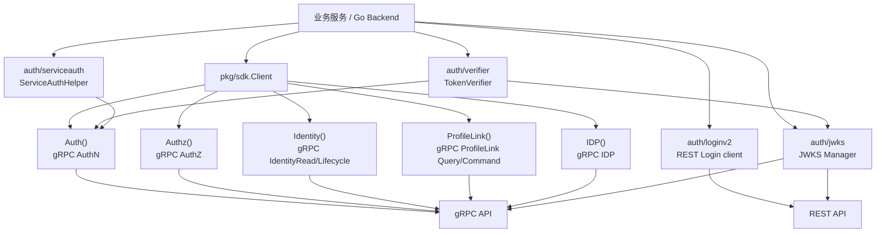
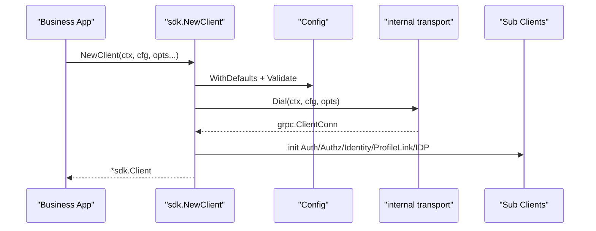

# SDK 接入模型

## 本文回答

本文回答：IAM SDK 在 REST/gRPC 契约之上解决什么接入问题；业务服务应该如何通过 SDK 接入认证、授权、Identity/ProfileLink、IDP；`sdk.Client`、`auth/loginv2`、`auth/jwks`、`auth/verifier`、`auth/serviceauth`、`authz`、`identity`、`idp` 这些公开入口分别适合什么场景；SDK 如何隐藏连接、TLS、metadata、错误包装、JWKS、本地验证和服务间 token 管理等底层细节。

读完本文，你应该能回答：

- SDK 是 IAM 的第三种契约，还是 REST/gRPC 的封装；
- `sdk.Client` 负责什么，不负责什么；
- 为什么用户登录不在 `sdk.Client.Auth()` 里，而在 `pkg/sdk/auth/loginv2`；
- 业务服务如何选择在线 Verify、本地 JWT 验证、JWKS、AuthZ Check；
- `ServiceAuthHelper` 适合什么场景；
- `Authz().Check / Allow / AllowScoped` 如何组织 subject/domain/object/action/scope；
- `Identity()` 和 `ProfileLink()` 分别代表什么；
- IDP SDK 为什么是高信任内部能力；
- SDK 稳定公开包有哪些；
- 哪些历史包已经收回内部实现；
- SDK 接入时应如何处理配置、TLS/mTLS、metadata、错误和可观测性；
- SDK 文档、示例、proto、REST OpenAPI、源码之间谁是事实源。

---

## 30 秒结论

SDK 不是新的业务契约。  
SDK 是对 REST/gRPC 契约的 Go 语言接入封装。

```text
REST API
  -> 用户登录 / Web 接入 / 管理后台 / OpenAPI

gRPC API
  -> 服务间调用 / 强类型 RPC / AuthZ snapshot / Identity query

SDK
  -> Go 服务端接入入口
  -> 封装 gRPC client、REST LoginV2、JWKS、本地验证、服务间 token、错误处理、配置加载
```

当前 SDK 公开稳定入口固定为：

```text
pkg/sdk
pkg/sdk/config
pkg/sdk/auth/client
pkg/sdk/auth/loginv2
pkg/sdk/auth/jwks
pkg/sdk/auth/verifier
pkg/sdk/auth/serviceauth
pkg/sdk/authz
pkg/sdk/identity
pkg/sdk/idp
pkg/sdk/errors
```

`pkg/sdk/transport`、`pkg/sdk/observability` 和高级错误分析能力已经收回内部实现，不再作为公开稳定包。

最常见的服务端接入模型是：

```text
业务服务启动
  -> sdk.NewClient(ctx, cfg)
  -> client.Auth().VerifyToken(...)
  -> client.Authz().AllowScoped(...)
  -> client.Identity().GetUser(...)
  -> client.ProfileLink().HasProfileLink(...)
```

用户登录如果需要通过 SDK 调用，则使用 REST AuthN v2 login client：

```text
pkg/sdk/auth/loginv2
  -> POST /api/v2/authn/login
```

而不是 `sdk.Client.Auth()`。  
`client.Auth()` 是 gRPC AuthN token/JWKS/onboarding client，不包含用户 Login RPC。

核心源码入口：

- [../../pkg/sdk/README.md](../../pkg/sdk/README.md)
- [../../pkg/sdk/docs/README.md](../../pkg/sdk/docs/README.md)
- [../../pkg/sdk/client.go](../../pkg/sdk/client.go)
- [../../pkg/sdk/aliases.go](../../pkg/sdk/aliases.go)
- [../../pkg/sdk/config/config.go](../../pkg/sdk/config/config.go)
- [../../pkg/sdk/public_api_compile_test.go](../../pkg/sdk/public_api_compile_test.go)
- [../../pkg/sdk/auth/loginv2/client.go](../../pkg/sdk/auth/loginv2/client.go)
- [../../pkg/sdk/auth/client/client.go](../../pkg/sdk/auth/client/client.go)
- [../../pkg/sdk/authz/check.go](../../pkg/sdk/authz/check.go)
- [../../pkg/sdk/identity/read.go](../../pkg/sdk/identity/read.go)
- [../../pkg/sdk/identity/profile_link_query.go](../../pkg/sdk/identity/profile_link_query.go)

---

## 主图：SDK 接入分层



---

## 重点速查

| 问题 | 当前答案 | 代码证据 |
| --- | --- | --- |
| SDK 总入口是什么 | `sdk.NewClient(ctx, cfg)`。 | [../../pkg/sdk/client.go](../../pkg/sdk/client.go) |
| `sdk.Client` 包含哪些子客户端 | Auth、Authz、Identity、ProfileLink、IDP。 | [../../pkg/sdk/client.go](../../pkg/sdk/client.go) |
| SDK 配置根是什么 | `pkg/sdk/config.Config`，别名暴露为 `sdk.Config`。 | [../../pkg/sdk/config/config.go](../../pkg/sdk/config/config.go)、[../../pkg/sdk/aliases.go](../../pkg/sdk/aliases.go) |
| 默认配置有哪些 | timeout、dial timeout、TLS、retry、keepalive、round_robin 等。 | [../../pkg/sdk/config/defaults.go](../../pkg/sdk/config/defaults.go) |
| REST 登录 SDK 入口是什么 | `pkg/sdk/auth/loginv2.NewClient`。 | [../../pkg/sdk/auth/loginv2/client.go](../../pkg/sdk/auth/loginv2/client.go) |
| REST v2 登录支持哪些 method | password、phone_otp、wechat、wecom。 | [../../pkg/sdk/auth/loginv2/types.go](../../pkg/sdk/auth/loginv2/types.go) |
| gRPC AuthN SDK 能力 | VerifyToken、RefreshToken、RevokeToken、RevokeRefreshToken、IssueServiceToken、GetJWKS、CreateOperationAccount。 | [../../pkg/sdk/auth/client/client.go](../../pkg/sdk/auth/client/client.go) |
| AuthZ SDK 便捷方法 | `Check`、`Allow`、`AllowScoped`、`GetAuthorizationSnapshot`。 | [../../pkg/sdk/authz/check.go](../../pkg/sdk/authz/check.go) |
| Identity SDK 读能力 | GetUser、BatchGetUsers、SearchUsers、GetProfile、BatchGetProfiles。 | [../../pkg/sdk/identity/read.go](../../pkg/sdk/identity/read.go) |
| ProfileLink SDK 能力 | HasProfileLink、ListProfiles、GetUserProfiles、ListProfileLinks、Establish/Revoke/Batch/Import。 | [../../pkg/sdk/identity/profile_link_query.go](../../pkg/sdk/identity/profile_link_query.go)、[../../pkg/sdk/identity/profile_link_command.go](../../pkg/sdk/identity/profile_link_command.go) |
| IDP SDK 能力 | GetWechatApp。 | [../../pkg/sdk/idp/read.go](../../pkg/sdk/idp/read.go) |
| JWKS Manager 默认链路 | Cache -> CircuitBreaker -> HTTP -> gRPC -> Seed。 | [../../pkg/sdk/auth/jwks/builder.go](../../pkg/sdk/auth/jwks/builder.go) |
| TokenVerifier 入口 | `auth/verifier.NewTokenVerifier`。 | [../../pkg/sdk/auth/verifier/constructor.go](../../pkg/sdk/auth/verifier/constructor.go) |
| ServiceAuthHelper 入口 | `auth/serviceauth.NewServiceAuthHelper`，启动时会先获取 token 并开启 refresh loop。 | [../../pkg/sdk/auth/serviceauth/constructor.go](../../pkg/sdk/auth/serviceauth/constructor.go) |
| 稳定公开 API 如何防回退 | `public_api_compile_test.go` 固定公开包和关键符号。 | [../../pkg/sdk/public_api_compile_test.go](../../pkg/sdk/public_api_compile_test.go) |

---

## 1. SDK 的定位

SDK 的定位是：

> 让 Go 后端服务接入 IAM 时，不必到处手写 gRPC 连接、metadata、JWKS 拉取、token verify、AuthZ Check、错误包装和服务间 token 刷新逻辑。

SDK 不是新的业务模型。  
SDK 的事实源仍然来自：

```text
api/rest/*.yaml
api/grpc/iam/**/*.proto
pkg/sdk/*.go
pkg/sdk/docs/*
pkg/sdk/_examples/*
```

其中：

| 事实源 | 作用 |
| --- | --- |
| REST OpenAPI | 登录、HTTP API 字段、Web/Admin 接入 |
| gRPC proto | 服务间 RPC 契约 |
| SDK 源码 | Go client 公开 API 与实现 |
| SDK docs | SDK 使用说明 |
| SDK examples | 完整可运行示例 |

SDK 文档不应该重新定义 AuthN/AuthZ/Identity 业务语义。  
它应该解释：

```text
业务服务应该如何使用这些契约
哪些场景用哪个入口
错误、配置、安全、重试如何处理
```

---

## 2. SDK 公开稳定面

当前公开稳定入口固定为：

```text
pkg/sdk
pkg/sdk/config
pkg/sdk/auth/client
pkg/sdk/auth/loginv2
pkg/sdk/auth/jwks
pkg/sdk/auth/verifier
pkg/sdk/auth/serviceauth
pkg/sdk/authz
pkg/sdk/identity
pkg/sdk/idp
pkg/sdk/errors
```

### 2.1 统一入口

```text
pkg/sdk
```

提供：

```text
sdk.NewClient
sdk.Config
sdk.ConfigFromEnv
sdk.ConfigFromViper
sdk.WithMetricsCollector
sdk.WithTracingHook
sdk.WithRequestID
sdk.WithTraceID
```

### 2.2 认证子包

| 包 | 作用 |
| --- | --- |
| `auth/client` | gRPC AuthN token/JWKS/onboarding client |
| `auth/loginv2` | REST AuthN v2 显式登录 client |
| `auth/jwks` | JWKS Manager |
| `auth/verifier` | TokenVerifier |
| `auth/serviceauth` | ServiceAuthHelper |

### 2.3 业务子包

| 包 | 作用 |
| --- | --- |
| `authz` | AuthZ Check / Allow / Snapshot |
| `identity` | User/Profile/ProfileLink gRPC client |
| `idp` | IDP gRPC client |
| `errors` | 统一错误 facade |

### 2.4 已收回内部的包

以下包不再作为公开稳定 API：

```text
pkg/sdk/transport
pkg/sdk/observability
pkg/sdk/errors 的高级 matcher / analyzer / handler
```

调用方不应该依赖 SDK internal plumbing。  
如果需要自定义指标或 tracing，应通过公开 hook 注入。

核心源码：

- [../../pkg/sdk/README.md](../../pkg/sdk/README.md)
- [../../pkg/sdk/docs/07-migration-breaking-changes.md](../../pkg/sdk/docs/07-migration-breaking-changes.md)
- [../../pkg/sdk/public_api_compile_test.go](../../pkg/sdk/public_api_compile_test.go)

---

## 3. sdk.Client：统一 gRPC 接入入口

`sdk.Client` 内部持有一个 gRPC connection：

```go
type Client struct {
    conn *grpc.ClientConn
    cfg  *Config

    authClient        *authclient.Client
    authzClient       *authz.Client
    identityClient    *identity.Client
    profileLinkClient *identity.ProfileLinkClient
    idpClient         *idp.Client
}
```

创建流程：

```text
cfg.WithDefaults()
  -> cfg.Validate()
  -> apply ClientOption
  -> attach metadata interceptor
  -> internaltransport.Dial
  -> initSubClients
```



### 3.1 子客户端

`sdk.Client` 提供：

```go
client.Auth()
client.Authz()
client.Identity()
client.ProfileLink()
client.IDP()
client.Conn()
client.Close()
```

| 方法 | 返回 | 作用 |
| --- | --- | --- |
| `Auth()` | `*authclient.Client` | gRPC AuthN token/JWKS/onboarding |
| `Authz()` | `*authz.Client` | AuthZ Check/Snapshot |
| `Identity()` | `*identity.Client` | User/Profile read/lifecycle |
| `ProfileLink()` | `*identity.ProfileLinkClient` | ProfileLink query/command |
| `IDP()` | `*idp.Client` | IDP GetWechatApp |
| `Conn()` | `*grpc.ClientConn` | 原始连接 |
| `Close()` | 关闭连接 | 释放 gRPC connection |

### 3.2 SDK Client 不做什么

`sdk.Client` 不做：

- 用户 REST 登录；
- 自动把前端 token 存起来；
- 自动替业务服务做 AuthZ decisions；
- 替代服务端 middleware；
- 替代 AuthN/AuthZ 业务语义；
- 暴露 internal transport/observability 类型。

核心源码：

- [../../pkg/sdk/client.go](../../pkg/sdk/client.go)

---

## 4. Config：连接、安全与可靠性

SDK 配置根是：

```go
type Config struct {
    Endpoint string
    TLS      *TLSConfig

    Timeout     time.Duration
    DialTimeout time.Duration
    Keepalive   *KeepaliveConfig
    Retry       *RetryConfig

    JWKS           *JWKSConfig
    Metadata       map[string]string
    LoadBalancer   string
    CircuitBreaker *CircuitBreakerConfig
    Observability  *ObservabilityConfig
}
```

### 4.1 最小配置

```go
client, err := sdk.NewClient(ctx, &sdk.Config{
    Endpoint: "localhost:8081",
})
```

### 4.2 默认值

默认配置包括：

| 配置 | 默认值 |
| --- | --- |
| Timeout | 30s |
| DialTimeout | 10s |
| LoadBalancer | round_robin |
| TLS.Enabled | true |
| TLS.MinVersion | TLS 1.2 |
| Retry.Enabled | true |
| Retry.MaxAttempts | 3 |
| RetryableCodes | UNAVAILABLE、RESOURCE_EXHAUSTED、ABORTED |
| Keepalive.Time | 30s |
| Keepalive.Timeout | 10s |

### 4.3 配置来源

SDK 支持：

```text
代码配置
环境变量
Viper 配置
默认值
```

入口：

```go
sdk.ConfigFromEnv()
sdk.ConfigFromEnvWithPrefix(...)
sdk.ConfigFromViper(...)
sdk.ConfigFromViperWithPrefix(...)
```

### 4.4 Metadata

`Config.Metadata` 会被转成 metadata interceptor，自动附加到请求。  
适合放：

```text
service id
environment
static metadata
```

动态 request id / trace id 更推荐通过 context helper：

```go
ctx = sdk.WithRequestID(ctx, "req-123")
ctx = sdk.WithTraceID(ctx, "trace-456")
```

核心源码：

- [../../pkg/sdk/config/config.go](../../pkg/sdk/config/config.go)
- [../../pkg/sdk/config/defaults.go](../../pkg/sdk/config/defaults.go)
- [../../pkg/sdk/aliases.go](../../pkg/sdk/aliases.go)
- [../../pkg/sdk/context_helpers.go](../../pkg/sdk/context_helpers.go)

---

## 5. 用户登录：auth/loginv2

用户登录是 REST AuthN v2 能力，不是 gRPC `AuthService` 能力。

SDK 登录入口：

```text
pkg/sdk/auth/loginv2
```

创建：

```go
loginClient, err := loginv2.NewClient("https://iam.example.com")
```

它会把 base URL 规范化到：

```text
/api/v2/authn/login
```

### 5.1 支持的 auth method

`LoginRequest` 支持：

```text
password
phone_otp
wechat
wecom
```

```go
tokenPair, err := loginClient.Login(ctx, loginv2.LoginRequest{
    AuthMethod: loginv2.AuthMethodPassword,
    MethodPayload: loginv2.PasswordPayload{
        Username: "alice",
        Password: "secret",
        TenantID: 1,
    },
})
```

### 5.2 为什么 Login 不在 sdk.Client.Auth()

因为 `sdk.Client.Auth()` 是 gRPC AuthN client。  
当前 gRPC AuthN proto 没有 Login RPC，只提供 token verify/refresh/revoke/service token/onboarding/JWKS。

这条边界很重要：

```text
用户显式登录
  -> auth/loginv2 REST client

服务端 token verify/refresh/revoke
  -> client.Auth() gRPC client
```

### 5.3 LoginV2 错误包装

REST LoginV2 client 会把 HTTP error envelope 转成 `sdk/errors.IAMError`，并映射到 gRPC code。  
这样 SDK 调用方可以继续用统一错误 facade 处理。

核心源码：

- [../../pkg/sdk/auth/loginv2/client.go](../../pkg/sdk/auth/loginv2/client.go)
- [../../pkg/sdk/auth/loginv2/types.go](../../pkg/sdk/auth/loginv2/types.go)
- [../../pkg/sdk/public_api_compile_test.go](../../pkg/sdk/public_api_compile_test.go)

---

## 6. 在线认证：client.Auth()

`client.Auth()` 返回 gRPC AuthN client，封装：

```text
AuthService
AccountOnboardingService
JWKSService
```

能力：

```go
VerifyToken
RefreshToken
RevokeToken
RevokeRefreshToken
IssueServiceToken
CreateOperationAccount
GetJWKS
```

### 6.1 VerifyToken

适合需要在线强一致认证的业务服务：

```go
resp, err := client.Auth().VerifyToken(ctx, &authnv2.VerifyTokenRequest{
    AccessToken:      token,
    ExpectedIssuer:   "iam",
    ExpectedAudience: []string{"qs-server"},
    IncludeMetadata:  true,
})
```

在线 Verify 能看到：

```text
access token 是否撤销
session 是否 active
user/account 状态
issuer/audience 是否符合预期
```

### 6.2 Refresh / Revoke

Refresh/Revoke 适合服务端代管 token 生命周期的场景。  
普通前端更常走 REST API。

### 6.3 IssueServiceToken

服务间认证 helper 会调用它获取 service token。  
直接调用时要明确：

```text
service token 不是用户登录 token
```

### 6.4 GetJWKS

可以通过 gRPC 获取 JWKS，也可以通过 REST `/.well-known/jwks.json` 获取。  
JWKS Manager 支持把 gRPC 作为 fallback。

核心源码：

- [../../pkg/sdk/auth/client/client.go](../../pkg/sdk/auth/client/client.go)
- [../../api/grpc/iam/authn/v2/authn.proto](../../api/grpc/iam/authn/v2/authn.proto)

---

## 7. JWT 本地验证：JWKSManager + TokenVerifier

SDK 提供两个配套能力：

```text
auth/jwks.JWKSManager
auth/verifier.TokenVerifier
```

### 7.1 JWKSManager

`JWKSManager` 负责拉取和缓存 JWKS。

创建：

```go
jwksManager, err := authjwks.NewJWKSManager(
    &sdk.JWKSConfig{
        URL:             "https://iam.example.com/.well-known/jwks.json",
        RefreshInterval: 5 * time.Minute,
    },
    authjwks.WithCacheEnabled(true),
    authjwks.WithAuthClient(client.Auth()),
)
```

默认职责链：

```text
Cache
  -> CircuitBreaker
  -> HTTP
  -> gRPC
  -> Seed
```

这意味着：

- 优先从缓存拿 key；
- HTTP JWKS 是主要来源；
- gRPC JWKS 可以作为 fallback；
- seed data 可以作为冷启动或降级兜底；
- circuit breaker 可保护上游依赖。

### 7.2 TokenVerifier

`TokenVerifier` 根据配置和依赖选择验证策略：

```go
verifier, err := authverifier.NewTokenVerifier(
    &sdk.TokenVerifyConfig{
        AllowedAudience: []string{"qs-server"},
        AllowedIssuer:   "iam",
    },
    jwksManager,
    client.Auth(),
)
```

它适合两类场景：

| 场景 | 推荐 |
| --- | --- |
| 高吞吐、允许短时间撤销延迟 | 本地 JWKS 验签 |
| 需要撤销/session/user状态立即生效 | 远程 Verify |
| 想二者结合 | fallback / strategy |

### 7.3 本地验证的边界

本地 JWT 验签看不到：

```text
revoked access marker
session revoked
user blocked / inactive
account disabled
```

因此涉及高风险操作时，仍应走在线 Verify 或组合 fallback strategy。

核心源码：

- [../../pkg/sdk/auth/jwks/builder.go](../../pkg/sdk/auth/jwks/builder.go)
- [../../pkg/sdk/auth/verifier/constructor.go](../../pkg/sdk/auth/verifier/constructor.go)
- [../../pkg/sdk/docs/04-jwt-verification.md](../../pkg/sdk/docs/04-jwt-verification.md)

---

## 8. 服务间认证：ServiceAuthHelper

`ServiceAuthHelper` 解决的是：

> 服务如何拿到并持续刷新 IAM service token。

创建：

```go
helper, err := authserviceauth.NewServiceAuthHelper(
    &sdk.ServiceAuthConfig{
        ServiceID:      "qs-server",
        TargetAudience: []string{"iam-service"},
        TokenTTL:       time.Hour,
        RefreshBefore:  5 * time.Minute,
    },
    client.Auth(),
)
defer helper.Stop()
```

它在创建时会：

```text
refreshTokenWithRetry(context.Background())
  -> 获取初始 service token
  -> 启动 refreshLoop
```

业务调用时：

```go
authCtx, err := helper.NewAuthenticatedContext(ctx)
if err != nil {
    return err
}

resp, err := client.Identity().GetUser(authCtx, "user-123")
```

### 8.1 使用场景

适合：

- 后端服务调用 IAM gRPC；
- worker 调用 AuthZ/Identity；
- 需要自动刷新 service token；
- 不希望每个请求都手写 token 获取逻辑。

### 8.2 边界

ServiceAuthHelper 管的是服务间 token，不是用户 token。  
它不能代表某个用户访问 profile，也不能自动替代 AuthZ Check。

核心源码：

- [../../pkg/sdk/auth/serviceauth/constructor.go](../../pkg/sdk/auth/serviceauth/constructor.go)
- [../../pkg/sdk/docs/05-service-auth.md](../../pkg/sdk/docs/05-service-auth.md)

---

## 9. 授权判定：client.Authz()

`client.Authz()` 封装 gRPC `AuthorizationService`。

能力：

```text
Check
Allow
AllowScoped
GetAuthorizationSnapshot
```

### 9.1 Check

```go
resp, err := client.Authz().Check(ctx, &authzv2.CheckRequest{
    Subject:    "user:1024",
    Domain:     "tenant-a",
    Object:     "scale:form:*",
    Action:     "read",
    ScopeType:  "origin",
    ScopeValue: "school-a",
})
```

### 9.2 Allow

`Allow` 是 Check 的便捷封装，只返回 bool：

```go
allowed, err := client.Authz().Allow(
    ctx,
    "user:1024",
    "tenant-a",
    "scale:form:*",
    "read",
)
```

### 9.3 AllowScoped

`AllowScoped` 适合对象范围授权：

```go
allowed, err := client.Authz().AllowScoped(
    ctx,
    "user:1024",
    "tenant-a",
    "scale:form:*",
    "read",
    "origin",
    "school-a",
)
```

### 9.4 Snapshot

```go
snapshot, err := client.Authz().GetAuthorizationSnapshot(ctx,
    &authzv2.GetAuthorizationSnapshotRequest{
        Subject: "user:1024",
        Domain:  "tenant-a",
        AppName: "qs",
    },
)
```

Snapshot 适合本地缓存和批量权限视图；单次操作是否允许，仍以 Check/Allow 为主。

核心源码：

- [../../pkg/sdk/authz/check.go](../../pkg/sdk/authz/check.go)
- [../../api/grpc/iam/authz/v2/authz.proto](../../api/grpc/iam/authz/v2/authz.proto)

---

## 10. Identity 与 ProfileLink：client.Identity() / client.ProfileLink()

### 10.1 Identity()

`client.Identity()` 封装：

```text
IdentityRead
IdentityLifecycle
```

能力包括：

```go
GetUser
BatchGetUsers
SearchUsers
GetProfile
BatchGetProfiles
CreateUser
UpdateUser
DeactivateUser
BlockUser
```

它偏系统侧服务间接口，不是 REST `/identity/me` 的当前用户视角。

### 10.2 ProfileLink()

`client.ProfileLink()` 封装：

```text
ProfileLinkQuery
ProfileLinkCommand
```

查询能力：

```go
HasProfileLink
ListProfiles
GetUserProfiles
ListProfileLinks
```

命令能力：

```go
EstablishProfileLink
RevokeProfileLink
BatchRevokeProfileLinks
ImportProfileLinks
```

### 10.3 与 REST Identity 的区别

REST `/api/v2/identity/profile-links` 是当前用户视角，使用 `MyProfileLinks` guard。

SDK `client.ProfileLink()` 走的是 gRPC ProfileLinkQuery/ProfileLinkCommand，更偏系统侧。  
调用方必须自己通过：

```text
service token
mTLS identity
ACL
AuthZ Check
业务逻辑
```

保证调用方有权操作指定 user/profile。

核心源码：

- [../../pkg/sdk/identity/read.go](../../pkg/sdk/identity/read.go)
- [../../pkg/sdk/identity/write.go](../../pkg/sdk/identity/write.go)
- [../../pkg/sdk/identity/profile_link_query.go](../../pkg/sdk/identity/profile_link_query.go)
- [../../pkg/sdk/identity/profile_link_command.go](../../pkg/sdk/identity/profile_link_command.go)

---

## 11. IDP：client.IDP()

`client.IDP()` 当前封装：

```text
IDPService.GetWechatApp
```

```go
resp, err := client.IDP().GetWechatApp(ctx, "wx-app-id")
```

### 高风险边界

gRPC IDP 当前服务端实现会解密并返回 WechatApp 的 `app_secret`。  
因此 SDK IDP client 是高信任内部能力。

使用前必须确认：

```text
调用方确实需要 app_secret
gRPC mTLS 已启用
service token / ACL 已限制调用方
审计已开启
日志不会打印 app_secret
```

如果业务只是要微信登录，不应该让业务服务自己拿 app_secret；登录链路应走 AuthN/IDP 内部协作。

核心源码：

- [../../pkg/sdk/idp/read.go](../../pkg/sdk/idp/read.go)
- [../../api/grpc/iam/idp/v2/idp.proto](../../api/grpc/iam/idp/v2/idp.proto)
- [../../internal/apiserver/transport/grpc/service/idp/service_impl.go](../../internal/apiserver/transport/grpc/service/idp/service_impl.go)

---

## 12. 错误处理模型

SDK 统一使用：

```text
pkg/sdk/errors
```

公开稳定能力包括：

```text
Wrap
WrapWithCode
AsIAMError
IsNotFound
IsUnauthorized
IsPermissionDenied
IsRetryable
GRPCCode
Message
ToHTTPStatus
```

典型写法：

```go
resp, err := client.Identity().GetUser(ctx, "user-123")
if err != nil {
    switch {
    case sdkerrors.IsNotFound(err):
        // 用户不存在
    case sdkerrors.IsUnauthorized(err):
        // 未认证
    case sdkerrors.IsPermissionDenied(err):
        // 权限不足
    case sdkerrors.IsRetryable(err):
        // 可以重试
    default:
        // 其他错误
    }
    return
}
```

### 不再公开的错误能力

高级错误分析、matcher、handler 已经收回内部。  
调用方不要依赖：

```text
errors.Analyze
errors.AuthErrors.Match
errors.NewErrorHandler
```

当前应该使用稳定 facade。

核心源码：

- [../../pkg/sdk/README.md](../../pkg/sdk/README.md)
- [../../pkg/sdk/docs/07-migration-breaking-changes.md](../../pkg/sdk/docs/07-migration-breaking-changes.md)
- [../../pkg/sdk/public_api_compile_test.go](../../pkg/sdk/public_api_compile_test.go)

---

## 13. 可观测性与 hooks

SDK 内部仍有 request-id、metrics、tracing、circuit breaker 等 plumbing，但公开稳定入口不是低层包，而是：

```go
sdk.WithMetricsCollector(...)
sdk.WithTracingHook(...)
sdk.DefaultObservabilityConfig()
```

### 13.1 默认不开启

当前语义是：

```text
如果 Config.Observability == nil
SDK 不自动挂载 request-id / metrics / tracing / circuit breaker 默认链路
```

如果要启用：

```go
cfg.Observability = sdk.DefaultObservabilityConfig()
client, err := sdk.NewClient(ctx, cfg,
    sdk.WithMetricsCollector(myMetrics),
    sdk.WithTracingHook(myTracing),
)
```

### 13.2 自定义接口

调用方只需要实现稳定接口：

```go
type MetricsCollector interface {
    RecordRequest(method, code string, duration time.Duration)
}

type TracingHook interface {
    StartSpan(ctx context.Context, name string) (context.Context, func())
    SetAttributes(ctx context.Context, attrs map[string]string)
    RecordError(ctx context.Context, err error)
}
```

不要直接 import `pkg/sdk/internal/observability`。

核心源码：

- [../../pkg/sdk/README.md](../../pkg/sdk/README.md)
- [../../pkg/sdk/aliases.go](../../pkg/sdk/aliases.go)
- [../../pkg/sdk/docs/02-configuration.md](../../pkg/sdk/docs/02-configuration.md)

---

## 14. 推荐接入路径

### 14.1 后端服务接入 IAM

推荐最小路径：

```text
1. sdk.NewClient
2. ServiceAuthHelper 获取 service token
3. Auth().VerifyToken 校验用户 token
4. Authz().AllowScoped 做权限判定
5. Identity()/ProfileLink() 查询用户与档案关系
```

示例：

```go
cfg := &sdk.Config{
    Endpoint: "iam.example.com:8081",
    TLS: &sdk.TLSConfig{
        Enabled: true,
        CACert:  "/etc/iam/ca.crt",
    },
}

client, err := sdk.NewClient(ctx, cfg)
if err != nil {
    return err
}
defer client.Close()

verify, err := client.Auth().VerifyToken(ctx, &authnv2.VerifyTokenRequest{
    AccessToken:      userAccessToken,
    ExpectedAudience: []string{"qs-server"},
})
if err != nil || !verify.GetValid() {
    return errors.New("invalid token")
}

subject := "user:" + verify.GetClaims().GetUserId()
allowed, err := client.Authz().AllowScoped(
    ctx,
    subject,
    verify.GetClaims().GetTenantId(),
    "scale:form:*",
    "read",
    "origin",
    "school-a",
)
```

### 14.2 只需要登录

使用：

```text
auth/loginv2
```

不要为了登录创建完整 gRPC client。

```go
loginClient, err := loginv2.NewClient("https://iam.example.com")
tokenPair, err := loginClient.Login(ctx, loginv2.LoginRequest{
    AuthMethod: loginv2.AuthMethodPhoneOTP,
    MethodPayload: loginv2.PhoneOTPPayload{
        Phone:   "+8613800000000",
        OTPCode: "123456",
    },
})
```

### 14.3 只需要本地验 JWT

使用：

```text
auth/jwks + auth/verifier
```

不一定需要每次远程 Verify。

### 14.4 需要强撤销语义

使用：

```text
client.Auth().VerifyToken
```

因为本地 JWT 验签看不到 session revoke、user block、account disable。

### 14.5 需要服务间 token

使用：

```text
auth/serviceauth.ServiceAuthHelper
```

不要每次请求都手写 `IssueServiceToken`。

### 14.6 需要档案关系判断

使用：

```text
client.ProfileLink().HasProfileLink
client.ProfileLink().GetUserProfiles
```

但要记住这是系统侧 gRPC 能力，不自动带 REST current-user guard。

---

## 15. SDK 与 REST/gRPC 的关系

| 接入主题 | REST | gRPC | SDK |
| --- | --- | --- | --- |
| 用户登录 | `/authn/login` | 当前无 Login RPC | `auth/loginv2` |
| 在线 Verify | `/authn/verify` | `AuthService.VerifyToken` | `client.Auth().VerifyToken` |
| JWKS | `/.well-known/jwks.json` | `JWKSService.GetJWKS` | `auth/jwks.JWKSManager` |
| 本地验签 | 调用方自行实现 | 调用方自行实现 | `auth/verifier.TokenVerifier` |
| 服务间 token | 不作为主入口 | `IssueServiceToken` | `auth/serviceauth.ServiceAuthHelper` |
| AuthZ Check | `/authz/check` | `AuthorizationService.Check` | `client.Authz().Check/Allow` |
| AuthZ Snapshot | 非主入口 | `GetAuthorizationSnapshot` | `client.Authz().GetAuthorizationSnapshot` |
| Identity read | REST current-user/admin 风格 | system-side read | `client.Identity()` |
| ProfileLink | REST current-user guard | system-side query/command | `client.ProfileLink()` |
| IDP | REST admin management | `GetWechatApp` | `client.IDP()` |

---

## 16. 当前边界与待讨论点

### 16.1 SDK Quick Start 示例需要和 proto 保持同步

`pkg/sdk/docs` 中已有快速开始和完整示例，但后续 proto 字段变更时必须同步更新示例。  
尤其是 Identity proto 的 User/Profile 字段和历史示例之间容易漂移。

### 16.2 SDK 不自动完成业务授权

SDK 提供 `Authz().Allow/Check`，但不会自动在业务 handler 中拦截请求。  
业务服务仍需要自己在 HTTP/gRPC middleware 或 use case 中调用它。

### 16.3 本地 JWT 验签不是在线 Verify

`TokenVerifier` 可以提升性能，但不能看到所有在线状态。  
高风险接口仍应远程 Verify 或配合短 TTL、缓存失效策略。

### 16.4 ProfileLink SDK 是系统侧

`client.ProfileLink()` 对应 gRPC ProfileLinkQuery/Command，不是 REST `MyProfileLinks` 当前用户视角。  
调用方要自己保证权限边界。

### 16.5 IDP SDK 会暴露敏感 secret

`client.IDP().GetWechatApp` 可能拿到 app_secret。  
如果没有明确内部调用需求，不应在普通业务服务中使用。

### 16.6 Observability 内部实现不再是公开 API

不要直接 import `pkg/sdk/internal/...`。  
使用公开 hook 和 config。

---

## 17. 常见误区

### 误区一：SDK 是第三套 IAM 契约

不对。  
SDK 是 REST/gRPC 的 Go 封装，事实源仍是 OpenAPI/proto 和 SDK 源码。

### 误区二：`client.Auth()` 可以登录用户

不对。  
`client.Auth()` 是 gRPC AuthN token client。用户登录使用 `auth/loginv2`。

### 误区三：用了 SDK 就不需要 AuthZ Check

不对。  
SDK 不自动判断权限。业务服务仍要显式调用 `Authz().Check/Allow/AllowScoped`。

### 误区四：本地 JWT 验签等价于在线 Verify

不对。  
本地验签看不到 revoked marker、session、user/account 最新状态。

### 误区五：ProfileLink 是权限

不对。  
ProfileLink 是身份关系。权限仍由 AuthZ 判定。

### 误区六：IDP SDK 可以给所有业务服务使用

不建议。  
IDP GetWechatApp 可能返回明文 app_secret，应只给高信任内部组件使用。

### 误区七：SDK internal 包可以稳定依赖

不可以。  
internal transport、observability、errorsx 都不是公开兼容承诺。

---

## 18. 推荐源码阅读路线

### 第一轮：SDK 总入口和公开面

```text
pkg/sdk/README.md
pkg/sdk/docs/README.md
pkg/sdk/client.go
pkg/sdk/aliases.go
pkg/sdk/context_helpers.go
pkg/sdk/public_api_compile_test.go
```

目标：理解 SDK 的统一入口、稳定公开 API 和 compile test。

### 第二轮：配置

```text
pkg/sdk/config/config.go
pkg/sdk/config/defaults.go
pkg/sdk/docs/02-configuration.md
```

目标：理解 Endpoint、TLS、Retry、Keepalive、JWKS、Metadata、Observability。

### 第三轮：认证

```text
pkg/sdk/auth/loginv2/client.go
pkg/sdk/auth/loginv2/types.go
pkg/sdk/auth/client/client.go
pkg/sdk/auth/jwks/builder.go
pkg/sdk/auth/verifier/constructor.go
pkg/sdk/auth/serviceauth/constructor.go
pkg/sdk/docs/03-token-lifecycle.md
pkg/sdk/docs/04-jwt-verification.md
pkg/sdk/docs/05-service-auth.md
```

目标：理解 REST Login、gRPC token、JWKS、本地验证、服务间 token。

### 第四轮：授权

```text
pkg/sdk/authz/client.go
pkg/sdk/authz/check.go
pkg/sdk/docs/06-authz.md
api/grpc/iam/authz/v2/authz.proto
```

目标：理解 Check、Allow、AllowScoped、Snapshot。

### 第五轮：Identity / ProfileLink / IDP

```text
pkg/sdk/identity/client.go
pkg/sdk/identity/read.go
pkg/sdk/identity/write.go
pkg/sdk/identity/profile_link.go
pkg/sdk/identity/profile_link_query.go
pkg/sdk/identity/profile_link_command.go
pkg/sdk/idp/client.go
pkg/sdk/idp/read.go
api/grpc/iam/identity/v2/identity.proto
api/grpc/iam/idp/v2/idp.proto
```

目标：理解系统侧 User/Profile/ProfileLink/IDP 接入边界。

### 第六轮：示例

```text
pkg/sdk/_examples/README.md
pkg/sdk/_examples/basic/main.go
pkg/sdk/_examples/mtls/main.go
pkg/sdk/_examples/verifier/main.go
pkg/sdk/_examples/service_auth/main.go
pkg/sdk/_examples/authz/main.go
```

目标：复制完整可运行程序，验证接入路径。

---

## 19. 验证建议

```bash
go test ./pkg/sdk
go test ./pkg/sdk/auth/...
go test ./pkg/sdk/authz
go test ./pkg/sdk/identity
go test ./pkg/sdk/idp
go test ./pkg/sdk/errors
go test ./pkg/sdk/config
go test ./internal/apiserver/transport/grpc
make docs-hygiene
```

建议重点测试方向：

| 测试方向 | 目的 |
| --- | --- |
| public API compile | 防止公开稳定包和符号意外消失 |
| Config defaults | 默认 TLS/Retry/Timeout/Keepalive 正确 |
| ConfigFromEnv / Viper | 配置加载映射正确 |
| sdk.NewClient | subclients 初始化完整 |
| LoginV2 | baseURL 规范化、method validate、error envelope |
| Auth client | Verify/Refresh/Revoke/IssueServiceToken/GetJWKS 包装错误 |
| JWKSManager | HTTP/gRPC/seed/cache/fallback chain |
| TokenVerifier | local/remote/fallback strategy |
| ServiceAuthHelper | 初始 token、刷新循环、失败回调、Stop |
| Authz AllowScoped | scope 传递正确 |
| Identity/ProfileLink | 系统侧 query/command 包装正确 |
| IDP | app_id required、错误包装、secret 风险可测试 |
| errors facade | IsNotFound/IsRetryable/GRPCCode/ToHTTPStatus |

---

## 本文总结

SDK 接入模型可以压缩成一句话：

> SDK 是 IAM 的 Go 服务端接入层，统一封装 gRPC client、REST LoginV2、JWKS、本地验证、服务间 token、错误处理和配置加载，但不替代 REST/OpenAPI、gRPC/proto 或 AuthN/AuthZ/Identity 的业务语义。

推荐接入主线：

```text
sdk.NewClient
  -> Auth().VerifyToken
  -> Authz().AllowScoped
  -> Identity().GetUser / ProfileLink().HasProfileLink
  -> errors facade
  -> serviceauth / jwks / verifier 按需增强
```

最重要的边界是：

```text
用户登录用 auth/loginv2
服务间 token 用 auth/serviceauth
在线认证用 client.Auth().VerifyToken
本地验签用 auth/verifier + auth/jwks
权限判定用 client.Authz()
档案关系用 client.ProfileLink()
高敏 IDP 能力谨慎使用 client.IDP()
```

到这里，接入与契约三篇文档的主线闭合：

```text
REST API 契约
  -> gRPC API 契约
  -> SDK 接入模型
```
