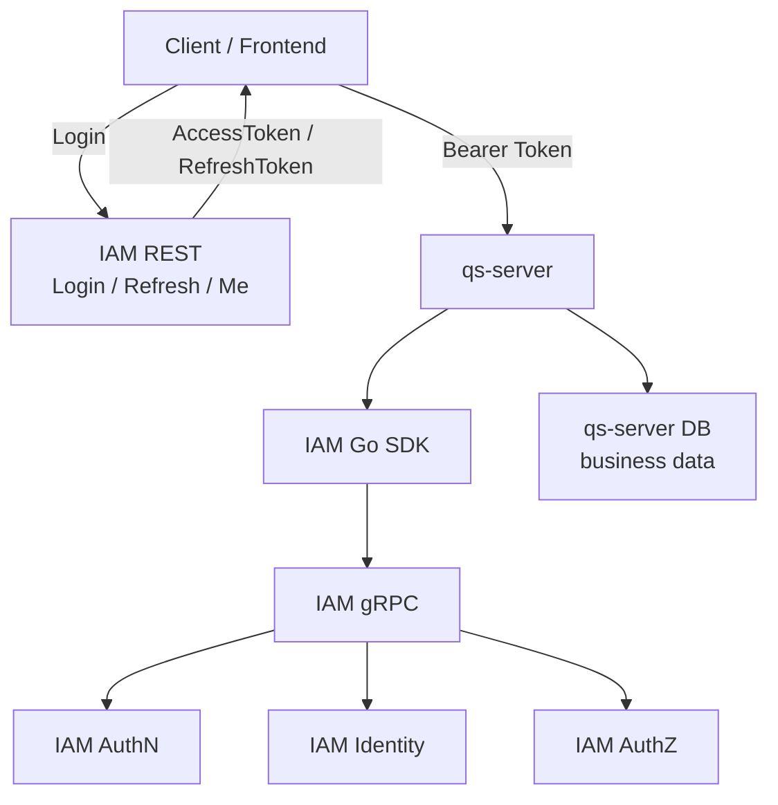
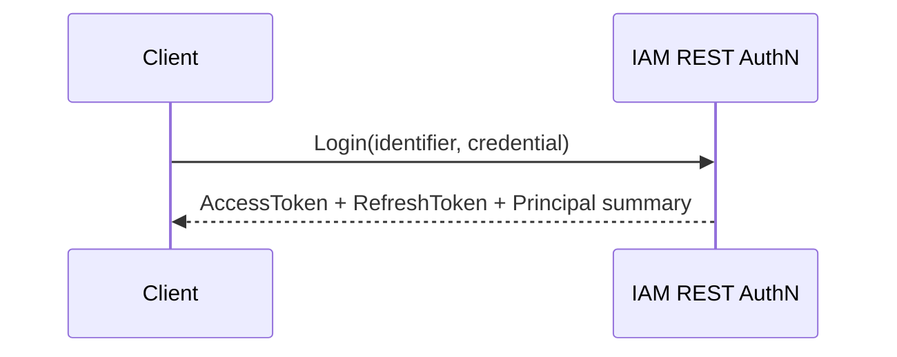
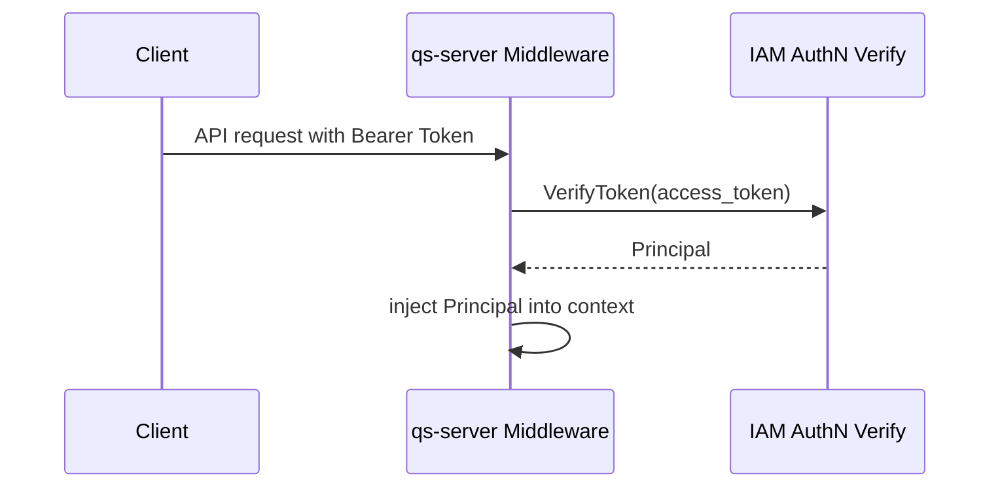
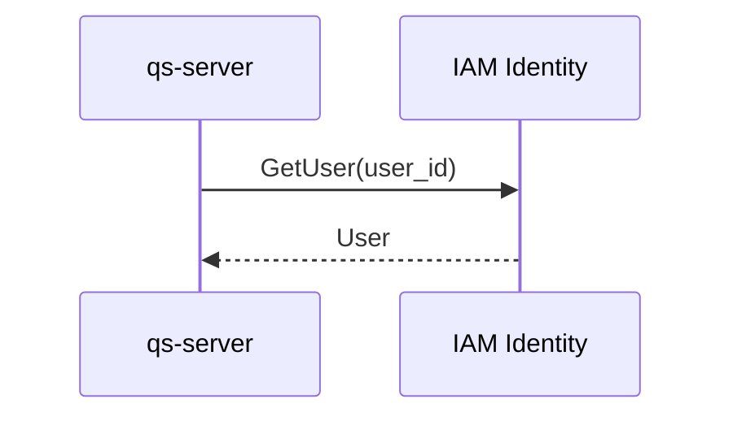
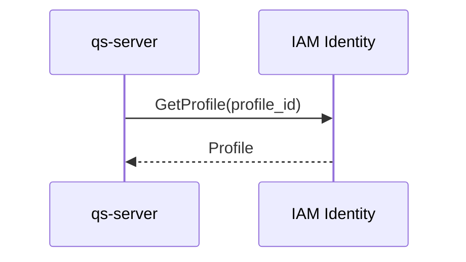
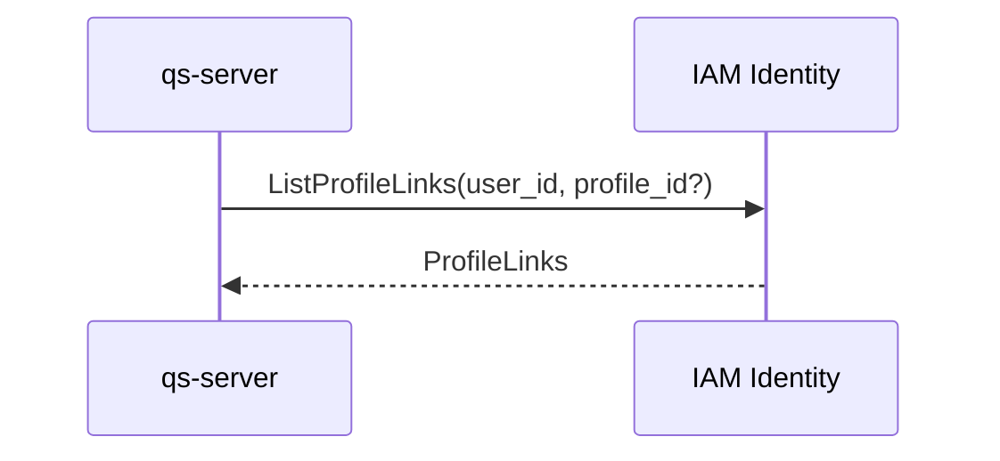
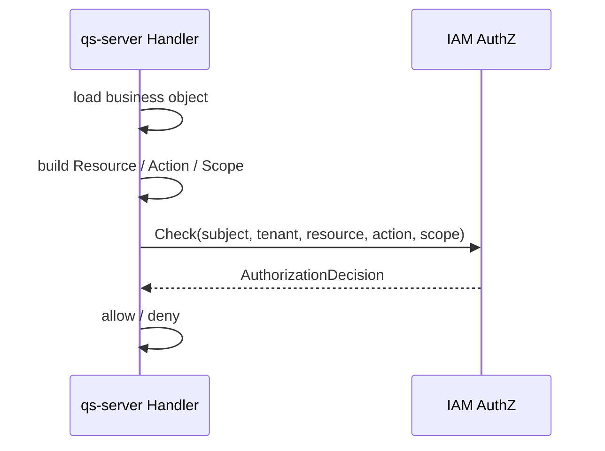

# 04-业务系统接入链路：qs-server 接入 IAM 详解

## 1. 本文定位

本文是 `05-接入与契约/` 文档组中关于 **业务系统接入 IAM 的落地文档**。

前面几篇已经分别说明：

```text
00-接入总览：业务系统如何接入 IAM；
01-REST API 契约：前端与管理端接入；
02-gRPC API 契约：服务间调用与内部集成；
03-SDK 接入模型：Go 服务端集成。
```

本文聚焦一个具体业务项目：

```text
qs-server 如何接入 IAM？
```

qs-server 是问卷、量表、测评、答卷、解读报告等业务能力的服务端系统。

IAM 是身份与授权中心。

因此，qs-server 接入 IAM 的核心不是“调用一个登录接口”，而是把以下链路串起来：

```text
前端登录；
Bearer Token 携带；
qs-server 验证 Token；
Principal 注入请求上下文；
User / Profile / ProfileLink 查询；
业务资源 Resource / Action / Scope 建模；
调用 IAM AuthZ Check；
根据 AuthorizationDecision 放行或拒绝；
内部服务使用 service identity 调用 IAM；
契约与配置持续防漂移。
```

本文回答：

```text
qs-server 和 IAM 的职责边界是什么？
前端登录应该打到 IAM 还是 qs-server？
qs-server 收到 Bearer Token 后如何处理？
qs-server 如何查询 User、Profile、ProfileLink？
ProfileLink 和 AuthZ Check 的边界是什么？
qs-server 如何为业务对象构造 Resource / Action / Scope？
qs-server、collection-server、qs-worker 接入 IAM 的差异是什么？
本地开发和生产部署分别需要哪些配置？
接入 IAM 时常见错误如何排查？
```

一句话：

> 本文把 REST、gRPC、SDK 三类契约组合起来，说明 qs-server 作为业务系统如何完整接入 IAM。

---

## 2. 30 秒结论

qs-server 接入 IAM 的推荐主链路是：

```text
Client
  -> IAM REST Login
  -> AccessToken / RefreshToken
  -> Client calls qs-server with Bearer Token
  -> qs-server middleware verifies token through IAM SDK / gRPC
  -> Principal injected into context
  -> handler loads business object
  -> handler builds Resource / Action / Scope
  -> qs-server calls IAM AuthZ Check through SDK / gRPC
  -> IAM returns AuthorizationDecision
  -> qs-server allow / deny business operation
```

qs-server 应该保存：

```text
iam_user_id；
iam_profile_id；
tenant_id；
业务对象 owner / origin；
业务对象与 IAM 主体的引用关系。
```

qs-server 不应该保存：

```text
LoginIdentity；
Credential；
AccessToken / RefreshToken；
Role；
Permission；
RoleBinding；
Casbin rule；
IDP AppSecret。
```

核心边界：

```text
IAM 负责认证、身份事实、授权事实和权限判定；
qs-server 负责业务对象、业务流程和业务资源语义；
前端只负责登录、保存 Token、携带 Token；
qs-server 不复制 IAM 权限模型；
qs-server 不直接调用 Casbin；
ProfileLink 是身份关系，不是最终权限判定；
敏感业务操作必须调用 AuthZ Check。
```

---

## 3. qs-server 为什么需要 IAM

qs-server 自身关注的是业务域：

```text
问卷；
量表；
答卷；
测评；
解读报告；
评估任务；
医学量表结果；
儿童 Profile 相关业务对象。
```

这些业务能力需要身份和权限支撑。

例如：

```text
谁可以登录系统？
当前请求是谁发起的？
这个用户关联了哪些儿童 Profile？
这个用户能不能查看某个测评报告？
这个用户能不能提交某个答卷？
这个用户能不能管理问卷模板？
worker 调用内部接口时如何证明服务身份？
collection-server 调用 apiserver 时如何被认证？
```

如果 qs-server 自己实现这些能力，会逐渐复制出一套 IAM：

```text
用户表；
账号表；
密码表；
Token 表；
角色表；
权限表；
角色绑定表；
权限判定逻辑；
```

这是错误方向。

正确方向是：

```text
IAM 统一管理身份与权限；
qs-server 只引用 IAM 主体，并把业务资源映射为 IAM AuthZ 请求。
```

---

## 4. qs-server 与 IAM 的职责边界

### 4.1 IAM 负责什么

IAM 负责：

```text
User；
Profile；
ProfileLink；
LoginIdentity；
Credential；
Challenge；
Session；
AccessToken；
RefreshToken；
Principal；
Role；
ResourceCatalog；
Permission；
RoleBinding；
AuthorizationDecision；
PolicyVersion；
Outbox；
RuntimeReload。
```

对应模块：

```text
AuthN：登录、Token、Session、Principal；
Identity：User、Profile、ProfileLink；
AuthZ：Role、Resource、Permission、RoleBinding、Check、Snapshot；
IDP：WeChat / WeCom 等外部身份源配置。
```

---

### 4.2 qs-server 负责什么

qs-server 负责：

```text
问卷模板；
量表版本；
答卷；
测评任务；
解读报告；
业务状态流转；
业务数据持久化；
业务事件；
业务对象与 IAM User/Profile/Tenant 的引用关系；
将业务操作映射为 Resource / Action / Scope。
```

例如，qs-server 可以保存：

```text
Assessment.CreatedByUserID = iam_user_id
Assessment.ProfileID = iam_profile_id
Assessment.TenantID = tenant_id
Report.ProfileID = iam_profile_id
AnswerSheet.SubmittedBy = iam_user_id
```

这些是业务对象与 IAM 主体的引用。

---

### 4.3 qs-server 不负责什么

qs-server 不负责：

```text
密码校验；
登录身份绑定；
Credential 存储；
Challenge 校验；
AccessToken 签发；
RefreshToken 轮换；
JWKS 管理；
Role / Permission / RoleBinding 事实源；
Casbin matcher；
PolicyVersion / Outbox / RuntimeReload。
```

如果 qs-server 需要这些能力，应通过 IAM 契约调用，而不是复制实现。

---

## 5. 总体接入架构



这张图表达：

```text
前端登录走 IAM REST；
业务 API 打到 qs-server；
qs-server 使用 IAM SDK / gRPC 调用 IAM；
IAM 负责认证、身份、授权；
qs-server 负责业务数据和业务流程。
```

---

## 6. 登录链路

### 6.1 推荐链路

用户登录推荐直接调用 IAM REST。



登录成功后，前端保存：

```text
AccessToken；
RefreshToken；
expires_in；
principal summary。
```

之后调用 qs-server 时携带：

```http
Authorization: Bearer <access_token>
```

---

### 6.2 为什么不是 qs-server 自己登录

qs-server 不应该自己处理密码登录。

错误方式：

```text
Client -> qs-server login
qs-server -> 自己查用户表
qs-server -> 自己校验密码
qs-server -> 自己签发 Token
```

原因：

```text
这会复制 AuthN；
会导致 Credential 分散；
会导致 Token 签发分散；
会导致登录策略、Challenge、IDP、Session 难以统一；
会让 IAM 失去中心地位。
```

正确方式：

```text
Client -> IAM Login
Client -> qs-server with IAM AccessToken
```

---

## 7. Token 验证链路

### 7.1 qs-server middleware 验证 Token

qs-server 收到业务请求后，应在 middleware 中验证 Token。



middleware 职责：

```text
读取 Authorization header；
提取 Bearer Token；
调用 IAM SDK / gRPC VerifyToken；
得到 Principal；
将 Principal 注入 context；
认证失败返回 401。
```

---

### 7.2 Principal 注入上下文

验证成功后，qs-server 应将 Principal 放入请求上下文。

Principal 至少应表达：

```text
UserID；
Subject；
TenantID；
LoginIdentityID；
AuthMethod；
AMR；
TokenVersion；
ExpiresAt。
```

具体字段以 IAM AuthN 契约和 SDK public API 为准。

业务 handler 不应该重复解析 Token。

业务 handler 应从 context 获取 Principal。

---

### 7.3 本地验签与远程 VerifyToken

qs-server 可以使用 JWKS 做本地验签。

但要明确边界：

```text
本地验签可以验证签名、过期时间、issuer、audience；
本地验签不一定能感知 Session revoke、账号禁用、风险控制、TokenVersion 变更；
需要强状态一致时，应调用 IAM 远程 VerifyToken。
```

推荐策略：

```text
普通读请求：可考虑本地验签 + 短 TTL；
高风险操作：远程 VerifyToken；
管理操作：远程 VerifyToken + AuthZ Check；
```

具体策略以 AuthN 契约和业务风险等级为准。

---

## 8. 当前用户与身份关系查询链路

### 8.1 查询 User

业务 handler 可以根据 Principal.UserID 查询 User。



用途：

```text
展示当前用户；
记录业务审计；
渲染报告创建人；
校验用户状态。
```

---

### 8.2 查询 Profile

qs-server 业务对象通常会关联 Profile。



用途：

```text
显示儿童档案信息；
报告中展示 Profile；
测评任务关联 Profile；
答卷归属 Profile。
```

---

### 8.3 查询 ProfileLink

ProfileLink 表达 User 与 Profile 的身份关系。



用途：

```text
查询当前用户关联哪些 Profile；
确认用户是否与某个 Profile 有 guardian / owner / operator 等关系；
业务页面展示用户可见的 Profile 列表。
```

---

### 8.4 ProfileLink 不是最终权限判定

必须明确：

```text
ProfileLink 是身份关系；
AuthZ Check 是权限判定。
```

例如：

```text
用户是某个儿童 Profile 的 guardian；
不等于用户自动拥有所有 report:read 权限。
```

正确方式：

```text
先根据业务需要查询 ProfileLink；
再对敏感操作调用 AuthZ Check；
最终 allow / deny 以 AuthZ Check 为准。
```

---

## 9. qs-server 资源建模

qs-server 接入 AuthZ 的关键，是把业务操作映射为：

```text
ResourceKey；
Action；
ObjectScope。
```

### 9.1 ResourceKey 规则

ResourceKey 应遵循 IAM AuthZ 的四段结构：

```text
<app>:<domain>:<type>:<name-or-*>
```

qs-server 推荐使用：

```text
qs:<domain>:<type>:<name-or-*>
```

示例：

```text
qs:survey:questionnaire:*
qs:survey:answersheet:*
qs:evaluation:assessment:*
qs:evaluation:report:*
qs:scale:medical-scale:*
```

实际资源目录必须以 IAM ResourceCatalog 为准。

---

### 9.2 Action 规则

Action 表示具体操作。

常见动作：

```text
create；
read；
list；
update；
delete；
submit；
evaluate；
export；
publish；
archive。
```

Action 必须与 IAM ResourceCatalog 中该 Resource 支持的动作保持一致。

不要在 qs-server 中临时发明未注册动作。

---

### 9.3 Scope 规则

Scope 表示权限作用范围。

常见范围：

```text
all:*；
origin:<profile_id>；
owner:<user_id>；
tenant:<tenant_id>；
```

示例：

```text
读取某个儿童 Profile 下的报告：origin:<profile_id>
读取自己创建的答卷：owner:<user_id>
管理租户下所有问卷：all:*
```

具体 ScopeKind 以 IAM AuthZ 文档和 ResourceCatalog 为准。

---

## 10. 权限 Check 链路

### 10.1 通用链路



关键点：

```text
先加载业务对象；
根据业务对象确定 tenant / profile / owner；
构造 AuthZ Check；
根据 AuthorizationDecision 执行或拒绝。
```

---

### 10.2 读取测评报告

场景：用户读取某个测评报告。

qs-server 需要先加载报告，得到：

```text
ReportID；
TenantID；
ProfileID；
OwnerUserID；
```

然后构造 Check：

```text
subject = principal.Subject
tenant = report.TenantID
resource = qs:evaluation:report:*
action = read
scope = origin:<report.ProfileID>
```

如果 IAM 返回：

```text
Allowed = true
```

则返回报告。

否则返回 403。

---

### 10.3 提交答卷

场景：用户提交某个问卷答卷。

Check 示例：

```text
subject = principal.Subject
tenant = assessment.TenantID
resource = qs:survey:answersheet:*
action = submit
scope = origin:<assessment.ProfileID>
```

业务边界：

```text
AuthZ 判断是否有提交权限；
qs-server 判断答卷是否符合业务状态；
qs-server 判断问卷是否可提交；
qs-server 判断答案是否合法。
```

不要把业务状态判断塞进 IAM。

---

### 10.4 管理问卷模板

场景：管理员更新问卷模板。

Check 示例：

```text
subject = principal.Subject
tenant = tenantID
resource = qs:survey:questionnaire:*
action = update
scope = all:*
```

业务边界：

```text
AuthZ 判断是否有 update 权限；
qs-server 判断模板版本是否允许编辑；
qs-server 判断发布状态是否可变更。
```

---

### 10.5 导出报告

场景：用户导出报告。

Check 示例：

```text
subject = principal.Subject
tenant = report.TenantID
resource = qs:evaluation:report:*
action = export
scope = origin:<report.ProfileID>
```

导出通常比读取风险更高。

可以单独建模 `export` action，而不是复用 `read`。

---

## 11. AuthorizationDecision 处理

IAM AuthZ Check 返回 AuthorizationDecision。

qs-server 应至少关注：

```text
Allowed；
Reason；
DenyCode；
PolicyVersion；
MatchedRole；
MatchedPermission。
```

### 11.1 Allowed = true

表示权限判定通过。

qs-server 可以继续执行业务逻辑。

注意：

```text
AuthZ 通过不代表业务状态一定合法；
业务状态仍由 qs-server 自己判断。
```

---

### 11.2 Allowed = false

表示认证主体没有访问权限。

qs-server 应返回：

```text
HTTP 403；
gRPC PermissionDenied；
业务错误码 permission_denied。
```

不要返回 500。

---

### 11.3 IAM 调用失败

如果 IAM Check 调用失败，和权限拒绝不同。

例如：

```text
IAM unavailable；
timeout；
network error；
internal error。
```

这类错误应按系统错误处理。

是否 fail closed 由业务风险决定。

默认建议：

```text
敏感写操作 fail closed；
普通读操作也建议 fail closed；
极少数低风险展示可以降级，但必须明确。
```

---

## 12. collection-server 接入 IAM

collection-server 是问卷收集侧服务。

它的 IAM 接入通常包括：

```text
验证调用者 Token；
确认提交答卷的用户身份；
确认用户是否能为某个 Profile / Assessment 提交答卷；
内部调用 qs-apiserver 或 IAM 时携带服务身份。
```

推荐链路：

```text
Client
  -> collection-server with Bearer Token
  -> collection-server VerifyToken
  -> collection-server AuthZ Check submit answersheet
  -> collection-server save answer / call qs-apiserver
```

如果 collection-server 只作为公开收集入口，也必须明确：

```text
匿名答卷是否允许；
匿名答卷如何建模 Subject；
是否使用 one-time token；
是否需要 Assessment invitation token；
是否需要 IAM AuthZ Check。
```

这些属于业务接入策略，需要在 qs-server / collection-server 文档中明确。

---

## 13. qs-worker 接入 IAM

qs-worker 是后台异步处理进程。

它通常没有用户 Bearer Token。

它需要服务身份。

推荐方式：

```text
qs-worker 使用 service identity；
通过 service token / mTLS 调用 IAM；
需要代表用户执行时显式携带 on-behalf-of 上下文；
需要资源权限时以 service subject 或 delegated subject 做 AuthZ Check。
```

错误方式：

```text
qs-worker 使用管理员账号密码登录；
qs-worker 长期保存管理员 RefreshToken；
qs-worker 伪装成普通用户执行任务。
```

worker 的权限应单独建模。

例如：

```text
subject = service:qs-worker
resource = qs:evaluation:report:*
action = generate
scope = tenant:<tenant_id>
```

是否采用 service subject，要以 IAM AuthZ 当前支持程度为准。

如果 service subject 还只是模型预留，则应在实现层明确当前替代方案。

---

## 14. 管理后台接入 IAM 与 qs-server

管理后台可能同时调用 IAM 和 qs-server。

典型链路：

```text
管理身份、角色、权限 -> 调 IAM；
管理问卷、量表、报告 -> 调 qs-server；
```

管理后台登录仍走 IAM。

管理后台访问 qs-server 时携带 IAM AccessToken。

qs-server 验证 Token 后，再对业务管理操作做 AuthZ Check。

示例：

```text
更新问卷模板：
resource = qs:survey:questionnaire:*
action = update
scope = all:*
```

创建 IAM 角色则直接调用 IAM 管理接口，并由 IAM 自身做 AuthZ。

---

## 15. 本地开发配置

本地开发需要配置：

```text
IAM REST endpoint；
IAM gRPC endpoint；
qs-server service name；
service token；
default tenant；
JWKS endpoint；
timeout；
是否启用 mock IAM；
```

示例配置：

```yaml
iam:
  rest_endpoint: "http://localhost:8080"
  grpc_endpoint: "localhost:9090"
  service_name: "qs-server"
  service_token: "dev-service-token"
  default_tenant: "default"
  timeout: "2s"
  jwks_url: "http://localhost:8080/.well-known/jwks.json"
```

本地可以选择：

```text
真实 IAM；
IAM mock；
SDK fake client；
```

但必须明确不同模式的测试意义。

---

## 16. 生产部署配置

生产环境需要关注：

```text
IAM endpoint；
TLS / mTLS；
service token 管理；
secret 注入；
timeout；
retry；
circuit breaker；
observability；
log redaction；
```

生产配置不应把 secret 写入镜像或代码仓库。

推荐来源：

```text
Kubernetes Secret；
云厂商 Secret Manager；
CI/CD Secret；
本机安全配置；
```

日志必须脱敏：

```text
Authorization header；
access token；
refresh token；
service token；
AppSecret；
private key。
```

---

## 17. 常见错误与排查

### 17.1 401 Unauthorized

常见原因：

```text
没有 Authorization header；
Bearer Token 格式错误；
Token 过期；
Token 签名不合法；
Token issuer / audience 不匹配；
Session 已撤销；
账号已禁用。
```

排查：

```text
检查前端是否携带 Token；
检查 qs-server middleware 是否正确提取 Token；
检查 IAM VerifyToken 返回；
检查 JWKS 是否过期；
检查 request-id / trace-id。
```

---

### 17.2 403 Forbidden

常见原因：

```text
认证通过，但没有绑定角色；
角色没有对应 Permission；
ResourceKey 不匹配；
Action 不匹配；
Scope 不覆盖；
Tenant 不一致；
PolicyVersion 未刷新。
```

排查：

```text
检查 AuthZ Check request；
检查 subject / tenant / resource / action / scope；
检查 AuthorizationDecision reason；
检查 MatchedRole / MatchedPermission；
检查 PolicyVersion；
检查 Snapshot。
```

---

### 17.3 500 / IAM 调用失败

常见原因：

```text
IAM gRPC endpoint 配置错误；
service token 错误；
网络不通；
timeout 太短；
IAM 服务不可用；
TLS / mTLS 配置错误。
```

排查：

```text
检查配置；
检查 service token；
检查 IAM health；
检查 qs-server 到 IAM 网络；
检查日志中的 request-id / trace-id；
检查 SDK error code。
```

---

### 17.4 明明授权了仍然拒绝

可能原因：

```text
授权写入到了另一个 tenant；
RoleBinding subject 不一致；
ResourceKey 写错；
ActionPattern 不覆盖请求 Action；
Scope 不覆盖请求 ObjectScope；
RuntimeReload 滞后；
qs-server 缓存了旧结果。
```

排查顺序：

```text
1. 打印 qs-server Check request；
2. 查询 IAM Snapshot；
3. 检查 RoleBinding；
4. 检查 Role Permission；
5. 检查 PolicyVersion；
6. 检查 RuntimeHealth；
7. 检查 SDK 缓存策略。
```

---

## 18. 接入 Checklist

### 18.1 qs-server 启动前

```text
IAM REST endpoint 已配置；
IAM gRPC endpoint 已配置；
service name 已配置；
service token 已配置；
timeout 已配置；
JWKS endpoint 已配置；
SDK client 初始化成功；
health check 能访问 IAM；
```

---

### 18.2 用户请求链路

```text
前端能完成 IAM Login；
前端能携带 Bearer Token 调 qs-server；
qs-server middleware 能 VerifyToken；
Principal 能注入 context；
handler 能读取 Principal；
业务对象能提供 tenant / profile / owner；
handler 能构造 AuthZ Check；
403 / 401 / 500 能正确区分。
```

---

### 18.3 授权配置

```text
qs 相关 Resource 已注册；
Resource 支持的 Action 已注册；
Resource 支持的 ScopeKind 已注册；
Role 已创建；
Permission 已授予 Role；
Subject 已绑定 Role；
PolicyVersion 已更新；
RuntimeReload 正常；
```

---

### 18.4 测试

```text
middleware 单测；
AuthZ Check 构造单测；
IAM SDK fake client 单测；
qs-server + IAM 集成测试；
401 / 403 / timeout / IAM unavailable 测试；
```

---

## 19. 后续文档入口

本文说明 qs-server 接入 IAM 的完整链路。

继续阅读：

```text
05-契约事实源与防漂移机制.md
```

也可以回看：

```text
00-接入总览-业务系统如何接入IAM.md
01-REST API契约-前端与管理端接入.md
02-gRPC API契约-服务间调用与内部集成.md
03-SDK接入模型-Go服务端集成.md
```

其中：

```text
第 00 篇说明业务系统接入 IAM 的整体模型；
第 01 篇说明前端和管理端 REST 接入；
第 02 篇说明服务间 gRPC 接入；
第 03 篇说明 Go SDK 如何封装 IAM 能力；
第 05 篇说明契约事实源与防漂移机制。
```

---

## 20. 本文总结

qs-server 接入 IAM 的核心，是把业务系统从“自建身份权限”转为“引用 IAM 主体并调用 IAM 判定”。

主链路是：

```text
Client Login at IAM
  -> Client calls qs-server with Bearer Token
  -> qs-server VerifyToken
  -> Principal in context
  -> qs-server loads business object
  -> qs-server builds Resource / Action / Scope
  -> IAM AuthZ Check
  -> allow / deny
```

职责边界是：

```text
IAM 负责认证、身份事实、授权事实、权限判定；
qs-server 负责问卷、量表、答卷、测评、报告等业务对象和业务状态；
qs-server 只保存 IAM 主体引用，不复制 IAM 账号、Token、角色、权限表；
ProfileLink 是身份关系，不是最终权限判定；
敏感操作必须调用 AuthZ Check。
```

如果只记住一句话：

> qs-server 通过 IAM SDK / gRPC 验证 Token、查询身份、调用 AuthZ Check；IAM 统一维护身份和权限事实，qs-server 只负责业务对象和业务规则。
