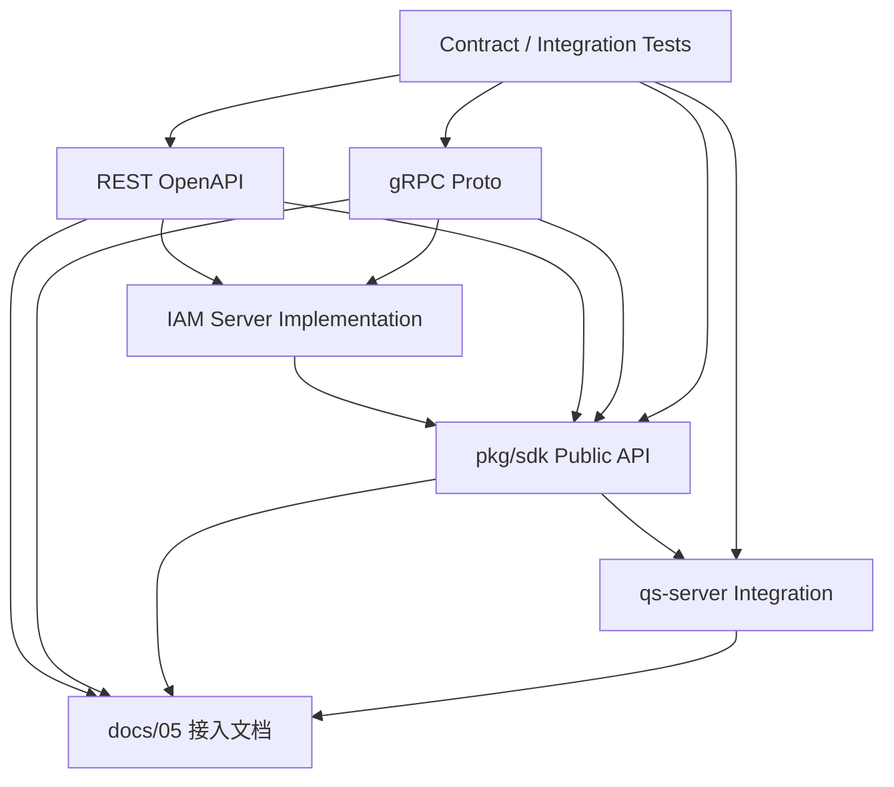

# 05-契约事实源与防漂移机制

## 1. 本文定位

本文是 `05-接入与契约/` 文档组的收口文档。

前面几篇已经分别说明：

```text
00-接入总览：业务系统如何接入 IAM；
01-REST API 契约：前端与管理端接入；
02-gRPC API 契约：服务间调用与内部集成；
03-SDK 接入模型：Go 服务端集成；
04-业务系统接入链路：qs-server 接入 IAM 详解。
```

本文不再展开某一类接口的使用方式，而是专门回答一个问题：

```text
REST、gRPC、SDK、文档、测试之间，谁是事实源？
如何防止接入契约随着代码演进发生漂移？
```

接入与契约文档最容易出现的问题是：

```text
REST handler 已经改了，但 OpenAPI 没更新；
proto 字段已经变了，但 SDK 没同步；
SDK public API 已经调整，但 docs 还写旧方法；
qs-server 接入示例还在使用旧路径；
错误码语义在 REST、gRPC、SDK 三处不一致；
字段名看起来一样，但业务语义已经不同。
```

本文的目标是建立一套维护规则，让 `docs/05-接入与契约/` 不变成“过期接口手册”。

一句话：

> 本文负责定义 IAM 接入契约的事实源优先级、变更规则、校验命令、Breaking Change 边界和文档维护清单。

---

## 2. 30 秒结论

接入契约不是单一文档。

它由多类事实源共同构成：

```text
REST 契约：OpenAPI + REST handler + REST tests；
gRPC 契约：proto + generated code + gRPC transport tests；
SDK 契约：pkg/sdk public API + SDK tests + examples；
业务接入契约：qs-server 接入代码 + IAM SDK usage + integration tests；
人类文档：docs/05-接入与契约/*。
```

事实源优先级建议：

```text
机器契约 / 源码 / 测试
  > 人类文档
  > 历史讨论
  > 旧 README / 旧示例
```

核心规则：

```text
OpenAPI 是 REST 字段级事实源；
proto 是 gRPC 字段级事实源；
pkg/sdk public API 是 Go SDK 事实源；
server implementation 是真实运行行为事实源；
tests 是防止契约漂移的最低保护；
docs/05 是接入理解入口，不替代机器契约。
```

如果文档与代码冲突：

```text
先查机器契约和源码；
再查测试；
最后更新文档；
必要时补契约测试。
```

---

## 3. 为什么需要防漂移机制

IAM 是给其他业务系统接入的身份与授权中心。

这意味着契约漂移会直接影响接入方。

例如 qs-server 依赖 IAM：

```text
VerifyToken；
GetUser；
GetProfile；
ListProfileLinks；
AuthZ Check；
GetAuthorizationSnapshot；
service token；
错误码；
PolicyVersion；
```

如果这些契约发生漂移，qs-server 会出现：

```text
编译失败；
运行时报错；
401 / 403 误判；
Token 验证不一致；
权限判定不一致；
ProfileLink 关系查询失败；
SDK 方法不可用；
前端仍调用旧 REST path；
```

所以接入契约必须像代码一样维护。

不能只靠“文档记忆”。

---

## 4. 契约类型总览

IAM 接入契约分为五类。

| 契约类型 | 事实源 |
| --- | --- |
| REST | OpenAPI、REST handler、REST tests |
| gRPC | proto、generated code、gRPC tests |
| SDK | `pkg/sdk` public API、SDK tests、examples |
| 业务接入 | qs-server 接入代码、配置、集成测试 |
| 文档 | `docs/05-接入与契约/*` |

它们之间的关系是：



这张图表达：

```text
文档解释契约；
机器契约定义字段；
server implementation 决定真实行为；
tests 防止漂移；
qs-server 是重要接入验证方。
```

---

## 5. REST 契约事实源

### 5.1 REST 的事实源是什么

REST 契约的事实源包括：

```text
api/rest
OpenAPI YAML / JSON
internal/apiserver/transport/rest
REST handler tests
Application command / query
```

推荐优先级：

```text
OpenAPI
  -> REST handler
  -> Application command/query
  -> REST tests
  -> docs/05 REST 文档
```

其中：

```text
OpenAPI 是字段级契约事实源；
REST handler 是运行行为事实源；
Application command/query 是用例输入输出事实源；
tests 是一致性保护；
docs 是人类解释。
```

---

### 5.2 REST 文档不应该手抄完整字段

REST 文档不应成为第二套 OpenAPI。

原因：

```text
字段太多，容易过期；
OpenAPI 已经可以表达 request / response / schema / error；
重复维护会增加漂移概率；
生成文档、客户端和校验应以 OpenAPI 为准。
```

REST 文档应该写：

```text
接口分组；
使用场景；
关键字段；
典型请求；
认证要求；
权限要求；
错误语义；
事实源入口。
```

---

### 5.3 REST 变更必须同步什么

修改 REST endpoint 时，应同步检查：

```text
OpenAPI；
REST handler；
Application command / query；
REST tests；
SDK REST client；
前端调用方；
qs-server 是否使用该 REST 接口；
docs/05-接入与契约/01-REST API契约-前端与管理端接入.md；
README / 00 接入总览。
```

---

### 5.4 REST Breaking Change

以下通常属于 REST breaking change：

```text
删除 endpoint；
修改 path；
修改 HTTP method；
删除 request 字段；
删除 response 字段；
修改字段类型；
修改字段语义；
新增 required 字段；
修改 enum 取值；
修改错误码语义；
改变认证要求；
改变权限要求；
修改分页语义；
修改幂等语义。
```

Breaking Change 必须有：

```text
新版本 endpoint；
迁移说明；
deprecation 标记；
兼容期；
测试覆盖。
```

---

## 6. gRPC 契约事实源

### 6.1 gRPC 的事实源是什么

gRPC 契约的事实源包括：

```text
api/grpc
.proto files
generated code
internal/apiserver/transport/grpc
gRPC transport tests
Application command / query
```

推荐优先级：

```text
proto
  -> generated code
  -> gRPC service implementation
  -> Application command/query
  -> gRPC tests
  -> docs/05 gRPC 文档
```

其中：

```text
proto 是字段级契约事实源；
generated code 是编译层事实源；
gRPC service implementation 是运行行为事实源；
tests 是一致性保护；
docs 是人类解释。
```

---

### 6.2 proto 变更规则

proto 字段编号一旦发布，不应复用。

如果字段废弃，应：

```text
保留 field number；
标记 deprecated；
必要时 reserved；
新增替代字段；
补迁移说明。
```

不要：

```text
复用旧 field number；
改变 field type；
改变 enum number；
删除已经发布的 message field 后给新语义复用编号。
```

---

### 6.3 gRPC 变更必须同步什么

修改 gRPC service / rpc / message 时，应同步检查：

```text
proto；
generated code；
gRPC service implementation；
Application command / query；
SDK gRPC client；
qs-server SDK usage；
gRPC tests；
docs/05-接入与契约/02-gRPC API契约-服务间调用与内部集成.md；
docs/05-接入与契约/03-SDK接入模型-Go服务端集成.md；
docs/05-接入与契约/04-业务系统接入链路-qs-server接入 IAM 详解.md。
```

---

### 6.4 gRPC Breaking Change

以下通常属于 gRPC breaking change：

```text
删除 service；
删除 rpc；
修改 rpc request type；
修改 rpc response type；
删除 message field；
修改 field number；
修改 field type；
修改 enum number；
修改认证 metadata 要求；
修改错误码语义；
修改 deadline / retry 预期；
修改幂等语义。
```

Breaking Change 应新开版本 package 或提供兼容层。

例如：

```text
iam.authz.v2 -> iam.authz.v3
```

实际版本策略以项目当前 proto 约定为准。

---

## 7. SDK 契约事实源

### 7.1 SDK 的事实源是什么

SDK 契约的事实源包括：

```text
pkg/sdk
pkg/sdk public API
SDK tests
SDK examples
README snippets
REST / gRPC client implementation
```

推荐优先级：

```text
pkg/sdk public API
  -> SDK tests
  -> SDK examples
  -> REST / gRPC machine contracts
  -> docs/05 SDK 文档
```

SDK 对接入方来说是 public API。

一旦业务系统开始使用 SDK，SDK public type、method、error、config 都成为契约。

---

### 7.2 SDK public API 包括什么

SDK public API 包括：

```text
public package；
public type；
public interface；
public function；
public method；
public error；
public config field；
public option；
public middleware helper；
public testing fake。
```

例如：

```text
sdk.NewClient；
sdk.Config；
client.AuthN().VerifyToken；
client.Identity().GetUser；
client.AuthZ().Check；
client.AuthZ().AllowScoped；
sdk.ErrPermissionDenied；
sdktest.NewFakeClient。
```

实际 API 以当前 `pkg/sdk` 为准。

---

### 7.3 SDK 变更必须同步什么

修改 SDK public API 时，应同步检查：

```text
pkg/sdk tests；
examples；
qs-server 接入代码；
README snippets；
docs/05-接入与契约/03-SDK接入模型-Go服务端集成.md；
docs/05-接入与契约/04-业务系统接入链路-qs-server接入 IAM 详解.md；
REST / gRPC client mapping；
error mapping；
```

---

### 7.4 SDK Breaking Change

以下通常属于 SDK breaking change：

```text
删除 public package；
删除 public type；
删除 public method；
修改 method signature；
修改 config 字段名；
修改 config 字段语义；
修改 error 类型；
修改 errors.Is 语义；
修改默认 timeout / retry 行为；
修改 AuthZ Allow / Check 返回语义；
修改 middleware 注入 Principal 的方式；
```

Breaking Change 应提供：

```text
migration guide；
compat wrapper；
deprecated period；
release note；
compile-time example test。
```

---

## 8. 业务接入契约事实源

### 8.1 qs-server 是重要验证方

IAM 的接入契约不能只在 IAM 仓库里自洽。

qs-server 是 IAM 的关键接入方。

因此，以下内容也是事实源的一部分：

```text
qs-server IAM SDK 初始化代码；
qs-server middleware / interceptor；
qs-server AuthZ Check 构造代码；
qs-server Resource / Action / Scope 常量；
qs-server integration tests；
qs-server deployment config；
```

如果 IAM 改了契约但 qs-server 接不起来，说明契约维护不完整。

---

### 8.2 业务接入变更必须同步什么

当 qs-server 接入链路变化时，应同步检查：

```text
docs/05-接入与契约/04-业务系统接入链路-qs-server接入 IAM 详解.md；
docs/05-接入与契约/03-SDK接入模型-Go服务端集成.md；
qs-server 配置文档；
qs-server deployment；
IAM SDK examples；
IAM AuthZ ResourceCatalog；
IAM AuthZ docs；
```

---

### 8.3 业务资源契约

qs-server 需要与 IAM 对齐业务资源。

例如：

```text
qs:survey:questionnaire:*
qs:survey:answersheet:*
qs:evaluation:assessment:*
qs:evaluation:report:*
qs:scale:medical-scale:*
```

这些资源不是普通字符串。

它们是 qs-server 和 IAM 之间的授权契约。

因此需要维护：

```text
ResourceKey；
Action；
ScopeKind；
ResourceCatalog；
AuthZ Check 构造代码；
测试用例。
```

---

## 9. 文档事实源与边界

### 9.1 docs/05 的职责

`docs/05-接入与契约/` 负责解释接入模型。

它应该回答：

```text
谁接入 IAM？
通过什么协议接入？
典型链路是什么？
如何认证？
如何授权？
如何使用 SDK？
如何排查错误？
契约事实源在哪里？
```

它不应该：

```text
替代 OpenAPI；
替代 proto；
替代 SDK GoDoc；
替代 server implementation；
替代 integration tests。
```

---

### 9.2 文档更新规则

修改以下内容时，必须检查 docs/05：

```text
REST path / method / schema；
gRPC service / rpc / message；
SDK public API；
AuthN 登录或 Token 语义；
Identity User / Profile / ProfileLink 语义；
AuthZ Check / Snapshot 语义；
ResourceKey / Action / Scope 规则；
service token / metadata 规则；
qs-server 接入链路；
错误码语义；
```

---

### 9.3 文档不要写死不稳定实现

文档可以写：

```text
事实源入口；
当前推荐路径；
契约边界；
语义规则；
验证命令。
```

文档应谨慎写：

```text
过细的内部文件树；
每个 handler 的私有函数名；
临时变量名；
尚未稳定的实验 API；
未实现的未来能力。
```

如果必须写未来能力，应标注：

```text
planned；
not implemented；
experimental；
以当前代码为准。
```

---

## 10. 错误语义防漂移

错误语义必须在 REST、gRPC、SDK 之间保持可映射。

### 10.1 推荐映射

| 语义 | REST | gRPC |
| --- | --- | --- |
| 参数错误 | 400 / 422 | InvalidArgument |
| 未认证 | 401 | Unauthenticated |
| 无权限 | 403 | PermissionDenied |
| 不存在 | 404 | NotFound |
| 已存在 | 409 | AlreadyExists |
| 状态冲突 | 409 | FailedPrecondition / Aborted |
| 限流 | 429 | ResourceExhausted |
| 超时 | 504 | DeadlineExceeded |
| 服务不可用 | 503 | Unavailable |
| 内部错误 | 500 | Internal |

SDK 应把这些错误映射成稳定 Go error。

例如：

```text
sdk.ErrInvalidArgument；
sdk.ErrUnauthenticated；
sdk.ErrPermissionDenied；
sdk.ErrNotFound；
sdk.ErrUnavailable；
```

实际错误名以当前 SDK 为准。

---

### 10.2 认证失败与授权失败不能混淆

必须保持：

```text
认证失败：401 / Unauthenticated；
授权失败：403 / PermissionDenied。
```

错误示例：

```text
Token 无效返回 403；
权限不足返回 401；
IAM 调用失败伪装成权限不足。
```

这些都会导致接入方误判。

---

### 10.3 IAM 调用失败与 deny 不能混淆

AuthZ Check 的 `Allowed = false` 表示权限拒绝。

IAM 调用失败表示系统错误。

不要把：

```text
network error；
timeout；
IAM unavailable；
internal error；
```

伪装成：

```text
Allowed = false。
```

否则业务系统会把系统故障误判为用户无权限。

---

## 11. 认证与授权语义防漂移

### 11.1 AuthN 语义

AuthN 契约必须明确：

```text
Login 返回什么；
AccessToken 有效期；
RefreshToken 是否轮换；
VerifyToken 检查哪些状态；
JWKS 本地验签和远程 VerifyToken 的边界；
Logout 对 AccessToken / RefreshToken 的影响；
账号禁用如何影响 Token；
Session revoke 如何影响 VerifyToken。
```

这些语义一旦变化，必须同步：

```text
AuthN docs；
REST docs；
gRPC docs；
SDK docs；
qs-server 接入文档。
```

---

### 11.2 Identity 语义

Identity 契约必须明确：

```text
User 是什么；
Profile 是什么；
ProfileLink 是什么；
ProfileLink 与 AuthZ Permission 的边界；
User disabled / Profile archived 对业务访问的影响。
```

尤其要防止：

```text
把 ProfileLink 当成最终权限；
把 Profile owner 当成 AuthZ role；
把 Identity 关系和 AuthZ 判定混为一谈。
```

---

### 11.3 AuthZ 语义

AuthZ 契约必须明确：

```text
Subject；
Tenant；
ResourceKey；
Action；
ObjectScope；
AuthorizationDecision；
PolicyVersion；
Snapshot；
```

尤其要防止：

```text
Check 请求侧传 ResourcePattern；
业务系统本地拼 Casbin p/g facts；
Snapshot 替代 Check；
PolicyVersion 被当作权限内容；
ProfileLink 替代 RoleBinding。
```

---

## 12. 版本策略

### 12.1 REST 版本

REST 可以通过 path 版本管理：

```text
/api/v1
/api/v2
/api/v3
```

推荐规则：

```text
非兼容变更新开版本；
兼容字段新增可以留在当前版本；
旧版本标注 deprecated；
提供迁移路径；
保留兼容期。
```

---

### 12.2 gRPC 版本

gRPC 可以通过 package 版本管理：

```text
iam.authn.v2
iam.authn.v3
iam.authz.v2
iam.authz.v3
```

推荐规则：

```text
breaking change 新开 package；
不复用 field number；
废弃字段 reserved 或 deprecated；
旧 service 保留兼容期。
```

---

### 12.3 SDK 版本

SDK 版本应说明兼容范围：

```text
SDK version；
compatible IAM server version；
required REST version；
required gRPC proto version；
deprecated API；
迁移说明。
```

如果 SDK 和 IAM Server 强绑定，应在 release note 中明确。

---

## 13. Deprecated 机制

废弃不是删除。

废弃应包含：

```text
deprecated 标记；
替代接口；
迁移方式；
预计移除版本或日期；
兼容期；
测试覆盖。
```

REST 废弃应更新：

```text
OpenAPI deprecated；
docs；
handler 注释；
release note。
```

gRPC 废弃应更新：

```text
proto option deprecated；
注释；
docs；
SDK wrapper；
release note。
```

SDK 废弃应更新：

```text
Go doc comment；
Deprecated: use ...；
docs；
examples；
release note。
```

---

## 14. CI / 校验建议

### 14.1 REST 校验

建议命令：

```bash
make docs-swagger
make api-validate
go test ./internal/apiserver/transport/rest/...
```

校验目标：

```text
OpenAPI 可生成；
OpenAPI schema 合法；
REST handler 与 OpenAPI 不漂移；
REST tests 通过；
```

---

### 14.2 gRPC 校验

建议命令：

```bash
make proto-gen
make api-validate
go test ./internal/apiserver/transport/grpc/...
```

校验目标：

```text
proto 可编译；
generated code 更新；
gRPC service 与 proto 一致；
gRPC tests 通过；
```

---

### 14.3 SDK 校验

建议命令：

```bash
go test ./pkg/sdk/...
```

如果有 example：

```bash
go test ./examples/...
```

校验目标：

```text
SDK public API 可编译；
错误映射正确；
timeout / retry 行为符合预期；
principal context helper 正常；
SDK examples 没有过期。
```

---

### 14.4 文档校验

建议命令：

```bash
make docs-hygiene
```

校验目标：

```text
文档链接有效；
文件名与 README 目录一致；
没有旧文档名；
没有明显过期接口名；
Mermaid 可渲染；
```

具体命令以项目 Makefile 为准。

---

## 15. 变更流程建议

### 15.1 修改 REST 契约流程

```text
1. 修改 OpenAPI；
2. 修改 REST handler；
3. 修改 Application command/query；
4. 修改 REST tests；
5. 修改 SDK REST client；
6. 修改 docs/05 REST 文档；
7. 修改 examples / qs-server 接入代码；
8. 运行验证命令。
```

---

### 15.2 修改 gRPC 契约流程

```text
1. 修改 proto；
2. 运行 proto-gen；
3. 修改 gRPC service implementation；
4. 修改 Application command/query；
5. 修改 SDK gRPC client；
6. 修改 gRPC tests；
7. 修改 docs/05 gRPC / SDK / qs-server 文档；
8. 运行验证命令。
```

---

### 15.3 修改 SDK 契约流程

```text
1. 修改 pkg/sdk public API；
2. 修改 SDK tests；
3. 修改 SDK examples；
4. 修改 qs-server 接入代码；
5. 修改 docs/05 SDK / qs-server 文档；
6. 检查 REST / gRPC 映射；
7. 运行验证命令。
```

---

### 15.4 修改 qs-server 接入流程

```text
1. 修改 qs-server IAM config；
2. 修改 IAM SDK usage；
3. 修改 middleware / interceptor；
4. 修改 AuthZ Check 构造逻辑；
5. 修改 Resource / Action / Scope 常量；
6. 修改 integration tests；
7. 修改 docs/05 qs-server 接入文档；
8. 如涉及 IAM ResourceCatalog，同步 IAM AuthZ 文档。
```

---

## 16. 接入契约检查清单

### 16.1 AuthN 变更

检查：

```text
docs/02-认证AuthN；
REST AuthN OpenAPI；
gRPC AuthN proto；
SDK AuthN client；
TokenVerifier；
qs-server middleware；
00 接入总览；
04 qs-server 接入详解。
```

---

### 16.2 Identity 变更

检查：

```text
docs/04-身份Identity；
REST Identity OpenAPI；
gRPC Identity proto；
SDK Identity client；
ProfileLink 查询代码；
qs-server Profile 相关接入；
04 qs-server 接入详解。
```

---

### 16.3 AuthZ 变更

检查：

```text
docs/03-授权AuthZ；
REST AuthZ OpenAPI；
gRPC AuthZ proto；
SDK AuthZ client；
ResourceCatalog；
PolicyVersion；
AuthorizationDecision；
qs-server AuthZ Check 构造；
04 qs-server 接入详解。
```

---

### 16.4 IDP 变更

检查：

```text
IDP REST OpenAPI；
IDP gRPC proto；
SDK IDP client；
AuthN IDP 协作文档；
secret 脱敏；
管理端接口权限；
```

---

## 17. 常见漂移场景

### 17.1 REST path 改了，SDK 没改

现象：

```text
前端正常；
SDK 调用 404；
qs-server VerifyToken 失败。
```

修复：

```text
同步 SDK REST client；
补 SDK test；
更新 docs/05。
```

---

### 17.2 proto 字段改了，qs-server 没重新生成

现象：

```text
IAM 编译通过；
qs-server 编译失败；
或运行时字段为空。
```

修复：

```text
更新 proto；
重新生成 client；
更新 SDK；
更新 qs-server 依赖；
补 contract test。
```

---

### 17.3 AuthZ Decision 语义改了，业务还按旧语义处理

现象：

```text
Allowed=false 被当成系统错误；
IAM timeout 被当成 deny；
403 和 500 混淆。
```

修复：

```text
统一 AuthorizationDecision；
统一 SDK error mapping；
更新 qs-server error handling；
补 401 / 403 / 500 测试。
```

---

### 17.4 ProfileLink 被当成权限

现象：

```text
用户有关联 Profile 就能访问所有报告；
绕过 AuthZ Check；
权限策略失效。
```

修复：

```text
ProfileLink 只做身份关系；
敏感操作必须 AuthZ Check；
补业务权限测试。
```

---

### 17.5 SDK 示例过期

现象：

```text
新接入方照着文档写，编译失败；
示例方法名不存在；
配置字段过期。
```

修复：

```text
example 纳入 go test；
README snippet 定期校验；
修改 SDK 时同步 docs。
```

---

## 18. 事实冲突处理原则

当事实源冲突时，按以下顺序处理：

```text
1. 查看机器契约：OpenAPI / proto / pkg/sdk public API；
2. 查看 server implementation；
3. 查看 tests；
4. 查看实际接入方，例如 qs-server；
5. 更新文档；
6. 如果缺测试，补测试。
```

不要直接按旧文档改代码。

也不要为了迁就旧文档保留错误语义。

正确做法是：

```text
以当前设计目标和代码事实源为准；
修正漂移；
补齐契约测试；
更新人类文档。
```

---

## 19. 后续维护建议

### 19.1 每次接口变更都写清影响面

PR 中建议说明：

```text
影响 REST 吗？
影响 gRPC 吗？
影响 SDK 吗？
影响 qs-server 吗？
影响前端吗？
影响文档吗？
是否 breaking change？
是否需要 migration guide？
```

---

### 19.2 文档和示例纳入 CI

最低要求：

```text
Mermaid 不坏；
README 链接不坏；
示例代码可编译；
OpenAPI 可生成；
proto 可生成；
SDK tests 通过。
```

---

### 19.3 接入案例要持续更新

`04-业务系统接入链路-qs-server接入 IAM 详解.md` 不是一次性文档。

当 qs-server 接入方式变化时，它必须同步更新。

因为它是 IAM 接入能力是否真正落地的样板。

---

## 20. 本文总结

`05-接入与契约/` 的核心不是写一份接口说明书，而是维护 IAM 对其他系统的稳定接入契约。

事实源包括：

```text
REST：OpenAPI + REST handler + REST tests；
gRPC：proto + generated code + gRPC tests；
SDK：pkg/sdk public API + SDK tests + examples；
业务接入：qs-server 接入代码 + 集成测试；
文档：docs/05 作为人类理解入口。
```

维护原则是：

```text
机器契约优先；
源码行为优先；
测试锁定语义；
文档解释链路；
示例必须可编译；
Breaking Change 必须有迁移路径；
qs-server 是关键接入验证方。
```

如果只记住一句话：

> OpenAPI、proto、pkg/sdk public API 和 server implementation 是接入契约事实源；docs/05 负责解释这些契约如何被前端、管理端、Go 服务和 qs-server 使用，测试和 CI 负责防止它们漂移。
