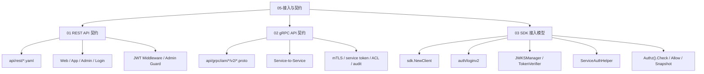
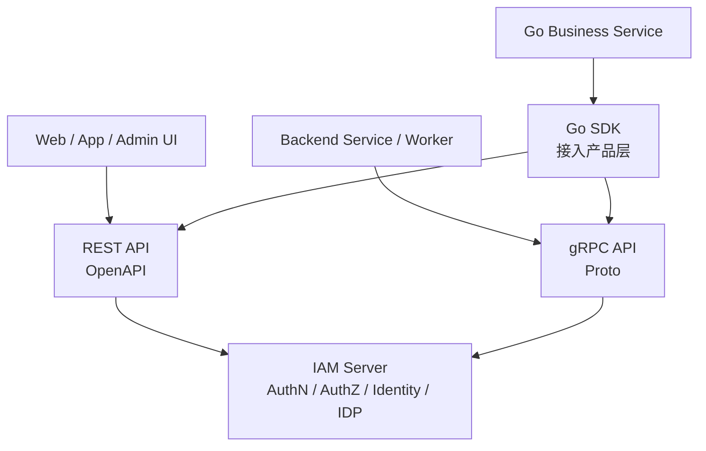

# 05-接入与契约

## 本文回答

`05-接入与契约/` 是 IAM 文档体系中解释 **外部系统如何接入 IAM，以及 REST、gRPC、SDK 三类契约如何分工** 的模块。

它回答：

1. IAM 为什么同时提供 REST、gRPC 和 Go SDK；
2. REST 适合哪些调用方，哪些场景应该走 REST；
3. gRPC 适合哪些调用方，哪些场景应该走 gRPC；
4. SDK 为什么是 Go 服务端接入产品层，而不是业务层；
5. JWT、JWKS、在线 Verify、Service Token、AuthZ Check 应该如何选择；
6. REST OpenAPI、gRPC proto、SDK public API 分别是什么事实源；
7. 接入契约如何通过测试和文档机制防止漂移；
8. 业务系统接入 IAM 时应该遵守哪些边界。

本目录只解释 **接入方式、机器契约和集成边界**。  
AuthN 登录态属于 `02-认证AuthN/`；AuthZ 权限模型属于 `03-授权AuthZ/`；Identity/ProfileLink 关系属于 `04-身份Identity/`。

---

## 30 秒结论

IAM 对外提供三层接入：

```text
REST
  -> 面向 Web、App、管理后台、登录、HTTP 调试

gRPC
  -> 面向可信服务间调用、VerifyToken、AuthZ Check、Identity 查询、IDP 内部能力

Go SDK
  -> 面向 Go 业务服务，封装 REST/gRPC/JWKS/Verifier/ServiceAuth/AuthZ/Identity/IDP
```

三者不是三套业务实现，而是同一套 IAM 能力面向不同调用方的接入投影。

事实源分别是：

| 接入方式 | 事实源 |
| --- | --- |
| REST | `api/rest/*.yaml` |
| gRPC | `api/grpc/iam/*/v2/*.proto` |
| SDK | `pkg/sdk` 公开稳定 API |

一句话：

> **REST 服务前端和管理面，gRPC 服务可信服务间调用，SDK 服务 Go 业务系统低成本接入；业务规则仍然在 IAM Server 的 AuthN/AuthZ/Identity/IDP 中。**

---

## 本目录文档

当前 `05-接入与契约/` 建议包含 3 篇正文文档：

```text
05-接入与契约/
├── README.md
├── 01-REST API契约.md
├── 02-gRPC API契约.md
└── 03-SDK接入模型.md
```

| 文档 | 作用 | 读完后应该能回答 |
| --- | --- | --- |
| `01-REST API契约.md` | 解释 REST OpenAPI 与 HTTP 接入边界 | REST 面向哪些调用方，哪些路由公开/受保护/admin/debug |
| `02-gRPC API契约.md` | 解释 gRPC proto 与服务间调用边界 | gRPC service 矩阵、metadata、安全边界和 registration 如何组织 |
| `03-SDK接入模型.md` | 解释 Go SDK 的定位与接入方式 | SDK 封装什么、不封装什么，为什么它不是业务层 |

---

## 接入知识地图



---

## 推荐阅读顺序

### 标准顺序

```text
01-REST API契约
  -> 02-gRPC API契约
  -> 03-SDK接入模型
```

原因：

1. 先理解面向用户侧和管理面的 REST；
2. 再理解服务间调用的 gRPC；
3. 最后理解 Go 服务如何通过 SDK 降低接入成本。

---

### 如果你是前端 / 管理后台接入方

推荐路径：

```text
01-REST API契约.md
  -> api/rest/README.md
  -> api/rest/authn.v2.yaml
  -> api/rest/identity.v2.yaml
  -> api/rest/authz.v2.yaml
```

重点关注：

```text
登录
token refresh / logout / verify
当前用户 me
profiles / profile-links
authz check
admin 管理路由
错误响应
```

---

### 如果你是后端服务接入方

推荐路径：

```text
02-gRPC API契约.md
  -> api/grpc/README.md
  -> api/grpc/iam/authn/v2/authn.proto
  -> api/grpc/iam/authz/v2/authz.proto
  -> api/grpc/iam/identity/v2/identity.proto
```

重点关注：

```text
VerifyToken
IssueServiceToken
AuthorizationService.Check
GetAuthorizationSnapshot
ProfileLinkQuery
IdentityRead
metadata authorization
mTLS / ACL / audit
```

---

### 如果你是 Go 服务接入方

推荐路径：

```text
03-SDK接入模型.md
  -> pkg/sdk/README.md
  -> pkg/sdk/_examples
  -> pkg/sdk/auth
  -> pkg/sdk/authz
  -> pkg/sdk/identity
```

重点关注：

```text
sdk.NewClient
ConfigFromEnv / ConfigFromViper
auth/loginv2
auth/jwks
auth/verifier
auth/serviceauth
Authz().Check / Allow / AllowScoped
Identity / ProfileLink client
sdk/errors
```

---

## 三层接入主图



这张图表达的是：

```text
REST、gRPC、SDK 是同一套 IAM Server 能力的不同接入方式
不是三套业务逻辑
```

---

## 接入方式选择规则

| 场景 | 推荐接入 | 原因 |
| --- | --- | --- |
| 用户显式登录 | REST / SDK loginv2 | 当前登录事实源是 REST AuthN v2 |
| Web/App 当前用户接口 | REST | HTTP 友好，JWT middleware，current-user 语义清晰 |
| 管理后台 | REST | OpenAPI、调试、管理面友好 |
| 服务间 VerifyToken | gRPC / SDK | 强类型、内部调用、适合 service token |
| AuthZ Check | gRPC / SDK | 高频服务间判定 |
| AuthorizationSnapshot | gRPC / SDK | 服务间授权快照与缓存治理 |
| Identity 系统侧查询 | gRPC / SDK | 后端服务查 User/Profile/ProfileLink |
| IDP 内部读取 | gRPC / SDK | 高信任内部能力 |
| Go 业务服务接入 | SDK | 减少重复 client、JWKS、Verify、ServiceAuth 代码 |
| API Gateway 本地验签 | JWKS | 标准公钥分发 |
| curl / 脚本调试 | REST | 直接可调、易观察 |

---

## REST 契约边界

### REST 定位

REST 面向：

```text
Web
App
管理后台
登录
当前用户视角
HTTP 调试
```

REST 的事实源是：

```text
api/rest/*.yaml
```

REST runtime 注册在：

```text
internal/apiserver/transport/rest
```

### REST 覆盖能力

| 能力 | 契约 |
| --- | --- |
| AuthN | `api/rest/authn.v2.yaml` |
| AuthZ | `api/rest/authz.v2.yaml` |
| Identity | `api/rest/identity.v2.yaml` |
| IDP | `api/rest/idp.v2.yaml` |
| Suggest | `api/rest/suggest.v2.yaml` |

### REST 重要边界

```text
OpenAPI 是路径、字段、schema、认证和错误响应事实源
transport/rest 只做协议适配
protected routes 依赖 JWT middleware
admin routes 依赖平台管理员授权
debug routes 是诊断面，不是业务能力承诺
```

不要把 REST 文档写成源码事实源，也不要让 REST handler 承担业务规则。

---

## gRPC 契约边界

### gRPC 定位

gRPC 面向：

```text
可信服务间调用
后端服务
worker
内部集成
SDK 底层调用
```

gRPC 的事实源是：

```text
api/grpc/iam/*/v2/*.proto
```

gRPC runtime 注册在：

```text
internal/apiserver/transport/grpc
```

### gRPC 服务矩阵

| Proto | Service | 当前能力 |
| --- | --- | --- |
| `authn/v2/authn.proto` | `AuthService` | VerifyToken、RefreshToken、RevokeToken、RevokeRefreshToken、IssueServiceToken |
| `authn/v2/authn.proto` | `AccountOnboardingService` | CreateOperationAccount |
| `authn/v2/authn.proto` | `JWKSService` | GetJWKS |
| `authz/v2/authz.proto` | `AuthorizationService` | Check、GetAuthorizationSnapshot、GrantAssignment、RevokeAssignment |
| `identity/v2/identity.proto` | `IdentityRead` | GetUser、BatchGetUsers、SearchUsers、GetProfile、BatchGetProfiles |
| `identity/v2/identity.proto` | `ProfileLinkQuery` | HasProfileLink、ListProfiles、ListProfileLinks |
| `identity/v2/identity.proto` | `ProfileLinkCommand` | EstablishProfileLink、RevokeProfileLink、BatchRevokeProfileLinks、ImportProfileLinks |
| `identity/v2/identity.proto` | `IdentityLifecycle` | CreateUser、UpdateUser、DeactivateUser、BlockUser |
| `idp/v2/idp.proto` | `IDPService` | GetWechatApp |

### gRPC 重要边界

```text
proto 字段只能追加，禁止复用 field number
proto service 必须有 runtime registration
gRPC 面向可信服务间调用，不是前端公网入口
调用方应携带 authorization metadata 和 x-request-id
mTLS / service token / ACL / audit 是服务间安全边界
```

---

## SDK 接入边界

### SDK 定位

SDK 是：

```text
Go 服务端接入 IAM 的产品化封装
```

SDK 不是：

```text
新的业务层
本地 AuthZ 引擎
本地 Identity 规则
本地 IDP 登录模块
```

### SDK 公开稳定面

当前公开稳定包包括：

```text
pkg/sdk
pkg/sdk/config
pkg/sdk/auth/client
pkg/sdk/auth/jwks
pkg/sdk/auth/verifier
pkg/sdk/auth/serviceauth
pkg/sdk/authz
pkg/sdk/identity
pkg/sdk/idp
pkg/sdk/errors
```

`transport`、`observability` 和高级错误分析能力已经收回 internal，不作为公开稳定 API。

### SDK 封装能力

| SDK 子包 | 作用 |
| --- | --- |
| `sdk.NewClient` | 初始化 gRPC conn 和 Auth/Authz/Identity/ProfileLink/IDP 子客户端 |
| `auth/loginv2` | REST AuthN v2 显式登录 |
| `auth/client` | gRPC AuthN client |
| `auth/jwks` | JWKSManager |
| `auth/verifier` | TokenVerifier，本地/远程/fallback 验证 |
| `auth/serviceauth` | 服务间 token 获取、刷新和上下文注入 |
| `authz` | Check、Allow、AllowScoped、AuthorizationSnapshot |
| `identity` | User/Profile/ProfileLink 系统侧查询与命令 |
| `idp` | 高信任 IDP 内部能力 |
| `errors` | IAMError、IsNotFound、IsUnauthorized、IsPermissionDenied 等稳定错误 facade |

### SDK 重要边界

```text
SDK 只封装调用
SDK 不定义业务规则
SDK 不替代 OpenAPI/proto
SDK 不进入 IAM Server domain/application
SDK public API 必须通过 compile test 保护
```

---

## 接入与 AuthN/AuthZ/Identity/IDP 的关系

| 模块 | REST | gRPC | SDK |
| --- | --- | --- | --- |
| AuthN | 登录、refresh、logout、verify、JWKS、account | VerifyToken、RefreshToken、RevokeToken、IssueServiceToken、JWKS | LoginV2、Auth client、JWKSManager、TokenVerifier、ServiceAuthHelper |
| AuthZ | check、roles、assignments、policies、resources | AuthorizationService.Check、Snapshot、Grant/RevokeAssignment | Authz().Check / Allow / AllowScoped / Snapshot |
| Identity | me、profiles、profile-links 当前用户视角 | IdentityRead、ProfileLinkQuery、ProfileLinkCommand、IdentityLifecycle | Identity/ProfileLink client |
| IDP | WechatApp 管理、IDP health、secret rotation、provider token 管理 | IDPService.GetWechatApp | IDP client，高信任内部能力 |
| Suggest | profile suggest | 当前无主 gRPC 入口 | 当前不作为主要 SDK 稳定面 |

---

## 机器契约与防漂移

| 契约 | 防漂移机制 |
| --- | --- |
| REST OpenAPI | `make docs-swagger`、`make api-validate`、REST router matrix tests |
| gRPC proto | `make proto-gen`、`proto_contract_test.go` |
| SDK public API | `pkg/sdk/public_api_compile_test.go` |
| 文档链接与旧事实 | `make docs-hygiene`、`scripts/check-docs-links.py` |

接入文档必须遵守：

```text
REST 路径、字段、schema 以 api/rest 为准
gRPC service、message、RPC 以 api/grpc 为准
SDK 公开 API 以 pkg/sdk 为准
运行行为以源码和测试为准
```

---

## 代码证据入口

| 主题 | 代码 / 契约入口 |
| --- | --- |
| REST 契约总览 | `api/rest/README.md` |
| REST OpenAPI | `api/rest/*.yaml` |
| REST runtime | `internal/apiserver/transport/rest` |
| REST router | `internal/apiserver/transport/rest/router.go` |
| REST module routes | `internal/apiserver/transport/rest/module_routes.go` |
| REST contract tests | `internal/apiserver/transport/rest/router_matrix_test.go` |
| gRPC 契约总览 | `api/grpc/README.md` |
| gRPC proto | `api/grpc/iam/*/v2/*.proto` |
| gRPC runtime registry | `internal/apiserver/transport/grpc/registry.go` |
| gRPC services | `internal/apiserver/transport/grpc/service` |
| gRPC proto contract test | `internal/apiserver/transport/grpc/proto_contract_test.go` |
| SDK 总入口 | `pkg/sdk/README.md` |
| SDK Client | `pkg/sdk/client.go` |
| SDK config | `pkg/sdk/config` |
| SDK auth | `pkg/sdk/auth` |
| SDK authz | `pkg/sdk/authz` |
| SDK identity | `pkg/sdk/identity` |
| SDK idp | `pkg/sdk/idp` |
| SDK errors | `pkg/sdk/errors` |
| SDK public API test | `pkg/sdk/public_api_compile_test.go` |
| 文档检查 | `scripts/check-docs-links.py` |

---

## 事实源优先级

接入与契约相关事实冲突时，按以下顺序判断：

1. **机器契约**  
   REST 看 `api/rest/*.yaml`；gRPC 看 `api/grpc/iam/*/v2/*.proto`；SDK 看 `pkg/sdk` 公开 API。

2. **运行时代码**  
   `internal/apiserver/transport/rest`、`internal/apiserver/transport/grpc`、`pkg/sdk`。

3. **契约测试**  
   REST router matrix、gRPC proto contract、SDK public API compile test。

4. **当前维护文档**  
   `docs/05-接入与契约`、`docs/08-宣讲/09-REST-gRPC-SDK接入讲法.md`。

5. **历史归档材料**  
   `_archive/` 只用于历史追溯，不作为当前事实源。

---

## 常见误区

### 误区一：REST、gRPC、SDK 是三套业务逻辑

错误。  
它们是同一套 IAM Server 能力的不同接入方式。

---

### 误区二：gRPC 比 REST 高级，所以都应该走 gRPC

错误。  
登录、前端、管理后台、HTTP 调试仍然更适合 REST。  
gRPC 更适合可信服务间调用。

---

### 误区三：SDK 是业务层

错误。  
SDK 只是接入产品层，不定义业务规则。

---

### 误区四：SDK 可以让业务方不用理解安全边界

错误。  
SDK 降低接入成本，但调用方仍要理解：

```text
JWKS local verify != Online Verify
ProfileLink != AuthZ Permission
IDP.GetWechatApp 是高信任接口
Service Token != User Token
```

---

### 误区五：文档中的路径可以替代机器契约

错误。  
路径、字段、RPC、message 必须回到 OpenAPI/proto/SDK 源码确认。

---

## 验证建议

修改接入文档或相关代码后，建议运行：

```bash
make docs-hygiene
```

REST 契约相关：

```bash
make docs-swagger
make api-validate
go test ./internal/apiserver/transport/rest
```

gRPC 契约相关：

```bash
make proto-gen
go test ./internal/apiserver/transport/grpc
```

SDK 相关：

```bash
go test ./pkg/sdk/...
```

架构边界相关：

```bash
go test ./internal/pkg/architecture
```

---

## 维护规则

### 1. README 只做接入模块入口

本 README 负责：

```text
说明 REST/gRPC/SDK 分工
列出三篇正文
提供阅读路径
提供契约事实源
说明验证与防漂移机制
```

详细协议字段和 RPC message 以机器契约为准。

---

### 2. 不把 REST/gRPC/SDK 写成业务事实源

业务规则仍然在：

```text
application
domain
infra adapter
```

REST/gRPC/SDK 只表达接入契约和调用方式。

---

### 3. 不鼓励外部调用 internal SDK 包

对外稳定 API 只能使用 `pkg/sdk` README 中声明的公开包。  
不要在文档中建议业务服务 import：

```text
pkg/sdk/internal/transport
pkg/sdk/internal/observability
pkg/sdk/internal/errorsx
```

---

### 4. 不把 IDP SDK 写成普通低风险接口

`IDPService.GetWechatApp` 和 SDK IDP client 属于高信任内部能力。  
文档中必须提醒：

```text
mTLS
service token
ACL
audit
secret 脱敏
```

---

### 5. 不恢复旧路由和旧关系术语

当前 Identity 关系术语是：

```text
ProfileLink
/profile-links
ProfileLinkQuery
ProfileLinkCommand
```

不要恢复旧关系路由或旧合同名作为 active 入口。

---

## 本文总结

`05-接入与契约/` 解释的是 IAM 如何被外部系统使用。

核心心智是：

```text
REST 面向 Web/App/Admin/Login
gRPC 面向可信服务间调用
SDK 面向 Go 业务服务低成本接入
```

但它们都不是业务规则来源。  
业务规则仍然回到 IAM Server 的 AuthN、AuthZ、Identity、IDP。

读完本目录后，读者应该能回答：

```text
什么时候用 REST？
什么时候用 gRPC？
什么时候用 SDK？
OpenAPI/proto/SDK 哪个是事实源？
JWT/JWKS/Online Verify 如何选择？
AuthZ Check 如何接入？
SDK 为什么不是业务层？
如何防止契约漂移？
```

如果只记一句话：

> **REST、gRPC、SDK 是 IAM 面向不同调用方的三种接入投影；REST 以 OpenAPI 为准，gRPC 以 proto 为准，SDK 以公开 Go API 为准，业务语义仍由 IAM Server 内部模块实现。**
