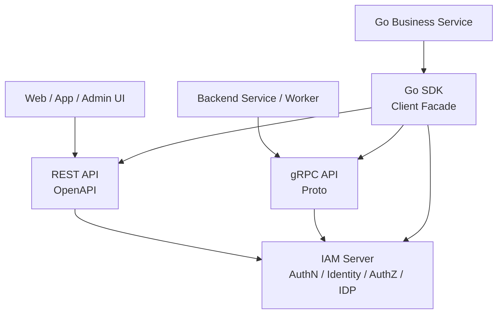
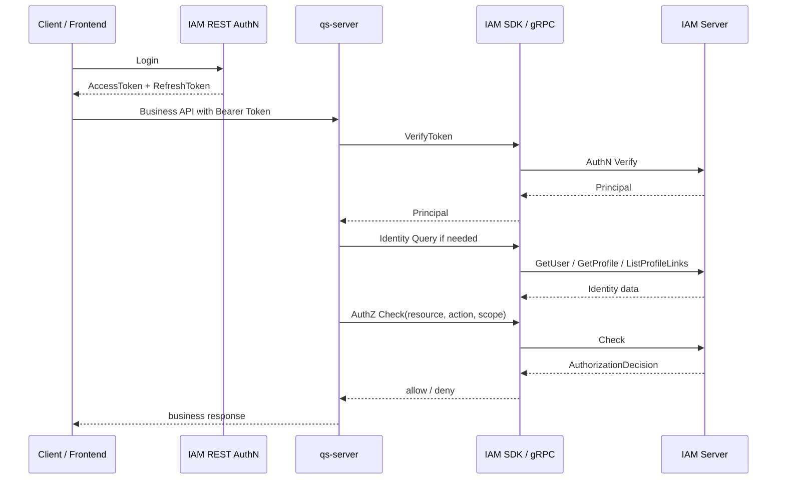

# 05-接入与契约

## 1. 模块定位

`05-接入与契约/` 是 IAM 文档体系中解释 **外部系统如何接入 IAM** 的文档组。

它不是单纯的接口列表，也不是 OpenAPI / proto / SDK GoDoc 的替代品。

它回答的是：

```text
业务系统为什么要接入 IAM？
前端、管理后台、业务后端、worker 分别如何接入 IAM？
REST、gRPC、Go SDK 分别适合什么场景？
qs-server 如何完整接入 IAM？
REST / gRPC / SDK 的事实源在哪里？
接入契约如何防止随着代码演进发生漂移？
```

IAM 对外提供的是统一身份与授权中心能力：

```text
AuthN：登录、Token、Session、Principal；
Identity：User、Profile、ProfileLink；
AuthZ：Subject、Role、Resource、Permission、RoleBinding、Check、Snapshot；
IDP：WeChat / WeCom 等外部身份源配置；
SDK：Go 服务端接入封装。
```

这些能力可以通过三种形态接入：

```text
REST；
gRPC；
Go SDK。
```

但三者不是三套业务实现。

它们是同一套 IAM 能力面向不同调用方的三种接入投影。

---

## 2. 30 秒结论

业务系统接入 IAM，不是简单调用一个登录接口。

完整接入链路通常包括：

```text
前端登录；
AccessToken / RefreshToken 获取；
业务请求携带 Bearer Token；
业务后端验证 Token；
Principal 注入请求上下文；
User / Profile / ProfileLink 查询；
业务对象映射为 Resource / Action / Scope；
调用 IAM AuthZ Check；
根据 AuthorizationDecision 放行或拒绝；
服务间调用使用 service identity；
REST / gRPC / SDK 契约持续防漂移。
```

三种接入形态的定位是：

| 接入形态 | 主要使用者 |
| --- | --- |
| REST | 前端、管理后台、调试、非 Go 调用方 |
| gRPC | 服务间调用、内部系统集成 |
| Go SDK | Go 服务端项目的工程化封装 |

核心原则：

```text
REST 服务前端和管理端；
gRPC 服务可信服务间调用；
SDK 服务 Go 业务系统低成本接入；
OpenAPI 是 REST 字段级事实源；
proto 是 gRPC 字段级事实源；
pkg/sdk public API 是 SDK 事实源；
server implementation 和 tests 决定真实行为；
docs/05 负责解释接入链路，不替代机器契约。
```

一句话：

> IAM 是其他业务系统的身份与授权中心；REST、gRPC、SDK 是三种接入投影，业务语义仍由 IAM Server 的 AuthN、Identity、AuthZ、IDP 模块实现。

---

## 3. 文档目录

新版 `05-接入与契约/` 采用 00～05 的核心文档结构：

```text
05-接入与契约/
├── README.md
├── 00-接入总览-业务系统如何接入IAM.md
├── 01-REST API契约-前端与管理端接入.md
├── 02-gRPC API契约-服务间调用与内部集成.md
├── 03-SDK接入模型-Go服务端集成.md
├── 04-业务系统接入链路-qs-server接入 IAM 详解.md
└── 05-契约事实源与防漂移机制.md
```

| 文档 | 主题 |
| --- | --- |
| `00-接入总览-业务系统如何接入IAM.md` | 从业务系统接入角度说明 IAM 的整体接入链路 |
| `01-REST API契约-前端与管理端接入.md` | 说明 REST API 的场景、分组、Header、错误语义、安全边界和 OpenAPI 事实源 |
| `02-gRPC API契约-服务间调用与内部集成.md` | 说明 gRPC 的服务间调用边界、metadata、deadline、retry、status code 和 proto 事实源 |
| `03-SDK接入模型-Go服务端集成.md` | 说明 Go SDK 的定位、初始化、AuthN/Identity/AuthZ 封装、中间件、错误、缓存和测试 |
| `04-业务系统接入链路-qs-server接入 IAM 详解.md` | 以 qs-server 为落地样板，说明登录、验 Token、身份查询、AuthZ Check、worker 接入和部署配置 |
| `05-契约事实源与防漂移机制.md` | 收口 REST/gRPC/SDK/业务接入/文档的事实源优先级、Breaking Change 和防漂移机制 |

---

## 4. 推荐阅读顺序

### 4.1 标准顺序

第一次系统阅读，推荐按顺序读：

```text
00-接入总览-业务系统如何接入IAM.md
  -> 01-REST API契约-前端与管理端接入.md
  -> 02-gRPC API契约-服务间调用与内部集成.md
  -> 03-SDK接入模型-Go服务端集成.md
  -> 04-业务系统接入链路-qs-server接入 IAM 详解.md
  -> 05-契约事实源与防漂移机制.md
```

原因是：

```text
先理解业务系统为什么接入 IAM；
再理解 REST 如何服务前端和管理端；
再理解 gRPC 如何服务内部服务间调用；
再理解 Go SDK 如何封装接入；
再用 qs-server 串起完整落地链路；
最后理解事实源和防漂移机制。
```

---

### 4.2 业务项目第一次接入 IAM

推荐路径：

```text
00-接入总览-业务系统如何接入IAM.md
  -> 04-业务系统接入链路-qs-server接入 IAM 详解.md
  -> 03-SDK接入模型-Go服务端集成.md
  -> 02-gRPC API契约-服务间调用与内部集成.md
```

重点关注：

```text
Token 验证；
Principal 注入；
Identity 查询；
ProfileLink 边界；
Resource / Action / Scope 构造；
AuthZ Check；
service identity；
配置和部署。
```

---

### 4.3 前端或管理后台接入

推荐路径：

```text
00-接入总览-业务系统如何接入IAM.md
  -> 01-REST API契约-前端与管理端接入.md
```

重点关注：

```text
登录；
刷新 Token；
退出登录；
Me / 当前 Principal；
User / Profile / ProfileLink；
AuthZ 管理接口；
Check / Snapshot；
错误响应；
Bearer Token 安全。
```

---

### 4.4 后端服务间调用

推荐路径：

```text
00-接入总览-业务系统如何接入IAM.md
  -> 02-gRPC API契约-服务间调用与内部集成.md
  -> 03-SDK接入模型-Go服务端集成.md
```

重点关注：

```text
VerifyToken；
GetUser / GetProfile / ListProfileLinks；
AuthorizationService.Check；
GetAuthorizationSnapshot；
service token；
gRPC metadata；
deadline；
retry；
status code。
```

---

### 4.5 Go 服务端接入

推荐路径：

```text
03-SDK接入模型-Go服务端集成.md
  -> 04-业务系统接入链路-qs-server接入 IAM 详解.md
  -> 05-契约事实源与防漂移机制.md
```

重点关注：

```text
sdk.NewClient；
sdk.Config；
AuthN().VerifyToken；
Identity().GetUser / GetProfile / ListProfileLinks；
AuthZ().Check / Allow / AllowScoped；
HTTP middleware；
gRPC interceptor；
SDK fake client；
error mapping。
```

---

### 4.6 维护接口契约

推荐路径：

```text
05-契约事实源与防漂移机制.md
  -> 01-REST API契约-前端与管理端接入.md
  -> 02-gRPC API契约-服务间调用与内部集成.md
  -> 03-SDK接入模型-Go服务端集成.md
```

重点关注：

```text
OpenAPI；
proto；
pkg/sdk public API；
server implementation；
contract tests；
Breaking Change；
Deprecated 机制；
qs-server 接入验证。
```

---

## 5. 接入知识地图

```mermaid
flowchart TD
    Access["05 接入与契约"]

    Overview["00 接入总览"]
    REST["01 REST API"]
    GRPC["02 gRPC API"]
    SDK["03 Go SDK"]
    QS["04 qs-server 接入"]
    Drift["05 事实源与防漂移"]

    Access --> Overview
    Access --> REST
    Access --> GRPC
    Access --> SDK
    Access --> QS
    Access --> Drift

    Overview --> Client["Client / Frontend"]
    Overview --> Backend["Business Backend"]
    Overview --> Worker["Worker / Service"]

    REST --> OpenAPI["OpenAPI"]
    REST --> Admin["Admin Console"]
    REST --> Login["Login / Refresh / Me"]

    GRPC --> Proto["proto"]
    GRPC --> S2S["Service-to-Service"]
    GRPC --> Metadata["metadata / deadline / status"]

    SDK --> GoClient["sdk.Client"]
    SDK --> Middleware["middleware / interceptor"]
    SDK --> Fake["testing fake"]

    QS --> Verify["VerifyToken"]
    QS --> Identity["User / Profile / ProfileLink"]
    QS --> Check["AuthZ Check"]

    Drift --> Contract["OpenAPI / proto / pkg/sdk"]
    Drift --> Tests["contract tests"]
```



---

## 6. 三层接入主图



这张图表达：

```text
REST、gRPC、SDK 都指向同一套 IAM Server 能力；
REST 更适合前端和管理端；
gRPC 更适合服务间调用；
SDK 更适合 Go 服务端低成本接入；
SDK 可以封装 REST / gRPC，但不改变 IAM 业务语义。
```

---

## 7. 业务系统接入主图



这张图是 `05-接入与契约/` 的核心心智：

```text
前端登录 IAM；
业务请求进 qs-server；
qs-server 通过 SDK / gRPC 验 Token、查身份、做权限判定；
IAM 维护身份事实、认证状态、授权事实和判定逻辑；
qs-server 维护业务对象和业务流程。
```

---

## 8. 接入方式选择规则

| 场景 | 推荐接入 |
| --- | --- |
| 用户登录 | REST |
| 前端刷新 Token | REST |
| 当前用户页面 | REST / 后端聚合 |
| 管理后台 | REST |
| 服务间 VerifyToken | gRPC / SDK |
| 服务间 AuthZ Check | gRPC / SDK |
| 批量 Identity 查询 | gRPC / SDK |
| Go 业务服务接入 | SDK |
| Worker 调用 IAM | gRPC / SDK |
| curl / 脚本调试 | REST |
| 本地 JWKS 验签 | SDK TokenVerifier / JWKS |
| 契约字段确认 | OpenAPI / proto / pkg/sdk |

简单规则：

```text
用户侧和管理侧优先 REST；
服务间调用优先 gRPC；
Go 服务端优先 SDK；
字段级事实回到机器契约；
业务语义回到 IAM Server 模块。
```

---

## 9. REST 契约边界

REST 面向：

```text
Web；
App；
管理后台；
登录；
当前用户视角；
HTTP 调试；
低门槛外部接入。
```

REST 的事实源是：

```text
api/rest
OpenAPI YAML / JSON
internal/apiserver/transport/rest
REST tests
```

REST 覆盖能力：

```text
AuthN：Login、Refresh、Logout、Verify、JWKS、Me；
Identity：User、Profile、ProfileLink；
AuthZ：Resource、Role、Permission、Assignment、Check、Snapshot、PolicyLinter；
IDP：WeChat / WeCom app 管理；
System：health、ready、metrics。
```

REST 重要边界：

```text
OpenAPI 是字段级事实源；
REST handler 只做协议适配；
管理接口仍需 AuthZ；
敏感字段必须脱敏；
REST 不适合所有高频服务间调用。
```

详细说明见：

```text
01-REST API契约-前端与管理端接入.md
```

---

## 10. gRPC 契约边界

gRPC 面向：

```text
可信服务间调用；
后端服务；
worker；
内部集成；
SDK 底层调用。
```

gRPC 的事实源是：

```text
api/grpc
.proto files
generated code
internal/apiserver/transport/grpc
gRPC tests
```

gRPC 覆盖能力：

```text
AuthN：Login、RefreshToken、VerifyToken、Service Token；
Identity：User、Profile、ProfileLink 查询；
AuthZ：Check、Snapshot、Assignment、Permission 管理；
IDP：外部身份源配置；
System：内部 health / runtime 状态。
```

gRPC 重要边界：

```text
proto 是字段级事实源；
gRPC service 只做协议适配；
所有调用应设置 deadline；
metadata 传递认证、caller、trace；
gRPC 不应直接公网暴露给不可信客户端；
管理 RPC 必须认证和授权。
```

详细说明见：

```text
02-gRPC API契约-服务间调用与内部集成.md
```

---

## 11. SDK 接入边界

SDK 面向：

```text
Go 业务服务；
Go worker；
Go gateway；
Go internal service。
```

SDK 的事实源是：

```text
pkg/sdk
pkg/sdk public API
SDK tests
SDK examples
```

SDK 封装能力：

```text
AuthN：Login、RefreshToken、VerifyToken、TokenVerifier、JWKS；
Identity：User、Profile、ProfileLink 查询；
AuthZ：Check、Allow、AllowScoped、Snapshot；
IDP：外部身份源配置封装；
Middleware：HTTP / gRPC Principal 注入；
Testing：fake client、stub、test helper。
```

SDK 重要边界：

```text
SDK 封装 REST / gRPC；
SDK 不复制 IAM 数据库；
SDK 不直接操作 Casbin；
SDK 不本地维护 Role / Permission / RoleBinding；
SDK 不替代 IAM Server；
SDK public API 必须通过测试保护。
```

详细说明见：

```text
03-SDK接入模型-Go服务端集成.md
```

---

## 12. qs-server 接入边界

qs-server 是 IAM 的典型业务接入方。

推荐链路：

```text
Client Login at IAM
  -> Client calls qs-server with Bearer Token
  -> qs-server VerifyToken
  -> Principal in context
  -> qs-server loads business object
  -> qs-server builds Resource / Action / Scope
  -> IAM AuthZ Check
  -> allow / deny
```

qs-server 应保存：

```text
iam_user_id；
iam_profile_id；
tenant_id；
业务对象 owner / origin；
业务对象与 IAM 主体的引用关系。
```

qs-server 不应保存：

```text
LoginIdentity；
Credential；
AccessToken / RefreshToken；
Role；
Permission；
RoleBinding；
Casbin rule；
IDP AppSecret。
```

关键边界：

```text
ProfileLink 是身份关系，不是最终权限判定；
敏感业务操作必须调用 AuthZ Check；
业务状态判断留在 qs-server；
认证、身份事实、授权事实和判定留在 IAM。
```

详细说明见：

```text
04-业务系统接入链路-qs-server接入 IAM 详解.md
```

---

## 13. 机器契约与防漂移

接入契约事实源包括：

```text
REST：OpenAPI + REST handler + REST tests；
gRPC：proto + generated code + gRPC tests；
SDK：pkg/sdk public API + SDK tests + examples；
业务接入：qs-server 接入代码 + 集成测试；
文档：docs/05 作为人类理解入口。
```

事实源优先级：

```text
机器契约 / 源码 / 测试
  > 人类文档
  > 历史讨论
  > 旧 README / 旧示例
```

常见防漂移机制：

```text
OpenAPI 校验；
proto 生成；
SDK public API compile test；
REST / gRPC transport tests；
qs-server integration tests；
docs-hygiene；
示例代码编译测试。
```

详细说明见：

```text
05-契约事实源与防漂移机制.md
```

---

## 14. 代码与契约入口

| 主题 | 入口 |
| --- | --- |
| REST 契约 | `api/rest` |
| REST runtime | `internal/apiserver/transport/rest` |
| gRPC 契约 | `api/grpc` |
| gRPC runtime | `internal/apiserver/transport/grpc` |
| SDK public API | `pkg/sdk` |
| SDK examples | `pkg/sdk` / `examples`，以当前代码为准 |
| AuthN 文档 | `docs/02-认证AuthN` |
| AuthZ 文档 | `docs/03-授权AuthZ` |
| Identity 文档 | `docs/04-身份Identity` |
| 接入文档 | `docs/05-接入与契约` |
| qs-server 接入 | qs-server 仓库接入代码与配置 |

事实冲突时：

```text
先看 OpenAPI / proto / pkg/sdk public API；
再看 server implementation；
再看 tests；
再看接入方代码；
最后更新 docs。
```

---

## 15. 验证建议

修改接入文档或相关代码后，建议运行：

```bash
make docs-hygiene
```

REST 契约相关：

```bash
make docs-swagger
make api-validate
go test ./internal/apiserver/transport/rest/...
```

gRPC 契约相关：

```bash
make proto-gen
make api-validate
go test ./internal/apiserver/transport/grpc/...
```

SDK 相关：

```bash
go test ./pkg/sdk/...
```

如果有 examples：

```bash
go test ./examples/...
```

具体命令以项目 Makefile 和 CI 为准。

---

## 16. 常见误区

### 16.1 REST、gRPC、SDK 是三套业务逻辑

错误。

它们是同一套 IAM Server 能力的三种接入投影。

---

### 16.2 gRPC 更高级，所以所有场景都应该走 gRPC

错误。

前端、登录、管理后台、HTTP 调试仍然更适合 REST。

gRPC 更适合可信服务间调用。

---

### 16.3 SDK 是业务层

错误。

SDK 是 Go 客户端封装，不定义业务规则。

业务规则仍在业务服务和 IAM Server 各自边界内。

---

### 16.4 SDK 可以替代 IAM Server

错误。

SDK 不拥有身份事实、认证状态、授权事实和权限判定事实源。

这些仍由 IAM Server 维护。

---

### 16.5 ProfileLink 可以替代 AuthZ Check

错误。

ProfileLink 是身份关系。

敏感资源访问必须通过 Resource / Action / Scope 做 AuthZ Check。

---

### 16.6 文档中的接口字段可以替代机器契约

错误。

字段、schema、RPC、message、SDK 方法必须回到 OpenAPI、proto 和 `pkg/sdk` 确认。

---

### 16.7 IAM 调用失败可以当成权限拒绝

错误。

`Allowed=false` 是权限拒绝。

网络错误、timeout、IAM unavailable 是系统错误。

业务系统必须区分 401、403、500 / Unavailable。

---

## 17. 维护规则

### 17.1 README 只做接入模块入口

本 README 负责：

```text
说明接入模块定位；
列出 00～05 文档；
提供阅读路径；
提供接入知识地图；
说明 REST / gRPC / SDK / qs-server / 防漂移的总边界。
```

详细协议字段、RPC message、SDK method 以对应正文和机器契约为准。

---

### 17.2 不把接入文档写成接口全集

接口全集由机器契约维护：

```text
REST 字段看 OpenAPI；
gRPC 字段看 proto；
SDK 方法看 pkg/sdk public API。
```

接入文档负责解释：

```text
场景；
链路；
边界；
事实源；
排查；
维护规则。
```

---

### 17.3 不把 AuthN / AuthZ / Identity 细节重复写一遍

本目录只解释接入。

模块内部模型分别见：

```text
02-认证AuthN；
03-授权AuthZ；
04-身份Identity。
```

---

### 17.4 不鼓励外部调用 internal 包

业务服务应使用：

```text
pkg/sdk public API；
REST API；
gRPC API。
```

不要在文档中建议业务服务 import：

```text
internal/apiserver/...；
internal/pkg/...；
infra/mysql；
infra/casbin。
```

---

### 17.5 旧接口、旧文档名、旧术语必须清理

新版目录已经确立：

```text
00 接入总览；
01 REST；
02 gRPC；
03 SDK；
04 qs-server 接入；
05 契约事实源与防漂移。
```

不要再恢复旧目录：

```text
01-REST API契约.md；
02-gRPC API契约.md；
03-SDK接入模型.md；
```

如果历史文档仍存在，应迁移或归档。

---

## 18. 本文总结

`05-接入与契约/` 的核心不是写接口说明书，而是解释 IAM 如何被其他系统稳定接入。

核心心智是：

```text
REST 面向前端、管理后台、调试和非 Go 调用方；
gRPC 面向可信服务间调用和内部集成；
Go SDK 面向 Go 服务端低成本接入；
qs-server 是业务系统接入 IAM 的落地样板；
OpenAPI、proto、pkg/sdk public API 和 server implementation 是契约事实源；
docs/05 是人类理解入口；
tests 和 CI 负责防漂移。
```

如果只记住一句话：

> IAM 通过 REST、gRPC、Go SDK 三种投影服务外部系统；前端通过 REST 登录，业务后端通过 gRPC / SDK 验 Token、查身份、做 AuthZ Check，契约事实源分别回到 OpenAPI、proto、pkg/sdk 和 server implementation。
