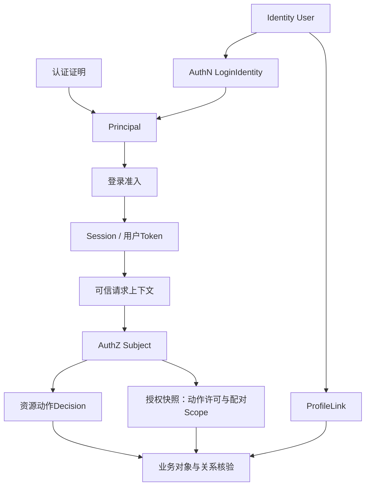

# 身份、认证与授权为什么必须分开

> 状态：已实现 · 本文解释当前跨模块设计的约束与取舍；方案比较是依据现有代码的分析，不冒充最初的决策记录。

## 1. 先看三个会产生不同结果的场景

拆分 Identity、AuthN 和 AuthZ 的依据，是它们需要处理不同的事实变化。它们可以在同一进程里协作，但“知道是谁”“允许完成登录”“允许执行某个动作”“允许操作这个对象”需要分别成立。

| 场景 | 可以成立的事实 | 仍可能失败的判断 |
| --- | --- | --- |
| 一个 User 同时有用户名密码入口和微信入口 | 两个 LoginIdentity 引用同一 UserID | 一个入口停用，不代表另一个入口或所有业务关系也被删除 |
| 密码正确，但 User 已被封禁 | 凭据核验成功，产生 Principal | Admission 拒绝，不能创建 Session 或交付 Token |
| 用户已登录并有某动作许可 | Token 有效，AuthZ Check 返回允许 | 目标对象可能在其他公司/门店，或者业务状态不允许此次操作 |

这三个场景要求系统能够表达独立结果。若只有一个“已登录/有权限”的布尔值，调用方就无法判断该重新登录、停止业务操作，还是处理依赖故障。

本文围绕这些场景解释边界。对象字段、不变量和完整时序仍分别由 [Identity](../02-业务模块/01-Identity/README.md)、[AuthN](../02-业务模块/02-AuthN/README.md)、[AuthZ](../02-业务模块/03-AuthZ/README.md) 的主题正文维护。

## 2. 同一 User 有多个入口：为什么身份锚点不随登录方式变化

设 User U 同时绑定用户名入口 L1 和微信入口 L2。密码材料属于 L1 的 Credential；微信入口通过 provider 证明定位 L2；两个入口最终映射到同一个 U。

User 管理内部主体是否 active/blocked；Identity 通过独立的 ProfileLink 保存业务档案关系。LoginIdentity 管理某个 provider 命名空间中的入口归属与状态。Credential 管理密码材料和失败计数。它们有不同的操作范围：

- 密码失败计数、锁定或重哈希影响对应 Credential。
- 一个 LoginIdentity 被禁用后，在线准入不能继续接受该入口。
- User 被封禁后，各入口即使能证明控制关系，也不能通过当前 User 状态准入。
- 业务档案与 ProfileLink 不因某个密码材料变化而重新创建。

这些规则解释了为什么不能直接用 openid 或用户名作为所有业务表的主体主键。openid 需要 appID 所表达的 realm；用户名和手机号也可能变更。若业务关系都引用外部标识，增加登录方式、解绑或迁移 provider 时，就必须在业务表中同步改写“同一主体”的认定。当前用 UserID 作为稳定引用，把入口变化限制在认证映射内。

这并不意味着“User 内部维护登录入口集合”无法实现。对于入口很少、生命周期也较简单的系统，集合模型可以减少引用和查询。当前选择独立 LoginIdentity/Credential，是因为绑定、停用、凭据锁定、并发唯一性和 provider 扩展各有规则。付出的代价是更多 ID 引用、仓储查询，以及 SignUp 等用例中的跨聚合事务编排。

事实来源：[Principal](../../internal/apiserver/domain/authn/authentication/principal.go)、[AuthN 模型](../02-业务模块/02-AuthN/01-领域模型与认证策略.md)、[注册 UoW](../02-业务模块/02-AuthN/02-注册登录与身份绑定.md)。入口集合方案属于取舍分析，当前实现并未采用它。

## 3. 密码正确但 User 已封禁：为什么 Principal 不是登录成功

身份核验只确认此次证明对应哪一个内部主体，以及本次认证方法、realm、AMR 和时间。它不能提前证明接下来所有步骤都能完成。

当前 `SignIn.Execute` 的顺序是：

```text
选择登录方式并构造 Proof
  -> 身份核验，得到 AuthDecision
  -> 记录 CredentialEffect
  -> 成功时取得 Principal
  -> Admission 读取当前 User/LoginIdentity 状态
  -> 建立 Session
  -> 颁发并保存初始 RefreshToken
  -> 交付完整登录 Result
```

已装配的 CredentialRecorder 在拒绝结果返回前执行 CredentialUpdate 中的意图，让密码错误先经过失败计数处理。向上传播的记录错误会终止流程；当前 CredentialNotFound 被视为 no-op 的例外由 [AuthN 模型](../02-业务模块/02-AuthN/01-领域模型与认证策略.md#42-密码核验结果和凭据更新必须一起理解)维护，不能承诺所有副作用必定持久化。

再看封禁场景：即使核验已经返回 Principal，`completeLogin` 仍先执行 Admission。User 被封禁时返回业务拒绝；如果仓储读取或评估失败，则返回评估错误。两个分支都不继续创建 Session。代码在这里区分了三种含义：

| 结果 | 系统知道什么 | 可以继续做什么 |
| --- | --- | --- |
| 核验成功 | 证明对应当前 Principal | 进入准入，不直接签发 |
| Admission 拒绝 | 当前事实不允许完成登录 | 结束登录用例 |
| Admission 评估出错 | 无法确认当前是否可以登录 | 返回错误，不能当作通过，也不能假装已确认业务拒绝 |

只返回一个 `false` 会把“User 确实被封禁”与“读取 User 失败”混在一起。两者都应停止登录，但排障、重试和调用方提示不同。当前的 Decision/error 分离保留了这一差别。

准入通过也不是最终成功。Session 创建后，主体对齐检查、Token mint 或初始 RefreshToken 保存仍可能失败。当前应用层在这些失败时尝试撤销已建立的 Session；补偿使用不随请求取消而取消的独立上下文，并有5秒超时。补偿仍可能失败，此时保留原失败和补偿失败，不能声称 MySQL、Redis 与签发行为被同一个事务完全回滚。

具体顺序见 [sign_in.go](../../internal/apiserver/application/authn/signin/sign_in.go)、[completion.go](../../internal/apiserver/application/authn/signin/completion.go)。已有 [completion_test.go](../../internal/apiserver/application/authn/signin/completion_test.go) 覆盖 blocked 拒绝、不建立认证状态、初始刷新令牌保存，以及请求取消后的补偿。完整失败矩阵归 [Token 链路](../02-业务模块/02-AuthN/05-关键链路-Token签发刷新吊销.md)。

因此，Principal 保持为请求内核验结果，不携带 SessionID，也不是持久登录通行证。Session 负责一段登录期的在线状态，Token 负责把声明交给调用方。这种分工付出了阶段调用和补偿成本，但使失败发生在哪一步可以被解释和验证。

## 4. 进入资源请求后：为什么认证结果还要映射成 Subject

登录流程中的 Principal 不直接穿越所有后续请求。后续请求携带 AccessToken，由选定的 verifier 验证，再把可信 Claims 映射为本次请求上下文。

当前 REST 认证中间件只接受用户 access token，并指定目标 audience。验证通过后，`applyVerifiedClaims` 从 Claims.UserID 写入请求上下文，并构造 `subject.NewUserRef`。AuthZ 中间件再用可信 UserID、路由定义的 Resource/Action 调用授权能力；客户端提交一个格式合法的 UserID 不能代替这条来源链。

这次转换只复用稳定主体标识：

```text
登录核验：Proof -> Principal(UserID, LoginIdentityID, AuthContext)
资源请求：AccessToken -> verified Claims -> trusted UserID -> Subject.Ref
授权判定：Subject.Ref + ResourceKey + Action -> Decision
```

Principal 解释证明来源；Subject.Ref 表达哪一个稳定主体接受赋权和判定。把完整 Principal 当成 AuthZ 输入，会把密码、provider、认证方法和登录流程的变化传播到动作授权模型；当前只映射 UserID，使授权事实可以在不重新登录的情况下变化。

代价是授权层不拥有完整认证证明，也不能替调用方决定是否要求更近的认证时间。高风险动作需要额外的认证强度、近期认证或业务状态检查时，应在相应入口明确要求，不能因为存在 Subject 就推断这些条件已经满足。

实际入口见 [JWT 中间件](../../internal/pkg/middleware/authn/jwt_middleware.go)、[AuthZ 中间件](../../internal/pkg/middleware/authz/middleware.go)。当前领域 [Request](../../internal/apiserver/domain/authz/authorization/request.go) 仅包含 Subject、ResourceKey、Action；没有对象属性或旧 tenant 输入。

## 5. 动作允许但对象不允许：为什么 Scope 不混入 Check

假设一个操作者在公司 C 的门店 S1 获得某项资源动作许可，另一个请求要操作 S2 的对象。动作许可回答“是否具备这种能力”；Assignment Scope 回答“这项能力附着在哪些业务范围”；对象是否真正属于 S1/S2，则仍由业务系统加载和判断。

当前两种读取合同各自完成不同任务：

| 合同 | 交付的结果 | 消费者后续责任 |
| --- | --- | --- |
| Check | 对 Subject/Resource/Action 的 Decision | 核验业务对象和本次操作条件 |
| Scoped Authorization Snapshot | 权限与其 Assignment Scope 的配对事实 | 匹配资源/动作，再合并同公司范围，并执行查询/对象过滤 |

需要 Scope 的消费方不能先把全部 Assignment 范围合并，再套到任意已允许动作。一个角色在 S1 的动作许可，不应借用另一个角色在 S2 的不同许可来扩大范围。快照保留许可与 Scope 的配对，就是为了让消费方能沿授予关系求出正确范围。缺失 Scope 也不能解释为全公司。

这一配对由 [permissionScopes](../../internal/apiserver/infra/authz/runtime/scopes.go) 在匹配资源/动作的 Grant 后求范围，[scopes_test.go](../../internal/apiserver/infra/authz/runtime/scopes_test.go) 明确覆盖“其他动作在S2的范围不能扩大当前动作在S1的范围”。这里的 Scoped Snapshot 指经过 [SDK校验](../../pkg/sdk/authz/scope.go) 的结果：要求`scope_contract_version=1`及正数PolicyVersion，拒绝旧生产者或畸形范围；合法的空范围表示无数据访问，不能与合同缺失混为一谈。

本仓库选择不让 AuthZ 加载每一种业务对象。这样 IAM 不必跟随业务表和状态机演进，但接入方要承担实际过滤、归属核验和缓存管理。若把业务对象属性集中送入通用授权引擎，可以统一一部分判定；代价是对象来源、属性可信度、版本、规则语言和故障语义都成为新的合同。当前属性条件已退役，不能把这个候选方案写成现有能力。

完整范围合同和无损校验见 [AuthZ gRPC/SDK](../02-业务模块/03-AuthZ/06-关键链路-gRPC服务间授权与SDK.md) 与 [Scope 迁移](../operations/assignment-scope-migration.md)。

## 6. ProfileLink为什么不能直接成为所有动作的许可

ProfileLink 说明 User 与 Profile 的业务关系，Assignment 说明 Subject 被分配了什么直接角色，PermissionGrant 说明 Role 获得什么 Resource/Action。把它们合成一个“关联即允许”规则，会失去动作差异。

例如，允许联想查询某个档案，并不同时允许导出、修改或删除该档案。关系撤销也不能只更新浏览器中的按钮；真正的对象读取和操作仍需检查当前业务事实。

Suggest提供了当前代码中的具体分工：AuthZ adapter读取 `list_all`、`search_by_mobile_all`、`search_by_mobile` 等动作许可，再由visibility policy组合显式ProfileID、OrgID与owner匹配，得到 `visibility.Scope`，这些普通范围条件是OR。当前OperatorID来自可信IAM UserID，默认reader按profiles.created_by读取档案；ProfileLink join用于索引候选资格和手机号，不是以监护关系生成可见范围。索引负责候选召回，SelectionPolicy再执行过滤、排序和返回限制。AuthZ并没有直接生成这个搜索范围，也没有把Assignment门店Scope转换给Suggest。

这说明业务关系可以参与某个用例的可见性策略，却不能反向成为所有 Resource/Action 的授权事实。若把 ProfileLink 变化直接翻译为角色/Grant 写入，还需要定义两份事实如何提交、撤销、重试和对账；否则关系已撤销、授权投影仍允许的窗口会变成隐式问题。

具体实现与限制见 [FactsReader](../../internal/apiserver/infra/suggest/authorization/facts_reader.go)、[Suggest 查询](../02-业务模块/05-Suggest/03-关键链路-SuggestProfile查询.md)、[Identity 关系链路](../02-业务模块/01-Identity/03-关键链路-建立与撤销ProfileLink.md)。当前过渡范围读取的缺口由 Suggest 正文维护，不将它包装为完整的通用对象授权。

## 7. 各阶段如何衔接，以及它们仍有怎样的时间窗口



图说明依赖与结果转换，不表示这些读取拥有一个跨系统事务。登录时的允许也不能冻结到今后的所有请求。

| 检查层 | 观察的事实 | 时间窗口与代价 |
| --- | --- | --- |
| 本地 JWKS 验证 | 签名、目标声明和时间 | 不读取实时 Session/User/LoginIdentity；降低中心依赖，也保留撤销窗口 |
| IAM 在线验证 | Token、Session及当前主体/入口准入 | 增加网络和状态存储依赖；仍无法锁住检查后的所有业务变化 |
| AuthZ Check/Snapshot | 当前可用授权快照 | 依赖策略收敛和新鲜度门禁；没有全实例已加载屏障 |
| 业务系统 | 对象归属、状态、关系与过滤结果 | 必须与本次业务写入的事务/并发规则衔接，IAM不能代为完成 |

例如，Token 签名仍有效，但 Session 已撤销。仅本地验签不能发现这个状态；在线验证会读取在线状态。另一个例子是 Assignment 刚被撤销，旧授权快照仍可能短暂存活；当前 AuthZ 以版本事件、数据库对账和新鲜度门禁收敛，不能宣称写入成功就代表全部副本已切换。

单次AuthZ读取内部使用同一份策略，但Check后再取Scope可能跨版本：例如先得v9的ALLOW，撤权v10发布后读到已无许可的范围投影。两个返回不能拼成同版本证明；比较版本也不锁住之后的策略或业务对象。应用投影排除无具体应用段的全局通配Grant，不能当作任意Check的等价展开，细节归[授权判定](../02-业务模块/03-AuthZ/02-关键链路-授权判定与不可变快照.md)。

更严格的请求一致性、业务对象检查后被并发修改等问题，需要请求级版本约束、业务锁或事务等额外设计。具体状态与传播合同归 [Session/Token](../02-业务模块/02-AuthN/03-Session-Token与JWKS.md) 与 [多实例策略收敛](../02-业务模块/03-AuthZ/04-关键链路-多实例策略收敛.md)。

故障也不能统一降级为“没有权限”。当前授权入口有明确的区别：

| 情况 | REST动作检查 | gRPC Check |
| --- | --- | --- |
| 正常动作拒绝 | 403 | 成功响应中的`allowed=false` |
| 策略不可用 | 503 | `Unavailable`错误 |
| 其他内部判定错误 | 500 | 按错误合同映射，不能伪造正常Decision |

但不能由此推断所有认证故障也能从外部响应区分。当前 [JWT中间件](../../internal/pkg/middleware/authn/jwt_middleware.go) 把verifier调用错误和Token无效都映射为401；排障还需结合内部错误与依赖状态。授权的503合同见 [错误码](../../internal/pkg/code/authz.go) 与 [gRPC入口](../../internal/apiserver/transport/grpc/service/authz/service.go)。消费者不能把依赖故障当成已确认的业务拒绝，也不能默认放行。

## 8. 为什么没有选择一个统一对象或统一远程引擎

| 候选方案 | 适合的条件与收益 | 当前场景需额外承担的设计 |
| --- | --- | --- |
| User内部维护入口、材料和角色集合 | 变化少、操作简单时更直接，少一些引用 | per-entry生命周期、并发唯一性、多个事实源和短期状态仍需分别管理 |
| 登录时冻结全部权限到JWT | 本地判定快，授权服务不在每次请求上 | 撤权生效时间、范围体积、版本失效和敏感动作都需补充协议 |
| 所有认证/授权/对象判断统一远程求值 | 便于集中审计和统一调用入口 | 中心依赖、业务对象获取与属性可信度，以及检查后的事务窗口 |
| 合成一个中间件封装调用 | 调用方接入简单 | 内部仍应保留核验、准入、授权、业务规则的独立结果与错误 |

当前选择的是模块化单体内的职责拆分与显式协作，而不是要求每种模型独立部署。收益是能定位事实所有者、生命周期和失败责任；代价是阶段编排、跨聚合提交、Redis/DB补偿和派生状态收敛必须认真维护。

拆分是否合理，要看变更是否能在清晰的责任内完成、必要协作能否表达真实合同。只看包的数量，或把所有状态放进同一个大对象，都不足以证明设计质量。

## 9. 如何用源码与回归验证本文

| 设计判断 | 证据入口 | 应检查的行为 |
| --- | --- | --- |
| 核验成功不等于完整登录 | [SignIn完成流程](../../internal/apiserver/application/authn/signin/completion.go)、[回归](../../internal/apiserver/application/authn/signin/completion_test.go) | 准入拒绝/故障时无Session；建立失败执行补偿；完整Token才返回 |
| Subject来自可信认证结果 | [JWT映射](../../internal/pkg/middleware/authn/jwt_middleware.go)、[回归](../../internal/pkg/middleware/authn/jwt_middleware_test.go) | audience/token type约束；可信UserID写上下文并映射Subject |
| 动作请求不加载业务对象属性 | [Request](../../internal/apiserver/domain/authz/authorization/request.go)、[Evaluator回归](../../internal/apiserver/domain/authz/authorization/evaluator_test.go) | Subject/Resource/Action与匹配证据 |
| 允许/拒绝/故障独立处理 | [AuthZ中间件](../../internal/pkg/middleware/authz/middleware.go)、[回归](../../internal/pkg/middleware/authz/middleware_test.go) | 拒绝不进handler；故障不放行、不伪造正常Decision |
| 可见性组合归Suggest | [FactsReader](../../internal/apiserver/infra/suggest/authorization/facts_reader.go)、[回归](../../internal/apiserver/infra/suggest/authorization/facts_reader_test.go) | 通用动作许可映射为查询事实，最终可见范围由用例策略完成 |

```bash
go test ./internal/apiserver/application/authn/signin ./internal/pkg/middleware/authn ./internal/pkg/middleware/authz ./internal/apiserver/domain/authz/authorization ./internal/apiserver/infra/suggest/authorization
make docs-hygiene docs-facts docs-validation-tests
```

这些入口验证源码合同与本地回归；部署版本、真实对象过滤和业务验收需要对应环境的独立证据。
