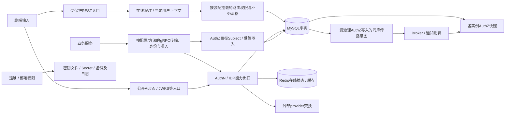

# IAM威胁模型与安全边界：攻击前提、阻断层与剩余责任

> 状态：已实现 · 2026-10-07按main `3a12cd4b`核对入口、证明、授权与材料出口；候选设计未实施，目标配置、生产攻击、监控有效性及事故处置未在本轮验证。

威胁模型要说明：攻击者能控制什么，试图把哪种输入变成可信事实，当前哪一层拒绝，跨过这一层后还剩谁的责任。IAM的JWT、mTLS、数据库约束和Outbox分别保护不同边界；算法或组件存在，不证明浏览器关联、有限委派、对象归属、即时撤销或副本保密已经成立。

本篇维护全IAM攻击链与验收命题，不重复端口算法。身份链归[Login](../02-业务模块/02-AuthN/04-关键链路-Login登录认证.md)与[Linking](../02-业务模块/02-AuthN/03-关键链路-Linking登录身份绑定.md)，授权误用归[AuthZ加固](../02-业务模块/03-AuthZ/09-安全加固与发布验收.md)，网络/材料分别归[传输](../03-基础设施/05-传输层与服务间安全.md)、[密码学](../03-基础设施/04-密码学密钥与令牌.md)和[日志处置](../05-工程质量与运维/04-安全日志与凭据处置.md)。

## 1. 保护对象先按权限与副本划界

| 攻击者已有能力 | 试图跨越的边界 | 重点保护对象与当前限制 |
| --- | --- | --- |
| 匿名终端控制header/body/query、state/code | 输入→已核验身份 | password/OTP/provider proof；公开入口不是每次先JWT |
| 已登录用户控制对象ID、动作请求 | 登录身份→他人关系/业务权限 | Profile关系、策略配置、搜索候选；登录本身不提供全部对象权 |
| 获准业务服务或其证书被攻陷 | 调用服务→目标Subject、管理集合/来源声明 | IAM认证服务caller，不自动证明其传来的终端用户和真实门店归属 |
| 读取数据库、Redis、日志或备份 | 离线材料→秘密/身份/签名能力 | hash、密文、Refresh key、PEM及原payload各不同；API脱敏不保护这些副本 |
| 写数据库、替换文件或控制部署输入 | 存储/配置→受信当前事实 | cipher包归属、key/JWK配对、PolicyVersion协议；应用约束不能替代受控写权限 |
| 控制部分网络、依赖或Broker输入 | 外部响应/事件→结果与可用性 | SDK信任/重定向、超时未知、target与载荷；确认/健康不是业务接受 |

同一个人可能跨多类权限，须记录真实范围。例如“仅读密文数据库”与“同时获得master key”不是同一攻击前提；服务证书泄漏也不自动等于全部REST管理权限泄漏。MySQL/Redis、PEM、部署Secret、消息、指标、heap与备份分别列owner和副本，不以一个“数据安全”状态概括。

## 2. 地图中的箭头表示可达能力，不是统一认证顺序



[REST装配](../../internal/apiserver/transport/rest/module_routes.go)分别注册公开认证、Identity用户上下文、AuthZ管理和Suggest；基础/debug/OPTIONS等另有路径。不能把“schema+JWT+AuthZ，缺一即拒绝”写成全REST合同。受保护组缺JWT时可能不注册，而Suggest在JWT可用但AuthZ不可用分支仍可只挂JWT。各环境、直接组件调用、非标准装配和实际暴露路径须逐项核对。

gRPC的网络信任、证书caller、RPC ACL和业务管理准入是分层判断，AuthZ Assignment管理RPC还会要求可信服务身份。测试中注入peer/caller只证明后续判断，不证明TLS握手；锁定SDK的HTTP/JWKS与统一gRPC也有各自配置。初始HTTPS URL不自动限制后续重定向；Go默认敏感header特殊规则不能自动保护X-IAM-Seed-Secret等自定义header，但也不能据此认定所有请求秘密都会跨域流出。代理IP或metadata关联ID同样不自动成为可信用户事实。

SeedMock是另一类共享秘密入口：typed选项默认关闭，生产模板却启用并要求注入非空shared_secret；当前Validate没有release禁止。路由按共享secret恒时比较，不再要求JWT/AuthZ/IP或环境资格。可达入口与secret泄露共同成立时，攻击者可使用该mock能力；配置/边缘隔离和秘密owner须另取证，不能写“生产自动禁止mock”。

## 3. 身份证明：拒绝了什么，仍没证明什么

| 攻击链/前提 | 当前阻断与精确范围 | 剩余窗口及验证责任 |
| --- | --- | --- |
| 猜密码、伪造可用Credential | password策略检查身份/凭据与失败/锁定；Argon2id验证材料 | Disabled、Locked、错误密码等分类不同，不承诺全部入口统一错误；当前标准hasher为空pepper |
| OTP猜测/滥发、替换Challenge | scene/期限/摘要及仓储消费，gate和逐维quota | 多步骤发送/补偿不共同提交；同摘要新代次、真实provider成本与限流分布式行为另验 |
| 重放扫码state、混登录与绑定scene | Challenge type/scene/期限/state hash，一次消费并恢复App/User上下文 | nonce被保存/返回，消费输入没有回调nonce比较；没有完整浏览器发起关联保证 |
| 已获登录态后绑定攻击者入口 | 公开REST在线认证并注入UID；Link检查非零UID、原AuthenticatedAt、新证明与归属/唯一性 | Link自身不重读User准入；AMR与recent-auth不是MFA，gRPC服务负责终端断言真实性 |
| 解绑使账户无法再登录 | User归属、特定分支recent-auth、仓储锁内“最后active入口”保护 | 不对所有外部入口统一要求recent-auth；active数量不证明剩余凭据/provider能用 |
| 复制Access/Refresh、尝试持续重放 | 在线marker/Session/Admission；Refresh CAS与consumed记录 | SDK本地成功不查在线状态；CAS输家撤SID可使赢家pair失效，丢回复也可能触发重发/撤销 |

### 3.1 OAuth state不是完整nonce或浏览器关联证明

[OAuthState](../../internal/apiserver/domain/authn/challenge/oauth_state.go)消费输入只有Scene/State/Now；Nonce是记录中的流程值，不是provider回传值的核验。公开扫码Start从服务端配置取AppID/RedirectURI，终端不能靠body改这两个目标，但state本身不核对浏览器cookie或原发起客户端。小程序/企微直接换code的路径也不经过这份IAM state。

扫码绑定保存发起UserID；Complete先消费state，再检查ExpectedUserID，随后Link检查原认证时间。因此错用户或认证过旧的请求可能使合法state不能复用；绑定Complete直接使用state中的AppID，没有请求AppID比较。扫码登录另在消费后比较请求AppID，不匹配也拒绝。一次消费与最终成功是两件事，不能把失败重试写成原证明一定可重放。若要求可验证客户端关联或nonce校验，需要明确验证方、字段与失败时机，而不是只增加一个字段。

### 3.2 登录、在线可用与本地可信签名各自成立

在线Verifier读取撤销marker、活跃Session与MySQL User/LoginIdentity准入，但不重新将SID的User/LoginIdentity/Org与claims逐项对齐；可信签名仍是这些声明的前提。标准装配没有subject状态缓存，多次读取也没有共同瞬间，不冻结已经获准的后续业务动作。改密码/锁定Credential不自动等同撤销既有Session，因为在线准入不读取每个Credential状态。密码核验/结果写入也不是并发请求屏障；完整入口/并发与材料成本回链Login主文。

SDK默认本地优先，只有符合fallback条件的本地错误才调用remote；本地成功不查询Session/User。它承诺签名/算法/声明合同，不承诺即时在线撤销。跨实例AuthZ也只在读取入口检查有期限的证明。精确交付未知、补偿物理残留、在途及撤权时序见[一致性专题](02-事务缓存与事件一致性.md)，本篇不以“有rotation/短TTL”推导所有被复制凭据已失效。

## 4. 授权攻击：调用服务、目标主体与管理权不得合并

### 4.1 Confused deputy可以使用完全合法的Subject

```text
用户17已登录，body提交合法 subject=user:42
  → 获准服务未从可信登录上下文构造Subject，而原样调用Check
  → IAM判定的是用户42权限，返回ALLOW
  → 服务把该结果用到用户17的动作
```

此为错误接入的条件推演，不是已确认生产漏洞。Subject格式校验只验证user/group/service与正数ID；mTLS证明调用服务，不重新核验被查User准入，也不自动将AppName绑定caller。宿主须从已验证上下文构造Subject，从服务器合同选择Resource/Action，并将结果用于同一操作者与对象。`service:root`会被语法拒绝，却不能阻止合法`user:42`被错用。完整三个身份归[服务间授权](../02-业务模块/03-AuthZ/06-关键链路-gRPC服务间授权与SDK.md)。

受管服务写Assignment有caller配置的SubjectType/roles及protected边界，完整snapshot可读事实也不扩大可写集合。ChangedBy是来源标注，不是IAM已认证终端用户；被攻陷服务可在其管理集合内错误断言来源，审计应分别保存可信caller与请求声明，不把两者合成一个actor。

### 4.2 策略配置权不是能力子集委派

普通REST操作者已拥有Role且具有permission_grants/create时，当前可向该Role添加目录中自己此前没有的业务能力。服务检查Role保护、资源/动作目录与固定敏感承载规则，没有要求新能力是操作者原集合的子集，也不自动按Org限制目标。六组敏感能力要求特定protected承载，不等于所有管理权限都具有可委派上界。

资源目录末段可用`*`，普通Grant action拒绝`*`；可信系统入口另可广域授权，仍受承载/加载校验。不能泛写“wildcard都禁止”或“所有配置管理员只能授自己的权限”。若开放公司管理员，候选需同时规定可授予集合、目标主体/Role范围、撤回与审计成本。具体触发和正反样本归[REST管理](../02-业务模块/03-AuthZ/05-关键链路-REST管理与路由授权.md#42-grant创建权是策略配置权)。

### 4.3 公司/门店Scope依赖真实业务对象

当前Scope验证ID/形态和请求公司一致，不查Store存在、真实归属或caller所属公司。业务服务须读真实对象，再把匹配resource/action的同条结果Scopes应用于查询/操作。

例如read只许Store10，write只许Store20；先把两条范围并成{10,20}再用于write，会扩成未授权Store10。终端company/store声明不能替代领域归属，Check也不接受ObjectContext来做这些判断。关系资格与JWT组织上下文同样不自动由动作ALLOW证明。

### 4.4 撤权传播不是全局瞬时拒绝

Outbox、通知、版本核对与完整快照降低漏通知/半加载风险；默认60秒门禁约束充分读取/加载开始时的证明年龄，不从撤权commit起算。已知target领先仍可读预算内旧ALLOW，ACK/readiness不独立证明全体覆盖，在途与下游缓存另有责任。

更强版本barrier需绑定实际求值快照、请求所需目标、实例集合及超时/在途策略。它会支付读/等待或拒绝成本，目前未实现。现场拒绝与恢复应按写入、发送/结算、实例水位、请求输入和对象范围取证，不能只重复revoke或依赖写接口200。

## 5. 密钥与材料：保密、归属、当前资格分别判断

| 材料/攻击前提 | 当前保护 | 不提供的保证 |
| --- | --- | --- |
| JWT私钥文件或备份可读 | 未加密PKCS PEM，创建目录0700/文件0600；数据库保存public JWK/元数据 | 目标现有权限、挂载/备份保密另验；不是经IDP Vault加密或KMS/HSM |
| 只读IDP密文库 | AES-GCM包，以部署输入master key解密 | 同时获得key失去这层保密；包无key代次/AAD归属与旧包防重放 |
| 能搬动同key下有效cipher包 | GCM认证有效包 | AAD=nil，不能据认证通过证明属于此App/此用途或是最新；攻击仍需实际写权限 |
| 读取密码材料 | 带盐Argon2id，标准装配无非空pepper接线 | 不保证异常PHC成本/格式全有界，也不提供已部署独立pepper或完整枚举防护 |
| 改PEM/JWK、切换Secret或缓存 | 启动材料检查、数据库active guard、各自刷新 | 不持续冻结文件、在途签发或两层AppToken；材料/元数据/发布不共同提交 |

私钥泄漏可让攻击者制作可信签名，IDP AppSecret泄漏影响外部应用能力，数据库hash泄漏影响离线猜解；响应不能统一称“改密码”。在线key适配器逐次检查当前资格，但已取key的在途签名和SDK缓存没有全实例屏障；旧key停用、JWKS发布、Session/Access撤销及消费结果分别观察，只清Redis不使本地验签失效。

IDP CallbackToken另以明文落库，不能把全部IDP秘密都写成AES保护。禁用App阻止相应Resolver，不自动阻止GetWechatApp/GetAccessToken；Secret轮换也不执行provider撤销、使既有IAM Session失效或清两层AppToken。包保护、业务状态、出口准入和provider失效分别取证。

主密钥包没有旧key路由/rewrap；仅换配置会使旧包无法用新key读取，相同Secret的fingerprint no-op也不重加密。候选须定义带版本的包、App/用途绑定、独立迁移/CAS、旧格式和恢复材料；AAD本身不解决旧包重放。KMS/envelope候选只有连同权限分离、代次与调用审计设计才有意义，不能给当前Vault更换一个名称就当成已获得这些能力。

## 6. 搜索与副本泄漏不能只看返回字段

### 6.1 Suggest有资格、召回和输出三个面

标准AuthZ可用分支挂search权限，查询再组合能力、visibility与Store；AuthZ缺失分支可能仅JWT。FactsReader内部nil checker返回零能力事实，却不清空owner/同Org/ProfileID的局部OR许可；ScopeResolver真正缺facts接口时则返回零Scope，不能混用两个nil合同。实时visibility查不到已删Profile，也可能被旧Store owner分支放行。能力多次Check又没有共同版本，详见[查询合同](../02-业务模块/05-Suggest/03-关键链路-SuggestProfile查询.md)。

当前选择器在最终limit前过滤，但CandidateBudget在更早的召回阶段截断，无权候选仍可能占召回预算；不能据过滤顺序宣称不会遗漏可见候选或无侧信道。mask只改变输出手机号，不移除内存原值、数值匹配、命中/数量/排序信号。模块EnvironmentProduction分支禁止关闭mask，直接Service.DisableMask或其他装配另验；限流可用性也不等于隐私资格正确。

若要求撤销即时不可见或抵抗枚举，候选要让所有OR分支依赖可信资格，定义能力共同水位、召回/重复请求预算和输出策略。手机号HMAC索引也要验精确/前缀检索合同、key代次和可见性，不能只换字段编码就承诺解决资格泄漏。

### 6.2 logger省略正文不等于全部材料出口无秘密

APILogger和指定gRPC logger优先记录metadata；它们不展开body，却不覆盖指标、依赖hook、panic、业务error或消息审计。通用HTTP指标含完整URL/query/Host；RedisHook对AUTH/HELLO外参数截断仍可能输出含Refresh原值的key；LogSender可记录phone/code，release只拒显式log而空Provider还可回退。以上都是带装配前提的源码路径，不据此认定线上已泄露。

IDP有合法秘密交付出口：gRPC GetWechatApp可解密返回AppSecret，Token接口返回AppToken。RPC准入与接收方保管是两层责任，不能由“API不返回secret”证明副本安全。失败审计还保存原payload/metadata/cause，heap、SQL、备份、容器日志与采集平台各可绕过在线输出mask。

日志护栏只扫描指定文件/片段，不是所有出口的数据流证明。完整error分类、生产GORM Silent、旁路、处置及副本owner归[安全日志](../05-工程质量与运维/04-安全日志与凭据处置.md)；普通日志、request ID、Gauge不等于防篡改安全审计或已部署有效报警。

当前pprof Register在通用server中被注释，EnableProfiling选项存在不证明现役暴露；可选dump middleware、heap/core和备份仍需各自核验。指标默认注册/采集材料与实际外部暴露范围也不同；不能由本仓路径认定目标网络已可读，或由logger测试推导这些副本安全。

## 7. 依赖失败按失去的语义分类

| 失效对象 | 当前行为与适用范围 | 剩余责任 |
| --- | --- | --- |
| 在线Session/marker/User读取失败 | 对应Verify/Refresh拒绝，标准身份状态继续在线检查 | 不撤回在途，不影响已经本地验签的结果；各策略另看 |
| AuthZ reload/通知失败 | 保留完整旧快照，入口证明超限拒绝；readiness用fresh与syncReady，最近reloadErr不单独决定 | 预算内旧ALLOW可能继续，探针摘流不能推为全局撤权 |
| provider交换失败 | 需要该交换的分支失败，不把错误当身份成功 | 可信legacy输入、mock与直接组件是不同路径；实际生产准入须核配置 |
| Suggest限流/刷新失败 | Redis limiter错误固定warn后允许；QPS≤0关闭，缺Redis可回内存；曾成功刷新仍可健康 | 不增加手机号/对象能力，不是通用Redis fail-open；枚举预算、旧投影与超龄另有窗口 |
| 指标/审计/关闭失败 | 不同出口有记录、继续或资源保留分支 | 没有统一“全部可继续”或“全部失败退出”，详细观测/关闭合同回链 |

[通用gRPC构造](../../internal/pkg/grpc/server.go)在mTLS关闭且单向TLS证书/私钥缺一时，可能未安装transport credentials；`Insecure=false`本身不能证明TLS已经启用。标准process另有mTLS配置映射和更严材料要求，不能将直接构造结果写成生产配置事实。Unary前置mTLS/凭证/ACL拒绝到不了后置Audit；handler panic展开到外层Recovery也绕过Audit尾部，锁定依赖还将panic值写入Internal message。错误mapper、配置映射或字符串护栏通过，不证明真实握手、统一错误净化或全部拒绝都有审计事件。

“有TLS/密钥/目录校验”也不证明全部部署输入受控。标准Options的production-like门禁、直接构造与自定义SDK输入不同；代理、证书、Secret、账号权限、debug暴露及采集端状态须绑定真实配置/二进制。外部证据未取到时标unknown，不用源码默认值填成生产事实。

## 8. 应急推演是设计合同，不是已执行处置

| 触发与owner | 先判定的事实与后续接受 | 避免的误操作 |
| --- | --- | --- |
| 疑似JWT私钥泄漏；AuthN/部署/消费方 | 绑定kid、材料/访问、签发窗口与消费策略；分别停止签发、可信新材料、发布/缓存和旧对象拒绝的结果 | 只rotate或清Session就宣称旧签名全失效；为可用性继续信任已泄漏材料 |
| 撤权后仍ALLOW；AuthZ/业务宿主 | 绑定请求实例、可信Subject、资源/动作/真实对象、committed/target/loaded/proof及消费缓存 | 只追发送ACK或再次revoke；忘记混用Scope与管理权限含义 |
| IDP轮换后调用失败/仍用旧token；IDP/部署/provider | 绑定密文/主密钥代次、provider实际生效、两层缓存及在途holder，分开恢复与失效 | 只改master key或Redis删除范围；把仓储Update当provider撤销 |
| 日志/备份可能暴露材料；副本/凭据owner | 先停止不当出口，限定受控材料与复制范围，再按验证合同失效、登记处置/恢复结果 | 将秘密再贴公开工单；把删除本地文件当远端/备份抹除 |

当前三种清理CLI（Refresh、六族登录状态、指定日志）默认dry-run，apply需各自确认；dry-run仍访问目标，确认短语不证明操作者权限、目标或停写。它们不覆盖全部维护动作。删除结果可能partial/outcome_unknown，范围外副本、SDK本地信任和provider材料另有owner；本轮没有运行这些命令。

[部署备份](../../scripts/cd/remote-deploy.sh)只打包配置与日志，不覆盖数据库或私钥卷，tar失败仍继续；[数据库备份/恢复](../../scripts/dbops/database-operation.sh)以gzip和目录0700/文件0600保护副本，没有内容加密。restore校验gzip后直接流入MySQL，不自动证明空目标、停写、可信源摘要、完整回滚或恢复后的业务可用性。离线副本保密、资产配套与恢复接受须逐项登记，不能把SQL流完成写成账户与旧Token已正确恢复。

应急接受必须包括拒绝样本、仍应成功样本和恢复样本，保存受控目标/配置/版本、数量、摘要及操作依据。普通审计interceptor不提供一份不可篡改合规平台；防篡改schema、访问/保留和批准事实是候选要求，不能把日志格式当作已完成治理。

## 9. 增强方案必须针对尚未成立的合同

| 缺口 | 具体候选与责任 | 成本与验收 |
| --- | --- | --- |
| 流程与终端关联/高风险绑定资格 | AuthN/客户端定义state发起关联、nonce验证方、按操作统一step-up及失败消费时机 | 客户端/协议兼容、恢复与存量窗口；验错用户、错scene/客户端、过旧认证及证明消费失败 |
| 管理权超过有限委派 | AuthZ/管理宿主定义可授予集合、目标Role/Subject/公司范围与可信actor | 额外委派模型/存量校准；验普通能力扩张、完整facts只读、ChangedBy与caller分账 |
| key/cipher当前资格与归属 | 密码学/IDP/部署定义包代次/AAD/CAS、旧材料迁移与消费缓存观察 | 材料保管/新旧兼容/恢复；验合法包跨行、旧包重放、同Secret no-op及晚归缓存 |
| 陈旧许可与过量暴露 | AuthZ/Suggest/宿主定义请求水位、共同资格、所有OR分支与限流/召回预算 | 拒绝/延迟与检索成本；验旧owner、混动作版本、断通知及实际超龄 |
| 诊断旁路与副本治理 | 观测/副本owner定义有界标签、秘密类型出口、受控审计与保留 | 诊断信息减少、存量副本处置/访问成本；逐出口/错误/恢复样本，不只关键词扫描 |

这些不是全IAM安全通过证明。更强MFA、family治理、独立迁移runner或KMS也须落入具体调用、材料与恢复合同后验收；“增加一种组件”不能替代上述权限/数据流设计。

## 10. 源码、测试与现场证明分别登记

本篇结合真实装配、证明消费、服务caller/管理准入、Scope配对、材料和日志出口复核。本轮新执行Linking的3个顶层用例和4个子项，共7run/pass、1个package pass另计；另复用2026-10-06/07原日志的95run/pass（58顶层、37子项），没有重跑。原包回执跨来源去重为27份、涉及25个不同包；不能将这些数字合称本轮新验证或独立生产场景。来源/工具摘要、原日期及未覆盖项见[阶段台账](../_data/reviews/2026-10-06-docs-refactor.md)。

| 证据 | 支持的命题 | 仍未证明 |
| --- | --- | --- |
| 新Linking替身用例 | 普通Link在消费新证明前要求最近认证；特定Unlink不要求它；扫码绑定错用户不调用下游Link | 真实state消费后失败、并发最后active入口、HTTP/mTLS或provider交换 |
| 复用Challenge/Redis、验签与Key生命周期用例 | 选定scene/一次消费、fallback分类、在线key当前资格；生命周期替身mutation成功返回后，刷新失败不推翻结果 | 真实DB commit/AfterCommit、完整nonce/浏览器关联、真实Redis持久性、在途/全实例撤销或PEM副本安全 |
| 复用路由/配置、caller、Suggest与Runtime用例 | 局部入口/共享secret、本机临时CA/loopback mTLS的选定证书/方法准入、能力/mask/配额与旧快照 | 目标环境PKI/握手、连接运行后到期或reload、有限委派、完整拒绝审计、全部OR/侧信道、Redis错误分支 |
| 复用日志护栏、mapper与清理helper | 固定片段、指定错误、临时文件/miniredis的确认/范围/部分结果 | 全出口净化、防篡改审计、真实清理/恢复、远端或备份副本处置 |

静态绑定不扩大逐文件行为覆盖；新92源在原执行调用中于内存先捕获后核对，JSON在执行后保存，缺独立前置文件。旧Go二进制摘要不能用当前工具补填。源码攻击链是带前提的推演，不证明生产已存在该漏洞。

```bash
make docs-hygiene docs-facts
python3 scripts/test-docs-release-validation.py
git diff --check
```

这是本批main已有入口；撰写阶段独立工作区另执行的`docs-validation-tests`增强目标未随本批发布。本篇未改源码、机器契约或测试，没有读取真实秘密、运行攻击/处置/生产验收；目标部署权限、证书/缓存/材料与监控效果均需独立证据。
